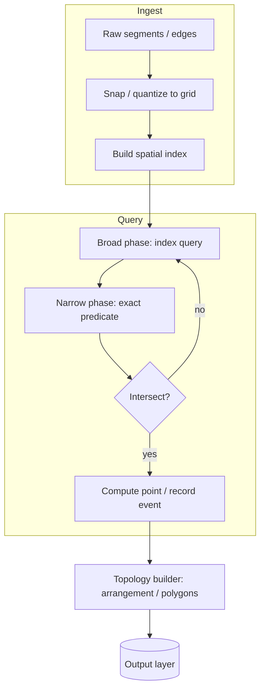
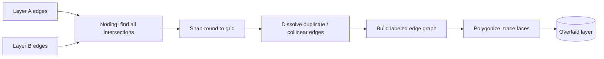
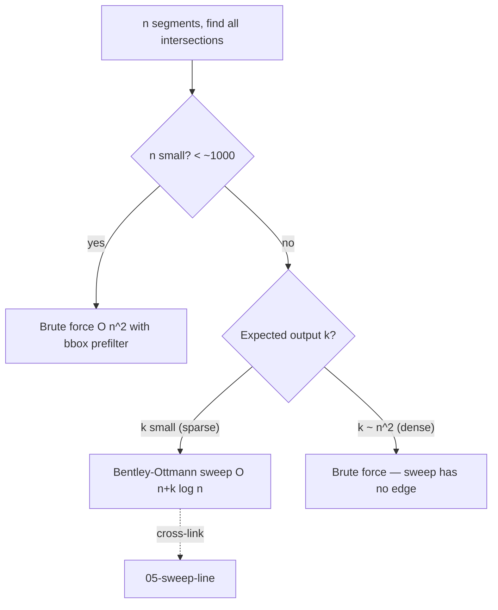
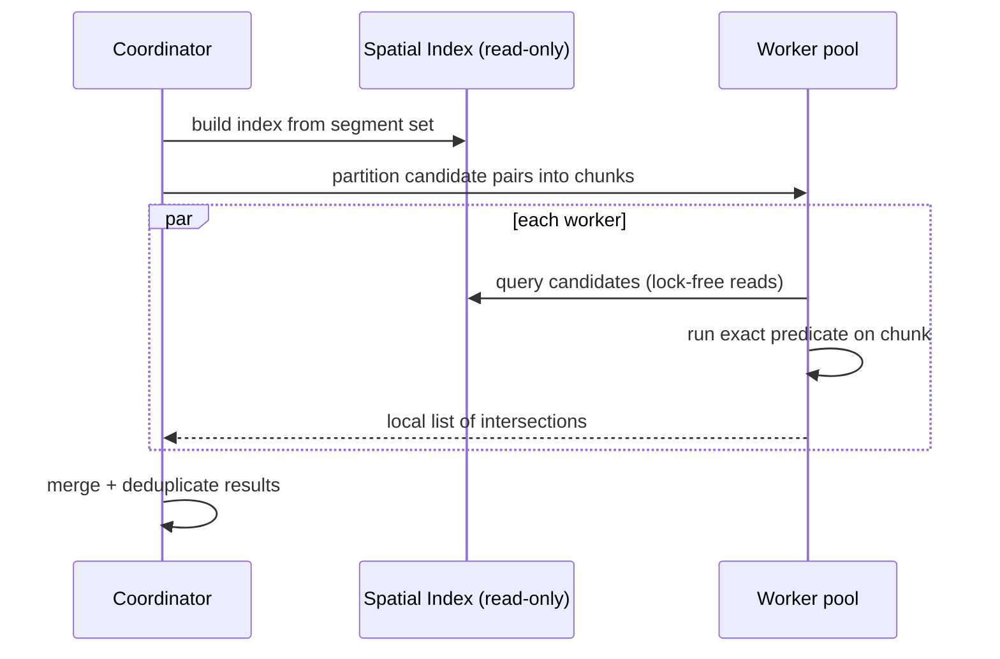

# Line and Segment Intersection — Senior Level

> A single segment intersection is three multiplies. A GIS overlay of two road networks is **tens of millions** of segments; a CAD boolean on a mechanical assembly is millions of edges with sub-micron tolerances; a physics engine runs intersection tests **thousands of times per frame** under a 16 ms budget. At that scale the predicate is not the product — the spatial index, the exact-arithmetic policy, the degeneracy handling, and the failure recovery are. This file is about architecting intersection at production scale.

## Table of Contents

1. [Introduction](#1-introduction)
2. [System Design — Where Intersection Lives](#2-system-design--where-intersection-lives)
3. [GIS Map Overlay at Scale](#3-gis-map-overlay-at-scale)
4. [CAD / Geometry Kernels and Exact Predicates](#4-cad--geometry-kernels-and-exact-predicates)
5. [Collision Systems in Games and Robotics](#5-collision-systems-in-games-and-robotics)
6. [Batch All-Pairs vs Sweep Line — The Decision](#6-batch-all-pairs-vs-sweep-line--the-decision)
7. [Concurrency — Parallel Intersection](#7-concurrency--parallel-intersection)
8. [Comparison at Scale](#8-comparison-at-scale)
9. [Architecture Patterns](#9-architecture-patterns)
10. [Code Examples — Spatially-Indexed Batch Intersection](#10-code-examples--spatially-indexed-batch-intersection)
11. [Observability](#11-observability)
12. [Failure Modes](#12-failure-modes)
13. [Capacity Planning](#13-capacity-planning)
14. [Summary](#14-summary)

---

## 1. Introduction

At junior and middle level, intersection is a self-contained function. At senior level it is a **subsystem** with three properties that drive every architectural decision:

- **It is called astronomically often.** Overlaying two 10-million-edge layers naively is `10^14` pairwise tests — impossible. The spatial index, not the predicate, determines feasibility.
- **It must be exact, or the topology breaks.** A floating-point predicate that flips sign near zero produces *inconsistent* answers: segment A crosses B, B crosses C, but A "doesn't" cross C in a way that violates planarity. Downstream polygon-building code then loops forever or emits garbage. Exactness is a correctness requirement, not an optimization.
- **Degeneracies are the norm, not the exception.** Real data has coincident endpoints, overlapping collinear roads, three lines through one point, and snapped coordinates. The 5% of code handling degeneracy is 95% of the bugs.

The senior skill is choosing, per system, **how much exactness to buy** and **which spatial structure** turns the quadratic blow-up into something near-linear.

A useful framing for the whole file: every decision below is a trade against a **failure budget**. A game can tolerate a one-micron collision error but not a dropped frame; a CAD kernel can tolerate a slow boolean but not a corrupted solid; a map server can tolerate neither a sliver polygon nor a multi-second overlay. Naming the failure budget first makes the exactness and indexing choices fall out almost mechanically.

---

## 2. System Design — Where Intersection Lives



Every production intersection pipeline has the same shape: a **broad phase** that uses a spatial index to propose *candidate* pairs cheaply, and a **narrow phase** that runs the exact predicate only on those candidates. The broad phase kills the `O(n²)`; the narrow phase guarantees correctness. Sweep-line (`05-sweep-line`) is one specific, elegant fusion of both phases for the "all intersections" problem.

The narrow phase is exactly the per-pair predicate from `junior.md`/`middle.md`; nothing about scale changes that two-segment math. What scale changes is *everything around it* — which pairs to feed it, in what arithmetic, and how to recover when it disagrees with itself near a degeneracy. Keep that mental split: the predicate is settled; the system is the work.

---

## 3. GIS Map Overlay at Scale

**Map overlay** is the canonical GIS operation: combine two vector layers (e.g. land parcels × flood zones, road network × administrative boundaries) into one. The core computational step is finding **every intersection** between the segments of the two layers, then rebuilding polygons from the resulting **arrangement**.

| Layer | Typical size | Intersection load |
|-------|--------------|-------------------|
| County road network | 1–10 M segments | overlay vs zoning: millions of crossings |
| Building footprints (a city) | 0.5–5 M edges | overlay vs flood map |
| Census tracts × watersheds | 100k–1M each | full planar overlay |

Why exactness is non-negotiable here: the overlay output feeds a **polygon reconstruction** that walks the arrangement's edges in angular order around each vertex. If the predicate is inconsistent (segment A–B crosses but the recomputed vertex says it doesn't lie on A), the walk produces a non-planar mess — slivers, gaps, or infinite loops. Robust GIS engines (PostGIS/GEOS, JTS) therefore use either **exact rational arithmetic** or **snap-rounding** to a fixed grid so that all coordinates are representable and predicates are consistent.

Two industrial strategies:

- **Snap-rounding.** Quantize all coordinates to an integer grid up front. Intersections are then computed exactly in integers, then snapped back to grid points. Trades a bounded geometric perturbation for guaranteed topological consistency. Used by GEOS's `OverlayNG`.
- **Exact predicates + lazy evaluation.** Keep floating-point coordinates but evaluate the orientation/intersection predicates with adaptive exact arithmetic (Shewchuk-style, see `professional.md`). Coordinates stay continuous; only the *decisions* are exact.

The spatial index for overlay is almost always an **STR-tree (Sort-Tile-Recursive R-tree)** or a uniform grid, queried with each segment's bounding box to find candidates from the other layer.

### Worked overlay pipeline

Concretely, a robust overlay (mirroring GEOS `OverlayNG`) runs these stages:



1. **Noding** — the step this topic powers: split every edge at every intersection so the result is a set of non-crossing edges meeting only at endpoints. This is the all-intersections problem, solved with a sweep or grid.
2. **Snap-rounding** — round every node to the grid so coordinates are exactly representable and no new (spurious) crossings are introduced.
3. **Dissolve / merge** — collapse coincident and collinear duplicate edges (the boundary cases from `junior.md` matter here).
4. **Label & polygonize** — tag each edge with which input polygons lie on each side, then trace closed faces.

The reliability of the entire pipeline hinges on step 1's predicate being *consistent*: if noding misses or invents a single crossing, polygonization produces an invalid (non-closed or self-overlapping) polygon, and the error is reported far downstream where it is hard to trace. This is why GIS engines invest so heavily in robust intersection.

### Quantifying overlay cost

For two layers of `n` edges each with `k` cross-layer intersections:

```text
noding (sweep)      :  O((n + k) log n)
snap-round          :  O(n + k)
polygonize          :  O((n + k) log(n + k))    (sort edges around each node)
total               :  O((n + k) log(n + k))
```

The `k` term dominates on dense overlays (e.g. a fine flood grid over dense parcels), which is why production engines also offer **prepared geometries** (pre-indexed one layer) when the same layer is overlaid against many others, amortizing the index build.

---

## 4. CAD / Geometry Kernels and Exact Predicates

A CAD kernel (ACIS, Parasolid, OpenCASCADE) performs **boolean operations** (union, intersection, difference) on solids. The 2-D heart of these is line/curve intersection on the faces. Requirements differ sharply from GIS:

- **Tolerances are absolute and tiny** (microns on a meter-scale part) — relative epsilons mislead.
- **Designers create exact degeneracies on purpose** — two faces meant to be flush, edges meant to be collinear. The kernel must recognize *intended* coincidence, not treat it as noise.
- **A single wrong predicate corrupts the B-rep** (boundary representation), and the error propagates through every downstream feature.

CAD kernels therefore lean hardest on **exact arithmetic** and **symbolic perturbation** (Simulation of Simplicity) to break ties deterministically. The cost — exact arithmetic is 5–50× slower than floats — is justified because a corrupted solid is a far more expensive failure than a slow boolean.

| Domain | Coordinate model | Predicate strategy | Why |
|--------|------------------|--------------------|-----|
| GIS overlay | snap-rounded integers | exact integer / snap | topological consistency over millions of edges |
| CAD kernel | float + exact predicates | adaptive exact + SoS | sub-micron tolerance, intended degeneracy |
| Game collision | float | fast float + epsilon | speed > exactness; visual error tolerated |
| Robotics planning | float + safety margin | conservative (inflate obstacles) | err toward "collision" for safety |

---

## 5. Collision Systems in Games and Robotics

Real-time systems invert the trade-off: **speed dominates, and small geometric error is invisible to the user.** A 60 fps game has ~16 ms per frame for *all* systems; collision might get 2–4 ms while testing thousands of segment/edge pairs.

The architecture is again broad-phase + narrow-phase, but tuned for frame budgets:

- **Broad phase:** a **uniform grid**, **BVH** (bounding volume hierarchy), or **sweep-and-prune** (a 1-D specialization of sweep-line that exploits *temporal coherence* — objects barely move between frames, so last frame's sorted order is almost still sorted, giving near-`O(n)` updates).
- **Narrow phase:** plain floating-point segment intersection with a tolerance epsilon. Exactness is unnecessary; a collision detected one micron early is fine.

Robotics adds a safety asymmetry: a **false negative** (missing a collision) can crash a robot, while a **false positive** merely makes it cautious. So planners **inflate obstacles** (Minkowski sum with the robot's radius, sibling `10-minkowski-sum`) and use *conservative* predicates that round toward "collision." The intersection test here is biased on purpose.

### Sweep-and-prune in detail

Sweep-and-prune (SAP) is worth understanding as the game-industry specialization of the sweep line. Each object's AABB projects to an interval `[lo, hi]` on each axis. SAP keeps these interval endpoints **sorted per axis**; two objects can collide only if their intervals overlap on *every* axis. The trick is **temporal coherence**: between frames, objects move little, so the sorted endpoint lists are nearly sorted, and re-sorting with **insertion sort** is `O(n + s)` where `s` is the number of swaps (small). Each swap toggles an overlap pair in/out of the candidate set. This gives near-`O(n)` broad-phase updates per frame versus `O(n log n)` for a fresh sort — the difference between a smooth and a stuttering game.

```text
frame t   : endpoints already sorted from t-1
move objs : endpoints shift slightly
re-sort   : insertion sort, O(n + swaps)   ← swaps ≈ number of overlap changes
update    : each swap adds/removes one candidate pair
narrow    : run segment/SAT test on candidate pairs
```

The narrow phase then runs the actual segment (or polygon-edge) intersection from `junior.md`/`middle.md`. SAP degrades on the "all objects clustered on one axis" pathology (every interval overlaps on that axis), which is the temporal-coherence analogue of the broad-phase blowup.

### CAD boolean degeneracy — a worked failure

Consider a boolean union of two rectangles that share an edge exactly (designer-intended flush faces). The shared edge produces **collinear overlapping segments** — precisely the `junior.md` boundary case. A naive float predicate computes the two edges' orientation as a tiny nonzero value (round-off), concludes they "cross" at a spurious near-endpoint point, and emits a **sliver face** of near-zero area. That sliver then fails subsequent operations (its normal is undefined). The robust fix is exactly the theory of `professional.md`: an exact predicate recognizes the collinearity as a true zero, the overlap is handled as a shared edge (not a crossing), and the union is clean. This single example explains why CAD kernels pay the exact-arithmetic tax.

---

## 6. Batch All-Pairs vs Sweep Line — The Decision

The central senior decision for "find all intersections among `n` segments."



| Approach | Time | Space | Wins when |
|----------|------|-------|-----------|
| Brute force + bbox prefilter | `O(n²)` worst, far better typical | `O(n)` | `n` small, or output `k` near `n²` (dense). |
| Spatial index (R-tree/grid) + narrow phase | `~O(n log n + candidates)` | `O(n)` | huge `n`, candidates cheap to enumerate, dynamic data. |
| Bentley-Ottmann sweep | `O((n + k) log n)` | `O(n)` | static set, output-sensitive (`k` ≪ n²). **→ `05-sweep-line`** |

Key insight: the sweep line is **output-sensitive** — it pays only for intersections that actually exist (`k`). If almost every pair crosses (`k ≈ n²`), the sweep's `log n` factor makes it *lose* to brute force. Know your `k` before choosing. The Bentley-Ottmann algorithm itself is the subject of `05-sweep-line`; this topic supplies its narrow-phase predicate and intersection-point math.

---

## 7. Concurrency — Parallel Intersection

Segment-segment tests are **embarrassingly parallel** — each pair is independent, read-only on the input. This makes batch all-pairs trivially parallelizable; the sweep line, by contrast, is inherently sequential (it processes events in x-order) and resists parallelization.



Design rules:

- **Build the index once, then make it immutable** for the query phase — readers need no locks.
- **Partition by candidate pairs, not by segments**, to balance load (a few "hub" segments may dominate).
- **Collect per-worker result lists and merge**, avoiding a shared contended output structure.
- For the **sweep line**, parallelize across *spatial strips* (split the plane into vertical bands, sweep each independently, then stitch the boundaries) rather than trying to parallelize a single sweep.

---

## 8. Comparison at Scale

| Attribute | Float predicate | Exact integer | Adaptive exact (Shewchuk) | Rational (`big.Rat`) |
|-----------|-----------------|---------------|---------------------------|----------------------|
| Speed | fastest (1×) | fast (~1–2×) | fast when non-degenerate (~1.5×), exact when needed | slowest (5–50×) |
| Correctness | fails near zero | exact (bounded coords) | always exact | always exact |
| Coordinate range | full float | limited (overflow risk) | full | unbounded |
| Used by | game engines | competitive programming, snapped GIS | CGAL, robust kernels | CAD, symbolic geometry |
| Memory | minimal | minimal | small extra | grows with arithmetic depth |

Production guidance: **default to float + epsilon for real-time, exact integer for snapped/bounded data, adaptive exact (CGAL/Shewchuk) when you need both speed and guaranteed correctness on continuous coordinates.**

### Real systems and their choices

| System | Domain | Intersection strategy |
|--------|--------|-----------------------|
| **GEOS / JTS** (PostGIS) | GIS overlay | `OverlayNG`: snap-rounding + robust noding |
| **CGAL** | research/CAD | `Arrangement_2`, exact predicates + inexact constructions |
| **Clipper2** | 2-D polygon clipping | integer coordinates, exact, Vatti-style sweep |
| **Box2D / Bullet** | game physics | float SAP broad phase + float narrow phase |
| **OpenCASCADE** | CAD kernel | tolerance-based with exact fallbacks |
| **Shapely** | Python GIS | wraps GEOS — inherits its robustness |

The throughline: the more a wrong answer costs (corrupted solid, invalid polygon), the further the system moves toward exact arithmetic; the more *speed* costs (dropped frame), the further it moves toward float. There is no universally correct choice — only a correct choice *for a stated failure budget*.

---

## 9. Architecture Patterns

These three patterns recur in every mature intersection subsystem regardless of domain; treat them as the default skeleton and deviate only with reason.

### Broad-phase / narrow-phase separation

Keep the spatial index and the predicate as **independent, swappable layers**. You should be able to switch from a uniform grid to an R-tree, or from a float predicate to an exact one, without touching the other. This is the single most important structural decision; it lets you tune speed vs correctness per deployment.

### Snap-rounding boundary

When ingesting external data, **quantize coordinates to a fixed grid at the boundary** and keep everything integer internally. This converts an unbounded robustness problem into a bounded, exact one — at the cost of a known, small geometric perturbation.

### Result as events, not booleans

Large pipelines don't return "true/false"; they emit **intersection events** (`segment_i`, `segment_j`, `point`, `parameter t`) into a stream that the topology builder consumes. This decouples detection from arrangement construction and makes the system observable.

---

## 10. Code Examples — Spatially-Indexed Batch Intersection

A uniform-grid broad phase plus exact narrow phase — the practical alternative to `O(n²)` when the full sweep line is overkill.

#### Go

```go
package main

import "fmt"

type Pt struct{ X, Y int64 }
type Seg struct{ A, B Pt }

func cross(a, b, c Pt) int64 {
	return (b.X-a.X)*(c.Y-a.Y) - (b.Y-a.Y)*(c.X-a.X)
}
func sgn(v int64) int {
	if v > 0 { return 1 }
	if v < 0 { return -1 }
	return 0
}
func intersects(s, t Seg) bool {
	o1, o2 := sgn(cross(s.A, s.B, t.A)), sgn(cross(s.A, s.B, t.B))
	o3, o4 := sgn(cross(t.A, t.B, s.A)), sgn(cross(t.A, t.B, s.B))
	return o1 != o2 && o3 != o4 // (boundary cases omitted for brevity)
}

// Grid broad phase: bucket each segment's bbox cells, only test co-located pairs.
func batchIntersections(segs []Seg, cell int64) [][2]int {
	grid := map[[2]int64][]int{}
	cellsOf := func(s Seg) [][2]int64 {
		lo := func(a, b int64) int64 { if a < b { return a }; return b }
		hi := func(a, b int64) int64 { if a > b { return a }; return b }
		var cs [][2]int64
		for cx := lo(s.A.X, s.B.X) / cell; cx <= hi(s.A.X, s.B.X)/cell; cx++ {
			for cy := lo(s.A.Y, s.B.Y) / cell; cy <= hi(s.A.Y, s.B.Y)/cell; cy++ {
				cs = append(cs, [2]int64{cx, cy})
			}
		}
		return cs
	}
	for i, s := range segs {
		for _, c := range cellsOf(s) {
			grid[c] = append(grid[c], i)
		}
	}
	seen := map[[2]int]bool{}
	var out [][2]int
	for _, ids := range grid {
		for a := 0; a < len(ids); a++ {
			for b := a + 1; b < len(ids); b++ {
				i, j := ids[a], ids[b]
				if i > j { i, j = j, i }
				key := [2]int{i, j}
				if seen[key] { continue }
				seen[key] = true
				if intersects(segs[i], segs[j]) {
					out = append(out, key)
				}
			}
		}
	}
	return out
}

func main() {
	segs := []Seg{
		{Pt{0, 0}, Pt{10, 10}},
		{Pt{0, 10}, Pt{10, 0}},
		{Pt{100, 0}, Pt{110, 10}},
	}
	fmt.Println(batchIntersections(segs, 16)) // [[0 1]]
}
```

#### Java

```java
import java.util.*;

public class BatchIntersect {
    record Pt(long x, long y) {}
    record Seg(Pt a, Pt b) {}

    static long cross(Pt a, Pt b, Pt c) {
        return (b.x()-a.x())*(c.y()-a.y()) - (b.y()-a.y())*(c.x()-a.x());
    }
    static int sgn(long v) { return Long.compare(v, 0); }

    static boolean intersects(Seg s, Seg t) {
        int o1 = sgn(cross(s.a(), s.b(), t.a())), o2 = sgn(cross(s.a(), s.b(), t.b()));
        int o3 = sgn(cross(t.a(), t.b(), s.a())), o4 = sgn(cross(t.a(), t.b(), s.b()));
        return o1 != o2 && o3 != o4; // boundary cases omitted
    }

    static List<int[]> batch(List<Seg> segs, long cell) {
        Map<Long, List<Integer>> grid = new HashMap<>();
        for (int i = 0; i < segs.size(); i++) {
            Seg s = segs.get(i);
            long lx = Math.min(s.a().x(), s.b().x()) / cell, hx = Math.max(s.a().x(), s.b().x()) / cell;
            long ly = Math.min(s.a().y(), s.b().y()) / cell, hy = Math.max(s.a().y(), s.b().y()) / cell;
            for (long cx = lx; cx <= hx; cx++)
                for (long cy = ly; cy <= hy; cy++)
                    grid.computeIfAbsent((cx << 32) ^ (cy & 0xffffffffL), k -> new ArrayList<>()).add(i);
        }
        Set<Long> seen = new HashSet<>();
        List<int[]> out = new ArrayList<>();
        for (List<Integer> ids : grid.values())
            for (int a = 0; a < ids.size(); a++)
                for (int b = a + 1; b < ids.size(); b++) {
                    int i = Math.min(ids.get(a), ids.get(b)), j = Math.max(ids.get(a), ids.get(b));
                    long key = ((long) i << 32) | j;
                    if (!seen.add(key)) continue;
                    if (intersects(segs.get(i), segs.get(j))) out.add(new int[]{i, j});
                }
        return out;
    }

    public static void main(String[] args) {
        List<Seg> segs = List.of(
            new Seg(new Pt(0,0), new Pt(10,10)),
            new Seg(new Pt(0,10), new Pt(10,0)),
            new Seg(new Pt(100,0), new Pt(110,10)));
        batch(segs, 16).forEach(p -> System.out.println(Arrays.toString(p))); // [0, 1]
    }
}
```

#### Python

```python
from collections import defaultdict


def cross(a, b, c):
    return (b[0]-a[0])*(c[1]-a[1]) - (b[1]-a[1])*(c[0]-a[0])


def sgn(v):
    return (v > 0) - (v < 0)


def intersects(s, t):
    o1, o2 = sgn(cross(s[0], s[1], t[0])), sgn(cross(s[0], s[1], t[1]))
    o3, o4 = sgn(cross(t[0], t[1], s[0])), sgn(cross(t[0], t[1], s[1]))
    return o1 != o2 and o3 != o4  # boundary cases omitted


def batch_intersections(segs, cell):
    grid = defaultdict(list)
    for i, (a, b) in enumerate(segs):
        for cx in range(min(a[0], b[0]) // cell, max(a[0], b[0]) // cell + 1):
            for cy in range(min(a[1], b[1]) // cell, max(a[1], b[1]) // cell + 1):
                grid[(cx, cy)].append(i)
    seen, out = set(), []
    for ids in grid.values():
        for a in range(len(ids)):
            for b in range(a + 1, len(ids)):
                i, j = sorted((ids[a], ids[b]))
                if (i, j) in seen:
                    continue
                seen.add((i, j))
                if intersects(segs[i], segs[j]):
                    out.append((i, j))
    return out


if __name__ == "__main__":
    segs = [((0, 0), (10, 10)), ((0, 10), (10, 0)), ((100, 0), (110, 10))]
    print(batch_intersections(segs, 16))  # [(0, 1)]
```

**What it does:** a uniform-grid broad phase buckets segments by the cells their bounding boxes touch, then runs the exact predicate only on co-located pairs — turning the typical case from `O(n²)` into roughly linear without the full sweep-line machinery.

---

## 11. Observability

| Metric | Why it matters | Alert |
|--------|----------------|-------|
| `candidate_pairs / actual_intersections` | Broad-phase selectivity; high ratio = index too coarse | ratio > 100 → retune cell size |
| `predicate_fallback_rate` (adaptive exact) | How often floats were insufficient | spike → degenerate input batch |
| `degenerate_event_count` | Collinear/coincident cases hit | sudden rise → upstream data quality issue |
| `overlay_p99_latency` | End-to-end overlay time | > SLA → reshard or coarsen grid |
| `topology_repair_count` | Arrangements that needed fixing | > 0 with exact predicates → bug |

The most telling signal is the **candidate-to-hit ratio**: it directly measures whether your spatial index is earning its keep. A ratio near 1 means the index is doing the work; a ratio of thousands means you're nearly back to brute force.

Two more dashboards worth building:

- **Predicate-cost histogram.** With adaptive predicates, plot the distribution of evaluation *stages* (float-only vs needed-exact-fallback). A heavy fallback tail flags either degenerate input or a coordinate range that exceeds the float filter's reliable zone — actionable before it becomes a correctness incident.
- **Per-tile latency heatmap.** For a tiled overlay, a single hot tile (dense downtown grid) dominates p99. Visualizing latency by tile turns "the overlay is slow" into "this tile needs finer subdivision."

---

## 12. Failure Modes

- **Predicate inconsistency (float).** Sign flips near zero produce non-planar arrangements → topology builder loops or emits slivers. *Mitigation:* exact predicates or snap-rounding.
- **Coordinate overflow (integer).** Products of large coordinates exceed `int64` → wrong sign. *Mitigation:* bound coordinate range at ingest; use 128-bit or rational for the predicate.
- **Degenerate cascade.** One missed collinear case corrupts a vertex, which corrupts every face touching it. *Mitigation:* handle all `== 0` cases explicitly; symbolic perturbation (SoS).
- **Broad-phase blowup.** A few very long segments span the whole grid, landing in every cell → quadratic again. *Mitigation:* segment those long edges, or use a hierarchical index (R-tree) instead of a flat grid.
- **Hot cell.** A dense cluster (a downtown road grid) overloads one grid cell. *Mitigation:* adaptive cell size or quadtree refinement.
- **Memory pressure from candidate lists.** Materializing all candidate pairs for tens of millions of segments. *Mitigation:* stream candidates; never store all pairs.
- **Mixed-precision ingestion.** Two layers stored at different coordinate precisions (one in meters, one in feet, or different snapping grids) produce phantom near-misses where edges should coincide. *Mitigation:* reproject and snap both layers to a *single* common grid before noding.
- **Non-deterministic output across runs.** Float predicates plus parallel reduction can order intersections differently run-to-run, breaking reproducibility and diffs. *Mitigation:* exact predicates (deterministic) and a canonical sort of the output events.

---

## 13. Capacity Planning

A back-of-envelope for a GIS overlay of two layers, `n` segments each:

- **Brute force:** `n²` predicates. At `n = 10^7`, that's `10^14` tests — **infeasible** (years on one core).
- **Grid broad phase:** roughly `O(n)` candidate enumeration if cell size ≈ average segment length and density is uniform. At `n = 10^7` and, say, 10 candidates per segment, ~`10^8` exact predicates — **seconds to minutes** on a multicore box.
- **Memory:** the index holds `O(n)` segment references plus bucket overhead; ~tens of bytes per segment ⇒ a few GB at `n = 10^7`. Fits in RAM; beyond that, tile spatially and stream.

Rules of thumb: target a **candidate-to-hit ratio under ~10** by tuning cell size to mean segment length; if a single tile exceeds RAM, **partition the plane spatially** and process tiles independently (stitching boundary segments across tiles).

### Choosing cell size formally

For a uniform grid, the candidate count is minimized when the cell size roughly matches the **mean segment bounding-box diagonal**. Too small: long segments touch many cells, inflating index build and dedup cost. Too large: each cell holds many segments, restoring quadratic narrow-phase work within the cell. A practical estimate:

```text
let L = mean segment length, A = area of the domain, n = segment count.
density ρ = n·L² / A   (expected segments crossing a unit-L cell)
choose cell ≈ L  ⇒  expected candidates per segment ≈ O(ρ)
if ρ is large (dense), prefer an R-tree (adapts to length) over a flat grid.
```

For dynamic data (moving segments), rebuild cost matters: a grid is `O(n)` to rebuild per frame, cheap enough for games; an R-tree's `O(n log n)` rebuild favors mostly-static GIS data where the index is reused across many queries.

---

## Further Reading

- *Computational Geometry: Algorithms and Applications* (de Berg et al.), Ch. 2 (segment intersection) and Ch. 10 (windowing / interval and segment trees).
- GEOS `OverlayNG` design notes and JTS `SnapRoundingNoder` — the production snap-rounding pipeline.
- CGAL manual — `Arrangement_2`, exact-predicates kernels — the robust-arrangement reference implementation.
- Ericson, *Real-Time Collision Detection* — sweep-and-prune, BVH, broad/narrow-phase architecture for games.
- Sibling topics: `05-sweep-line` (Bentley-Ottmann, the all-intersections engine), `10-minkowski-sum` (obstacle inflation), `11-voronoi-delaunay` (the degree-4 sibling predicate), `12-half-plane-intersection`.

---

## 14. Summary

At senior level, segment intersection is a two-phase subsystem: a **spatial index** (grid, R-tree, or sweep structure) proposes candidates, and an **exact-enough predicate** confirms them. The defining decisions are *how much exactness to buy* — float + epsilon for real-time collision, exact integers for snapped GIS, adaptive exact or rational for CAD where a wrong sign corrupts the whole model — and *which spatial structure* defeats the quadratic blow-up. The "all intersections among `n` segments" problem is output-sensitive: the Bentley-Ottmann **sweep line** (`05-sweep-line`) wins when intersections are sparse, while a parallel grid-indexed batch wins when they are dense or the data is dynamic. Degeneracy is not an edge case at scale; it is the central reliability concern, and handling it consistently is what separates a demo from a map server.

### Decision summary

| If your workload is… | Predicate | Spatial structure |
|---|---|---|
| Real-time collision (games/robotics) | float + epsilon | sweep-and-prune / BVH |
| GIS overlay on snapped integer grids | exact integer cross product | sweep line or R-tree |
| CAD / boolean kernels | adaptive-exact or rational | arrangement / sweep |
| One-shot small `n` | float + bbox prefilter | brute-force all-pairs |

The throughline: pick the **cheapest predicate that cannot flip a sign on your data**, then pick the spatial structure that matches your intersection density — never the other way around.

---

**Next step:** [professional.md](./professional.md) — the formal correctness proof of the orientation/intersection determinant, adaptive and exact predicate theory (Shewchuk), and a rigorous treatment of degeneracy via Simulation of Simplicity.
