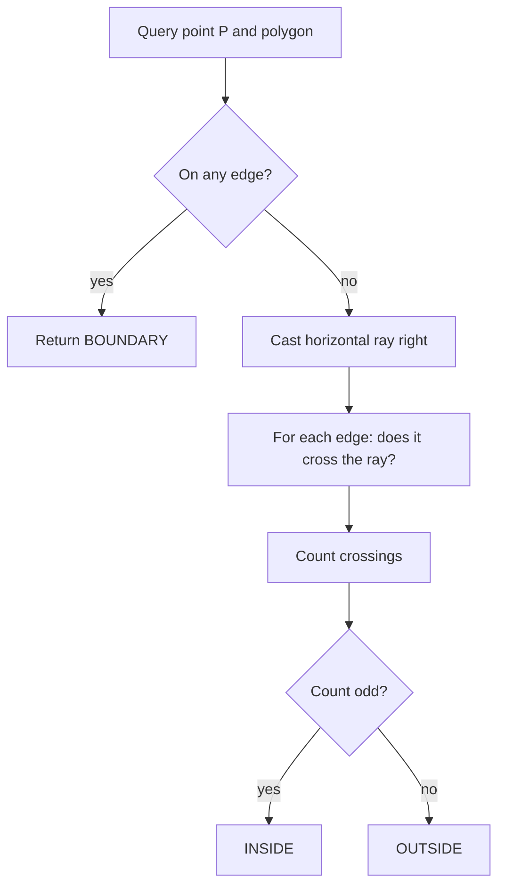
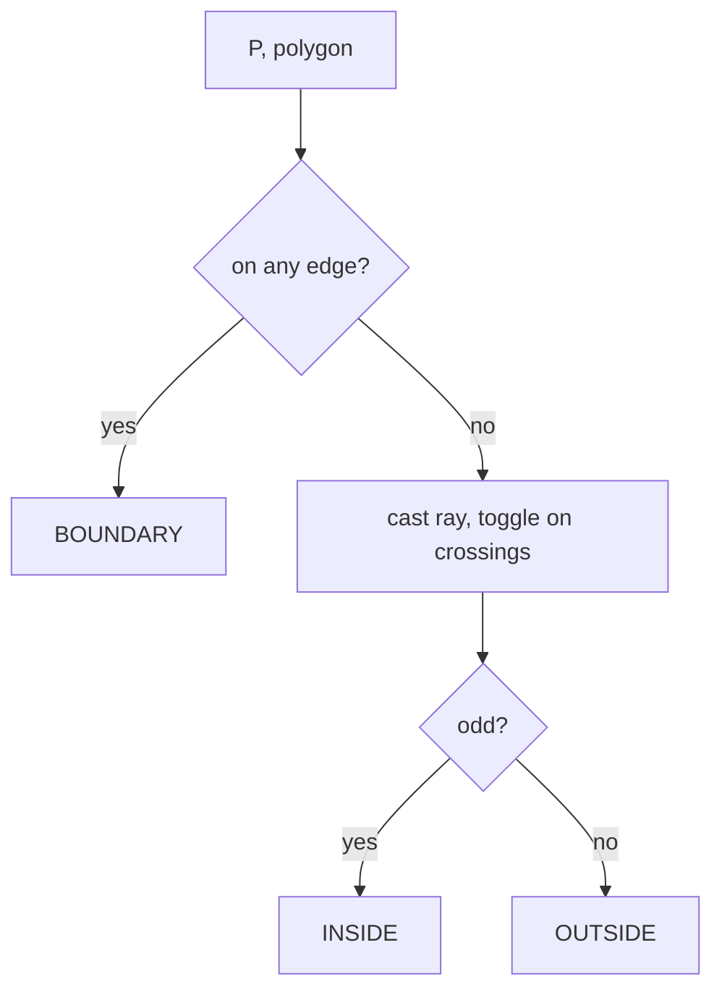

# Point-in-Polygon (PIP) — Junior Level

> **One-line summary:** A point-in-polygon test answers a single yes/no question — *is this point inside that polygon?* The classic method is **ray casting**: shoot a horizontal ray from the point and count how many polygon edges it crosses. **Odd** crossings → inside; **even** crossings → outside. It runs in `O(n)` for a polygon with `n` edges.

---

## Table of Contents

1. [Introduction](#introduction)
2. [Prerequisites](#prerequisites)
3. [Glossary](#glossary)
4. [Core Concepts](#core-concepts)
5. [Big-O Summary](#big-o-summary)
6. [Real-World Analogies](#real-world-analogies)
7. [Pros & Cons](#pros--cons)
8. [Step-by-Step Walkthrough](#step-by-step-walkthrough)
9. [Code Examples](#code-examples)
10. [Coding Patterns](#coding-patterns)
11. [Error Handling](#error-handling)
12. [Performance Tips](#performance-tips)
13. [Best Practices](#best-practices)
14. [Edge Cases & Pitfalls](#edge-cases--pitfalls)
15. [Common Mistakes](#common-mistakes)
16. [Cheat Sheet](#cheat-sheet)
17. [Visual Animation](#visual-animation)
18. [Summary](#summary)
19. [Further Reading](#further-reading)

---

## Introduction

Imagine you tap a map on your phone and the app instantly tells you *"You are inside the city limits of Boston."* Or you draw a lasso in an image editor and everything inside the loop gets selected. Or a game checks whether your character has stepped into a danger zone. Every one of those is the same question: **given a closed shape (a polygon) and a single point, is the point inside the shape, outside it, or right on its border?**

This is the **point-in-polygon** problem, often abbreviated **PIP**. It is one of the most-used primitives in all of computational geometry. It powers Geographic Information Systems (GIS), hit-testing in graphical user interfaces, geofencing in ride-share and delivery apps, and collision detection in games and physics engines.

The most famous solution is the **ray casting** algorithm, also called the **crossing number** or **even-odd rule**. The idea is almost embarrassingly simple:

> Stand at your point. Shoot an imaginary ray straight out to the right (any fixed direction works; "to the right" is the convention). Count how many times that ray crosses an edge of the polygon. If the count is **odd**, the point is **inside**. If it is **even** (including zero), the point is **outside**.

Why does this work? Think of walking along the ray from very far away (definitely outside) toward your point. Every time you cross an edge, you flip from outside-to-inside or inside-to-outside. Cross once → you are now inside. Cross twice → back outside. So the *parity* (odd or even) of the number of crossings tells you exactly which side you ended on.

That is the entire algorithm at the junior level: **walk every edge, count crossings, check odd/even.** Linear time, a few lines of code, no fancy data structures. The rest of this file makes that precise, shows you the code in Go, Java, and Python, and warns you about the handful of tricky cases (points exactly on an edge, horizontal edges, the ray passing exactly through a vertex) that trip up beginners.

---

## Prerequisites

Before reading this file you should be comfortable with:

- **2-D coordinates** — a point is a pair `(x, y)`; a polygon is a list of such points (its vertices, in order).
- **Loops and arrays** — you will iterate over the polygon's edges.
- **Basic arithmetic with floats** — multiplication, comparison, no trigonometry required.
- **The idea of an edge** — a polygon vertex list `[P0, P1, ..., Pn-1]` has edges `P0→P1`, `P1→P2`, …, and the closing edge `Pn-1→P0`.

Optional but helpful:

- A sense of **clockwise vs counter-clockwise** vertex order (the ray-casting parity rule does not care about orientation, which is a nice property).
- Big-O notation — we will say `O(n)` a lot.

You do **not** need trigonometry, linear algebra, or any geometry library. Ray casting is pure counting.

---

## Glossary

| Term | Meaning |
|------|---------|
| **Polygon** | A closed shape defined by an ordered list of vertices `[P0, P1, …, Pn-1]`, with edges connecting consecutive vertices and a closing edge back to `P0`. |
| **Vertex** | A corner point of the polygon. |
| **Edge** | A straight line segment between two consecutive vertices. |
| **Simple polygon** | A polygon whose edges do not cross each other (no self-intersection). |
| **Convex polygon** | A polygon where every interior angle is ≤ 180°; a line segment between any two interior points stays inside. |
| **Concave (non-convex)** | A polygon with at least one "dent" (an interior angle > 180°). |
| **Query point** | The point `P = (px, py)` we are testing. |
| **Ray** | A half-line starting at the query point, here going horizontally to the right (`+x`). |
| **Crossing / intersection** | A point where the ray meets an edge. |
| **Crossing number** | How many edges the ray crosses. Odd ⇒ inside, even ⇒ outside. |
| **Even-odd rule** | The rule that maps crossing-number parity to inside/outside. Same thing as ray casting. |
| **Boundary** | A point lies exactly on an edge or vertex — neither strictly inside nor strictly outside. |
| **Winding number** | An alternative method that counts how many times the polygon *wraps around* the point (covered in `middle.md`). |

---

## Core Concepts

### 1. A polygon is just a list of points, edges close the loop

We store a polygon as an ordered array of vertices:

```
poly = [ (x0,y0), (x1,y1), (x2,y2), ..., (x_{n-1}, y_{n-1}) ]
```

The edges are the segments between consecutive vertices, **plus the closing edge** from the last vertex back to the first:

```
edges = (P0→P1), (P1→P2), ..., (P_{n-2}→P_{n-1}), (P_{n-1}→P0)
```

A common beginner bug is forgetting that closing edge. A neat trick handles all `n` edges uniformly: pair each vertex `i` with the *previous* vertex `j = i-1`, where for `i = 0` the previous is `n-1`. That single line, `j = (i + n - 1) % n` (or just track `j = i; i++`), covers the wrap-around without a special case.

### 2. The crossing-number (even-odd) rule

Shoot a horizontal ray to the right from the query point `P = (px, py)`. For each edge, ask: *does this edge cross the horizontal line `y = py` at some `x` greater than `px`?* If yes, that is one crossing. Count them all.

```
inside = (number of crossings is odd)
```

The deep reason: the ray starts at `P` and goes to `+∞`, where it is certainly **outside** the (bounded) polygon. Walking backward from infinity to `P`, each edge crossing toggles inside/outside. So the parity at `P` equals the number of toggles = number of crossings. (The formal Jordan-curve-theorem version of this argument lives in `professional.md`.)

### 3. The one tricky test: does an edge cross the ray?

For an edge from `A = (ax, ay)` to `B = (bx, by)`, the horizontal ray at height `py` going right crosses it when **both** of these hold:

1. **The edge straddles the ray's height.** One endpoint is above `py` and the other is at-or-below it: `(ay > py) != (by > py)`. This single comparison cleverly handles which endpoint counts as "above" and avoids double-counting at shared vertices (more on that below).
2. **The crossing is to the right of `px`.** Compute the `x` where the edge meets `y = py` and check it is `> px`:

```
x_cross = ax + (py - ay) / (by - ay) * (bx - ax)
crosses = x_cross > px
```

If both are true, increment the counter. That is the whole inner loop.

### 4. The half-open rule prevents vertex double-counting

What if the ray passes exactly through a shared vertex of two edges? Without care you would count that vertex twice (once per edge) or zero times, and the parity breaks. The fix is the **half-open interval** convention baked into the test `(ay > py) != (by > py)`:

- An edge is considered to span heights in the half-open range — it "owns" its lower endpoint but not its upper one (or vice-versa, as long as you are consistent).
- Because the strict `>` is used on both endpoints, a vertex exactly at height `py` is counted by exactly one of its two edges, never both, never neither.

This tiny detail is the single most important correctness trick in ray casting. Memorize the comparison `(ay > py) != (by > py)`.

### 5. Boundary points need a separate decision

Ray casting answers *strictly inside* vs *strictly outside*. A point lying **exactly on an edge** is a special case the parity rule does not cleanly resolve — some implementations report it inside, some outside. If your application cares (a building exactly on a border, a click exactly on a line), you add an explicit **on-edge check** *before* running the parity test, and return a dedicated `ON_BOUNDARY` verdict. We show this in the code section.



---

## Big-O Summary

| Operation | Complexity | Notes |
|-----------|-----------|-------|
| Single PIP query, ray casting | **O(n)** | Visit every one of the `n` edges once. |
| Single PIP query, convex polygon via binary search | **O(log n)** | Needs preprocessing; covered in `middle.md`. |
| Preprocessing for many queries (slab / trapezoidal) | build `O(n log n)`, query `O(log n)` | Worth it when you run many queries on one fixed polygon (`senior.md`). |
| Space (ray casting) | **O(1)** extra | Beyond storing the polygon itself. |
| On-edge boundary check | **O(n)** | One segment test per edge. |

> `n` = number of polygon vertices (= number of edges). For a **single** query on an arbitrary polygon, plain ray casting at `O(n)` is the right default — simple, robust, and no preprocessing.

---

## Real-World Analogies

| Concept | Analogy |
|---------|---------|
| The whole problem | A passport officer asking "Are you inside the country's borders?" |
| Casting the ray | Walking in a perfectly straight line out of a hedge maze and counting how many hedges you push through. |
| Odd crossings = inside | If you pushed through an odd number of hedges to escape, you must have started *inside* the maze. |
| Even crossings = outside | An even number of hedge-crossings means you ended up where you started, side-wise: outside. |
| The half-open vertex rule | A turnstile that counts you exactly once even if you brush both gate-arms — never double, never zero. |
| Boundary points | Someone standing with one foot on each side of a national border — neither cleanly "in" nor "out". |
| Concave polygon still works | A maze with dead-end alcoves: the count-the-walls rule still tells you in vs out, dents and all. |

Where the analogy breaks: a real maze has thick walls and you can stand *in* a wall; a polygon edge is infinitely thin, which is exactly why the on-boundary case needs its own rule.

---

## Pros & Cons

| Pros | Cons |
|------|------|
| Dead simple — a dozen lines, no data structures. | `O(n)` per query; slow if you test millions of points against a huge polygon. |
| Works on **any** simple polygon: convex, concave, with holes (with care). | Boundary / on-edge points need an explicit extra check. |
| Orientation-independent — clockwise or counter-clockwise both work. | Naive float math can misfire on points near edges (robustness, see `senior.md`). |
| No preprocessing — great for a one-off check. | Recomputes from scratch every query; no reuse for repeated queries on a fixed polygon. |
| Easy to reason about and to debug visually. | The even-odd rule disagrees with the winding rule on **self-intersecting** polygons (see `middle.md`). |

**When to use:** a single (or few) inside/outside checks against an arbitrary simple polygon — hit-testing a mouse click, checking one GPS fix against one geofence, a one-shot collision query.

**When NOT to use:** millions of queries against the same polygon (preprocess instead — `senior.md`), a guaranteed-convex polygon where `O(log n)` binary search is cheaper (`middle.md`), or when you need exact boundary classification under heavy floating-point stress (use robust predicates — `professional.md`).

---

## Step-by-Step Walkthrough

Take a simple square-ish polygon (counter-clockwise):

```
P0=(1,1)  P1=(5,1)  P2=(5,4)  P3=(1,4)
```

```
 y
 4   P3 +-----------+ P2
        |           |
 3      |           |
        |     • Q?  |
 2      |           |
 1   P0 +-----------+ P1
     1  2  3  4  5  x
```

**Query A: `Q = (3, 2)` (clearly inside).** Cast a ray right from `(3,2)`: the line `y = 2`.

| Edge | From → To | Straddles y=2? `(ay>2)!=(by>2)` | x where it meets y=2 | x > 3? | Crossing? |
|------|-----------|-------------------------------|----------------------|--------|-----------|
| P0→P1 | (1,1)→(5,1) | (false)!=(false)=**no** | — | — | no |
| P1→P2 | (5,1)→(5,4) | (false)!=(true)=**yes** | x=5 | 5>3 yes | **YES** |
| P2→P3 | (5,4)→(1,4) | (true)!=(true)=**no** | — | — | no |
| P3→P0 | (1,4)→(1,1) | (true)!=(false)=**yes** | x=1 | 1>3 **no** | no |

Crossings = **1** (odd) → **INSIDE**. Correct.

**Query B: `Q = (7, 2)` (clearly outside, to the right).** Line `y = 2` again.

| Edge | Straddles? | x at y=2 | x > 7? | Crossing? |
|------|-----------|----------|--------|-----------|
| P0→P1 | no | — | — | no |
| P1→P2 | yes | 5 | 5>7 no | no |
| P2→P3 | no | — | — | no |
| P3→P0 | yes | 1 | 1>7 no | no |

Crossings = **0** (even) → **OUTSIDE**. Correct.

**Query C: `Q = (0, 2)` (outside, to the left).** Line `y = 2`.

| Edge | Straddles? | x at y=2 | x > 0? | Crossing? |
|------|-----------|----------|--------|-----------|
| P1→P2 | yes | 5 | yes | **YES** |
| P3→P0 | yes | 1 | yes | **YES** |

Crossings = **2** (even) → **OUTSIDE**. Correct — two crossings cancel out.

That is ray casting in full. Notice how the half-open straddle test silently skipped the two horizontal edges (`P0→P1` and `P2→P3`) — horizontal edges never satisfy `(ay>py)!=(by>py)` because both endpoints share the same `y`. That is exactly what we want: horizontal edges parallel to the ray contribute no crossing.

---

## Code Examples

### Example: Ray-casting PIP with an explicit on-boundary check

We return one of three verdicts: `INSIDE`, `OUTSIDE`, `BOUNDARY`.

#### Go

```go
package main

import (
	"fmt"
	"math"
)

type Point struct{ X, Y float64 }

const eps = 1e-9

// onSegment reports whether P lies on segment A-B (within eps).
func onSegment(p, a, b Point) bool {
	// Cross product ~ 0 means collinear; then check P is within the bounding box.
	cross := (b.X-a.X)*(p.Y-a.Y) - (b.Y-a.Y)*(p.X-a.X)
	if math.Abs(cross) > eps {
		return false
	}
	if p.X < math.Min(a.X, b.X)-eps || p.X > math.Max(a.X, b.X)+eps {
		return false
	}
	if p.Y < math.Min(a.Y, b.Y)-eps || p.Y > math.Max(a.Y, b.Y)+eps {
		return false
	}
	return true
}

// PointInPolygon returns "INSIDE", "OUTSIDE", or "BOUNDARY".
func PointInPolygon(poly []Point, p Point) string {
	n := len(poly)
	// 1) Boundary check first.
	for i := 0; i < n; i++ {
		a, b := poly[i], poly[(i+1)%n]
		if onSegment(p, a, b) {
			return "BOUNDARY"
		}
	}
	// 2) Ray casting: count crossings of the rightward horizontal ray.
	inside := false
	j := n - 1
	for i := 0; i < n; i++ {
		a, b := poly[i], poly[j]
		// Half-open straddle test + crossing to the right of p.X.
		if (a.Y > p.Y) != (b.Y > p.Y) {
			xCross := a.X + (p.Y-a.Y)/(b.Y-a.Y)*(b.X-a.X)
			if xCross > p.X {
				inside = !inside
			}
		}
		j = i
	}
	if inside {
		return "INSIDE"
	}
	return "OUTSIDE"
}

func main() {
	square := []Point{{1, 1}, {5, 1}, {5, 4}, {1, 4}}
	fmt.Println(PointInPolygon(square, Point{3, 2})) // INSIDE
	fmt.Println(PointInPolygon(square, Point{7, 2})) // OUTSIDE
	fmt.Println(PointInPolygon(square, Point{5, 2})) // BOUNDARY (on edge P1->P2)
}
```

#### Java

```java
import java.util.*;

public class PointInPolygon {
    static final double EPS = 1e-9;

    record Point(double x, double y) {}

    static boolean onSegment(Point p, Point a, Point b) {
        double cross = (b.x() - a.x()) * (p.y() - a.y())
                     - (b.y() - a.y()) * (p.x() - a.x());
        if (Math.abs(cross) > EPS) return false;
        if (p.x() < Math.min(a.x(), b.x()) - EPS || p.x() > Math.max(a.x(), b.x()) + EPS)
            return false;
        if (p.y() < Math.min(a.y(), b.y()) - EPS || p.y() > Math.max(a.y(), b.y()) + EPS)
            return false;
        return true;
    }

    static String pointInPolygon(Point[] poly, Point p) {
        int n = poly.length;
        // 1) Boundary check first.
        for (int i = 0; i < n; i++) {
            if (onSegment(p, poly[i], poly[(i + 1) % n])) return "BOUNDARY";
        }
        // 2) Ray casting.
        boolean inside = false;
        for (int i = 0, j = n - 1; i < n; j = i++) {
            Point a = poly[i], b = poly[j];
            if ((a.y() > p.y()) != (b.y() > p.y())) {
                double xCross = a.x() + (p.y() - a.y()) / (b.y() - a.y()) * (b.x() - a.x());
                if (xCross > p.x()) inside = !inside;
            }
        }
        return inside ? "INSIDE" : "OUTSIDE";
    }

    public static void main(String[] args) {
        Point[] square = { new Point(1, 1), new Point(5, 1),
                           new Point(5, 4), new Point(1, 4) };
        System.out.println(pointInPolygon(square, new Point(3, 2))); // INSIDE
        System.out.println(pointInPolygon(square, new Point(7, 2))); // OUTSIDE
        System.out.println(pointInPolygon(square, new Point(5, 2))); // BOUNDARY
    }
}
```

#### Python

```python
EPS = 1e-9


def on_segment(p, a, b):
    """True if point p lies on segment a-b (within EPS)."""
    cross = (b[0] - a[0]) * (p[1] - a[1]) - (b[1] - a[1]) * (p[0] - a[0])
    if abs(cross) > EPS:
        return False
    if p[0] < min(a[0], b[0]) - EPS or p[0] > max(a[0], b[0]) + EPS:
        return False
    if p[1] < min(a[1], b[1]) - EPS or p[1] > max(a[1], b[1]) + EPS:
        return False
    return True


def point_in_polygon(poly, p):
    """Return 'INSIDE', 'OUTSIDE', or 'BOUNDARY'."""
    n = len(poly)
    # 1) Boundary check first.
    for i in range(n):
        if on_segment(p, poly[i], poly[(i + 1) % n]):
            return "BOUNDARY"
    # 2) Ray casting.
    inside = False
    j = n - 1
    for i in range(n):
        ax, ay = poly[i]
        bx, by = poly[j]
        if (ay > p[1]) != (by > p[1]):
            x_cross = ax + (p[1] - ay) / (by - ay) * (bx - ax)
            if x_cross > p[0]:
                inside = not inside
        j = i
    return "INSIDE" if inside else "OUTSIDE"


if __name__ == "__main__":
    square = [(1, 1), (5, 1), (5, 4), (1, 4)]
    print(point_in_polygon(square, (3, 2)))  # INSIDE
    print(point_in_polygon(square, (7, 2)))  # OUTSIDE
    print(point_in_polygon(square, (5, 2)))  # BOUNDARY
```

**What it does:** classifies a point against a polygon as inside, outside, or exactly on the boundary.
**Run:** `go run main.go` | `javac PointInPolygon.java && java PointInPolygon` | `python pip.py`

---

## Coding Patterns

### Pattern 1: The previous-vertex pairing (`j = i; i++`)

**Intent:** iterate every edge including the closing one, without a special case.

```python
j = n - 1            # start j at the last vertex
for i in range(n):
    edge = (poly[j], poly[i])   # edge from previous to current
    # ... process edge ...
    j = i            # advance: previous becomes current
```

The Java idiom packs it into one line: `for (int i = 0, j = n - 1; i < n; j = i++)`. Either way, when `i = 0`, `j = n-1`, so the closing edge `P_{n-1}→P0` is handled like any other.

### Pattern 2: Toggle instead of count

**Intent:** you only care about *parity*, so flip a boolean instead of incrementing an integer.

```python
inside = False
# on each valid crossing:
inside = not inside     # toggle; final value is the parity
```

This is slightly faster and avoids any `% 2` at the end. A real counter is still useful for debugging or for the animation, but production code usually toggles.

### Pattern 3: Boundary-first classification

**Intent:** if your app needs a 3-way answer, test on-boundary *before* the parity test, because parity alone cannot reliably distinguish "on the line" from "just inside / just outside".



---

## Error Handling

| Error | Cause | Fix |
|-------|-------|-----|
| Wrong verdict on edge points | No boundary check; parity rule alone is ambiguous on edges. | Add an explicit `onSegment` test before ray casting. |
| Double-counted vertex | Used `>=` on one endpoint and `>` on the other, or both `>=`. | Use the strict half-open form `(ay > py) != (by > py)` consistently. |
| Division by zero | Edge is horizontal (`by == ay`) and you computed `x_cross`. | The straddle test rejects horizontal edges first, so you never divide by zero — keep that order. |
| Missing the closing edge | Looped `i` from 0 to n-2 and forgot `P_{n-1}→P0`. | Use the `j = i; i++` pairing or `(i+1)%n` indexing. |
| Off-by-one with `%` | Used `(i-1)%n` which is negative in some languages. | Use `(i + n - 1) % n` or the previous-vertex pattern. |
| Near-edge flicker | Float rounding flips the verdict for points microscopically near an edge. | Add an epsilon tolerance / robust predicate (see `senior.md`/`professional.md`). |

---

## Performance Tips

- **Toggle a boolean**, do not count then `% 2` — fewer operations.
- **Skip the boundary check** if your application does not need a 3-way answer; that alone halves the work.
- **Bounding-box reject first:** if the point is outside the polygon's min/max box, return `OUTSIDE` in `O(1)` before touching any edge. Huge win when most queries are far outside.
- **Avoid recomputing `poly[(i+1)%n]`** in hot loops; cache the previous vertex via the `j = i` pattern.
- For **many queries on one polygon**, stop using plain ray casting — preprocess (see `senior.md`).
- Keep coordinates in a **flat array** (`xs[]`, `ys[]`) for cache locality on big polygons.

---

## Best Practices

- Always decide up front what an **on-boundary** point should mean for your use case, and document it.
- Use the canonical half-open straddle test `(ay > py) != (by > py)`; do not invent your own comparison.
- Add a **bounding-box pre-check** for speed and as a sanity guard.
- Test against the three obvious cases: clearly inside, clearly outside, and exactly on an edge/vertex.
- For GPS coordinates, remember the Earth is curved — treat lat/long as planar only for small regions, or project first (covered in `senior.md`).
- Validate the polygon has at least 3 vertices before testing.

---

## Edge Cases & Pitfalls

- **Point exactly on an edge** — parity rule is ambiguous; handle with an explicit boundary check.
- **Point exactly on a vertex** — the half-open rule keeps parity correct, but for a 3-way verdict the boundary check catches it (a vertex lies on its incident edges).
- **Horizontal edges** — automatically ignored by the straddle test; never divide by their zero slope.
- **Ray passing exactly through a vertex** — the half-open convention counts it once, never twice.
- **Polygon with fewer than 3 vertices** — not a real polygon; reject early.
- **Self-intersecting polygon** — even-odd still gives an answer, but it may differ from the winding-number answer (see `middle.md`).
- **Repeated / duplicate consecutive vertices** — a zero-length edge; skip it or it contributes a degenerate straddle.
- **Very large or tiny coordinates** — float precision degrades; consider scaling or robust predicates.

---

## Common Mistakes

1. **Forgetting the closing edge** — the loop must include `P_{n-1}→P0`. Use the `j = i; i++` pattern.
2. **Using `>=` on both endpoints** in the straddle test — double-counts vertices and corrupts parity. Use strict `>` on both.
3. **Dividing before checking horizontal** — compute `x_cross` only *after* the straddle test passes, so `by != ay` is guaranteed.
4. **Assuming the polygon is convex** — ray casting works on concave polygons too; do not "optimize" with a convex-only shortcut unless you know the shape is convex.
5. **Ignoring boundary points** then being surprised when a click on the border is reported "outside".
6. **Casting the ray in a direction that grazes many vertices** — the rightward horizontal ray plus the half-open rule already handles this; do not pick a random ray angle.
7. **Mixing up x and y** in the crossing formula — `(py - ay)/(by - ay)` interpolates along `y`, scaling the `x` delta.

---

## Cheat Sheet

| Step | What to do |
|------|------------|
| Setup | `inside = false`, pair each vertex with previous (`j = n-1; for i: ...; j = i`). |
| Straddle test | `(ay > py) != (by > py)` — strict `>`, half-open, skips horizontals. |
| Crossing x | `x_cross = ax + (py - ay)/(by - ay) * (bx - ax)`. |
| Count it | if `x_cross > px`: `inside = !inside`. |
| Verdict | after the loop, `inside` is true ⇒ INSIDE, false ⇒ OUTSIDE. |
| Boundary | optional `onSegment` check first for a 3-way answer. |

Complexity:

```
single query (any simple polygon) : O(n)
convex polygon, binary search     : O(log n)   (see middle.md)
many queries, preprocessed        : O(log n) per query after O(n log n) build
```

Golden rule: **odd crossings → inside, even crossings → outside.**

---

## Visual Animation

> See [`animation.html`](./animation.html) for an interactive visual animation of point-in-polygon ray casting.
>
> The animation demonstrates:
> - A polygon you can see, with a **draggable query point**
> - The horizontal ray shooting to the right
> - Each edge tested in turn, with crossings highlighted
> - A live **parity counter** flipping inside/outside
> - The final INSIDE / OUTSIDE / BOUNDARY verdict
> - Step / Run / Reset controls, a Big-O table, and an operation log

---

## Summary

Point-in-polygon asks a single yes/no question that shows up everywhere: maps, graphics, geofencing, games. The junior-level workhorse is **ray casting**: shoot a horizontal ray, count edge crossings, and read off the parity — **odd is inside, even is outside**. It runs in `O(n)`, needs no data structures, and works on any simple polygon regardless of orientation or convexity. The three things to master are: (1) the half-open straddle test `(ay > py) != (by > py)` that handles vertices and horizontal edges automatically, (2) the rightward crossing check `x_cross > px`, and (3) an explicit boundary test when on-edge points matter. Get those right and you can write a correct PIP test from memory.

---

## Further Reading

- *Computational Geometry: Algorithms and Applications* (de Berg, Cheong, van Kreveld, Overmars), Chapter on point location.
- W. Randolph Franklin, *PNPOLY* — the classic short C ray-casting routine and its half-open rationale.
- *Graphics Gems IV* — "Point in Polygon Strategies" (Eric Haines) — a survey of methods and trade-offs.
- cp-algorithms.com — "Point in polygon" (ray casting and winding number).
- Sibling topics: *01-orientation-and-cross-product* (the cross-product primitive), *02-segment-intersection* (the crossing test), *04-convex-hull* (often paired with PIP).

---

Next step: [middle.md](./middle.md) — winding number vs even-odd, boundary and degenerate cases, and the `O(log n)` convex-polygon test.
