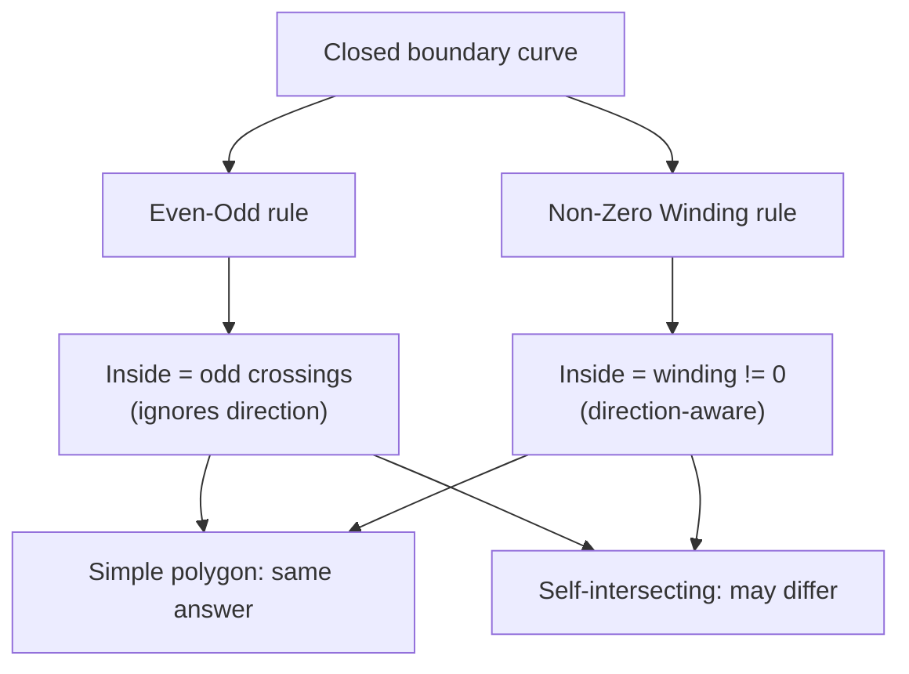

# Point-in-Polygon (PIP) — Middle Level

> **Focus:** *Why* the methods work and *when* to choose each. Even-odd (crossing number) vs **winding number**, why they disagree on self-intersecting polygons, careful handling of vertices / horizontal edges / boundary points, and the `O(log n)` test for **convex** polygons via binary search on angles.

---

## Table of Contents

1. [Introduction](#introduction)
2. [Deeper Concepts: Two Inside-ness Definitions](#deeper-concepts-two-inside-ness-definitions)
3. [Winding Number Method](#winding-number-method)
4. [Even-Odd vs Winding: When They Disagree](#even-odd-vs-winding-when-they-disagree)
5. [Comparison with Alternatives](#comparison-with-alternatives)
6. [Degeneracy Handling](#degeneracy-handling)
7. [Convex Polygon in O(log n)](#convex-polygon-in-olog-n)
8. [Code Examples](#code-examples)
9. [Error Handling](#error-handling)
10. [Performance Analysis](#performance-analysis)
11. [Best Practices](#best-practices)
12. [Visual Animation](#visual-animation)
13. [Summary](#summary)

---

## Introduction

At the junior level, point-in-polygon was one rule: cast a ray, count crossings, odd means inside. That is correct and sufficient for a huge fraction of real applications. But three questions push you to the middle level:

1. **What does "inside" even mean for a weird polygon?** For a figure-eight (self-intersecting) shape, two reasonable people disagree about whether the center is "inside". The even-odd rule and the winding-number rule give **different** answers — and both are used in real software (SVG and PostScript expose both as `fill-rule: evenodd` and `fill-rule: nonzero`).

2. **How do I bullet-proof the boundary and degenerate cases?** Vertices on the ray, horizontal edges collinear with the ray, points exactly on an edge — these are where naive implementations silently produce wrong answers.

3. **My polygon is convex and I run lots of queries — can I beat `O(n)`?** Yes. A convex polygon admits an `O(log n)` test by binary-searching the angular fan from one vertex. That is the gateway to the preprocessing techniques covered at senior level.

This file answers all three. The unifying theme is that PIP is not one algorithm but a small family, and a good engineer picks the member that matches the polygon's shape, the inside-ness semantics required, and the query volume.

---

## Deeper Concepts: Two Inside-ness Definitions

A polygon's boundary is a closed curve. For a **simple** (non-self-intersecting) polygon, "inside" is unambiguous — the Jordan curve theorem guarantees the curve splits the plane into exactly one bounded interior and one unbounded exterior. But the *boundary as drawn* may cross itself, and then "interior" needs a definition. There are two standard ones:

### Even-Odd (crossing number) rule

A point is **inside** if a ray from it crosses the boundary an **odd** number of times. This is purely about *how many times* you cross, regardless of direction. It is the rule from `junior.md`.

### Non-zero (winding number) rule

A point is **inside** if the boundary **winds around it a non-zero number of times**, where each counter-clockwise loop counts `+1` and each clockwise loop counts `-1`. Direction matters here.

For a simple polygon traversed once, both rules agree everywhere: the winding number of any interior point is `±1` (non-zero ⇒ inside) and crossings are odd (⇒ inside). They only diverge when the boundary overlaps itself or wraps multiple times — exactly the self-intersecting case.



---

## Winding Number Method

The **winding number** `w(P)` of a point `P` with respect to a closed polygon is the number of times the polygon boundary travels counter-clockwise around `P`. Formally it is the total signed angle swept, divided by `2π`:

```
w(P) = (1 / 2π) * Σ over edges of the signed angle subtended at P
```

Computing angles with `atan2` and summing them works but is slow and float-fragile. The fast, integer-friendly version due to Dan Sunday avoids trig entirely by combining the crossing test with an **orientation** (left/right) test:

> Walk each edge. When an edge crosses the horizontal line `y = py` **upward** (from below to above), and `P` is to the **left** of that edge, add `+1`. When an edge crosses **downward** (above to below) and `P` is to the **right**, subtract `1`. The point is inside iff the final winding number is non-zero.

"Left/right of an edge" is the **cross product** (orientation) primitive:

```
isLeft(A, B, P) = (B.x - A.x)*(P.y - A.y) - (B.y - A.y)*(P.x - A.x)
   > 0  : P is left of A->B
   = 0  : P is on line A->B
   < 0  : P is right of A->B
```

Notice the structure mirrors ray casting: same straddle test, but instead of toggling a parity bit, you accumulate a signed count guarded by the orientation sign. This is why the two methods have the same `O(n)` cost and nearly identical code.

### Why winding is more robust for self-intersection

The winding number is a **topological invariant** — it does not depend on the ray direction at all (any ray gives the same `w(P)`), whereas the crossing-number parity can in principle be affected by degenerate ray placements. For overlapping or multiply-wound shapes, winding number reflects "how deeply nested" the point is, which is usually the semantics graphics and GIS engines actually want.

---

## Even-Odd vs Winding: When They Disagree

The textbook example is a **figure-eight** or a **pentagram (5-pointed star)** drawn as a single self-crossing path.

Consider a star polygon where the path crosses itself, creating a central pentagon. A point in that central region:

- **Even-odd:** the ray crosses the boundary an even number of times (it enters and exits the overlapping loops), so even-odd says **OUTSIDE** — the center is a "hole".
- **Non-zero winding:** the boundary wraps the center **twice** in the same direction, so `w = 2 ≠ 0`, and winding says **INSIDE** — the center is solid.

```
   Pentagram center:
   even-odd  -> hole (outside)
   non-zero  -> filled (inside)
```

This is not a bug in either method; they encode **different design intents**. SVG and PostScript let the author pick:

| Fill rule | PIP method | Star center | Use when |
|-----------|-----------|-------------|----------|
| `fill-rule: evenodd` | even-odd / crossing number | hollow | you want overlaps to "cancel" (cut-out effect) |
| `fill-rule: nonzero` | winding number | filled | you want any wrapped region solid (the common default) |

**Rule of thumb:** for a guaranteed-simple polygon, use either — even-odd is simpler. For paths that may self-intersect, decide which fill semantics you need and pick the matching method; the **non-zero winding rule is the more common default** in rendering.

---

## Comparison with Alternatives

| Attribute | Ray casting (even-odd) | Winding number (Sunday) | Convex binary search | Angle-sum (atan2) |
|-----------|-----------------------|-------------------------|----------------------|-------------------|
| Time per query | O(n) | O(n) | O(log n) | O(n) |
| Preprocessing | none | none | O(n) order/orient | none |
| Polygon types | any simple | any (incl. self-intersect) | **convex only** | any simple |
| Self-intersection semantics | even-odd fill | non-zero fill | n/a (assumes convex) | non-zero (via angle) |
| Float robustness | good | good (integer-friendly) | good | **poor** (trig drift) |
| Orientation-dependent? | no | yes (uses CCW/CW) | yes (needs known order) | yes |
| Code complexity | lowest | low | medium | low but fragile |
| Best for | one-off arbitrary polygon | self-intersecting / GIS fill | many queries, convex shape | almost never (educational) |

**Choose ray casting when:** the polygon is simple and you want the least code.
**Choose winding number when:** the polygon may self-intersect, or you need non-zero fill semantics (matches SVG/PDF/most renderers).
**Choose convex binary search when:** the polygon is known convex and you query it repeatedly.
**Avoid angle-sum (atan2)** in production: it is the slowest and least numerically stable; it survives mainly as a teaching tool.

---

## Degeneracy Handling

Degeneracies are the inputs that break naive code. Handle them deliberately.

### 1. Vertex exactly on the ray

If the horizontal ray `y = py` passes exactly through a vertex shared by two edges, a sloppy test counts it 0 or 2 times, flipping parity. The **half-open** convention `(ay > py) != (by > py)` fixes this: a vertex at height `py` is "owned" by exactly one of its two edges (the strict `>` makes the boundary value belong to the lower side consistently). This is the single most important degeneracy fix and it is built into the standard test.

### 2. Horizontal edge collinear with the ray

A horizontal edge has `ay == by`, so `(ay > py) != (by > py)` is `false` whenever the edge sits at `py` — it contributes **no crossing**. That is correct: a horizontal edge parallel to the ray should not be counted as a transverse crossing; its two non-horizontal neighbor edges carry the crossing information. As a bonus, this guard means you never divide by `by - ay = 0`.

### 3. Point exactly on an edge

Neither parity nor winding reliably labels an on-edge point as in or out (it is literally the dividing line). If your semantics need a verdict, test on-boundary **first** using the collinear + bounding-box check from `junior.md`, and return a dedicated `BOUNDARY` result.

### 4. Point exactly on a vertex

A vertex lies on its two incident edges, so the on-segment boundary check catches it. If you do not run a boundary check, the half-open rule still yields a consistent (if arbitrary) in/out label.

### 5. Duplicate / collinear / zero-length edges

Duplicate consecutive vertices create zero-length edges. They never straddle (`ay == by` and `ax == bx`), so they are harmless to parity, but defensive code skips them. Collinear consecutive edges are fine for PIP (no special handling needed) even though they matter for convex-hull algorithms.

| Degeneracy | Symptom if unhandled | Standard fix |
|-----------|---------------------|--------------|
| Vertex on ray | parity off by one | half-open `(ay>py)!=(by>py)` |
| Horizontal edge on ray | divide-by-zero or miscount | same straddle test rejects it |
| Point on edge | ambiguous in/out | explicit boundary check first |
| Point on vertex | ambiguous | boundary check (on incident edges) |
| Zero-length edge | wasted work / NaN | skip if `a == b` |

---

## Convex Polygon in O(log n)

If the polygon is **convex** and its vertices are in known (say counter-clockwise) order, you can test a point in `O(log n)` instead of `O(n)` by binary search. The trick: pick an anchor vertex `V0`. The other vertices `V1, V2, …, V_{n-1}` are seen from `V0` in monotonically increasing angle — they form a **fan** of triangles `V0 V_i V_{i+1}`. A point `P` inside the polygon lies inside exactly one of those triangles (or on the boundary).

```
        V3
       /  \
      /    \
    V2      V4
     |\    /|
     | \  / |
     |  V0  |     <- anchor; rays V0->Vi increase in angle
     | /  \ |
    V1      V5
```

**Algorithm:**

1. Quick reject: if `P` is right of `V0→V1` or left of `V0→V_{n-1}`, it is outside the fan ⇒ **OUTSIDE**.
2. **Binary search** for the wedge: find `i` such that `P` is left of `V0→V_i` but right of `V0→V_{i+1}`. This isolates the candidate triangle `(V0, V_i, V_{i+1})` in `O(log n)`.
3. Final check: `P` is inside the polygon iff it is on the correct (interior) side of edge `V_i→V_{i+1}` — one orientation test.

The whole thing is three cross-product (`isLeft`) evaluations per binary-search step. No trigonometry. The polygon must be convex; for concave shapes the fan triangles overlap or leave gaps and the search is invalid.

This `O(log n)` query is the conceptual bridge to senior-level preprocessing: a general polygon can be decomposed into pieces, each searchable in `O(log n)`, giving fast queries on arbitrary shapes after an `O(n log n)` build.

---

## Code Examples

### Example 1: Winding-number PIP (Sunday's no-trig version)

#### Go

```go
package main

import "fmt"

type Pt struct{ X, Y float64 }

// isLeft > 0 if P left of A->B, = 0 on line, < 0 right.
func isLeft(a, b, p Pt) float64 {
	return (b.X-a.X)*(p.Y-a.Y) - (b.Y-a.Y)*(p.X-a.X)
}

// WindingNumber returns the signed winding count; non-zero => inside.
func WindingNumber(poly []Pt, p Pt) int {
	wn := 0
	n := len(poly)
	for i := 0; i < n; i++ {
		a, b := poly[i], poly[(i+1)%n]
		if a.Y <= p.Y {
			if b.Y > p.Y && isLeft(a, b, p) > 0 { // upward crossing, P left
				wn++
			}
		} else {
			if b.Y <= p.Y && isLeft(a, b, p) < 0 { // downward crossing, P right
				wn--
			}
		}
	}
	return wn
}

func InsideNonZero(poly []Pt, p Pt) bool { return WindingNumber(poly, p) != 0 }

func main() {
	square := []Pt{{1, 1}, {5, 1}, {5, 4}, {1, 4}}
	fmt.Println(WindingNumber(square, Pt{3, 2}), InsideNonZero(square, Pt{3, 2})) // 1 true
	fmt.Println(WindingNumber(square, Pt{7, 2}), InsideNonZero(square, Pt{7, 2})) // 0 false
}
```

#### Java

```java
public class Winding {
    record Pt(double x, double y) {}

    static double isLeft(Pt a, Pt b, Pt p) {
        return (b.x() - a.x()) * (p.y() - a.y()) - (b.y() - a.y()) * (p.x() - a.x());
    }

    static int windingNumber(Pt[] poly, Pt p) {
        int wn = 0, n = poly.length;
        for (int i = 0; i < n; i++) {
            Pt a = poly[i], b = poly[(i + 1) % n];
            if (a.y() <= p.y()) {
                if (b.y() > p.y() && isLeft(a, b, p) > 0) wn++;       // upward, P left
            } else {
                if (b.y() <= p.y() && isLeft(a, b, p) < 0) wn--;      // downward, P right
            }
        }
        return wn;
    }

    static boolean insideNonZero(Pt[] poly, Pt p) { return windingNumber(poly, p) != 0; }

    public static void main(String[] args) {
        Pt[] square = { new Pt(1, 1), new Pt(5, 1), new Pt(5, 4), new Pt(1, 4) };
        System.out.println(windingNumber(square, new Pt(3, 2))); // 1
        System.out.println(windingNumber(square, new Pt(7, 2))); // 0
    }
}
```

#### Python

```python
def is_left(a, b, p):
    return (b[0] - a[0]) * (p[1] - a[1]) - (b[1] - a[1]) * (p[0] - a[0])


def winding_number(poly, p):
    """Signed winding number of p w.r.t. polygon; non-zero => inside."""
    wn = 0
    n = len(poly)
    for i in range(n):
        a, b = poly[i], poly[(i + 1) % n]
        if a[1] <= p[1]:
            if b[1] > p[1] and is_left(a, b, p) > 0:   # upward crossing, p left
                wn += 1
        else:
            if b[1] <= p[1] and is_left(a, b, p) < 0:  # downward crossing, p right
                wn -= 1
    return wn


def inside_nonzero(poly, p):
    return winding_number(poly, p) != 0


if __name__ == "__main__":
    square = [(1, 1), (5, 1), (5, 4), (1, 4)]
    print(winding_number(square, (3, 2)), inside_nonzero(square, (3, 2)))  # 1 True
    print(winding_number(square, (7, 2)), inside_nonzero(square, (7, 2)))  # 0 False
```

### Example 2: Convex polygon `O(log n)` test

#### Go

```go
package main

import "fmt"

type P struct{ X, Y float64 }

func cross(o, a, b P) float64 {
	return (a.X-o.X)*(b.Y-o.Y) - (a.Y-o.Y)*(b.X-o.X)
}

// InConvex assumes poly is convex and counter-clockwise. O(log n).
func InConvex(poly []P, q P) bool {
	n := len(poly)
	if n < 3 {
		return false
	}
	// Outside the fan from poly[0]?
	if cross(poly[0], poly[1], q) < 0 || cross(poly[0], poly[n-1], q) > 0 {
		return false
	}
	// Binary search for the wedge [lo, lo+1] containing q.
	lo, hi := 1, n-1
	for hi-lo > 1 {
		mid := (lo + hi) / 2
		if cross(poly[0], poly[mid], q) >= 0 {
			lo = mid
		} else {
			hi = mid
		}
	}
	// q must be on the interior side of edge poly[lo] -> poly[hi].
	return cross(poly[lo], poly[hi], q) >= 0
}

func main() {
	// CCW convex pentagon
	poly := []P{{0, 0}, {4, 0}, {5, 3}, {2, 5}, {-1, 3}}
	fmt.Println(InConvex(poly, P{2, 2})) // true
	fmt.Println(InConvex(poly, P{9, 9})) // false
}
```

#### Java

```java
public class ConvexPIP {
    record P(double x, double y) {}

    static double cross(P o, P a, P b) {
        return (a.x() - o.x()) * (b.y() - o.y()) - (a.y() - o.y()) * (b.x() - o.x());
    }

    // poly convex + counter-clockwise. O(log n).
    static boolean inConvex(P[] poly, P q) {
        int n = poly.length;
        if (n < 3) return false;
        if (cross(poly[0], poly[1], q) < 0 || cross(poly[0], poly[n - 1], q) > 0)
            return false;
        int lo = 1, hi = n - 1;
        while (hi - lo > 1) {
            int mid = (lo + hi) / 2;
            if (cross(poly[0], poly[mid], q) >= 0) lo = mid;
            else hi = mid;
        }
        return cross(poly[lo], poly[hi], q) >= 0;
    }

    public static void main(String[] args) {
        P[] poly = { new P(0, 0), new P(4, 0), new P(5, 3), new P(2, 5), new P(-1, 3) };
        System.out.println(inConvex(poly, new P(2, 2))); // true
        System.out.println(inConvex(poly, new P(9, 9))); // false
    }
}
```

#### Python

```python
def cross(o, a, b):
    return (a[0] - o[0]) * (b[1] - o[1]) - (a[1] - o[1]) * (b[0] - o[0])


def in_convex(poly, q):
    """poly convex + counter-clockwise. O(log n)."""
    n = len(poly)
    if n < 3:
        return False
    if cross(poly[0], poly[1], q) < 0 or cross(poly[0], poly[-1], q) > 0:
        return False
    lo, hi = 1, n - 1
    while hi - lo > 1:
        mid = (lo + hi) // 2
        if cross(poly[0], poly[mid], q) >= 0:
            lo = mid
        else:
            hi = mid
    return cross(poly[lo], poly[hi], q) >= 0


if __name__ == "__main__":
    poly = [(0, 0), (4, 0), (5, 3), (2, 5), (-1, 3)]  # CCW convex pentagon
    print(in_convex(poly, (2, 2)))  # True
    print(in_convex(poly, (9, 9)))  # False
```

**Run:** `go run main.go` | `javac File.java && java File` | `python file.py`

---

## Error Handling

| Scenario | What goes wrong | Correct approach |
|----------|----------------|------------------|
| Convex test on a concave polygon | Fan triangles overlap; wrong answer | Verify convexity first, or fall back to ray casting. |
| Convex test with clockwise input | Every orientation sign flips ⇒ inverted result | Detect/normalize to CCW, or flip all comparisons. |
| Winding number with wrong direction loop | `wn` sign flips but `!= 0` still correct for simple polygons | Fine for non-zero fill; only matters if you read the sign. |
| Self-intersecting polygon with even-odd expected to match winding | Different verdicts at overlaps | Pick the rule matching your fill semantics explicitly. |
| atan2 angle-sum near boundary | Accumulated float error gives `≈ 0` vs `≈ 2π` confusion | Prefer Sunday's integer winding or ray casting. |
| Boundary point through any method | Ambiguous in/out | Run explicit on-segment check before the main test. |

---

## Performance Analysis

For a **single** query, ray casting and winding number are both `O(n)` with nearly identical constants — winding adds one cross-product per straddling edge, ray casting adds one division. In practice ray casting is marginally faster (division vs multiply-compare is a wash; winding touches more edges only if many straddle). Choose based on *semantics*, not micro-speed, for single queries.

The real performance story is **query volume**:

| Situation | Best method | Per-query cost |
|-----------|-------------|----------------|
| One query, arbitrary polygon | ray casting | O(n) |
| Many queries, convex polygon | binary search | O(log n) after O(n) prep |
| Many queries, arbitrary polygon | preprocessing (slab / trapezoidal) | O(log n) after O(n log n) prep — see `senior.md` |
| Many queries, mostly far outside | bounding-box pre-filter + ray casting | O(1) reject, else O(n) |

#### Go — benchmark sketch (ray vs winding)

```go
package main

import (
	"fmt"
	"time"
)

func benchmark(poly []Pt, queries []Pt) {
	start := time.Now()
	count := 0
	for _, q := range queries {
		if InsideNonZero(poly, q) {
			count++
		}
	}
	fmt.Printf("winding: %d inside, %v\n", count, time.Since(start))
}
```

#### Java

```java
static void benchmark(Pt[] poly, Pt[] queries) {
    long start = System.nanoTime();
    int count = 0;
    for (Pt q : queries) if (insideNonZero(poly, q)) count++;
    System.out.printf("winding: %d inside, %.3f ms%n",
        count, (System.nanoTime() - start) / 1_000_000.0);
}
```

#### Python

```python
import timeit

def benchmark(poly, queries):
    t = timeit.timeit(lambda: [inside_nonzero(poly, q) for q in queries], number=10)
    print(f"winding: {t/10*1000:.3f} ms for {len(queries)} queries")
```

---

## Best Practices

- **Pick the inside-ness rule on purpose.** Simple polygon → either; self-intersecting → decide even-odd (cut-out) vs non-zero (solid) by intent.
- **Prefer Sunday's winding** over atan2 angle-sum — same generality, far more robust, no trig.
- **Detect convexity** before using the `O(log n)` test; falling back to `O(n)` ray casting on a non-convex shape is always safe.
- **Normalize vertex order** (to CCW) once, up front, when an algorithm depends on orientation.
- **Always run the boundary check first** if a 3-way verdict is required.
- **Bounding-box pre-filter** for batch queries that are mostly outside.
- Reuse the **cross-product / `isLeft`** primitive everywhere — it is the same one used by segment intersection and convex hull.

---

## Visual Animation

> See [`animation.html`](./animation.html) for the interactive visualization.
>
> Middle-level relevance:
> - Toggle between **even-odd** and **winding** counting to watch them agree on a simple polygon and (conceptually) diverge on a self-crossing one.
> - The parity/winding accumulator updates edge-by-edge.
> - Drag the query point across an edge to see the verdict flip at the boundary.

---

## Summary

At the middle level, point-in-polygon becomes a family of methods chosen by shape and semantics. **Even-odd** (crossing number) and **non-zero winding** agree on every simple polygon but disagree on self-intersecting ones — and both are legitimate, exposed in real systems as `fill-rule: evenodd` vs `nonzero`. The **winding-number** method (Sunday's no-trig version) shares ray casting's `O(n)` cost while being direction-aware and integer-friendly. Degeneracies — vertices on the ray, horizontal edges, on-edge points — are handled by the half-open straddle test plus an explicit boundary check, not by luck. And when the polygon is **convex**, binary search on the vertex fan answers each query in `O(log n)`, the gateway to senior-level preprocessing for high query volumes.

---

Next step: [senior.md](./senior.md) — geofencing and GIS at scale, many-query preprocessing (slab and trapezoidal decomposition), floating-point robustness, and a 3D point-in-polyhedron note.
