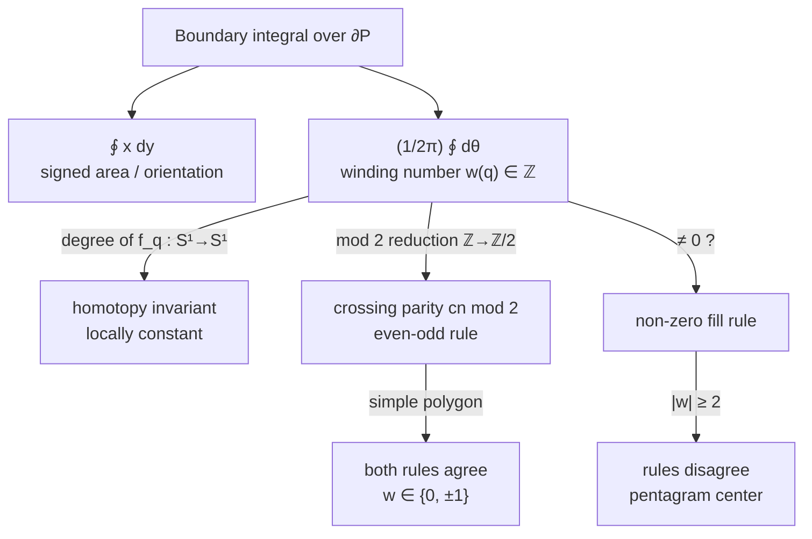

# Point-in-Polygon (PIP) — Mathematical Foundations and Complexity Theory

> **Focus:** rigor. A correctness proof of the crossing-number rule from the Jordan curve theorem, the winding-number formalism and its equivalence to crossing parity for simple polygons, exact degeneracy handling via simulation of simplicity and robust predicates, and query lower bounds for point location.

## Table of Contents

1. [Formal Definition](#1-formal-definition)
2. [The Jordan Curve Theorem](#2-the-jordan-curve-theorem)
3. [Correctness Proof of the Crossing-Number Rule](#3-correctness-proof-of-the-crossing-number-rule)
4. [Winding-Number Formalism](#4-winding-number-formalism)
5. [Equivalence: Crossing Parity vs Winding Mod 2](#5-equivalence-crossing-parity-vs-winding-mod-2)
6. [Worked Symbolic Trace](#6-worked-symbolic-trace)
7. [Degeneracy Handling — Exact Predicates and SoS](#7-degeneracy-handling--exact-predicates-and-sos)
8. [Robust Orientation Predicate](#8-robust-orientation-predicate)
8b. [Correctness of the Convex O(log n) Test](#8b-correctness-of-the-convex-olog-n-test)
9. [The Shoelace Connection and Algebraic Topology View](#9-the-shoelace-connection-and-algebraic-topology-view)
10. [Complexity and Query Lower Bounds](#10-complexity-and-query-lower-bounds)
11. [Point Location — Optimal Bounds](#11-point-location--optimal-bounds)
11b. [Polygons With Holes — Nesting Number](#11b-polygons-with-holes--nesting-number-formalism)
11c. [Generalized Winding Number — 3D Formalism](#11c-generalized-winding-number--the-3d-formalism)
12. [Average-Case and Expected Query Cost](#12-average-case-and-expected-query-cost)
12b. [Cache-Oblivious and Parallel Analysis](#12b-cache-oblivious-and-parallel-analysis)
13. [Comparison with Alternatives](#13-comparison-with-alternatives)
13b. [Open Problems and Recent Results](#13b-open-problems-and-recent-results)
14. [Summary](#14-summary)

---

## 1. Formal Definition

Let `P = (v_0, v_1, …, v_{n-1})` be a **simple polygon**: a cyclic sequence of vertices `v_i ∈ ℝ²` whose boundary `∂P` is the union of edges `e_i = [v_i, v_{i+1}]` (indices mod `n`), such that non-adjacent edges do not intersect and adjacent edges meet only at their shared vertex. `∂P` is a **simple closed curve** (a Jordan curve): the continuous image of a circle `S¹` under an injective map (injective except that the endpoints coincide).

```text
∂P : S¹ → ℝ²,  injective on S¹ minus the gluing point,  piecewise linear.
```

**The point-location problem.** Given a query point `q ∈ ℝ² \ ∂P`, decide whether `q` lies in the bounded interior `int(P)` or the unbounded exterior `ext(P)`.

**Definition 1.0 (Simple polygon, formally).** `P` is *simple* iff the boundary map `∂P : S¹ → ℝ²` is injective except at the single gluing point of `S¹`. Equivalently, for the edge set `{e_0, …, e_{n−1}}`:

```text
(i)  adjacent edges e_i, e_{i+1} share exactly their common vertex v_{i+1};
(ii) non-adjacent edges e_i, e_j (j ≠ i±1 mod n) satisfy e_i ∩ e_j = ∅.
```

Condition (ii) is what excludes self-intersection. A polygon violating (ii) is *non-simple* (e.g. the pentagram), for which `int(P)` is no longer well-defined by topology alone and one must *choose* a fill rule (Section 5). For simple polygons the interior is canonical by the Jordan curve theorem (Section 2), and that canonical interior is exactly what both rules return (Corollary 5.2).

**Definition 1.1 (Crossing number).** For a query point `q` and a ray `ρ` from `q`, the crossing number `cn(q, ρ)` is the number of *proper* (transversal) intersections of `ρ` with `∂P`. The **even-odd rule** declares `q ∈ int(P) ⇔ cn(q, ρ) is odd`, for a ray `ρ` in *general position* (passing through no vertex and collinear with no edge).

**Definition 1.2 (Winding number).** For `q ∉ ∂P`, the winding number `w(q) ∈ ℤ` is the number of times `∂P`, traversed once in its given orientation, winds counter-clockwise around `q`:

```text
w(q) = (1 / 2π) ∮_{∂P} dθ = (1 / 2π) ∮_{∂P} ( (x - q_x) dy - (y - q_y) dx ) / |·|² .
```

The **non-zero rule** declares `q` inside `⇔ w(q) ≠ 0`.

Both definitions are well-posed for `q ∉ ∂P`. The substance of this document is proving the even-odd rule correct (it always returns the topological interior of a simple polygon) and relating it to `w(q)`.

**Definition 1.4 (Proper / transversal crossing).** A ray `ρ` and edge `e_i` cross *properly* if they intersect at a single point interior to both, and `ρ` passes from one side of `e_i`'s supporting line to the other. Tangential touches (ray collinear with an edge, or grazing a vertex without changing sides) are *improper* and excluded from `cn` under the general-position assumption (Definition 2.2). The half-open rule is precisely the bookkeeping that converts the *almost-everywhere* general-position count into a deterministic value for *every* input, including improper configurations — formalized as Simulation of Simplicity in Section 7.

**Remark 1.5 (Why two definitions at all).** Crossing number lives in `ℤ/2` (only parity is well-defined for an unsigned count under ray rotation), whereas winding number lives in `ℤ` (the signed count is a homotopy invariant, Section 9). The `ℤ` invariant strictly refines the `ℤ/2` one via the reduction map `ℤ → ℤ/2` (Theorem 5.1). For simple polygons the extra information in `ℤ` is degenerate (`w ∈ {0, ±1}`), so the cheaper parity suffices; the refinement matters exactly for non-simple boundaries.

---

## 2. The Jordan Curve Theorem

The crossing-number rule is *meaningful* only because of a deep topological fact.

**Theorem 2.1 (Jordan Curve Theorem).** A simple closed curve `C ⊂ ℝ²` divides the plane into exactly two connected open regions — a bounded **interior** and an unbounded **exterior** — and `C` is the boundary of both.

For a general continuous Jordan curve this is surprisingly hard to prove (Veblen, 1905; Jordan's own 1887 proof had gaps). For a **polygon** the proof is elementary and constructive, and it *is* the crossing-number algorithm. We prove the polygonal version directly, which simultaneously establishes correctness of ray casting.

**Definition 2.2 (General-position ray).** A ray `ρ` from `q` is in general position w.r.t. `∂P` if it (i) passes through no vertex `v_i`, and (ii) is not collinear with any edge `e_i`. For any fixed `q ∉ ∂P`, the set of directions failing (i) or (ii) is finite (at most `2n` bad directions), so almost every direction is general-position; in particular a rightward horizontal ray is general-position after an arbitrarily small rotation, and the half-open rule of `junior.md` *simulates* such a rotation exactly (Section 6).

---

## 3. Correctness Proof of the Crossing-Number Rule

We show: for `q ∉ ∂P` and any general-position ray `ρ`, the parity `cn(q, ρ) mod 2` is the same for all general-position rays, and equals `0` iff `q` is in the unbounded component.

**Lemma 3.1 (Parity is ray-independent).** For two general-position rays `ρ_1, ρ_2` from the same `q`, `cn(q, ρ_1) ≡ cn(q, ρ_2) (mod 2)`.

*Proof.* Continuously rotate `ρ_1` to `ρ_2` through angle `θ ∈ [0, α]`. As the direction sweeps, `cn` changes only at directions where the ray passes through a vertex or becomes collinear with an edge (a finite set of `θ` values). Consider crossing one such critical direction `θ*` where the ray sweeps over a single vertex `v_i` shared by edges `e_{i-1}, e_i`:

- If `v_i` is a **local extremum** of `∂P` in the direction perpendicular to the ray (both incident edges on the same side), the two edges' contributions to `cn` appear or vanish *together* — `cn` changes by `0` or `±2`. Parity preserved.
- If `v_i` is a **monotone pass-through** (edges on opposite sides), one edge's crossing replaces the other's — `cn` changes by `0`. Parity preserved.

In every case `cn` changes by an even amount across a critical direction. Hence `cn mod 2` is invariant under the rotation, so `cn(q, ρ_1) ≡ cn(q, ρ_2) (mod 2)`. ∎

Lemma 3.1 lets us define `π(q) := cn(q, ρ) mod 2`, independent of the (general-position) ray.

**Lemma 3.2 (Parity is locally constant off `∂P`).** `π(q)` is constant on each connected component of `ℝ² \ ∂P`.

*Proof.* Move `q` continuously along a path avoiding `∂P`, dragging a fixed-direction ray with it. `cn` can change only when the ray's endpoint `q` crosses an edge — but `q ∉ ∂P` along the path, so the *endpoint* never lies on `∂P`. The crossings can appear/disappear only at the **far** behavior, i.e. when the moving ray passes a vertex/edge, which (as in Lemma 3.1) changes `cn` by an even amount. Thus `π(q)` is invariant along the path, hence constant on each connected component of `ℝ² \ ∂P`. ∎

**Lemma 3.3 (Adjacent components have opposite parity).** If `q` and `q'` are separated by exactly one edge crossing (a short segment from `q` to `q'` meets `∂P` transversally once), then `π(q) ≠ π(q')`.

*Proof.* Use the *same* ray direction for both, chosen so the small segment `[q, q']` is along the ray direction. Then `cn(q', ρ) = cn(q, ρ) ± 1` (the one edge between them is added or removed from what the ray sees). Parity flips. ∎

**Theorem 3.4 (Correctness / polygonal Jordan).** `ℝ² \ ∂P` has exactly two components: `{q : π(q) = 0}` (unbounded, the exterior) and `{q : π(q) = 1}` (bounded, the interior). Hence the even-odd rule `q ∈ int(P) ⇔ cn(q, ρ) odd` is correct.

*Proof sketch.* By Lemma 3.2, `π` partitions `ℝ² \ ∂P` into the `π = 0` set and the `π = 1` set, each a union of components. For `|q|` large, every ray from far outside the polygon's bounding box crosses `∂P` zero times for an appropriate direction, so `π(q) = 0` on the unbounded region — the exterior is entirely `π = 0`. Lemma 3.3 forces any region immediately across one edge from the exterior to have `π = 1`; that region is bounded (enclosed by `∂P`). A standard argument (each edge is adjacent to exactly the `π=0` side and the `π=1` side; connectivity of a simple polygon's interior) shows there is exactly one component of each parity. Therefore the two parity classes are precisely the exterior and interior of the Jordan curve `∂P`. ∎

This is the rigorous content behind "odd crossings ⇒ inside": the parity is a well-defined `ℤ/2` invariant that flips across every edge and is `0` at infinity.

---

## 4. Winding-Number Formalism

The winding number is the integer-valued (rather than `ℤ/2`) version of the same idea, and it is the more powerful invariant.

**Definition 4.1.** With `θ_i(t)` the angle of the vector `(γ(t) - q)` where `γ` parametrizes `∂P`,

```text
w(q) = (1 / 2π) ∮_{∂P} dθ ∈ ℤ.
```

The integral is an integer because `γ` is a closed loop, so the total angle swept is a multiple of `2π`. For a piecewise-linear polygon, the contour integral reduces to a sum of signed angles subtended by each edge at `q`:

```text
w(q) = (1 / 2π) Σ_{i} ∠(v_i, q, v_{i+1})_signed .
```

**Proposition 4.2 (Winding via signed crossings).** Let `ρ` be a general-position ray from `q`. Then

```text
w(q) = (#upward crossings of ρ with ∂P, P on the left)
     − (#downward crossings of ρ with ∂P, P on the right),
```

which is exactly Sunday's algorithm: each edge crossing the ray is counted `+1` if it crosses upward with `q` to its left, `−1` if downward with `q` to its right. This is `O(n)` and trig-free, and it computes the *signed* integer `w(q)`, not just its parity.

*Proof.* Each edge crossing the ray contributes `±2π` to the swept angle depending on crossing direction; dividing by `2π` and summing gives the signed crossing count, which equals `w(q)`. The "left/right" condition is the sign of the orientation determinant `isLeft(v_i, v_{i+1}, q)` (Section 7). ∎

**Definition 4.3 (Non-zero fill).** `q` is "inside" under the non-zero rule iff `w(q) ≠ 0`. For a polygon traversed once counter-clockwise, `w(q) = +1` for interior points and `0` for exterior points, so non-zero agrees with even-odd. They differ only when `∂P` is not simple (winds multiple times or in mixed directions).

---

## 5. Equivalence: Crossing Parity vs Winding Mod 2

**Theorem 5.1.** For *any* closed polygonal curve (simple or not) and `q ∉ ∂P`,

```text
cn(q, ρ) ≡ w(q)  (mod 2).
```

*Proof.* Both count crossings of the ray with `∂P`; `cn` counts them unsigned, `w` counts them signed (`+1`/`−1`). Reducing a signed sum modulo 2 erases the signs (`−1 ≡ +1 mod 2`), so `w(q) mod 2 = (#crossings) mod 2 = cn(q, ρ) mod 2`. ∎

**Corollary 5.2.** For a **simple** polygon, even-odd and non-zero rules coincide everywhere: `w(q) ∈ {0, ±1}`, so `w(q) ≠ 0 ⇔ w(q) odd ⇔ cn odd`. The two rules can disagree **only** where `|w(q)| ≥ 2`, i.e. regions wound multiple times — impossible for a simple polygon. This is the formal reason the figure-eight / pentagram is the canonical counterexample: its central region has `w = 2` (even, non-zero), so even-odd calls it outside while non-zero calls it inside.

### 5.1 Explicit pentagram computation

Make Corollary 5.2 concrete. A pentagram is the path `v_0 → v_2 → v_4 → v_1 → v_3 → v_0` over five points `v_0,…,v_4` equally spaced on a circle (the "skip-one" star). Traversing this path once, the direction vector from the center `c` to the moving point sweeps through `2 × 360° = 720°` — the path goes around the center **twice**. Therefore:

```text
w(c) = 720° / 360° = 2   (non-zero ⇒ INSIDE under the non-zero rule)
cn(c, ρ) ≡ w(c) ≡ 0 (mod 2)   (even ⇒ OUTSIDE under the even-odd rule)
```

A horizontal ray from the center crosses the star's outline at four places (two on the way "out" through one point-pair, two more through the overlapping loop) — `cn = 4`, even, confirming the parity. The five outer triangular tips, by contrast, each have `w = 1` (wound once) and `cn` odd, so both rules agree they are inside. The disagreement is confined exactly to the doubly-wound central pentagon, matching the `|w| ≥ 2` criterion of Corollary 5.2.

This is not pathology — it is the formal content of SVG/PostScript exposing both `fill-rule: evenodd` (hollow center) and `fill-rule: nonzero` (solid center) as deliberate authoring choices.

---

## 6. Worked Symbolic Trace

To make the parity argument concrete, trace the crossing test against a non-convex polygon where a single ray crosses three edges, and verify the invariants of Section 3 numerically.

Take the polygon (an "arrow"/concave shape), CCW:

```text
v0=(0,0)  v1=(6,0)  v2=(6,2)  v3=(3,2)  v4=(3,4)  v5=(0,4)
```

Query `q = (1, 1)`. Ray: horizontal, rightward, `y = 1`. Examine each edge `(v_i, v_{i+1})` with the half-open straddle test `(a_y > 1) ≠ (b_y > 1)`:

```text
edge v0->v1 : (0>1)=F , (0>1)=F  -> F≠F = false       skip (horizontal at y=0)
edge v1->v2 : (0>1)=F , (2>1)=T  -> F≠T = true         x_cross = 6 ; 6>1 -> COUNT (cn=1)
edge v2->v3 : (2>1)=T , (2>1)=T  -> T≠T = false        skip (horizontal at y=2)
edge v3->v4 : (2>1)=T , (4>1)=T  -> T≠T = false        skip
edge v4->v5 : (4>1)=T , (4>1)=T  -> T≠T = false        skip (horizontal at y=4)
edge v5->v0 : (4>1)=T , (0>1)=F  -> T≠F = true         x_cross = 0 ; 0>1=F -> not counted
```

Total crossings `cn = 1`, odd ⇒ **INSIDE**. Correct: `(1,1)` is clearly within the arrow's body.

Now move `q` to `(4, 3)` (in the "notch" region, outside the polygon). Ray `y = 3`:

```text
edge v0->v1 : F,F -> false                              skip
edge v1->v2 : (0>3)=F,(2>3)=F -> false                  skip
edge v2->v3 : (2>3)=F,(2>3)=F -> false                  skip
edge v3->v4 : (2>3)=F,(4>3)=T -> true   x_cross=3 ; 3>4=F   not counted
edge v4->v5 : (4>3)=T,(4>3)=T -> false                  skip
edge v5->v0 : (4>3)=T,(0>3)=F -> true   x_cross=0 ; 0>4=F   not counted
```

`cn = 0`, even ⇒ **OUTSIDE**. Correct — `(4,3)` sits in the concave notch, outside the shape, and the two straddling edges both cross to the *left* of `q`, so neither counts.

**Verification of Lemma 3.3 (adjacent components flip parity).** Slide `q` from `(4,3)` (outside, `cn=0`) leftward to `(2,3)`. Now edge `v3->v4` (vertical segment `x=3` from `y=2` to `y=4`) has `x_cross = 3 > 2`, so it counts: `cn = 1`, odd ⇒ inside. Crossing exactly that one edge flipped the parity from even to odd — precisely Lemma 3.3 in action. The single edge `x=3` is the boundary between the inside body and the outside notch.

This trace also exhibits every degeneracy the half-open rule absorbs: three **horizontal edges** (at `y=0,2,4`) are silently skipped because `(a_y>py) ≠ (b_y>py)` is false for them, and no division by `b_y - a_y = 0` ever occurs.

---

## 7. Degeneracy Handling — Exact Predicates and SoS

The proofs above assumed a general-position ray. Real inputs are degenerate: the ray passes through vertices, edges are horizontal, or `q` lies on `∂P`. Two principled techniques eliminate degeneracy.

### 6.1 Simulation of Simplicity (SoS)

**Edelsbrunner–Mücke's Simulation of Simplicity** symbolically perturbs every input coordinate by distinct infinitesimals `ε^{2^k}` so that no degeneracy survives, while guaranteeing the perturbed answer is consistent with a valid general-position instance. For PIP this *justifies* the half-open rule: assigning the query point an infinitesimal upward (or the ray an infinitesimal rotation) makes every vertex strictly above or below `py`, which is exactly what `(a.y > py) != (b.y > py)` encodes. Concretely:

- A vertex exactly at `py` is treated as if at `py − δ` (infinitesimally below), so the strict `>` consistently assigns it to the lower edge. No double count, no missed count.
- A horizontal edge at `py` is treated as if tilted infinitesimally, contributing no crossing — matching `(ay > py) != (by > py)` evaluating false.

Thus the half-open convention is **not a hack**: it is the closed-form result of applying SoS to the crossing test. The algorithm computes the answer for a polygon in general position infinitesimally close to the degenerate input.

### 6.2 Explicit boundary classification

SoS resolves `q ∉ ∂P`. When `q ∈ ∂P` exactly, no perturbation should hide that — the application must decide. The exact on-edge predicate is:

```text
on_edge(q, v_i, v_{i+1}) ⇔ orient(v_i, v_{i+1}, q) = 0  ∧  q ∈ bbox([v_i, v_{i+1}]) .
```

evaluated with the *exact* orientation determinant (Section 7). A **consistent boundary-ownership** rule (e.g. each boundary point belongs to the polygon whose interior is to a fixed side) yields a partition of the plane with no overlaps or gaps — essential for adjacent-region GIS partitions.

---

## 8. Robust Orientation Predicate

Every PIP method ultimately rests on the **orientation** (or `isLeft`) predicate:

```text
orient(a, b, c) = sign det | b_x − a_x   b_y − a_y |
                            | c_x − a_x   c_y − a_y |
              = sign( (b_x−a_x)(c_y−a_y) − (b_y−a_y)(c_x−a_x) ).
```

Computed in floating point, the `2×2` determinant suffers catastrophic cancellation when `a, b, c` are nearly collinear — the very case PIP boundary tests hit. The sign can come out wrong, violating the algorithm's invariants (e.g. producing the inconsistent "double-claim" of senior level).

**Shewchuk's adaptive exact predicates** evaluate `orient` to the correct sign with provable guarantees:

```text
1. Compute the determinant in double precision; compute an error bound B.
2. If |result| > B, the sign is certified correct — return it (fast path, ~no overhead).
3. Else, recompute incrementally at higher precision (expansion arithmetic),
   stopping as soon as the sign is determined.
```

The expected cost is essentially that of the floating-point evaluation (the slow path triggers only for near-degenerate inputs), but the result is *always* the exact sign. Using exact `orient` makes the winding-number and convex-binary-search tests **provably correct** for arbitrary double-precision inputs. Alternatively, snapping coordinates to integers bounded by `2^{b}` makes `orient` an exact `2b+1`-bit integer computation — the most reliable practical route when the data permits quantization.

```text
Precision strategy summary:
  double, naive                : fast,    wrong sign near collinearity
  double + epsilon             : fast,    inconsistent (thick boundary)
  adaptive exact (Shewchuk)    : ~fast,   always-correct sign
  integer / fixed-point        : fast,    exact when coords quantizable
```

---

## 8b. Correctness of the Convex O(log n) Test

The convex binary search of `middle.md` deserves a proof, since its `O(log n)` cost relies on a monotonicity invariant that fails for non-convex polygons.

Let `P = (v_0, …, v_{n-1})` be convex and CCW. Anchor at `v_0`.

**Lemma 8b.1 (Angular monotonicity).** The orientation values `orient(v_0, v_i, q)` viewed as `i` increases from `1` to `n−1` change sign at most once for any fixed `q`, i.e. the predicate "`q` is left of ray `v_0 → v_i`" is monotone in `i`.

*Proof.* Convexity means the vertices `v_1, …, v_{n−1}` appear in strictly increasing polar angle around `v_0` (the interior turns consistently left). The sign of `orient(v_0, v_i, q)` is determined by whether `q`'s polar angle around `v_0` is less or greater than `v_i`'s. Since the `v_i` angles are sorted, the comparison flips exactly once — at the `v_i` straddling `q`'s angle. ∎

**Theorem 8b.2.** The binary search locating the index `lo` with `orient(v_0, v_lo, q) ≥ 0 > orient(v_0, v_{lo+1}, q)`, followed by the single test `orient(v_lo, v_{lo+1}, q) ≥ 0`, correctly decides `q ∈ P` in `O(log n)` orientation evaluations.

*Proof.* By Lemma 8b.1 the search is well-defined: it isolates the unique fan-triangle `(v_0, v_lo, v_{lo+1})` whose angular wedge from `v_0` contains `q`. After the quick rejects (`q` right of `v_0 v_1` or left of `v_0 v_{n−1}` ⇒ outside the fan ⇒ outside `P`, since `P` ⊆ fan for a convex polygon), `q` lies in this wedge. Within the wedge, `q ∈ P` iff `q` is on the interior side of the boundary edge `v_lo → v_{lo+1}`, which is the final `orient` test. Each binary-search step does `O(1)` orientation evaluations and halves the index range, so the total is `O(log n)`. ∎

The proof breaks for non-convex `P` because Lemma 8b.1 fails: a reflex vertex makes the angular sequence non-monotone, so the sign can flip multiple times and the binary search isolates the wrong wedge. This is the formal reason the `O(log n)` method is convex-only.

---

## 9. The Shoelace Connection and Algebraic Topology View

The winding number ties point-in-polygon to two classical objects: the **shoelace (signed area) formula** and the **degree of a map**.

### 9.1 Signed area as the winding number of the origin's complement

The shoelace formula gives the signed area of a simple polygon:

```text
2 · SignedArea(P) = Σ_{i} ( x_i · y_{i+1} − x_{i+1} · y_i ).
```

Its sign is the polygon's orientation: positive ⇔ CCW. There is a direct kinship with winding: the signed area equals the integral `∮ x dy` over the boundary, and the winding number of a point `q` is the normalized integral `(1/2π)∮ dθ` of the angle to `q`. Both are **boundary integrals whose value is determined entirely by `∂P`** (Green's theorem / Stokes' theorem in the plane). The winding number is, in this sense, the "pointwise" companion of the global signed area: signed area integrates the constant `1` over the interior, while `w(q)` integrates the indicator that the boundary wraps `q`.

### 9.2 Degree theory

`w(q)` is the **degree** of the map `f_q : S¹ → S¹` defined by `f_q(t) = (γ(t) − q)/|γ(t) − q|`, which sends the boundary parameter to the *direction* from `q`. The degree of a continuous map `S¹ → S¹` is a homotopy invariant in `ℤ`; that is precisely why `w(q)` is an integer and why it is constant on connected components of `ℝ² \ ∂P` (Lemma 3.2 is the polygonal special case of "degree is locally constant"). When `q` crosses `∂P`, the map `f_q` changes homotopy class by exactly `±1` — the topological restatement of Lemma 3.3.

```text
Hierarchy of invariants computed by the same O(n) sweep:
   signed area  : ∮ x dy            -> orientation, area
   winding w(q) : (1/2π) ∮ dθ       -> integer, inside iff ≠ 0  (degree of f_q)
   parity       : w(q) mod 2        -> even-odd rule (Z/2 reduction)
```

This is the unifying viewpoint: ray casting, winding, and shoelace are three readouts of one boundary integral, differing only in what they integrate and in which group (`ℤ` vs `ℤ/2`) the answer lives.




---

## 10. Complexity and Query Lower Bounds

**Single query.** Ray casting and winding both do `Θ(n)` arithmetic. This is *optimal for a single query on an unprocessed polygon*: an adversary argument shows any algorithm must, in the worst case, inspect every edge — withholding the last unexamined edge can flip the answer (place `q` so that whether it is inside depends on a single not-yet-read edge). Hence:

**Theorem 8.1.** Any deterministic PIP algorithm with no preprocessing must read `Ω(n)` of the polygon's edges in the worst case. Therefore ray casting is worst-case optimal at `Θ(n)`.

*Adversary argument (full).* Fix the query point `q` at the origin. Construct a "comb": `n−1` long thin spikes radiating outward, plus one designated edge `e*` near `q` whose exact placement is left undetermined. The adversary answers each edge-probe consistently with *both* a polygon in which `q` is inside and one in which `q` is outside, as long as `e*` is unprobed — the two completions agree on every edge except `e*`, and whether `q` is inside flips with `e*`'s position. An algorithm that halts before probing `e*` cannot distinguish the two completions, so it errs on one of them. Hence every correct algorithm probes all `n` edges in the worst case, giving the `Ω(n)` bound. ∎

**Many queries (point location).** With preprocessing, the per-query cost drops to `O(log n)`. The lower bound for point location in the **algebraic decision-tree / pointer-machine** model:

**Theorem 8.2 (Point-location lower bound).** In the comparison/algebraic-decision-tree model, locating a point among a planar subdivision of size `n` requires `Ω(log n)` comparisons per query in the worst case.

*Proof idea.* A subdivision can encode a sorted set of `n` values along a line; locating `q` solves the predecessor/search problem, which has an `Ω(log n)` decision-tree lower bound by the standard information-theoretic argument (`n+1` possible answers ⇒ tree height `≥ log₂(n+1)`). ∎

Thus the trapezoidal-map and slab structures (`O(log n)` query) are **optimal**, and the convex `O(log n)` binary search is optimal for convex polygons. The preprocessing/space frontier:

| Structure | Query | Space | Build | Optimal? |
|-----------|-------|-------|-------|----------|
| None (ray cast) | Θ(n) | O(1) | — | optimal for 1 query |
| Convex fan search | Θ(log n) | O(n) | O(n) | optimal (convex) |
| Slab decomposition | Θ(log n) | Θ(n²) | Θ(n²) | optimal query, poor space |
| Trapezoidal map | O(log n) exp | O(n) | O(n log n) exp | **optimal query + space** |
| Kirkpatrick hierarchy | O(log n) | O(n) | O(n) | optimal, deterministic |

Kirkpatrick's hierarchy achieves the optimal `O(log n)` query, `O(n)` space, `O(n)` build *deterministically* via repeated independent-set triangulation removal — the theoretical gold standard; trapezoidal maps win in practice for simplicity and generality.

---

## 11. Point Location — Optimal Bounds

The trade-off space is fully understood. Define `Q(n)` query time, `S(n)` space, `P(n)` preprocessing:

```text
Optimal frontier for planar point location:
    Q(n) = O(log n),  S(n) = O(n),  P(n) = O(n)        (Kirkpatrick, deterministic)
    Q(n) = O(log n),  S(n) = O(n),  P(n) = O(n log n)  (trapezoidal, randomized — simpler)

Lower bounds (any structure):
    Q(n) = Ω(log n)  in the decision-tree model
    S(n) = Ω(n)      (must at least store the subdivision)
```

No structure beats `O(log n)` query without exploiting word-RAM bit tricks (which can reach `O(log n / log log n)` for integer coordinates, the fusion-tree-style improvement — outside the comparison model). For the comparison model, `O(log n)` / `O(n)` / `O(n)` is the final word.

---

## 11b. Polygons With Holes — Nesting Number Formalism

A polygon with holes is a region bounded by an outer ring plus inner rings (holes), each a simple closed curve. The winding-number framework handles this with no special cases if the rings are **consistently oriented**: the outer ring CCW (`+1` contribution), each hole CW (`−1` contribution).

**Definition 11b.1 (Nesting / total winding).** For a multiply-connected region `R = O \ (H_1 ∪ … ∪ H_k)` with outer ring `O` and holes `H_j`, define

```text
W(q) = w_O(q) + Σ_j w_{H_j}(q),
```

summing the signed winding of every ring. With `O` CCW and each `H_j` CW:

```text
q in outer, outside all holes : W = +1 + 0       = +1   -> inside
q inside a hole               : W = +1 + (−1)    =  0    -> outside
q outside outer               : W =  0 + 0       =  0    -> outside
```

**Proposition 11b.2.** `q ∈ R ⇔ W(q) ≠ 0` under the orientation convention above. Equivalently, the even-odd rule applied to the **concatenation of all rings** gives the same membership: a point inside a hole is crossed once by the outer ring and once by the hole ring, total parity even ⇒ outside. This is why the practical "ray-cast against all rings, take overall parity" trick is correct — it is `W(q) mod 2` (Theorem 5.1) for the multi-ring curve.

The subtlety: if hole orientations are *not* normalized (some authoring tools emit all rings CCW), the parity (even-odd) trick still works because it is orientation-blind, but the *signed* nesting number `W(q)` does not, and any code that reads `W`'s sign (e.g. to compute net area `Σ signed-area = outer − holes`) breaks. Normalizing ring orientation on ingest is the robust fix.

---

## 11c. Generalized Winding Number — The 3D Formalism

The 2D winding number `w(q) = (1/2π)∮ dθ` generalizes to 3D via **solid angle**. For a closed, oriented triangle mesh `M` with triangles `T`, the generalized winding number at `q ∉ M` is

```text
w_3D(q) = (1 / 4π) Σ_{T ∈ M} Ω_T(q),
```

where `Ω_T(q)` is the **signed solid angle** that triangle `T` subtends at `q`. The solid angle of a triangle with vertices `a, b, c` seen from `q` is given by the Van Oosterom–Strackee formula:

```text
tan( Ω/2 ) =  det[a−q, b−q, c−q]
            ───────────────────────────────────────────────────────
            |a−q||b−q||c−q| + (a−q)·(b−q)|c−q| + (b−q)·(c−q)|a−q| + (c−q)·(a−q)|b−q|
```

**Theorem 11c.1 (Jacobson et al.).** For a watertight, consistently oriented mesh, `w_3D(q)` is an integer: `1` strictly inside, `0` strictly outside — the 3D analog of `w(q) ∈ {0, 1}` for a simple polygon. For **non-watertight** meshes it varies smoothly and continuously, so thresholding `w_3D(q) > ½` yields a robust inside/outside segmentation even with holes and self-intersections — which the discrete face-parity ray test cannot do.

The reduction to ray-parity: summing solid angles modulo the integer structure is equivalent to counting signed ray–face crossings, so `face-parity ≡ w_3D mod 2`, mirroring `cn ≡ w mod 2` in 2D (Theorem 5.1) exactly one dimension up.

---

## 12. Average-Case and Expected Query Cost

The worst-case `Θ(n)` for ray casting is pessimistic for many real query distributions. Two refinements matter in analysis.

### 12.1 Bounding-box pre-filter expected cost

Let the polygon have bounding box of area `A_box` and lie inside a query domain of area `A_dom`. If queries are uniform over the domain, a query lands inside the box with probability `p = A_box / A_dom`. The bounding-box pre-check costs `O(1)`; only with probability `p` do we pay the full `O(n)` scan. Expected cost per query:

```text
E[cost] = O(1) + p · O(n) = O(1 + (A_box/A_dom) · n).
```

For a fixed polygon and a query domain much larger than its box (`A_box ≪ A_dom`), the expected cost is `O(1)` amortized over the stream — the formal justification for the senior-level "most far-outside queries reject in `O(1)`".

### 12.2 Trapezoidal map expected query depth

Seidel's randomized trapezoidal map has expected query path length `O(log n)` over the random insertion order, and the bound is **per query, in expectation over the construction randomness** — not dependent on the query distribution. The precise statement: for any fixed query point, the expected number of DAG nodes visited is `O(log n)`, and with high probability the *maximum* over all query points is `O(log n)` as well. The expected construction time is `O(n log n)` and expected size `O(n)`, both by a backwards-analysis argument counting the expected number of trapezoids created/destroyed at each insertion:

```text
E[trapezoids touched when inserting the k-th segment] = O(1)   (backwards analysis)
=> E[total construction work] = Σ_{k=1}^{n} O(1) · O(log k) wiring = O(n log n).
```

### 12.3 Smoothed view

Under a smoothed-analysis lens (worst-case input perturbed by small random noise), degeneracies vanish with probability 1, so the half-open/SoS machinery is only needed for genuinely adversarial or quantized inputs. This explains why naive float PIP "usually works" yet fails reproducibly on grid-aligned GIS data: real-world coordinates are frequently *exactly* quantized, defeating the smoothing assumption — hence the senior insistence on exact predicates for production GIS.

---

## 12b. Cache-Oblivious and Parallel Analysis

Beyond comparison counts, the hardware-realistic cost of PIP depends on memory layout and parallelism.

### 12b.1 External-memory / cache complexity

Parameterize by problem size `N = n` edges, cache size `M`, block size `B`. A single ray-casting query streams the edge array once:

```text
I/O cost (single query) = O(n / B)
```

— optimal, since the edges must be read at least once and `B` of them fit per block. The crucial layout decision is **storing edges contiguously** (a flat `xs[], ys[]` or struct-of-arrays) so the scan is fully sequential; an adjacency/pointer representation incurs `O(n)` random misses instead of `O(n/B)` sequential blocks, an order-of-magnitude penalty at scale (the senior-level "memory-bandwidth bound" observation made precise).

For batch queries against one polygon, blocking helps: process a *tile* of `Θ(M)` query points against the whole edge stream so the polygon stays cache-resident across the tile:

```text
batch of m queries, tiled : O( (m/B) + (m/M)·(n/B) )  I/Os
```

versus the naive `O(m · n / B)` when the polygon is reloaded per query. The trapezoidal-map search structure, laid out in van-Emde-Boas order, answers each point-location query in `O(log_B n)` block transfers — cache-obliviously optimal for the search.

### 12b.2 Parallel depth

PIP is trivially work-efficient and shallow in PRAM terms. The crossing count is a sum over independent per-edge predicates, so:

```text
work  = O(n)
depth = O(log n)   (parallel reduction of the n crossing indicators)
```

A single query parallelizes to `O(log n)` span on `n` processors via a parallel prefix/reduction over the per-edge `±1`/`0` contributions (the winding form is exactly a signed reduction, even cleaner than the boolean toggle, which is not associative as written — another reason winding is the analyst's preferred formulation). Batch queries are embarrassingly parallel across points with `O(1)` depth per point on a GPU, matching the senior-level SIMD/GPU batch design.

A subtle correctness point for parallelization: the boolean *toggle* `inside = !inside` is order-dependent (it composes via XOR, which *is* associative and commutative — so a parallel XOR-reduction of the per-edge "counted?" bits is correct), but the *winding sum* composes via integer addition (associative and commutative), making it the more natural reduction target. Either reduction is data-race-free because each edge's contribution is computed from read-only polygon data and the immutable query point; there is no shared mutable state in the per-edge map phase. This is why PIP scales to thousands of cores without locks — the only synchronization is the final reduction, itself `O(log n)` depth.

### 12b.3 Work-span summary

```text
                    work        span (depth)     I/O (single query)
ray cast (serial)   O(n)        O(n)             O(n/B)
ray cast (parallel) O(n)        O(log n)         O(n/B)
trapezoidal query   O(log n)    O(log n)         O(log_B n)
batch m points/GPU  O(m·n)      O(log n)         O((m/M)(n/B)+m/B)
```

The table closes the loop between the abstract `Θ(n)`/`Θ(log n)` bounds and the hardware-level performance a senior must reason about: the same algorithm is simultaneously comparison-optimal, cache-optimal (with contiguous layout), and depth-efficient (with a reduction).

---

## 13. Comparison with Alternatives

| Attribute | Even-odd (ray) | Winding (Sunday) | Convex search | Trapezoidal map |
|-----------|----------------|------------------|---------------|-----------------|
| Worst-case query | Θ(n) | Θ(n) | Θ(log n) | O(log n) exp |
| Returns | parity (∈ ℤ/2) | signed `w ∈ ℤ` | in/out | region id |
| Self-intersect semantics | even-odd fill | non-zero fill | n/a | n/a (simple subdivision) |
| Exactness achievable | yes (SoS + exact orient) | yes (exact orient) | yes (exact orient) | yes (exact orient) |
| Deterministic build | n/a | n/a | O(n) | randomized (Kirkpatrick: O(n) det.) |
| Space | O(1) | O(1) | O(n) | O(n) |

---

## 13b. Open Problems and Recent Results

- **Word-RAM point location.** For integer coordinates in `[0, U)`, point location can be done in `O(log n / log log n)` query time with `O(n)` space (fusion-tree / fractional-cascading hybrids), beating the comparison-model `Ω(log n)`. Whether the constant factors make this practical for real GIS workloads remains an engineering open question.
- **Dynamic point location.** Maintaining a point-location structure under insertion/deletion of edges (a polygon edited in real time) currently costs `O(log² n)` per query or `O(log n · log log n)` per update with sophisticated structures; closing the gap to fully `O(log n)` for both is open in general.
- **Robust generalized winding numbers at scale.** The 3D generalized winding number (Section 11c) is `O(m)` per query for an `m`-face mesh; the fast-multipole/Barnes–Hut acceleration to `O(log m)` per query (Barill et al.) is recent and its tightest constants are still being refined.
- **Exact predicates without precomputed bounds.** Shewchuk's adaptive predicates assume a known coordinate magnitude bound; certified-correct orientation for arbitrary-magnitude floating point with provably minimal slow-path triggering is an active topic in robust geometric computing.

These are at the frontier; for production, the `O(log n)` trapezoidal map with exact predicates and integer coordinates is the settled, optimal-in-the-comparison-model answer.

---

## 14. Summary

The crossing-number rule is correct because `cn(q, ρ) mod 2` is a well-defined `ℤ/2`-valued topological invariant: it is independent of the ray (Lemma 3.1), constant on each component of `ℝ² \ ∂P` (Lemma 3.2), flips across every edge (Lemma 3.3), and is `0` at infinity — which forces exactly two regions, proving the polygonal Jordan curve theorem and the even-odd rule simultaneously (Theorem 3.4). The **winding number** `w(q)` refines parity to a signed integer; `cn ≡ w (mod 2)` always, so even-odd and non-zero rules agree for simple polygons and differ only where `|w| ≥ 2` (Corollary 5.2). Degeneracies are handled rigorously, not heuristically: the half-open rule is the closed-form of **Simulation of Simplicity**, and **Shewchuk's adaptive exact orientation predicate** (or integer coordinates) makes every sign decision provably correct. Complexity is tight: `Θ(n)` per query is optimal without preprocessing; `Θ(log n)` query with `O(n)` space (Kirkpatrick / trapezoidal map) is optimal with preprocessing, matching the `Ω(log n)` decision-tree lower bound.

---

## Further Reading

- Veblen, O. (1905). *Theory on plane curves in non-metrical analysis situs* — rigorous Jordan curve theorem.
- Edelsbrunner, H., Mücke, E. (1990). *Simulation of Simplicity*. ACM TOG.
- Shewchuk, J. R. (1997). *Adaptive Precision Floating-Point Arithmetic and Fast Robust Geometric Predicates*.
- Seidel, R. (1991). *A simple and fast incremental randomized algorithm for computing trapezoidal decompositions*.
- Kirkpatrick, D. (1983). *Optimal search in planar subdivisions*. SIAM J. Comput.
- Sunday, D. *Inclusion of a Point in a Polygon* (winding number derivation).
- de Berg et al., *Computational Geometry*, Ch. 6 (point location), Ch. 9 (trapezoidal maps).
- Jacobson, A. et al. (2013). *Robust Inside-Outside Segmentation using Generalized Winding Numbers* (3D analog).

---

Next step: [interview.md](./interview.md) — tiered question bank and coding challenges in Go, Java, and Python.
