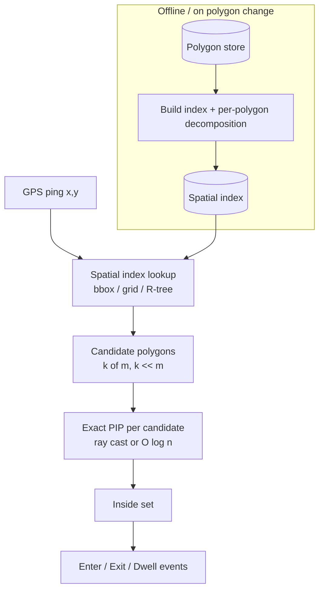
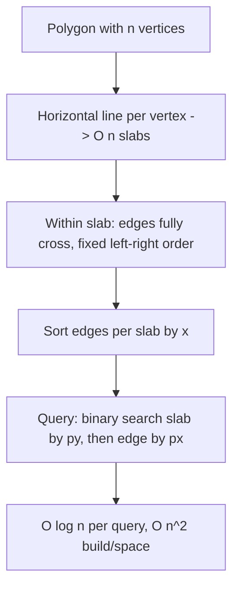
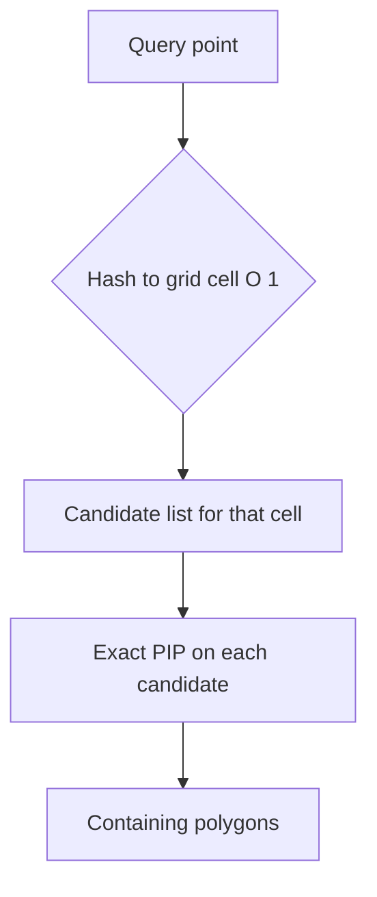
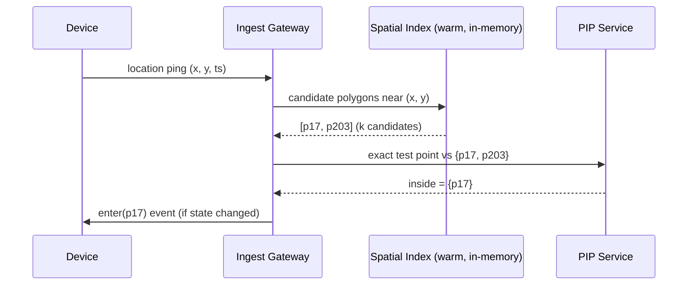
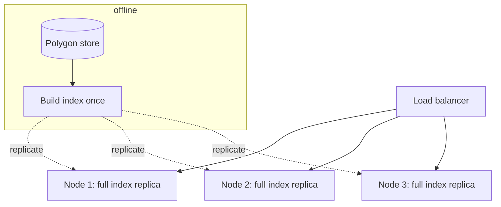

# Point-in-Polygon (PIP) — Senior Level

> A single `O(n)` ray cast answers "is this point in this polygon" in microseconds. A continental geofencing service answers *"which of 2 million polygons contains each of 500,000 GPS pings per second"* — and at that scale the algorithm is the easy part. The product is the **spatial index**, the **per-polygon preprocessing**, the **floating-point robustness**, and the **failure handling** when a malformed polygon or a NaN coordinate arrives.

## Table of Contents

1. [Introduction](#1-introduction)
2. [System Design — Geofencing and GIS at Scale](#2-system-design--geofencing-and-gis-at-scale)
3. [Many-Query Preprocessing — Slab Decomposition](#3-many-query-preprocessing--slab-decomposition)
4. [Many-Query Preprocessing — Trapezoidal Decomposition](#4-many-query-preprocessing--trapezoidal-decomposition)
5. [Spatial Indexing — Grid, R-tree, Quadtree](#5-spatial-indexing--grid-r-tree-quadtree)
6. [Floating-Point Robustness](#6-floating-point-robustness)
7. [Comparison at Scale](#7-comparison-at-scale)
8. [Architecture Patterns](#8-architecture-patterns)
9. [Code Examples — Grid-Accelerated Batch PIP](#9-code-examples--grid-accelerated-batch-pip)
10. [3D Note — Point-in-Polyhedron](#10-3d-note--point-in-polyhedron)
11. [Observability](#11-observability)
12. [Failure Modes](#12-failure-modes)
13. [Capacity Planning](#13-capacity-planning)
14. [Summary](#14-summary)

---

## 1. Introduction

At the senior level the question shifts from "how does ray casting work" to "where does point-in-polygon sit in my system, and what breaks when it does?" Three properties of the naive `O(n)` test drive every architectural decision:

- **It is per-polygon linear.** Testing one point against `m` polygons of average size `n` is `O(m·n)`. With `m` in the millions (US census tracts, all delivery zones, every store's catchment) this is hopeless without a spatial index that prunes candidate polygons first.
- **It recomputes from scratch.** The polygon is usually *static* (a city boundary changes rarely) while the query stream is enormous. That asymmetry — fixed structure, many queries — is the textbook signal to **preprocess**.
- **It is floating-point sensitive.** A GPS fix near a shared border between two adjacent regions must land in exactly one. Naive float math can put it in both or neither, double-billing a delivery or dropping a fence event.

The senior toolkit responds to each: **spatial indexes** (grid / R-tree / quadtree) prune from millions of polygons to a handful; **per-polygon decomposition** (slab, trapezoidal) turns each surviving `O(n)` test into `O(log n)`; **robust predicates** make boundary classification deterministic; and **defensive validation** stops malformed geometry from corrupting answers silently.

This document covers the five questions a senior owns:

1. Which index and which per-polygon structure fit this polygon count, size distribution, and query rate?
2. How do you make boundary decisions deterministic and consistent across adjacent polygons?
3. How do you serve a polygon set too large for one machine's memory?
4. How do you observe and alarm on PIP correctness and latency?
5. How do you plan capacity for QPS, memory, and preprocessing cost?

---

## 2. System Design — Geofencing and GIS at Scale

A geofencing service answers, for each incoming location event, "which fences (polygons) does this point fall inside?" The canonical pipeline:



The two-phase **filter-and-refine** pattern is universal in spatial systems:

1. **Filter (broad phase):** use a cheap spatial index to discard the vast majority of polygons whose bounding box cannot contain the point. `O(log m)` or `O(1)` per query.
2. **Refine (narrow phase):** run an exact PIP test only on the few survivors. `O(n)` or `O(log n)` per surviving polygon.

This mirrors collision detection in game engines exactly (broad-phase sweep-and-prune, then narrow-phase exact test) and SQL spatial queries (a GiST/R-tree index on geometry, then `ST_Contains` for exact membership). PostGIS's `ST_Contains`, for instance, first checks the bounding-box index, then runs an exact predicate only on candidates.

**Key design lever:** keep the polygon set static and the index warm. Rebuild incrementally when a polygon is added/edited rather than recomputing the whole index.

---

## 3. Many-Query Preprocessing — Slab Decomposition

When one polygon receives huge query volume, turn its `O(n)` test into `O(log n)` with **slab decomposition** (Dobkin–Lipton). Idea:

1. Draw a horizontal line through **every vertex**. These lines cut the plane into horizontal **slabs**. With `n` vertices there are `O(n)` slabs.
2. Within a single slab, **no edge starts or ends** — every edge that touches the slab crosses it completely, top to bottom. So inside a slab the edges appear in a fixed left-to-right order that does not change.
3. Sort the edges within each slab by `x`. Store, per slab, this sorted list (and which gaps are "inside").

**Query:** given `P = (px, py)`:

- Binary search the slab boundaries by `py` ⇒ find the slab in `O(log n)`.
- Binary search the slab's sorted edge list by `px` ⇒ count edges to the left, or directly read the inside/outside parity of the gap `P` falls in, in `O(log n)`.

Total query: `O(log n)`. Build: `O(n²)` time and `O(n²)` space in the naive version (each slab can hold up to `n` edges). That quadratic space is the catch — slab decomposition is excellent for **small-to-medium polygons queried billions of times**, but the `O(n²)` memory rules it out for huge polygons. Trapezoidal decomposition fixes the space.



---

## 4. Many-Query Preprocessing — Trapezoidal Decomposition

**Trapezoidal map** (Seidel's randomized incremental algorithm) is the production-grade point-location structure. It is the standard answer in computational-geometry texts for "many point-location queries on a planar subdivision."

- Decompose the polygon's interior (and exterior) into **trapezoids** by shooting vertical rays up and down from each vertex until they hit an edge. This yields `O(n)` trapezoids.
- Build a **search structure** (a DAG of x-nodes for vertices and y-nodes for edges) that maps any query point to its containing trapezoid.

| Property | Slab decomposition | Trapezoidal map |
|----------|-------------------|-----------------|
| Build time | O(n²) | **O(n log n)** expected (randomized) |
| Space | O(n²) | **O(n)** expected |
| Query time | O(log n) | **O(log n)** expected |
| Construction | deterministic | randomized incremental |
| Handles | one polygon | any planar subdivision (many polygons at once) |
| Production use | rarely (space cost) | GIS engines, CAD, Seidel's algorithm |

The trapezoidal map is strictly better asymptotically (`O(n)` space, `O(n log n)` build) and — crucially — it indexes an **entire planar subdivision**, so one structure answers "which region contains this point" across *all* polygons of a map simultaneously. That is exactly what a GIS "which census tract / which voronoi cell / which administrative region" query needs. The query walks the DAG in `O(log n)` expected time.

**When to use which:**

- **Single query, any polygon:** ray casting `O(n)`. No structure.
- **Many queries, one small polygon:** slab decomposition (if `n²` space is fine) or just keep ray casting if `n` is small.
- **Many queries, large polygon or whole map:** trapezoidal map — `O(n)` space, `O(log n)` query.
- **Millions of separate polygons:** spatial index (next section) to pick candidates, then per-polygon test.

---

## 5. Spatial Indexing — Grid, R-tree, Quadtree

To prune from `m` polygons to a few candidates, index polygons by their **bounding boxes**:

| Index | Build | Point query | Strength | Weakness |
|-------|-------|-------------|----------|----------|
| **Uniform grid** | O(m) | O(1) avg | dead simple, cache-friendly, great for uniform density | bad for skewed density; huge polygons span many cells |
| **R-tree** | O(m log m) | O(log m) avg | handles overlapping boxes, the GIS standard (PostGIS GiST) | complex; worst case degrades with overlap |
| **Quadtree** | O(m log m) | O(log m) | adapts to density, simple recursion | unbalanced on clustered data |
| **k-d tree** | O(m log m) | O(log m) | good for points; awkward for box extents | rebalancing cost on updates |

A **uniform grid** is often the pragmatic winner for geofencing: bucket each polygon into every grid cell its bounding box overlaps; at query time, hash the point to its cell in `O(1)` and exact-test only the polygons listed there. Big polygons that span many cells are the main wrinkle — handle with a coarse second tier or by clipping.



---

## 6. Floating-Point Robustness

This is where naive PIP quietly fails in production. The crossing test computes `x_cross = ax + (py-ay)/(by-ay)*(bx-ax)` and the winding test computes a cross product — both can round incorrectly for a point microscopically close to an edge, especially the **shared border between two adjacent polygons**. The consequences are real: a point classified into *both* neighbors (double-counted) or *neither* (lost event).

Mitigations, from cheap to bulletproof:

1. **Epsilon tolerance.** Treat `|x_cross - px| < ε` as on-boundary. Simple but fragile: a fixed `ε` is wrong at different coordinate magnitudes, and it can create a "thick" boundary where adjacent polygons both claim a point.

2. **Integer / fixed-point coordinates.** If coordinates can be snapped to a grid (e.g. GIS data quantized to centimeters), the cross-product and straddle tests become **exact** integer arithmetic — no rounding at all. This is the most reliable practical fix and how many GIS engines store geometry internally.

3. **Robust geometric predicates** (Shewchuk's adaptive exact arithmetic). The orientation test `isLeft` is evaluated with adaptive-precision arithmetic that is provably correct, falling back to exact only when the floating-point result is uncertain. This makes the winding/convex tests deterministic at full coordinate range. Covered formally in `professional.md`.

4. **Consistent boundary ownership.** Define a global rule — e.g. a point on a shared edge belongs to the polygon on a fixed side (the "top-left" rule used in rasterization) — so that *exactly one* of two adjacent polygons claims any boundary point. This guarantees a partition with no gaps and no overlaps, independent of float noise. This is the same fill-rule discipline GPU rasterizers use to avoid double-shading shared triangle edges.

**Senior takeaway:** for adjacent-region partitions (which geofencing and GIS almost always are), *consistency* matters more than raw accuracy. A deterministic boundary-ownership rule plus integer coordinates beats a pile of epsilons.

---

## 7. Comparison at Scale

| Approach | Per-query | Memory | Build | Best operating point |
|----------|-----------|--------|-------|----------------------|
| Ray casting | O(n) | O(1) | none | one polygon, few queries |
| Convex binary search | O(log n) | O(n) | O(n) | convex polygon, many queries |
| Slab decomposition | O(log n) | O(n²) | O(n²) | small polygon, billions of queries |
| Trapezoidal map | O(log n) | O(n) | O(n log n) | large polygon / whole map, many queries |
| Grid + ray cast | O(1)+O(n) | O(m + cells) | O(m) | millions of polygons, uniform density |
| R-tree + ray cast | O(log m)+O(n) | O(m) | O(m log m) | millions of overlapping polygons (GIS) |

Read it as a decision: **index across polygons** (grid/R-tree) handles large `m`; **decompose within a polygon** (slab/trapezoidal) handles large `n`; real systems do both.

---

## 8. Architecture Patterns

**Static polygons, streaming queries (geofencing):**



Patterns that matter:

- **Filter-and-refine** (broad + narrow phase) — non-negotiable above a few thousand polygons.
- **Index in memory, geometry on disk** — keep bounding boxes / DAG hot; lazy-load full vertex lists for the few candidates.
- **Incremental index updates** — a polygon edit touches only its cells/trapezoids, not a full rebuild.
- **Enter/exit debouncing** — a point oscillating on a boundary (float noise + GPS jitter) must not emit a storm of enter/exit events; add hysteresis.

---

## 9. Code Examples — Grid-Accelerated Batch PIP

A uniform grid that buckets polygons by bounding box, then exact-tests only candidates.

#### Go

```go
package main

import "fmt"

type Pt struct{ X, Y float64 }
type Polygon struct {
	ID                     int
	Verts                  []Pt
	MinX, MinY, MaxX, MaxY float64
}

func bbox(p *Polygon) {
	p.MinX, p.MinY = 1e18, 1e18
	p.MaxX, p.MaxY = -1e18, -1e18
	for _, v := range p.Verts {
		p.MinX, p.MaxX = min(p.MinX, v.X), max(p.MaxX, v.X)
		p.MinY, p.MaxY = min(p.MinY, v.Y), max(p.MaxY, v.Y)
	}
}

func rayCast(poly []Pt, q Pt) bool {
	in := false
	n := len(poly)
	for i, j := 0, n-1; i < n; j, i = i, i+1 {
		a, b := poly[i], poly[j]
		if (a.Y > q.Y) != (b.Y > q.Y) {
			if a.X+(q.Y-a.Y)/(b.Y-a.Y)*(b.X-a.X) > q.X {
				in = !in
			}
		}
	}
	return in
}

type Grid struct {
	cell  float64
	cells map[[2]int][]*Polygon
}

func NewGrid(cell float64) *Grid { return &Grid{cell, map[[2]int][]*Polygon{}} }

func (g *Grid) key(x, y float64) [2]int {
	return [2]int{int(x / g.cell), int(y / g.cell)}
}

func (g *Grid) Insert(p *Polygon) {
	bbox(p)
	for cx := int(p.MinX / g.cell); cx <= int(p.MaxX/g.cell); cx++ {
		for cy := int(p.MinY / g.cell); cy <= int(p.MaxY/g.cell); cy++ {
			k := [2]int{cx, cy}
			g.cells[k] = append(g.cells[k], p)
		}
	}
}

// Query returns IDs of polygons containing q.
func (g *Grid) Query(q Pt) []int {
	var out []int
	for _, p := range g.cells[g.key(q.X, q.Y)] {
		if q.X < p.MinX || q.X > p.MaxX || q.Y < p.MinY || q.Y > p.MaxY {
			continue // bbox reject
		}
		if rayCast(p.Verts, q) {
			out = append(out, p.ID)
		}
	}
	return out
}

func main() {
	g := NewGrid(10)
	g.Insert(&Polygon{ID: 1, Verts: []Pt{{0, 0}, {5, 0}, {5, 5}, {0, 5}}})
	g.Insert(&Polygon{ID: 2, Verts: []Pt{{3, 3}, {9, 3}, {9, 9}, {3, 9}}})
	fmt.Println(g.Query(Pt{4, 4})) // [1 2] (overlap region)
	fmt.Println(g.Query(Pt{1, 1})) // [1]
}
```

#### Java

```java
import java.util.*;

public class GridPIP {
    record Pt(double x, double y) {}

    static class Polygon {
        int id; double[][] v; double minX, minY, maxX, maxY;
        Polygon(int id, double[][] v) {
            this.id = id; this.v = v;
            minX = minY = 1e18; maxX = maxY = -1e18;
            for (double[] p : v) {
                minX = Math.min(minX, p[0]); maxX = Math.max(maxX, p[0]);
                minY = Math.min(minY, p[1]); maxY = Math.max(maxY, p[1]);
            }
        }
    }

    static boolean rayCast(double[][] poly, Pt q) {
        boolean in = false;
        int n = poly.length;
        for (int i = 0, j = n - 1; i < n; j = i++) {
            double ay = poly[i][1], by = poly[j][1];
            if ((ay > q.y()) != (by > q.y())) {
                double x = poly[i][0] + (q.y() - ay) / (by - ay) * (poly[j][0] - poly[i][0]);
                if (x > q.x()) in = !in;
            }
        }
        return in;
    }

    final double cell;
    final Map<Long, List<Polygon>> cells = new HashMap<>();
    GridPIP(double cell) { this.cell = cell; }
    long key(double x, double y) {
        return (((long) Math.floor(x / cell)) << 32) ^ (Math.floor(y / cell) == 0 ? 0 : (long) Math.floor(y / cell) & 0xffffffffL);
    }

    void insert(Polygon p) {
        for (int cx = (int) Math.floor(p.minX / cell); cx <= (int) Math.floor(p.maxX / cell); cx++)
            for (int cy = (int) Math.floor(p.minY / cell); cy <= (int) Math.floor(p.maxY / cell); cy++)
                cells.computeIfAbsent((((long) cx) << 32) ^ (cy & 0xffffffffL), z -> new ArrayList<>()).add(p);
    }

    List<Integer> query(Pt q) {
        List<Integer> out = new ArrayList<>();
        long k = (((long) Math.floor(q.x() / cell)) << 32) ^ ((long) Math.floor(q.y() / cell) & 0xffffffffL);
        for (Polygon p : cells.getOrDefault(k, List.of())) {
            if (q.x() < p.minX || q.x() > p.maxX || q.y() < p.minY || q.y() > p.maxY) continue;
            if (rayCast(p.v, q)) out.add(p.id);
        }
        return out;
    }

    public static void main(String[] args) {
        GridPIP g = new GridPIP(10);
        g.insert(new Polygon(1, new double[][]{{0,0},{5,0},{5,5},{0,5}}));
        g.insert(new Polygon(2, new double[][]{{3,3},{9,3},{9,9},{3,9}}));
        System.out.println(g.query(new Pt(4, 4))); // [1, 2]
        System.out.println(g.query(new Pt(1, 1))); // [1]
    }
}
```

#### Python

```python
from collections import defaultdict
from math import floor


def ray_cast(poly, q):
    inside = False
    n = len(poly)
    j = n - 1
    for i in range(n):
        ay, by = poly[i][1], poly[j][1]
        if (ay > q[1]) != (by > q[1]):
            x = poly[i][0] + (q[1] - ay) / (by - ay) * (poly[j][0] - poly[i][0])
            if x > q[0]:
                inside = not inside
        j = i
    return inside


class Grid:
    def __init__(self, cell):
        self.cell = cell
        self.cells = defaultdict(list)
        self.meta = {}  # id -> (verts, bbox)

    def insert(self, pid, verts):
        xs = [v[0] for v in verts]; ys = [v[1] for v in verts]
        bb = (min(xs), min(ys), max(xs), max(ys))
        self.meta[pid] = (verts, bb)
        for cx in range(floor(bb[0] / self.cell), floor(bb[2] / self.cell) + 1):
            for cy in range(floor(bb[1] / self.cell), floor(bb[3] / self.cell) + 1):
                self.cells[(cx, cy)].append(pid)

    def query(self, q):
        out = []
        key = (floor(q[0] / self.cell), floor(q[1] / self.cell))
        for pid in self.cells.get(key, []):
            verts, (mnx, mny, mxx, mxy) = self.meta[pid]
            if q[0] < mnx or q[0] > mxx or q[1] < mny or q[1] > mxy:
                continue
            if ray_cast(verts, q):
                out.append(pid)
        return sorted(out)


if __name__ == "__main__":
    g = Grid(10)
    g.insert(1, [(0, 0), (5, 0), (5, 5), (0, 5)])
    g.insert(2, [(3, 3), (9, 3), (9, 9), (3, 9)])
    print(g.query((4, 4)))  # [1, 2]
    print(g.query((1, 1)))  # [1]
```

**Run:** `go run main.go` | `javac GridPIP.java && java GridPIP` | `python grid.py`

---

## 10. 3D Note — Point-in-Polyhedron

The 2D ray-parity idea generalizes to 3D: to test whether a point is inside a closed **polyhedron** (a watertight triangle mesh), shoot a ray in any direction and **count how many triangular faces it pierces** — odd means inside, even means outside. Same Jordan-curve logic, one dimension up.

Practical differences:

- The crossing test becomes **ray–triangle intersection** (e.g. Möller–Trumbore), which is heavier than the 2D straddle test.
- Degeneracies multiply: the ray can hit an **edge** shared by two triangles or a **vertex** shared by many. Robust 3D PIP perturbs the ray direction or uses the signed-solid-angle / **generalized winding number** (Jacobson et al.), which is the 3D analog of the 2D winding number and is robust even on non-watertight meshes.
- For many queries, index the faces with a **BVH** (bounding volume hierarchy) and ray-cast, just as 2D uses a grid/R-tree.

The mental model carries over cleanly: **2D ray-parity ↔ 3D face-parity; 2D winding number ↔ 3D generalized winding number.**

---

## 10b. GIS Coordinate Systems — The Curved-Earth Trap

Everything above assumes a flat plane. Real GIS data lives on a sphere/ellipsoid, and treating raw latitude/longitude as planar `(x, y)` introduces errors that grow with region size and latitude. A senior must decide *which plane* the PIP test runs in.

| Approach | What it does | When it is fine | When it bites |
|----------|-------------|-----------------|---------------|
| Raw lat/long as `(x, y)` | run planar PIP directly on degrees | small regions, low latitudes, coarse tolerance | large/north-south-elongated polygons; meridians converge so "straight" edges are not geodesics |
| Projected coordinates (e.g. UTM, Web Mercator) | reproject to a metric planar CRS first, then planar PIP | most production GIS; consistent within a zone | crossing projection-zone or antimeridian boundaries |
| Spherical/geodesic PIP | edges are great-circle arcs; cast a geodesic ray | global-scale polygons, polar regions | heavier math; arc–ray crossing is non-trivial |

Two concrete failure cases:

- **Antimeridian (±180° longitude) wrap.** A polygon spanning the date line has vertices at `+179` and `-179` that are *adjacent* on Earth but `358` apart in raw coordinates — a naive bounding box becomes the whole globe and ray casting misfires. Normalize longitudes or split the polygon at the antimeridian.
- **Pole containment.** A polygon enclosing the North Pole has no consistent "rightward ray" in lon/lat space. Spherical PIP (counting geodesic-arc crossings, or summing spherical excess like a spherical winding number) is required.

**Senior takeaway:** for anything beyond a city-sized region, **reproject to a metric CRS** before running planar PIP, and special-case the antimeridian and poles. The algorithm is unchanged; the *coordinate frame* is the engineering decision.

---

## 10c. Batch Architecture — Sharding and Parallelism

When the query stream exceeds one machine, the static-polygon / streaming-query asymmetry makes scaling pleasant: the index is read-only at query time, so it **replicates trivially**.

- **Replicate the index, shard the query stream.** Each node holds the full (or regionally partitioned) spatial index in memory; a load balancer hashes incoming pings to nodes by source or round-robin. No cross-node coordination per query — PIP is embarrassingly parallel.
- **Geographic sharding for huge polygon sets.** If even the index does not fit in one box, partition by region (e.g. by S2/H3 cell, geohash prefix, or country) and route each query to the shard owning its location. Polygons straddling a shard boundary are replicated to both shards.
- **GPU / SIMD batch PIP.** Testing one polygon against millions of points is data-parallel: each point is independent. A GPU kernel (or SIMD inner loop) runs the straddle+crossing test across a point batch, useful for raster-style "burn polygon into a grid" operations in GIS.
- **Precomputed rasterization.** For a fixed set of regions queried at fixed resolution, precompute a label raster (each cell stores its containing region id). Queries become an `O(1)` array lookup — trading memory for the ultimate query speed. This is how some tile servers answer "which region" instantly.



The cost model: with replication, throughput scales linearly with node count until the index no longer fits in RAM; past that, switch to geographic sharding. Because the index is read-only, there is no consistency protocol to slow queries — only an index-version bump when polygons change.

---

## 11. Observability

| Metric | Why | Alert threshold (example) |
|--------|-----|---------------------------|
| `pip_query_latency_p99` | tail latency under load | > 5 ms |
| `candidates_per_query` | index quality (should be small) | > 50 (index too coarse) |
| `boundary_ambiguous_rate` | points landing on/near edges | rising trend ⇒ precision issue |
| `double_claim_rate` | point inside 2 adjacent disjoint polygons | > 0 (partition invariant broken) |
| `index_rebuild_duration` | preprocessing cost | > SLA window |
| `nan_or_invalid_input_rate` | malformed coordinates | any sustained > 0 |

The two PIP-specific alarms are **`double_claim_rate`** (a point claimed by two polygons that should partition the plane — a robustness bug) and **`candidates_per_query`** (if it climbs, your spatial index has degraded and you are creeping back toward `O(m·n)`).

---

## 12. Failure Modes

- **Boundary double-claim / no-claim:** float noise puts a point in both or neither of two adjacent regions. Fix with integer coordinates + a deterministic boundary-ownership rule.
- **Self-intersecting / non-simple input polygon:** even-odd vs winding diverge; downstream "area" or "fill" logic breaks. Validate and repair geometry (e.g. via `ST_MakeValid`) on ingest.
- **Giant polygon spans the whole grid:** one polygon listed in every cell defeats the index. Use a tiered index or clip large polygons.
- **GPS jitter on a fence boundary:** rapid enter/exit event storm. Add hysteresis / debounce.
- **NaN or out-of-range coordinates:** propagate through comparisons and silently corrupt parity. Validate inputs at the boundary; reject NaN/Inf.
- **Stale index after polygon edit:** queries answered against old geometry. Use incremental, versioned index updates.

---

## 13. Capacity Planning

A worked example. Geofencing for a delivery platform:

- `m = 2,000,000` polygons (zones, store catchments), average `n = 40` vertices.
- Query rate `Q = 500,000` pings/sec.

**Without an index:** `Q · m · n = 4·10^13` edge tests/sec — impossible.

**With a uniform grid** (cell sized so avg candidates `k ≈ 5`): each query is `O(1)` cell hash + `k · n = 200` edge tests = `Q · 200 = 10^8` edge tests/sec. Comfortably shardable across a handful of cores/nodes.

**Memory:** bounding boxes (32 bytes) × `m` = 64 MB for the index core; full vertex geometry `m · n · 16 bytes` = ~1.3 GB (load lazily / mmap). Grid cell lists add overhead proportional to total bbox-cell coverage — size the cell to bound average occupancy.

**Preprocessing:** grid build `O(m)` ≈ seconds; incremental edit `O(cells per polygon)` ≈ microseconds. If using trapezoidal maps per large region, budget `O(n log n)` per region at edit time.

Rule of thumb: pick the grid cell so the average candidate count `k` is small (single digits) but cells are not so fine that big polygons explode the cell-list memory.

---

## 14. Summary

At senior level, point-in-polygon is a systems problem. The naive `O(n)` test is the narrow-phase refinement at the bottom of a **filter-and-refine** pipeline; the real engineering is the **spatial index** (grid / R-tree / quadtree) that prunes millions of polygons to a few candidates, and the **per-polygon decomposition** (slab `O(n²)` space, or trapezoidal map `O(n)` space, `O(log n)` query) that accelerates large polygons or whole planar subdivisions. **Floating-point robustness** — integer coordinates, robust predicates, and a deterministic boundary-ownership rule — is what keeps adjacent regions from double-claiming or dropping boundary points, the failure that actually bites in production. The 2D ray-parity idea lifts cleanly to **3D point-in-polyhedron** (face-parity / generalized winding number) over a BVH. Index across polygons, decompose within a polygon, and make the boundary deterministic.

---

Next step: [professional.md](./professional.md) — a Jordan-curve correctness proof of the crossing-number rule, the winding-number formalism, exact degeneracy handling, and query lower bounds.
