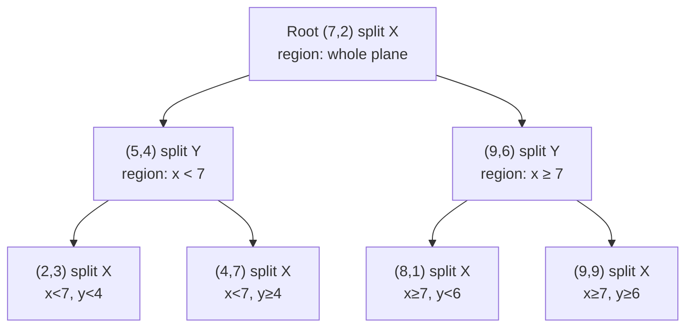
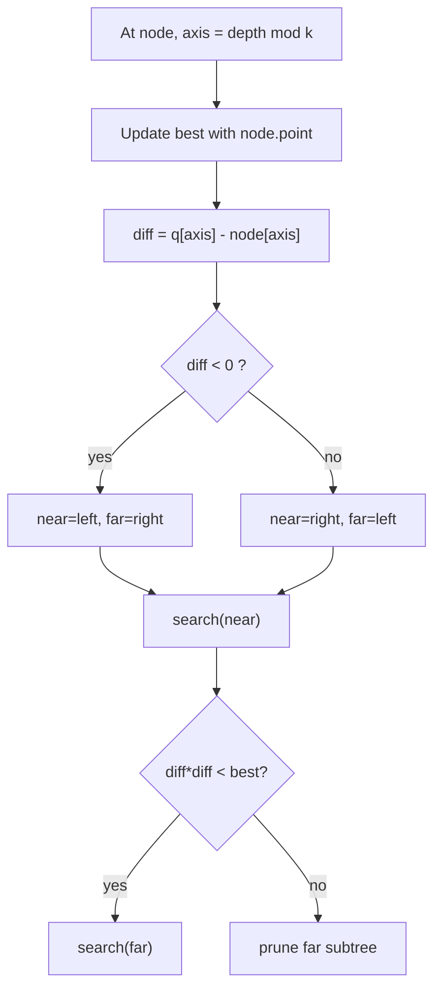

# k-d Tree — Junior Level

> **Read time: ~50 minutes** · **Audience:** Students who know binary search trees, recursion, and 2D coordinates, and now want a data structure that finds the nearest point to a query in a cloud of points faster than checking every point.

A **k-d tree** (short for *k-dimensional tree*) is a binary search tree for **points in space** — not single numbers, but points like `(3, 7)` in 2D or `(3, 7, 2)` in 3D. It answers questions that come up constantly in graphics, machine learning, games, and maps:

- *"Which stored point is closest to `(5, 4)`?"* — **nearest-neighbor search**.
- *"Which points fall inside the rectangle from `(2, 1)` to `(6, 8)`?"* — **range search**.
- *"Which points are within distance 3 of `(5, 4)`?"* — **radius search**.

The naive way to answer "what is the closest point?" is to compute the distance to **every** stored point and keep the smallest — that is O(n) per query. A k-d tree organizes the points so that the expected cost drops to roughly **O(log n)** in low dimensions, because most of the points can be skipped without ever looking at them. This document builds a 2D k-d tree from scratch, shows how the **alternating-axis split** works, and traces a nearest-neighbor search step by step.

---

## Table of Contents

1. [Introduction — Why Not Just Check Every Point?](#introduction)
2. [Prerequisites](#prerequisites)
3. [Glossary](#glossary)
4. [Core Concepts — Alternating Splits and Partitioning the Plane](#core-concepts)
5. [Big-O Summary](#big-o)
6. [Real-World Analogies](#analogies)
7. [Pros and Cons (vs Brute Force, vs Grid)](#pros-cons)
8. [Step-by-Step Walkthrough on Seven Points](#walkthrough)
9. [Code Examples — Go, Java, Python](#code-examples)
10. [Coding Patterns — Build, Search, Prune](#patterns)
11. [Error Handling](#errors)
12. [Performance Tips](#performance-tips)
13. [Best Practices](#best-practices)
14. [Edge Cases](#edge-cases)
15. [Common Mistakes](#common-mistakes)
16. [Cheat Sheet](#cheat-sheet)
17. [Visual Animation Reference](#animation)
18. [Summary](#summary)
19. [Further Reading](#further-reading)

---

<a name="introduction"></a>
## 1. Introduction — Why Not Just Check Every Point?

Imagine a map application storing one million café locations as `(latitude, longitude)` points. A user taps the screen and asks *"what is the nearest café?"* The obvious algorithm:

```text
best = none
for each café p:
    d = distance(query, p)
    if d < best_distance:
        best = p, best_distance = d
return best
```

This is **linear scan** — O(n) per query. For one million cafés that is one million distance computations *per tap*. If thousands of users tap per second, the server melts. We need a structure that lets us **skip** most of the points.

The key insight: if we have already found a café 200 meters away, and we are about to consider an entire region of the map whose **closest possible point** is 500 meters away, we can skip that whole region without examining a single café inside it. To make this work we need the points organized **spatially**, so that "regions" are a meaningful concept. That is exactly what a k-d tree gives us.

A k-d tree is a binary tree where:

- Each **node holds one point**.
- Each node also picks a **splitting axis** (x or y in 2D), and that axis **cycles** as you go down: the root splits on x, its children split on y, their children split on x again, and so on.
- The node's point splits space into two halves along its axis. Points with a smaller coordinate on that axis go into the **left subtree**; points with a larger coordinate go into the **right subtree**.

So a k-d tree is "just" a BST, except that the comparison key **rotates between dimensions** at each level. That single twist turns a 1D ordering structure into a 2D (or k-D) spatial index.

k-d trees were invented by **Jon Louis Bentley in 1975** ("Multidimensional binary search trees used for associative searching"). They remain the standard textbook structure for nearest-neighbor and range search in low dimensions, and they ship inside SciPy (`scipy.spatial.KDTree`), scikit-learn (`KDTree`, used by `KNeighborsClassifier`), PCL (Point Cloud Library), FLANN, and most game engines.

---

<a name="prerequisites"></a>
## 2. Prerequisites

To follow this document comfortably you should know:

1. **Binary search trees.** A node has a left and right child; smaller keys go left, larger go right. If `09-02-bst` is unfamiliar, read it first.
2. **Recursion.** Building and searching a k-d tree are both recursive, with the same `(low, high, depth)` shape as quicksort and tree traversal.
3. **2D coordinates and distance.** A point is `(x, y)`. The (squared) Euclidean distance between `(x1, y1)` and `(x2, y2)` is `(x1-x2)² + (y1-y2)²`. We use **squared** distance to avoid square roots when only comparing.
4. **Arrays and sorting.** Building a balanced k-d tree uses the **median** of a list along one coordinate.
5. **Big-O for trees.** Knowing why a balanced binary tree has height O(log n) is needed for the complexity claims.

If you can implement a BST insert and a recursive in-order traversal, you have everything you need.

---

<a name="glossary"></a>
## 3. Glossary

| Term | Definition |
|---|---|
| **Point** | A tuple of `k` numbers, e.g. `(3, 7)` in 2D. The thing we store and search. |
| **Dimension `k`** | How many coordinates each point has. 2 for a map, 3 for a 3D scene, 128 for an image embedding. |
| **Splitting axis** | The coordinate (x, y, z, ...) used to compare at a given node. |
| **Splitting/cutting plane** | The line (2D) or plane (3D) `axis = node.coord[axis]` that divides space at a node. |
| **Depth** | Distance from the root. `axis = depth mod k` chooses the splitting axis. |
| **Region / cell** | The axis-aligned rectangle (2D) of space that a subtree is responsible for. |
| **Median split** | Choosing the median point along the current axis as the node, so each subtree gets half the points. |
| **Nearest-neighbor (NN)** | The stored point closest to a query point. |
| **k-NN** | The `k` closest stored points (different `k` from the dimension `k` — context disambiguates). |
| **Range search** | All stored points inside an axis-aligned query box. |
| **Radius search** | All stored points within a given distance of a query point. |
| **Pruning** | Skipping a subtree because its region cannot possibly contain a closer point. |
| **Branch-and-bound** | The search strategy: explore the promising branch first, then check the other only if it might help. |
| **Squared distance** | `dx² + dy²` — used instead of true distance to avoid `sqrt` when only comparing. |

---

<a name="core-concepts"></a>
## 4. Core Concepts — Alternating Splits and Partitioning the Plane

### 4.1 A BST where the key rotates between axes

In a normal BST of numbers, every node compares on the one number it stores. In a k-d tree of 2D points, the root compares on **x**, its children compare on **y**, the grandchildren on **x** again, and so on. The rule is:

```text
axis = depth mod k          # k = number of dimensions
```

For 2D (`k = 2`): even depths split on x (axis 0), odd depths split on y (axis 1).

At a node `N` with point `(Nx, Ny)` splitting on axis `a`:

- A point `P` goes **left** if `P[a] < N[a]`.
- A point `P` goes **right** if `P[a] >= N[a]`.

That is the *entire* structural rule. Everything else — search, range queries, pruning — builds on it.

### 4.2 Each node owns a rectangle

Because splits alternate, every subtree is responsible for an **axis-aligned rectangular region** of the plane. The root owns the whole plane. Its x-split cuts the plane into a left half-plane and a right half-plane. Each child then makes a y-split inside its half, producing horizontal strips, and so on. The leaves own tiny rectangles each containing a few points.



This "tree of rectangles" view is the secret to fast search: a query lives inside one tiny rectangle, and faraway rectangles can be ignored.

### 4.3 Building by median split

To keep the tree **balanced** (height O(log n)) we choose, at each node, the **median** point along the current axis. The median splits the points into two equal halves, so the recursion depth is log₂ n.

```text
build(points, depth):
    if points is empty: return null
    axis = depth mod k
    sort points by coordinate[axis]          # or use quickselect for the median
    mid = len(points) / 2
    node = points[mid]                        # the median becomes this node
    node.left  = build(points[0 .. mid-1], depth + 1)
    node.right = build(points[mid+1 .. end], depth + 1)
    return node
```

If you sort at every level, building costs O(n log² n). If you use **median-of-medians / quickselect** (O(n) median finding), it drops to **O(n log n)**, which is the standard bound.

### 4.4 Nearest-neighbor search — descend, then prune

To find the nearest point to a query `q`:

1. **Descend** the tree as if inserting `q`, always going toward the side `q` belongs on. The leaf you reach is a good *first guess* — it is in the same small rectangle as `q`.
2. **Unwind** back up the recursion. At each node, update your "best so far" with the node's own point.
3. **Decide whether to check the other side.** The other subtree lives on the far side of this node's splitting line. The closest that subtree's region could possibly be to `q` is the perpendicular distance from `q` to the splitting line. If that distance is **already larger** than your current best, the whole subtree cannot help — **prune it**. Otherwise, recurse into it too.

```text
nearest(node, q, depth, best):
    if node is null: return best
    update best with distance(q, node.point)
    axis = depth mod k
    diff = q[axis] - node.point[axis]
    near = (diff < 0) ? node.left : node.right     # side q is on
    far  = (diff < 0) ? node.right : node.left
    best = nearest(near, q, depth + 1, best)       # explore the near side
    if diff * diff < best.distance:                # could the far side help?
        best = nearest(far, q, depth + 1, best)    # only then explore it
    return best
```

The line `if diff * diff < best.distance` is the **pruning test** — the single most important line in the whole structure. `diff` is how far `q` is from the splitting line along the split axis; `diff * diff` is the *minimum possible* squared distance from `q` to anything on the far side. If even that lower bound exceeds the best we already have, we skip an entire subtree.

### 4.5 Why pruning makes it fast (and when it does not)

In low dimensions, most branches get pruned, so a query touches only O(log n) nodes on average. But here is the catch you should remember from day one: **in high dimensions the pruning test almost always fails**, because in many dimensions almost every region is "close enough" to not be skippable. This is the **curse of dimensionality**, and it is why a k-d tree is great for 2D maps and 3D point clouds but useless for 128-dimensional image embeddings (where it degrades to O(n) — no better than brute force). The middle and senior documents go deep on this.

---

<a name="big-o"></a>
## 5. Big-O Summary

| Operation | Average (low dim) | Worst case | Space |
|---|---|---|---|
| **Build** (median split) | **O(n log n)** | O(n log n) | O(n) |
| **Insert** one point | O(log n) | O(n) (unbalanced) | O(1) |
| **Nearest-neighbor query** | **O(log n)** | O(n) (high dim / skewed) | O(log n) stack |
| **k-NN query** | O(k + log n) ≈ O(log n) | O(n) | O(k) heap |
| **Range search** (box) | O(√n + m) in 2D, m = hits | O(n) | O(log n) |
| **Radius search** | O(log n + m) | O(n) | O(log n) |
| **Total memory** | O(n) — one node per point | — | — |

The headline: build once in O(n log n), then each query is **expected O(log n)** in 2D/3D. The worst case is O(n) when the tree is unbalanced or the dimension is high.

---

<a name="analogies"></a>
## 6. Real-World Analogies

### 6.1 The "20 questions" map game
Finding the nearest café is like the game *20 Questions*, but spatial. "Is your café east or west of Main Street?" (x-split) → "North or south of 5th Avenue?" (y-split) → "East or west of Oak?" (x-split again). Each question halves the search area. A k-d tree is exactly this sequence of alternating east/west, north/south questions baked into a tree.

### 6.2 Folding a paper map along alternating creases
Take a paper map. Fold it left-right (an x-cut). Then fold each half top-bottom (a y-cut). Then each quarter left-right again. After log₂ n folds you have isolated the tiny patch containing your destination. The k-d tree records those folds.

### 6.3 A filing cabinet sorted by alternating attributes
A cabinet where the top drawer is split by **last-name initial**, each folder inside is split by **first-name initial**, each sub-folder by last-name again. To find a person you alternate between the two attributes. k-d trees alternate between coordinates the same way.

> **Where the analogies break:** real maps are continuous; a k-d tree only "knows" the points you inserted. And the *pruning* step — checking the other side of a fold when your target is near the crease — has no clean everyday equivalent. That step is what makes correctness subtle.

---

<a name="pros-cons"></a>
## 7. Pros and Cons (vs Brute Force, vs Grid)

### Pros
- **Fast nearest-neighbor in low dimensions** — expected O(log n) instead of O(n).
- **Handles many query types** with one structure: NN, k-NN, range (box), radius.
- **Compact** — exactly one node per point, O(n) memory, no empty cells.
- **Adapts to point density** — dense areas get deeper subtrees; the structure follows the data, unlike a fixed grid.
- **Simple to implement** — it is a BST with a rotating comparison key.

### Cons
- **Degrades in high dimensions** (the curse of dimensionality). Past ~10–20 dimensions a k-d tree is no faster than brute force.
- **Static-friendly, dynamic-hostile** — inserts and deletes unbalance it; rebuilding restores balance but costs O(n log n).
- **Build cost** — O(n log n) up front; not worth it if you query only once (just brute-force then).
- **No good for "give me all points sorted by distance"** beyond small k without extra work.

### Decision matrix
| Need | Use |
|---|---|
| One-off nearest query, small n | **Brute force** (no build cost) |
| Many NN queries, 2D/3D, mostly static | **k-d tree** |
| Uniformly dense points, fixed cell size | **Uniform grid** (O(1) bucket lookup) |
| High-dimensional approximate NN | **LSH / HNSW** (see senior.md) |
| Range counting only, static | **Range tree** (see middle.md) |
| Disk-resident spatial data | **R-tree** (cross-link `09-trees`) |

---

<a name="walkthrough"></a>
## 8. Step-by-Step Walkthrough on Seven Points

Let `k = 2` and our points be:

```text
(7,2)  (5,4)  (9,6)  (2,3)  (4,7)  (8,1)  (9,9)
```

### 8.1 Build (median split)

**Depth 0, split on x (axis 0).** Sort by x: `(2,3) (4,7) (5,4) (7,2) (8,1) (9,6) (9,9)`. Median is the 4th element `(7,2)` → **root**.
- Left points (x < 7): `(2,3) (4,7) (5,4)`
- Right points (x >= 7): `(8,1) (9,6) (9,9)`

**Depth 1, split on y (axis 1).**
- Left group sorted by y: `(2,3) (5,4) (4,7)`. Median `(5,4)` → left child of root.
  - Left of that (y < 4): `(2,3)`. Right (y >= 4): `(4,7)`.
- Right group sorted by y: `(8,1) (9,6) (9,9)`. Median `(9,6)` → right child of root.
  - Left (y < 6): `(8,1)`. Right (y >= 6): `(9,9)`.

The finished tree:

```text
                  (7,2) [x]
                 /         \
           (5,4) [y]      (9,6) [y]
           /     \         /     \
       (2,3)   (4,7)    (8,1)   (9,9)
```

The `[x]` / `[y]` tags show the split axis at each level.

### 8.2 The plane partition

The same tree, viewed as rectangles:

```text
 y
 9 |        (4,7)·         |  ·(9,9)
   |                       |
 6 |--------- (5,4)·-------+(9,6)·----   ← root x-line at x=7 (vertical)
   |  (2,3)·               |
 1 |                       |  ·(8,1)
   +-----------------------+-----------  x
        x<7   :   x>=7
```

The vertical line `x = 7` (the root) splits left/right. Inside the left half, the horizontal line `y = 4` (node `(5,4)`) splits top/bottom. Inside the right half, `y = 6` (node `(9,6)`) splits top/bottom.

### 8.3 Nearest-neighbor query for `q = (6, 5)`

Expected answer: the closest stored point. By eye, `(5,4)` is at squared distance `(6-5)² + (5-4)² = 1 + 1 = 2`. Let us see the algorithm find it.

```text
nearest((7,2), depth 0, axis x):
    best = (7,2), dist² = (6-7)²+(5-2)² = 1+9 = 10
    diff = q.x - 7 = 6-7 = -1  → near = left, far = right
    └─ nearest((5,4), depth 1, axis y):
           dist² to (5,4) = (6-5)²+(5-4)² = 1+1 = 2  → best = (5,4), 2
           diff = q.y - 4 = 5-4 = +1  → near = right, far = left
           └─ nearest((4,7), depth 2, axis x):
                  dist² = (6-4)²+(5-7)² = 4+4 = 8  → not better (8 > 2)
                  leaf → return best
           prune check far (left, (2,3)): diff²=1 < 2 → must explore
           └─ nearest((2,3), depth 2, axis x):
                  dist² = (6-2)²+(5-3)² = 16+4 = 20 → not better
                  leaf → return best
       return best = (5,4), 2
    back at root: prune check far (right subtree (9,6)…):
       diff² = (6-7)² = 1 < 2 → must explore right side too
    └─ nearest((9,6), depth 1, axis y):
           dist² = (6-9)²+(5-6)² = 9+1 = 10 → not better
           diff = 5-6 = -1 → near=left (8,1), far=right (9,9)
           └─ nearest((8,1)…): dist² = (6-8)²+(5-1)² = 4+16=20 → no
           prune far (9,9): diff²=1 < 2 → explore
           └─ nearest((9,9)…): dist² = 9+16=25 → no
       return best = (5,4), 2
result: (5,4) at squared distance 2 ✓
```

Notice the pruning decisions. At the root, `diff² = 1 < best 2`, so we *could not* prune the right side — `q.x = 6` is close to the line `x = 7`, so a closer point might hide on the right. If `q` had been `(3, 5)` instead, `diff² = (3-7)² = 16 > 2`, and we would have **skipped the entire right subtree** — three points never examined.

### 8.4 What pruning saved

With seven points and a query near the dividing line, pruning saved little. But for one million points, a query that prunes at the top three levels skips ~7/8 of the tree instantly. That is the difference between 20 node visits and one million.

---

<a name="code-examples"></a>
## 9. Code Examples — Go, Java, Python

### 9.1 Build + nearest neighbor (2D, generalizes to k-D)

#### Go
```go
package kdtree

import "sort"

type Point []float64 // length k

type Node struct {
    Point       Point
    Left, Right *Node
    Axis        int
}

// Build constructs a balanced k-d tree from pts. O(n log^2 n) with sort.
func Build(pts []Point, depth int) *Node {
    if len(pts) == 0 {
        return nil
    }
    k := len(pts[0])
    axis := depth % k
    sort.Slice(pts, func(i, j int) bool { return pts[i][axis] < pts[j][axis] })
    mid := len(pts) / 2
    return &Node{
        Point: pts[mid],
        Axis:  axis,
        Left:  Build(pts[:mid], depth+1),
        Right: Build(pts[mid+1:], depth+1),
    }
}

func sqDist(a, b Point) float64 {
    s := 0.0
    for i := range a {
        d := a[i] - b[i]
        s += d * d
    }
    return s
}

// Nearest returns the closest stored point to q and its squared distance.
func (n *Node) Nearest(q Point) (Point, float64) {
    var best Point
    bestD := -1.0
    var search func(node *Node)
    search = func(node *Node) {
        if node == nil {
            return
        }
        d := sqDist(q, node.Point)
        if bestD < 0 || d < bestD {
            bestD, best = d, node.Point
        }
        diff := q[node.Axis] - node.Point[node.Axis]
        near, far := node.Right, node.Left
        if diff < 0 {
            near, far = node.Left, node.Right
        }
        search(near)
        if diff*diff < bestD { // pruning test
            search(far)
        }
    }
    search(n)
    return best, bestD
}
```

#### Java
```java
import java.util.Arrays;
import java.util.Comparator;

public final class KDTree {
    static final class Node {
        double[] point;
        Node left, right;
        int axis;
        Node(double[] p, int axis) { this.point = p; this.axis = axis; }
    }

    private final Node root;
    private final int k;

    public KDTree(double[][] pts) {
        this.k = pts.length > 0 ? pts[0].length : 0;
        this.root = build(pts, 0, pts.length, 0);
    }

    private Node build(double[][] pts, int lo, int hi, int depth) {
        if (lo >= hi) return null;
        int axis = depth % k;
        Arrays.sort(pts, lo, hi, Comparator.comparingDouble(p -> p[axis]));
        int mid = (lo + hi) / 2;
        Node n = new Node(pts[mid], axis);
        n.left  = build(pts, lo, mid, depth + 1);
        n.right = build(pts, mid + 1, hi, depth + 1);
        return n;
    }

    private static double sqDist(double[] a, double[] b) {
        double s = 0;
        for (int i = 0; i < a.length; i++) { double d = a[i] - b[i]; s += d * d; }
        return s;
    }

    private double[] best;
    private double bestD;

    public double[] nearest(double[] q) {
        best = null; bestD = Double.POSITIVE_INFINITY;
        search(root, q);
        return best;
    }

    private void search(Node node, double[] q) {
        if (node == null) return;
        double d = sqDist(q, node.point);
        if (d < bestD) { bestD = d; best = node.point; }
        double diff = q[node.axis] - node.point[node.axis];
        Node near = diff < 0 ? node.left : node.right;
        Node far  = diff < 0 ? node.right : node.left;
        search(near, q);
        if (diff * diff < bestD) search(far, q); // pruning test
    }
}
```

#### Python
```python
import math


class Node:
    __slots__ = ("point", "left", "right", "axis")

    def __init__(self, point, axis):
        self.point = point
        self.left = None
        self.right = None
        self.axis = axis


def build(points, depth=0):
    """Build a balanced k-d tree. points: list of equal-length tuples."""
    if not points:
        return None
    k = len(points[0])
    axis = depth % k
    points.sort(key=lambda p: p[axis])
    mid = len(points) // 2
    node = Node(points[mid], axis)
    node.left = build(points[:mid], depth + 1)
    node.right = build(points[mid + 1:], depth + 1)
    return node


def sq_dist(a, b):
    return sum((ai - bi) ** 2 for ai, bi in zip(a, b))


def nearest(root, q):
    """Return (best_point, best_squared_distance)."""
    best = [None, math.inf]

    def search(node):
        if node is None:
            return
        d = sq_dist(q, node.point)
        if d < best[1]:
            best[0], best[1] = node.point, d
        diff = q[node.axis] - node.point[node.axis]
        near, far = (node.left, node.right) if diff < 0 else (node.right, node.left)
        search(near)
        if diff * diff < best[1]:   # pruning test
            search(far)

    search(root)
    return best[0], best[1]


if __name__ == "__main__":
    pts = [(7, 2), (5, 4), (9, 6), (2, 3), (4, 7), (8, 1), (9, 9)]
    tree = build(list(pts))
    print(nearest(tree, (6, 5)))  # ((5, 4), 2)
```

**What it does:** builds a balanced 2D tree from seven points and finds the nearest stored point to `(6, 5)`, returning `(5, 4)` with squared distance `2`.
**Run:** `python kdtree.py`

### 9.2 Range search (axis-aligned box)

```python
def range_search(node, lo, hi):
    """All points inside the inclusive box [lo, hi] (per coordinate)."""
    result = []

    def visit(node):
        if node is None:
            return
        p = node.point
        if all(lo[i] <= p[i] <= hi[i] for i in range(len(p))):
            result.append(p)
        a = node.axis
        # Only descend left if the box can reach left of the split line.
        if lo[a] <= p[a]:
            visit(node.left)
        # Only descend right if the box can reach right of the split line.
        if hi[a] >= p[a]:
            visit(node.right)

    visit(node)
    return result
```

The same pruning idea applies: we only recurse into a side if the query box overlaps that side of the splitting line.

---

<a name="patterns"></a>
## 10. Coding Patterns — Build, Search, Prune

Three patterns recur in every k-d tree operation.

### Pattern 1: Alternating-axis recursion
```text
axis = depth mod k
... compare on coordinate[axis] ...
recurse with depth + 1
```
Every build, insert, search, and range query rotates the axis this way.

### Pattern 2: Near-first, far-maybe (branch-and-bound)
```text
near = side that q belongs to
far  = the other side
explore near        # likely contains the answer
if far could still help:   # the pruning test
    explore far
```
Exploring the near side first tightens `best` quickly, which makes the far-side pruning test more likely to succeed.

### Pattern 3: The pruning predicate
```text
diff   = q[axis] - node.point[axis]    # signed distance to split line
bound  = diff * diff                   # min possible squared dist to far side
if bound < bestSoFar: explore far
```



---

<a name="errors"></a>
## 11. Error Handling

| Error | Cause | Fix |
|---|---|---|
| Wrong nearest point returned | Forgot the far-side pruning recursion entirely | Always check `diff*diff < best` and recurse far when it holds. |
| `sqrt` slowness | Comparing true distances | Compare **squared** distances; only `sqrt` the final answer if needed. |
| Stack overflow on huge n | Deep unbalanced tree from sorted inserts | Build with median split, not sequential insert. |
| Mixed-dimension points | Some points length 2, some length 3 | Validate all points share dimension `k` before building. |
| Comparing `< best` with uninitialized best | `best` not set | Initialize `best` to `+∞` (or first point). |
| Off-by-one in median index | `mid = len/2` excludes/includes wrong half | Node = `pts[mid]`; left = `pts[:mid]`; right = `pts[mid+1:]`. |

---

<a name="performance-tips"></a>
## 12. Performance Tips

1. **Always compare squared distances.** Square roots are expensive and unnecessary for ordering.
2. **Build balanced via median split**, never by inserting points one at a time in input order.
3. **Use quickselect (O(n)) for the median** instead of full sort (O(n log n) per level) to reach the O(n log n) total build bound.
4. **Explore the near side first** so `best` shrinks early and more far branches get pruned.
5. **For repeated bulk queries, rebuild rather than incrementally insert** — a balanced static tree beats a degraded dynamic one.
6. **Stop using a k-d tree past ~20 dimensions** — it stops pruning. Switch to approximate methods (senior.md).
7. **Store points in a flat array and reference by index** in cache-sensitive code, instead of pointer-chasing nodes.

---

<a name="best-practices"></a>
## 13. Best Practices

- **Use squared Euclidean distance internally**; convert to real distance only at the boundary.
- **Build once, query many.** k-d trees pay off only when you amortize the build over many queries.
- **Keep `k` small.** k-d trees are for 2D/3D geometry, not 100D embeddings.
- **Test against a brute-force O(n) reference** on random points — the nearest result must always match.
- **Pick a tie-break rule** when two points are equidistant (e.g., lowest index) so results are deterministic.
- **Rebuild periodically** if you must support inserts, once a load factor of stale/unbalanced nodes is crossed.
- **Document the split convention** (`< goes left`, `>= goes right`) so future readers handle duplicates consistently.

---

<a name="edge-cases"></a>
## 14. Edge Cases

| Case | Input | Expected behavior |
|---|---|---|
| Empty tree | no points | NN returns "none" |
| Single point | one point | NN returns that point |
| Duplicate points | several identical | All kept; NN distance 0 if query equals one |
| Query equals a stored point | `q` on a node | Returns that point, distance 0 |
| All points collinear | all share one coordinate | Still correct; tree may be deep on the varying axis |
| Query far outside cloud | `q = (10^9, 10^9)` | Returns the genuinely closest stored point |
| Ties in median | repeated split-axis value | Pick any consistent tie-break; correctness preserved |
| High dimension | k = 128 | Correct but slow — pruning fails, O(n) |

---

<a name="common-mistakes"></a>
## 15. Common Mistakes

1. **Skipping the far-side recursion.** The single most common bug — you descend to a leaf and return it, never checking the other side. Correct only when the query happens to be deep inside a cell.
2. **Pruning with the full distance instead of the axis distance.** The bound is the *perpendicular* distance to the split line (`diff`), not the distance to the node's point.
3. **Comparing true distances** and calling `sqrt` millions of times. Use squared distances.
4. **Building by sequential insert.** Inserting sorted points yields a linked-list-shaped tree of height n.
5. **Forgetting to rotate the axis.** Splitting on x at every level makes a 1D tree that ignores y entirely.
6. **Using `<=` on both sides** so duplicates go nowhere or everywhere. Pick `< left`, `>= right`.
7. **Initializing best distance to 0** instead of `+∞` — every real point then looks "worse" and nothing updates.
8. **Treating k-d trees as good for high-D ML.** They are not; this is the curse of dimensionality.

---

<a name="cheat-sheet"></a>
## 16. Cheat Sheet

```text
NODE
    point[k], left, right, axis (= depth mod k)

BUILD(points, depth)
    if empty: return null
    axis = depth mod k
    median = point with median coordinate[axis]   # quickselect for O(n)
    node = median
    node.left  = BUILD(points left of median,  depth+1)
    node.right = BUILD(points right of median, depth+1)

NEAREST(node, q, best)
    if null: return
    update best with sqDist(q, node.point)
    diff = q[axis] - node.point[axis]
    near = (diff<0) ? left : right ; far = the other
    NEAREST(near, q, best)
    if diff*diff < best.dist:        # PRUNE TEST
        NEAREST(far, q, best)

RANGE(node, lo, hi)
    if node.point in box: emit it
    if lo[axis] <= node[axis]: RANGE(left)
    if hi[axis] >= node[axis]: RANGE(right)

COMPLEXITY (low dim)
    build O(n log n) | NN expected O(log n) | space O(n)
    HIGH DIM: NN degrades to O(n)  ← curse of dimensionality
```

---

<a name="animation"></a>
## 17. Visual Animation Reference

See `animation.html` in this folder. It plots 2D points on a dark canvas and **builds** the k-d tree, drawing each split as a vertical (x) or horizontal (y) line that carves the plane into nested rectangles, while the tree grows alongside. Then it runs a **nearest-neighbor query**: a query dot descends the tree, the current "best" circle shrinks as closer points are found, and **pruned subtrees gray out** so you can literally see branches being skipped. A control panel lets you add custom points, set the query, step through, and adjust speed; an info panel and Big-O table track visited nodes, pruned nodes, and the current best distance. Step through one NN query and the pruning logic becomes permanent.

---

<a name="summary"></a>
## 18. Summary

- A **k-d tree** is a binary search tree for k-dimensional points where the **comparison axis rotates** with depth (`axis = depth mod k`).
- Each node owns an **axis-aligned rectangular region**; the tree recursively partitions space.
- **Build** with median split in **O(n log n)**, giving a balanced tree of height O(log n).
- **Nearest-neighbor search** descends to the query's leaf, then unwinds, **pruning** any subtree whose region is farther than the best found so far (`diff*diff < best`).
- In **2D/3D** queries are **expected O(log n)**; in **high dimensions** pruning fails and it degrades to O(n) — the curse of dimensionality.
- The same structure answers **k-NN, range (box), and radius** queries with the same descend-and-prune skeleton.

Master the alternating-axis split and the pruning test, and you have the foundation for every spatial index built on space partitioning.

---

<a name="further-reading"></a>
## 19. Further Reading

- **Bentley, J.L.**, *Multidimensional Binary Search Trees Used for Associative Searching*, CACM 1975 — the original k-d tree paper.
- **Friedman, Bentley, Finkel**, *An Algorithm for Finding Best Matches in Logarithmic Expected Time*, ACM TOMS 1977 — the nearest-neighbor analysis.
- **de Berg, Cheong, van Kreveld, Overmars**, *Computational Geometry: Algorithms and Applications*, 3rd ed., Chapter 5 — k-d trees and range trees.
- **SciPy** docs — `scipy.spatial.KDTree` and `cKDTree`.
- **scikit-learn** docs — `sklearn.neighbors.KDTree` and `KNeighborsClassifier`.
- Continue with `middle.md` for k-NN, range/radius search, balancing, bulk-loading, and the comparison to grids and quadtrees.

Next step: [middle.md](./middle.md)
