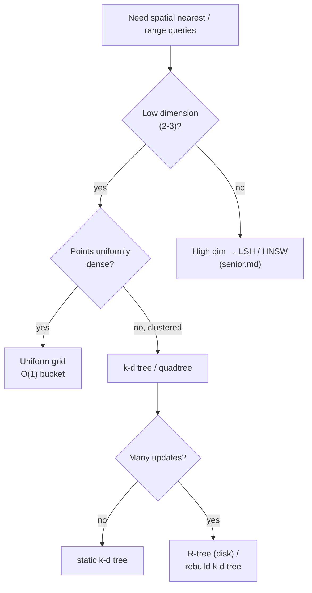

# k-d Tree — Middle Level

> **Audience:** Engineers who can already build a k-d tree and run a basic nearest-neighbor search, and now want to understand *why* pruning works, how to do **k-NN, range, and radius** queries correctly, how to keep the tree **balanced** (bulk-loading, rebalancing), and **when** to choose a k-d tree over a grid, quadtree, or range tree. Prerequisites: `junior.md`.

The junior document showed *what* a k-d tree is and *how* the alternating-axis split and single-nearest pruning work. This document is about **why** those choices are correct and **when** you should reach for a k-d tree instead of a competitor. We derive the pruning invariant, implement k-nearest-neighbors with a bounded max-heap, implement orthogonal range search and radius search with rectangle pruning, cover median bulk-loading and rebalancing strategies, and compare k-d trees head-to-head against uniform grids, quadtrees, and range trees.

---

## Table of Contents

1. [Introduction — From One Neighbor to Many Queries](#introduction)
2. [The Pruning Invariant — Why Branch-and-Bound Is Correct](#invariant)
3. [k-Nearest-Neighbors with a Bounded Heap](#knn)
4. [Orthogonal Range Search (Axis-Aligned Box)](#range)
5. [Radius Search](#radius)
6. [Building Well — Median Selection, Splitting Rules, Bulk-Loading](#building)
7. [Balancing and Dynamic Updates](#balancing)
8. [Comparison with Alternatives — Grid, Quadtree, Range Tree, R-tree](#comparison)
9. [Code Examples — Go, Java, Python](#code-examples)
10. [Error Handling](#errors)
11. [Performance Analysis](#performance)
12. [Best Practices](#best-practices)
13. [Visual Animation Reference](#animation)
14. [Summary](#summary)

---

<a name="introduction"></a>
## 1. Introduction — From One Neighbor to Many Queries

A k-d tree earns its keep when you have a **fixed (or slowly changing) set of points** and need to answer **many spatial queries** against it. The four queries that matter in practice:

| Query | Question | Returns |
|---|---|---|
| **NN** | "Closest stored point to `q`?" | one point |
| **k-NN** | "The `k` closest points to `q`?" | k points |
| **Range** | "All points inside box `[lo, hi]`?" | a set |
| **Radius** | "All points within distance `r` of `q`?" | a set |

All four share the same engine: a recursive descent with **branch-and-bound pruning**. The only thing that changes is the *bound* used to decide whether to skip a subtree:

- **NN / k-NN** prune when the split line is farther than the current k-th best distance.
- **Range** prune when the query box does not cross the split line.
- **Radius** prune when the split line is farther than `r`.

Understanding this shared skeleton — and proving the pruning is *safe* (never skips a valid answer) — is the heart of the middle level.

---

<a name="invariant"></a>
## 2. The Pruning Invariant — Why Branch-and-Bound Is Correct

### 2.1 The geometric lower bound

When we stand at a node splitting on axis `a` at value `s = node.point[a]`, the **far** subtree contains only points with `p[a]` on the opposite side of `s` from the query `q`. The closest any such point can be to `q` is bounded below by the **perpendicular distance from `q` to the splitting hyperplane** `{x : x[a] = s}`:

```text
distToPlane = |q[a] - s|
anyFarPoint p satisfies: dist(q, p) >= |q[a] - s|
```

This is because moving from `q` to any far point must cross the plane `x[a] = s`, and the shortest crossing is straight along axis `a`. Therefore:

> **Pruning lemma.** If `|q[a] - s| >= bestDist` (equivalently `(q[a]-s)² >= bestDist²`), then **no** point in the far subtree can be closer than the current best, so the far subtree may be skipped without missing the true nearest neighbor.

### 2.2 The invariant maintained by the search

```text
Invariant I (k-NN with target count K):
  After visiting any subtree, `heap` holds the K closest points seen so far
  among all points in that subtree AND all points visited before it.
```

- **Base case.** At a `null` node the heap is unchanged — trivially correct.
- **Inductive step.** At a node we (1) consider the node's own point, possibly inserting it into the bounded heap; (2) recurse into the **near** child, which by induction makes the heap hold the K best among everything seen so far plus the near subtree; (3) test the far child against the bound `|q[a]-s|`. By the pruning lemma, if the bound is not beaten, the far subtree contains nothing that could enter the heap, so skipping it preserves `I`. Otherwise we recurse and `I` is preserved by induction.
- **Termination.** Each recursion strictly decreases the number of unvisited nodes; the tree is finite. At the root's return, `I` says the heap holds the K globally-closest points. **QED.**

The correctness does **not** depend on the tree being balanced — pruning is always *safe*. Balance only affects *speed* (how many nodes survive pruning).

### 2.3 Why the near side first

We always recurse into the **near** child before the far child. This is not required for correctness, but it is essential for *performance*: the near subtree usually contains the true neighbor, so visiting it first **tightens `bestDist` early**, which makes the subsequent far-side pruning test far more likely to succeed. Recursing far-first would explore both sides in most cases — destroying the speedup.

---

<a name="knn"></a>
## 3. k-Nearest-Neighbors with a Bounded Heap

For k-NN we keep a **max-heap of size K** ordered by distance, so the heap's top is the *worst* of our current K best. The bound for pruning becomes the distance to that worst element (once the heap is full).

```text
knn(node, q, K, heap):
    if node is null: return
    d = sqDist(q, node.point)
    if heap.size < K:
        heap.push(d, node.point)
    elif d < heap.top.d:
        heap.popMax(); heap.push(d, node.point)

    diff = q[axis] - node.point[axis]
    near, far = sides by sign of diff
    knn(near, q, K, heap)

    # bound = worst distance in heap (or +inf if not yet full)
    bound = (heap.size < K) ? +inf : heap.top.d
    if diff*diff < bound:
        knn(far, q, K, heap)
```

Two subtleties:

1. **The bound is `+∞` until the heap fills.** Before we have K candidates, *every* subtree might contribute, so we cannot prune.
2. **The heap is ordered by the maximum distance.** We compare the candidate against the *current K-th nearest* — the element we would evict.

Complexity: expected **O(K + log n)** in low dimensions. Each push/pop is O(log K), and the number of nodes visited is O(log n + K) on average.

---

<a name="range"></a>
## 4. Orthogonal Range Search (Axis-Aligned Box)

Range search reports every stored point inside a query box `[lo, hi]` (a closed axis-aligned rectangle in 2D, box in 3D). The pruning rule is *combinatorial* rather than distance-based: we descend into a child only if the query box overlaps that child's side of the splitting line.

```text
rangeSearch(node, lo, hi, out):
    if node is null: return
    p = node.point
    if p inside [lo, hi]:  out.add(p)
    a = node.axis
    if lo[a] <= p[a]:  rangeSearch(node.left,  lo, hi, out)   # box reaches left
    if hi[a] >= p[a]:  rangeSearch(node.right, lo, hi, out)   # box reaches right
```

If the box lies entirely left of the split line (`hi[a] < p[a]`), the right child is skipped entirely, and vice versa. When the box straddles the line, both children are visited.

A sharper implementation carries each node's **bounding region** and recognizes three cases per child, like a segment tree:

- **Region fully inside the box** → report the whole subtree without further tests (an O(subtree size) emit).
- **Region disjoint from the box** → prune.
- **Region partially overlaps** → recurse.

**Complexity.** For a balanced 2D k-d tree, orthogonal range *reporting* is **O(√n + m)** where `m` is the number of reported points; range *counting* (storing subtree sizes) is **O(√n)**. The `√n` term is the classic k-d tree range bound (de Berg et al., Ch. 5) — worse than a range tree's `O(log n + m)` but with far less memory.

---

<a name="radius"></a>
## 5. Radius Search

Radius search reports all points within distance `r` of `q`. It is NN search with a *fixed* bound `r` instead of a shrinking best:

```text
radiusSearch(node, q, r2, out):     # r2 = r*r (squared)
    if node is null: return
    if sqDist(q, node.point) <= r2:  out.add(node.point)
    diff = q[axis] - node.point[axis]
    near, far = sides by sign of diff
    radiusSearch(near, q, r2, out)
    if diff*diff <= r2:              # far side can reach within r
        radiusSearch(far, q, r2, out)
```

The bound never shrinks (it is the fixed `r`), so radius search visits more nodes than NN when `r` is large. For a small `r` it is very fast; for `r` covering the whole cloud it degenerates to a full traversal. Radius search underlies **DBSCAN clustering**, **collision broad-phase**, and **"points of interest within 500 m"** map queries.

---

<a name="building"></a>
## 6. Building Well — Median Selection, Splitting Rules, Bulk-Loading

### 6.1 Why median, not midpoint

Two common split rules:

| Rule | Split value | Balance | Cell shape |
|---|---|---|---|
| **Median split** | median *point* on axis | perfectly balanced (depth log n) | cells hold equal counts |
| **Midpoint split** | geometric midpoint of cell | may be unbalanced | cells are squarer |

Median split guarantees height O(log n) regardless of point distribution — the standard choice for nearest-neighbor work. Midpoint split (used in some "sliding-midpoint" variants, e.g. SciPy's `cKDTree`) keeps cells closer to square, which can prune better for *clustered* data even at the cost of perfect balance.

### 6.2 Bulk-loading in O(n log n)

Sorting at every level costs O(n log² n). To hit O(n log n), use **quickselect (nth_element)** to find the median in expected O(n) per node:

```text
buildFast(points, lo, hi, depth):
    if lo >= hi: return null
    axis = depth mod k
    mid = (lo + hi) / 2
    nth_element(points[lo..hi], mid, key = coord[axis])   # O(hi-lo) expected
    node = points[mid]
    node.left  = buildFast(points, lo,   mid, depth+1)
    node.right = buildFast(points, mid+1, hi, depth+1)
    return node
```

The recurrence `T(n) = 2T(n/2) + O(n)` solves to **O(n log n)** by the Master Theorem (case 2). C++'s `std::nth_element`, Go's manual quickselect, and NumPy's `np.partition` all provide the linear median step.

### 6.3 Choosing the split axis: cycling vs widest-spread

- **Cyclic** (`axis = depth mod k`) — simple, standard, dimension-agnostic.
- **Widest-spread** — at each node, split on the axis with the largest *range* (or variance) among the points in that subtree. This adapts to anisotropic data (points spread far in x but tight in y) and prunes better. scikit-learn's `KDTree` uses a spread-based rule.

---

<a name="balancing"></a>
## 7. Balancing and Dynamic Updates

k-d trees are **not** self-balancing like AVL or red-black trees. A naive insert (descend, attach as a leaf) preserves correctness but can unbalance the tree, degrading queries toward O(n). Strategies:

### 7.1 Static + periodic rebuild
The dominant production pattern: build once, query many, and **rebuild from scratch** when the data changes enough. Rebuild is O(n log n) — cheap relative to thousands of queries.

### 7.2 Insert with attach (accepting drift)
```text
insert(node, p, depth):
    if node null: return new Node(p, depth mod k)
    a = depth mod k
    if p[a] < node.point[a]: node.left  = insert(node.left,  p, depth+1)
    else:                    node.right = insert(node.right, p, depth+1)
    return node
```
Fine for a few inserts between rebuilds; tracks how skewed the tree has become.

### 7.3 Deletion is awkward
Unlike a BST, you cannot simply splice a k-d node — its successor on the splitting axis must be found in a *subtree*, requiring a recursive "find-min on axis" helper. Most systems **mark deleted** (tombstone) and rebuild later instead of true deletion.

### 7.4 Scapegoat / logarithmic rebuilding
For amortized-balanced dynamic k-d trees, the **scapegoat** technique rebuilds the smallest unbalanced subtree on insert, giving **amortized O(log² n)** updates while keeping query height O(log n). The **logarithmic method** (Bentley–Saxe) maintains O(log n) static k-d trees of sizes that are powers of two, merging on insert — O(log² n) amortized insert, O(log² n) query.

| Strategy | Insert | Query | Used when |
|---|---|---|---|
| Static + rebuild | O(n log n) batch | O(log n) | mostly static data |
| Attach (drift) | O(log n)→O(n) | degrades | few updates between rebuilds |
| Scapegoat | O(log² n) amortized | O(log n) | steady insert stream |
| Bentley–Saxe | O(log² n) amortized | O(log² n) | insert-heavy, no delete |

---

<a name="comparison"></a>
## 8. Comparison with Alternatives — Grid, Quadtree, Range Tree, R-tree



| Structure | Build | NN query | Range query | Memory | Best for |
|---|---|---|---|---|---|
| **Brute force** | O(1) | O(n) | O(n) | O(n) | tiny n, one-off |
| **Uniform grid** | O(n) | O(1)* | O(1+m)* | O(cells+n) | uniform density, fixed radius |
| **Quadtree (2D)** | O(n log n) | O(log n)* | O(log n + m) | O(n) | clustered 2D, simple recursion |
| **k-d tree** | O(n log n) | O(log n) avg | O(√n + m) | O(n) | low-dim NN, compact |
| **Range tree** | O(n log n) | n/a (range only) | O(log² n + m) | O(n log n) | fast orthogonal range, static |
| **R-tree** | O(n log n) | O(log n)* | O(log n + m) | O(n) | disk-resident, rectangles, dynamic |
| **Ball tree** | O(n log n) | O(log n) | radius | O(n) | medium-dim, non-axis metrics |

\* expected, distribution-dependent.

**Choose a k-d tree when:** dimension is low (2–10), the point set is mostly static, you need nearest-neighbor or k-NN (not just range), and memory matters (one node per point).

**Choose a uniform grid when:** points are roughly uniformly dense and queries use a fixed radius — bucketing gives O(1) lookups with trivial code. A grid wastes memory on empty cells when data is clustered, which is exactly where k-d trees shine.

**Choose a quadtree when:** you want recursive 2D subdivision tied to *space* (each node = a square quadrant) rather than to *points*. Quadtrees split a region into four equal quadrants regardless of point positions; k-d trees split on a chosen point. Quadtrees are simpler for image/region work and for problems where the *space* matters more than the data; k-d trees are more memory-efficient because they never create empty cells.

**Choose a range tree when:** you only need orthogonal range queries (no NN) and want the better O(log² n + m) bound, accepting O(n log n) memory.

**Choose an R-tree when:** data lives on disk, items are rectangles (not points), and you need dynamic insert/delete — the standard in spatial databases (PostGIS, Oracle Spatial). See the trees chapter cross-link.

---

<a name="code-examples"></a>
## 9. Code Examples — Go, Java, Python

### 9.1 k-NN with a bounded max-heap

#### Go
```go
package kdtree

import "container/heap"

// maxHeap of (negated? no) — we keep largest distance on top.
type cand struct {
    dist float64
    pt   Point
}
type maxHeap []cand

func (h maxHeap) Len() int            { return len(h) }
func (h maxHeap) Less(i, j int) bool  { return h[i].dist > h[j].dist } // max on top
func (h maxHeap) Swap(i, j int)       { h[i], h[j] = h[j], h[i] }
func (h *maxHeap) Push(x interface{}) { *h = append(*h, x.(cand)) }
func (h *maxHeap) Pop() interface{} {
    old := *h
    n := len(old)
    item := old[n-1]
    *h = old[:n-1]
    return item
}

// KNN returns up to k nearest points to q.
func (root *Node) KNN(q Point, k int) []Point {
    h := &maxHeap{}
    var search func(node *Node)
    search = func(node *Node) {
        if node == nil {
            return
        }
        d := sqDist(q, node.Point)
        if h.Len() < k {
            heap.Push(h, cand{d, node.Point})
        } else if d < (*h)[0].dist {
            heap.Pop(h)
            heap.Push(h, cand{d, node.Point})
        }
        diff := q[node.Axis] - node.Point[node.Axis]
        near, far := node.Right, node.Left
        if diff < 0 {
            near, far = node.Left, node.Right
        }
        search(near)
        bound := (*h)[0].dist
        if h.Len() < k || diff*diff < bound {
            search(far)
        }
    }
    search(root)
    out := make([]Point, h.Len())
    for i := len(out) - 1; i >= 0; i-- {
        out[i] = heap.Pop(h).(cand).pt
    }
    return out
}
```

#### Java
```java
import java.util.*;

public List<double[]> knn(double[] q, int k) {
    // Max-heap keyed by squared distance (worst on top).
    PriorityQueue<double[]> heap = new PriorityQueue<>(
        (a, b) -> Double.compare(b[b.length - 1], a[a.length - 1]));
    knnSearch(root, q, k, heap);
    List<double[]> out = new ArrayList<>();
    while (!heap.isEmpty()) out.add(0, trimDist(heap.poll()));
    return out;
}

private void knnSearch(Node node, double[] q, int k, PriorityQueue<double[]> heap) {
    if (node == null) return;
    double d = sqDist(q, node.point);
    double[] entry = Arrays.copyOf(node.point, node.point.length + 1);
    entry[entry.length - 1] = d; // pack distance as last slot
    if (heap.size() < k) heap.offer(entry);
    else if (d < heap.peek()[heap.peek().length - 1]) { heap.poll(); heap.offer(entry); }

    double diff = q[node.axis] - node.point[node.axis];
    Node near = diff < 0 ? node.left : node.right;
    Node far  = diff < 0 ? node.right : node.left;
    knnSearch(near, q, k, heap);
    double bound = heap.peek()[heap.peek().length - 1];
    if (heap.size() < k || diff * diff < bound) knnSearch(far, q, k, heap);
}

private double[] trimDist(double[] e) { return Arrays.copyOf(e, e.length - 1); }
```

#### Python
```python
import heapq
import math


def knn(root, q, k):
    """Return up to k nearest points to q. Uses a max-heap of (-dist, point)."""
    heap = []  # entries: (-sq_dist, tie, point)

    def search(node):
        if node is None:
            return
        d = sq_dist(q, node.point)
        if len(heap) < k:
            heapq.heappush(heap, (-d, id(node), node.point))
        elif d < -heap[0][0]:
            heapq.heapreplace(heap, (-d, id(node), node.point))

        diff = q[node.axis] - node.point[node.axis]
        near, far = (node.left, node.right) if diff < 0 else (node.right, node.left)
        search(near)
        bound = -heap[0][0] if heap else math.inf
        if len(heap) < k or diff * diff < bound:
            search(far)

    search(root)
    return [pt for _, _, pt in sorted(heap, key=lambda e: -e[0])]
```

### 9.2 Iterative bulk-load with quickselect (Python)

```python
def build_fast(points, depth=0):
    """O(n log n) build using np.partition-style median selection."""
    if not points:
        return None
    k = len(points[0])
    axis = depth % k
    mid = len(points) // 2
    # partial sort: median at mid, smaller left, larger right
    points = quickselect_partition(points, mid, axis)
    node = Node(points[mid], axis)
    node.left = build_fast(points[:mid], depth + 1)
    node.right = build_fast(points[mid + 1:], depth + 1)
    return node


def quickselect_partition(pts, k, axis):
    """Rearrange pts so pts[k] is the k-th smallest by coordinate[axis]."""
    lo, hi = 0, len(pts) - 1
    while lo < hi:
        pivot = pts[(lo + hi) // 2][axis]
        i, j = lo, hi
        while i <= j:
            while pts[i][axis] < pivot:
                i += 1
            while pts[j][axis] > pivot:
                j -= 1
            if i <= j:
                pts[i], pts[j] = pts[j], pts[i]
                i += 1
                j -= 1
        if k <= j:
            hi = j
        elif k >= i:
            lo = i
        else:
            break
    return pts
```

---

<a name="errors"></a>
## 10. Error Handling

| Scenario | What goes wrong | Correct approach |
|---|---|---|
| k-NN heap pruning before full | Pruning with a not-yet-full heap drops valid points | Use `+∞` bound until `heap.size == k` |
| Range box endpoints reversed | `lo > hi` returns nothing | Normalize so `lo[i] <= hi[i]` |
| Radius with un-squared `r` | Comparing `r` against squared distances | Compare against `r*r` |
| Duplicate points in median | Quickselect picks an equal-keyed pivot, infinite loop | Use a three-way or guarded partition |
| Insert drift unnoticed | Queries silently slow to O(n) | Track depth/size ratio; rebuild past a threshold |
| Deletion by splice | Breaks the alternating-axis invariant | Use find-min-on-axis or tombstone + rebuild |

---

<a name="performance"></a>
## 11. Performance Analysis

The **expected** query cost in low dimensions comes from Friedman–Bentley–Finkel (1977): for uniformly distributed points in a fixed dimension `d`, nearest-neighbor search visits **O(log n)** nodes on average, because the query cell is small and the pruning bound rules out almost all sibling subtrees.

The number that ruins everything is **dimension**. As `d` grows, the volume of the "ball of radius bestDist" shrinks relative to the volume of the cells it must avoid, so the pruning test `|q[a]-s| >= bestDist` fails more and more often. Empirically:

| Dimension `d` | Fraction of nodes visited (uniform, n=10⁵) | Effective behavior |
|---|---|---|
| 2 | ~0.02% | O(log n) — excellent |
| 5 | ~0.5% | still good |
| 10 | ~10% | mediocre |
| 20 | ~70% | barely better than brute force |
| 50+ | ~100% | O(n) — useless |

**Rule of thumb:** k-d trees beat brute force only when `n >> 2^d`. At `d = 20` that needs `n >> 10⁶`. For high-dimensional ML embeddings, switch to approximate methods (LSH, HNSW) — covered in `senior.md`.

#### Go micro-benchmark sketch
```go
func benchmarkNN() {
    for _, n := range []int{1_000, 10_000, 100_000} {
        pts := randomPoints(n, 2)
        tree := Build(pts, 0)
        q := Point{0.5, 0.5}
        start := time.Now()
        for i := 0; i < 10000; i++ {
            tree.Nearest(q)
        }
        fmt.Printf("n=%7d 2D: %.1f us/query\n", n,
            float64(time.Since(start).Microseconds())/10000)
    }
}
```

---

<a name="best-practices"></a>
## 12. Best Practices

- **Pick the bound per query type:** shrinking best (NN/k-NN), fixed `r` (radius), box overlap (range).
- **Keep the heap bound at `+∞` until full** in k-NN — pruning early loses answers.
- **Bulk-load with quickselect** for O(n log n); reserve sorting for clarity in teaching code.
- **Prefer static + rebuild** unless updates are frequent and measured; dynamic balancing adds real complexity.
- **Use squared distances everywhere**; only `sqrt` at the API boundary.
- **Measure dimension's effect** before deploying — benchmark your actual `d` and `n`, not a textbook example.
- **For range-only workloads, compare against a range tree** before committing to a k-d tree's `√n` bound.

---

<a name="animation"></a>
## 13. Visual Animation Reference

See `animation.html`. The middle-level value is watching the **plane partition** form as the tree builds (alternating vertical/horizontal cuts), then watching an NN query **descend to the query's cell** and **gray out pruned subtrees** as `bestDist` shrinks. Toggle a query near a split line versus deep inside a cell to see how proximity to a cut changes how many branches survive pruning — the practical face of the pruning invariant.

---

<a name="summary"></a>
## 14. Summary

- All k-d tree queries (NN, k-NN, range, radius) share one **branch-and-bound** skeleton; only the **bound** differs.
- The **pruning lemma** — a far subtree's closest possible point is `|q[axis] - split|` away — makes skipping subtrees provably safe; balance affects only speed.
- **k-NN** uses a bounded **max-heap**; prune only once the heap is full, using the K-th nearest distance as the bound.
- **Range search** prunes combinatorially (box overlaps the split line?); **radius search** prunes with a fixed `r`.
- **Bulk-load with quickselect** in **O(n log n)**; k-d trees are not self-balancing, so prefer **static + periodic rebuild**, with scapegoat/Bentley–Saxe for insert-heavy needs.
- Choose a k-d tree for **low-dimensional, mostly-static NN**; a **grid** for uniform density, a **quadtree** for region subdivision, a **range tree** for fast orthogonal range, an **R-tree** for disk/dynamic rectangles.
- The **curse of dimensionality** is the headline limitation: past ~20 dimensions, pruning fails and the tree degrades to O(n).

Next step: [senior.md](./senior.md)
