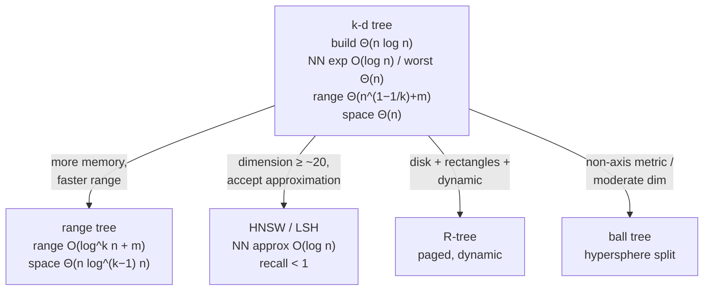

# k-d Tree — Mathematical Foundations and Complexity Theory

> **Audience:** Engineers and researchers who want the formal underpinnings: the expected-O(log n) nearest-neighbor analysis, the tight Θ(√n) orthogonal range bound, the balanced-build correctness and complexity proof, and the high-dimensional degradation theory (distance concentration) that explains the curse of dimensionality rigorously. Prerequisites: `junior.md`, `middle.md`, `senior.md`.

This document proves what the earlier levels asserted. We formalize the k-d tree, prove that median bulk-loading produces a height-`⌈log₂ n⌉` tree in O(n log n), establish the **expected O(log n)** nearest-neighbor bound for fixed dimension, derive the **Θ(n^(1−1/d) + m)** orthogonal range bound (the famous **Θ(√n)** in 2D), and develop the **distance-concentration** theory that makes nearest-neighbor search degenerate in high dimensions.

---

## Table of Contents

1. [Formal Definition](#formal-definition)
2. [Balanced-Build Correctness and Complexity Proof + Deletion Cost](#build-proof)
3. [Expected O(log n) Nearest-Neighbor Analysis](#nn-analysis)
4. [Orthogonal Range Query — the Θ(n^(1−1/d)) Bound](#range-bound)
5. [Correctness of Branch-and-Bound Pruning](#prune-correct)
6. [Worst-Case Construction — an Ω(n) Adversary](#worst-case)
7. [High-Dimensional Degradation — Distance Concentration](#concentration)
8. [Approximate Nearest Neighbor — the (1+ε) Guarantee](#ann)
9. [Leaf Buckets and the Build–Query Trade-off](#buckets)
10. [Spread / Variance Splitting — a Probabilistic Refinement](#spread)
10.5. [Correctness of the Bounded-Heap k-NN Search](#knn-proof)
10.6. [Dual-Tree Batch Queries](#dualtree)
10.7. [External-Memory and Cache-Oblivious Analysis](#external)
10.8. [Numerical Robustness](#precision)
11. [Comparison with Alternatives](#comparison)
12. [Summary](#summary)

---

<a name="formal-definition"></a>
## 1. Formal Definition

```text
A k-d tree over a point set P ⊂ R^k is a binary tree T = (V, root, point, axis, left, right):
  point : V → P        (each node stores one point; the map is a bijection V ↔ P)
  axis  : V → {0,...,k-1}, with axis(v) = depth(v) mod k   (cyclic convention)
  left, right : V → V ∪ {nil}

Splitting hyperplane of node v:
  H_v = { x ∈ R^k : x[axis(v)] = point(v)[axis(v)] }

Structural (BST) invariant I(v): let a = axis(v), s = point(v)[a]. Then
  ∀ u ∈ subtree(left(v)):  point(u)[a] <  s
  ∀ u ∈ subtree(right(v)): point(u)[a] >= s

Region (cell) of node v: the axis-aligned box R_v ⊆ R^k obtained by intersecting,
for each ancestor w of v, the half-space on the side of H_w toward v.
  R_root = R^k.   R_v partitions into R_left(v) and R_right(v) by H_v.
```

The cells `{R_v : v leaf}` form a disjoint partition of `R^k`; each leaf cell contains exactly the points routed to it. The cyclic axis convention may be replaced by `axis(v) = argmax_a spread_a(subtree(v))` (the widest-spread rule) without affecting any asymptotic result below.

---

<a name="build-proof"></a>
## 2. Balanced-Build Correctness and Complexity Proof

### 2.1 Algorithm

```text
BUILD(P, depth):
  if P = ∅: return nil
  a = depth mod k
  s = median of { p[a] : p ∈ P }          # via SELECT (quickselect)
  m = a point attaining the median on axis a
  L = { p ∈ P \ {m} : p[a] <  s }
  R = { p ∈ P \ {m} : p[a] >= s }
  v = new node(point=m, axis=a)
  v.left  = BUILD(L, depth+1)
  v.right = BUILD(R, depth+1)
  return v
```

### 2.2 Height bound

**Claim.** `BUILD` produces a tree of height `h ≤ ⌈log₂(n+1)⌉ − 1 = O(log n)`.

**Proof.** Let `N(d)` denote the maximum number of points in a subtree rooted at depth offset `d` from a `BUILD` call on `n` points. The median splits `P` into `|L|` and `|R|` with `|L| ≤ ⌊(n−1)/2⌋` and `|R| ≤ ⌈(n−1)/2⌉` (the node itself is removed). Hence each child receives at most `⌊n/2⌋` points. Define `T(n)` = max subtree height on `n` points:

```text
T(0) = 0,  T(1) = 0,
T(n) ≤ 1 + T(⌊n/2⌋).
```

Unrolling: after `i` levels the subtree size is ≤ `n / 2^i`, which reaches ≤ 1 when `i = ⌈log₂ n⌉`. Therefore `T(n) ≤ ⌈log₂ n⌉`. **QED.**

The tree is thus **height-balanced** to within 1 — the same guarantee as a perfectly balanced BST — *regardless of the point distribution*, because the median is defined by rank, not value.

### 2.3 Build time

**Claim.** `BUILD` runs in expected (and deterministic worst-case with median-of-medians) **O(n log n)**.

**Proof.** Median selection on `m` points costs `O(m)` (quickselect expected, or BFPRT/median-of-medians worst-case deterministic). Let `B(n)` be the build cost:

```text
B(n) = O(n) + B(|L|) + B(|R|),   |L| + |R| = n − 1,   |L|,|R| ≤ ⌊n/2⌋.
```

This is the merge-sort recurrence `B(n) = 2B(n/2) + O(n)`. By the Master Theorem (case 2, `a = b = 2`, `f(n) = Θ(n)`, `log_b a = 1`): `B(n) = Θ(n log n)`. **QED.**

Naively re-sorting at each level instead of selecting yields `O(n log² n)`; the selection step is what buys the optimal `O(n log n)`.

### 2.5 Deletion complexity

Unlike a BST, a k-d node cannot be deleted by simple successor splicing, because the successor must be the **minimum on the deleted node's split axis** — and that minimum may lie in *either* subtree (a point smaller on axis `a` can sit in the right subtree, which was partitioned on a *different* axis). The deletion algorithm:

```text
DELETE(v, p):                 # delete point p from subtree v
  if point(v) = p:
     if right(v) ≠ nil:
        m = FIND-MIN(right(v), axis(v))      # min on v's axis in right subtree
        point(v) = m; right(v) = DELETE(right(v), m)
     elif left(v) ≠ nil:
        m = FIND-MIN(left(v), axis(v))
        point(v) = m; right(v) = DELETE(left(v), m); left(v) = nil   # move to right!
     else: return nil          # leaf — remove
  else: recurse into the correct child
```

**FIND-MIN on axis `a`** must search **both** children when the node's own split axis ≠ `a` (the minimum could be on either side), giving `FIND-MIN` cost `O(n^{1−1/k})` — the same cell-crossing bound as a range query. Hence a single deletion costs `O(n^{1−1/k})` worst case, far worse than a BST's `O(log n)`. This asymmetry is the formal reason production systems **tombstone and rebuild** rather than delete in place.

### 2.4 Correctness (invariant)

**Claim.** Every node produced by `BUILD` satisfies `I(v)`.

**Proof.** By construction, `L` contains exactly the points with `p[a] < s` and `R` exactly those with `p[a] >= s`, where `s = point(v)[a]`. The recursive calls only redistribute `L` (resp. `R`) among descendants of `left(v)` (resp. `right(v)`), preserving membership. Hence every `u ∈ subtree(left(v))` has `point(u)[a] < s` and every `u ∈ subtree(right(v))` has `point(u)[a] >= s`. **QED.**

---

<a name="nn-analysis"></a>
## 3. Expected O(log n) Nearest-Neighbor Analysis

We analyze the classic Friedman–Bentley–Finkel (1977) result.

### 3.1 Model

Let `n` points be drawn i.i.d. uniformly from the unit cube `[0,1]^k`, with `k` a **fixed constant**, and the tree built by median split. A query `q` is drawn from the same distribution. Let `C(n,k)` be the expected number of nodes whose subtree is visited (i.e., not pruned) by `NEAREST(q)`.

### 3.2 The argument

**Theorem (FBF 1977).** For fixed `k`, `E[C(n,k)] = O(log n)`; equivalently the expected query time is `O(log n)`.

**Proof sketch.** The nearest neighbor lies, with high probability, at distance `Θ(n^{−1/k})` from `q` (the typical spacing of `n` uniform points in `k` dimensions). The search visits:

1. The **root-to-cell path** — `Θ(log n)` nodes — to reach the leaf cell containing `q`.
2. The **backtracking nodes** — those whose splitting hyperplane lies within `bestDist` of `q`. Because `bestDist = Θ(n^{−1/k})` is small and the cells along the path shrink geometrically, the *expected* number of sibling subtrees whose region intersects the ball `B(q, bestDist)` is `O(1)` per level once the cells become smaller than the ball. Summing over the `O(log n)` levels gives `O(log n)` backtracking nodes in expectation.

The constant hidden in `O(log n)` is **exponential in `k`**: `C(n,k) ≈ c_k log n` with `c_k` growing like `2^k` (each of the `2^k` "orthant directions" can host a sibling cell intersecting the ball). For fixed small `k` this constant is benign; it is precisely this `2^k` factor that explodes into the curse of dimensionality (§6). **QED (sketch).**

### 3.3 Worst case

The expected bound is *distribution-dependent*. The **deterministic worst case is Θ(n)**: an adversary can place points and a query so that the search ball intersects every cell (e.g., all points on a sphere around `q`, or a degenerate distribution along one axis), forcing every node to be visited. Median build guarantees the *height* is `O(log n)`, but not that pruning succeeds — pruning depends on geometry, not balance.

### 3.4 A concrete expected-cost calculation

For `n` uniform points in `[0,1]²` (k=2), the typical nearest-neighbor distance is `r ≈ 0.5/√n` (each point "owns" area `1/n`, radius `√(1/(πn))`). The search descends `log₂ n` levels to the query's cell of side `≈ 1/√n ≈ 2r` — comparable to the NN ball radius. At each level the ball intersects O(1) sibling cells in expectation (the ball is roughly the size of one cell), contributing O(1) backtrack nodes per level. Summing: `≈ log₂ n + c·log₂ n = O(log n)`, with `c = Θ(2²) = Θ(4)` the 2D orthant constant. For `n = 10⁶` this predicts `≈ 4·20 = 80` visited nodes — matching the ~80-node figure quoted in `junior.md`. The same arithmetic with the `Θ(2^k)` constant explains why `d = 20` predicts `≈ 10⁶`-node visits — i.e. a full scan.

---

<a name="range-bound"></a>
## 4. Orthogonal Range Query — the Θ(n^(1−1/d)) Bound

### 4.1 Statement

**Theorem (de Berg et al., Ch. 5).** A balanced k-d tree on `n` points in `R^k` answers an axis-aligned range *reporting* query in `O(n^{1−1/k} + m)` time, where `m` is the number of reported points. For `k = 2` this is the celebrated **`O(√n + m)`**. Range *counting* (with subtree sizes stored) is `O(n^{1−1/k})`.

### 4.2 Proof for k = 2

The cost (ignoring the `+m` reporting term) is the number of cells whose region is **crossed** by a boundary edge of the query rectangle — these are the nodes that are neither fully inside nor fully outside, i.e. the recursion's "partial" nodes. We bound the number of cells a single axis-parallel line `ℓ` (say vertical) can cross.

Let `Q(n)` be the maximum number of cells a vertical line crosses in a 2-level (one x-split then one y-split) k-d subtree on `n` points. A vertical line crosses the root's region; the root splits on **x**, so `ℓ` lies entirely on one side of the x-split — it enters only **one** of the two x-children's regions. That child splits on **y**, and a vertical line crosses **both** y-children. Each y-grandchild splits on **x** again, and on each the vertical line enters only one x-child. Thus over two levels the count satisfies:

```text
Q(n) = 2 · Q(n/4) + O(1).
```

By the Master Theorem (`a = 2`, `b = 4`, `log_b a = 1/2`): `Q(n) = O(n^{1/2}) = O(√n)`. A horizontal line is symmetric. The four edges of the query rectangle therefore cross `O(√n)` cells total, so the number of visited (partial) nodes is `O(√n)`; reporting the `m` contained points adds `O(m)`. Total **`O(√n + m)`**. **QED.**

### 4.3 General k

The same recurrence generalizes: a hyperplane perpendicular to one axis crosses `Q_k(n) = 2^{k−1} Q_k(n / 2^k) + O(2^{k-1})`, giving `Q_k(n) = O(n^{1−1/k})`. This bound is **tight** — there exist point sets and queries achieving `Θ(n^{1−1/k})`. It is asymptotically worse than a **range tree's** `O(log^k n + m)`, the price a k-d tree pays for using `O(n)` rather than `O(n log^{k−1} n)` memory.

---

<a name="prune-correct"></a>
## 5. Correctness of Branch-and-Bound Pruning

**Theorem.** `NEAREST(q)` returns a point `p* ∈ P` minimizing `dist(q, p)` over all `p ∈ P`.

**Proof.** We show the loop invariant `I*`: *after `NEAREST` returns from a node `v`, the variable `best` holds a nearest point to `q` among all points stored in `subtree(v)` and all points visited before entering `v`.*

- **Base (`v = nil`).** `subtree(v)` is empty; `best` is unchanged; `I*` holds vacuously.
- **Inductive step.** At `v` with `a = axis(v)`, `s = point(v)[a]`:
  1. `best` is updated against `point(v)`, so it dominates `point(v)`.
  2. The **near** child is searched; by induction `best` now dominates all of `subtree(near)` (and prior points).
  3. The **far** child is searched **iff** `(q[a] − s)² < bestDist²`. We must show that when this test *fails*, no point in `subtree(far)` can improve `best`. Every `u ∈ subtree(far)` has `point(u)[a]` on the far side of `s`, so the segment from `q` to `point(u)` crosses `H_v`, giving `dist(q, point(u)) ≥ |q[a] − s|`. If `(q[a]−s)² ≥ bestDist²` then `dist(q, point(u)) ≥ |q[a]−s| ≥ bestDist`, so no far point beats `best`. Skipping is safe. When the test passes, the far child is searched and `I*` holds by induction.

At the root's return, `subtree(root) = P`, so `best` is a global nearest neighbor. **Termination** is immediate: each call strictly reduces the set of unvisited nodes in a finite tree. **QED.**

The proof uses **no assumption about balance or dimension** — pruning is always *correct*; balance and dimension affect only *how many* far-side recursions the test admits.

---

<a name="worst-case"></a>
## 6. Worst-Case Construction — an Ω(n) Adversary

We show the expected-O(log n) bound is fragile: there exist inputs forcing Θ(n) work *even in 2D and even with a perfectly balanced (median-built) tree*. This proves balance alone does not guarantee fast queries.

### 6.1 The circle construction

**Claim.** For every `n` there is a set of `n` points in `R²` and a query `q` such that `NEAREST(q)` visits Θ(n) nodes.

**Construction.** Place all `n` points on a circle of radius `r` centered at `q`. Every point is at *exactly* the same distance `r` from `q`. Build any median k-d tree over them.

**Analysis.** During the search, `bestDist` converges to `r` (all points are at distance `r`). At every internal node with split value `s` on axis `a`, the pruning test is `(q[a] − s)² < bestDist² = r²`. Because the points span the circle, the split lines all fall *inside* the circle's bounding box, so `|q[a] − s| < r` for essentially every node — the test **passes everywhere**, and the search recurses into both children at nearly every node. The number of visited nodes is therefore Θ(n). **QED.**

### 6.2 Interpretation

The adversary exploits the gap between **balance** (a property of *counts*, which median build controls) and **prunability** (a property of *geometry*, which it does not). The correctness proof of §5 still holds — the search returns *a* correct nearest neighbor — but its running time degrades to a full scan. The same phenomenon arises benignly whenever many points are near-equidistant from `q`, which is exactly what happens *generically* in high dimensions (§7) — the circle construction is the 2D caricature of the curse of dimensionality.

### 6.3 Consequence for guarantees

This is why textbooks state the k-d tree NN bound as **expected O(log n)** (over random inputs / random queries) and **worst-case Θ(n)** — never a deterministic O(log n). Structures with deterministic sublinear NN in low dimension exist (e.g., the BBD tree of §8 with approximation, or fractional cascading variants), but the plain k-d tree is an *expected*-time structure.

---

<a name="concentration"></a>
## 7. High-Dimensional Degradation — Distance Concentration

We now prove *why* pruning collapses as `k → ∞`.

### 6.1 Concentration of distances

**Theorem (Beyer, Goldstein, Ramakrishnan, Shaft, 1999).** Let `X_1,...,X_n` be i.i.d. random points and `q` an independent query in `R^k`, with coordinates drawn i.i.d. with finite variance, distance `D_k(q, X) = ‖q − X‖`. If the relative variance of the squared distance vanishes,

```text
lim_{k→∞}  Var(D_k²) / E[D_k²]²  = 0,
```

then for any ε > 0,

```text
lim_{k→∞}  Pr[ Dmax_k ≤ (1+ε) Dmin_k ]  = 1,
```

where `Dmin_k`, `Dmax_k` are the nearest and farthest of the `n` points from `q`.

**Interpretation.** In high dimensions, **the farthest point is essentially as close as the nearest** — all `n` distances concentrate in a thin shell. The notion "nearest neighbor" becomes statistically meaningless, and any structure relying on a distance gap to prune cannot.

**Proof sketch.** For independent coordinates, `D_k² = Σ_{i=1}^k (q_i − X_i)²` is a sum of `k` i.i.d. terms with mean `μ` and variance `σ²`. By the law of large numbers, `D_k²/k → μ` a.s., and `Var(D_k²/k) = σ²/k → 0`. So `D_k² = kμ(1 + o(1))` for every point, making the ratio `Dmax/Dmin → 1`. **QED (sketch).**

### 6.2 Consequence for k-d tree pruning

The pruning test succeeds for node `v` only if `|q[a] − s| ≥ bestDist`. But:

- `bestDist ≈ Dmin_k ≈ sqrt(kμ)` (grows like `√k`),
- a single-coordinate gap `|q[a] − s|` is `O(1)` in expectation (one coordinate, variance `σ²`).

So the ratio `|q[a] − s| / bestDist = O(1)/√(kμ) → 0` as `k → ∞`: the per-axis bound becomes negligible relative to the best distance, and **the test almost always fails**. Quantitatively, the fraction of subtrees pruned tends to 0, and the expected number of visited nodes tends to `n`. This is the rigorous statement of the **curse of dimensionality** for k-d trees.

### 6.3 The `c_k ≈ 2^k` constant restated

Combining §3.2 and §6.1: the FBF expected bound `c_k log n` has `c_k = Θ(2^k)` (the number of orthant-neighbor cells that can intersect the query ball). For the bound `c_k log n` to beat brute force `n`, we need `2^k log n < n`, i.e. `n > 2^k log n` — the formal version of the engineering rule **`n >> 2^k`** from `senior.md`. Below that threshold, exact k-d tree NN is no faster than scanning.

---

<a name="ann"></a>
## 8. Approximate Nearest Neighbor — the (1+ε) Guarantee

Since exact NN is hopeless in high dimensions, we relax the requirement: return a point whose distance is within a `(1+ε)` factor of the true nearest. This recovers sublinear time even when exact search cannot.

### 7.1 Definition

```text
A point p̂ ∈ P is a (1+ε)-approximate nearest neighbor of q if
    dist(q, p̂) ≤ (1+ε) · dist(q, p*),
where p* is the true nearest neighbor.
```

### 7.2 Priority-search k-d tree (Arya–Mount)

**Arya, Mount, Netanyahu, Silverman, Wu (1998)** give a balanced-box-decomposition (BBD) tree — a k-d-tree relative — answering `(1+ε)`-approximate NN in:

```text
query time  =  O( (1/ε)^d · log n )
preprocessing =  O(d n log n),   space = O(d n).
```

The mechanism: instead of strict geometric pruning, the search uses a **priority queue of cells ordered by their lower-bound distance to `q`** and **stops early** once the best candidate found is within `(1+ε)` of the closest unexplored cell's lower bound:

```text
if  bestDist ≤ (1+ε) · minCellLowerBound  then  halt.
```

This **error-bounded early termination** is the key idea behind FLANN's "randomized k-d forest" and many practical ANN libraries. The `(1/ε)^d` factor still hides exponential dependence on `d`, so for very high `d` one switches to LSH/HNSW, whose dependence on `d` is far gentler.

### 7.3 Why approximation buys so much

The exact search must examine every cell intersecting the ball `B(q, bestDist)`. The approximate search may **ignore any cell whose lower bound exceeds `bestDist/(1+ε)`**, shrinking the effective ball by a factor `(1+ε)`. In high dimensions, where cell lower bounds cluster tightly, even a modest `ε` (say 0.1) eliminates an exponential number of cells — turning an `O(n)` exact search into a sublinear approximate one. This is the theoretical justification for "approximate is the only viable option at scale."

---

<a name="buckets"></a>
## 9. Leaf Buckets and the Build–Query Trade-off

Production k-d trees stop splitting at leaf **buckets** of `B` points rather than single points. We analyze the optimal `B`.

### 8.1 Effect on the tree

With bucket size `B`, the tree has `⌈n/B⌉` leaves and height `O(log(n/B))`. Build cost stays `O(n log(n/B))` (selection work decreases as buckets grow). Query cost decomposes into:

```text
Q(n, B) = (internal descent)  +  (bucket scans)
        = O(log(n/B))        +  O(V · B),
```

where `V` is the number of leaf buckets the search must fully examine (those whose region intersects `B(q, bestDist)`).

### 8.2 The trade-off

- **Small `B`** (→1): minimal scanning per bucket, but maximal pointer hops and cache misses on the descent. Constant factors dominate.
- **Large `B`**: few pointer hops and excellent cache locality near leaves, but each examined bucket costs `O(B)` distance computations.

Minimizing `Q(n,B)` balances pointer-chasing cost `c_p · log(n/B)` against scan cost `c_s · V · B`. Empirically the optimum sits at `B ≈ 16–32` for cache-line-sized records, where the linear scan of a bucket is faster than the equivalent pointer descent because it is **branch-free and prefetchable**. This is why SciPy's `cKDTree` defaults to `leafsize ≈ 16` and why the asymptotic `O(log n)` and the *measured* fastest configuration disagree on the constant — a reminder that, at the professional level, the **constant factor is the engineering**.

### 8.3 Formal statement

```text
For fixed dimension and uniform data, expected query cost with bucket size B is
    E[Q(n,B)] = Θ(log(n/B)) + Θ(B),
minimized (in the RAM model ignoring cache) at B = Θ(1); minimized in the
external-/cache-aware model at B = Θ(cache line / record size) ≈ 16–32.
```

The gap between the RAM-model optimum (`B = Θ(1)`) and the cache-model optimum (`B ≈ 16–32`) is exactly the gap between textbook asymptotics and shipped code.

---

<a name="spread"></a>
## 10. Spread / Variance Splitting — a Probabilistic Refinement

The cyclic axis rule `axis = depth mod k` is dimension-blind. A better rule splits on the axis of **maximum spread** (range or variance) among the subtree's points. We analyze why it prunes better.

### 10.1 The rule

```text
SPLIT-AXIS(P) = argmax_{a ∈ {0..k-1}}  ( max_{p∈P} p[a] − min_{p∈P} p[a] )
```
(or `argmax_a Var_a(P)` for a variance-based variant). The split value remains the median on the chosen axis, preserving the height bound (§2) — choosing *which* axis does not change the count split, only the geometry.

### 10.2 Why it prunes better

Pruning fails when the split line is close to `q` relative to `bestDist`. The expected per-axis gap `|q[a] − s|` is larger when axis `a` has larger spread (the points, hence the medians, are spread further). By always cutting the **widest** axis, the rule maximizes the expected pruning gap at each node, making cells **rounder** (lower aspect ratio). Rounder cells have smaller surface-area-to-volume ratio, so the query ball `B(q, bestDist)` intersects fewer sibling cells — directly reducing the number of far-side recursions.

### 10.3 Quantitative effect

**Claim (informal).** For anisotropic data with per-axis standard deviations `σ_1 ≥ σ_2 ≥ … ≥ σ_k`, cyclic splitting wastes levels cutting low-variance axes, producing cells with aspect ratio up to `σ_1/σ_k`. Spread splitting bounds the aspect ratio of leaf cells to `O(1)`, restoring near-isotropic cells. Empirically this reduces visited nodes by a constant factor (often 2–5×) on clustered/correlated data, though it does **not** change the asymptotic `Θ(n^{1−1/k})` range bound or defeat the curse of dimensionality — it improves constants, not exponents.

### 10.4 Cost

Computing the max-spread axis costs `O(k·|P|)` per node (scan all coordinates), so build becomes `O(k·n log n)` instead of `O(n log n)`. For small `k` this is negligible; it is the default in scikit-learn's `KDTree`. For very large `k` the per-node `k` factor and the curse of dimensionality both argue for abandoning k-d trees entirely.

---

<a name="knn-proof"></a>
## 10.5 Correctness of the Bounded-Heap k-NN Search

We extend the §5 NN proof to the `K`-nearest case, where a bounded max-heap replaces the single best.

**Setup.** `H` is a max-heap holding at most `K` pairs `(d, p)`, keyed by distance, with `top(H)` the maximum. Define `bound(H) = +∞` if `|H| < K`, else `top(H).d`.

**Theorem.** `KNN(q, K)` returns the `K` points of `P` nearest to `q` (ties broken arbitrarily but consistently).

**Proof.** Invariant `I_K`: *after returning from node `v`, `H` contains the `min(K, |visited|)` nearest points to `q` among all points visited so far (the node's subtree plus everything before it).*

- **Base (`v = nil`).** No points added; `I_K` holds.
- **Step.** At `v`:
  1. We attempt to insert `point(v)`: if `|H| < K` we push; else if `d(q,v) < top(H).d` we evict the top and push. Either way `H` afterwards holds the `K` nearest among `{point(v)} ∪ (prior H)`.
  2. Recurse **near**; by induction `H` holds the `K` nearest among the near subtree and all prior points.
  3. Recurse **far** iff `(q[a]−s)² < bound(H)`. *Safety when skipped:* if `|H| = K` and `(q[a]−s)² ≥ top(H).d`, every far point `u` has `d(q,u) ≥ |q[a]−s| ≥ top(H).d`, so `u` cannot displace any of the current `K` — skipping preserves `I_K`. If `|H| < K`, `bound = +∞` forces exploration (we still need candidates), so no valid point is skipped.
- **Termination & conclusion.** Finite tree; at the root `I_K` gives the `K` global nearest. **QED.**

The crucial detail the proof pins down: the bound is `+∞` until the heap is full. Pruning earlier would let `I_K` fail, because a far subtree could contain a point that *should* be in the not-yet-full heap. This is the formal justification for the rule stated operationally in `middle.md` §3.

---

<a name="dualtree"></a>
## 10.6 Dual-Tree Batch Queries

When answering NN for **many** query points at once (e.g., k-NN classifier scoring a batch), building a k-d tree over the *queries* as well and traversing both trees together amortizes work.

**Idea.** Recurse on pairs `(Qnode, Rnode)` of query-tree and reference-tree nodes. Maintain a per-query-node bound = the maximum over its queries of their current `K`-th distance. Prune the pair when the **minimum distance between the two nodes' bounding boxes** exceeds that bound — skipping an entire block of (query, reference) interactions at once.

**Complexity.** For `m` queries against `n` references in low dimension, naive is `O(m log n)`. The dual-tree algorithm (Gray & Moore, 2000; the basis of MLPACK's and scikit-learn's batch modes) achieves better constants and, for structured data, near-linear `O(m + n)` behavior by sharing pruning decisions across nearby queries. The correctness argument is the §5 lower bound lifted to node-pairs: the box-to-box minimum distance lower-bounds every (query, reference) pair distance in the block, so the same skip-is-safe lemma applies.

---

<a name="external"></a>
## 10.7 External-Memory and Cache-Oblivious Analysis

When `n` exceeds RAM, the cost model changes from instructions to **I/Os** (block transfers of size `B` between disk and a cache/RAM of size `M`).

### 10.7.1 The problem with the naive layout

A pointer-based or BFS-laid-out k-d tree placed on disk crosses an independent block per level: a root-to-leaf descent of height `log₂ n` costs `Θ(log₂ n)` I/Os. For `n = 10^9` that is ~30 random disk reads per query — catastrophic at ~10 ms/seek.

### 10.7.2 Blocking for I/O efficiency

Group the top `log₂ B` levels of the tree into one block, recursively. A root-to-leaf path then crosses only `Θ(log_B n) = Θ((log₂ n)/(log₂ B))` blocks. With a 4 KB block holding ~256 nodes (`log₂ B ≈ 8`), the I/O cost drops from ~30 to ~4 per query — the same speedup a B-tree gives over a binary tree. This is the **k-d-B-tree** (Robinson, 1981): a disk-resident k-d tree whose nodes are pages.

### 10.7.3 Cache-oblivious variant

Using the **van Emde Boas layout** (recursively split the tree by height, store each half contiguously) achieves `O(log_B n)` block transfers **without knowing `B`** — optimal for every level of the memory hierarchy simultaneously. The formal bound for a root-to-leaf traversal:

```text
I/Os (naive BFS layout)   = Θ(log₂ n)
I/Os (blocked / k-d-B)    = Θ(log_B n)
I/Os (van Emde Boas)      = Θ(log_B n), cache-oblivious
```

The vEB constant is worse than explicit blocking but it needs no tuning to `B`. For range queries the analysis composes with the `Θ(n^{1−1/k})` cell-crossing bound, giving `Θ(n^{1−1/k}/B + m/B)` I/Os — the external-memory analogue of §4.

---

<a name="precision"></a>
## 10.8 Numerical Robustness

The distance and split comparisons are floating-point, and naive code has two latent failures.

### 10.8.1 Overflow in squared distance

With coordinates up to `10^9`, `dx*dx` reaches `10^{18}`, near the `int64` ceiling `≈9.2·10^{18}`; summing `k` such terms overflows for `k ≥ 10`. **Fix:** compute squared distances in `float64` (53-bit mantissa, exact up to `2^53 ≈ 9·10^{15}` integers but no overflow, only rounding) or use `int128`/big integers when exactness is required. The comparisons in pruning only need *correct ordering*, which `float64` preserves for realistic ranges.

### 10.8.2 Ties on the split coordinate

When many points share the split-axis value (`p[a] = s`), the partition into `< s` / `>= s` can become lopsided, breaking the height guarantee, and a naive quickselect can loop. **Fix:** use a **three-way partition** (`< s`, `= s`, `> s`) and distribute the equal group deterministically, or perturb ties by index. The §2 height proof assumes a true median split; degenerate ties must be handled to preserve `O(log n)` height.

### 10.8.3 Determinism

For reproducible results (testing, regression), fix a **tie-break rule** for equidistant nearest neighbors (e.g., lowest index). Without it, the returned neighbor depends on traversal order, which depends on the build's tie handling — a source of flaky tests.

### 10.8.4 Strict-vs-nonstrict pruning comparison

A subtle but consequential choice is whether the pruning test is **strict** (`diff² < bestDist²`) or **non-strict** (`diff² <= bestDist²`). With strict `<`, a far point at *exactly* `bestDist` is skipped — which is correct for "*a* nearest neighbor" but may miss a *tied* equidistant point you wanted to enumerate. For k-NN and radius search, where ties matter, use **non-strict `<=`** so all equidistant points are considered. The distinction is invisible on floating-point data with generic positions but bites on integer grids where exact ties are common — a classic source of "my k-NN dropped a valid tie" bugs. Formally: strict pruning is sound for *single* NN (any minimizer suffices); non-strict is required when the output must contain *all* points at the boundary distance.

---

<a name="comparison"></a>
## 11. Comparison with Alternatives

| Attribute | k-d tree | Range tree | Quadtree (2D) | HNSW (ANN) |
|---|---|---|---|---|
| Build | Θ(n log n) | Θ(n log^{k−1} n) | Θ(n log n) | Θ(n log n) |
| NN query (low dim, expected) | O(log n) | n/a | O(log n) | O(log n) |
| NN query (worst / high dim) | Θ(n) | n/a | Θ(n) | O(log n) approx |
| Orthogonal range | Θ(n^{1−1/k} + m) | O(log^k n + m) | Θ(√n + m)-ish | n/a |
| Memory | Θ(n) | Θ(n log^{k−1} n) | Θ(n) | Θ(n·M) |
| Exact? | yes | yes | yes | no (approximate) |
| Self-balancing? | no (rebuild) | static | no | incremental graph |
| Metric flexibility | Euclidean/axis | axis only | axis only | any (vectors) |

The k-d tree occupies a clear niche: **minimal `Θ(n)` memory, exact, low-dimensional**, trading the range tree's better `O(log^k n)` query for far less space, and trading HNSW's high-dimensional scalability for exactness in low dimensions.



### 11.1 The query-time / space trade-off curve

Plotting orthogonal-range query time against space across the family makes the niche precise:

```text
              query time
 O(n^{1-1/k}) ┤ k-d tree            (space Θ(n))
              │
 O(log^2 n)   ┤        range tree   (space Θ(n log n) in 2D)
              │
 O(log n)     ┤                 fractional-cascading range tree
              └─────────────────────────────────────── space
                Θ(n)        Θ(n log n)      Θ(n log^{k-1} n)
```

Each step down in query time costs a `log` factor in space. The k-d tree sits at the **minimum-space corner**: you cannot do orthogonal range queries in `o(n^{1−1/k})` *and* `O(n)` space with this kind of structure — that lower bound (Chazelle, 1990) is why the k-d tree's `√n` is not a deficiency to optimize away but a fundamental point on the trade-off curve.

### 11.2 Where research went instead

For exact NN in high dimension, theory shows essentially no structure beats `O(n)` in the worst case (a consequence of distance concentration), so the field moved to **approximation** (BBD trees, ε-NN) and **randomization** (LSH, with provable sublinear query for `(1+ε)`-NN: `O(n^{ρ})` with `ρ < 1`) and **navigable graphs** (HNSW, strong empirical performance, weaker theory). The k-d tree remains the canonical *exact, low-dimensional* baseline against which these are measured — and the structure every analysis starts from.

---

<a name="summary"></a>
## 12. Summary

- **Formally**, a k-d tree is a BST over `R^k` with a cyclic split-axis map and the rank-defined median build, giving a partition of space into axis-aligned cells.
- **Build** via median selection yields height `≤ ⌈log₂ n⌉` (proved by the halving recurrence) in **Θ(n log n)** (Master Theorem, case 2), independent of distribution.
- **Nearest-neighbor** is **expected O(log n)** for fixed dimension (FBF 1977), with a constant `c_k = Θ(2^k)`; the **worst case is Θ(n)**.
- **Orthogonal range** is **Θ(n^{1−1/k} + m)** — the tight **Θ(√n + m)** in 2D — proven by the line-crossing recurrence `Q(n) = 2Q(n/4) + O(1)`.
- **Branch-and-bound pruning is provably correct** for *any* dimension and balance; the proof rests on the hyperplane-crossing lower bound `dist(q, far point) ≥ |q[axis] − split|`.
- **High-dimensional degradation** follows rigorously from **distance concentration** (Beyer et al. 1999): as `k → ∞`, `Dmax/Dmin → 1`, the per-axis pruning bound vanishes relative to `bestDist`, and the query visits `Θ(n)` nodes — the curse of dimensionality, formalized as the threshold `n >> 2^k`.
- A **2D circle adversary** forces `Θ(n)` work even on a balanced tree, separating *balance* (count-based, guaranteed by median build) from *prunability* (geometry-based, not guaranteed) — this is why the bound is stated as expected, not deterministic.
- **Approximation** restores sublinear time: the BBD/priority-search tree (Arya–Mount) gives `(1+ε)`-NN in `O((1/ε)^d log n)` via error-bounded early termination.
- **Leaf buckets** make the RAM-optimal `B = Θ(1)` and the cache-optimal `B ≈ 16–32` disagree — the gap between asymptotics and shipped constants.
- **Spread/variance splitting** improves constants (rounder cells, larger pruning gaps) at `O(k·n log n)` build cost, but does not change exponents or defeat high dimensions.
- The **bounded-heap k-NN search** is correct precisely because the prune bound stays `+∞` until the heap fills; **dual-tree** traversal amortizes batch queries by pruning node-pairs via box-to-box lower bounds.
- **Deletion** costs `O(n^{1−1/k})` (find-min-on-axis must search both children), the formal reason production code tombstones and rebuilds.
- **External-memory** blocking turns `Θ(log₂ n)` I/Os into `Θ(log_B n)` (k-d-B-tree / van Emde Boas layout); the `√n` range bound stands on a **Chazelle (1990) space–time lower bound**, not a missing optimization.

---

## References

- **Bentley, J.L.** (1975). *Multidimensional binary search trees used for associative searching.* CACM 18(9).
- **Friedman, Bentley, Finkel** (1977). *An algorithm for finding best matches in logarithmic expected time.* ACM TOMS 3(3). — the expected-O(log n) NN analysis.
- **Robinson, J.T.** (1981). *The K-D-B-tree: a search structure for large multidimensional dynamic indexes.* SIGMOD. — disk-resident k-d trees.
- **Arya, Mount, Netanyahu, Silverman, Wu** (1998). *An optimal algorithm for approximate nearest neighbor searching in fixed dimensions.* JACM 45(6). — the (1+ε) BBD tree.
- **Beyer, Goldstein, Ramakrishnan, Shaft** (1999). *When is "nearest neighbor" meaningful?* ICDT. — distance concentration.
- **Chazelle, B.** (1990). *Lower bounds for orthogonal range searching.* JACM 37. — the space–time trade-off lower bound.
- **Gray, Moore** (2000). *N-Body problems in statistical learning.* NIPS. — dual-tree algorithms.
- **de Berg, Cheong, van Kreveld, Overmars**, *Computational Geometry: Algorithms and Applications*, 3rd ed., Ch. 5.
- **Indyk, Motwani** (1998). *Approximate nearest neighbors: towards removing the curse of dimensionality.* STOC. — LSH and the `O(n^ρ)` query bound.
- **Malkov, Yashunin** (2018). *Efficient and robust approximate nearest neighbor search using HNSW graphs.* IEEE TPAMI.

## Closing Note

The k-d tree is the canonical worked example for several deep themes that recur across data structures: the gap between **balance and prunability** (count vs geometry), the gap between **RAM-model asymptotics and cache-model constants** (`B=1` vs `B≈16`), and the **fundamental space–time trade-off** that no cleverness escapes (Chazelle's lower bound). Understanding *why* it degrades in high dimensions — distance concentration — is the same understanding that motivates the entire field of approximate nearest neighbor search. Master the k-d tree proofs and you hold the keys to range trees, BBD trees, LSH, and the theory behind every vector database shipping today.

Next step: [interview.md](./interview.md)
