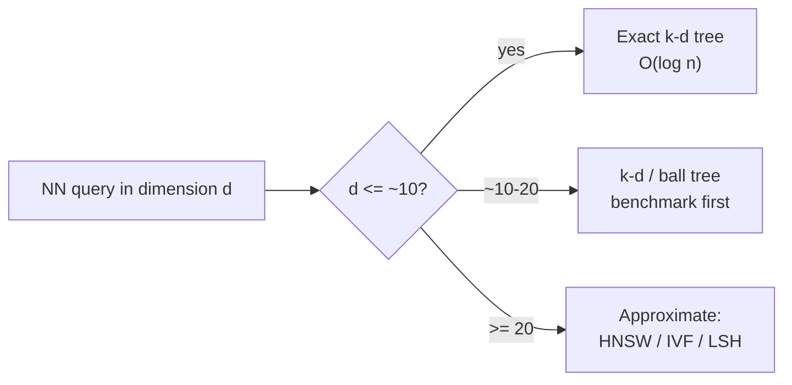

# k-d Tree — Senior Level

> **Audience:** Engineers choosing spatial indexes for production systems — large point clouds, ML nearest-neighbor pipelines, geospatial services — who must decide when a k-d tree is the right tool and when to switch to LSH, HNSW, or a ball tree, and how to handle dynamic updates at scale. Prerequisites: `junior.md`, `middle.md`.

This document is about **systems engineering** with k-d trees: where they actually ship (point clouds, ray tracing, k-NN classifiers, geospatial), how the **curse of dimensionality** forces a switch to approximate methods past a threshold, how to decide between **k-d tree vs ball tree vs HNSW vs LSH**, and how to handle **dynamic data, sharding, and observability** when one tree on one core is no longer enough.

---

## Table of Contents

1. [Where k-d Trees Actually Ship](#ship)
2. [The Curse of Dimensionality as an Engineering Constraint](#curse)
3. [When to Switch: k-d Tree vs Ball Tree vs HNSW vs LSH](#switch)
4. [Large Point Clouds and Ray Tracing](#pointclouds)
5. [ML Nearest-Neighbor Pipelines](#ml)
6. [Geospatial Systems](#geospatial)
7. [Dynamic Updates and Sharding at Scale](#dynamic)
8. [Memory Layout and Cache Behavior](#memory)
9. [Concurrency](#concurrency)
9.4. [Code — Spatial Sharding with an Overlap Halo](#shardcode)
9.5. [Code — Double-Buffered Dynamic Index](#dbcode)
10. [Observability and Failure Modes](#observability)
11. [A Worked Capacity Example](#worked)
12. [Anti-Patterns Checklist](#antipatterns)
13. [Summary](#summary)

---

<a name="ship"></a>
## 1. Where k-d Trees Actually Ship

k-d trees are not a contest curiosity — they are load-bearing in shipping software, almost always in **low-dimensional** settings (2–10 dimensions) where pruning still works:

| System | Use | Dimension |
|---|---|---|
| **scikit-learn** `KNeighborsClassifier` | k-NN classification/regression default for small `d` | typically < 20 |
| **SciPy** `cKDTree` | scientific NN, radius queries, pair counting | 2–10 |
| **PCL** (Point Cloud Library) | normal estimation, downsampling, registration | 3 |
| **FLANN / nanoflann** | fast approximate NN for vision/SLAM | 3–64 (approx mode) |
| **Game engines** | spatial queries, AI perception, audio occlusion | 2–3 |
| **Embree / ray tracers** | ray-scene intersection acceleration (k-d tree or BVH) | 3 |
| **PostGIS / spatial DBs** | usually R-tree, but k-d-style for in-memory indices | 2 |
| **astropy / cosmology** | nearest-galaxy, correlation functions | 3 |

The common thread: **fixed low dimension, many queries against a mostly-static set**. The moment dimension climbs (text/image embeddings at 128–1536 dims) the industry abandons k-d trees for approximate methods.

### 1.1 Why these systems chose k-d trees

Each of these domains shares three properties that make a k-d tree the right call:

1. **Low, fixed dimension.** Coordinates (2D/3D) where pruning genuinely works — `n >> 2^d` holds comfortably.
2. **Query-dominated workload.** The data set is built once (or rebuilt periodically) and queried orders of magnitude more often, so the `O(n log n)` build amortizes to near-zero per query.
3. **Memory sensitivity.** A k-d tree is exactly one node per point — `O(n)` — unlike a range tree's `O(n log^{k−1} n)` or a grid's wasted empty cells. For a 2M-point LiDAR frame on an embedded automotive SoC, that compactness matters.

When any of these fails — dimension too high, data too dynamic, or memory not a constraint — a different structure wins, which is exactly the decision framework the rest of this document develops.

---

<a name="curse"></a>
## 2. The Curse of Dimensionality as an Engineering Constraint

The single most important senior-level fact: **a k-d tree's nearest-neighbor query degrades from O(log n) to O(n) as dimension grows**, and the crossover is *low* — often around `d = 10–20`.

### 2.1 Why pruning fails in high dimensions

Pruning works only if the bound `|q[axis] - split|` frequently exceeds the current best distance. In high dimensions:

- **Distances concentrate.** For uniform points in `d` dimensions, the ratio `(max_dist − min_dist) / min_dist` shrinks toward 0 as `d → ∞`. The nearest and farthest points are almost equidistant, so "best so far" is barely better than any candidate — and almost nothing can be pruned.
- **Cells touch the query ball.** The nearest-neighbor ball of radius `bestDist` intersects nearly all sibling cells once `d` is large, because volume concentrates near cell boundaries.
- **You must visit ~all nodes.** Empirically, NN visits a constant fraction of the tree once `d ≳ 20`, i.e. O(n).

### 2.2 The `n >> 2^d` rule

A k-d tree beats brute force only when the number of points dwarfs `2^d`:

```text
useful  ⇔  n >> 2^d
d = 2   → n >> 4          (always true)
d = 10  → n >> 1,024      (usually true)
d = 20  → n >> 1,048,576  (often false)
d = 100 → n >> 2^100      (never true)
```

For a 128-dimensional image embedding you would need astronomically many points before a k-d tree pruned anything — so we do not use one.



### 2.3 Approximate as the escape hatch

Past the threshold, accept **approximate** nearest neighbor (ANN): return a point that is *probably* the nearest, or within a `(1+ε)` factor, in sublinear time. This is the foundation of vector databases (Pinecone, Milvus, Weaviate, FAISS, pgvector). Exact NN in high dimensions is essentially hopeless at scale — a deep result, not a missing optimization.

---

<a name="switch"></a>
## 3. When to Switch: k-d Tree vs Ball Tree vs HNSW vs LSH

| Method | Dimension sweet spot | Exact? | Build | Query | Memory | Notes |
|---|---|---|---|---|---|---|
| **k-d tree** | 2–10 | exact | O(n log n) | O(log n)→O(n) | O(n) | axis-aligned splits; degrades with `d` |
| **Ball tree** | 5–30 | exact | O(n log n) | O(log n)→O(n) | O(n) | splits by hypersphere; better for non-uniform & non-axis metrics |
| **VP-tree** | medium, metric spaces | exact | O(n log n) | O(log n) | O(n) | works for any metric (not just Euclidean) |
| **LSH** | high (100s–1000s) | approximate | O(n) | O(1)* per bucket | O(n·L) | hashing collisions = near points; tunable recall |
| **IVF (FAISS)** | high | approximate | O(n) cluster | O(√n)-ish | O(n) | inverted file over k-means cells |
| **HNSW** | high (100s–1000s) | approximate | O(n log n) | O(log n) | O(n·M) | navigable small-world graph; SOTA recall/latency |

### 3.1 Ball tree vs k-d tree
A **ball tree** partitions points into nested **hyperspheres** rather than axis-aligned boxes. Because a ball's bounding region adapts to the data's shape (not just the axes), ball trees prune better than k-d trees when:
- data is **not** axis-aligned (correlated dimensions),
- the metric is non-Euclidean (cosine, Manhattan, Haversine),
- dimension is moderate (say 10–30).

scikit-learn's `NearestNeighbors(algorithm='auto')` picks between `kd_tree`, `ball_tree`, and brute force based on `n`, `d`, and the metric — a good default heuristic to mimic.

### 3.2 LSH (Locality-Sensitive Hashing)
LSH hashes points so that **nearby points collide** with high probability. Query = hash `q`, look only in colliding buckets. It is **approximate** (tunable recall) and shines where k-d trees die: hundreds to thousands of dimensions. Trade memory (`L` hash tables) for recall.

### 3.3 HNSW (Hierarchical Navigable Small World)
The current default for high-dimensional ANN in vector databases. A layered proximity graph navigated greedily; **O(log n)** expected query, excellent recall/latency. If your problem is "nearest vector among 100M 768-dim embeddings," the answer is HNSW (or IVF-PQ), never a k-d tree.

### 3.4 The decision in one paragraph
**Low dimension, exact, static → k-d tree.** Moderate dimension or non-axis metric → **ball/VP tree**. High dimension → **approximate** (HNSW first, IVF/LSH for memory or streaming constraints). Cross-reference the `09-trees` chapter for R-trees (disk/rectangles) and the system-design vector-search topic for HNSW internals.

### 3.5 Migration playbook — outgrowing a k-d tree

A common production trajectory: a feature ships with a k-d tree (low-dim, works great), then someone increases the feature dimension or the dataset, and latency quietly explodes. The senior playbook:

1. **Confirm the diagnosis.** Plot `nodes_visited_per_query` against dimension/time. If it climbs toward `n`, pruning is failing — this is the curse of dimensionality, not a bug to fix in the tree.
2. **Try dimension reduction first.** If the extra dimensions are redundant (often true for engineered features), PCA/UMAP back to ~16 dims restores k-d tree performance with no new infrastructure. Cheapest possible fix.
3. **If reduction is unacceptable, move to approximate.** Stand up HNSW (e.g. via FAISS, hnswlib, or a vector DB) alongside the k-d tree. Run **shadow traffic** to measure recall (fraction of queries where ANN returns the true nearest) at your latency target.
4. **Tune recall vs latency.** HNSW's `efSearch`, IVF's `nprobe`, LSH's number of tables — all trade recall for speed. Pick the operating point your product tolerates (often 95–99% recall is invisible to users).
5. **Cut over with a fallback.** Keep the exact path available for correctness audits; serve from ANN. Decommission the k-d tree only after recall is validated.

The lesson: the k-d tree is the *right starting point* for spatial/NN features and the *wrong endpoint* once dimension or scale grows — and the migration is a recall-vs-latency tuning exercise, not a rewrite.

---

### 3.6 Real libraries and what they actually do

Knowing how the popular libraries behave saves you from reinventing or misusing them:

| Library | Structure | Notable defaults / behavior |
|---|---|---|
| **SciPy `cKDTree`** | k-d tree, C-backed | `leafsize=16`, sliding-midpoint split, `query` (k-NN), `query_ball_point` (radius), `query_pairs`, parallel `workers` arg |
| **scikit-learn `KDTree`** | k-d tree | spread-based axis choice, `leaf_size=40`, dual-tree queries for batch NN |
| **scikit-learn `BallTree`** | ball tree | supports Haversine, Minkowski; auto-selected for higher dims / non-Euclidean |
| **`NearestNeighbors(algorithm='auto')`** | picks one | chooses brute / kd_tree / ball_tree from `n`, `d`, metric, sparsity |
| **nanoflann** | header-only C++ k-d tree | adaptor over your point storage; very fast for 3D point clouds |
| **FLANN** | randomized k-d forest + others | *approximate*; multiple randomized trees + priority search for higher dims |
| **PCL `KdTreeFLANN`** | FLANN wrapper | rebuilt per frame for LiDAR; `nearestKSearch`, `radiusSearch` |

Two takeaways: (1) every serious library uses **leaf buckets** (`leafsize`/`leaf_size`) — single-point leaves are a teaching simplification; (2) the moment dimension rises, these libraries either switch to **ball trees** (scikit-learn) or go **approximate** (FLANN's randomized forest) — exactly the senior decisions in §3.

---

<a name="pointclouds"></a>
## 4. Large Point Clouds and Ray Tracing

### 4.1 LiDAR / 3D point clouds
A self-driving car's LiDAR emits ~1–2 million 3D points per frame at 10–20 Hz. Per frame you need:
- **Radius search** ("all points within 0.1 m of this point") for normal estimation and surface reconstruction,
- **k-NN** for feature descriptors (FPFH, etc.),
- **NN** for registration (ICP matches each point to its nearest in the previous frame).

Dimension is **3** — k-d trees are perfect. PCL builds a fresh `pcl::KdTreeFLANN` per frame (build is cheap relative to the thousands of queries) rather than updating incrementally. Voxel-grid downsampling first reduces `n`, then the k-d tree serves queries.

### 4.2 Ray tracing
A ray tracer intersects millions of rays with a scene of millions of triangles. A spatial acceleration structure makes each ray O(log n) instead of O(triangles). Historically **k-d trees** (with the **SAH — Surface Area Heuristic** for split placement) were the gold standard; modern GPU ray tracers (NVIDIA RTX, Intel Embree) mostly use **BVH** (bounding-volume hierarchies) because they update faster for animated scenes and map better to hardware. The k-d tree still wins for fully static scenes with the SAH-optimized build. The principle is identical to NN pruning: skip any subtree whose region the ray cannot enter before its current closest hit.

### 4.3 The Surface Area Heuristic (SAH)

For ray tracing, cyclic/median split is *not* optimal — the best split minimizes the **expected traversal cost**, governed by the probability a random ray enters each child. By geometric probability that probability is proportional to the child region's **surface area**, so the SAH picks the split plane minimizing:

```text
cost(split) = C_trav + (SA_left/SA_node)·N_left·C_isect
                     + (SA_right/SA_node)·N_right·C_isect
```

where `C_trav` is a node-traversal cost and `C_isect` a primitive-intersection cost. A good SAH build is `O(n log n)` (sort candidate planes per axis, sweep, evaluate the cost incrementally). The same surface-area logic transfers to NN intuition: splits that make cells *rounder* (less surface area per unit volume) prune better — the reasoning behind sliding-midpoint splits for clustered point data versus pure median splits.

### 4.4 Voxel downsampling before indexing

A practical point-cloud trick: before building, **voxel-grid downsample** the raw cloud (snap points to a coarse grid, keep one per occupied voxel). This cuts `n` by 5–50× with negligible accuracy loss for registration, shrinking build and query cost proportionally. The pipeline is `raw cloud → voxel downsample → k-d tree → ICP / feature queries`, and the downsample usually dominates the win — the cheapest optimization is often *fewer points*, not a faster tree.

---

<a name="ml"></a>
## 5. ML Nearest-Neighbor Pipelines

### 5.1 k-NN classifier
The classic non-parametric classifier: label a query by majority vote of its `k` nearest training points. scikit-learn's `KNeighborsClassifier(algorithm='kd_tree')` is exactly a k-d tree k-NN. It works well when the **feature dimension is low** (after PCA/feature selection) — say tens of features. With raw high-dimensional features it falls back to brute force or you reduce dimension first.

### 5.2 The dimension-reduction pattern
The standard senior move for ML NN: **reduce dimension, then index**.
```text
raw 1000-dim features
  → PCA / UMAP / autoencoder → 16-dim
  → k-d tree (now pruning works!)
```
This is why "use a k-d tree for k-NN" is still good advice *after* dimensionality reduction. The trap is indexing raw high-dimensional vectors directly.

### 5.3 When ML really needs ANN
For embeddings that *cannot* be reduced (semantic search over 768-dim BERT vectors, image retrieval over 2048-dim CNN features), exact k-d tree NN is hopeless. Use a vector index (FAISS/HNSW). The k-d tree's role in modern ML is the **low-dimensional, exact** corner — coordinate data, reduced features, geospatial features.

### 5.4 k-NN classifier cost model

For a k-NN classifier serving predictions, the dominant cost is the per-query NN search times the request rate. With a low-dimensional k-d tree on `n` training points:

```text
predict latency ≈ k-NN query  ≈ O(k + log n)   (low dim)
training        ≈ build        ≈ O(n log n)     (one-time)
memory          ≈ O(n·d)                         (store all training points)
```

Two senior observations: (1) k-NN is **lazy** — there is no model to train beyond building the index, so all cost is at inference; this makes the index the entire performance story. (2) The classifier's accuracy depends on choosing the right `k` (the neighbor count) and the right feature scaling — **features must be standardized** before indexing, or one large-range dimension dominates the distance and the splits become meaningless. Forgetting to scale features is the most common k-NN-classifier mistake and it silently destroys both accuracy *and* tree pruning (one dominant axis → degenerate splits).

---

<a name="geospatial"></a>
## 6. Geospatial Systems

Geospatial is the friendliest k-d tree domain: dimension is **2** (lat/lon) or **3** (with altitude).

- **"Nearest store / driver / charger"** — classic 2D NN.
- **"All restaurants within 1 km"** — radius search (with care: lat/lon need a proper metric, see below).
- **Ride-hailing dispatch** — match each rider to the nearest available driver; rebuild or update the driver index continuously.

### 6.1 The metric caveat
Euclidean distance on raw lat/lon is **wrong** — degrees of longitude shrink toward the poles, and the Earth is curved. Options:
1. **Project** to a local planar coordinate system (UTM) first, then use a Euclidean k-d tree — fine for city-scale queries.
2. Use **Haversine** distance with a **ball tree** (scikit-learn supports `metric='haversine'` on `BallTree`) — k-d trees assume axis-aligned Euclidean splits and do not natively support Haversine.
3. Convert lat/lon to **3D Cartesian on the unit sphere** `(x,y,z)` and use a 3D Euclidean k-d tree — Euclidean chord distance is monotonic in great-circle distance, so NN results are correct.

Production geo stacks often use **R-trees** (PostGIS) for disk persistence and dynamic updates, reserving in-memory k-d/ball trees for hot, mostly-static query layers.

### 6.2 The unit-sphere conversion in detail

Converting `(lat, lon)` in degrees to a 3D Cartesian point on the unit sphere:

```text
φ = lat · π/180,   λ = lon · π/180
x = cos φ · cos λ
y = cos φ · sin λ
z = sin φ
```

Now a 3D Euclidean k-d tree on `(x, y, z)` returns correct nearest neighbors because the **chord distance** `‖p − q‖` between two unit-sphere points is a monotonic function of the great-circle (angular) distance: `chord = 2 sin(angle/2)`. Monotonic ⇒ the *ordering* of neighbors is identical ⇒ NN/k-NN results are exactly correct. Only if you need the *actual* distance in meters do you convert back: `meters = R · 2·arcsin(chord/2)` with `R ≈ 6,371,000`. This trick lets you use a plain Euclidean k-d tree for global geo NN without a custom metric.

### 6.3 Radius queries on the sphere

A "within 5 km" radius query becomes a chord-distance radius query: `chord_r = 2·sin( (5000/R) / 2 )`. Run the standard radius search with `chord_r²` as the bound. Be careful near the antipode (radii approaching half the Earth's circumference), where the chord/arc relationship flattens — rare in practice but worth a guard.

---

<a name="dynamic"></a>
## 7. Dynamic Updates and Sharding at Scale

### 7.1 The static-vs-dynamic decision
k-d trees are **static-friendly**. For changing data:

| Update rate | Strategy |
|---|---|
| Rare (daily) | Rebuild offline; swap the new tree in atomically |
| Moderate (per-minute) | Double-buffer: build new tree in background, atomic pointer swap |
| Continuous (per-second) | Tombstone deletes + periodic rebuild; or switch to an R-tree / grid |
| High-throughput | Shard by region; rebuild shards independently |

**Double-buffering** is the workhorse: serve all queries from tree A while building tree B from the latest data, then swap the pointer. No query ever sees a half-built tree, and the rebuild cost is hidden.

### 7.2 Sharding
For datasets that exceed one machine or one core's query budget:
- **Spatial sharding** — partition space into regions, one k-d tree per region. A query touches only the shards its result region overlaps. Natural for geospatial (shard by geohash prefix or grid cell).
- **Cross-shard NN** — a query near a shard boundary may need neighbors from adjacent shards; query the home shard plus its neighbors, merge results. Maintain a small **overlap halo** so boundary queries stay correct.
- **Replication** — read-heavy NN workloads replicate each shard for QPS, since the tree is read-only between rebuilds.

### 7.3 Memory and capacity numbers
| Aspect | Value | Note |
|---|---|---|
| Node memory (3D, pointers) | ~40–56 bytes | point + 2 child pointers + axis |
| Flat-array layout (3D) | ~24 bytes/point | indices instead of pointers; cache-friendly |
| 1M 3D points | ~24–56 MB | fits in RAM easily |
| Build throughput | ~0.5–2 M points/sec | quickselect bulk-load |
| NN query (3D, warm) | ~0.5–3 µs | hundreds of thousands QPS/core |
| Rebuild for 1M points | ~1–2 s | hide via double-buffer |

---

<a name="memory"></a>
## 8. Memory Layout and Cache Behavior

How you lay out a k-d tree in memory matters as much as the algorithm once `n` is large, because nearest-neighbor search is **pointer-chasing**, and pointer-chasing is dominated by cache misses, not arithmetic.

### 8.1 Pointer nodes vs flat arrays

The textbook layout uses heap-allocated nodes with `left`/`right` pointers. It is readable but cache-hostile: each node sits at a random heap address, so descending the tree is a chain of unpredictable loads.

The production layout for read-heavy static trees is a **flat array** (struct-of-arrays):
```text
px[], py[], pz[]        # coordinates, parallel arrays
left[], right[]         # child indices (or -1)
axis[]                  # split axis per node, or implicit by depth
```
Indices replace pointers (4 bytes each instead of 8), the coordinates of many nodes share cache lines, and the prefetcher can sometimes guess the next access. For a 3D tree this drops per-node memory from ~48–56 bytes to ~24, and cuts query latency 2–3× on warm data.

### 8.2 Implicit (heap-style) layout

If the tree is perfectly balanced (which median build nearly guarantees), you can store it like a binary heap: node `i`'s children at `2i+1` and `2i+2`, **no child pointers at all**. This is the most compact and most cache-friendly layout, at the cost of wasting slots when `n` is not `2^h − 1`. FLANN and several embedded systems use this.

### 8.3 Leaf buckets

Rather than recursing down to single-point leaves, stop splitting when a subtree holds `≤ B` points (a *leaf bucket*, typically `B = 16–32`) and scan the bucket linearly. This trades a few brute-force comparisons for far fewer pointer hops and far better cache locality near the leaves. SciPy's `cKDTree` exposes this as `leafsize`. Bucketing typically gives a **1.5–3×** query speedup with no correctness change.

| Layout | Memory/node (3D) | Cache behavior | Best for |
|---|---|---|---|
| Pointer nodes | ~48–56 B | poor | small trees, dynamic |
| Flat array (indices) | ~24 B | good | large static trees |
| Implicit heap layout | ~24 B, no child links | excellent | balanced static trees |
| + leaf buckets (B=16) | similar | excellent near leaves | NN/radius at scale |

---

<a name="concurrency"></a>
## 9. Concurrency

A k-d tree that is **static between rebuilds** is trivially safe for concurrent reads — no locks, infinite read scalability. This is the dominant production model and the reason double-buffering is so attractive: writers never touch the tree readers see.

If you must mutate concurrently:
- **Reader/writer lock** around the whole tree — simple, but a single writer blocks all readers; fine if writes are rare.
- **Copy-on-write of the affected path** — an insert/delete clones only the root-to-leaf path and atomically swaps the root pointer; readers holding the old root see a consistent snapshot. This is the persistent-tree trick and gives lock-free reads.
- **Sharded locks** — one lock per top-level subtree (per region); writes to disjoint regions proceed in parallel.

Most teams pick **static tree + double-buffered rebuild** and avoid concurrent mutation entirely — the simplest correct design, and rebuild is cheap relative to query volume.

---

<a name="shardcode"></a>
## 9.4 Code — Spatial Sharding with an Overlap Halo

Sharding NN by region requires querying the home shard plus its neighbors when the query is near a boundary, so the true nearest in an adjacent shard is not missed.

### Go
```go
package geoindex

// ShardedIndex partitions space into a grid of k-d trees.
type ShardedIndex struct {
	cell  float64 // grid cell size (>= max expected NN distance)
	cols  int
	trees []*Node // one tree per cell, row-major
}

func (s *ShardedIndex) idx(cx, cy int) int { return cy*s.cols + cx }

// Nearest queries the home cell and its 8 neighbors (the halo), merging.
func (s *ShardedIndex) Nearest(q Point) (Point, float64) {
	cx := int(q[0] / s.cell)
	cy := int(q[1] / s.cell)
	var best Point
	bestD := -1.0
	for dy := -1; dy <= 1; dy++ {
		for dx := -1; dx <= 1; dx++ {
			nx, ny := cx+dx, cy+dy
			if nx < 0 || ny < 0 || nx >= s.cols || ny*s.cols+nx >= len(s.trees) {
				continue
			}
			t := s.trees[s.idx(nx, ny)]
			if t == nil {
				continue
			}
			p, d := t.Nearest(q)
			if bestD < 0 || d < bestD {
				best, bestD = p, d
			}
		}
	}
	return best, bestD
}
```

### Python
```python
import math


class ShardedIndex:
    """Grid of k-d trees; query home cell + 8 neighbors (halo)."""

    def __init__(self, cell, cols, trees):
        self.cell, self.cols, self.trees = cell, cols, trees

    def nearest(self, q):
        cx, cy = int(q[0] // self.cell), int(q[1] // self.cell)
        best, best_d = None, math.inf
        for dy in (-1, 0, 1):
            for dx in (-1, 0, 1):
                nx, ny = cx + dx, cy + dy
                if 0 <= nx < self.cols and 0 <= ny:
                    t = self.trees.get((nx, ny))
                    if t is None:
                        continue
                    p, d = nearest(t, q)
                    if d < best_d:
                        best, best_d = p, d
        return best, best_d
```

The halo width (one cell) is correct only if the **cell size ≥ the largest plausible NN distance**; otherwise widen the halo. This is the standard "grid of trees" scale-out — each shard rebuilds independently and is read-only between rebuilds, so the whole index parallelizes across cores or machines.

---

<a name="dbcode"></a>
## 9.5 Code — Double-Buffered Dynamic Index

The workhorse pattern: a read-only tree serving queries while a fresh one builds in the background, swapped atomically. Readers never block, never see a half-built tree.

### Go
```go
package spatialindex

import (
	"sync/atomic"
)

// Index holds an immutable k-d tree behind an atomic pointer.
type Index struct {
	tree atomic.Pointer[Node] // built tree; swapped atomically
}

// Rebuild constructs a fresh tree from pts and swaps it in. Safe to call
// from a background goroutine while readers query concurrently.
func (ix *Index) Rebuild(pts []Point) {
	t := Build(append([]Point(nil), pts...), 0) // copy to avoid aliasing
	ix.tree.Store(t)                            // atomic publish
}

// Nearest reads the current tree snapshot; lock-free.
func (ix *Index) Nearest(q Point) (Point, float64) {
	t := ix.tree.Load()
	if t == nil {
		return nil, -1
	}
	return t.Nearest(q)
}
```

### Java
```java
import java.util.concurrent.atomic.AtomicReference;

public final class SpatialIndex {
    private final AtomicReference<KDTree> ref = new AtomicReference<>();

    /** Build a fresh tree off-thread and publish atomically. */
    public void rebuild(double[][] pts) {
        KDTree fresh = new KDTree(pts.clone()); // defensive copy
        ref.set(fresh);                          // atomic publish
    }

    /** Lock-free read of the current snapshot. */
    public double[] nearest(double[] q) {
        KDTree snapshot = ref.get();
        return snapshot == null ? null : snapshot.nearest(q);
    }
}
```

### Python
```python
import threading


class SpatialIndex:
    """Double-buffered k-d tree. Reads are lock-free against the GIL;
    rebuild swaps a single attribute reference atomically."""

    def __init__(self):
        self._tree = None  # CPython attribute assignment is atomic

    def rebuild(self, points):
        fresh = build(list(points))  # build off the hot path
        self._tree = fresh           # atomic publish (single ref store)

    def nearest(self, q):
        snapshot = self._tree        # grab a consistent reference
        if snapshot is None:
            return None
        return nearest(snapshot, q)


# A background rebuild loop:
def rebuild_loop(index, point_source, interval=1.0, stop=None):
    while stop is None or not stop.is_set():
        index.rebuild(point_source())
        if stop is not None:
            stop.wait(interval)
```

The invariant in all three: a query reads **one** atomic snapshot of the root, so it always sees a fully-built, internally-consistent tree — even mid-rebuild. The cost of the rebuild (O(n log n)) is paid by the background thread and hidden from query latency.

---

<a name="observability"></a>
## 10. Observability and Failure Modes

### 8.1 Metrics to track
| Metric | Why | Alert when |
|---|---|---|
| `nn_query_p99_latency` | detects degradation | > target (e.g. 50 µs) |
| `nodes_visited_per_query` | pruning health | rising toward `n` (dimension/skew problem) |
| `tree_height / log2(n)` | balance health | > ~2–3 (unbalanced from drift) |
| `rebuild_duration` | capacity planning | approaching the update interval |
| `points_count` | growth | nearing memory budget |

`nodes_visited_per_query` is the key spatial-index health metric: if it creeps from O(log n) toward O(n), your pruning is failing — either dimension crept up (someone added features) or the tree drifted unbalanced from inserts.

### 8.2 Failure modes
- **Pruning collapse from added dimensions.** A model team adds features, dimension jumps from 8 to 30, queries silently slow 100×. Mitigation: alert on `nodes_visited`; cap dimension; switch to ANN.
- **Balance drift from incremental inserts.** Sequential inserts build a tall tree. Mitigation: periodic rebuild; scapegoat balancing.
- **Wrong metric.** Euclidean on raw lat/lon gives subtly wrong nearest results near the poles. Mitigation: project or use ball-tree + Haversine.
- **Stale tree under rapid change.** A static tree serves outdated points. Mitigation: shorter rebuild interval or double-buffer cadence.
- **Boundary errors in sharding.** NN near a shard edge misses the true neighbor in the next shard. Mitigation: overlap halo + query neighbor shards.
- **Memory blowup from per-frame rebuilds without freeing.** Mitigation: reuse buffers; rebuild in place.

---

<a name="worked"></a>
## 11. A Worked Capacity Example

Concrete reasoning a senior engineer should be able to do at a whiteboard. **Problem:** a ride-hailing service in one city has 50,000 available drivers (2D positions), updated as drivers move. Riders request the nearest driver; peak is 5,000 requests/sec. Design the index.

**Step 1 — dimension and method.** Positions are 2D → k-d tree is ideal; pruning works perfectly. No need for ANN.

**Step 2 — query cost.** 50,000 points, 2D, balanced: NN visits ~`c·log₂(50000) ≈ 4·16 ≈ 64` nodes, each ~few ns warm. Call it ~1 µs/query. At 5,000 QPS that is 5 ms of CPU/sec — **0.5% of one core**. Trivially fits a single machine; one core handles it with room for 200× growth.

**Step 3 — updates.** Drivers move every few seconds. Rebuilding 50,000 points is `O(n log n) ≈ 50000·16 ≈ 8·10⁵` ops ≈ ~1 ms. We can **rebuild the whole tree every second** for ~1 ms of CPU — cheaper than handling updates incrementally, and it keeps the tree perfectly balanced. Use **double-buffering**: build the next tree in a background thread, atomic-swap the pointer. Readers never block.

**Step 4 — staleness.** A 1-second rebuild cadence means a rider might match a driver who moved up to 1 s ago — at city speeds, tens of meters. Acceptable. If not, drop to 250 ms rebuilds (still < 0.5% CPU).

**Step 5 — scale-out (if the city becomes 5M drivers).** Now per-rebuild is ~110 ms and NN ~1.5 µs. Shard by **geohash prefix** (e.g. 16 cells), one tree per cell, rebuild cells independently. A rider queries the home cell plus its 8 neighbors (overlap halo) to catch boundary cases, merging results. Each shard is read-only between rebuilds, so replicate for QPS.

The point: a k-d tree is so cheap in 2D that the engineering is entirely about **update cadence and sharding**, not about the query algorithm — which is the recurring senior lesson.

---

<a name="antipatterns"></a>
## 12. Anti-Patterns Checklist

A condensed list of mistakes that cause production incidents, with the fix:

| Anti-pattern | Symptom | Fix |
|---|---|---|
| Indexing raw high-dim embeddings in a k-d tree | NN latency ≈ brute force | Reduce dims or use HNSW/IVF |
| Building per query instead of per batch | CPU dominated by builds | Build once, double-buffer rebuilds |
| Incremental inserts without rebalancing | Latency drifts up over hours | Periodic rebuild or scapegoat balancing |
| Raw Euclidean on lat/lon | Subtly wrong neighbors near poles | 3D-Cartesian or Haversine + ball tree |
| Unscaled features in a k-NN classifier | Poor accuracy + degenerate splits | Standardize features before indexing |
| Single-point leaves at scale | Excess pointer-chasing, cache misses | Leaf buckets (B≈16–32) |
| Pointer-node layout for huge static trees | Memory bloat + cache misses | Flat array / implicit layout |
| No `nodes_visited` metric | Silent dimensional degradation | Alert when it rises toward n |
| Mutating the tree under concurrent reads | Rare crashes / wrong results | Static + atomic-swap rebuild, or COW |
| Ignoring shard boundaries | Wrong NN near shard edges | Overlap halo, query neighbor shards |

Run through this list in any design review involving a spatial index — most spatial-index incidents are one of these ten.

---

<a name="summary"></a>
## 13. Summary

- k-d trees ship in **low-dimensional, mostly-static, many-query** systems: point clouds (3D), ray tracing (3D), k-NN classifiers (reduced features), geospatial (2D/3D).
- The **curse of dimensionality** is the governing constraint: NN degrades from **O(log n) to O(n)** around `d = 10–20`; the rule is **useful ⇔ n >> 2^d**.
- Past the threshold, switch to **approximate** methods — **HNSW** (default for high-D vector search), **IVF**, **LSH** — or to a **ball/VP tree** for moderate dimension and non-axis metrics.
- For **ML**, the winning pattern is **reduce dimension, then index with a k-d tree**; index raw 768-dim embeddings with HNSW, not a k-d tree.
- **Geospatial** needs metric care: project to planar coords, convert to 3D Cartesian, or use a **ball tree with Haversine** — never raw Euclidean on lat/lon globally.
- Handle change with **double-buffered rebuilds**, **tombstone deletes**, and **spatial sharding with an overlap halo**; treat the tree as read-only between rebuilds for replication.
- Watch **`nodes_visited_per_query`** and **`height / log n`** as the health metrics — rising values mean pruning is failing.

Next step: [professional.md](./professional.md)
