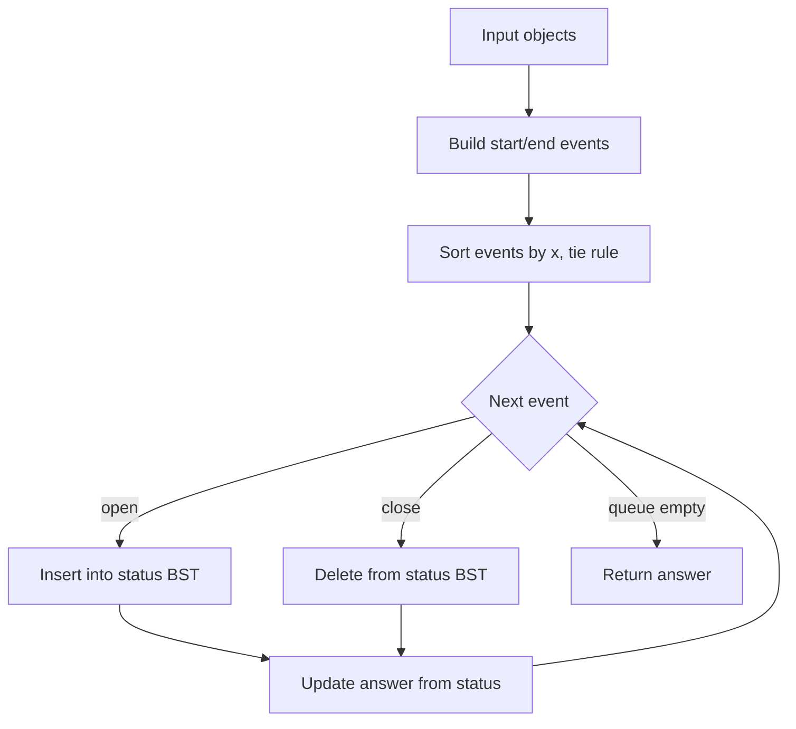

# Sweep Line (Plane Sweep) — Junior Level

> **One-line summary:** The sweep-line paradigm solves geometry problems by imagining a vertical line gliding left-to-right across the plane, pausing only at a handful of interesting x-coordinates ("events"). At each stop you update a compact **status structure** describing what the line currently touches, so a 2-D problem collapses into a sequence of cheap 1-D updates.

---

## Table of Contents

1. [Introduction](#introduction)
2. [Prerequisites](#prerequisites)
3. [Glossary](#glossary)
4. [Core Concepts](#core-concepts)
5. [Big-O Summary](#big-o-summary)
6. [Real-World Analogies](#real-world-analogies)
7. [Pros & Cons](#pros--cons)
8. [Step-by-Step Walkthrough](#step-by-step-walkthrough)
9. [Code Examples](#code-examples)
10. [Coding Patterns](#coding-patterns)
11. [Error Handling](#error-handling)
12. [Performance Tips](#performance-tips)
13. [Best Practices](#best-practices)
14. [Edge Cases & Pitfalls](#edge-cases--pitfalls)
15. [Common Mistakes](#common-mistakes)
16. [Cheat Sheet](#cheat-sheet)
17. [Visual Animation](#visual-animation)
18. [Summary](#summary)
19. [Further Reading](#further-reading)

---

## Introduction

Imagine you have hundreds of line segments, rectangles, or points scattered on a sheet of paper, and you need to answer a question like *"do any two of these segments cross?"* or *"how many intervals overlap at the same time?"*. The brute-force idea is to compare every object against every other object — that is `O(n²)` comparisons, which becomes painfully slow as `n` grows.

The **sweep-line** (also called **plane sweep**) paradigm is a smarter way to organize that work. Instead of looking at the whole plane at once, you slide an imaginary **vertical line** from far left to far right. As the line moves, the set of objects it touches changes only at a small number of special x-positions — when the line first reaches an object, when it leaves one, or when two objects swap order. We call these positions **events**.

The whole trick rests on two data structures:

- An **event queue**: all the x-coordinates where "something happens," processed in left-to-right order. Usually this is just a sorted list, or a min-heap if events are discovered on the fly.
- A **status structure**: a description of what the sweep line is currently crossing, kept in the vertical (y) order in which the line meets the objects. This is typically a balanced binary search tree so you can insert, delete, and find neighbors in `O(log n)`.

Between events, *nothing interesting changes* — so you can skip straight from one event to the next. That is why the sweep line turns an `O(n²)` "compare everything" problem into an `O(n log n)` "process each event once" problem. This single idea powers the famous **Bentley–Ottmann** segment-intersection algorithm, rectangle-area-union computations, the closest-pair-of-points problem, and many interval problems you will meet in interviews.

A useful mental anchor: **the sweep line converts a 2-D problem into a 1-D problem that evolves over time.** The horizontal axis becomes "time," and at each moment you only reason about the 1-D slice the line currently cuts.

---

## Prerequisites

Before reading this file you should be comfortable with:

- **Sorting** — you will sort events by x-coordinate. (See *07-sorting-algorithms*.)
- **Binary search trees / balanced BSTs** — the status structure. `TreeMap` (Java), `SortedList`/`bisect` (Python), an ordered structure in Go. (See *09-trees*.)
- **Priority queues / binary heaps** — when events are generated dynamically. (See *10-heaps/01-binary-heap*.)
- **Coordinate geometry basics** — points `(x, y)`, line segments, rectangles, the idea of "above/below."
- **Big-O notation** — `O(n log n)`, `O(log n)`, `O((n + k) log n)`.
- **Intervals** — a segment `[start, end]` on a line; overlap means they share at least one point.

Optional but helpful:

- A rough sense of "events vs. state" — many simulation problems share the same skeleton.
- Familiarity with the *09-trees/06-segment-tree* topic, because the harder sweep applications pair the sweep line with a segment tree.

---

## Glossary

| Term | Meaning |
|------|---------|
| **Sweep line** | An imaginary vertical (or sometimes horizontal) line that moves across the plane, processing geometry as it goes. |
| **Event** | A specific x-coordinate where the structure of the problem changes — an object starts, an object ends, or two objects swap order. |
| **Event queue** | The ordered collection of pending events, processed from smallest to largest x. A sorted array or a min-heap. |
| **Status structure** | The set of objects currently intersected by the sweep line, kept sorted by y. Usually a balanced BST. |
| **Start / open event** | The x where the sweep line first meets an object (e.g. a segment's left endpoint). |
| **End / close event** | The x where the sweep line leaves an object (e.g. a segment's right endpoint). |
| **Intersection event** | (Bentley–Ottmann only) a discovered crossing point of two segments, inserted into the queue dynamically. |
| **Active set** | The objects currently "open" — between their start and end events. |
| **Neighbor / adjacency** | In the status structure, the object immediately above or below another in y-order. Only neighbors can newly intersect. |
| **Degeneracy** | A "tie" situation: vertical segments, coincident endpoints, or several events at the same x. Handled with careful ordering. |
| **Coordinate compression** | Mapping the distinct coordinates to small integers `0, 1, 2, …` so they index an array or segment tree. |

---

## Core Concepts

### 1. Events: the only places where the answer can change

Picture the sweep line moving continuously. Most of the time, the set of objects it crosses does not change at all — it is the same segments, in the same top-to-bottom order. The picture only changes at discrete moments:

- a new object **begins** (its left edge is reached),
- an existing object **ends** (its right edge is passed),
- two crossing objects **swap order** (in Bentley–Ottmann).

These moments are the **events**. Because there are only `O(n)` start/end events (plus possibly `k` intersection events), you never need to inspect the continuous in-between — you jump event to event. Sorting the events by x and processing them in order is the backbone of every sweep.

### 2. The event queue drives time

The **event queue** holds events sorted by x-coordinate (and, on ties, by a secondary rule). For simple problems where you know all events up front — like interval overlap or rectangle area — this is just a sorted array you walk through once. For Bentley–Ottmann, new intersection events are *discovered during* the sweep, so the queue must be a structure that supports insertion: a min-heap or balanced BST.

### 3. The status structure remembers the current slice

At any moment, the sweep line cuts through a set of objects. The **status structure** stores those objects ordered by where the line meets them vertically (y-order). Why a balanced BST? Because at each event you need to:

- **insert** a newly-started object into its correct y-slot,
- **delete** an object that just ended,
- find an object's **neighbors** (the ones directly above and below).

A balanced BST gives all three in `O(log n)`. The status structure is what makes the magic work: a 2-D adjacency question ("which segments are next to each other right now?") becomes a 1-D ordered-set question.

### 4. Only neighbors matter

Here is the insight that makes Bentley–Ottmann fast: **two segments can only intersect if, at some point during the sweep, they are adjacent in the status structure.** So instead of testing all pairs, you only ever test a segment against its immediate neighbors when something changes near it. That is how `O(n²)` pair-testing drops to `O((n + k) log n)`, where `k` is the number of actual intersections.

### 5. The status structure is "the present"; the answer accumulates "the past"

A helpful way to keep the roles straight: the **status structure** is a snapshot of *right now* — exactly the objects the line touches at the current x. The **answer accumulator** (a counter, an area total, a list of intersections) summarizes everything the line has already swept *past*. As the line advances, the status mutates incrementally (one insert/delete per event) and the accumulator grows monotonically. You never look ahead and you never re-scan the past — that one-pass discipline is the whole efficiency story.

### 6. The general sweep-line template

Almost every sweep-line algorithm follows the same shape:

```text
1. Build events from the input (start/end of each object).
2. Sort events by x (break ties with a rule).
3. Initialize an empty status structure and an answer accumulator.
4. For each event in order:
     a. update the status structure (insert / delete / swap),
     b. update the answer using the current status,
     c. (advanced) discover and enqueue new events.
5. Return the accumulated answer.
```

Learn this skeleton once and you can adapt it to overlapping intervals, segment intersection, rectangle area, the skyline problem, and closest pair.

---

## Big-O Summary

| Application | Time | Space | Notes |
|-------------|------|-------|-------|
| Count overlapping intervals | **O(n log n)** | O(n) | Sort `2n` endpoints, sweep with a counter. |
| Bentley–Ottmann segment intersection | **O((n + k) log n)** | O(n + k) | `k` = number of intersection points reported. |
| Rectangle union area | **O(n log n)** | O(n) | Sweep + segment tree over y. |
| Closest pair via sweep | **O(n log n)** | O(n) | Status = points within a vertical strip. |
| Skyline problem | **O(n log n)** | O(n) | Sweep building edges, max-heap of heights. |
| One event (insert / delete / neighbor) | **O(log n)** | — | Balanced-BST operation. |
| Sorting the events | **O(n log n)** | O(n) | Dominates the simple cases. |

> `n` = number of input objects (segments, rectangles, points). `k` = number of intersections actually found. The naive all-pairs approach is `O(n²)`; the sweep wins whenever `k` is not too large.

---

## Real-World Analogies

| Concept | Analogy |
|---------|---------|
| The sweep line | A photocopier scanner bar gliding across the glass, "reading" one vertical strip at a time. |
| Events | The moments a clock chimes — between chimes nothing changes, so you only act on a chime. |
| Event queue | A to-do list sorted by time of day; you handle items in order and occasionally add a new one. |
| Status structure | The cars currently in your lane on a highway, ordered front-to-back; you only worry about the car directly ahead and behind. |
| Only-neighbors-intersect | Two runners on a track can only collide if they are side by side at some instant — never if a third runner is always between them. |
| Intersection event | Spotting that two lanes are about to merge, and adding "watch this merge point" to your to-do list. |
| Coordinate compression | Renumbering theater rows `A, C, F` as `0, 1, 2` so they fit a small seating chart. |

Where the analogies break down: a real scanner moves continuously and reads every pixel, whereas the sweep line *teleports* from event to event and ignores everything in between. That skipping is exactly the efficiency win.

---

## Pros & Cons

| Pros | Cons |
|------|------|
| Turns many `O(n²)` geometry problems into `O(n log n)` or `O((n+k) log n)`. | More moving parts than brute force (two data structures + ordering rules). |
| One reusable template covers intervals, segments, rectangles, and more. | Output-sensitive bounds (`k`) can still be slow when intersections are dense. |
| Processes each object a constant number of times. | Degeneracies (vertical segments, shared endpoints, ties) need careful handling. |
| The status structure gives `O(log n)` neighbor queries for free. | Requires a balanced BST / ordered structure, which Go lacks in its standard library. |
| Naturally event-driven, so it parallels real simulation code. | Floating-point intersection points invite precision bugs. |
| Memory stays `O(n)` for the simple variants. | The dynamic-event version (Bentley–Ottmann) is genuinely intricate to get right. |

**When to use:** detecting/counting/reporting intersections among many segments, union area or perimeter of rectangles, interval-overlap problems, closest pair, skyline, any "which objects coexist at this x?" question.

**When NOT to use:** only a handful of objects (brute force is simpler and fast enough), problems with no natural left-to-right ordering, or when intersections are so dense that `k ≈ n²` (the sweep loses its edge).

---

## Step-by-Step Walkthrough

Let's start with the simplest sweep: **counting the maximum number of overlapping intervals.** This is "sweep line in 1-D" and it builds all the intuition for the harder 2-D versions.

Suppose meetings occupy these time intervals (think of x as time):

```
A: [1, 5)
B: [2, 6)
C: [4, 7)
D: [8, 9)
```

Turn each interval into two events: a `+1` at its start and a `-1` at its end.

```
events sorted by x (on a tie, process -1 before +1 so [1,5) and [5,8) don't overlap):
  x=1  +1 (A starts)
  x=2  +1 (B starts)
  x=4  +1 (C starts)
  x=5  -1 (A ends)
  x=6  -1 (B ends)
  x=7  -1 (C ends)
  x=8  +1 (D starts)
  x=9  -1 (D ends)
```

Now sweep left-to-right, keeping a running counter `active`:

```
x=1  active = 1            (A)
x=2  active = 2            (A, B)
x=4  active = 3   <- MAX   (A, B, C)
x=5  active = 2            (B, C)
x=6  active = 1            (C)
x=7  active = 0            ()
x=8  active = 1            (D)
x=9  active = 0            ()
```

The maximum value the counter ever reached is **3**, at `x = 4` — three meetings overlap. We never compared intervals pairwise; we just walked the sorted events once, in `O(n log n)` total (dominated by the sort). The counter *is* the status structure here — the simplest possible one.

Now picture the 2-D upgrade. Replace "interval starts/ends" with "segment's left/right endpoints," replace the integer counter with a balanced BST ordered by y, and add "swap order" events when two segments cross — and you have Bentley–Ottmann. The skeleton is identical; only the status structure grows up.

---

## Code Examples

### Example: Maximum number of overlapping intervals (the canonical first sweep)

We sweep over `2n` endpoint events. Each start adds 1 to the active count; each end subtracts 1. The peak active count is the answer. Ties: process ends before starts so that `[1,5)` and `[5,8)` are *not* counted as overlapping.

#### Go

```go
package main

import (
	"fmt"
	"sort"
)

// Event is a point on the sweep line: delta is +1 (interval start) or -1 (end).
type Event struct {
	x     int
	delta int
}

// maxOverlap returns the maximum number of intervals overlapping at any point.
// Intervals are half-open [start, end).
func maxOverlap(intervals [][2]int) int {
	events := make([]Event, 0, 2*len(intervals))
	for _, iv := range intervals {
		events = append(events, Event{iv[0], +1}) // start
		events = append(events, Event{iv[1], -1}) // end
	}
	// Sort by x; on a tie, ends (-1) come before starts (+1).
	sort.Slice(events, func(i, j int) bool {
		if events[i].x != events[j].x {
			return events[i].x < events[j].x
		}
		return events[i].delta < events[j].delta
	})

	active, best := 0, 0
	for _, e := range events {
		active += e.delta
		if active > best {
			best = active
		}
	}
	return best
}

func main() {
	intervals := [][2]int{{1, 5}, {2, 6}, {4, 7}, {8, 9}}
	fmt.Println(maxOverlap(intervals)) // 3
}
```

#### Java

```java
import java.util.*;

public class MaxOverlap {
    // Each event carries an x and a delta: +1 for a start, -1 for an end.
    static int maxOverlap(int[][] intervals) {
        int[][] events = new int[intervals.length * 2][2];
        int idx = 0;
        for (int[] iv : intervals) {
            events[idx++] = new int[]{iv[0], +1}; // start
            events[idx++] = new int[]{iv[1], -1}; // end
        }
        // Sort by x; on a tie, ends (-1) before starts (+1).
        Arrays.sort(events, (a, b) ->
                a[0] != b[0] ? Integer.compare(a[0], b[0]) : Integer.compare(a[1], b[1]));

        int active = 0, best = 0;
        for (int[] e : events) {
            active += e[1];
            best = Math.max(best, active);
        }
        return best;
    }

    public static void main(String[] args) {
        int[][] intervals = {{1, 5}, {2, 6}, {4, 7}, {8, 9}};
        System.out.println(maxOverlap(intervals)); // 3
    }
}
```

#### Python

```python
def max_overlap(intervals):
    """Maximum number of half-open intervals [start, end) overlapping at once."""
    events = []
    for start, end in intervals:
        events.append((start, +1))  # start
        events.append((end, -1))    # end
    # Sort by x; on a tie, ends (-1) come before starts (+1) because -1 < +1.
    events.sort()

    active = best = 0
    for _x, delta in events:
        active += delta
        best = max(best, active)
    return best


if __name__ == "__main__":
    intervals = [(1, 5), (2, 6), (4, 7), (8, 9)]
    print(max_overlap(intervals))  # 3
```

**What it does:** sweeps `2n` endpoint events left-to-right, keeping a running count of open intervals, and returns the peak.
**Run:** `go run main.go` | `javac MaxOverlap.java && java MaxOverlap` | `python max_overlap.py`

---

## Coding Patterns

### Pattern 1: Endpoints → events → sort → sweep

**Intent:** the universal recipe. Convert each object into start/end events, sort, then walk once while maintaining a status.

```python
events = []
for obj in objects:
    events.append((obj.start_x, 'open', obj))
    events.append((obj.end_x, 'close', obj))
events.sort(key=lambda e: (e[0], TIE_RULE[e[1]]))   # x first, then tie rule
status = empty_status()
answer = init_answer()
for x, kind, obj in events:
    if kind == 'open':
        status.insert(obj)
    else:
        status.remove(obj)
    answer = update(answer, status, x)
```

This is the shape every later level refines. Memorize it.

### Pattern 2: The tie-breaking rule

**Intent:** decide what happens when two events share an x. The rule depends on the problem.

```text
Overlap counting, half-open [a,b): process END (-1) before START (+1).
Closed intervals [a,b]: process START before END (so touching counts as overlap).
Rectangle area: process all opens at this x, recompute, then process closes.
```

Getting the tie rule right is the single most common source of off-by-one sweep bugs.

### Pattern 3: Status as a balanced BST keyed on y

**Intent:** for true 2-D sweeps, store active objects in a structure ordered by their current y so neighbors are `O(log n)` to find.

```text
TreeMap (Java) / SortedList (Python) / a balanced BST or Fenwick (Go).
insert(obj)      -> O(log n)
remove(obj)      -> O(log n)
above(obj)/below -> O(log n)   # only neighbors can newly intersect
```



---

## Error Handling

| Error | Cause | Fix |
|-------|-------|-----|
| Touching intervals counted as overlapping (or not) | Wrong tie rule for open vs closed intervals. | Decide half-open vs closed up front; order ties accordingly. |
| Off-by-one in the active counter | Start and end processed in the wrong order at equal x. | Sort `(x, delta)` so the correct delta wins ties. |
| Missing an intersection | Only testing all pairs once, not on every neighbor change. | Test a segment against its new neighbors after every insert/delete/swap. |
| Crash on vertical segment | A vertical segment has the same x for both endpoints. | Give vertical segments a special event ordering, or handle them separately. |
| Wrong area for rectangles | Forgetting that "covered length" must come from the status, not a raw count. | Track covered y-length, multiply by the x-gap to the next event. |
| Float comparison failures | Comparing intersection coordinates with `==`. | Use an epsilon tolerance, or keep coordinates exact/integer when possible. |

---

## Performance Tips

- **Sort once.** The dominant cost of the simple sweeps is the initial `O(n log n)` sort; everything after is `O(log n)` per event.
- **Use the right status structure.** A balanced BST (`TreeMap`, `SortedList`) gives `O(log n)` insert/delete/neighbor; a plain list gives `O(n)` and ruins the bound.
- **Compress coordinates** when you only care about relative order (rectangle area, segment-tree sweeps) — it shrinks the y-axis to `O(n)` slots.
- **Avoid floating point** where you can: keep endpoints integer, and use cross-product orientation tests instead of computing slopes.
- **Pre-size arrays** for the `2n` events; you know the count in advance.
- **Stop early** if the problem only needs "is there any intersection?" — quit on the first one found.

---

## Best Practices

- Write the brute-force `O(n²)` version first and use it as a test oracle on small random inputs.
- Pick half-open intervals `[a, b)` by default — they make the tie rules cleanest.
- Separate the three responsibilities clearly: event generation, the event loop, the status structure.
- Decide your tie-breaking rule explicitly and write it in a comment; it is the part future-you will forget.
- For 2-D sweeps, keep the status comparator (the y-order) in one place and test it in isolation.
- Validate that every object that is inserted is eventually deleted (no leaks in the active set).

---

## Edge Cases & Pitfalls

- **Empty input** — return the identity answer (0 overlaps, 0 area).
- **A single object** — overlap 1, area = its own area; make sure the loop handles one event pair.
- **Coincident endpoints** — many intervals sharing a boundary; the tie rule decides correctness.
- **Vertical segments** (same x for both endpoints) — the y-order is ambiguous; special-case them.
- **Duplicate objects** — identical segments/rectangles; ensure the status structure tolerates equal keys.
- **Zero-length or zero-area objects** — decide whether a degenerate point counts.
- **Very large coordinates** — risk of overflow when multiplying x-gap by covered length; use 64-bit.

---

## Common Mistakes

1. **Wrong tie-breaking at equal x** — the classic bug; touching intervals get mis-counted.
2. **Using a plain array as the status** — `O(n)` neighbor search destroys the `O(n log n)` goal.
3. **Testing only original pairs in Bentley–Ottmann** — you must re-test neighbors after every swap, and enqueue discovered crossings.
4. **Forgetting to delete ended objects** — the active set grows forever and answers drift.
5. **Comparing floats with `==`** — intersection coordinates rarely match exactly; use epsilon or exact arithmetic.
6. **Recomputing the whole status every event** — defeats the purpose; only apply the incremental change.
7. **Ignoring vertical segments / ties as "rare"** — graders and real data are full of them.

---

## Cheat Sheet

| Step | What to do |
|------|------------|
| Build events | Each object → `(x_start, OPEN)` and `(x_end, CLOSE)`. |
| Sort | By x; break ties with a problem-specific rule. |
| Init | Empty status structure + answer accumulator. |
| Open event | Insert object into the status; check new neighbors. |
| Close event | Remove object; the two ex-neighbors become adjacent — check them. |
| Update | Read the answer off the current status (count, covered length, …). |
| Done | Queue empty ⇒ return the accumulator. |

Complexity:

```
simple sweeps (overlap, area, skyline) : O(n log n)
Bentley-Ottmann segment intersection   : O((n + k) log n)
naive all-pairs (the baseline you beat) : O(n^2)
```

Mental anchor: **a 2-D problem becomes a 1-D problem evolving over time.**

---

## Visual Animation

> See [`animation.html`](./animation.html) for an interactive visual animation of the sweep-line paradigm.
>
> The animation demonstrates:
> - A vertical line sweeping left-to-right across segments and rectangles
> - The event queue (sorted x-coordinates) emptying as the line advances
> - The status structure inserting, deleting, and reordering objects at each event
> - Intersections being detected as neighbors meet
> - Step / Run / Reset controls, an info panel, a Big-O table, and an operation log

---

## Summary

The sweep-line paradigm is one of the most reusable ideas in computational geometry: glide a vertical line across the plane, stop only at **events** (where objects start, end, or swap), and maintain a **status structure** describing the current vertical slice. Because the picture changes only at `O(n)` discrete events, and each update on a balanced BST is `O(log n)`, many problems that look like `O(n²)` pairwise comparisons collapse to `O(n log n)`. Master three things and the paradigm is yours: **events** (and how to order ties), the **event queue** that drives time, and the **status structure** that makes neighbor queries cheap. Start from the one-counter interval-overlap sweep, then grow the status into a balanced BST and you arrive at Bentley–Ottmann.

---

## Further Reading

- de Berg, Cheong, van Kreveld, Overmars — *Computational Geometry: Algorithms and Applications*, Chapter 2 ("Line Segment Intersection") — the canonical sweep-line treatment.
- *Introduction to Algorithms* (CLRS), Section 33.2 — "Determining whether any pair of segments intersects."
- Bentley, J. L. & Ottmann, T. A. (1979). *Algorithms for reporting and counting geometric intersections.* IEEE Transactions on Computers.
- cp-algorithms.com — "Search for a pair of intersecting segments" and "Length of the union of segments."
- Java `TreeMap`/`TreeSet`, Python `sortedcontainers.SortedList` / `bisect`, Go ordered-tree libraries.
- Sibling topics: *02-line-intersection* (the pairwise primitive), *07-closest-pair-of-points* (a sweep application), *09-trees/06-segment-tree* (the partner structure for area/union sweeps).

Next step: continue to [`middle.md`](./middle.md) for Bentley–Ottmann, rectangle-union area, and the general sweep-line template.
