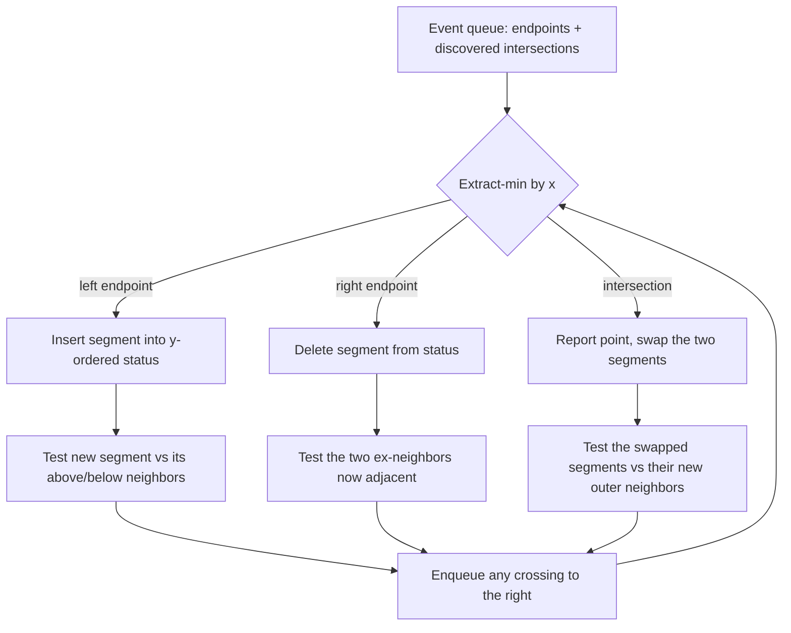

# Sweep Line (Plane Sweep) — Middle Level

> **Focus:** Why the sweep line is correct and fast, the canonical Bentley–Ottmann segment-intersection algorithm in full, rectangle-union area with a segment tree on y, and the *general template* you can bend to skyline, closest pair, and interval problems. When to reach for a sweep versus brute force, an interval tree, or a segment tree.

---

## Table of Contents

1. [Introduction](#introduction)
2. [Deeper Concepts](#deeper-concepts)
3. [Comparison with Alternatives](#comparison-with-alternatives)
4. [Advanced Patterns](#advanced-patterns)
5. [Bentley–Ottmann in Full](#bentleyottmann-in-full)
6. [Rectangle Union Area with a Segment Tree](#rectangle-union-area-with-a-segment-tree)
7. [Code Examples](#code-examples)
8. [Error Handling](#error-handling)
9. [Performance Analysis](#performance-analysis)
10. [Best Practices](#best-practices)
11. [Visual Animation](#visual-animation)
12. [Summary](#summary)

---

## Introduction

At junior level the sweep line is "make events, sort, walk, keep a counter." At middle level you start asking the *engineering* questions:

- *Why* is it sound to test a segment only against its neighbors in the status structure — how do we know we never miss an intersection?
- When is the dynamic-event Bentley–Ottmann worth the complexity versus the simpler `O(n log n)` "any-intersection?" sweep or even brute force?
- How do you pair a sweep with a **segment tree on the y-axis** to compute the union area of rectangles?
- What is the *one template* that unifies interval overlap, segment intersection, rectangle area, skyline, and closest pair?
- How do you order ties (vertical segments, shared endpoints, simultaneous events) so the algorithm stays correct?

These distinctions decide whether your CAD overlay finishes in milliseconds or hangs on a dense drawing.

---

## Deeper Concepts

### The sweep-line invariant

Every correct sweep maintains an invariant of this shape:

> **At every position `x` of the sweep line, the status structure contains exactly the objects intersected by the line at `x`, in their correct vertical order, and the answer accumulator is correct for everything strictly left of `x`.**

When the invariant holds before an event and your event handler restores it after, induction over the sorted events proves the whole algorithm correct. For interval overlap the status is just a counter; for Bentley–Ottmann it is a y-ordered BST of segments.

### Why only neighbors can intersect (the adjacency lemma)

The heart of Bentley–Ottmann is a lemma:

> **If two segments `s` and `t` intersect at a point `p`, then there is a position of the sweep line, at some x just left of `p`, where `s` and `t` are adjacent in the y-ordered status structure.**

Sketch: just before two segments cross, the line passes through an x where they are next to each other in y-order (no third segment can be squeezed strictly between them *at that x* without itself crossing one of them first, which would be an earlier event). Therefore, if you test adjacency every time the status order changes — at every insert, delete, and swap — you are guaranteed to test `(s, t)` before they cross. This is what lets you replace `O(n²)` pair tests with `O(n + k)` neighbor tests. The full proof is in `professional.md`; the takeaway here is *which* tests to perform and *when*.

### The three event types in Bentley–Ottmann

| Event | When | Status update | New tests |
|-------|------|---------------|-----------|
| **Left endpoint** (insert) | line reaches a segment's left end | insert segment into y-order | test it against the segment just above and just below |
| **Right endpoint** (delete) | line passes a segment's right end | remove segment | its former neighbors become adjacent — test that new pair |
| **Intersection** (swap) | line reaches a discovered crossing | swap the two crossing segments' order | each now has a new outer neighbor — test those two pairs |

Intersection events are *discovered dynamically*: when a neighbor test finds a crossing to the right of the current x, you enqueue it. That is why the event queue must support insertion (heap or BST), not just a one-time sort.

### Pairing the sweep with a segment tree

Some sweeps need more than "which objects are active" — they need an *aggregate over the y-axis*, like "how much total y-length is currently covered by at least one rectangle?" A plain BST cannot answer that quickly. A **segment tree over compressed y-coordinates** can: each rectangle contributes `+1` on its y-span when it opens and `-1` when it closes, and the tree maintains "total length covered by `≥ 1`" in `O(log n)` per update. The sweep then multiplies that covered length by the horizontal gap to the next event to accumulate area. This sweep-plus-segment-tree pairing is the workhorse of rectangle union area and perimeter (Klee's measure problem in 2-D).

### Output-sensitive complexity

Bentley–Ottmann runs in `O((n + k) log n)` where `k` is the number of intersections *reported*. This is **output-sensitive**: cheap when intersections are sparse, but if `k = Θ(n²)` (every pair crosses), it degrades to `O(n² log n)` — worse than the naive `O(n²)`! Knowing this guides the choice: use Bentley–Ottmann when you expect few intersections; use a simpler method when you only need a yes/no answer or when intersections are dense.

### The moving comparator — what "y-order" really means

A subtle point that trips up first implementations: the order of two segments in the status is *not* fixed — it depends on the current sweep x. Two segments `s` and `t` may have `s` below `t` early in the sweep and `t` below `s` later, after they cross. So the status comparator is "compare `y_s(x)` with `y_t(x)` at the *current* sweep position x." Concretely:

```text
compare(s, t) at sweep position x:
    return  y_of(s, x)  vs  y_of(t, x)        # y where each segment meets X = x
```

This is why an intersection event must *swap* the two segments in the status: at the crossing, their relative order flips, and the BST must reflect the new order so that future neighbor queries are correct. Implementations that store a *static* slope-based order silently break the moment two segments cross. The comparator's x-dependence is the single most important detail separating a working Bentley–Ottmann from a broken one.

### Why duplicates must be deduped

Because a crossing can be discovered from two sides (when `s` becomes adjacent to `t`, and again when `t` becomes adjacent to `s` via a different event), the same intersection point may be enqueued more than once. Two guards keep the output clean: only enqueue a crossing whose x is strictly to the right of the current event, and keep a set of already-discovered points so each is reported exactly once. Skipping this produces duplicate intersections or, worse, an event queue that never drains.

---

## Comparison with Alternatives

| Approach | Time | Space | Use when |
|----------|------|-------|----------|
| **Brute force all-pairs** | `O(n²)` | `O(1)` | `n` small (≤ a few hundred); simplest to write/verify. |
| **Sweep: any-intersection?** | `O(n log n)` | `O(n)` | You only need yes/no, or the first intersection. |
| **Bentley–Ottmann (report all)** | `O((n + k) log n)` | `O(n + k)` | You must report/count all `k` crossings and `k` is not huge. |
| **Sweep + segment tree (area/union)** | `O(n log n)` | `O(n)` | Union area/perimeter of rectangles; coverage aggregates. |
| **Interval tree** | `O(n log n)` build, `O(log n + m)` query | `O(n)` | Repeated stabbing queries on a *static* interval set. |
| **Plane sweep for closest pair** | `O(n log n)` | `O(n)` | Nearest pair of `n` points. |
| **Uniform grid / bucketing** | `O(n)` expected | `O(n)` | Points roughly uniform; intersection tests local. |

**Choose a sweep when:** the problem has a natural left-to-right order and the relevant interactions are *local* in the perpendicular axis (only neighbors matter). It is the default for segment intersection and rectangle union.

**Choose brute force when:** `n` is small enough that `n²` is fine — and as your correctness oracle even when you ship the sweep.

**Choose an interval tree when:** the set is static and you answer many "what overlaps this query interval?" queries, rather than one global sweep.

**Choose a segment tree partner when:** you need a y-axis *aggregate* (covered length, count, max) and not just neighbor adjacency.

---

## Advanced Patterns

### Pattern: Any-intersection detection (simplest 2-D sweep)

If you only need to know whether *any* two of `n` segments cross, you do not need dynamic intersection events. Sweep the `2n` endpoints; on insert, test against both neighbors; on delete, test the two segments that become adjacent. The first crossing found is the answer. `O(n log n)`.

### Pattern: Counting vs reporting

Reporting all intersections is `O((n+k) log n)`. *Counting* them without listing can sometimes be done faster with a different technique (e.g., counting inversions among segment orderings), but Bentley–Ottmann's report-then-count is the standard general method.

### Pattern: Coordinate compression for segment-tree sweeps

Real coordinates are huge or fractional. Collect all distinct y-values, sort, and map them to `0, 1, 2, …`. The segment tree then has `O(n)` leaves (the *gaps* between consecutive compressed y-values), and each rectangle's y-span becomes a contiguous range of leaves.

### Pattern: The skyline problem

Buildings as `(left, right, height)`. Create events at each left edge (`+height`) and right edge (`-height`). Sweep x; keep a multiset (or max-heap with lazy deletion) of active heights. The current skyline height is the max active height; emit a key point whenever that max changes. `O(n log n)`.

### Pattern: Closest pair by sweep

Sort points by x. Sweep, keeping in a y-ordered set the points within the current best distance `d` of the sweep line (drop points whose x is more than `d` behind). For each new point, only check the `O(1)` points within a `2d × d` window in y. Updating `d` shrinks the window. `O(n log n)`.

### Pattern: Half-open intervals to avoid tie pain

Model spans as `[a, b)`. Then "ends before starts" at equal x is the single tie rule that makes touching objects not overlap, and it generalizes cleanly to rectangle area where a rectangle covers `[y1, y2)`.

### Pattern: Rectangle union perimeter (a small twist on area)

Perimeter reuses the area sweep but augments the coverage segment tree to also track the **number of disjoint covered y-runs** at each node (merging adjacent runs at split boundaries). Each event contributes two parts: a *vertical* edge length equal to the change in covered y-length `|covered_after − covered_before|`, and a *horizontal* edge length equal to `2 × (number of covered runs) × Δx` for the slab to the left. Summing both over all events gives the union perimeter in `O(n log n)` — the same machinery as area with one extra field per node.

### Pattern: Counting points in query rectangles (offline sweep + Fenwick)

When you must answer many "how many points lie in this rectangle?" queries offline, sweep x and keep a Fenwick tree (BIT) keyed on compressed y holding the points seen so far. A rectangle `[x1,x2)×[y1,y2)` is answered as two events: at `x1` subtract a y-range count, at `x2` add it, so the net is "points with `x1 ≤ px < x2` and `y1 ≤ py < y2`." This turns a 2-D counting problem into a 1-D sweep with `O(log n)` range queries — a recurring competitive-programming and analytics pattern.

---

## Bentley–Ottmann in Full

The algorithm reports all `k` intersection points among `n` segments.

```text
EventQueue Q : ordered by (x, then y) — supports insert and extract-min.
Status T     : segments crossing the sweep line, ordered by current y.

initialize Q with all 2n endpoints (left = insert-event, right = delete-event)
while Q not empty:
    p = extract-min(Q)                  # the next event point, smallest x
    handle event at p:
      LEFT endpoint of s:
          insert s into T at its y-position
          a = above(s), b = below(s)
          if a×s intersect to the right of p: enqueue that point
          if s×b intersect to the right of p: enqueue that point
      RIGHT endpoint of s:
          a = above(s), b = below(s)
          remove s from T
          if a×b intersect to the right of p: enqueue that point   # newly adjacent
      INTERSECTION of s and t (s above t before p):
          report p
          swap order of s and t in T                                # now t above s
          a = above(t), b = below(s)
          if a×t intersect to the right of p: enqueue
          if s×b intersect to the right of p: enqueue
```

Two subtleties:

- **Enqueue only intersections strictly to the right of the current x** (and dedupe), or the queue can loop or double-report.
- **The status comparator is x-dependent**: two segments' relative y-order is "their y-value *at the current sweep x*." Implementations evaluate this at insert time and rely on swaps at intersection events to keep the order valid.



---

## Rectangle Union Area with a Segment Tree

Given `n` axis-aligned rectangles, compute the area of their union (overlaps counted once). Sweep a **vertical** line left-to-right. Each rectangle `(x1, y1, x2, y2)` becomes two events: at `x1` a `+1` over the y-span `[y1, y2)`, at `x2` a `-1` over the same span.

Maintain a segment tree over **compressed y-coordinates** that answers *"total y-length currently covered by at least one rectangle"*. Between consecutive events at `x_prev` and `x_cur`, the covered y-length is constant, so the area contributed is `covered_length × (x_cur - x_prev)`. Sum these slabs.

```text
events = for each rect: (x1, +1, y1, y2), (x2, -1, y1, y2)
sort events by x
compress all y-values; build a "coverage" segment tree over y-gaps
area = 0; prev_x = events[0].x
for each event e in order:
    area += covered_length(tree) * (e.x - prev_x)   # slab to the left of e
    prev_x = e.x
    tree.update(e.y1, e.y2, e.delta)                # apply +1 / -1 on the span
return area
```

The segment tree node stores `count` (how many rectangles cover this node's span) and `covered` (length of this span covered by `≥1` rectangle). The classic trick: you never push `count` down; instead each node computes its `covered` from its own `count` (if `> 0`, the whole span is covered) or, if `count == 0`, from its children's `covered`. This makes range `+1/-1` updates with a global "covered length" query run in `O(log n)` without lazy propagation.

---

## Code Examples

### Rectangle union area (sweep + coverage segment tree)

#### Go

```go
package main

import (
	"fmt"
	"sort"
)

type event struct {
	x          int
	y1, y2     int
	delta      int // +1 open, -1 close
}

// Coverage segment tree over compressed y-gaps.
// ys = sorted distinct y-coordinates; leaf i covers [ys[i], ys[i+1]).
type segTree struct {
	ys      []int
	count   []int // how many rects cover this node's span
	covered []int // length covered by >=1 rect in this node's span
}

func newSegTree(ys []int) *segTree {
	m := 4 * len(ys)
	return &segTree{ys: ys, count: make([]int, m), covered: make([]int, m)}
}

// update adds delta over [lo, hi) of y-values, node covers gaps [l, r).
func (t *segTree) update(node, l, r, lo, hi, delta int) {
	if hi <= t.ys[l] || t.ys[r] <= lo {
		return // no overlap
	}
	if lo <= t.ys[l] && t.ys[r] <= hi {
		t.count[node] += delta
	} else {
		mid := (l + r) / 2
		t.update(2*node, l, mid, lo, hi, delta)
		t.update(2*node+1, mid, r, lo, hi, delta)
	}
	if t.count[node] > 0 {
		t.covered[node] = t.ys[r] - t.ys[l] // whole span covered
	} else if r-l == 1 {
		t.covered[node] = 0 // a single gap with no cover
	} else {
		t.covered[node] = t.covered[2*node] + t.covered[2*node+1]
	}
}

func rectangleUnionArea(rects [][4]int) int {
	events := make([]event, 0, 2*len(rects))
	ySet := map[int]bool{}
	for _, r := range rects { // r = x1,y1,x2,y2
		events = append(events, event{r[0], r[1], r[3], +1})
		events = append(events, event{r[2], r[1], r[3], -1})
		ySet[r[1]] = true
		ySet[r[3]] = true
	}
	ys := make([]int, 0, len(ySet))
	for y := range ySet {
		ys = append(ys, y)
	}
	sort.Ints(ys)
	sort.Slice(events, func(i, j int) bool { return events[i].x < events[j].x })

	tree := newSegTree(ys)
	area, prevX := 0, events[0].x
	for _, e := range events {
		area += tree.covered[1] * (e.x - prevX) // slab left of this event
		prevX = e.x
		tree.update(1, 0, len(ys)-1, e.y1, e.y2, e.delta)
	}
	return area
}

func main() {
	rects := [][4]int{{0, 0, 2, 2}, {1, 1, 3, 3}}
	fmt.Println(rectangleUnionArea(rects)) // 7
}
```

#### Java

```java
import java.util.*;

public class RectangleUnion {
    static int[] ys;
    static int[] count, covered;

    static void update(int node, int l, int r, int lo, int hi, int delta) {
        if (hi <= ys[l] || ys[r] <= lo) return;
        if (lo <= ys[l] && ys[r] <= hi) {
            count[node] += delta;
        } else {
            int mid = (l + r) / 2;
            update(2 * node, l, mid, lo, hi, delta);
            update(2 * node + 1, mid, r, lo, hi, delta);
        }
        if (count[node] > 0) covered[node] = ys[r] - ys[l];
        else if (r - l == 1) covered[node] = 0;
        else covered[node] = covered[2 * node] + covered[2 * node + 1];
    }

    // event = {x, y1, y2, delta}
    static long rectangleUnionArea(int[][] rects) {
        int[][] events = new int[rects.length * 2][4];
        TreeSet<Integer> ySet = new TreeSet<>();
        int idx = 0;
        for (int[] r : rects) { // x1,y1,x2,y2
            events[idx++] = new int[]{r[0], r[1], r[3], +1};
            events[idx++] = new int[]{r[2], r[1], r[3], -1};
            ySet.add(r[1]); ySet.add(r[3]);
        }
        ys = ySet.stream().mapToInt(Integer::intValue).toArray();
        count = new int[4 * ys.length];
        covered = new int[4 * ys.length];
        Arrays.sort(events, (a, b) -> Integer.compare(a[0], b[0]));

        long area = 0;
        int prevX = events[0][0];
        for (int[] e : events) {
            area += (long) covered[1] * (e[0] - prevX);
            prevX = e[0];
            update(1, 0, ys.length - 1, e[1], e[2], e[3]);
        }
        return area;
    }

    public static void main(String[] args) {
        int[][] rects = {{0, 0, 2, 2}, {1, 1, 3, 3}};
        System.out.println(rectangleUnionArea(rects)); // 7
    }
}
```

#### Python

```python
import bisect


class CoverageTree:
    """Segment tree over compressed y-gaps tracking length covered by >=1 rect."""

    def __init__(self, ys):
        self.ys = ys
        m = 4 * len(ys)
        self.count = [0] * m
        self.covered = [0] * m

    def update(self, node, l, r, lo, hi, delta):
        ys = self.ys
        if hi <= ys[l] or ys[r] <= lo:
            return
        if lo <= ys[l] and ys[r] <= hi:
            self.count[node] += delta
        else:
            mid = (l + r) // 2
            self.update(2 * node, l, mid, lo, hi, delta)
            self.update(2 * node + 1, mid, r, lo, hi, delta)
        if self.count[node] > 0:
            self.covered[node] = ys[r] - ys[l]
        elif r - l == 1:
            self.covered[node] = 0
        else:
            self.covered[node] = self.covered[2 * node] + self.covered[2 * node + 1]


def rectangle_union_area(rects):
    events = []
    ys = set()
    for x1, y1, x2, y2 in rects:
        events.append((x1, y1, y2, +1))
        events.append((x2, y1, y2, -1))
        ys.add(y1)
        ys.add(y2)
    ys = sorted(ys)
    events.sort(key=lambda e: e[0])

    tree = CoverageTree(ys)
    area = 0
    prev_x = events[0][0]
    for x, y1, y2, delta in events:
        area += tree.covered[1] * (x - prev_x)  # slab left of this event
        prev_x = x
        tree.update(1, 0, len(ys) - 1, y1, y2, delta)
    return area


if __name__ == "__main__":
    rects = [(0, 0, 2, 2), (1, 1, 3, 3)]
    print(rectangle_union_area(rects))  # 7
```

**What it does:** computes the union area of two overlapping `2×2` squares = `4 + 4 - 1 = 7`.
**Run:** `go run main.go` | `javac RectangleUnion.java && java RectangleUnion` | `python rect_union.py`

---

## Error Handling

| Scenario | What goes wrong | Correct approach |
|----------|-----------------|------------------|
| Double-reported intersections | Same crossing enqueued from both neighbor tests. | Dedupe by point, or only enqueue if strictly right of current x and not already queued. |
| Status order corrupted | Comparator uses slope, not y-at-current-x. | Compare segments by their y-value at the sweep x; swap at intersection events. |
| Segment tree wrong area | Pushing `count` down to children. | Never push down; recompute `covered` from `count>0` or children. |
| Vertical segment breaks y-order | Both endpoints share x. | Order vertical-segment events specially, or handle them in a separate pass. |
| Overflow on area | `covered_length × x_gap` exceeds 32-bit. | Use 64-bit accumulators. |
| Float intersection drift | `==` comparisons on computed crossings. | Use epsilon, or exact/rational arithmetic for the comparator. |

---

## Choosing the Status Structure

The single most important design decision in a sweep is *which* status structure to use. It is dictated by the question the sweep must answer at each event:

| Question the sweep answers | Status structure | Why |
|----------------------------|------------------|-----|
| "How many objects are active?" | integer counter | Only a count changes; no order needed. |
| "Which objects are adjacent in y?" | balanced BST | Neighbor queries in `O(log n)` (Bentley–Ottmann). |
| "How much y-length is covered?" | coverage segment tree | Range `±1` + aggregate in `O(log n)`. |
| "How many points below this y?" | Fenwick tree (BIT) | Prefix-sum counting in `O(log n)`. |
| "What is the max active height?" | max-heap / multiset | Skyline; track changing maximum. |
| "Closest point within a y-window?" | y-ordered set | Closest pair; bounded window scan. |

If you pick a structure that cannot answer the question in `O(log n)`, the whole sweep degrades. The classic mistake is using a plain array (giving `O(n)` neighbor search) where a BST is required, turning the intended `O(n log n)` into `O(n²)`. Match the structure to the aggregate the answer needs — counter for counts, BST for adjacency, segment tree for coverage, BIT for prefix counts.

---

## Performance Analysis

| Operation | Cost | Notes |
|-----------|------|-------|
| Build + sort events | `O(n log n)` | Dominates the simple sweeps. |
| Event-queue insert/extract (heap/BST) | `O(log(n + k))` | Bentley–Ottmann's dynamic events. |
| Status insert/delete/neighbor (balanced BST) | `O(log n)` | Per event. |
| Segment-tree range update + global query | `O(log n)` | Coverage tree per event. |
| Bentley–Ottmann total | `O((n + k) log n)` | Output-sensitive; `k` = reported crossings. |
| Rectangle union area total | `O(n log n)` | `n` events × `O(log n)` tree updates. |
| Brute-force baseline | `O(n²)` | Beat this whenever `k` is small. |

```python
# Quick empirical sketch: sweep overlap vs brute force on random intervals.
import random, timeit

def brute(intervals):
    best = 0
    for x, _ in [(iv[0], 0) for iv in intervals]:
        c = sum(1 for a, b in intervals if a <= x < b)
        best = max(best, c)
    return best

def sweep(intervals):
    ev = []
    for a, b in intervals:
        ev.append((a, 1)); ev.append((b, -1))
    ev.sort()
    cur = best = 0
    for _, d in ev:
        cur += d; best = max(best, cur)
    return best

data = [(random.randint(0, 10**6), 0) for _ in range(2000)]
data = [(a, a + random.randint(1, 1000)) for a, _ in data]
print("sweep:", timeit.timeit(lambda: sweep(data), number=50))
print("brute:", timeit.timeit(lambda: brute(data), number=5))
```

---

## Best Practices

- **Default to half-open intervals/spans** so the tie rule is "ends before starts."
- **Keep the status comparator in one place** and unit-test it (segment-below-segment at a given x).
- **Compress coordinates** before building a segment tree; never index it by raw coordinates.
- **Use a yes/no sweep** when you only need "any intersection?" — skip dynamic events entirely.
- **Guard against dense intersections** — if `k` could be `Θ(n²)`, reconsider Bentley–Ottmann.
- **Test against brute force** on random small inputs; geometry bugs hide in degeneracies.
- **Prefer integer arithmetic and cross products** over floating-point slopes for orientation tests.

---

## Visual Animation

> See [`animation.html`](./animation.html) for an interactive view.
>
> Middle-level relevant features:
> - Watch the event queue shrink as endpoints are consumed and intersection events are inserted.
> - The status structure shows segments in y-order, with neighbors highlighted as they are tested.
> - Intersection events flash when a crossing is detected and the two segments swap order.

---

## Summary

The sweep line is correct because of a single invariant — the status structure always equals the current vertical slice — and fast because of the adjacency lemma: two segments can only cross when they are neighbors, so `O(n²)` pair tests shrink to `O(n + k)` neighbor tests. Bentley–Ottmann turns this into `O((n + k) log n)` by maintaining a y-ordered BST and a dynamic event queue, discovering intersection events as it goes. Pair the sweep with a **segment tree on compressed y** and you get rectangle union area in `O(n log n)`. The same template — *events → sort → sweep maintaining a status* — covers skyline, closest pair, and every interval-overlap problem. Knowing when the sweep loses — dense intersections (`k ≈ n²`), tiny `n`, or static repeated queries (interval tree) — is what separates middle-level from junior understanding.

Next step: continue to [`senior.md`](./senior.md) for sweep lines in large CAD/GIS/VLSI systems, robustness against degeneracies, and I/O scaling.
