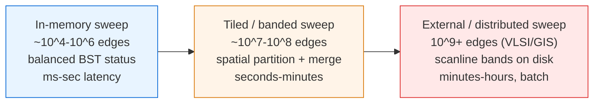

# Sweep Line (Plane Sweep) — Senior Level

> A textbook sweep reports segment intersections on a few thousand objects in memory in milliseconds. A VLSI design-rule check runs over **billions** of polygon edges that do not fit in RAM; a GIS map-overlay joins two continental layers with millions of features and demands *exact*, reproducible results despite coincident vertices and floating-point noise. At that scale the algorithm is not the product — the robustness against degeneracies, the exact-arithmetic predicates, the external-memory I/O strategy, and the partition-and-merge parallelism are.

## Table of Contents

1. [Introduction](#1-introduction)
2. [System Design — Where Sweeps Live](#2-system-design--where-sweeps-live)
3. [Robustness and Degeneracies](#3-robustness-and-degeneracies)
4. [Exact Predicates and Numerical Strategy](#4-exact-predicates-and-numerical-strategy)
5. [VLSI Design-Rule Checking at Scale](#5-vlsi-design-rule-checking-at-scale)
6. [GIS Map Overlay](#6-gis-map-overlay)
7. [External-Memory and Streaming Sweeps](#7-external-memory-and-streaming-sweeps)
8. [Parallel and Distributed Sweeps](#8-parallel-and-distributed-sweeps)
9. [Comparison at Scale](#9-comparison-at-scale)
10. [Architecture Patterns](#10-architecture-patterns)
11. [Observability](#11-observability)
12. [Failure Modes](#12-failure-modes)
13. [Capacity Planning](#13-capacity-planning)
14. [Summary](#14-summary)

---

## 1. Introduction

At senior level the question shifts from "how does the sweep work" to "where does plane-sweep computation sit in my system, and what breaks when it does at scale?" Plain Bentley–Ottmann has three properties that drive every architectural decision:

- **It is output-sensitive.** `O((n + k) log n)` is a gift when intersections are sparse and a trap when they are dense: a pathological layout with `k = Θ(n²)` crossings makes the sweep *slower* than brute force. Real CAD and GIS data have wildly varying intersection density across regions.
- **It is exactness-critical.** A single mis-ordered comparison in the status structure — from a floating-point rounding error at a near-coincident point — can corrupt the y-order, drop an intersection, or crash. Geometry is the domain where "it works on my test data" hides catastrophic robustness bugs.
- **It is memory-and-order bound at scale.** The status structure and event queue are random-access; on billion-edge VLSI layouts the working set exceeds RAM, and the sweep becomes an external-memory and I/O-ordering problem, not a comparison-count problem.

The senior toolkit responds to each: **degeneracy handling** (symbolic perturbation, careful tie ordering) for correctness; **exact predicates** (integer/rational arithmetic, adaptive precision) for robustness; **spatial partitioning** (strips, tiles, scanline bands) for graphs that exceed one machine; and **streaming/external sweeps** for data that does not fit in RAM.

This document covers the questions a senior owns:

1. How do you make a sweep *provably correct* on degenerate, real-world input (coincident points, vertical segments, overlapping collinear segments)?
2. How do you choose a numerical strategy — floats with epsilon, exact integers, or adaptive-precision predicates — and what does each cost?
3. How do you run a sweep over data that does not fit in memory (VLSI DRC, continental GIS)?
4. How do you partition and parallelize a sweep without double-counting on partition boundaries?
5. How do you observe, alarm, and capacity-plan a geometry pipeline?

---

## 2. System Design — Where Sweeps Live

### 2.1 Three tiers of sweep deployment



| Tier | When right | When wrong |
| --- | --- | --- |
| In-memory Bentley–Ottmann | Data fits in RAM; you need all intersections; `k` modest. | Dense intersections (`k ≈ n²`) or data exceeds RAM. |
| Tiled / banded sweep | `10^7`+ edges; partition into y-bands or x-strips, sweep each, merge boundaries. | Features span many tiles (long edges) causing heavy boundary reconciliation. |
| External / distributed | Billion-edge VLSI/GIS; data on disk/cluster; batch latency acceptable. | Interactive queries needing sub-second response (precompute an index instead). |

The most common mistake is reaching for full Bentley–Ottmann when the task is *only* a boolean ("do these two layers overlap anywhere?") — a yes/no sweep, or even a coarse bounding-box filter, is far cheaper. The second mistake is ignoring intersection density: profile `k/n` on representative data before committing to an output-sensitive algorithm.

### 2.3 The status structure at scale

The choice of status structure is a system decision, not a textbook detail. It must support the operations each application needs at the required scale:

| Status structure | Operations | Best for | Caveat |
| --- | --- | --- | --- |
| Balanced BST (red-black / AVL) | insert, delete, neighbor `O(log n)` | general segment intersection | pointer-chasing; poor cache locality at scale |
| Order-statistics / augmented BST | + rank/select `O(log n)` | counting inversions during a sweep | more code |
| Segment tree (coverage) | range `±1`, "covered length" `O(log n)` | rectangle union area/perimeter | needs y-compression |
| Fenwick (BIT) on compressed y | point update, prefix sum `O(log n)` | offline rectangle/point counting | prefix-sum aggregates only |
| Skip list | insert/delete/neighbor `O(log n)` expected | concurrent-friendly status | randomized; same locality issues |
| Sorted array (van Emde Boas layout) | neighbor `O(log n)`, cache-optimal | static-width sweeps, read-heavy | costly insert/delete |

The senior takeaway: for billion-edge Manhattan sweeps (VLSI), a segment/Fenwick tree on compressed integer coordinates beats a pointer-based BST because it is contiguous and cache-friendly; for arbitrary-angle segment intersection you still need a comparison-ordered BST, so you pay the locality cost and mitigate it with tiling so each tile's status fits in cache.

### 2.2 What partitioning buys

A continental GIS overlay or a full-chip DRC has billions of edges but *locality*: most intersections happen between nearby features. Partition space into tiles or horizontal **scanline bands**; sweep each independently; reconcile only the features that cross a partition boundary. This turns one giant sweep into many small ones that fit in cache and parallelize across cores or machines. The hard part — covered in §8 — is reconciling boundary-crossing features exactly once.

---

## 3. Robustness and Degeneracies

Degeneracies are not edge cases in real data — they are the *norm*. A GIS parcel layer has thousands of shared boundaries; a VLSI layout snaps everything to a manufacturing grid, guaranteeing coincident coordinates. A sweep that assumes "general position" (no two points share an x, no three segments meet at a point, no vertical segments) will fail on the first real dataset.

### 3.1 The catalog of degeneracies

| Degeneracy | Why it breaks a naive sweep | Standard handling |
| --- | --- | --- |
| **Two events at the same x** | Order of processing changes the status; wrong order drops intersections. | Total order on events: x, then event type (e.g. left < intersection < right), then y. |
| **Vertical segments** | y-order at a fixed x is undefined (the segment spans many y's). | Treat as a sub-sweep: process bottom-to-top, or tilt coordinates infinitesimally (symbolic). |
| **Coincident endpoints** | Multiple segments start/end at one point; neighbor tests miss pairs. | Process all segments at a point together; test the whole bundle against outer neighbors. |
| **Overlapping collinear segments** | They "intersect" in a segment, not a point; the swap rule is ill-defined. | Define overlap output explicitly; order collinear segments by a secondary key. |
| **Three+ segments through one point** | A single intersection event must reorder several segments. | Collect all segments through the point, reverse their order as a block. |
| **Duplicate segments** | Equal keys break the BST and double-count. | Tie-break by a unique segment id in the comparator. |

### 3.2 Symbolic perturbation (Simulation of Simplicity)

Rather than enumerate every degenerate case in code, **Simulation of Simplicity (SoS)** (Edelsbrunner & Mücke) perturbs each coordinate by a distinct infinitesimal `ε^i`, guaranteeing general position symbolically. Predicates are evaluated as polynomials in `ε`; the sign is determined by the lowest-order non-vanishing term. This removes special-case branches at the cost of more careful predicate implementation, and is the technique CGAL and robust GIS engines lean on. The practical alternative — explicit total ordering of events plus exact predicates — is more code but easier to reason about for a single algorithm.

---

## 4. Exact Predicates and Numerical Strategy

The two geometric predicates a segment sweep needs are **orientation** (is point `c` left/right/on the line through `a,b`?) and **segment-intersection** (do two segments cross, and where?). Both reduce to the sign of a determinant. Getting that *sign* wrong — not the magnitude — is what corrupts the status order.

### 4.1 The orientation predicate

```text
orient(a, b, c) = sign( (b.x - a.x)*(c.y - a.y) - (b.y - a.y)*(c.x - a.x) )
```

With floating-point inputs, this subtraction-heavy expression suffers catastrophic cancellation near-collinear points, returning the *wrong sign*. A wrong sign here means the status BST decides a segment is "above" another when it is below — and the whole sweep derails.

### 4.2 Three numerical strategies

| Strategy | Cost | Correctness | When |
| --- | --- | --- | --- |
| **Float + epsilon** | fast | *heuristic* — can still be wrong | prototypes, low-stakes, data far from degenerate |
| **Exact integers (64/128-bit)** | moderate | exact *if* inputs are integers and products fit | VLSI (grid-snapped integer coords), the gold standard there |
| **Adaptive-precision predicates** (Shewchuk) | fast common case, exact always | exact | general floating-point input; CGAL/Triangle use this |

The senior decision rule: **if coordinates are integers on a grid (VLSI), use exact integer arithmetic with a wide enough type** — orientation of grid points needs `~2×` the coordinate bit-width, intersection coordinates need rationals or scaled integers. **If coordinates are arbitrary floats (GIS, CAD), use adaptive-precision predicates** (Shewchuk's `orient2d`), which run a fast float filter and fall back to exact only when the float result is uncertain — exact correctness at near-float speed. Never ship a high-stakes sweep on raw `float ==` comparisons.

### 4.3 Intersection points need rationals

Even with integer endpoints, the *coordinates* of an intersection are rationals, not integers. Storing them as rounded floats reintroduces ordering errors. Robust implementations either keep intersection points as exact rationals (numerator/denominator) for comparisons, or compare two intersections *symbolically* via the determinants that define them, never materializing the rounded coordinate.

### 4.4 The adaptive-precision pattern in practice

Shewchuk's `orient2d` and `incircle` are the de-facto standard for robust float predicates. The pattern is a three-stage filter:

```text
1. Fast path:  compute the determinant in double precision with an error bound.
               If |result| > error_bound, the sign is certified correct — return it.
2. Medium path: re-compute with a few extra-precision terms (double-double).
3. Exact path:  fall back to a full multi-term exact expansion. Always correct.
```

The genius is that stage 1 succeeds on the overwhelming majority of inputs (points far from collinear), so the *average* cost is barely above a raw float computation, while the *worst* case is provably exact. The `predicate_exact_fallback_ratio` metric (§11) measures how often stages 2–3 fire — a spike signals near-degenerate data (a snapped grid, a shared boundary) and a coming slowdown.

### 4.5 Why epsilon hacks fail

A tempting shortcut is `if abs(det) < EPS: treat_as_collinear`. This is *not* robust: `EPS` is a fixed absolute threshold, but the determinant's magnitude scales with the coordinate magnitudes and the segment lengths, so a single `EPS` is simultaneously too large for small features and too small for large ones. The result is *inconsistent* decisions — segment A is "above" B at one event and "below" at the next — which corrupts the BST invariant and crashes or silently drops intersections. Epsilon thresholds are acceptable only for low-stakes visualization, never for a production overlay that must produce valid topology.

---

## 5. VLSI Design-Rule Checking at Scale

DRC and layout-versus-schematic are the heaviest industrial users of plane sweep. A modern chip has billions of polygon edges; the sweep must find every spacing violation, overlap, and short.

### 5.1 Why VLSI is the friendly hard case

- **Integer coordinates.** Everything snaps to a manufacturing grid, so *exact integer arithmetic* is both possible and necessary — no float headaches, but degeneracies (coincident grid points) are everywhere.
- **Manhattan geometry.** Most edges are axis-aligned (horizontal/vertical). This specializes the sweep: a horizontal sweep line meets only vertical edges and the spans of horizontal ones, so the status reduces to interval bookkeeping — often a **scanline** over an interval tree or segment tree rather than full Bentley–Ottmann.
- **Massive but local.** Violations are between nearby shapes; the layout partitions into windows naturally.

### 5.2 The scanline DRC pattern

A spacing check ("no two metal shapes closer than `d`") bloats each shape by `d/2` and looks for overlaps — a rectangle-union/overlap sweep. The engine sweeps in y-bands sized to fit cache, maintains active horizontal spans in a segment tree keyed on x, and reports overlaps. Hierarchical layouts (repeated cells) are handled by *injecting* cell instances only where they could interact, avoiding flattening the entire billion-edge hierarchy. This hierarchical, banded, exact-integer sweep is the core loop of commercial DRC tools.

---

## 6. GIS Map Overlay

Overlaying two vector layers (e.g. parcels × flood zones) requires computing every intersection of edges from layer A with edges from layer B, then re-assembling polygons — a **red-blue intersection** sweep (segments come in two colors; you only care about A×B crossings, not A×A).

### 6.1 What makes GIS overlay hard

- **Arbitrary float coordinates** ⇒ adaptive-precision predicates are mandatory; epsilon hacks produce slivers and gaps.
- **Shared boundaries** ⇒ massive collinear-overlap degeneracy (two layers tracing the same coastline).
- **Topological correctness** ⇒ the output must be valid polygons (no self-intersections, consistent winding); a single dropped intersection yields an invalid geometry that downstream tools reject.

### 6.2 Red-blue refinement

The red-blue sweep restricts neighbor tests to differently-colored adjacent segments, and uses exact predicates to place intersection vertices. The result is a *planar subdivision* (an arrangement) on which polygon attributes are recombined. Libraries: JTS/GEOS (the engine behind PostGIS), CGAL's arrangements, GDAL/OGR. Production overlay pipelines additionally **snap-round** the output to a fixed grid to guarantee a topologically consistent, storable result.

### 6.3 The overlay pipeline end to end

A production `intersection(layerA, layerB)` runs more than a sweep:

```text
1. Validate & repair input geometries (fix self-intersections, ring orientation).
2. R-tree bbox filter: emit only candidate feature pairs whose envelopes overlap.
3. Noding (the sweep): compute every edge×edge intersection with exact predicates,
   splitting edges at intersection points to build a "noded" edge set.
4. Snap-round noded vertices to a fixed precision grid for consistency.
5. Polygonize: assemble the noded edges into output polygons, assigning attributes
   from the contributing A and B features.
6. Validate output; flag any invalid result for a fallback (e.g. buffer(0) repair).
```

Step 3 is where the sweep lives, but steps 1, 4, and 6 are what make the result *usable*. A dropped intersection in step 3 yields an unclosed ring in step 5 — the single most common overlay bug, and the reason exact predicates are non-negotiable here.

### 6.4 Why GIS is harder than VLSI

VLSI is the *friendly* hard case (integers, Manhattan geometry); GIS is the *unfriendly* one: arbitrary float coordinates, arbitrary edge angles (no axis-alignment to exploit), and topological-validity requirements that a numeric error directly violates. A VLSI DRC tool can report a spurious spacing violation and an engineer reviews it; a GIS overlay that drops one intersection silently corrupts a parcel boundary that propagates into legal and tax records. The correctness bar is higher precisely because the output feeds non-geometric systems that cannot detect the error.

---

## 7. External-Memory and Streaming Sweeps

When edges exceed RAM, the sweep becomes an I/O problem. The key observation: a sweep processes events in x-order, so if events are *sorted on disk by x*, the sweep streams through them sequentially — the friendliest possible disk access pattern.

### 7.1 Distribution sweeping

**Distribution sweeping** (Goodrich, Tsay, Vengroff, Vitter) is the external-memory sweep paradigm. It recursively partitions the plane into `Θ(M/B)` vertical strips (`M` = memory, `B` = block size), distributes objects to strips, and sweeps each strip. Objects spanning multiple strips are handled at the current level; the rest recurse. This achieves the optimal `O((N/B) log_{M/B}(N/B))` I/Os — the external-memory analogue of `O(n log n)`.

### 7.2 The practical streaming pattern

```text
1. External-sort all events by x (multiway merge sort, O((N/B) log_{M/B}(N/B)) I/Os).
2. Stream events; keep only the status structure in RAM.
   - The status holds O(active) segments — the sweep-line "width," usually << N.
3. If the status itself exceeds RAM (a very tall slice), partition into y-bands.
4. Spill discovered intersection events to a sorted run; merge into the event stream.
```

The win: the *event queue* lives on disk (sorted runs), while only the *status* — proportional to how many objects the line crosses at once, not the total — stays in memory. For typical VLSI/GIS data the active width is far smaller than `N`.

### 7.3 Why sequential x-order is the key enabler

A sweep's defining property — events processed in monotone x-order — is exactly the access pattern external memory rewards. Sorting `N` events on disk costs `O((N/B) log_{M/B}(N/B))` block transfers, and the subsequent sweep is a *single sequential scan* of those sorted runs. Contrast a hypothetical "random-access geometry algorithm" that jumps around the plane: it would incur a cache/disk miss per probe, `Θ(N)` random I/Os, orders of magnitude slower. The sweep converts a 2-D spatial problem into a 1-D *streaming* problem, and streaming is what disks and prefetchers are built for. This is the deeper reason the paradigm scales: it is not just `O(n log n)` in comparisons, it is *I/O-friendly* by construction.

### 7.4 Spilling discovered intersections

Bentley–Ottmann complicates the clean stream: intersection events are discovered mid-sweep and must be inserted *ahead* of the current position. Out-of-core, you cannot cheaply insert into a sorted disk file. The standard fix: buffer discovered intersections in an in-RAM priority queue bounded by a horizon (you only need events up to where the sweep will reach soon), and spill overflow to a sorted run that is merged into the main event stream — the same multiway-merge machinery as the initial sort. For red-blue overlay where intersections are bounded by `K`, the I/O bound becomes `O((N/B) log_{M/B}(N/B) + K/B)`, optimal up to the merge.

---

## 8. Parallel and Distributed Sweeps

### 8.1 Why a single sweep resists parallelism

A sweep is inherently sequential in x: each event's handling depends on the status produced by all earlier events. You cannot trivially process event `i+1` before event `i`. So parallelism comes from **spatial partitioning**, not from parallelizing one sweep.

### 8.2 Banded / tiled partitioning

Partition the plane into horizontal **bands** (or a tile grid). Sweep each band independently and in parallel. Intersections *inside* a band are found locally. The subtlety is **boundary features**: a segment crossing a band boundary, or an intersection lying exactly on a boundary, must be counted **exactly once**.

```text
1. Partition y-range into B bands; assign each band a worker.
2. Clip each segment to the bands it touches; tag the clip with its origin segment id.
3. Each worker sweeps its band, reporting intersections whose point lies inside the band
   (use a half-open band [y_lo, y_hi) so boundary points belong to exactly one band).
4. Merge: dedupe intersections by (segment_id_a, segment_id_b); a crossing on a band
   line is owned by the band whose half-open range contains it.
```

The half-open-band rule is the geometric analogue of the half-open-interval tie rule from the junior level: it gives every boundary point a single owner, eliminating double counting without coordination between workers.

### 8.3 Distributed overlay

For cluster-scale GIS overlay, the same idea scales out: a spatial partitioner (grid, quadtree, or R-tree-derived tiles) shards features to nodes; each node runs a local sweep; a reduce phase reconciles tile boundaries. Frameworks: GeoSpark/Apache Sedona, GeoMesa. The shard key must balance load (data-skew-aware tiling) because geometric data is rarely uniform — cities pack millions of features into tiny tiles.

### 8.4 Banded parallel sweep — code sketch

The structure below shows the parallel banding pattern: partition the y-range into half-open bands, sweep each band concurrently, and report only intersections whose point lies inside the worker's band. The half-open ownership rule `[y_lo, y_hi)` guarantees a crossing on a band boundary belongs to exactly one worker, so the merge is a simple dedupe with no cross-worker coordination. We give a single-threaded reference (correct and testable) and mark where a thread pool slots in.

```go
package main

import (
	"fmt"
	"sort"
	"sync"
)

type Seg struct{ X1, Y1, X2, Y2 float64; ID int }
type Cross struct{ X, Y float64; A, B int }

func orient(ax, ay, bx, by, cx, cy float64) float64 {
	return (bx-ax)*(cy-ay) - (by-ay)*(cx-ax)
}

// sweepBand sweeps one band and returns crossings whose point lies in [yLo, yHi).
func sweepBand(segs []Seg, yLo, yHi float64) []Cross {
	type ev struct{ x float64; left bool; i int }
	var events []ev
	for i, s := range segs {
		a, b := s.X1, s.X2
		if a > b {
			a, b = b, a
		}
		events = append(events, ev{a, true, i}, ev{b, false, i})
	}
	sort.Slice(events, func(i, j int) bool {
		if events[i].x != events[j].x {
			return events[i].x < events[j].x
		}
		return events[i].left && !events[j].left
	})
	active := []int{}
	var out []Cross
	for _, e := range events {
		if e.left {
			for _, j := range active {
				s, t := segs[e.i], segs[j]
				d1 := orient(t.X1, t.Y1, t.X2, t.Y2, s.X1, s.Y1)
				d2 := orient(t.X1, t.Y1, t.X2, t.Y2, s.X2, s.Y2)
				d3 := orient(s.X1, s.Y1, s.X2, s.Y2, t.X1, t.Y1)
				d4 := orient(s.X1, s.Y1, s.X2, s.Y2, t.X2, t.Y2)
				if (d1 > 0) != (d2 > 0) && (d3 > 0) != (d4 > 0) {
					den := (s.X2-s.X1)*(t.Y2-t.Y1) - (s.Y2-s.Y1)*(t.X2-t.X1)
					if den == 0 {
						continue
					}
					ua := ((t.X2-t.X1)*(s.Y1-t.Y1) - (t.Y2-t.Y1)*(s.X1-t.X1)) / den
					py := s.Y1 + ua*(s.Y2-s.Y1)
					if py >= yLo && py < yHi { // half-open ownership: exactly one band
						px := s.X1 + ua*(s.X2-s.X1)
						out = append(out, Cross{px, py, s.ID, t.ID})
					}
				}
			}
			active = append(active, e.i)
		} else {
			for k, j := range active {
				if j == e.i {
					active = append(active[:k], active[k+1:]...)
					break
				}
			}
		}
	}
	return out
}

func ParallelSweep(segs []Seg, bands int, yMin, yMax float64) []Cross {
	h := (yMax - yMin) / float64(bands)
	results := make([][]Cross, bands)
	var wg sync.WaitGroup
	for b := 0; b < bands; b++ {
		wg.Add(1)
		go func(b int) { // PARALLEL-FOR: one goroutine per band
			defer wg.Done()
			lo, hi := yMin+float64(b)*h, yMin+float64(b+1)*h
			results[b] = sweepBand(segs, lo, hi)
		}(b)
	}
	wg.Wait()
	var all []Cross // merge: half-open bands already guarantee no duplicates
	for _, r := range results {
		all = append(all, r...)
	}
	return all
}

func main() {
	segs := []Seg{{40, 60, 560, 300, 0}, {40, 300, 560, 60, 1}, {40, 180, 560, 180, 2}}
	fmt.Println(len(ParallelSweep(segs, 4, 0, 360)), "crossings") // 3 crossings
}
```

The two correctness-critical lines are `py >= yLo && py < yHi` (half-open ownership) and the band partition itself. Because each band claims a disjoint half-open y-range, an intersection at any `y` is owned by exactly one band — no locks, no cross-worker dedupe beyond concatenation. The cost: a segment spanning many bands is *clipped and tested* in each band it crosses, so very long segments inflate work; choosing band boundaries through sparse regions (§13.4) minimizes that redundancy.

---

## 9. Comparison at Scale

| Approach | Preprocessing | Query / run time | Memory | Handles degeneracy / scale |
| --- | --- | --- | --- | --- |
| In-memory Bentley–Ottmann | sort `O(n log n)` | `O((n+k) log n)` | `O(n+k)` | needs exact predicates; RAM-bound |
| Manhattan scanline (segment tree) | sort + compress | `O(n log n)` | `O(n)` | great for axis-aligned VLSI |
| Tiled parallel sweep | partition | `O((n+k) log n)/P` + merge | `O(n/P)` per worker | boundary reconciliation needed |
| Distribution sweeping (external) | external sort | `O((N/B) log_{M/B}(N/B))` I/Os | `O(M)` | optimal for out-of-core |
| Distributed overlay (Sedona/GEOS) | spatial shard | scales with cluster | per-node | skew-sensitive sharding |
| Bounding-box filter only | build R-tree | `O(n log n + m)` | `O(n)` | coarse pre-filter, not exact |

The decision tree: **axis-aligned + integer (VLSI)** ⇒ Manhattan scanline with exact integers. **Arbitrary floats (GIS/CAD)** ⇒ Bentley–Ottmann/red-blue with adaptive-precision predicates. **Exceeds RAM** ⇒ distribution sweeping or tiled/distributed. **Only need a coarse yes/no** ⇒ R-tree bounding-box filter before any exact sweep.

---

## 10. Architecture Patterns

### 10.1 Filter-and-refine

Never run exact intersection on every pair of features. First a cheap **filter**: an R-tree (or grid) finds candidate pairs whose bounding boxes overlap. Then **refine**: the exact sweep runs only on candidates. This two-phase pattern (the backbone of PostGIS spatial joins) cuts the exact-geometry workload by orders of magnitude on sparse data.

```
features --> [R-tree bbox filter] --> candidate pairs --> [exact sweep] --> results
```

### 10.2 Snapshot-and-batch for changing layers

CAD/GIS layers are edited continuously. Re-running a full overlay per edit is wasteful. Pattern: accumulate edits, build an immutable layer snapshot, run the sweep as a batch job, and publish the result atomically. Incremental overlay (re-sweeping only the changed region's tiles) is the optimization when edits are local.

### 10.3 Snap-rounding for storable, consistent output

After computing exact intersections, **snap-round** all vertices to a fixed grid. This guarantees the output is topologically consistent and representable in finite precision, at the cost of a controlled, bounded geometric error. It is what makes the result safe to store and feed to non-exact downstream tools.

---

## 11. Observability

A geometry pipeline is invisible until it emits a wrong polygon or runs for hours. Wire these from day one.

| Metric | Type | Why |
| --- | --- | --- |
| `sweep_events_processed` | counter | Throughput; flat-lining means a stuck status structure. |
| `sweep_intersections_found` (`k`) | histogram | The output size; a spike signals dense data and runtime blowup. |
| `sweep_status_max_size` | histogram | Peak active width = memory pressure and slice height. |
| `predicate_exact_fallback_ratio` | gauge | How often adaptive predicates fall back to exact — near-degenerate data. |
| `sweep_runtime_seconds` | histogram | The SLO for batch jobs; watch tail vs `k`. |
| `boundary_reconcile_dupes` | counter | Double-counted boundary intersections in tiled mode (should be ~0). |
| `invalid_output_geometries` | counter | Topologically broken polygons — a correctness alarm. |
| `external_sort_io_bytes` | counter | I/O volume for out-of-core sweeps. |

The most useful pair is `sweep_intersections_found` vs `sweep_runtime`: runtime rising faster than `k` means the status structure or predicate fallback is the bottleneck, not output volume.

### 11.1 Diagnosing from the metric pairs

Three metric pairs localize almost every incident:

- **`runtime` vs `k`** — runtime rising while `k` is flat ⇒ the bottleneck is per-event overhead (status structure, predicate fallback), not output. Rising together ⇒ genuinely dense data; tile it.
- **`predicate_exact_fallback_ratio` vs `invalid_output_geometries`** — a fallback spike *preceding* invalid output ⇒ near-degenerate input is overwhelming the float filter and a downstream snap is collapsing vertices. Tighten snap precision or switch to exact rationals for the comparator.
- **`boundary_reconcile_dupes` vs `sweep_runtime` per tile** — nonzero dupes with one slow tile ⇒ a straggler band is both heavy and leaking boundary crossings; re-split it and re-check half-open ownership.

Wiring these as dashboards (not just raw counters) turns a multi-hour "why is the overlay wrong/slow" investigation into a glance.

---

## 12. Failure Modes

### 12.1 Floating-point predicate sign error
A near-collinear orientation test returns the wrong sign, the status BST mis-orders two segments, and an intersection is silently dropped (or the BST invariant breaks and a later operation crashes). Mitigation: adaptive-precision or exact predicates; never raw float comparisons in the comparator.

### 12.2 Intersection-density blowup
A layout where many segments mutually cross drives `k → Θ(n²)`, and `O((n+k) log n)` becomes slower than brute force while the event queue explodes in memory. Mitigation: profile `k/n`; cap output or switch algorithms; tile the space so dense regions are isolated.

### 12.3 Degeneracy mishandling
A vertical segment or a many-segments-through-one-point bundle is processed with general-position assumptions, dropping pairs. Mitigation: total event ordering, bundle processing at coincident points, or symbolic perturbation (SoS).

### 12.4 Boundary double-counting in parallel sweeps
A crossing exactly on a tile boundary is reported by two workers. Mitigation: half-open band ownership; dedupe by segment-id pair in the merge.

### 12.5 Integer overflow in exact predicates
An orientation determinant on large grid coordinates overflows 64-bit. Mitigation: use 128-bit (or `int128`/`BigInteger`) for products in the predicate; size the type to `~2×` the coordinate bit-width.

### 12.6 Status structure leak
A segment whose right-endpoint event was lost (bad input, mis-sort) never leaves the status; the active set grows and answers drift. Mitigation: assert every inserted segment is later deleted; validate event pairing.

### 12.7 Out-of-core status overflow
A very tall vertical slice (many simultaneously active segments) makes the in-RAM status exceed memory even though events stream from disk. Mitigation: y-band the slice; fall back to a nested external sweep.

### 12.8 Snap-rounding topology damage
Snapping intersection vertices to a coarse grid (§10.3) can *collapse* two nearby vertices into one, merging features that should stay distinct or creating a zero-area sliver. Mitigation: choose a snap precision finer than the smallest meaningful feature; validate output topology after snapping; for high-stakes data keep an exact (un-snapped) representation alongside the snapped one for audit.

### 12.9 Skew-induced straggler
In a tiled or distributed sweep, one tile (a city center, a dense logic block) holds most of `k` and runs `10–100×` longer than the median, so the whole batch waits on a single straggler. Mitigation: data-aware tiling that splits dense regions; detect stragglers at runtime and re-split their tiles; budget the slowest tile, not the average, in capacity planning.

### 12.10 Lost or duplicated boundary feature
A feature clipped to multiple bands can be double-counted (reported in two bands) or lost (clipped to zero in every band by a rounding error at the boundary). Mitigation: half-open band ownership for *points*, and tag each clipped fragment with its origin id so the merge reconstructs the original feature and dedupes by id, never by recomputed coordinate.

---

## 13. Capacity Planning

### 13.0 What to measure before you choose a tier
Before picking in-memory vs tiled vs distributed, measure three numbers on a representative sample: the total object count `n`, the projected intersection count `k` (extrapolate `k/n` from a sample tile), and the peak **sweep-line width** (max simultaneously-active objects). These three drive every later decision: `n + k` sizes the event/output memory, `k/n` warns of the output-sensitivity trap, and the width sizes the in-RAM status. A common surprise is that width is tiny even when `n` is huge — so the limiting resource is the `O(n + k)` event/output storage, not the status, which is what tips the choice toward external sort plus a small in-RAM status.

### 13.1 Memory for the status and queue
The in-memory status holds `O(active)` segments — the sweep-line *width*, the maximum number simultaneously crossed. For a balanced BST at ~64 bytes/node, a width of 1M segments ≈ 64 MB — usually far below `n`. The event queue, if all events are known up front, is `O(n)` entries (~32 bytes each); for Bentley–Ottmann add `O(k)` for discovered intersections. Plan RAM around `width + k`, not `n`, for in-core sweeps.

### 13.2 The output-sensitivity budget
Runtime and memory scale with `k`. Estimate `k` from a sample: run the sweep on a representative tile, measure `k/n`, extrapolate. If projected `k` exceeds your time/memory budget, you must tile (isolate dense regions) or change the question (count instead of report, or coarse-filter first).

### 13.3 External-memory I/O
Distribution sweeping costs `O((N/B) log_{M/B}(N/B))` I/Os. With `N = 10^9` edges, `B = 10^6` items/block, `M = 10^8` items in RAM: `log_{M/B}(N/B) = log_{100}(1000) ≈ 1.5`, so ~`1.5 × N/B ≈ 1500` block I/Os for the sort-dominated pass — minutes on commodity SSD, not hours. The lesson: external sort is cheap in passes; the cost is sequential bandwidth, so SSD/striped storage matters.

### 13.4 Parallel speedup and Amdahl's limit
Banded parallel sweep speeds up the *per-band* sweeps (`P` workers) but the **merge/reconcile** phase is partly serial. If the merge is a fraction `f` of the work, max speedup is `1/(f + (1-f)/P)` (Amdahl). Keeping `f` small means minimizing boundary-crossing features — choose band boundaries through sparse regions (e.g. between cities in GIS, between hierarchy cells in VLSI). Skew dominates: a single dense tile (a city center, a dense logic block) can hold most of `k` and bottleneck the whole job, so use **data-aware tiling**, not a uniform grid.

### 13.5 Sizing example
Target: overlay two GIS layers totaling `n = 2×10^8` edges, expected `k ≈ 5×10^7` intersections, on a 16-core box, results within 10 minutes. In-memory is borderline (status width ~`10^6`, fine; but `n + k` event/output ≈ `2.5×10^8` × ~40 bytes ≈ 10 GB — fits a 64 GB box). Strategy: R-tree bbox filter to drop non-overlapping candidates, tile the bbox into 64 data-aware bands across 16 workers (4 bands each, load-balanced), adaptive-precision predicates, snap-round the output. Reserve headroom for skewed tiles; if one tile holds `>10×` the median `k`, split it further.

### 13.6 When to leave the single node
Go distributed (Sedona/GeoMesa) when: total edges + intersections exceed one box's RAM even after filtering, or a single batch must meet a deadline that one node's cores cannot. Until then, a tiled multi-core single-node sweep is simpler, avoids network shuffle, and is usually faster.

### 13.7 Choosing the band count
For a banded parallel sweep on `P` cores, the band count `B` trades two costs. Too few bands (`B = P`) gives coarse load balancing — one heavy band stalls a core while others idle. Too many bands inflate the *boundary-crossing* work, since a long segment is re-tested in every band it spans, and the merge phase grows. A practical rule: set `B ≈ 4P` to `8P` so the scheduler can balance skew by handing idle cores more bands, while keeping `B` small enough that the average segment crosses `O(1)` bands. Then place band boundaries through *sparse* y-rows (between map regions, between VLSI hierarchy cells) so few segments straddle them. Measure `boundary_reconcile_dupes` and average crossings-per-segment to tune.

### 13.8 The cost model in one formula
For a single-node tiled sweep the wall-clock time is roughly:
```text
T ≈ sort(n)          # O(n log n), one-time
  + max_tile( (n_t + k_t) log n_t ) / overlap   # the slowest tile dominates (skew)
  + merge(k)         # O(k) dedupe of boundary crossings
```
The middle term — the *slowest* tile, not the average — is what you optimize, because the job finishes when the last tile finishes. This is why data-aware tiling (splitting dense regions) beats uniform tiling: it shrinks `max_tile`, the true bottleneck.

---

### 13.9 Incremental re-sweeping for edited layers

CAD and GIS layers change a little at a time, but a naive pipeline re-sweeps everything per edit. The incremental pattern: maintain a spatial index (R-tree) of features and the tiles they fall in; when a feature is edited, recompute only the tiles its bounding box touches, then merge those tiles' results back into the global output. Because edits are local, the touched-tile set is usually `O(1)`, so an edit costs `O(tile size · log)` instead of `O(n log n)`. The bookkeeping cost is versioning the per-tile results so a partial recompute can be merged consistently and rolled back if it produces invalid geometry. This turns interactive editing — impossible with a full re-sweep on a continental layer — into a responsive operation.

---

## 14. Summary

- Plain Bentley–Ottmann is **output-sensitive** (`O((n+k) log n)`); senior-level sweeps manage the `k` trap with bbox filtering, tiling, and density profiling, never assuming sparse intersections.
- Geometry is **exactness-critical**: the status order depends on the *sign* of a predicate, so use adaptive-precision predicates for floats (GIS/CAD) and exact integers for grids (VLSI) — never raw `float ==`.
- **Degeneracies are the norm**, not the exception: total event ordering, coincident-point bundling, and symbolic perturbation (SoS) keep the sweep correct on real shared-boundary, grid-snapped data.
- At scale the sweep is **I/O- and partition-bound**: distribution sweeping for out-of-core data, half-open banded tiling for parallelism (exactly-once boundary ownership), and data-aware tiling to fight skew.
- VLSI specializes to **Manhattan scanline + exact integers + hierarchy**; GIS overlay specializes to **red-blue + adaptive predicates + snap-rounding**.
- Instrument `k`, status width, and predicate-fallback ratio alongside runtime; each localizes whether a slowdown is output volume, slice height, or near-degenerate data.
- Pick the deployment tier from three measured numbers — object count `n`, projected intersections `k`, and peak sweep-line width — not from intuition; the limiting resource is usually the `O(n + k)` event/output storage, not the status.
- Support **incremental re-sweeping** for edited layers so interactive CAD/GIS editing recomputes only the touched tiles instead of the whole plane.
- Above all, use **filter-and-refine**: an R-tree bounding-box pre-filter keeps the expensive exact sweep off the vast majority of non-interacting feature pairs.

The throughline across CAD, GIS, and VLSI: the *algorithm* is the easy part; the engineering value is in robustness (exact/adaptive predicates), degeneracy handling (total ordering, SoS), scaling (distribution sweeping, banded parallelism with half-open ownership), and operability (the metric pairs that localize a slow or wrong run). A senior who treats Bentley–Ottmann as a black box ships a pipeline that works on the demo and corrupts the first real dataset; one who owns the robustness and scaling story ships a system.

References to study further: de Berg et al. *Computational Geometry* (degeneracies, arrangements); Shewchuk, *Adaptive Precision Floating-Point Arithmetic and Fast Robust Geometric Predicates*; Edelsbrunner & Mücke, *Simulation of Simplicity*; Goodrich et al., *External-Memory Computational Geometry* (distribution sweeping); the CGAL Arrangements and JTS/GEOS overlay implementations; Apache Sedona for distributed spatial joins.

Next step: continue to [`professional.md`](./professional.md) for the Bentley–Ottmann correctness proof, the `O((n+k) log n)` analysis, event-ordering invariants, and lower bounds.
