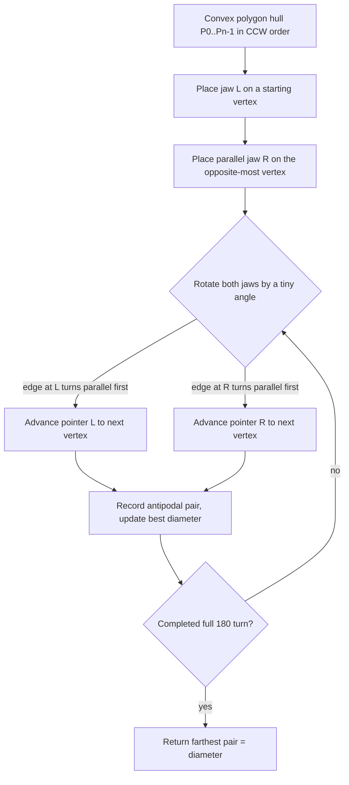
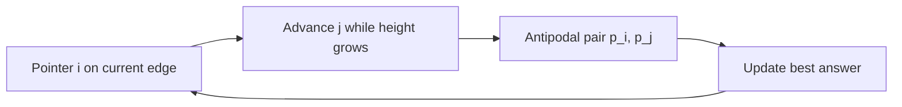

# Rotating Calipers — Junior Level

> **One-line summary:** Rotating calipers is a technique that places a pair of parallel "supporting lines" (like the jaws of a caliper) against a **convex polygon** and rotates them all the way around it. As they rotate, the jaws touch one vertex at a time, and that lets you answer questions like *"which two points are farthest apart?"* (the polygon **diameter**) in linear `O(n)` time — after you have built the convex hull in `O(n log n)`.

---

## Table of Contents

1. [Introduction](#introduction)
2. [Prerequisites](#prerequisites)
3. [Glossary](#glossary)
4. [Core Concepts](#core-concepts)
5. [The Caliper Metaphor](#the-caliper-metaphor)
6. [Big-O Summary](#big-o-summary)
7. [Real-World Analogies](#real-world-analogies)
8. [Pros & Cons](#pros--cons)
9. [Step-by-Step Walkthrough](#step-by-step-walkthrough)
10. [Code Examples](#code-examples)
11. [Coding Patterns](#coding-patterns)
12. [Error Handling](#error-handling)
13. [Performance Tips](#performance-tips)
14. [Best Practices](#best-practices)
15. [Edge Cases & Pitfalls](#edge-cases--pitfalls)
16. [Common Mistakes](#common-mistakes)
17. [Cheat Sheet](#cheat-sheet)
18. [Visual Animation](#visual-animation)
19. [Summary](#summary)
20. [Further Reading](#further-reading)

---

## Introduction

Imagine you have a flat, hard object — say a wooden tile cut into some shape — and you want to measure how "wide" it is at its widest. You grab a pair of **calipers** (the sliding measuring tool from a workshop), open the two jaws, and clamp them onto the object so that one jaw touches one side and the other jaw touches the opposite side. The reading on the calipers is the distance *in that direction*. Now slowly **rotate** the object (or equivalently, rotate the calipers around it) through a full turn, watching the reading change. The largest reading you ever see is the **diameter** — the greatest distance between any two points of the shape. The smallest reading is the **width**.

That physical picture *is* the algorithm. The name **rotating calipers** was coined by **Michael Shamos in 1978**, and the metaphor was popularized by **Godfried Toussaint** in a famous 1983 paper. The key insight is that you do not need to test every pair of points (which would be `O(n²)`). Because the shape is **convex**, as the calipers rotate the touching vertices march around the boundary in a single, predictable sweep — each jaw only ever moves *forward*, never backward. That one-directional march is why the whole rotation costs only `O(n)` steps.

There is a strict precondition you must respect: **the input must be a convex polygon.** Rotating calipers does not work on an arbitrary cloud of points or a shape with dents. So the standard recipe is two stages:

1. Build the **convex hull** of your points in `O(n log n)` (see the sibling topic *01-convex-hull*).
2. Run rotating calipers on that hull in `O(n)`.

The total cost is dominated by the hull, `O(n log n)`, and the calipers step is essentially free on top of it. That is what makes this technique beloved in competitive programming, collision detection, robotics, and geographic information systems (GIS).

At the junior level we focus on the **what** and the **how**: the caliper metaphor, the idea of *antipodal pairs*, and the single most famous application — finding the **diameter** (the farthest pair of points) of a convex polygon.

---

## Prerequisites

Before reading this file you should be comfortable with:

- **Points and vectors in 2D** — a point is `(x, y)`; a vector is the difference of two points.
- **The cross product (2D)** — `cross(O, A, B) = (A-O) × (B-O)`. Its sign tells you whether `B` is to the left or right of ray `O→A`. This is *the* primitive of computational geometry.
- **Convex polygons** — a polygon with no dents; every interior angle ≤ 180°. Vertices are usually stored in **counter-clockwise (CCW)** order.
- **Convex hull** — the smallest convex polygon containing a set of points. We assume you can already compute it (see *01-convex-hull*).
- **Big-O notation** — `O(n)`, `O(n log n)`, `O(n²)`.
- **Basic loops and arrays** in Go / Java / Python.

Optional but helpful:

- A feel for the difference between *squared distance* and *distance* (we compare squared distances to avoid slow, imprecise square roots).
- Modular arithmetic on indices (`(i + 1) % n`) for walking around a polygon's vertices in a circle.

---

## Glossary

| Term | Meaning |
|------|---------|
| **Convex polygon** | A polygon with no indentations; the line between any two interior points stays inside. |
| **Convex hull** | The tightest convex polygon enclosing a set of points — the "rubber band" shape. |
| **Supporting line** | A line that touches the polygon but does not cut through it; the whole polygon lies on one side. |
| **Caliper / jaw** | One of the two parallel supporting lines in the rotating-calipers pair. |
| **Antipodal pair** | Two vertices that can be touched simultaneously by a pair of **parallel** supporting lines. |
| **Diameter** | The maximum distance between any two points of the polygon (the farthest pair). |
| **Width** | The minimum distance between two parallel supporting lines over all rotations. |
| **Cross product** | `(B-A) × (C-A)`; sign gives orientation (left turn, right turn, collinear). |
| **CCW order** | Counter-clockwise listing of vertices — the standard convention. |
| **Edge** | The segment between consecutive hull vertices `P[i]` and `P[(i+1)%n]`. |
| **Antipodal march** | The single forward walk of the opposite vertex as the calipers rotate. |

---

## Core Concepts

### 1. A supporting line touches but does not cut

A **supporting line** for a convex polygon is a straight line that touches the polygon (at a vertex or along an edge) while the *entire polygon* stays on one side of it. Picture pressing a ruler flat against the outside of the shape — that ruler is a supporting line. Every edge of a convex polygon, when extended, is a supporting line, and every vertex has a whole range of supporting lines passing through it (one for each direction you can tilt the ruler before it would cut in).

### 2. Two parallel supporting lines = the caliper jaws

If you take **two** supporting lines that are **parallel** to each other and squeeze them against opposite sides of the polygon, you have the two jaws of a caliper. The polygon is sandwiched between them. The perpendicular distance between the two jaws is the polygon's **extent** in the direction perpendicular to the jaws.

### 3. Antipodal pairs

The two vertices touched by a pair of parallel supporting lines are called an **antipodal pair**. The crucial fact is:

> The two points of the polygon that are **farthest apart** (the diameter) are always an **antipodal pair**.

So instead of checking all `O(n²)` pairs of points, we only need to check the antipodal pairs — and a convex polygon with `n` vertices has only `O(n)` of them. Rotating the calipers visits every antipodal pair exactly once.

### 4. As the calipers rotate, each jaw marches forward only

Here is the magic that gives `O(n)`. Start the two jaws somewhere (say one on the lowest vertex, one on the highest). Rotate them a little. Whichever jaw's *current edge* becomes parallel first determines which vertex advances. As you complete a full rotation, **each jaw walks once around the polygon in the same direction** — it never backtracks. Two pointers, each making at most `n` forward steps, gives a total of `O(n)` work. This is the same idea as the **two-pointer technique** you may know from arrays.

---

## The Caliper Metaphor



The diagram captures the loop: rotate, advance whichever pointer "wins", record the antipodal pair, repeat until you have swept all the way around. Because the polygon has 180° rotational symmetry in the *direction* of the jaws (a line and its 180°-flip are the same direction), you only need to rotate through 180°, not a full 360°, to see every antipodal pair.

---

## Big-O Summary

| Operation | Complexity | Notes |
|-----------|-----------|-------|
| Build convex hull (preprocessing) | `O(n log n)` | One-time; dominates total cost |
| Rotating-calipers sweep | `O(n)` | Each of two pointers advances ≤ `n` times |
| Diameter / farthest pair | `O(n)` after hull | vs `O(n²)` brute force |
| Width (minimum) | `O(n)` after hull | Min over all antipodal edge-vertex pairs |
| Min-area enclosing rectangle | `O(n)` after hull | One side flush with a hull edge |
| **Total (from raw points)** | `O(n log n)` | Hull + sweep |
| Space | `O(n)` | Store the hull vertices |

> **Takeaway:** the calipers part is linear. If your points are *already* a convex polygon in CCW order, the whole thing is `O(n)`.

---

## Real-World Analogies

| Concept | Analogy |
|---------|--------|
| **Rotating calipers** | A workshop caliper clamped on a tile, slowly rotated to read the shape's size in every direction. |
| **Supporting line** | A flat ruler pressed against the outside of a shape — it touches but never cuts in. |
| **Antipodal pair** | Two people standing on opposite sides of a round table, each able to see the other straight across. |
| **Diameter** | The longest straight stick you could lay flat inside the shape, touching its boundary at both ends. |
| **Width** | The narrowest doorway the shape could squeeze through if you turned it to the best angle. |

> **Where the analogy breaks down:** a real caliper measures a *physical* object that you can spin freely; in code we never literally rotate anything — we just advance integer pointers around an array of vertices and compare cross products. The "rotation" is purely conceptual.

---

## Pros & Cons

| Pros | Cons |
|------|------|
| Linear `O(n)` after the hull — beats `O(n²)` brute force | Requires a **convex** polygon; will give wrong answers on non-convex input |
| Solves *many* problems with one framework (diameter, width, rectangles, polygon distance) | You must first build (and trust) the convex hull |
| Uses only the cross product — no trigonometry, no square roots needed | Edge cases (collinear points, duplicate vertices, polygons of 1–2 points) need care |
| Numerically friendly when done with integer/exact arithmetic | The "rotate" logic is subtle; off-by-one and wrong comparison signs are common bugs |

**When to use:** you have a convex shape (or points whose hull you can build) and need the farthest pair, the width, a minimum bounding box, or the distance between two convex shapes.

**When NOT to use:** the shape is non-convex and must stay that way, or you need *all* pairwise distances (calipers only finds the extremes).

---

## Step-by-Step Walkthrough

Let us find the **diameter** of a simple convex polygon. Take a square-ish quadrilateral given CCW:

```
P0 = (0, 0)
P1 = (4, 0)
P2 = (5, 3)
P3 = (1, 4)
```

The diameter should be the longest diagonal. We will use the classic "advance the pointer that increases the triangle area" rule, which is equivalent to keeping the jaws parallel.

```
n = 4
For each edge (P[i], P[i+1]), keep advancing j while the
"height" of P[j] above the edge keeps increasing, i.e. while
   area(P[i], P[i+1], P[j+1]) > area(P[i], P[i+1], P[j]).
At each step, P[i] and P[j] form an antipodal pair → check their distance.
```

Walk:

| Edge `i → i+1` | Antipodal `j` | Pair tested | Squared distance |
|----------------|---------------|-------------|------------------|
| `P0→P1` (0,0)-(4,0) | `j=3` (1,4) farthest above | (0,0)-(1,4) | `1+16 = 17` |
| advance `j` | `j=2` (5,3) higher above edge? compare areas | (0,0)-(5,3) | `25+9 = 34` |
| `P1→P2` (4,0)-(5,3) | `j=3` (1,4) | (4,0)-(1,4) | `9+16 = 25` |
| advance `j` | `j=0` (0,0) | (4,0)-(0,0) | `16` |
| `P2→P3` (5,3)-(1,4) | `j=0` (0,0) | (5,3)-(0,0) | `34` |
| `P3→P0` (1,4)-(0,0) | `j=1` (4,0) | (1,4)-(4,0) | `25` |

The maximum squared distance seen is **34**, from the pair `(0,0)`–`(5,3)`. So the diameter is `√34 ≈ 5.83`. We never computed a square root until the very end (or not at all, if a squared answer is acceptable), and we touched each vertex a constant number of times.

---

## Code Examples

### Example 1: Convex polygon diameter (farthest pair) via rotating calipers

The function assumes `poly` is a convex polygon in **CCW order** with no three collinear vertices on the hull (the standard output of a convex-hull routine). It returns the **squared** diameter to keep arithmetic exact.

#### Go

```go
package main

import "fmt"

type Point struct{ X, Y int64 }

// cross returns (B-O) x (C-O); sign = orientation of O->B->C.
func cross(o, b, c Point) int64 {
	return (b.X-o.X)*(c.Y-o.Y) - (b.Y-o.Y)*(c.X-o.X)
}

func dist2(a, b Point) int64 {
	dx, dy := a.X-b.X, a.Y-b.Y
	return dx*dx + dy*dy
}

// diameter2 returns the squared diameter of a CCW convex polygon.
func diameter2(p []Point) int64 {
	n := len(p)
	if n < 2 {
		return 0
	}
	if n == 2 {
		return dist2(p[0], p[1])
	}
	best := int64(0)
	j := 1
	for i := 0; i < n; i++ {
		ni := (i + 1) % n
		// Advance j while the area (height) keeps growing.
		for cross(p[i], p[ni], p[(j+1)%n]) > cross(p[i], p[ni], p[j]) {
			j = (j + 1) % n
		}
		// p[i] and p[j] are an antipodal pair; so is p[ni] and p[j].
		if d := dist2(p[i], p[j]); d > best {
			best = d
		}
		if d := dist2(p[ni], p[j]); d > best {
			best = d
		}
	}
	return best
}

func main() {
	poly := []Point{{0, 0}, {4, 0}, {5, 3}, {1, 4}}
	fmt.Println("squared diameter =", diameter2(poly)) // 34
}
```

#### Java

```java
public class Diameter {
    record Point(long x, long y) {}

    static long cross(Point o, Point b, Point c) {
        return (b.x() - o.x()) * (c.y() - o.y())
             - (b.y() - o.y()) * (c.x() - o.x());
    }

    static long dist2(Point a, Point b) {
        long dx = a.x() - b.x(), dy = a.y() - b.y();
        return dx * dx + dy * dy;
    }

    // Squared diameter of a CCW convex polygon.
    static long diameter2(Point[] p) {
        int n = p.length;
        if (n < 2) return 0;
        if (n == 2) return dist2(p[0], p[1]);
        long best = 0;
        int j = 1;
        for (int i = 0; i < n; i++) {
            int ni = (i + 1) % n;
            while (cross(p[i], p[ni], p[(j + 1) % n]) > cross(p[i], p[ni], p[j])) {
                j = (j + 1) % n;
            }
            best = Math.max(best, dist2(p[i], p[j]));
            best = Math.max(best, dist2(p[ni], p[j]));
        }
        return best;
    }

    public static void main(String[] args) {
        Point[] poly = { new Point(0,0), new Point(4,0), new Point(5,3), new Point(1,4) };
        System.out.println("squared diameter = " + diameter2(poly)); // 34
    }
}
```

#### Python

```python
def cross(o, b, c):
    # (B-O) x (C-O); sign = orientation O->B->C
    return (b[0] - o[0]) * (c[1] - o[1]) - (b[1] - o[1]) * (c[0] - o[0])

def dist2(a, b):
    dx, dy = a[0] - b[0], a[1] - b[1]
    return dx * dx + dy * dy

def diameter2(p):
    """Squared diameter of a CCW convex polygon."""
    n = len(p)
    if n < 2:
        return 0
    if n == 2:
        return dist2(p[0], p[1])
    best = 0
    j = 1
    for i in range(n):
        ni = (i + 1) % n
        while cross(p[i], p[ni], p[(j + 1) % n]) > cross(p[i], p[ni], p[j]):
            j = (j + 1) % n
        best = max(best, dist2(p[i], p[j]), dist2(p[ni], p[j]))
    return best

if __name__ == "__main__":
    poly = [(0, 0), (4, 0), (5, 3), (1, 4)]
    print("squared diameter =", diameter2(poly))  # 34
```

**What it does:** sweeps the antipodal pointer `j` once around the polygon, comparing squared distances and keeping the maximum. **Run:** `go run main.go` | `javac Diameter.java && java Diameter` | `python diameter.py`

---

### Example 2: Building the hull first, then measuring the diameter

Real input is usually a raw set of points, not a clean convex polygon. So you call your convex-hull routine first. Here is a compact monotone-chain hull (see *01-convex-hull*) followed by the diameter call.

#### Go

```go
package main

import (
	"fmt"
	"sort"
)

type Pt struct{ X, Y int64 }

func crs(o, a, b Pt) int64 {
	return (a.X-o.X)*(b.Y-o.Y) - (a.Y-o.Y)*(b.X-o.X)
}

// convexHull returns the CCW hull (no collinear points kept).
func convexHull(pts []Pt) []Pt {
	sort.Slice(pts, func(i, j int) bool {
		if pts[i].X != pts[j].X {
			return pts[i].X < pts[j].X
		}
		return pts[i].Y < pts[j].Y
	})
	n := len(pts)
	if n < 3 {
		return pts
	}
	hull := make([]Pt, 0, 2*n)
	for _, p := range pts { // lower hull
		for len(hull) >= 2 && crs(hull[len(hull)-2], hull[len(hull)-1], p) <= 0 {
			hull = hull[:len(hull)-1]
		}
		hull = append(hull, p)
	}
	lower := len(hull) + 1
	for i := n - 2; i >= 0; i-- { // upper hull
		p := pts[i]
		for len(hull) >= lower && crs(hull[len(hull)-2], hull[len(hull)-1], p) <= 0 {
			hull = hull[:len(hull)-1]
		}
		hull = append(hull, p)
	}
	return hull[:len(hull)-1]
}

func main() {
	pts := []Pt{{0, 0}, {4, 0}, {5, 3}, {1, 4}, {2, 2}} // (2,2) is interior
	hull := convexHull(pts)
	fmt.Println("hull size:", len(hull)) // 4 — interior point dropped
}
```

#### Java

```java
import java.util.*;

public class HullThenDiameter {
    record Pt(long x, long y) {}

    static long crs(Pt o, Pt a, Pt b) {
        return (a.x()-o.x())*(b.y()-o.y()) - (a.y()-o.y())*(b.x()-o.x());
    }

    static List<Pt> convexHull(List<Pt> pts) {
        pts.sort(Comparator.comparingLong(Pt::x).thenComparingLong(Pt::y));
        int n = pts.size();
        if (n < 3) return pts;
        List<Pt> hull = new ArrayList<>();
        for (Pt p : pts) {
            while (hull.size() >= 2 &&
                   crs(hull.get(hull.size()-2), hull.get(hull.size()-1), p) <= 0)
                hull.remove(hull.size()-1);
            hull.add(p);
        }
        int lower = hull.size() + 1;
        for (int i = n - 2; i >= 0; i--) {
            Pt p = pts.get(i);
            while (hull.size() >= lower &&
                   crs(hull.get(hull.size()-2), hull.get(hull.size()-1), p) <= 0)
                hull.remove(hull.size()-1);
            hull.add(p);
        }
        hull.remove(hull.size()-1);
        return hull;
    }

    public static void main(String[] args) {
        List<Pt> pts = new ArrayList<>(List.of(
            new Pt(0,0), new Pt(4,0), new Pt(5,3), new Pt(1,4), new Pt(2,2)));
        System.out.println("hull size: " + convexHull(pts).size()); // 4
    }
}
```

#### Python

```python
def cross(o, a, b):
    return (a[0]-o[0])*(b[1]-o[1]) - (a[1]-o[1])*(b[0]-o[0])

def convex_hull(pts):
    pts = sorted(set(pts))
    if len(pts) < 3:
        return pts
    lower = []
    for p in pts:
        while len(lower) >= 2 and cross(lower[-2], lower[-1], p) <= 0:
            lower.pop()
        lower.append(p)
    upper = []
    for p in reversed(pts):
        while len(upper) >= 2 and cross(upper[-2], upper[-1], p) <= 0:
            upper.pop()
        upper.append(p)
    return lower[:-1] + upper[:-1]

if __name__ == "__main__":
    pts = [(0, 0), (4, 0), (5, 3), (1, 4), (2, 2)]  # (2,2) interior
    print("hull size:", len(convex_hull(pts)))  # 4
```

**What it does:** drops the interior point `(2,2)` and returns the four hull vertices in CCW order, ready to feed into `diameter2`.

---

## Coding Patterns

### Pattern 1: Two-pointer antipodal march

**Intent:** keep one pointer `i` on the "current edge" and a second pointer `j` on the antipodal vertex; advance `j` only forward.

#### Go

```go
j := 0
for i := 0; i < n; i++ {
	ni := (i + 1) % n
	for cross(p[i], p[ni], p[(j+1)%n]) > cross(p[i], p[ni], p[j]) {
		j = (j + 1) % n // j never moves backward
	}
	// (p[i], p[j]) is an antipodal pair — measure something here
}
```

#### Java

```java
int j = 0;
for (int i = 0; i < n; i++) {
    int ni = (i + 1) % n;
    while (cross(p[i], p[ni], p[(j+1)%n]) > cross(p[i], p[ni], p[j]))
        j = (j + 1) % n;            // forward only
    // (p[i], p[j]) antipodal — measure here
}
```

#### Python

```python
j = 0
for i in range(n):
    ni = (i + 1) % n
    while cross(p[i], p[ni], p[(j + 1) % n]) > cross(p[i], p[ni], p[j]):
        j = (j + 1) % n           # forward only
    # (p[i], p[j]) antipodal — measure here
```



### Pattern 2: Compare squared distances, never raw distances

**Intent:** avoid `sqrt` (slow and imprecise). Maximizing distance is the same as maximizing squared distance because `sqrt` is monotonic.

```python
# instead of: math.dist(a, b)
def dist2(a, b):
    return (a[0]-b[0])**2 + (a[1]-b[1])**2
# compare dist2 values; take sqrt only on the final answer if needed
```

---

## Error Handling

| Error | Cause | Fix |
|-------|-------|-----|
| Wrong answer on a non-convex shape | Input had dents | Build the convex hull first |
| Index out of range | Forgot `% n` when stepping `j+1` | Always use `(j+1) % n` |
| Diameter too small | Only checked `(p[i], p[j])`, missed `(p[ni], p[j])` | Check both antipodal pairs each step |
| Crash on `n < 2` | Polygon has 0 or 1 point | Early-return for `n < 2` |
| `sqrt` of huge `int` overflows | Mixing float and big ints | Keep everything as squared integers |

---

## Performance Tips

- Keep coordinates as **integers** and compare **squared** distances; you avoid floating point entirely for diameter and width-numerators.
- The hull is the expensive part (`O(n log n)`). If you call calipers many times on the *same* hull, build the hull once and reuse it.
- Avoid recomputing `(i+1) % n` repeatedly — store it in a local `ni`.
- For very large point sets, the modulo `% n` can be replaced by storing the hull twice (`p` concatenated with itself) and indexing linearly — fewer branch mispredictions.

---

## Best Practices

- Always document the **CCW assumption** at the top of your function; if a caller passes a clockwise polygon, results silently break.
- Write a brute-force `O(n²)` diameter first and test that calipers matches it on hundreds of random small hulls.
- Strip duplicate and collinear points in the hull step so the calipers loop sees a clean polygon.
- Return *squared* answers from the core routine and let the caller take the square root if they actually need the metric distance.

---

## Edge Cases & Pitfalls

- **One or two points:** diameter is `0` or the single distance; handle before the loop.
- **All points collinear:** the "hull" is a segment; diameter is its length, width is `0`.
- **Duplicate vertices:** can make `cross` return `0` and stall the `j` pointer — dedupe first.
- **Clockwise input:** the `>` comparison must be flipped, or just reverse the polygon to CCW.
- **Squares / regular polygons:** several antipodal pairs tie for the maximum; make sure your `>` vs `>=` choice does not skip a valid pair.

---

## Common Mistakes

- Running calipers on raw points without building the hull — the single most common bug.
- Using `>=` instead of `>` in the advance condition, causing `j` to overshoot and loop forever on polygons with parallel edges.
- Forgetting that the diameter can also be `(p[ni], p[j])`, not just `(p[i], p[j])`.
- Taking `sqrt` inside the loop, losing precision and speed.
- Assuming a full `360°` rotation is needed; `180°` (one pass `i = 0..n-1`) already visits every antipodal pair.

---

## Cheat Sheet

| Task | Core idea | Time | Space |
|------|-----------|------|-------|
| Diameter (farthest pair) | Max squared distance over antipodal pairs | `O(n)` | `O(1)` |
| Width (minimum) | Min edge-to-vertex distance over antipodal pairs | `O(n)` | `O(1)` |
| Min-area rectangle | One side flush with each hull edge | `O(n)` | `O(1)` |
| Distance between 2 convex polygons | Calipers on the pair | `O(n+m)` | `O(1)` |
| **Precondition** | Convex polygon in CCW order | — | — |
| **Build hull first** | `O(n log n)` | — | `O(n)` |

---

## Visual Animation

> See [`animation.html`](./animation.html) for an interactive visual animation of rotating calipers.
>
> The animation demonstrates:
> - A convex polygon with two parallel supporting lines (the caliper jaws) rotating around it
> - Antipodal pairs highlighted as the jaws touch them
> - The current diameter, width, and minimum-area rectangle updating live
> - Step / play / pause controls and a speed slider
> - A Big-O panel and an operation log

---

## Summary

Rotating calipers takes a **convex polygon** and "clamps" a pair of parallel supporting lines onto it, then rotates them through 180°. As the jaws turn, the vertices they touch — the **antipodal pairs** — march forward around the polygon, each pointer moving only one direction. Because there are only `O(n)` antipodal pairs and we visit each once, the sweep is `O(n)`. The most famous payoff is the **diameter**: the farthest pair of points is always an antipodal pair, so we find it in linear time instead of testing all `O(n²)` pairs. The one rule you cannot break is convexity — always build the convex hull (`O(n log n)`) first.

---

## Further Reading

- Toussaint, G. (1983). *Solving geometrical problems with the rotating calipers.* — the foundational paper.
- *Computational Geometry: Algorithms and Applications* (de Berg et al.) — convex hulls and supporting lines.
- Sibling topic *01-convex-hull* — you must build the hull before calipers.
- *Introduction to Algorithms* (CLRS) — Chapter 33 (Computational Geometry), cross products and orientation.
- cp-algorithms.com — "Convex hull" and "Rotating calipers" articles.

---

**Next step:** Continue to [`middle.md`](./middle.md) to learn *why* the technique works — width, the minimum-area enclosing rectangle, the formal antipodal-pairs idea, and why the convex-hull step is mandatory.
