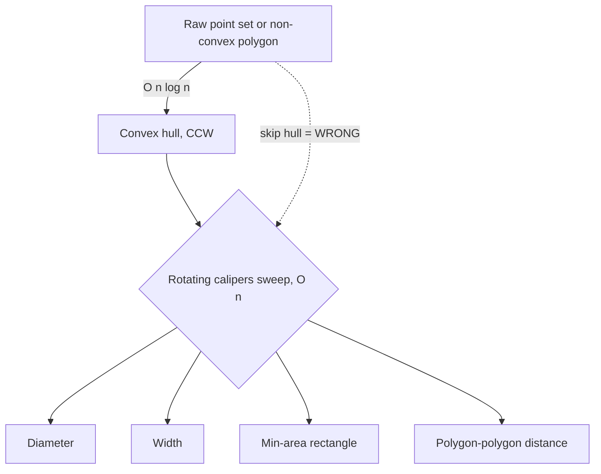
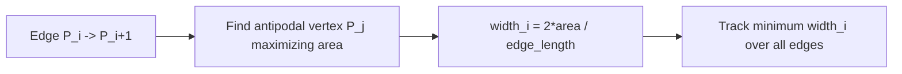

# Rotating Calipers — Middle Level

> **One-line summary:** At the middle level we move beyond the diameter to the full toolbox rotating calipers unlocks on a convex polygon: the **width** (minimum), the **minimum-area** and **minimum-perimeter enclosing rectangle**, and the **distance between two convex polygons**. The through-line is the **antipodal-pairs** structure and the two-pointer march that visits all of them in `O(n)` — provided you have first paid the `O(n log n)` to build the convex hull.

---

## Table of Contents

1. [Introduction](#introduction)
2. [Why Convexity Is Mandatory](#why-convexity-is-mandatory)
3. [Antipodal Pairs, Formally Enough](#antipodal-pairs-formally-enough)
4. [Problem 1: Width (Minimum)](#problem-1-width-minimum)
5. [Problem 2: Minimum-Area Enclosing Rectangle](#problem-2-minimum-area-enclosing-rectangle)
6. [Problem 3: Distance Between Two Convex Polygons](#problem-3-distance-between-two-convex-polygons)
7. [Comparison with Alternatives](#comparison-with-alternatives)
8. [Advanced Patterns](#advanced-patterns)
9. [Code Examples](#code-examples)
10. [Error Handling](#error-handling)
11. [Performance Analysis](#performance-analysis)
12. [Best Practices](#best-practices)
13. [Visual Animation](#visual-animation)
14. [Summary](#summary)

---

## Introduction

> Focus: "Why does it work?" and "When should I reach for it?"

The junior file framed rotating calipers as a metaphor and used it for one job — the diameter. The reason the technique deserves its own topic is that the *same* mechanical sweep solves a surprisingly broad family of problems. Once you internalize "advance the antipodal pointer monotonically as a supporting line rotates," you can compute:

- the polygon's **width** (the smallest gap between two parallel supporting lines),
- the **minimum-area** bounding rectangle (used everywhere in collision detection and packing),
- the **minimum-perimeter** bounding rectangle,
- the **maximum** and **minimum distance between two convex polygons**,
- convex-polygon **intersection** and **merging** primitives.

All of these share two properties that make calipers correct and efficient:

1. The optimum is always realized by a configuration where a supporting line is **flush with an edge** (or touches an **antipodal** vertex). You never need to consider arbitrary angles — only the `O(n)` angles defined by the edges.
2. As the rotating line passes through those `O(n)` critical angles, the touching vertex advances **monotonically**. That monotonicity is the entire reason a naive `O(n²)` search collapses to `O(n)`.

This file explains *why* both properties hold (the rigorous proof lives in `professional.md`), then walks through three concrete problems with full code in Go, Java, and Python.

---

## Why Convexity Is Mandatory

Rotating calipers is built on one structural promise of convex polygons:

> For every direction `θ`, there is **exactly one** vertex (or edge) that is extreme in that direction, and as `θ` increases continuously from `0` to `2π`, that extreme vertex moves **monotonically** around the boundary, visiting each vertex exactly once.

For a convex polygon this is guaranteed. The "support function" — the farthest extent of the polygon in direction `θ` — is achieved at a single vertex, and that vertex index is a monotone step function of `θ`. That is precisely what lets us use a **single forward-only pointer**.

For a **non-convex** polygon this collapses. A dent means the extreme vertex in direction `θ` can jump *backward* as `θ` advances, or two far-apart vertices can be extreme for overlapping ranges of `θ`. The monotone march breaks, the two-pointer invariant fails, and the algorithm silently returns wrong answers — it does not crash, it just lies. This is why the **mandatory first step** is to replace your point set with its convex hull (sibling topic *01-convex-hull*).



The dotted edge in the diagram is the trap: skipping the hull. It "works" on convex test inputs and fails the moment a dent or interior point sneaks in.

---

## Antipodal Pairs, Formally Enough

A pair of vertices `(P[i], P[j])` is **antipodal** if there exist two **parallel** supporting lines, one through `P[i]` and one through `P[j]`. Equivalently, there is a direction in which `P[i]` is the maximum-extent vertex and `P[j]` is the minimum-extent vertex.

Three facts you will use constantly:

1. **The diameter is antipodal.** The farthest pair is realized by parallel supporting lines (proof in `professional.md`), so it is one of the `O(n)` antipodal pairs.
2. **There are `O(n)` antipodal pairs.** Specifically, a convex `n`-gon has at most `3n/2` antipodal pairs. So enumerating them is linear.
3. **The width is an edge–vertex antipodal incidence.** The minimum width is always achieved with one supporting line **flush against an edge** and the opposite line through the antipodal vertex. (If both lines passed through single vertices, you could rotate slightly to shrink the gap — so the minimum is an edge case.)

The practical consequence: to compute the width or a min rectangle, you iterate over the `n` **edges**, and for each edge find the single antipodal vertex farthest from it. That farthest-vertex pointer marches forward monotonically — the same two-pointer engine as the diameter.

---

## Problem 1: Width (Minimum)

The **width** of a convex polygon is the minimum distance between two parallel supporting lines. Pin one line flush against edge `(P[i], P[i+1])`; the opposite line passes through the vertex `P[j]` **farthest** from the line containing that edge. The distance from `P[j]` to the edge line is a candidate width. The minimum over all edges is the width.

Distance from point to the infinite line through an edge, using the cross product:

```
distance(edge i, point j) = | cross(P[i], P[i+1], P[j]) | / |P[i+1] - P[i]|
```

The numerator `|cross|` is exactly twice the area of the triangle. To find the farthest `P[j]` we maximize this cross product (the antipodal vertex). Then divide by the edge length to get the true perpendicular distance.



To compare widths across edges with **different** edge lengths you must divide — so widths are floating point. But the *farthest-vertex search* still uses integer cross products, keeping the inner loop exact. We see the code below.

---

## Problem 2: Minimum-Area Enclosing Rectangle

A beautiful theorem (Freeman & Shapira, 1975) says:

> The minimum-area rectangle enclosing a convex polygon has **at least one side collinear with an edge** of the polygon.

This means you do not search over all infinitely many rectangle orientations — only the `n` orientations defined by the polygon's edges. For each edge you build a rectangle aligned to that edge using **four calipers** (not two):

- one jaw **flush with the edge** (bottom),
- one **parallel** jaw on the far side (top) — the antipodal vertex,
- two **perpendicular** jaws (left and right) — the vertices extreme along the edge direction.

All three "other" pointers (top, left, right) advance monotonically as the base edge rotates, so the whole thing is still `O(n)`. The rectangle's area is `(height) × (width)` where height = top−bottom gap and width = right−left extent along the edge direction. Take the minimum area over all `n` edges. Swapping the objective to perimeter `2(height + width)` gives the **minimum-perimeter** rectangle with the same machinery.

| Calipers in the min-rectangle sweep | Direction | Finds |
|-------------------------------------|-----------|-------|
| Base jaw | along edge `i` | bottom side |
| Top jaw (antipodal) | parallel to edge `i` | height of the box |
| Right jaw | perpendicular, forward | far extent along edge |
| Left jaw | perpendicular, backward | near extent along edge |

This four-pointer version is the workhorse behind **oriented bounding boxes (OBB)** in physics engines and games.

---

## Problem 3: Distance Between Two Convex Polygons

Given two convex polygons `P` and `Q`, the **minimum distance** between them (zero if they overlap) and the **maximum distance** can both be found with rotating calipers in `O(n + m)`. The idea: place one caliper on `P` and an *anti-parallel* caliper on `Q`, then rotate both together. The closest features (vertex–vertex, vertex–edge, or edge–edge) are revealed at the critical angles, and again the touching vertices march forward monotonically.

For the **minimum** distance specifically, the relevant configurations are:

- a vertex of `P` and the closest point on an edge of `Q` (or vice versa), or
- two parallel edges, one from each polygon.

In practice many engineers reach for **GJK** (Gilbert–Johnson–Keerthi) for arbitrary convex shapes, but rotating calipers gives an elegant exact `O(n+m)` answer for polygons and is the conceptual ancestor of those methods.

---

## Comparison with Alternatives

| Attribute | Rotating Calipers | Brute Force (all pairs) | GJK / Minkowski |
|-----------|-------------------|-------------------------|-----------------|
| Diameter time | `O(n)` after hull | `O(n²)` | n/a |
| Width time | `O(n)` after hull | `O(n²)` | n/a |
| Min rectangle | `O(n)` after hull | `O(n²)` or worse | n/a |
| Polygon distance | `O(n+m)` | `O(n·m)` | `O(n+m)` expected |
| Input requirement | **Convex** polygon | any | convex |
| Implementation difficulty | Medium (subtle pointers) | Trivial | Hard |
| Exactness | Exact with integers | Exact | Often iterative/float |

**Choose rotating calipers when:** the input is (or can be made) a convex polygon and you need diameter, width, a bounding box, or polygon-to-polygon distance exactly and fast.

**Choose brute force when:** `n` is tiny (≤ ~50) and you want dead-simple, obviously-correct code — great as a test oracle.

**Choose GJK/Minkowski when:** you need general convex collision (including curved shapes) or incremental queries across frames.

---

## Advanced Patterns

### Pattern: Four-caliper sweep for the bounding box

**Intent:** maintain four monotone pointers (`top`, `right`, `left`) relative to a rotating base edge.

#### Go

```go
// Pseudocode-shaped Go: advance each pointer while its projection improves.
top, right, left := 1, 1, 0
for i := 0; i < n; i++ {
	ni := (i + 1) % n
	// rotate base to edge (i, ni); advance the three followers monotonically
	for area(p[i], p[ni], p[(top+1)%n]) > area(p[i], p[ni], p[top]) {
		top = (top + 1) % n
	}
	for dot(p[i], p[ni], p[(right+1)%n]) > dot(p[i], p[ni], p[right]) {
		right = (right + 1) % n
	}
	// left starts where right was on the first iteration, then follows
	// compute box (height via top, width via right-left), update min area
}
```

#### Java

```java
int top = 1, right = 1, left = 0;
for (int i = 0; i < n; i++) {
    int ni = (i + 1) % n;
    while (area(p[i], p[ni], p[(top+1)%n]) > area(p[i], p[ni], p[top]))
        top = (top + 1) % n;
    while (dot(p[i], p[ni], p[(right+1)%n]) > dot(p[i], p[ni], p[right]))
        right = (right + 1) % n;
    // height from top, width from right-left, update min area
}
```

#### Python

```python
top = right = 1
left = 0
for i in range(n):
    ni = (i + 1) % n
    while area(p[i], p[ni], p[(top+1) % n]) > area(p[i], p[ni], p[top]):
        top = (top + 1) % n
    while dot(p[i], p[ni], p[(right+1) % n]) > dot(p[i], p[ni], p[right]):
        right = (right + 1) % n
    # height from top, width from right-left -> update min area
```

### Pattern: Reuse the hull across queries

If you process **many** shapes (a batch of polygons), build each hull once and cache it; the per-query calipers cost is linear and dwarfed by the hull. Senior-level batch pipelines lean on this.

---

## Code Examples

### Full Implementation: Width of a convex polygon

#### Go

```go
package main

import (
	"fmt"
	"math"
)

type Point struct{ X, Y float64 }

func cross(o, a, b Point) float64 {
	return (a.X-o.X)*(b.Y-o.Y) - (a.Y-o.Y)*(b.X-o.X)
}

func edgeLen(a, b Point) float64 {
	return math.Hypot(b.X-a.X, b.Y-a.Y)
}

// width returns the minimum width of a CCW convex polygon.
func width(p []Point) float64 {
	n := len(p)
	if n < 3 {
		return 0
	}
	best := math.Inf(1)
	j := 1
	for i := 0; i < n; i++ {
		ni := (i + 1) % n
		// advance j to the vertex farthest from edge (i, ni)
		for math.Abs(cross(p[i], p[ni], p[(j+1)%n])) > math.Abs(cross(p[i], p[ni], p[j])) {
			j = (j + 1) % n
		}
		h := math.Abs(cross(p[i], p[ni], p[j])) / edgeLen(p[i], p[ni])
		if h < best {
			best = h
		}
	}
	return best
}

func main() {
	poly := []Point{{0, 0}, {4, 0}, {4, 2}, {0, 2}} // 4x2 rectangle
	fmt.Printf("width = %.3f\n", width(poly))        // 2.000
}
```

#### Java

```java
public class Width {
    record Point(double x, double y) {}

    static double cross(Point o, Point a, Point b) {
        return (a.x()-o.x())*(b.y()-o.y()) - (a.y()-o.y())*(b.x()-o.x());
    }
    static double edgeLen(Point a, Point b) {
        return Math.hypot(b.x()-a.x(), b.y()-a.y());
    }

    static double width(Point[] p) {
        int n = p.length;
        if (n < 3) return 0;
        double best = Double.POSITIVE_INFINITY;
        int j = 1;
        for (int i = 0; i < n; i++) {
            int ni = (i + 1) % n;
            while (Math.abs(cross(p[i], p[ni], p[(j+1)%n]))
                 > Math.abs(cross(p[i], p[ni], p[j])))
                j = (j + 1) % n;
            double h = Math.abs(cross(p[i], p[ni], p[j])) / edgeLen(p[i], p[ni]);
            best = Math.min(best, h);
        }
        return best;
    }

    public static void main(String[] args) {
        Point[] poly = { new Point(0,0), new Point(4,0), new Point(4,2), new Point(0,2) };
        System.out.printf("width = %.3f%n", width(poly)); // 2.000
    }
}
```

#### Python

```python
import math

def cross(o, a, b):
    return (a[0]-o[0])*(b[1]-o[1]) - (a[1]-o[1])*(b[0]-o[0])

def edge_len(a, b):
    return math.hypot(b[0]-a[0], b[1]-a[1])

def width(p):
    """Minimum width of a CCW convex polygon."""
    n = len(p)
    if n < 3:
        return 0.0
    best = math.inf
    j = 1
    for i in range(n):
        ni = (i + 1) % n
        while abs(cross(p[i], p[ni], p[(j+1) % n])) > abs(cross(p[i], p[ni], p[j])):
            j = (j + 1) % n
        h = abs(cross(p[i], p[ni], p[j])) / edge_len(p[i], p[ni])
        best = min(best, h)
    return best

if __name__ == "__main__":
    poly = [(0, 0), (4, 0), (4, 2), (0, 2)]  # 4x2 rectangle
    print(f"width = {width(poly):.3f}")        # 2.000
```

**What it does:** for each edge it finds the antipodal (farthest) vertex via the monotone `j` pointer, computes the perpendicular distance, and tracks the minimum. For a `4×2` rectangle the answer is `2`, the short side.

---

### Full Implementation: Minimum-area enclosing rectangle (sketch with rotation)

This version rotates each edge to the x-axis and measures the axis-aligned box — conceptually identical to the four-caliper sweep but easier to read.

#### Go

```go
package main

import (
	"fmt"
	"math"
)

type P struct{ X, Y float64 }

func minAreaRect(poly []P) float64 {
	n := len(poly)
	if n < 3 {
		return 0
	}
	best := math.Inf(1)
	for i := 0; i < n; i++ {
		a, b := poly[i], poly[(i+1)%n]
		ex, ey := b.X-a.X, b.Y-a.Y
		l := math.Hypot(ex, ey)
		ux, uy := ex/l, ey/l       // edge direction (unit)
		nx, ny := -uy, ux          // normal (unit)
		var minU, maxU, minN, maxN = math.Inf(1), math.Inf(-1), math.Inf(1), math.Inf(-1)
		for _, q := range poly {
			pu := q.X*ux + q.Y*uy  // project onto edge dir
			pn := q.X*nx + q.Y*ny  // project onto normal
			minU, maxU = math.Min(minU, pu), math.Max(maxU, pu)
			minN, maxN = math.Min(minN, pn), math.Max(maxN, pn)
		}
		area := (maxU - minU) * (maxN - minN)
		best = math.Min(best, area)
	}
	return best
}

func main() {
	poly := []P{{0, 0}, {4, 0}, {5, 3}, {1, 4}}
	fmt.Printf("min-area rect = %.3f\n", minAreaRect(poly))
}
```

> Note: this readable version is `O(n²)` because it reprojects all vertices per edge. The true `O(n)` calipers version replaces the inner projection loop with the four monotone pointers shown in *Advanced Patterns*. For `n` up to a few thousand the `O(n²)` form is perfectly fine and far less bug-prone; switch to the pointer version only when profiling demands it.

#### Java

```java
public class MinRect {
    record P(double x, double y) {}

    static double minAreaRect(P[] poly) {
        int n = poly.length;
        if (n < 3) return 0;
        double best = Double.POSITIVE_INFINITY;
        for (int i = 0; i < n; i++) {
            P a = poly[i], b = poly[(i+1)%n];
            double ex = b.x()-a.x(), ey = b.y()-a.y();
            double l = Math.hypot(ex, ey);
            double ux = ex/l, uy = ey/l, nx = -uy, ny = ux;
            double minU = 1e18, maxU = -1e18, minN = 1e18, maxN = -1e18;
            for (P q : poly) {
                double pu = q.x()*ux + q.y()*uy, pn = q.x()*nx + q.y()*ny;
                minU = Math.min(minU, pu); maxU = Math.max(maxU, pu);
                minN = Math.min(minN, pn); maxN = Math.max(maxN, pn);
            }
            best = Math.min(best, (maxU-minU)*(maxN-minN));
        }
        return best;
    }

    public static void main(String[] args) {
        P[] poly = { new P(0,0), new P(4,0), new P(5,3), new P(1,4) };
        System.out.printf("min-area rect = %.3f%n", minAreaRect(poly));
    }
}
```

#### Python

```python
import math

def min_area_rect(poly):
    n = len(poly)
    if n < 3:
        return 0.0
    best = math.inf
    for i in range(n):
        a, b = poly[i], poly[(i + 1) % n]
        ex, ey = b[0]-a[0], b[1]-a[1]
        l = math.hypot(ex, ey)
        ux, uy = ex/l, ey/l
        nx, ny = -uy, ux
        us = [q[0]*ux + q[1]*uy for q in poly]
        ns = [q[0]*nx + q[1]*ny for q in poly]
        area = (max(us) - min(us)) * (max(ns) - min(ns))
        best = min(best, area)
    return best

if __name__ == "__main__":
    poly = [(0, 0), (4, 0), (5, 3), (1, 4)]
    print(f"min-area rect = {min_area_rect(poly):.3f}")
```

**What it does:** tries each edge as the rectangle's base orientation, projects all vertices onto the edge direction and its normal, and the box area is the product of the two spans. The minimum over all edges is the minimum-area enclosing rectangle.

---

## Error Handling

| Scenario | What goes wrong | Correct approach |
|----------|----------------|-----------------|
| Non-convex input | Monotone pointer breaks, silent wrong answer | Build convex hull first |
| Clockwise polygon | Cross-product signs flip, `j` march reverses | Normalize to CCW (reverse if signed area < 0) |
| Collinear hull vertices | `cross == 0` stalls the pointer | Drop collinear points during hull construction |
| Degenerate edge (zero length) | Divide-by-zero in width | Dedupe vertices; guard `edgeLen > 0` |
| Comparing widths as integers | Different edge lengths → must divide | Use floating point for the final perpendicular distance |

---

## Performance Analysis

#### Go

```go
import (
	"fmt"
	"time"
)

func benchmark(diam func([]Point) float64) {
	for _, n := range []int{100, 1000, 10000, 100000} {
		poly := regularPolygon(n) // CCW unit polygon
		start := time.Now()
		for k := 0; k < 50; k++ {
			diam(poly)
		}
		fmt.Printf("n=%7d: %.3f ms\n", n, float64(time.Since(start).Milliseconds())/50.0)
	}
}
```

#### Java

```java
public static void benchmark() {
    for (int n : new int[]{100, 1000, 10000, 100000}) {
        Point[] poly = regularPolygon(n);
        long start = System.nanoTime();
        for (int k = 0; k < 50; k++) width(poly);
        long elapsed = System.nanoTime() - start;
        System.out.printf("n=%7d: %.3f ms%n", n, elapsed / 50.0 / 1_000_000);
    }
}
```

#### Python

```python
import timeit

for n in (100, 1_000, 10_000, 100_000):
    poly = regular_polygon(n)
    t = timeit.timeit(lambda: width(poly), number=50)
    print(f"n={n:>7}: {t/50*1000:.3f} ms")
```

The calipers sweep is strictly linear: doubling `n` roughly doubles the time. The brute-force `O(n²)` alternative quadruples it — at `n = 100000` that is the difference between milliseconds and minutes.

---

## Best Practices

- **Always hull first.** Treat "input is convex CCW" as an enforced precondition, not a hope.
- Keep the **farthest-vertex search exact** with integer cross products; only divide by edge length at the end where a real distance is needed.
- Write the `O(n²)` brute force as a **test oracle** and fuzz the `O(n)` version against it on thousands of random hulls.
- For min rectangles, decide up front whether you want **minimum area** or **minimum perimeter** — they can have different optimal orientations.
- Cache the hull when running many queries on the same shape.

---

## Visual Animation

> See [`animation.html`](./animation.html) for interactive visualization.
>
> Middle-level highlights in the animation:
> - The antipodal vertex advancing monotonically as the base edge rotates
> - Live width and minimum-area rectangle overlaid on the polygon
> - A toggle between diameter / width / min-rectangle modes
> - Step counter and Big-O panel showing the linear sweep

---

## Summary

The middle-level view of rotating calipers is "one engine, many products." A pair (or quartet) of supporting lines rotates around a convex polygon; because the polygon is convex, the touched vertices march forward monotonically, so a two- (or four-) pointer sweep visits all `O(n)` critical configurations in `O(n)`. With that engine you compute the **width**, the **minimum-area / minimum-perimeter rectangle**, and the **distance between two convex polygons** — each `O(n)` after an `O(n log n)` convex hull. The non-negotiable precondition is convexity: skip the hull and the monotone march breaks, returning silent garbage.

---

**Next step:** Continue to [`senior.md`](./senior.md) to see rotating calipers in production: collision systems, oriented bounding boxes, robustness with floating-point, and batch shape-processing pipelines.
