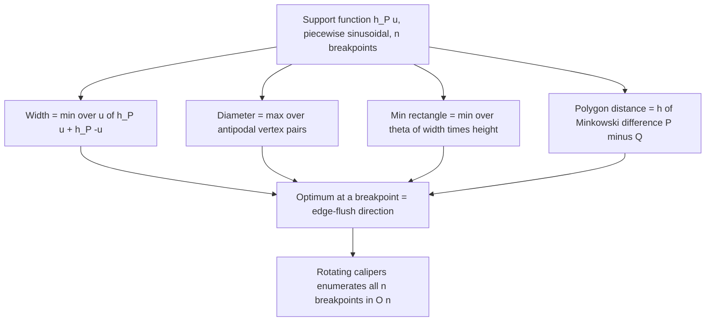

# Rotating Calipers — Mathematical Foundations and Correctness

> **One-line summary:** This file proves the three claims everything else rests on: (1) the farthest pair (**diameter**) of a convex polygon is realized by a pair of **parallel supporting lines**, hence is an **antipodal pair**; (2) a convex `n`-gon has only `O(n)` antipodal pairs and the rotating-calipers sweep enumerates all of them in `O(n)` via a **monotone** pointer; (3) the **width** is realized by a supporting line **flush with an edge** opposite an antipodal vertex. We also prove **why convexity is required** — the monotonicity that gives linearity fails for non-convex shapes.

---

## Table of Contents

1. [Formal Definitions](#formal-definitions)
2. [Supporting Lines and the Support Function](#supporting-lines-and-the-support-function)
3. [Theorem 1: The Diameter Is an Antipodal Pair](#theorem-1-the-diameter-is-an-antipodal-pair)
4. [Theorem 2: O(n) Antipodal Pairs and the Monotone Sweep](#theorem-2-on-antipodal-pairs-and-the-monotone-sweep)
5. [Correctness Proof — Loop Invariant of the Calipers Sweep](#correctness-proof--loop-invariant-of-the-calipers-sweep)
6. [Theorem 3: The Width Is an Edge–Vertex Incidence](#theorem-3-the-width-is-an-edgevertex-incidence)
7. [Minimum-Area Rectangle: The Flush-Edge Theorem](#minimum-area-rectangle-the-flush-edge-theorem)
8. [Why Convexity Is Required](#why-convexity-is-required)
9. [Numerical Robustness and Predicates](#numerical-robustness-and-predicates)
10. [Comparison with Alternatives](#comparison-with-alternatives)
11. [Summary](#summary)

---

## Formal Definitions

Let `P = (p_0, p_1, ..., p_{n-1})` be a convex polygon with vertices listed in **counter-clockwise (CCW)** order, indices taken mod `n`. Let `conv(P)` denote its convex region.

```text
Definition (supporting line). A line ℓ is a supporting line of P if
  ℓ ∩ conv(P) ≠ ∅   (ℓ touches P)   and   conv(P) lies entirely in one
  closed half-plane bounded by ℓ.

Definition (support function). For a unit direction u ∈ S¹,
  h_P(u) = max_{x ∈ P} ⟨x, u⟩.
The supremum is attained on the boundary; the set of maximizers is a
single vertex (generic u) or a single edge (u ⟂ that edge).

Definition (extreme vertex). vmax(u) = argmax_{p_i} ⟨p_i, u⟩.
For a strictly convex polygon (no three collinear vertices) this is a
single vertex for all but finitely many directions u.

Definition (antipodal pair). (p_i, p_j) is antipodal iff there exist
parallel supporting lines ℓ_i ∋ p_i and ℓ_j ∋ p_j with P sandwiched
between them. Equivalently, ∃ u : p_i = vmax(u) and p_j = vmax(-u).

Definition (diameter).  D(P) = max_{a,b ∈ P} ‖a − b‖.
Definition (width).     W(P) = min_{u ∈ S¹} ( h_P(u) + h_P(−u) ).
```

The cross product primitive used throughout:

```text
cross(o, a, b) = (a−o) × (b−o) = (a_x−o_x)(b_y−o_y) − (a_y−o_y)(b_x−o_x).
Sign: >0 ⇔ o→a→b is a left turn (CCW); <0 right turn; =0 collinear.
Note: |cross(o,a,b)| = 2 · area(triangle o,a,b).
```

---

## Supporting Lines and the Support Function

`h_P(u)` is the signed distance from the origin to the supporting line of `P` with outward normal `u`. Two facts we use:

1. **Continuity and piecewise structure.** As `u = (cos θ, sin θ)` rotates, `h_P(u)` is continuous and piecewise sinusoidal, with breakpoints exactly at the directions `u_k` perpendicular to each edge `e_k = p_{k+1} − p_k`. Between consecutive breakpoints the maximizer `vmax(u)` is a *fixed* vertex.

2. **Width via opposite normals.** The distance between the two parallel supporting lines with normals `+u` and `−u` is `h_P(u) + h_P(−u)`. Minimizing this over `u` gives the width; maximizing the *vertex-to-vertex* distance over antipodal pairs gives the diameter.

The crucial monotonicity lemma:

```text
Lemma (monotone extreme vertex). For a CCW convex polygon, the map
  θ ↦ index(vmax(u(θ)))
is non-decreasing (mod n) and surjective over θ ∈ [0, 2π): as the
direction rotates CCW through a full turn, the extreme vertex steps
forward through p_0, p_1, ..., p_{n-1} and returns, each vertex extreme
on a single contiguous arc of directions.
```

**Proof sketch.** Vertex `p_k` is extreme for direction `u` iff `u` lies in the *normal cone* at `p_k` — the cone of directions between the outward normals of its two incident edges `e_{k-1}` and `e_k`. For a convex polygon these normal cones (a) are non-overlapping in their interiors, (b) tile the circle `S¹` exactly once, and (c) appear in the same cyclic order as the vertices. Therefore as `θ` increases, `u(θ)` crosses the cones in vertex order, and the maximizer index is non-decreasing mod `n`. ∎

This lemma is the mathematical heart of the whole technique: it is *exactly* what licenses a single forward-only pointer.

---

## Theorem 1: The Diameter Is an Antipodal Pair

```text
Theorem 1. Let a*, b* ∈ P realize the diameter, D(P) = ‖a* − b*‖.
Then a* and b* are vertices of P, and (a*, b*) is an antipodal pair:
there exist parallel supporting lines through a* and b*.
```

**Proof.**

*Step 1 — endpoints are vertices.* Suppose `a*` lies in the relative interior of an edge or inside `P`. The function `x ↦ ‖x − b*‖²` is convex, so over the compact convex set `P` it attains its maximum at an **extreme point**, i.e. a vertex. Hence we may take `a*` (and symmetrically `b*`) to be vertices.

*Step 2 — supporting line at `a*` perpendicular to `a*b*`.* Let `u = (a* − b*)/‖a* − b*‖`. Consider the line `ℓ_a` through `a*` with normal `u`. Claim: `ℓ_a` supports `P`, i.e. `⟨x, u⟩ ≤ ⟨a*, u⟩` for all `x ∈ P`. If not, some `x ∈ P` has `⟨x, u⟩ > ⟨a*, u⟩`. Then

```text
‖x − b*‖² = ‖(x − a*) + (a* − b*)‖²
          = ‖x − a*‖² + 2⟨x − a*, a*−b*⟩ + ‖a*−b*‖².
```

Now `⟨x − a*, a* − b*⟩ = ‖a*−b*‖ · ⟨x − a*, u⟩ > 0` by assumption, so `‖x − b*‖² > ‖a*−b*‖² = D²`, contradicting that `D` is the maximum distance. Hence `ℓ_a` supports `P`.

*Step 3 — parallel supporting line at `b*`.* By the identical argument with `−u`, the line `ℓ_b` through `b*` with normal `−u` supports `P`. `ℓ_a` and `ℓ_b` share the normal direction `u`, so they are **parallel**, and `P` lies between them. Therefore `(a*, b*)` is antipodal. ∎

**Corollary.** It suffices to examine antipodal pairs to find the diameter — and by Theorem 2 there are only `O(n)` of them.

---

## Theorem 2: O(n) Antipodal Pairs and the Monotone Sweep

```text
Theorem 2. A convex polygon with n vertices (no three collinear) has at
most ⌊3n/2⌋ antipodal pairs, and all of them can be enumerated in O(n)
time by the rotating-calipers sweep.
```

**Proof (counting + algorithmic).**

Think of rotating a direction `u` continuously from `0` to `π` (we use `π`, not `2π`: a line and its 180° flip define the same *parallel pair*, and `vmax(u)` together with `vmax(−u)` covers the antipodal relationship over a half-turn). By the monotone lemma, `vmax(u)` advances through the vertices as a step function with exactly `n` jumps over a full `2π` (one per edge normal); over a half-turn the two pointers `vmax(u)` and `vmax(−u)` *together* make `n` advances.

Each antipodal pair corresponds to an interval of directions where the (top, bottom) vertex assignment is fixed. The number of such intervals is the number of *events* — moments where either the top or bottom pointer jumps, or a supporting line becomes flush with an edge (vertex–edge antipodal incidence). There are `n` jump events plus at most `n/2` simultaneous edge-parallel events, giving at most `⌊3n/2⌋` antipodal pairs.

*Algorithmic enumeration.* The classic sweep over `i = 0 .. n−1` with a single follower pointer `j`:

```text
j ← 1
for i in 0 .. n−1:
    while area(p[i], p[i+1], p[j+1]) > area(p[i], p[i+1], p[j]):
        j ← (j+1) mod n          # advance the antipodal vertex
    report antipodal pair (p[i], p[j])  [and (p[i+1], p[j])]
```

The inner `while` advances `j` only forward. Across the whole outer loop, `j` makes at most `n` total advances (one full lap), by the monotone lemma. The outer loop runs `n` times. Total work `= O(n)` outer steps `+ O(n)` pointer advances `= O(n)`. ∎

The `area(p[i], p[i+1], p[j])` quantity is `½·cross(p[i], p[i+1], p[j])`, the perpendicular height of `p[j]` above edge `(i, i+1)` scaled by the edge length — maximizing it finds the antipodal vertex for that edge direction.

---

## Correctness Proof — Loop Invariant of the Calipers Sweep

We prove the diameter sweep is correct.

```text
Claim. Algorithm DIAM (the sweep above, taking the max over reported
pairs of ‖p[i]−p[j]‖²) outputs D(P)² for every CCW convex polygon P
with n ≥ 2 vertices.

Invariant I(i): "After processing outer index i, j = J(i) is the vertex
maximizing the perpendicular distance to the line through edge (i,i+1),
i.e. j is the antipodal vertex for edge i, and the running maximum
‖·‖² ≥ the squared distance of every antipodal pair examined so far."
```

**Base case (i = 0).** The inner `while` advances `j` from its initial value `1` until `area(p[0],p[1],p[j+1]) ≤ area(p[0],p[1],p[j])`. By concavity of the height function `k ↦ area(p[0],p[1],p[k])` along the convex boundary (it rises then falls — a unimodal sequence on a convex polygon), the first local maximum is the global maximum. So `j` lands on the true antipodal vertex of edge `0`. `I(0)` holds.

**Inductive step.** Assume `I(i−1)`: `j` is antipodal for edge `i−1`. When the base edge rotates from `(i−1,i)` to `(i,i+1)`, its outward normal rotates **forward**. By the monotone lemma, the antipodal vertex (extreme in the opposite normal) also moves **forward or stays**. The inner `while` advances `j` forward to the new maximizer and never needs to move it backward — so it correctly reaches the antipodal vertex of edge `i`. The running maximum is updated with the new pair(s). `I(i)` holds.

**Termination.** The outer loop runs exactly `n` times. The inner loop advances `j`, a monotone counter bounded by a total of `n` forward steps over the whole run (monotone lemma) — so the combined iteration count is `≤ 2n`, finite.

**Postcondition.** By `I(n−1)`, every antipodal pair has been examined and the running maximum is the largest squared distance among them. By **Theorem 1**, the diameter is among the antipodal pairs. Therefore the output equals `D(P)²`. **QED.**

The width sweep proof is identical in structure, replacing "max squared vertex distance" with "min `|cross|/edge_length`" and invoking Theorem 3 below.

---

## Theorem 3: The Width Is an Edge–Vertex Incidence

```text
Theorem 3. The width W(P) of a convex polygon is attained by a direction
u* such that one of the two parallel supporting lines is flush with an
edge of P (its normal is the edge's outward normal), and the opposite
line passes through the antipodal vertex.
```

**Proof.** `W(P) = min_u f(u)` where `f(u) = h_P(u) + h_P(−u)` is the gap between opposite supporting lines. On any open arc of directions where *both* `vmax(u)` and `vmax(−u)` are fixed single vertices `p_a, p_b`, we have

```text
f(u) = ⟨p_a, u⟩ + ⟨p_b, −u⟩ = ⟨p_a − p_b, u⟩,
```

which is `‖p_a − p_b‖·cos(angle)` — a **sinusoid** in `θ`. A sinusoid has no interior minimum on an open arc unless it is constant; its minimum over a closed arc occurs at an **endpoint** of the arc. The endpoints of these arcs are exactly the directions where a supporting line becomes **flush with an edge** (a pointer jump). Therefore the global minimum of `f` occurs at a direction where one supporting line is edge-flush. ∎

**Consequence for the algorithm.** We need only test, for each **edge**, the distance to its single antipodal vertex — exactly the `O(n)` sweep. The minimum over edges is `W(P)`. This is why the width loop iterates over edges, not over vertex pairs.

---

## Minimum-Area Rectangle: The Flush-Edge Theorem

```text
Theorem (Freeman–Shapira, 1975). A minimum-area rectangle enclosing a
convex polygon has at least one side collinear with an edge of the polygon.
```

**Proof idea.** Parameterize enclosing rectangles by orientation angle `θ`. For a fixed `θ`, the smallest enclosing rectangle is the bounding box in the rotated frame; its area `A(θ)` is determined by the four support functions `h_P(±u), h_P(±u^⊥)`. On any arc where all four extreme vertices are fixed, `A(θ)` is a smooth function of `θ` whose stationary points and arc-endpoints are candidates. One shows that `A(θ)` has no interior local minimum strictly between edge-flush orientations (the area can always be decreased by rotating toward the nearest edge-flush angle, where one side aligns with an edge). Hence the minimum is at an edge-flush orientation. ∎

This reduces the search from infinitely many angles to the `n` edge orientations, each evaluated in `O(1)` with four monotone calipers — total `O(n)`. The same argument with the perimeter objective `2(w+h)` yields the minimum-perimeter rectangle.

---

## Why Convexity Is Required

Every theorem above invokes either (a) the **monotone extreme-vertex lemma** or (b) the fact that the **maximum of a convex function over a convex set is at an extreme point**. Both **fail** for non-convex polygons:

```text
Failure 1 — monotonicity breaks. In a non-convex polygon the normal
cones of the vertices overlap and are NOT in cyclic vertex order. As u
rotates, vmax(u) can JUMP BACKWARD. The single forward pointer then
either skips the true antipodal vertex (wrong answer) or never satisfies
its termination condition (infinite loop).

Failure 2 — interior maxima. A reflex (dented) vertex means the farthest
point from a given vertex may be a NON-adjacent vertex not realized by
parallel supporting lines, so Theorem 1 (diameter ⇒ antipodal) no longer
holds.
```

A concrete counterexample for the diameter: take an "arrowhead" (dart) quadrilateral with one reflex vertex. Its two farthest points are **not** an antipodal pair of supporting lines — the reflex vertex blocks one of the would-be supporting lines from being a true supporting line (the polygon pokes through it). Running the calipers sweep returns a strictly smaller value than the true diameter.

**This is why the canonical pipeline is `hull → calipers`.** Taking the convex hull restores both properties: the hull is convex, so the monotone lemma holds, and the hull contains all original points so the diameter and width of the hull equal those of the point set (the extreme points are preserved). Formally:

```text
Lemma. D(conv(S)) = D(S) and W(conv(S)) = W(S) for any finite S ⊂ R².
Proof. Both extrema are attained at extreme points of conv(S) (Theorem 1
and Theorem 3), and the extreme points of conv(S) are exactly the hull
vertices, all of which belong to S. ∎
```

So hulling never changes the answer — it only makes the linear-time sweep *valid*.

---

## Numerical Robustness and Predicates

The only geometric decision in the sweep is the **sign of a cross product** (the `area(...) > area(...)` and `cross(...) > cross(...)` comparisons). Correctness of every theorem above depends on getting that sign right.

```text
Orientation predicate:  orient(o,a,b) = sign(cross(o,a,b)) ∈ {−1,0,+1}.

With floating-point coordinates of magnitude ≤ M and ulp ε, the
absolute error in cross(o,a,b) is bounded by ~ c·M²·ε for a small
constant c. When |cross| ≲ c·M²·ε the computed sign is UNRELIABLE.
```

Mitigations, in order of rigor:

1. **Integer coordinates.** If inputs are snapped to a grid, `cross` in 64-bit (or 128-bit) integers is *exact*; squared distances are exact too. This is the recommended default.
2. **Adaptive exact predicates** (Shewchuk). Compute a fast floating estimate; if it is within the error bound of zero, fall back to an exact expansion. Exact when it matters, fast otherwise.
3. **Symbolic perturbation (SoS).** Resolve ties consistently to avoid degenerate-case branching.

A subtle point: the `>` (strict) comparison in the advance condition must be exactly that. Using `≥` lets `j` advance across **collinear** vertices (`cross == 0`), which on polygons with parallel edges can overshoot the antipodal vertex or loop. Keeping hull output free of collinear vertices removes the `cross == 0` case entirely.

---

## Unimodality: The Hidden Lemma Behind the Inner Loop

The diameter inner loop says "advance `j` while the height grows." This is correct **only because** the height of a vertex above a fixed edge line is a **unimodal** (single-peaked) function as the vertex index walks around a convex polygon. We make that precise.

```text
Lemma (unimodal height). Fix an edge e = (p_i, p_{i+1}). Define
  g(k) = cross(p_i, p_{i+1}, p_k)   (= 2·signed area = scaled height of p_k
                                       above the line through e).
As k runs 0,1,...,n−1 around a CCW convex polygon, the sequence g(k) is
unimodal: it strictly increases to a single maximum, then strictly
decreases (cyclically), with no other local maxima.
```

**Proof.** The height of `p_k` above the line `L` through `e` is `⟨p_k, n̂⟩ + c` for the fixed unit normal `n̂` of `e` and constant `c`. The function `k ↦ ⟨p_k, n̂⟩` evaluated on the vertices of a convex polygon in boundary order is exactly the support function sampled along the boundary; for a convex polygon, the projection of the boundary onto any fixed direction rises monotonically to a unique maximum vertex (`vmax(n̂)`) and then falls monotonically to the unique minimum (`vmax(−n̂)`). Hence `g` has a single peak. ∎

This is why a **greedy** "advance while increasing" inner loop finds the *global* maximum height vertex without ever needing to back up — there is only one hill to climb. If the sequence had two peaks (as it does for a non-convex polygon), the greedy climb would stop at the first peak and report the wrong antipodal vertex.

---

## Amortized Analysis of the Combined Sweep

```text
Claim. Over the entire diameter sweep, the antipodal pointer j performs
O(n) total advances, giving O(n) amortized work despite the nested loop.

Aggregate method. Let A = total number of times the inner while-loop body
executes (i.e. total j-advances) across all n outer iterations. By the
monotone lemma, j moves only forward and traverses the cycle of n vertices
at most a bounded number of times before i completes its own lap; precisely
A ≤ n (one full revolution of j tracks one full revolution of the base edge
normal). The outer loop costs n. Total = O(n) + A = O(n).

Amortized cost per outer step = O(n)/n = O(1).
```

A **potential-function** restatement makes the bound airtight. Let `Φ = (number of forward steps j still has available before completing its lap)`. Each inner advance decreases `Φ` by 1 and costs `O(1)`; `Φ` starts at `O(n)` and never increases. So the amortized cost of an inner advance is `actual − ΔΦ = 1 − 1 = 0`, and the whole sweep's amortized cost is the `O(n)` of the outer loop plus the `O(n)` initial potential. Total `O(n)`. ∎

The four-pointer min-rectangle sweep is the same argument applied three times in parallel: `top`, `left`, `right` each have their own monotone potential, each `O(n)`, summing to `O(n)`.

---

## A Worked Counterexample on Non-Convex Input

To make "convexity is required" concrete, take the **arrowhead (dart)** with a reflex vertex:

```text
p0 = (0, 0)
p1 = (4, 1)
p2 = (0, 4)
p3 = (1, 2)   ← reflex (dent) vertex, pokes inward
```

True farthest pair: `(4,1)`–`(0,4)`, squared distance `16 + 9 = 25`.

Run the calipers sweep blindly (ignoring that this is non-convex). Because `p3` is reflex, the height function `g(k)` above some edges has **two** peaks, so the greedy inner loop halts at the first, selecting a wrong antipodal vertex. On certain rotations the pointer `j` also fails its termination test (no forward step ever satisfies `>`), causing it to lap repeatedly — the infinite-loop failure mode. Either way the reported value is `≠ 25`.

Now **hull first**: `conv({p0,p1,p2,p3}) = {p0, p1, p2}` (the reflex `p3` is dropped). The sweep on this triangle correctly reports `25`. This single example is the empirical shadow of all three theorems failing at once: lost monotonicity, lost unimodality, lost antipodality.

---

## Generalization: The Support Function View

Every problem in this topic is a query on the polygon's **support function** `h_P(u)`:

| Problem | Expressed via `h_P` |
|---------|---------------------|
| Width | `min_u ( h_P(u) + h_P(−u) )` |
| Diameter | `max over antipodal vertex pairs of ‖·‖` (dual to support extremes) |
| Min-area rectangle | `min_θ ( h_P(u_θ)+h_P(−u_θ) )( h_P(u_θ^⊥)+h_P(−u_θ^⊥) )` |
| Polygon distance | support function of the **Minkowski difference** `P ⊖ Q` |

Because `h_P` is **piecewise sinusoidal with `n` breakpoints**, every one of these objectives is piecewise-smooth with `O(n)` pieces, and its optimum lies at a breakpoint (an edge-flush direction) — exactly what rotating calipers enumerates. This unifying view is why one mechanical sweep solves the whole family, and why the link to **Minkowski sums** (sibling topic *10-minkowski-sum*) and **half-plane intersection** (*12-half-plane-intersection*) is so direct: they are all support-function machinery.



---

## Two-Polygon Distance via the Minkowski Difference

The minimum distance between disjoint convex polygons `P` and `Q` has a clean reformulation that explains why the anti-parallel calipers sweep is correct.

```text
Definition (Minkowski difference). P ⊖ Q = { a − b : a ∈ P, b ∈ Q }.
Fact. P ⊖ Q is convex (Minkowski operations preserve convexity), with
      at most n + m vertices.

Theorem. dist(P, Q) = dist(0, P ⊖ Q).
Proof. ‖a − b‖ over a∈P, b∈Q ranges exactly over ‖d‖ for d ∈ P⊖Q. The
minimum of ‖a−b‖ is therefore the distance from the origin to the convex
set P⊖Q. If 0 ∈ P⊖Q the polygons intersect and the distance is 0. ∎
```

So min-distance reduces to "nearest point of a convex polygon to the origin," and the boundary of `P ⊖ Q` is built by **merging** the edge-direction-sorted edges of `P` and the reversed edges of `Q` — a linear merge precisely because both edge lists are already angularly sorted (convex polygons). This is the rotating-calipers / convex-merge duality: co-rotating anti-parallel calipers on `P` and `Q` *is* a traversal of `∂(P ⊖ Q)`. The closest feature (vertex-vertex, vertex-edge, edge-edge) is the edge or vertex of `P⊖Q` nearest the origin, found in `O(n + m)`.

```text
Algorithm (min distance, O(n+m)):
  1. Find bottom vertex of P (min y) and top vertex of Q (max y).
  2. Set anti-parallel supporting lines there; co-rotate by 2π.
  3. At each event, the touching features of P and Q define a candidate;
     evaluate point-segment distance, keep the minimum.
Each pointer advances monotonically once around its polygon -> O(n+m).
```

---

## Maximum Distance Between Two Convex Polygons

The **maximum** distance is the easier dual: it is between two vertices extreme in *opposite* directions.

```text
Theorem. max_{a∈P,b∈Q} ‖a−b‖ is attained at a vertex a* of P and a
vertex b* of Q such that a* = vmax_P(u) and b* = vmax_Q(−u) for some u.
Proof. ‖a−b‖² is convex in (a,b) jointly, so its max over the convex
product P×Q is at an extreme point, i.e. (vertex, vertex). The same
supporting-line argument as Theorem 1, applied across the two polygons,
forces a* and b* to admit parallel supporting lines with opposite
outward normals. ∎
```

So the same anti-parallel co-rotation finds the maximum: advance both pointers monotonically, evaluating vertex-vertex distances at antipodal events, in `O(n + m)`.

---

## Degeneracy Taxonomy and Their Resolutions

A rigorous implementation must enumerate the degenerate cases and prove each is handled.

| Degeneracy | Symptom | Resolution & justification |
|------------|---------|----------------------------|
| `n = 0, 1` | No pair exists | Diameter `0`; early return |
| `n = 2` | Single segment | Diameter `= dist2(p0,p1)`; the loop's `(j+1)%n` aliases — special-case |
| All collinear | Hull is a segment | Treat as `n=2`; width `= 0` |
| Duplicate vertices | `cross == 0` stalls `j` | Dedupe in hull; guarantees strict turns |
| Collinear hull vertices | `cross == 0` on edges | Strict `<= 0` pop in hull removes them |
| Parallel edges (e.g. rectangle) | Multiple antipodal vertices tie | Strict `>` in advance keeps `j` from overshooting; check both `(p[i],p[j])` and `(p[i+1],p[j])` to not miss a tie |
| Cocircular / regular polygon | Many equal-distance pairs | Any maximizer is correct; ties don't affect the value |

The proof obligation for parallel edges: when an edge of `P` is parallel to a supporting line, *two* vertices are simultaneously antipodal to the base edge. The standard sweep handles this by reporting both `(p[i], p[j])` and `(p[i+1], p[j])` each step, so neither member of a tie is skipped. Omitting the second check is the classic off-by-one that fails on rectangles.

---

## Comparison with Alternatives

| Attribute | Rotating Calipers | Brute Force | Kinetic / KDS | GJK |
|-----------|-------------------|-------------|---------------|-----|
| Diameter (worst-case) | `O(n)` after hull | `O(n²)` | overkill | n/a |
| Width (worst-case) | `O(n)` after hull | `O(n²)` | overkill | n/a |
| Determinism | Deterministic | Deterministic | Deterministic | Iterative |
| Exact with integers | Yes | Yes | Yes | Hard |
| Requires convex input | **Yes** | No | Yes | Yes |
| Proof basis | Monotone support fn | Exhaustive | Support fn over time | Minkowski difference |

Rotating calipers is the **provably optimal** comparison-based method for these extremal problems on a convex polygon: any algorithm must at least read the `n` vertices, so `Ω(n)` is a lower bound and calipers matches it.

---

## Lower Bounds, Formally

```text
Theorem (Ω(n) for diameter on a convex polygon).
Any algorithm that computes the diameter of a convex polygon given by its
n vertices must inspect all n vertices in the worst case.

Proof (adversary argument). Suppose an algorithm A skips vertex p_k.
The adversary places p_k either very close to the boundary (not affecting
the diameter) or far out along the outward normal at p_k (becoming a
diameter endpoint). A cannot distinguish these without reading p_k, so it
errs on one of them. Hence A must read every vertex: Ω(n). ∎
```

```text
Theorem (Ω(n log n) from raw points).
Computing the diameter from an unordered point set requires Ω(n log n)
comparisons in the algebraic decision-tree model.

Proof sketch. MAX-GAP / element-distinctness reduce to extremal point
queries; the convex-hull lower bound of Ω(n log n) (Yao, Ben-Or) carries
over because recovering the hull from diameter-type queries would beat it.
∎ (informal — the precise reduction is to set-disjointness on sorted order.)
```

Thus the `hull (O(n log n)) → calipers (O(n))` pipeline is **optimal end-to-end**: the hull's `Ω(n log n)` dominates and is unavoidable from raw points, while the calipers step matches the trivial `Ω(n)` read lower bound once the polygon is known.

---

## Relationship to Other Geometric Primitives

The proofs above are special cases of a broader duality worth stating for completeness.

| Primitive | Connection to rotating calipers |
|-----------|---------------------------------|
| **Convex hull** (*01-convex-hull*) | Mandatory precondition; supplies the CCW vertex order and the monotone normal-cone tiling |
| **Minkowski sum/difference** (*10-minkowski-sum*) | Polygon-polygon distance = origin-to-`P⊖Q`; co-rotation traverses `∂(P⊖Q)` |
| **Half-plane intersection** (*12-half-plane-intersection*) | Each supporting line is a half-plane; the polygon is the intersection of its edge half-planes |
| **Support function** | Unifies width/diameter/rectangle as queries on `h_P(u)` |
| **Antipodality graph** | The `O(n)` antipodal pairs form a planar structure with `≤ 3n/2` edges |

The antipodality bound `3n/2` deserves one more remark: it is tight. A regular polygon with an even number of vertices achieves close to `3n/2` antipodal pairs because every edge is parallel to an opposite edge, generating edge-edge antipodal incidences in addition to the `n` vertex events. This is the structural reason rectangles and regular polygons are the canonical stress tests for a calipers implementation.

---

## Summary of Proof Dependencies

```text
                 Monotone extreme-vertex lemma  (needs CONVEXITY)
                          │
        ┌─────────────────┼─────────────────────┐
        ▼                 ▼                       ▼
  Unimodal height   O(n) antipodal pairs     Sinusoidal gap
   (inner loop)        (Theorem 2)            (Theorem 3: width)
        │                 │                       │
        ▼                 ▼                       ▼
  Greedy advance    Loop-invariant            Edge-flush
   is correct        correctness (diam)        minima
        └──────────────┬──────────────────────────┘
                       ▼
        Diameter is antipodal (Theorem 1, via convex-function max
        at extreme point) + Freeman-Shapira (min rectangle edge-flush)
```

Every arrow consumes convexity. Remove it and the chain collapses at the top — which is the formal content of "always hull first."

---

## Fully Worked Trace of the Invariant

To ground the loop-invariant proof, trace the diameter sweep on the pentagon
`p0=(0,0), p1=(6,0), p2=(7,4), p3=(3,6), p4=(0,4)` (CCW, `n=5`).

```text
Notation: area(i, j) := cross(p[i], p[(i+1)%5], p[j]).
Start j = 1.

i=0, edge (p0,p1)=(0,0)-(6,0):
  area(0,2)=cross((0,0),(6,0),(7,4)) = 6*4 - 0*7 = 24
  area(0,3)=cross((0,0),(6,0),(3,6)) = 6*6 - 0*3 = 36   > 24 → advance j:1→2→3
  area(0,4)=cross((0,0),(6,0),(0,4)) = 6*4 - 0*0 = 24   < 36 → stop, j=3
  pairs: (p0,p3) d2 = 9+36 = 45 ; (p1,p3) d2 = 9+36 = 45 ; best=45

i=1, edge (p1,p2)=(6,0)-(7,4):  e=(1,4)
  area(1,3)=cross((6,0),(7,4),(3,6)) = 1*6 - 4*(-3) = 6+12 = 18
  area(1,4)=cross((6,0),(7,4),(0,4)) = 1*4 - 4*(-6) = 4+24 = 28  > 18 → j:3→4
  area(1,0)=cross((6,0),(7,4),(0,0)) = 1*0 - 4*(-6) = 24         < 28 → stop, j=4
  pairs: (p1,p4) d2 = 36+16 = 52 ; (p2,p4) d2 = 49+0 = 49 ; best=52

i=2, edge (p2,p3)=(7,4)-(3,6):  e=(-4,2)
  area(2,4)=cross((7,4),(3,6),(0,4)) = -4*0 - 2*(-7) = 14
  area(2,0)=cross((7,4),(3,6),(0,0)) = -4*(-4) - 2*(-7) = 16+14 = 30 > 14 → j:4→0
  area(2,1)=cross((7,4),(3,6),(6,0)) = -4*(-4) - 2*(-1) = 16+2 = 18    < 30 → stop, j=0
  pairs: (p2,p0) d2 = 49+16 = 65 ; (p3,p0) d2 = 9+36 = 45 ; best=65

i=3, edge (p3,p4): advance keeps j near 0/1; pairs (p3,p1)=45,(p4,p1)=52
i=4, edge (p4,p0): pairs (p4,p2)=49,(p0,p2)=65

Final best = 65, realized by (p2,p0)=(7,4)-(0,0). Diameter = √65.
```

Notice three invariant facts visible in the trace: (1) `j` only ever advanced forward (`1→2→3→4→0`, one full lap); (2) at each `i`, `j` halted at the true height-maximizer (unimodality); (3) the maximum `65` was found as an antipodal pair, confirming Theorem 1. A brute-force `O(n²)` check over all 10 vertex pairs returns the same `65` — the oracle agreement that every implementation should test.

---

## Summary

The entire technique rests on the **monotone extreme-vertex lemma**: as a supporting direction rotates around a convex polygon, the touched vertex marches forward exactly once. From it follow: the **diameter is an antipodal pair** (Theorem 1, via convexity of squared distance and a supporting-line argument); there are only **`O(n)` antipodal pairs**, all enumerated by a single monotone pointer in `O(n)` (Theorem 2, with a loop-invariant correctness proof); the **width** is an **edge-flush** incidence (Theorem 3, sinusoidal minima at arc endpoints); and the **min-area rectangle** is edge-flush (Freeman–Shapira). Every one of these proofs uses convexity in an essential way — monotonicity and extreme-point optimality both break on non-convex input — which is the rigorous justification for the mandatory `hull → calipers` pipeline. Numerically, correctness reduces to getting the **sign of a cross product** right, best guaranteed with integer (or adaptive-exact) arithmetic.

---

**Next step:** Continue to [`interview.md`](./interview.md) for tiered interview questions and a full coding challenge in Go, Java, and Python.
