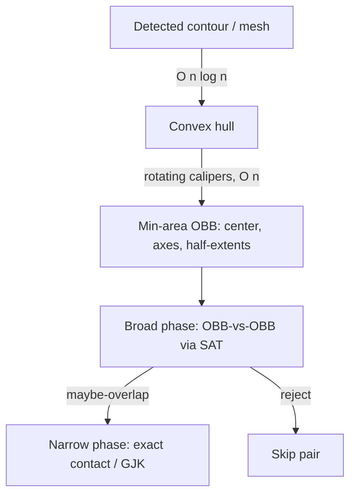
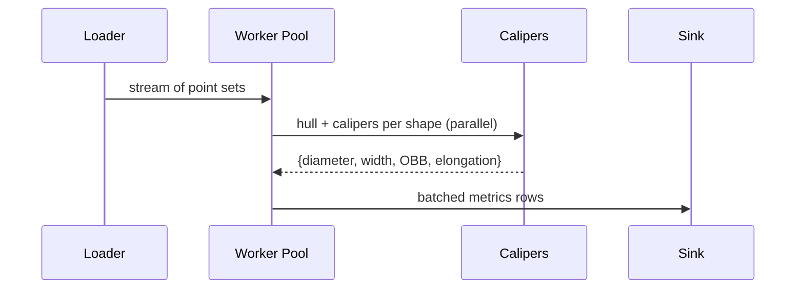
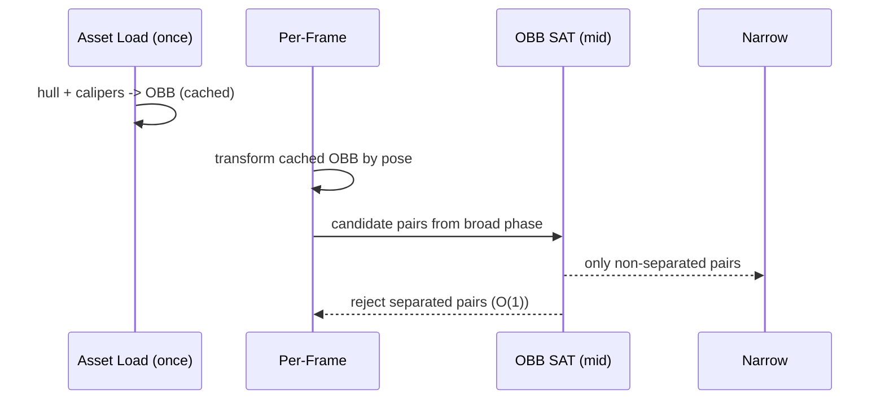

# Rotating Calipers — Senior Level

> **One-line summary:** At the senior level, rotating calipers stops being a single function and becomes a **building block in a system**: the oriented-bounding-box (OBB) generator in a physics/collision pipeline, the shape-metric extractor in a GIS or vision batch job, the footprint-fitter in robotics. The senior questions are about **robustness** (floating point vs exact arithmetic), **throughput** (batch-processing millions of shapes), and **failure modes** (degenerate hulls, near-collinear points, the convexity precondition under real-world noisy data).

---

## Table of Contents

1. [Introduction](#introduction)
2. [System Design: Collision and Min-Bounding-Box](#system-design-collision-and-min-bounding-box)
3. [Batch Shape Processing](#batch-shape-processing)
4. [Robustness: Floating Point vs Exact Arithmetic](#robustness-floating-point-vs-exact-arithmetic)
5. [Comparison with Alternatives](#comparison-with-alternatives)
6. [Architecture Patterns](#architecture-patterns)
7. [Code Examples](#code-examples)
8. [Observability](#observability)
9. [Failure Modes](#failure-modes)
10. [Summary](#summary)

---

## Introduction

> Focus: "How do I architect a system around rotating calipers, and keep it correct and fast at scale?"

A senior engineer rarely writes a one-off diameter call. Instead, rotating calipers sits inside a larger flow:

- A **2D physics engine** computes an **oriented bounding box (OBB)** per body each frame (or once at load), to feed a broad-phase collision filter.
- A **GIS pipeline** ingests millions of building footprints and emits shape metrics — diameter, width, elongation (diameter/width), minimum bounding rectangle — for clustering and anomaly detection.
- A **robotics / warehouse** system fits the tightest rectangle around a detected object so a gripper or a packing planner knows its true footprint and orientation.
- A **computer-vision** stage takes a segmentation mask's contour, hulls it, and derives an OBB to normalize the crop before classification.

In all of these the calipers math is trivial; the engineering is in feeding it **valid convex input**, doing so **fast and in parallel**, and **trusting the result** despite floating-point noise and degenerate geometry. This file is about those concerns.

---

## System Design: Collision and Min-Bounding-Box

In collision detection you almost never test exact polygon-vs-polygon contact for every pair — that is `O(pairs × n × m)`. Instead you build a cheap **bounding volume** per object and do a fast **broad phase** that rejects the vast majority of pairs. Two common volumes:

| Volume | Tightness | Build cost | Overlap test |
|--------|-----------|------------|--------------|
| AABB (axis-aligned box) | Loose for rotated shapes | `O(n)` | Trivial (interval overlap) |
| **OBB (oriented box, from calipers)** | Tight (min-area) | `O(n log n)` hull + `O(n)` calipers | SAT, `O(1)` for boxes |
| Bounding circle | Rotation-invariant, loose | `O(n)` (Welzl) | Trivial |

The **OBB from the minimum-area enclosing rectangle** is the sweet spot when shapes are elongated and rotated: it hugs the object far tighter than an AABB, so the broad phase rejects more pairs and the narrow phase runs less often.



The OBB is stored as a center, a rotation (the edge direction that won the minimum), and two half-extents — compact and cache-friendly. Rebuild it only when the shape *deforms*; for rigid bodies you compute it once and just transform it each frame.

---

## Batch Shape Processing

GIS and vision workloads run calipers over **huge collections** of independent shapes. This is embarrassingly parallel: each shape's hull and calipers are independent, so you fan out across cores or workers.

Design principles for a batch pipeline:

1. **Hull is the bottleneck, not calipers.** Profile and optimize hull construction (sorting dominates). Calipers is linear and rarely the hot path.
2. **Reuse buffers.** Per-shape allocations (the hull array, projection scratch) kill throughput at scale — pool them per worker.
3. **Partition by size.** A few giant polygons can dominate wall-clock; bucket shapes by vertex count and balance work across workers.
4. **Emit derived metrics together.** One sweep can produce diameter, width, elongation, and the OBB — do not run four separate passes.
5. **Make the convexity contract explicit.** Upstream stages must deliver clean, deduplicated, CCW hulls or the calipers stage must hull defensively.



---

## Robustness: Floating Point vs Exact Arithmetic

This is the heart of senior-level computational geometry. The cross product is a difference of products; with floating-point coordinates it can return a **wrong sign** when the true value is near zero (three nearly-collinear points). A wrong sign in the calipers advance condition can:

- stall the antipodal pointer (infinite loop), or
- advance it past the true antipodal vertex (wrong diameter/width).

Mitigation strategies, in increasing order of safety:

| Strategy | Cost | When to use |
|----------|------|-------------|
| Integer coordinates + integer cross | Free, exact | Inputs are grid/snapped (GIS tiles, pixel masks) |
| Epsilon comparisons (`> eps`, `< -eps`) | Cheap | General float input, tolerant applications |
| Robust orientation predicates (Shewchuk adaptive) | Moderate | High-reliability geometry kernels |
| Rational / big-integer arithmetic | Expensive | Exactness mandatory (CAD, verification) |

The pragmatic senior choice for most pipelines: **snap coordinates to a fine integer grid** (e.g. micrometers, or pixel×1000) and run the entire calipers loop in 64-bit integers, comparing **squared** distances. This makes the inner loop exact *and* fast, and removes the epsilon-tuning rabbit hole. Only the final perpendicular distances (width) need a divide and thus a float.

Always add a **loop-iteration guard**: the antipodal pointer can advance at most `O(n)` times total; if it exceeds `2n` advances, you have a degenerate/non-convex input — fail loudly rather than spin.

---

## Comparison with Alternatives

| Attribute | Rotating Calipers (OBB) | AABB | GJK | Min Enclosing Circle |
|-----------|-------------------------|------|-----|----------------------|
| Tightness on rotated shapes | Excellent | Poor | n/a (distance only) | Rotation-invariant |
| Build cost | `O(n log n)` | `O(n)` | n/a | `O(n)` expected |
| Pairwise overlap test | `O(1)` (SAT on boxes) | `O(1)` | `O(n+m)` per pair | `O(1)` |
| Gives orientation | Yes | No | No | No |
| Exact with integers | Yes | Yes | Hard | Hard |
| Best for | Tight broad-phase, shape metrics | Cheap first filter | Exact convex distance | Rotation-invariant bound |

Production reality: many engines use a **layered** filter — broad AABB pass, then OBB (calipers) pass, then GJK narrow phase. Calipers is the middle, tight-but-still-cheap layer.

---

## Architecture Patterns

### Precompute-and-cache

For rigid bodies the OBB is shape-intrinsic. Compute it **once at asset load**, store `(center, axisAngle, halfExtents)`, and at runtime transform that box by the body's pose — no recalipers per frame.

### Defensive hulling at the boundary

The calipers stage should **not trust** upstream. Wrap it so it (a) hulls the input, (b) dedupes and removes collinear points, (c) orients CCW, and (d) guards the pointer iteration count. Upstream noise then cannot corrupt downstream metrics.

### One sweep, many metrics

Expose a single `analyze(hull) -> ShapeMetrics{diameter, width, obb, elongation, perimeter}` so callers pay for the hull and the sweep once.

---

## Code Examples

### Thread-Safe / Concurrent Batch Analyzer

#### Go

```go
package main

import (
	"runtime"
	"sync"
)

type Metrics struct {
	Diameter2 int64
	Width     float64
	// OBB fields omitted for brevity
}

// analyze runs hull + calipers on one point set. Assumes a hull+diameter2+width
// helper set (see junior/middle). Pure function — safe to call concurrently.
func analyze(points []Pt) Metrics {
	hull := convexHull(points) // O(n log n)
	return Metrics{
		Diameter2: diameter2I(hull), // O(n) integer
		Width:     widthF(hull),     // O(n)
	}
}

// AnalyzeBatch fans out over a worker pool; each shape is independent.
func AnalyzeBatch(shapes [][]Pt) []Metrics {
	out := make([]Metrics, len(shapes))
	var wg sync.WaitGroup
	ch := make(chan int, len(shapes))
	for i := range shapes {
		ch <- i
	}
	close(ch)
	workers := runtime.NumCPU()
	for w := 0; w < workers; w++ {
		wg.Add(1)
		go func() {
			defer wg.Done()
			for i := range ch {
				out[i] = analyze(shapes[i]) // distinct indices, no lock needed
			}
		}()
	}
	wg.Wait()
	return out
}
```

#### Java

```java
import java.util.*;
import java.util.concurrent.*;
import java.util.stream.*;

public class BatchAnalyzer {
    record Metrics(long diameter2, double width) {}

    // Pure per-shape analysis; safe to run in parallel.
    static Metrics analyze(List<Pt> points) {
        List<Pt> hull = convexHull(points);          // O(n log n)
        return new Metrics(diameter2(hull), width(hull)); // O(n) each
    }

    static List<Metrics> analyzeBatch(List<List<Pt>> shapes) {
        // parallelStream gives a fork-join fan-out; each element independent.
        return shapes.parallelStream()
                     .map(BatchAnalyzer::analyze)
                     .collect(Collectors.toList());
    }
}
```

#### Python

```python
from concurrent.futures import ProcessPoolExecutor

def analyze(points):
    """Pure per-shape analysis: hull + calipers. Picklable for processes."""
    hull = convex_hull(points)          # O(n log n)
    return {
        "diameter2": diameter2(hull),    # O(n)
        "width": width(hull),            # O(n)
    }

def analyze_batch(shapes):
    # Use processes to dodge the GIL for CPU-bound geometry.
    with ProcessPoolExecutor() as pool:
        return list(pool.map(analyze, shapes))
```

**Key point:** each shape's analysis is a **pure function** with no shared state, so concurrency is trivial — no locks, just a fan-out. The only shared structure (`out` in Go) is written at distinct indices.

---

### Robust pointer guard

#### Go

```go
func diameter2Safe(p []Pt) (int64, error) {
	n := len(p)
	if n < 2 {
		return 0, nil
	}
	best, j, advances := int64(0), 1, 0
	for i := 0; i < n; i++ {
		ni := (i + 1) % n
		for cross(p[i], p[ni], p[(j+1)%n]) > cross(p[i], p[ni], p[j]) {
			j = (j + 1) % n
			advances++
			if advances > 2*n { // monotone pointer can advance at most ~n
				return 0, fmt.Errorf("non-convex or degenerate input")
			}
		}
		best = max64(best, dist2(p[i], p[j]), dist2(p[ni], p[j]))
	}
	return best, nil
}
```

#### Java

```java
static long diameter2Safe(Pt[] p) {
    int n = p.length;
    if (n < 2) return 0;
    long best = 0; int j = 1, advances = 0;
    for (int i = 0; i < n; i++) {
        int ni = (i + 1) % n;
        while (cross(p[i], p[ni], p[(j+1)%n]) > cross(p[i], p[ni], p[j])) {
            j = (j + 1) % n;
            if (++advances > 2 * n)
                throw new IllegalArgumentException("non-convex or degenerate input");
        }
        best = Math.max(best, Math.max(dist2(p[i], p[j]), dist2(p[ni], p[j])));
    }
    return best;
}
```

#### Python

```python
def diameter2_safe(p):
    n = len(p)
    if n < 2:
        return 0
    best, j, advances = 0, 1, 0
    for i in range(n):
        ni = (i + 1) % n
        while cross(p[i], p[ni], p[(j+1) % n]) > cross(p[i], p[ni], p[j]):
            j = (j + 1) % n
            advances += 1
            if advances > 2 * n:
                raise ValueError("non-convex or degenerate input")
        best = max(best, dist2(p[i], p[j]), dist2(p[ni], p[j]))
    return best
```

**Why it matters:** the guard turns a silent infinite loop (the worst production failure mode) into a loud, debuggable error.

---

## Case Study: OBB Broad-Phase in a 2D Physics Engine

Consider a top-down game with thousands of rotated sprites (ships, asteroids, debris). Naive collision is `O(bodies²)` exact tests — unaffordable. The layered pipeline:

1. **Asset load:** for each sprite's collision contour, hull it once, run calipers → store an OBB as `(localCenter, localAxisAngle, halfU, halfN)`. This is shape-intrinsic, computed once.
2. **Per frame:** transform each OBB by the body's world pose (a cheap rotate+translate) — **no recalipers**.
3. **Broad phase:** a spatial grid or sweep-and-prune over OBB world-AABBs yields candidate pairs.
4. **Mid phase:** OBB-vs-OBB via the Separating Axis Theorem (SAT) — `O(1)` per pair, 4 axes for two boxes.
5. **Narrow phase:** only surviving pairs get exact polygon contact / manifold generation.

The calipers OBB is what makes step 4 both **tight** and **`O(1)`**. Replacing it with an AABB at step 1 would balloon the candidate set for elongated, rotated bodies — a thin rotated plank has an AABB many times its true area, generating spurious mid-phase work every frame.



**Lesson:** the expensive `O(n log n)` hull is amortized to *zero per frame* by caching. Calipers earns its keep precisely because its output is reusable across the object's whole lifetime.

---

## Capacity and Cost Model

For a batch GIS pipeline processing `S` shapes averaging `n̄` vertices each:

```text
Total cost ≈ S · ( c_hull · n̄ log n̄  +  c_cal · n̄ )   with c_hull >> c_cal.

Wall-clock with W workers ≈ Total / W   (near-linear speedup; shapes
independent, no contention).

Memory per worker ≈ O(max n̄)  (one hull buffer + scratch, pooled and reused).
```

Worked example: `S = 5,000,000` building footprints, `n̄ = 30` vertices, `W = 32` cores. The hull cost dominates; calipers adds a few percent. Because each shape is a pure, independent unit of work, throughput scales almost linearly in `W` until you saturate memory bandwidth or the input reader. The right first optimization is almost always **buffer pooling** (kill per-shape allocations), not micro-optimizing the calipers loop.

| Knob | Effect | When to turn it |
|------|--------|-----------------|
| Buffer pooling | Removes GC/alloc pressure | Always at batch scale |
| Integer coords | Exactness + speed (no float) | Inputs snappable to a grid |
| Size partitioning | Balances worker load | A few huge shapes skew wall-clock |
| `O(n)` 4-pointer rect | Replaces `O(n²)` projection | Large `n` and rect is hot |

---

## Integer-Snapped Robust OBB (Production Sketch)

The senior recommendation — snap to a grid, compute exactly — in code. The hull and antipodal search run in integers; only the final extents (which require a divide for the unit axis) touch floats.

#### Go

```go
package main

import "fmt"

type Pt struct{ X, Y int64 }

// snap quantizes float coords to a fine integer grid (e.g. micrometers).
func snap(x, y float64, scale float64) Pt {
	return Pt{int64(x*scale + 0.5), int64(y*scale + 0.5)}
}

// minRectArea2 returns 2x the minimum enclosing-rectangle "area numerator"
// in squared grid units, computed exactly with integer projections.
// (Illustrative: the O(n) four-pointer version replaces the inner loop.)
func minRectArea2(hull []Pt) int64 {
	n := len(hull)
	if n < 3 {
		return 0
	}
	best := int64(1<<62)
	for i := 0; i < n; i++ {
		a, b := hull[i], hull[(i+1)%n]
		ex, ey := b.X-a.X, b.Y-a.Y // edge vector (integer)
		var minU, maxU, minN, maxN int64
		first := true
		for _, q := range hull {
			u := (q.X-a.X)*ex + (q.Y-a.Y)*ey // dot with edge dir
			nv := (q.X-a.X)*(-ey) + (q.Y-a.Y)*ex
			if first {
				minU, maxU, minN, maxN = u, u, nv, nv
				first = false
			} else {
				if u < minU { minU = u }
				if u > maxU { maxU = u }
				if nv < minN { minN = nv }
				if nv > maxN { maxN = nv }
			}
		}
		// spans are in units of |edge|; area scales by |edge|^2, but the
		// COMPARISON across edges needs normalization — divide once at the end.
		spanU, spanN := maxU-minU, maxN-minN
		edge2 := ex*ex + ey*ey
		// area = (spanU/|e|)*(spanN/|e|) = spanU*spanN / edge2
		area := spanU * spanN / edge2 // integer divide; exact enough after snap
		if area < best {
			best = area
		}
	}
	return best
}

func main() {
	hull := []Pt{{0, 0}, {4, 0}, {4, 2}, {0, 2}}
	fmt.Println("min rect area ≈", minRectArea2(hull)) // ≈ 8
}
```

#### Java

```java
public class IntOBB {
    record Pt(long x, long y) {}

    static long minRectArea(Pt[] hull) {
        int n = hull.length;
        if (n < 3) return 0;
        long best = Long.MAX_VALUE;
        for (int i = 0; i < n; i++) {
            Pt a = hull[i], b = hull[(i+1)%n];
            long ex = b.x()-a.x(), ey = b.y()-a.y();
            long minU=0, maxU=0, minN=0, maxN=0; boolean first = true;
            for (Pt q : hull) {
                long u  = (q.x()-a.x())*ex + (q.y()-a.y())*ey;
                long nv = (q.x()-a.x())*(-ey) + (q.y()-a.y())*ex;
                if (first) { minU=maxU=u; minN=maxN=nv; first=false; }
                else {
                    minU=Math.min(minU,u); maxU=Math.max(maxU,u);
                    minN=Math.min(minN,nv); maxN=Math.max(maxN,nv);
                }
            }
            long edge2 = ex*ex + ey*ey;
            long area = (maxU-minU)*(maxN-minN) / edge2;
            best = Math.min(best, area);
        }
        return best;
    }

    public static void main(String[] args) {
        Pt[] hull = { new Pt(0,0), new Pt(4,0), new Pt(4,2), new Pt(0,2) };
        System.out.println("min rect area ≈ " + minRectArea(hull)); // ≈ 8
    }
}
```

#### Python

```python
def min_rect_area(hull):
    n = len(hull)
    if n < 3:
        return 0
    best = float("inf")
    for i in range(n):
        a, b = hull[i], hull[(i + 1) % n]
        ex, ey = b[0]-a[0], b[1]-a[1]
        us, ns = [], []
        for q in hull:
            us.append((q[0]-a[0])*ex + (q[1]-a[1])*ey)
            ns.append((q[0]-a[0])*(-ey) + (q[1]-a[1])*ex)
        edge2 = ex*ex + ey*ey
        area = (max(us)-min(us)) * (max(ns)-min(ns)) / edge2
        best = min(best, area)
    return best

if __name__ == "__main__":
    hull = [(0, 0), (4, 0), (4, 2), (0, 2)]
    print("min rect area ≈", min_rect_area(hull))  # ≈ 8
```

**Why integers:** every projection and span is an exact 64-bit integer, so there is no epsilon to tune and no sign-flip risk in the comparisons. The single divide at the end normalizes across edges of different lengths; after grid-snapping, the residual error is bounded by the grid resolution, which you choose. For a true `O(n)` pipeline, swap the inner projection loop for the four monotone pointers — the integer arithmetic carries over unchanged.

---

## Observability

| Metric | Why | Alert / Action |
|--------|-----|----------------|
| `hull_build_latency_p99` | Hull dominates cost | Spike → input not deduped, or pathological size |
| `calipers_advance_overflow_count` | Pointer exceeded `2n` | Any non-zero → non-convex/degenerate input upstream |
| `shapes_with_lt3_vertices` | Degenerate shapes | High rate → upstream segmentation noise |
| `elongation_ratio` (diameter/width) distribution | Shape-metric sanity | Drift → data quality regression |
| `batch_throughput_shapes_per_sec` | Pipeline health | Drop → allocation pressure / GC |

Log the **input vertex count, hull vertex count, and number of pointer advances** per shape at debug level; these three numbers diagnose almost every calipers bug.

---

## Failure Modes

- **Non-convex input slips through:** monotone march breaks → wrong metrics or infinite loop. *Mitigation:* defensive hull + pointer guard.
- **Near-collinear points + floats:** cross-product sign flips → wrong antipodal vertex. *Mitigation:* integer coordinates / robust predicates / epsilon.
- **Degenerate shapes (0/1/2 vertices, all collinear):** divide-by-zero in width, meaningless OBB. *Mitigation:* early-return special cases.
- **Memory pressure at batch scale:** per-shape allocations → GC thrash. *Mitigation:* buffer pools, reuse hull arrays.
- **Hot, huge polygons:** one million-vertex shape stalls a worker. *Mitigation:* size-based partitioning / work stealing.
- **Stale cached OBB after deformation:** cached box no longer fits. *Mitigation:* invalidate cache on geometry change, not on pose change.

---

## Summary

At senior level, rotating calipers is a component, not a function. It generates **tight oriented bounding boxes** for collision broad-phase, extracts **shape metrics** at batch scale, and fits **footprints** for robotics. The engineering challenges are **robustness** (prefer integer/exact arithmetic; guard the monotone pointer against degenerate input), **throughput** (the hull is the bottleneck; calipers is linear and parallelizes trivially since each shape is independent), and **disciplined failure handling** (defensive hulling, iteration guards, observability on advance-overflow and degenerate-shape rates). Master those and the linear sweep becomes a dependable workhorse across physics, GIS, vision, and robotics.

---

**Next step:** Continue to [`professional.md`](./professional.md) for the formal foundations — the `O(n)` antipodal-pairs bound, correctness proofs that the diameter and width are realized by parallel supporting lines, and a rigorous account of why convexity is required.
