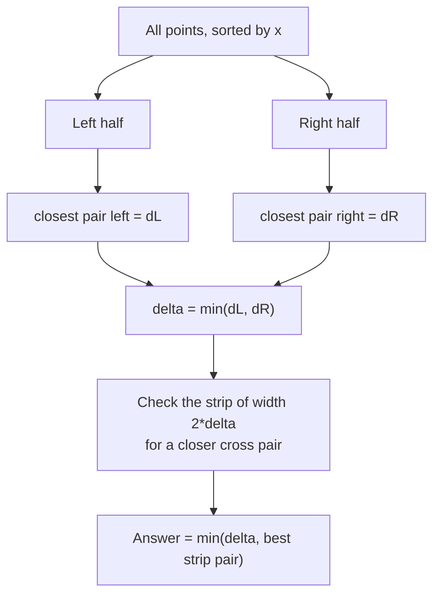
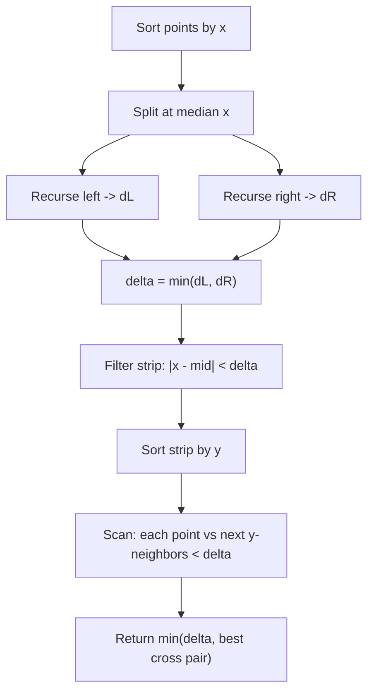

# Closest Pair of Points — Junior Level

> **One-line summary:** Given `n` points in the 2-D plane, the **closest-pair** problem asks for the two points whose Euclidean distance is the smallest. The naive way checks every pair in `O(n²)`; the classic **divide-and-conquer** algorithm sorts, splits by a vertical median line, recurses on each half, and then cleverly inspects only a thin **strip** around the dividing line — bringing the whole thing down to `O(n log n)`.

---

## Table of Contents

1. [Introduction](#introduction)
2. [Prerequisites](#prerequisites)
3. [Glossary](#glossary)
4. [Core Concepts](#core-concepts)
5. [Big-O Summary](#big-o-summary)
6. [Real-World Analogies](#real-world-analogies)
7. [Pros & Cons](#pros--cons)
8. [Step-by-Step Walkthrough](#step-by-step-walkthrough)
9. [Code Examples](#code-examples)
10. [Coding Patterns](#coding-patterns)
11. [Error Handling](#error-handling)
12. [Performance Tips](#performance-tips)
13. [Best Practices](#best-practices)
14. [Edge Cases & Pitfalls](#edge-cases--pitfalls)
15. [Common Mistakes](#common-mistakes)
16. [Cheat Sheet](#cheat-sheet)
17. [Visual Animation](#visual-animation)
18. [Summary](#summary)
19. [Further Reading](#further-reading)

---

## Introduction

Imagine you scatter a handful of dots on a sheet of paper and ask: *which two dots are nearest to each other?* That is the **closest pair of points** problem. It sounds trivial — just eyeball it — but a computer cannot eyeball; it has to measure distances. And when you have not ten dots but ten *million* (think: aircraft on a radar screen, stars in a sky survey, or cell-tower coordinates), the way you measure matters enormously.

The brute-force answer is honest and obvious: measure the distance between **every** pair of points and keep the smallest. With `n` points there are `n(n-1)/2` pairs, so this is `O(n²)`. For `n = 1,000` that is half a million distance computations — fine. For `n = 1,000,000` it is half a *trillion* — hopeless.

In 1975 **Michael Shamos and Dan Hoey** published a beautiful **divide-and-conquer** algorithm that solves the same problem in `O(n log n)`. The strategy mirrors merge sort: split the points into a left half and a right half by a vertical line, find the closest pair *inside* each half recursively, and then — this is the clever part — check whether some pair *straddling* the line is even closer. The straddling check looks like it should cost `O(n²)` again, but a geometric argument shows that each point only needs to be compared against a **constant** number of neighbors (famously at most 7). That constant is what saves the day.

This topic is one of the founding results of **computational geometry**, and it is the cleanest example of how a geometric insight (the "strip" argument) turns a quadratic problem into a near-linear one. We will build it up gently: brute force first, then the divide-and-conquer idea with a small hand-traced example.

A useful mental anchor: **closest pair is "merge sort that measures distances instead of ordering numbers."** Same split, same recursion depth, same `log n` levels — but the *combine* step measures a thin strip rather than merging two sorted lists.

---

## Prerequisites

Before reading this file you should be comfortable with:

- **2-D coordinates** — a point is a pair `(x, y)` of numbers. Basic plane geometry.
- **The distance formula** — `dist((x1,y1),(x2,y2)) = sqrt((x1-x2)² + (y1-y2)²)`.
- **Arrays / slices / lists** — storing and iterating over points.
- **Sorting** — `O(n log n)` comparison sorting, and the idea of sorting by a key.
- **Recursion** — a function that calls itself on smaller inputs. (See *15-divide-and-conquer*.)
- **Big-O notation** — `O(n²)`, `O(n log n)`, `O(n)`.

Optional but helpful:

- Having seen **merge sort** (sibling topic *07-sorting-algorithms/02-merge-sort*) — the recursion shape is identical.
- A rough sense of "median" — the middle value that splits a set into two equal halves.

---

## Glossary

| Term | Meaning |
|------|---------|
| **Point** | A coordinate pair `(x, y)` in the plane. |
| **Euclidean distance** | Straight-line distance `sqrt(dx² + dy²)` between two points. |
| **Squared distance** | `dx² + dy²` — distance without the square root; cheaper and order-preserving. |
| **Closest pair** | The two distinct points with the minimum Euclidean distance among all pairs. |
| **Brute force** | Compare all `n(n-1)/2` pairs; `O(n²)`. |
| **Divide and conquer** | Split the problem in half, solve each half, combine the answers. |
| **Median x** | The vertical line `x = mid` that splits the points into two equal-size halves. |
| **delta (δ)** | The smallest distance found so far (from the two recursive halves). |
| **Strip** | The vertical band of width `2δ` centered on the dividing line; the only place a closer cross-pair can live. |
| **The 7-point bound** | Inside the strip, each point needs to be checked against at most 7 following points (sorted by `y`). |
| **Cross pair** | A pair with one point on the left of the line and one on the right. |

---

## Core Concepts

### 1. Distance: use the *squared* distance

The Euclidean distance between `p = (px, py)` and `q = (qx, qy)` is:

```
dist(p, q) = sqrt((px - qx)² + (py - qy)²)
```

Computing a square root is slow and can introduce floating-point error. Notice that `sqrt` is **monotonic**: if `a² < b²` then `a < b`. So when you only need to *compare* distances or find a *minimum*, you can work with **squared distance** `dx² + dy²` and skip the `sqrt` entirely — only taking the square root once at the very end if the actual distance is required. This is a small but universal optimization in geometry code.

### 2. Brute force — the honest baseline

The simplest correct algorithm:

```
best = infinity
for i in 0..n-1:
    for j in i+1..n-1:
        d = dist(points[i], points[j])
        if d < best:
            best = d
            pair = (points[i], points[j])
return best, pair
```

Two nested loops over `n` points → `O(n²)` distance computations. Always write this first: it is your **ground truth** to test the fast algorithm against.

### 3. Divide and conquer — the big idea

Sort the points by `x`. Draw a vertical line at the **median x** so that half the points are on the left and half on the right. Now:

1. **Divide:** recursively find the closest pair on the **left** half → distance `dL`.
2. **Conquer:** recursively find the closest pair on the **right** half → distance `dR`.
3. **Combine:** let `delta = min(dL, dR)`. The true closest pair is either one of these two *or* a **cross pair** straddling the line. We only have to look for a cross pair that beats `delta`.



### 4. The strip — why the combine step is cheap

Here is the magic. Any cross pair closer than `delta` must have **both** points within horizontal distance `delta` of the dividing line — otherwise their `x`-gap alone already exceeds `delta`. So we throw away every point further than `delta` from the line and keep only those inside the **strip** of width `2δ`.

That alone is not enough (the strip could still hold many points). The second insight: **sort the strip points by `y`**, then for each point you only need to compare it against the **next few** points in `y`-order. Because each side of the strip is a `delta × delta` square that can hold only a bounded number of points that are mutually at least `delta` apart, each point has at most **7 candidates** ahead of it. So the strip check is `O(n)`, not `O(n²)`.

We will prove the 7-bound carefully in `middle.md` and `professional.md`; for now, trust that "each point compares to a constant number of `y`-neighbors."

### 5. Putting the pieces together: the recurrence

The split is `O(1)` (we pre-sort once), the two recursive calls handle `n/2` points each, and the combine (build strip + scan with constant comparisons) is `O(n)`. That gives:

```
T(n) = 2·T(n/2) + O(n)
```

which, exactly like merge sort, solves to **`O(n log n)`**.

---

## Big-O Summary

| Approach | Time | Space | Notes |
|----------|------|-------|-------|
| Brute force | **O(n²)** | O(1) | Check every pair. Simple; the testing oracle. |
| Divide and conquer | **O(n log n)** | O(n) | Split by median x, strip combine. The classic. |
| Sweep line + ordered set | **O(n log n)** | O(n) | Sort by x, keep a `y`-ordered window. |
| Randomized grid (Rabin) | **O(n) expected** | O(n) | Hash points into a grid of cell size δ. (See `senior.md`.) |
| One distance computation | O(1) | — | The inner operation. |

> `n` = number of points. The lower bound for any comparison/algebraic-tree algorithm is **Ω(n log n)** (proven in `professional.md`), so `O(n log n)` is essentially optimal in that model; the randomized `O(n)` escapes it by using hashing.

---

## Real-World Analogies

| Concept | Analogy |
|---------|---------|
| Closest pair | Air-traffic control: of all aircraft on the radar, which **two** are dangerously near each other? |
| Brute force | Asking every person in a room to measure their distance to every other person — exhausting as the room fills. |
| Divide by median line | Splitting a crowded hall down the middle with a rope and handling each side separately. |
| The delta strip | After checking each side, you only worry about people *standing near the rope* who might be closer to someone on the other side. |
| The 7-point bound | Near the rope, you only need to glance at the handful of people right next to you in line, not everyone. |
| Squared distance | Comparing "how far" without bothering to compute exact meters — ranking is all you need. |

Where the analogies break: real radar and crowds are continuous and dynamic; the basic algorithm assumes a fixed, static set of points and recomputes from scratch.

---

## Pros & Cons

| Pros | Cons |
|------|------|
| Divide-and-conquer is `O(n log n)` — handles millions of points. | More code and more subtle than brute force; easy to get the strip wrong. |
| Brute force is trivially correct — perfect testing oracle. | Brute force is `O(n²)` — useless beyond a few thousand points. |
| The strip argument is a classic, reusable geometric idea. | Floating-point distances need care (ties, precision). |
| Squared distance avoids `sqrt` and its rounding error. | Recursion uses `O(log n)` stack depth (fine, but not zero). |
| Generalizes to higher dimensions and to the sweep-line variant. | The randomized `O(n)` method needs a good hash and degrades adversarially. |

**When to use:** any "nearest two among many" query — collision/proximity detection, clustering seeds, map/GIS proximity, deduplicating near-identical coordinates.

**When NOT to use:** if you also need *every* point's nearest neighbor repeatedly, or range/nearest queries on a changing set — build a **k-d tree** (sibling *04-kd-tree*) instead. For tiny `n` (say `< 50`), brute force is simpler and faster.

---

## Step-by-Step Walkthrough

Take 8 points (already labeled). We will trace the divide-and-conquer algorithm.

```
Points: A(1,3) B(2,7) C(3,1) D(5,5) E(6,8) F(7,2) G(8,6) H(9,4)
```

**Step 1 — Sort by x.** They are already sorted by `x`: A, B, C, D, E, F, G, H.

**Step 2 — Split at the median.** With 8 points the line falls between D (x=5) and E (x=6); say `mid_x = 5.5`. Left = {A,B,C,D}, Right = {E,F,G,H}.

```
   y
 8 |        B*           E*
 7 |
 6 |                          G*
 5 |              D*
 4 |                              H*
 3 |  A*
 2 |                      F*
 1 |        C*
   +------------------------------ x
      1  2  3  4  5 | 6  7  8  9
                  line x=5.5
```

**Step 3 — Recurse left {A,B,C,D}.** Closest pair on the left turns out to be... let us check the close ones. `dist(A,C)=sqrt((1-3)²+(3-1)²)=sqrt(8)≈2.83`. `dist(B,D)=sqrt(9+4)=sqrt(13)≈3.61`. The left minimum `dL ≈ 2.83` (pair A–C).

**Step 4 — Recurse right {E,F,G,H}.** `dist(G,H)=sqrt(1+4)=sqrt(5)≈2.24`. `dist(E,G)=sqrt(4+4)=sqrt(8)≈2.83`. The right minimum `dR ≈ 2.24` (pair G–H).

**Step 5 — Combine.** `delta = min(2.83, 2.24) = 2.24`. Build the strip: keep points within `2.24` of `x=5.5`, i.e. `x` between `3.26` and `7.74`. That keeps D(5,5), E(6,8), F(7,2). (C at x=3 and G at x=8 are just outside.)

**Step 6 — Scan the strip by y.** Sort strip by `y`: F(7,2), D(5,5), E(6,8). For each, compare only with the next points whose `y` is within `delta`:
- F(7,2) vs D(5,5): `dy = 3 > 2.24` → stop early (no closer cross pair from F).
- D(5,5) vs E(6,8): `dy = 3 > 2.24` → stop.

No cross pair beats `delta`. **Answer:** the closest pair is **G–H** with distance `≈ 2.24`.

Notice how the strip filtered 8 points down to 3, and the `y`-sorted scan stopped after one comparison each. That bounded work is the whole point.

---

## Code Examples

### Example 1: Brute force (the baseline / testing oracle)

#### Go

```go
package main

import (
	"fmt"
	"math"
)

type Point struct{ X, Y float64 }

func sqDist(a, b Point) float64 {
	dx, dy := a.X-b.X, a.Y-b.Y
	return dx*dx + dy*dy // squared distance — no sqrt
}

// BruteForce returns the closest pair and their (true) distance. O(n^2).
func BruteForce(pts []Point) (Point, Point, float64) {
	best := math.Inf(1)
	var p, q Point
	for i := 0; i < len(pts); i++ {
		for j := i + 1; j < len(pts); j++ {
			d := sqDist(pts[i], pts[j])
			if d < best {
				best, p, q = d, pts[i], pts[j]
			}
		}
	}
	return p, q, math.Sqrt(best) // sqrt only once, at the end
}

func main() {
	pts := []Point{{1, 3}, {2, 7}, {3, 1}, {5, 5}, {6, 8}, {7, 2}, {8, 6}, {9, 4}}
	p, q, d := BruteForce(pts)
	fmt.Printf("closest: %v - %v  dist=%.4f\n", p, q, d) // {8,6}-{9,4} 2.2360...
}
```

#### Java

```java
public class ClosestBrute {
    record Point(double x, double y) {}

    static double sqDist(Point a, Point b) {
        double dx = a.x() - b.x(), dy = a.y() - b.y();
        return dx * dx + dy * dy; // squared distance
    }

    static double bruteForce(Point[] pts) {
        double best = Double.POSITIVE_INFINITY;
        for (int i = 0; i < pts.length; i++)
            for (int j = i + 1; j < pts.length; j++)
                best = Math.min(best, sqDist(pts[i], pts[j]));
        return Math.sqrt(best); // sqrt once
    }

    public static void main(String[] args) {
        Point[] pts = {
            new Point(1,3), new Point(2,7), new Point(3,1), new Point(5,5),
            new Point(6,8), new Point(7,2), new Point(8,6), new Point(9,4)
        };
        System.out.printf("closest dist = %.4f%n", bruteForce(pts)); // 2.2360
    }
}
```

#### Python

```python
import math


def sq_dist(a, b):
    dx, dy = a[0] - b[0], a[1] - b[1]
    return dx * dx + dy * dy  # squared distance — no sqrt


def brute_force(pts):
    """Return (best_dist, (p, q)). O(n^2)."""
    best = math.inf
    pair = None
    n = len(pts)
    for i in range(n):
        for j in range(i + 1, n):
            d = sq_dist(pts[i], pts[j])
            if d < best:
                best, pair = d, (pts[i], pts[j])
    return math.sqrt(best), pair  # sqrt once, at the end


if __name__ == "__main__":
    pts = [(1, 3), (2, 7), (3, 1), (5, 5), (6, 8), (7, 2), (8, 6), (9, 4)]
    d, pair = brute_force(pts)
    print(f"closest: {pair}  dist={d:.4f}")  # ((8,6),(9,4)) 2.2360
```

**What it does:** computes the closest pair by checking all pairs. Slow but unmistakably correct.
**Run:** `go run main.go` | `javac ClosestBrute.java && java ClosestBrute` | `python brute.py`

---

### Example 2: Divide and conquer — `O(n log n)`

#### Go

```go
package main

import (
	"fmt"
	"math"
	"sort"
)

type Point struct{ X, Y float64 }

func dist(a, b Point) float64 {
	dx, dy := a.X-b.X, a.Y-b.Y
	return math.Sqrt(dx*dx + dy*dy)
}

// ClosestPair sorts by x once, then recurses.
func ClosestPair(pts []Point) float64 {
	px := append([]Point(nil), pts...)
	sort.Slice(px, func(i, j int) bool { return px[i].X < px[j].X })
	return rec(px)
}

func rec(px []Point) float64 {
	n := len(px)
	if n <= 3 { // small base case: brute force
		best := math.Inf(1)
		for i := 0; i < n; i++ {
			for j := i + 1; j < n; j++ {
				best = math.Min(best, dist(px[i], px[j]))
			}
		}
		return best
	}
	mid := n / 2
	midX := px[mid].X
	dL := rec(px[:mid])
	dR := rec(px[mid:])
	delta := math.Min(dL, dR)

	// Build the strip: points within delta of the dividing line.
	var strip []Point
	for _, p := range px {
		if math.Abs(p.X-midX) < delta {
			strip = append(strip, p)
		}
	}
	sort.Slice(strip, func(i, j int) bool { return strip[i].Y < strip[j].Y })

	// Scan: each point vs the next few in y-order (at most 7).
	for i := 0; i < len(strip); i++ {
		for j := i + 1; j < len(strip) && strip[j].Y-strip[i].Y < delta; j++ {
			delta = math.Min(delta, dist(strip[i], strip[j]))
		}
	}
	return delta
}

func main() {
	pts := []Point{{1, 3}, {2, 7}, {3, 1}, {5, 5}, {6, 8}, {7, 2}, {8, 6}, {9, 4}}
	fmt.Printf("closest dist = %.4f\n", ClosestPair(pts)) // 2.2360
}
```

#### Java

```java
import java.util.Arrays;

public class ClosestDC {
    record Point(double x, double y) {}

    static double dist(Point a, Point b) {
        double dx = a.x() - b.x(), dy = a.y() - b.y();
        return Math.sqrt(dx * dx + dy * dy);
    }

    static double closestPair(Point[] pts) {
        Point[] px = pts.clone();
        Arrays.sort(px, (a, b) -> Double.compare(a.x(), b.x()));
        return rec(px, 0, px.length);
    }

    static double rec(Point[] px, int lo, int hi) {
        int n = hi - lo;
        if (n <= 3) {
            double best = Double.POSITIVE_INFINITY;
            for (int i = lo; i < hi; i++)
                for (int j = i + 1; j < hi; j++)
                    best = Math.min(best, dist(px[i], px[j]));
            return best;
        }
        int mid = lo + n / 2;
        double midX = px[mid].x();
        double dL = rec(px, lo, mid);
        double dR = rec(px, mid, hi);
        double delta = Math.min(dL, dR);

        // Build strip.
        Point[] strip = new Point[n];
        int s = 0;
        for (int i = lo; i < hi; i++)
            if (Math.abs(px[i].x() - midX) < delta) strip[s++] = px[i];
        Point[] band = Arrays.copyOf(strip, s);
        Arrays.sort(band, (a, b) -> Double.compare(a.y(), b.y()));

        for (int i = 0; i < s; i++)
            for (int j = i + 1; j < s && band[j].y() - band[i].y() < delta; j++)
                delta = Math.min(delta, dist(band[i], band[j]));
        return delta;
    }

    public static void main(String[] args) {
        Point[] pts = {
            new Point(1,3), new Point(2,7), new Point(3,1), new Point(5,5),
            new Point(6,8), new Point(7,2), new Point(8,6), new Point(9,4)
        };
        System.out.printf("closest dist = %.4f%n", closestPair(pts)); // 2.2360
    }
}
```

#### Python

```python
import math


def dist(a, b):
    return math.hypot(a[0] - b[0], a[1] - b[1])


def closest_pair(pts):
    px = sorted(pts, key=lambda p: p[0])  # sort by x once
    return _rec(px)


def _rec(px):
    n = len(px)
    if n <= 3:  # base case: brute force
        return min(
            (dist(px[i], px[j]) for i in range(n) for j in range(i + 1, n)),
            default=math.inf,
        )
    mid = n // 2
    mid_x = px[mid][0]
    delta = min(_rec(px[:mid]), _rec(px[mid:]))

    # Strip: points within delta of the dividing line.
    strip = [p for p in px if abs(p[0] - mid_x) < delta]
    strip.sort(key=lambda p: p[1])  # sort by y

    for i in range(len(strip)):
        j = i + 1
        while j < len(strip) and strip[j][1] - strip[i][1] < delta:
            delta = min(delta, dist(strip[i], strip[j]))
            j += 1
    return delta


if __name__ == "__main__":
    pts = [(1, 3), (2, 7), (3, 1), (5, 5), (6, 8), (7, 2), (8, 6), (9, 4)]
    print(f"closest dist = {closest_pair(pts):.4f}")  # 2.2360
```

**What it does:** sorts by `x` once, recursively splits, and combines via the `delta`-strip — `O(n log n)`.
**Run:** `go run main.go` | `javac ClosestDC.java && java ClosestDC` | `python dc.py`

> Note: the version above re-sorts the strip by `y` inside every recursive call, which adds a `log n` factor and gives `O(n log² n)`. The textbook `O(n log n)` version pre-sorts by `y` once and merges `y`-order during the recursion. Junior level: the `O(n log² n)` version is correct and easy to read; the optimal merge is shown in `middle.md`.

---

## Coding Patterns

### Pattern 1: Squared distance for comparisons

**Intent:** never call `sqrt` inside a loop; defer it to the final answer.

```python
def sq(a, b):
    return (a[0]-b[0])**2 + (a[1]-b[1])**2

best_sq = min(sq(p, q) for p, q in pairs)   # compare squared
answer  = best_sq ** 0.5                     # sqrt exactly once
```

Squaring is monotonic, so the pair minimizing squared distance also minimizes true distance.

### Pattern 2: The `delta`-strip filter

**Intent:** discard points that cannot possibly form a closer cross pair.

```python
strip = [p for p in points if abs(p[0] - mid_x) < delta]
```

Any cross pair closer than `delta` has both endpoints in this band — everything outside is provably too far horizontally.

### Pattern 3: Early-break `y`-scan

**Intent:** turn the strip scan from `O(strip²)` into `O(strip)`.

```python
for i in range(len(strip)):
    j = i + 1
    while j < len(strip) and strip[j].y - strip[i].y < delta:
        delta = min(delta, dist(strip[i], strip[j]))
        j += 1
```

The `while` condition breaks as soon as the `y`-gap reaches `delta`; the 7-point bound guarantees few iterations.



---

## Error Handling

| Error | Cause | Fix |
|-------|-------|-----|
| Wrong answer, off by `sqrt` | Compared squared distances but reported one as the real distance. | Take `sqrt` only at the very end; keep "squared" and "real" clearly separated. |
| Duplicate points → distance 0 | Two identical coordinates. | Distance 0 is a *valid* closest pair; decide whether duplicates count, don't crash. |
| Crash on `n < 2` | No pair exists. | Guard: return `+infinity` / an error for fewer than two points. |
| Strip never filters anything | Used `<=` with a too-large `delta`, or forgot to update `delta` from recursion. | Use `abs(x - mid) < delta` and pass the recursive `delta` in. |
| Infinite recursion | Base case missing or split doesn't shrink. | Base-case at `n <= 3`; ensure `mid` strictly splits. |
| Floating-point ties | Two pairs equally close due to rounding. | Use a small epsilon or exact integer arithmetic if coordinates are integers. |

---

## Performance Tips

- **Pre-sort once.** Sort by `x` a single time at the top, not inside the recursion.
- **Use squared distance** everywhere except the final reported answer.
- **Brute-force the base case.** For `n <= 3` (some use `<= 7`), nested loops are faster than recursing further.
- **Integer coordinates?** Use 64-bit integer squared distance to dodge floating-point entirely — exact and fast.
- **Avoid rebuilding slices.** Pass index ranges `(lo, hi)` instead of slicing arrays in hot recursion.
- **The optimal `O(n log n)`** merges a `y`-sorted list during recursion; the simple version re-sorts the strip and is `O(n log² n)` — usually fine.

---

## Best Practices

- Write **brute force first** and keep it forever as a randomized test oracle against the fast version.
- Decide your **distance metric up front** (Euclidean here; Manhattan/Chebyshev change the strip geometry — see sibling *16-manhattan-chebyshev*).
- Keep the **strip width exactly `2δ`** (`δ` on each side); a wrong width is the classic correctness bug.
- Return both the **distance and the pair** when callers need the points, not just the value.
- Document whether coordinates are **integers or floats**; it dictates exact vs epsilon comparisons.
- Test on **degenerate inputs**: all collinear, all identical, two points, clustered points.

---

## Edge Cases & Pitfalls

- **Fewer than two points** — undefined; return infinity or raise an error explicitly.
- **Duplicate / coincident points** — closest distance is `0`; make sure the loops can report a zero-distance pair.
- **All points on a vertical line** — many points share `x = mid`; the strip can hold them all, but the `y`-scan still bounds work. (Some naive splits break here — split by **rank**, i.e. `n/2`, not by raw `x` value.)
- **All points collinear** — algorithm still works; the strip argument does not assume general position.
- **Very large coordinates** — squared distance can overflow 32-bit integers; use 64-bit or floats.
- **Ties** — multiple equally-close pairs; either is a valid answer unless the spec says otherwise.

---

## Common Mistakes

1. **Reporting squared distance as the real distance** — forgetting the final `sqrt`.
2. **Wrong strip width** — using `delta` on one side only, or `2δ` on each side. It must be `δ` on each side of the line.
3. **Not sorting the strip by `y`** — without `y`-order the early-break trick fails and you slide back to `O(n²)`.
4. **Splitting by `x`-value instead of rank** — duplicate `x` coordinates can put everything on one side, breaking the recurrence.
5. **Re-sorting by `x` inside the recursion** — turns `O(n log n)` into `O(n log² n)` (or worse). Sort by `x` once.
6. **Forgetting the base case** — infinite recursion or wrong results for tiny inputs.
7. **Comparing each strip point against *all* later strip points without the `y`-gap break** — silently quadratic on clustered data.

---

## Cheat Sheet

| Step | What to do |
|------|------------|
| Distance | Use squared `dx²+dy²`; `sqrt` only at the end. |
| Sort | Sort points by `x` **once** at the top. |
| Split | Median by **rank** (`n/2`), line `x = px[mid].x`. |
| Recurse | Closest pair left (`dL`) and right (`dR`). |
| Delta | `delta = min(dL, dR)`. |
| Strip | Keep points with `|x - mid| < delta`. |
| Scan | Sort strip by `y`; each point vs next points while `dy < delta` (≤ 7). |
| Answer | `min(delta, best cross pair)`. |

Complexity:

```
brute force        : O(n^2)
divide & conquer   : O(n log n)   (O(n log^2 n) if strip re-sorted)
sweep line         : O(n log n)
randomized grid    : O(n) expected
lower bound        : Omega(n log n)   (comparison model)
```

Hard rule: **the strip is width `2δ`, scanned in `y`-order with an early break.**

---

## Visual Animation

> See [`animation.html`](./animation.html) for an interactive visual animation of the closest-pair algorithm.
>
> The animation demonstrates:
> - Points plotted in the plane, split by a vertical **median line**
> - The recursion descending into left and right halves
> - The **delta strip** of width `2δ` drawn around the divide
> - The limited (≤ 7) comparisons performed within the strip
> - The **closest pair** highlighted, with a live Big-O table and operation log

---

## Summary

The closest-pair problem — *which two of `n` points are nearest?* — has a trivial `O(n²)` brute-force solution and a beautiful `O(n log n)` divide-and-conquer solution. Sort by `x`, split at the median line, solve each half recursively to get `delta = min(dL, dR)`, then inspect only the **strip** of width `2δ` around the line, where the geometry guarantees each point compares against at most a constant number of `y`-neighbors. Master three ideas and you own this topic: **squared distance** for cheap comparisons, the **median split** like merge sort, and the **`2δ`-strip with the `y`-ordered constant-comparison scan**.

---

## Further Reading

- Shamos, M. I., & Hoey, D. (1975). *Closest-point problems.* FOCS — the original divide-and-conquer result.
- *Introduction to Algorithms* (CLRS), Section 33.4 — "Finding the closest pair of points."
- *Computational Geometry: Algorithms and Applications* (de Berg et al.), Chapter on proximity.
- Rabin, M. O. (1976). *Probabilistic algorithms* — the randomized `O(n)` closest-pair idea.
- Sibling topics: *15-divide-and-conquer* (the recursion pattern), *04-kd-tree* (nearest-neighbor queries), *05-sweep-line* (the sweep variant), *16-manhattan-chebyshev* (other metrics).

---

Next step: [middle.md](./middle.md) — the strip argument and 7-point bound proved, the sweep-line alternative, and a head-to-head with brute force.
