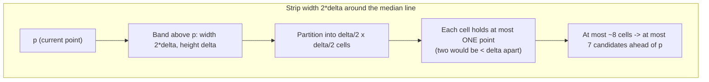
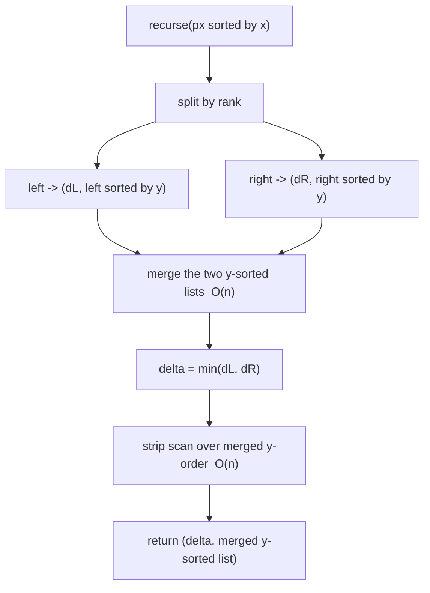

# Closest Pair of Points — Middle Level

> **One-line summary:** The middle level is about *why the strip combine is `O(n)`*. We prove the **`2δ`-strip** argument and the **constant-points-per-cell** bound (the famous "≤ 7" / "≤ 15" comparisons), upgrade the recursion to a true `O(n log n)` by merging a `y`-sorted list, and contrast the divide-and-conquer approach with brute force and the **sweep-line + ordered-set** alternative.

---

## Table of Contents

1. [Introduction](#introduction)
2. [Deeper Concepts](#deeper-concepts)
3. [The Strip Argument, Proved Informally](#the-strip-argument-proved-informally)
4. [Comparison with Alternatives](#comparison-with-alternatives)
5. [Advanced Patterns](#advanced-patterns)
6. [The True O(n log n): Merging by y](#the-true-on-log-n-merging-by-y)
7. [The Sweep-Line Alternative](#the-sweep-line-alternative)
8. [Code Examples](#code-examples)
9. [Error Handling](#error-handling)
10. [Performance Analysis](#performance-analysis)
11. [Best Practices](#best-practices)
12. [Visual Animation](#visual-animation)
13. [Summary](#summary)

---

## Introduction

> Focus: "Why does the combine step run in linear time?" and "When do I pick divide-and-conquer vs sweep-line vs brute force?"

At the junior level we accepted on faith that scanning the strip costs `O(n)` because "each point only compares against a constant number of `y`-neighbors." That single fact is what separates an `O(n log n)` algorithm from a disguised `O(n²)` one, so a middle engineer must be able to *justify* it, not just quote it. This file does three things:

1. **Proves the strip bound** geometrically — why width `2δ`, and why at most 7 (or, with a sloppier packing argument, 15) comparisons per point.
2. **Fixes the recursion** so it is genuinely `O(n log n)` rather than the easy `O(n log² n)` from re-sorting the strip each time.
3. **Compares** the divide-and-conquer method against the **sweep-line + balanced-BST** approach (also `O(n log n)`, often simpler to reason about) and against brute force, so you know which to reach for.

The recurring theme of computational geometry shows up here: a clean *combinatorial packing* fact (you cannot cram too many mutually-far points into a small box) collapses an apparently quadratic step into a linear one.

---

## Deeper Concepts

### Invariant: `delta` is the best distance seen so far

Throughout the recursion, `delta` is maintained as the minimum distance among all pairs **examined to date**: the two recursive sub-answers, then progressively the strip pairs. The combine step only ever *lowers* `delta`. The correctness claim is:

> After the combine step, `delta` equals the true closest-pair distance for the whole point set, *provided* the strip scan examines every cross pair that could possibly be `< delta`.

So all the work goes into proving the strip scan does not miss any such cross pair — that is the strip argument.

### Why width `2δ` and not more

Let `delta = min(dL, dR)`. Suppose some cross pair `(p, q)` with `p` left of the line and `q` right of it is the true global closest, with `dist(p, q) < delta`. Then in particular their **horizontal** separation satisfies `|p.x - q.x| <= dist(p, q) < delta`. Since the dividing line sits between `p.x` and `q.x`, **both** `p` and `q` lie within horizontal distance `delta` of the line. Hence both are in the strip `|x - mid| < delta` (width `2δ`). Any cross pair closer than `delta` is therefore *entirely captured* by the strip; everything outside can be safely ignored.

### Why a constant number of `y`-comparisons per point

This is the heart of the matter. Sort the strip points by `y`. Claim: for a point `p` in the strip, any other strip point `q` with `dist(p, q) < delta` must have `|p.y - q.y| < delta`. So sorting by `y` and scanning forward until the `y`-gap reaches `delta` catches all candidates.

How many such `q` can there be? Consider the `delta × 2δ` rectangle just *above* `p` (height `delta`, spanning the full strip width `2δ`). Split it into a grid of `δ/2 × δ/2` cells — a `4 × 2 = 8`-cell arrangement when you draw it carefully (a `2 × 4` grid of half-`delta` squares covering the `2δ`-wide, `delta`-tall band). **No cell can contain two points**, because two points in the same `δ/2 × δ/2` cell would be within `δ/√2 < δ` of each other — but every pair *within the same side* is already at least `δ` apart (that was the recursive guarantee), and points across the line are at least... well, this is where the careful constant comes from. The upshot: at most a constant number of points (the textbook gives **7** as a tight bound for the forward scan) can lie in that band, so `p` makes at most 7 comparisons.

We give the precise packing argument in `professional.md`; the takeaway for middle level is: **the band above `p` is a fixed-size box, mutually-`δ`-separated points cannot overpopulate a fixed-size box, so the per-point work is `O(1)`.**

---

## The Strip Argument, Proved Informally

Here is the canonical picture. The strip is the gray band; we focus on one point `p` and the band of height `delta` above it.



Step by step:

1. **Restrict horizontally.** A cross pair closer than `delta` has both points in the width-`2δ` strip (shown above).
2. **Restrict vertically.** If `q` is more than `delta` above `p` in `y`, then `dist(p, q) >= |p.y - q.y| > delta`, so `q` cannot beat `delta`. Hence only points within `delta` in `y` matter → scan the `y`-sorted strip with the early break.
3. **Bound the count.** The relevant region for `p` is a `2δ`-wide, `δ`-tall box. Tile it with `δ/2`-side squares. Two points in one square are `< δ` apart. Within the strip, two points on the **same side** of the line are `>= dL >= δ` or `>= dR >= δ` apart; the geometry forces at most one point per square, and the box holds at most 8 squares — so excluding `p` itself, **≤ 7** candidates. Therefore each point does `O(1)` comparisons and the strip scan is `O(strip)` ⊆ `O(n)`.

> **7 vs 15.** Different textbooks quote different constants depending on whether they look only *ahead* in `y` (the forward scan, giving 7) or in *both* directions, and on how generously they tile the box (some get 15, some 6). The exact number is irrelevant to the asymptotics — what matters is that it is a **fixed constant independent of `n`.** Engineers commonly just write `for j in i+1 .. while strip[j].y - strip[i].y < delta` and never count.

---

## Comparison with Alternatives

| Attribute | Divide & Conquer | Brute Force | Sweep Line + Ordered Set |
|-----------|-----------------|-------------|--------------------------|
| Time (worst) | **O(n log n)** | O(n²) | **O(n log n)** |
| Time (typical) | O(n log n) | O(n²) | O(n log n) |
| Space | O(n) | O(1) | O(n) |
| Pre-sort needed | by x (and y) | none | by x |
| Code complexity | Medium–high | Trivial | Medium |
| Constant factor | Moderate (recursion, strip) | Tiny per pair | Moderate (BST ops) |
| Generalizes to k-NN / higher dim | Yes (with effort) | Yes (trivially) | Harder |
| Easiest to prove correct | Strip argument needed | Obvious | Window argument needed |
| Best when | Large static set | n ≲ a few thousand | Large set, prefer iterative |

**Choose divide & conquer when:** you want the classic, want to learn the strip technique, or need a structure that generalizes to related closest-point problems.

**Choose brute force when:** `n` is small (≲ 2,000–5,000), or as the *oracle* to test the fast versions.

**Choose sweep-line when:** you prefer an **iterative, no-recursion** implementation with an off-the-shelf balanced BST / ordered set, and you already sort by `x` for other reasons.

---

## Advanced Patterns

### Pattern: Divide and conquer with rank-based split

**Intent:** split by **median rank** (`n/2` index after sorting by `x`), not by raw `x` value, so duplicate `x`-coordinates cannot dump everything on one side.

#### Go

```go
mid := n / 2          // split by RANK
midX := px[mid].X     // the line x-coordinate (a value, used only for the strip test)
left, right := px[:mid], px[mid:]
```

#### Java

```java
int mid = lo + (hi - lo) / 2;       // split by RANK
double midX = px[mid].x();          // line value for the strip test
```

#### Python

```python
mid = n // 2          # split by RANK
mid_x = px[mid][0]    # line value for the strip filter
```

If you split by the `x`-*value* (e.g. "everything with `x < median_value`"), a column of equal-`x` points could all land on one side, the recurrence degenerates, and you lose the `O(n log n)` guarantee.

### Pattern: Carry the closest *pair*, not just the distance

**Intent:** most callers want the two points, so thread a `(distance, p, q)` triple through the recursion and the strip scan, updating all three together.

```python
def better(a, b):           # a, b are (dist, p, q)
    return a if a[0] <= b[0] else b
best = better(rec(left), rec(right))
# ... strip scan updates best when it finds a closer cross pair
```

---

## The True O(n log n): Merging by y

The junior version re-sorts the strip by `y` inside every recursive call: that is `O(n log n)` work at each of `log n` levels → `O(n log² n)`. To hit the textbook `O(n log n)`, **sort by `y` once via merge** — exactly like merge sort's merge step.

The trick: each recursive call returns its sub-array **sorted by `y`**. The combine step then:

1. **Merges** the two already-`y`-sorted halves in `O(n)` (no comparison-sort needed).
2. Walks this merged `y`-sorted list, picking strip points and doing the bounded scan — also `O(n)`.

So combine is `O(n)`, the recurrence is `T(n) = 2T(n/2) + O(n) = O(n log n)`, with the `x`-sort done once up front.



This is the version you should ship when `n` is large. The code in the next section uses this merge-based approach.

---

## The Sweep-Line Alternative

A completely different `O(n log n)` algorithm avoids recursion. Sort all points by `x`. Sweep a vertical line left to right, maintaining a **set of "active" points** ordered by `y`. Keep `delta` = best distance so far.

For the next point `p`:
- **Evict** from the active set every point whose `x` is more than `delta` behind `p` (they can never be within `delta` of any future point).
- **Query** the active set for points whose `y` is in `[p.y - delta, p.y + delta]`. By the same packing argument as the strip, this range holds only `O(1)` points. Compare `p` against each, updating `delta`.
- **Insert** `p` into the active set.

Each point is inserted and erased once (`O(log n)` each in a balanced BST / ordered set) and triggers `O(1)` distance checks → **`O(n log n)`** total.

| Operation | Data structure | Cost |
|-----------|----------------|------|
| Order points | sort by x | O(n log n) once |
| Active set | balanced BST keyed by (y, x) | insert/erase O(log n) |
| Range query `[y-δ, y+δ]` | BST range iteration | O(log n + k), k = O(1) |
| Evict stale (x too far) | front of an x-ordered deque or set | amortized O(log n) |

The sweep-line version maps directly onto language built-ins: C++ `std::set`, Java `TreeSet`, Go a balanced-tree package or a sorted slice, Python `sortedcontainers.SortedList`. It is often the version competitive programmers reach for because it is short and has no tricky recursion.

---

## Code Examples

### Example: Optimal `O(n log n)` divide-and-conquer (merge by y)

#### Go

```go
package main

import (
	"fmt"
	"math"
	"sort"
)

type Point struct{ X, Y float64 }

func dist(a, b Point) float64 {
	dx, dy := a.X-b.X, a.Y-b.Y
	return math.Sqrt(dx*dx + dy*dy)
}

type Result struct {
	D    float64
	P, Q Point
}

func best(a, b Result) Result {
	if a.D <= b.D {
		return a
	}
	return b
}

// ClosestPair: O(n log n). px must be sorted by X. Returns result and the
// sub-slice re-sorted by Y (so the caller can merge).
func closest(px []Point) (Result, []Point) {
	n := len(px)
	if n <= 3 {
		res := Result{D: math.Inf(1)}
		for i := 0; i < n; i++ {
			for j := i + 1; j < n; j++ {
				if d := dist(px[i], px[j]); d < res.D {
					res = Result{d, px[i], px[j]}
				}
			}
		}
		ys := append([]Point(nil), px...)
		sort.Slice(ys, func(i, j int) bool { return ys[i].Y < ys[j].Y })
		return res, ys
	}
	mid := n / 2
	midX := px[mid].X
	rl, yl := closest(px[:mid])
	rr, yr := closest(px[mid:])
	res := best(rl, rr)

	// Merge the two y-sorted halves: O(n), no re-sort.
	ys := mergeByY(yl, yr)

	// Strip = y-ordered points within delta of the line.
	var strip []Point
	for _, p := range ys {
		if math.Abs(p.X-midX) < res.D {
			strip = append(strip, p)
		}
	}
	for i := 0; i < len(strip); i++ {
		for j := i + 1; j < len(strip) && strip[j].Y-strip[i].Y < res.D; j++ {
			if d := dist(strip[i], strip[j]); d < res.D {
				res = Result{d, strip[i], strip[j]}
			}
		}
	}
	return res, ys
}

func mergeByY(a, b []Point) []Point {
	out := make([]Point, 0, len(a)+len(b))
	i, j := 0, 0
	for i < len(a) && j < len(b) {
		if a[i].Y <= b[j].Y {
			out = append(out, a[i]); i++
		} else {
			out = append(out, b[j]); j++
		}
	}
	out = append(out, a[i:]...)
	out = append(out, b[j:]...)
	return out
}

func ClosestPair(pts []Point) Result {
	px := append([]Point(nil), pts...)
	sort.Slice(px, func(i, j int) bool { return px[i].X < px[j].X })
	res, _ := closest(px)
	return res
}

func main() {
	pts := []Point{{1, 3}, {2, 7}, {3, 1}, {5, 5}, {6, 8}, {7, 2}, {8, 6}, {9, 4}}
	r := ClosestPair(pts)
	fmt.Printf("closest: %v - %v  dist=%.4f\n", r.P, r.Q, r.D)
}
```

#### Java

```java
import java.util.*;

public class ClosestNlogN {
    record Point(double x, double y) {}
    record Result(double d, Point p, Point q) {}

    static double dist(Point a, Point b) {
        double dx = a.x() - b.x(), dy = a.y() - b.y();
        return Math.sqrt(dx * dx + dy * dy);
    }
    static Result best(Result a, Result b) { return a.d() <= b.d() ? a : b; }

    // Returns result; fills ys with px (range) sorted by y.
    static Result closest(Point[] px, int lo, int hi, List<Point> ys) {
        int n = hi - lo;
        if (n <= 3) {
            Result r = new Result(Double.POSITIVE_INFINITY, null, null);
            for (int i = lo; i < hi; i++)
                for (int j = i + 1; j < hi; j++) {
                    double d = dist(px[i], px[j]);
                    if (d < r.d()) r = new Result(d, px[i], px[j]);
                }
            for (int i = lo; i < hi; i++) ys.add(px[i]);
            ys.sort(Comparator.comparingDouble(Point::y));
            return r;
        }
        int mid = lo + n / 2;
        double midX = px[mid].x();
        List<Point> yl = new ArrayList<>(), yr = new ArrayList<>();
        Result r = best(closest(px, lo, mid, yl), closest(px, mid, hi, yr));

        // merge yl, yr into ys (y-sorted)
        int i = 0, j = 0;
        while (i < yl.size() && j < yr.size())
            ys.add(yl.get(i).y() <= yr.get(j).y() ? yl.get(i++) : yr.get(j++));
        while (i < yl.size()) ys.add(yl.get(i++));
        while (j < yr.size()) ys.add(yr.get(j++));

        List<Point> strip = new ArrayList<>();
        for (Point p : ys) if (Math.abs(p.x() - midX) < r.d()) strip.add(p);
        for (int a = 0; a < strip.size(); a++)
            for (int b = a + 1; b < strip.size()
                    && strip.get(b).y() - strip.get(a).y() < r.d(); b++) {
                double d = dist(strip.get(a), strip.get(b));
                if (d < r.d()) r = new Result(d, strip.get(a), strip.get(b));
            }
        return r;
    }

    static Result closestPair(Point[] pts) {
        Point[] px = pts.clone();
        Arrays.sort(px, Comparator.comparingDouble(Point::x));
        return closest(px, 0, px.length, new ArrayList<>());
    }

    public static void main(String[] args) {
        Point[] pts = {
            new Point(1,3), new Point(2,7), new Point(3,1), new Point(5,5),
            new Point(6,8), new Point(7,2), new Point(8,6), new Point(9,4)
        };
        Result r = closestPair(pts);
        System.out.printf("dist=%.4f%n", r.d());
    }
}
```

#### Python

```python
import math


def dist(a, b):
    return math.hypot(a[0] - b[0], a[1] - b[1])


def closest_pair(pts):
    px = sorted(pts, key=lambda p: p[0])
    res, _ = _closest(px)
    return res  # (dist, p, q)


def _closest(px):
    n = len(px)
    if n <= 3:
        res = (math.inf, None, None)
        for i in range(n):
            for j in range(i + 1, n):
                d = dist(px[i], px[j])
                if d < res[0]:
                    res = (d, px[i], px[j])
        return res, sorted(px, key=lambda p: p[1])

    mid = n // 2
    mid_x = px[mid][0]
    rl, yl = _closest(px[:mid])
    rr, yr = _closest(px[mid:])
    res = rl if rl[0] <= rr[0] else rr

    # merge two y-sorted lists -> O(n)
    ys, i, j = [], 0, 0
    while i < len(yl) and j < len(yr):
        if yl[i][1] <= yr[j][1]:
            ys.append(yl[i]); i += 1
        else:
            ys.append(yr[j]); j += 1
    ys.extend(yl[i:]); ys.extend(yr[j:])

    strip = [p for p in ys if abs(p[0] - mid_x) < res[0]]
    for a in range(len(strip)):
        b = a + 1
        while b < len(strip) and strip[b][1] - strip[a][1] < res[0]:
            d = dist(strip[a], strip[b])
            if d < res[0]:
                res = (d, strip[a], strip[b])
            b += 1
    return res, ys


if __name__ == "__main__":
    pts = [(1, 3), (2, 7), (3, 1), (5, 5), (6, 8), (7, 2), (8, 6), (9, 4)]
    d, p, q = closest_pair(pts)
    print(f"closest: {p} - {q}  dist={d:.4f}")
```

**What it does:** the optimal `O(n log n)` divide-and-conquer that merges a `y`-sorted list instead of re-sorting the strip.
**Run:** `go run main.go` | `javac ClosestNlogN.java && java ClosestNlogN` | `python dc.py`

---

## Error Handling

| Scenario | What goes wrong | Correct approach |
|----------|----------------|------------------|
| Duplicate `x`-coordinates | Value-split dumps all on one side → `O(n²)` | Split by **rank** (`n/2`), never by raw `x`-value. |
| Re-sorting strip each call | Silent `O(n log² n)` | Merge the `y`-sorted halves instead. |
| Strip uses `<=` and `delta=0` | Empty strip / missed equal pair | Decide tie policy; with integer coords use exact comparisons. |
| Vertical line of points | Strip contains all of them | Bounded `y`-scan still keeps it `O(n)`; verify the early break. |
| Sweep set keyed only by `y` | Two points same `y` collide in a BST/set | Key by `(y, x)` to keep entries distinct. |
| Floating-point near-ties | Wrong pair chosen by ε | Prefer integer squared distance, or use a tolerance. |

---

## Performance Analysis

The recurrence and its solution:

```text
Simple (re-sort strip):   T(n) = 2T(n/2) + O(n log n) = O(n log^2 n)
Optimal (merge by y):     T(n) = 2T(n/2) + O(n)       = O(n log n)
Sweep line:               O(n log n)  [n insert/erase/query, each O(log n)]
Brute force:              O(n^2)
```

A quick empirical benchmark to feel the difference:

#### Go

```go
import (
	"fmt"
	"math/rand"
	"time"
)

func bench() {
	for _, n := range []int{1000, 4000, 16000, 64000} {
		pts := make([]Point, n)
		for i := range pts {
			pts[i] = Point{rand.Float64() * 1e6, rand.Float64() * 1e6}
		}
		t := time.Now()
		ClosestPair(pts)
		fmt.Printf("n=%6d  dc=%.2f ms\n", n, float64(time.Since(t).Microseconds())/1000)
	}
}
```

#### Java

```java
static void bench() {
    java.util.Random rnd = new java.util.Random(1);
    for (int n : new int[]{1000, 4000, 16000, 64000}) {
        Point[] pts = new Point[n];
        for (int i = 0; i < n; i++)
            pts[i] = new Point(rnd.nextDouble()*1e6, rnd.nextDouble()*1e6);
        long t = System.nanoTime();
        closestPair(pts);
        System.out.printf("n=%6d  dc=%.2f ms%n", n, (System.nanoTime()-t)/1e6);
    }
}
```

#### Python

```python
import random, time

for n in [1000, 4000, 16000, 64000]:
    pts = [(random.random()*1e6, random.random()*1e6) for _ in range(n)]
    t = time.perf_counter()
    closest_pair(pts)
    print(f"n={n:6d}  dc={(time.perf_counter()-t)*1000:.2f} ms")
```

You should observe near-linear-in-`n log n` growth for divide-and-conquer, versus a steep quadratic blow-up if you swap in brute force.

---

## Best Practices

- **Merge by `y`** to keep the recursion at true `O(n log n)`; reserve the re-sort version for clarity demos only.
- **Split by rank**, store the line as a value used solely in the strip filter `|x - midX| < delta`.
- **Prefer the sweep-line** version when you want iterative code and a library ordered set — it is shorter and just as fast.
- **Use squared distances** internally; convert to real distance only when reporting.
- **Always cross-check** the fast algorithm against brute force on thousands of random inputs, including duplicate-`x` and collinear cases.
- **Pick the metric deliberately:** Euclidean here; for Manhattan/Chebyshev the strip becomes a band but the constant-cell argument still applies with a different constant (sibling *16-manhattan-chebyshev*).

---

## Visual Animation

> See [`animation.html`](./animation.html) for interactive visualization.
>
> Middle-level animation includes:
> - The recursion tree expanding, each level splitting by the median line
> - The `delta` value updating as halves report back
> - The `2δ` strip drawn and filtered, with the ≤ 7 comparisons highlighted per point
> - A side-by-side comparison count against brute force

---

## Summary

At the middle level, closest pair is understood through the **strip argument**: any cross pair beating `delta` lives in the width-`2δ` band, and within that band — sorted by `y` — each point compares against at most a **constant** number of neighbors because mutually-`δ`-separated points cannot overpopulate a fixed-size box. Fixing the recursion to **merge a `y`-sorted list** turns the easy `O(n log² n)` into the textbook `O(n log n)`. The **sweep-line + ordered-set** method achieves the same bound iteratively and is often the more practical implementation. Brute force survives only as a small-`n` shortcut and as the indispensable test oracle.

---

Next step: [senior.md](./senior.md) — proximity and collision systems at scale, the randomized `O(n)` grid method, streaming/dynamic closest pair, and numerical robustness.
