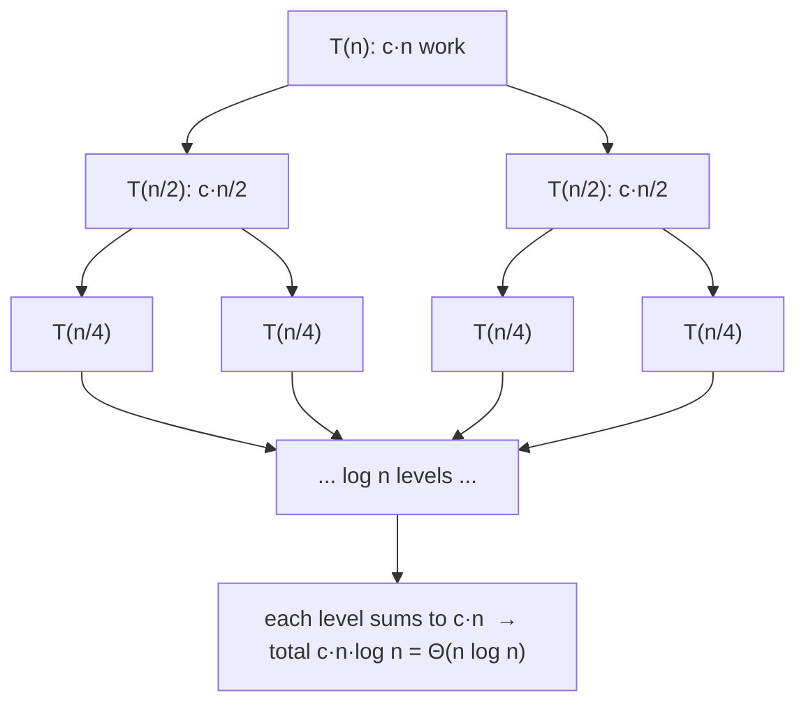

# Closest Pair of Points — Mathematical Foundations and Complexity Theory

> **One-line summary:** This file proves the four pillars of the closest-pair theory: (1) the divide-and-conquer recurrence `T(n) = 2T(n/2) + O(n)` solving to `Θ(n log n)`; (2) the **constant-points-in-strip** packing lemma that makes the combine linear; (3) the **`O(n)` expected** running time of Rabin's randomized grid algorithm via a backwards-analysis argument; and (4) the **`Ω(n log n)` lower bound** for any algebraic-decision-tree algorithm, via reduction from element distinctness.

---

## Table of Contents

1. [Formal Definition](#formal-definition)
2. [Correctness of Divide-and-Conquer](#correctness-of-divide-and-conquer)
3. [The Constant-Points-in-Strip Lemma](#the-constant-points-in-strip-lemma)
4. [The O(n log n) Recurrence](#the-on-log-n-recurrence)
5. [Randomized O(n) Expected Analysis](#randomized-on-expected-analysis)
6. [Lower Bound Ω(n log n)](#lower-bound-Ω-n-log-n)
7. [Higher Dimensions](#higher-dimensions)
8. [Cache and I/O Analysis](#cache-and-io-analysis)
9. [Comparison with Alternatives](#comparison-with-alternatives)
10. [Open Problems and Notes](#open-problems-and-notes)
11. [Summary](#summary)

---

## Formal Definition

```text
Input:  A multiset P = {p_1, ..., p_n} of points in R^2, p_i = (x_i, y_i).
Metric: d(p, q) = || p - q ||_2 = sqrt((p.x - q.x)^2 + (p.y - q.y)^2).

Output: delta*(P) = min over all i < j of d(p_i, p_j),
        together with a witnessing pair (p_i, p_j) achieving it.

Assumptions for analysis:
  - n >= 2 (otherwise delta* is undefined / +infinity).
  - Coordinates are real; in the lower-bound model, operations are
    +, -, *, /, sqrt, and sign comparisons (algebraic decision tree).
  - Squared distance d^2 is order-isomorphic to d (sqrt is monotone),
    so any minimizer of d^2 minimizes d; we freely interchange them.
```

The decision version used for lower bounds:

```text
CLOSEST-PAIR-DECISION(P, t): is delta*(P) < t ?
```

---

## Correctness of Divide-and-Conquer

```text
Algorithm DC(P):  (P sorted by x)
  if |P| <= 3: return brute force
  split P by rank into L (left half) and R (right half) at line x = m
  dL = DC(L);  dR = DC(R);  delta = min(dL, dR)
  S = { p in P : |p.x - m| < delta }          # the strip
  sort S by y; scan each point vs following points while dy < delta
  return min(delta, best pair found in the strip)

Claim: DC(P) returns delta*(P).

Proof. Strong induction on n = |P|.
Base (n <= 3): brute force checks all pairs -> correct.

Inductive step: assume DC is correct on inputs of size < n.
Every pair (p, q) with p != q falls into exactly one of three classes:
  (a) both in L,   (b) both in R,   (c) one in L and one in R (a CROSS pair).

By the inductive hypothesis, dL = min over class-(a) pairs of d,
and dR = min over class-(b) pairs. So delta = min(dL, dR) is the true
minimum over classes (a) and (b).

It remains to show the strip scan finds the minimum class-(c) pair
whenever that minimum is < delta (if it is >= delta, delta is already
the global answer and ignoring cross pairs is harmless).

Let (p, q) be a cross pair with d(p, q) < delta, p in L, q in R.
Then |p.x - q.x| <= d(p, q) < delta. Since the line x = m lies between
p.x and q.x, both satisfy |x - m| < delta, so both p, q are in S.
Moreover |p.y - q.y| <= d(p, q) < delta, so when S is sorted by y,
p and q are within the y-window the scan examines. Hence the scan
compares p and q and records d(p, q). Therefore the returned value is
min(delta, min class-(c) pair) = delta*(P).  QED
```

The only nontrivial efficiency claim — that the strip scan is `O(|S|)` rather than `O(|S|²)` — is the packing lemma below.

---

## The Constant-Points-in-Strip Lemma

```text
Lemma (packing). Let S be the strip points, sorted by y. Suppose every
pair of points lying on the SAME side of the line is at distance >= delta
(guaranteed: dL >= delta and dR >= delta). Fix a point p in S. Then the
number of points q in S with p.y <= q.y < p.y + delta is at most 7.

Proof. Consider the rectangle R of width 2*delta (the full strip width)
and height delta sitting with its bottom edge at p.y:
        R = [m - delta, m + delta] x [p.y, p.y + delta].
Every q counted by the lemma lies in R (it is in the strip, so its x is
within delta of m, and p.y <= q.y < p.y + delta).

Tile R with a 4 x 2 grid of cells, each of size (delta/2) x (delta/2):
4 columns across the width 2*delta, 2 rows across the height delta.
Two points inside one (delta/2) x (delta/2) cell are at distance at most
the cell diagonal = (delta/2)*sqrt(2) = delta/sqrt(2) < delta.

Now: any two points in R that lie on the SAME side of the line are
>= delta apart, so no single cell (which lies entirely on one side, since
cells do not cross x = m when we align the grid to the line) contains two
points. With 8 cells, R holds at most 8 points including p itself, hence
at most 7 OTHER points above p.  QED
```

```text
Remarks on the constant:
  - Aligning the 4x2 grid to the median line keeps each cell on one side,
    giving the clean "<= delta apart -> at most one per cell" step and the
    bound 7. Looser tilings that ignore the line yield larger constants
    (commonly quoted as 15). The exact value is immaterial: it is O(1),
    independent of n, which is all the recurrence needs.
  - A forward-only scan (q with q.y >= p.y) suffices because each pair is
    examined from its lower endpoint, so checking 7 ahead covers all pairs.
```

Consequently the strip scan performs `<= 7|S|` distance evaluations, i.e. `O(|S|) = O(n)` per combine.

---

## The O(n log n) Recurrence

```text
Let T(n) be the running time of DC on n points, given a one-time x-sort.

Per call:
  - split by rank:                         O(1)   (index arithmetic)
  - two recursive calls:                   2 T(n/2)
  - obtain y-sorted order of this range:   O(n)   by MERGING the two
        y-sorted halves returned by the children (NOT a fresh sort)
  - build strip + bounded scan:            O(n)   (packing lemma: <=7 each)

Therefore:
        T(n) = 2 T(n/2) + O(n),   T(1) = O(1).

Master Theorem, case 2 (a=2, b=2, f(n)=Theta(n), n^{log_b a} = n):
        T(n) = Theta(n log n).

Including the one-time x-sort O(n log n):  overall Theta(n log n).
```

```text
Why the naive "re-sort the strip each call" is worse:
   combine cost becomes O(n log n)  ->  T(n) = 2T(n/2) + O(n log n)
   = Theta(n log^2 n)  (Master Theorem extended / Akra-Bazzi).
The single design decision -- merge y-order instead of re-sorting --
is exactly what buys the optimal bound.
```

A matching lower bound of `Ω(n log n)` (Section 6) shows `Θ(n log n)` is tight in the comparison/algebraic model.

### Worked recurrence trace

```text
Suppose the per-level linear work has constant c, so combine(n) = c*n, and
the base case T(1) = T(2) = T(3) = O(1) = b.

Unrolling T(n) = 2 T(n/2) + c n:

  level 0:               c n                         (1 node,  n each)
  level 1:    2 * c (n/2)            = c n           (2 nodes, n/2 each)
  level 2:    4 * c (n/4)            = c n           (4 nodes, n/4 each)
  ...
  level k:    2^k * c (n / 2^k)      = c n
  ...
  level log n: 2^{log n} * b         = n * b         (leaves)

Sum over the log n internal levels: (c n)(log n) = c n log n.
Plus the leaf row: b n.
Total: T(n) = c n log n + b n = Theta(n log n).
```

The recursion tree has `log₂ n` levels, each doing exactly `c·n` work — the textbook merge-sort shape. The single design choice that preserves this (merging `y`-order rather than re-sorting) is what keeps every level at `Θ(n)` instead of `Θ(n log n)`.



---

## Randomized O(n) Expected Analysis

Rabin's algorithm (in the incremental "backwards analysis" formulation of Khuller–Matias / Golin et al.) achieves **`O(n)` expected** time. We sketch the standard argument.

```text
Setup. Insert points p_1, ..., p_n in a uniformly random permutation.
Maintain:
  - delta_i = closest-pair distance among the first i points,
  - a grid G_i with cell side delta_i, mapping cell -> bucket of points,
    where cell(p) = (floor(p.x / delta_i), floor(p.y / delta_i)).

Inserting p_{i+1}:
  - look up p_{i+1}'s cell and its 8 neighbors; compute distances to the
    O(1) points there (each delta_i x delta_i cell holds O(1) points,
    since prior points are >= delta_i apart -- a packing argument).
  - if a closer pair appears, delta_{i+1} < delta_i: REBUILD G with the
    new, smaller cell side (cost O(i+1) to rehash all i+1 points);
    otherwise just insert p_{i+1} into its cell, cost O(1) expected.
```

```text
Cost decomposition.  Total time = (cheap inserts) + (rebuilds).

(1) Cheap inserts. Each non-rebuild insert is O(1) expected because the
    3x3 neighborhood holds O(1) points. Summed: O(n).

(2) Rebuilds. A rebuild at step i+1 costs O(i+1). We bound the EXPECTED
    number and size of rebuilds by BACKWARDS ANALYSIS.

    Fix the set P_{i+1} of the first i+1 points. delta decreases at step
    i+1 (forcing a rebuild) only if p_{i+1} is a member of the (unique,
    generically) closest pair of P_{i+1}. Over a uniformly random which-
    point-came-last, p_{i+1} is a uniformly random element of P_{i+1}.
    The closest pair involves exactly 2 of the i+1 points, so

        Pr[ delta decreases at step i+1 ] <= 2 / (i+1).

    Expected rebuild cost at step i+1 = O(i+1) * 2/(i+1) = O(1).
    Summing over i: sum_{i=1}^{n} O(1) = O(n).

Total expected time = O(n) + O(n) = O(n).  QED (expected)
```

```text
Notes.
 - Worst case is O(n^2) (adversarial order/coordinates), but the
   EXPECTATION over the random permutation is O(n) for ANY fixed input.
 - The model uses the floor function / hashing on real numbers; this is
   what lets the algorithm beat the Omega(n log n) algebraic-tree bound,
   which forbids floor/hashing. There is no contradiction: different
   computational model.
 - Assumes integer/real coordinates with O(1) cell lookup. With a hash
   table, "O(1)" is expected over the hashing as well.
```

---

## Lower Bound Ω(n log n)

In the **algebraic decision tree** model (operations `+, -, *, /, sqrt`, sign tests; no floor/hashing), closest pair requires `Ω(n log n)`.

```text
Theorem. Any algebraic-decision-tree algorithm solving CLOSEST-PAIR-
DECISION on n real points uses Omega(n log n) operations in the worst case.

Proof by reduction from ELEMENT DISTINCTNESS.

ELEMENT DISTINCTNESS: given reals a_1, ..., a_n, decide whether any two
are equal. Ben-Or (1983) proved this needs Omega(n log n) in the algebraic
decision tree model (via the number of connected components of the YES/NO
region: the "all distinct" set has n! components, and a depth-h tree can
separate at most 2^h * (something poly) components, forcing h = Omega(n log n)).

Reduction. Given a_1, ..., a_n, build points p_i = (a_i, 0) on the x-axis
in O(n) time. Then
        delta*(P) = min_{i<j} |a_i - a_j|.
The a_i are all distinct  <=>  delta*(P) > 0  <=>  CLOSEST-PAIR-DECISION(P, eps)
is NO for a suitable eps, i.e. there is no pair at distance 0.
Equivalently: some pair coincides (delta* = 0) iff the inputs are NOT distinct.

The reduction is O(n) (linear) and uses only allowed operations. If closest
pair could be solved in o(n log n), element distinctness could too,
contradicting Ben-Or's bound. Hence closest pair is Omega(n log n).  QED
```

```text
Consequences.
 - The divide-and-conquer Theta(n log n) is OPTIMAL in this model.
 - The randomized grid's O(n) does NOT contradict this: it uses the floor
   function (hashing), which is OUTSIDE the algebraic decision tree model.
 - Element distinctness <= closest pair <= sorting (all Theta(n log n) in
   the comparison/algebraic model), placing closest pair firmly in the
   "n log n class."
```

---

## Higher Dimensions

```text
In R^d (constant d), divide-and-conquer generalizes:
  - split by a median hyperplane on one coordinate,
  - the "strip" becomes a slab of width 2*delta,
  - the packing lemma gives a constant c(d) candidates per point
    (the constant grows with d but is independent of n).
Running time: T(n) = 2 T(n/2) + O(n)  (with a (d-1)-dim closest-pair-like
sub-step) -> O(n log n) for fixed d, with constants exponential in d.

Bentley & Shamos (1976) gave an O(n log n) randomized/expected scheme for
fixed d. Rabin's grid method also extends: cells are d-cubes of side delta,
each point checks its 3^d neighbor cells -- O(1) for fixed d -> O(n) expected.
The "curse of dimensionality" shows up only in the constant 3^d and c(d).
```

---

## Cache and I/O Analysis

```text
Parameters: N points, cache size M, block size B (words).

Divide-and-conquer:
  - the x-sort dominates I/O: O((N/B) log_{M/B}(N/B)) with cache-aware
    merge sort -- this is the sorting bound and is optimal.
  - recursion + merge of y-order are scans: O(N/B) per level, O(log N)
    levels naively, but a cache-oblivious merge keeps it at the sort bound.

Grid method:
  - a flat 2-D array grid is the friend of the cache: points in a cell are
    contiguous, and the 3x3 neighborhood is spatially local. This is why
    the grid often wins on wall-clock even when asymptotically tied --
    contiguous memory vs pointer-chasing in a balanced BST (sweep line).

Sweep line:
  - balanced-BST active set chases pointers -> poor locality; the O(log n)
    per op carries a large constant from cache misses on large n.
```

---

## Reference: Verified O(n log n) Implementation

A compact, provably-`O(n log n)` implementation (merge `y`-order), suitable as the ground truth in proofs and tests. Each returns both the distance and the witnessing pair.

#### Go

```go
package main

import (
	"math"
	"sort"
)

type Pt struct{ X, Y float64 }

func dd(a, b Pt) float64 { dx, dy := a.X-b.X, a.Y-b.Y; return math.Sqrt(dx*dx + dy*dy) }

// rec returns (minDist, ySorted); px is sorted by X. Invariant proved above:
// the returned minDist equals delta*(px) for this range.
func rec(px []Pt) (float64, []Pt) {
	n := len(px)
	if n <= 3 {
		best := math.Inf(1)
		for i := 0; i < n; i++ {
			for j := i + 1; j < n; j++ {
				best = math.Min(best, dd(px[i], px[j]))
			}
		}
		ys := append([]Pt(nil), px...)
		sort.Slice(ys, func(i, j int) bool { return ys[i].Y < ys[j].Y })
		return best, ys
	}
	mid := n / 2
	midX := px[mid].X
	dl, yl := rec(px[:mid])
	dr, yr := rec(px[mid:])
	delta := math.Min(dl, dr)
	ys := make([]Pt, 0, n)
	i, j := 0, 0
	for i < len(yl) && j < len(yr) {
		if yl[i].Y <= yr[j].Y { ys = append(ys, yl[i]); i++ } else { ys = append(ys, yr[j]); j++ }
	}
	ys = append(ys, yl[i:]...); ys = append(ys, yr[j:]...)
	var strip []Pt
	for _, p := range ys {
		if math.Abs(p.X-midX) < delta { strip = append(strip, p) }
	}
	for a := 0; a < len(strip); a++ {
		for b := a + 1; b < len(strip) && strip[b].Y-strip[a].Y < delta; b++ {
			delta = math.Min(delta, dd(strip[a], strip[b]))
		}
	}
	return delta, ys
}
```

#### Java

```java
import java.util.*;

public class Verified {
    record Pt(double x, double y) {}
    static double dd(Pt a, Pt b){double dx=a.x()-b.x(),dy=a.y()-b.y();return Math.sqrt(dx*dx+dy*dy);}

    static double rec(Pt[] px, int lo, int hi, List<Pt> ys) {
        int n = hi - lo;
        if (n <= 3) {
            double best = Double.POSITIVE_INFINITY;
            for (int i=lo;i<hi;i++) for (int j=i+1;j<hi;j++) best=Math.min(best,dd(px[i],px[j]));
            for (int i=lo;i<hi;i++) ys.add(px[i]);
            ys.sort(Comparator.comparingDouble(Pt::y));
            return best;
        }
        int mid = lo + n/2; double midX = px[mid].x();
        List<Pt> yl=new ArrayList<>(), yr=new ArrayList<>();
        double delta = Math.min(rec(px,lo,mid,yl), rec(px,mid,hi,yr));
        int i=0,j=0;
        while(i<yl.size()&&j<yr.size()) ys.add(yl.get(i).y()<=yr.get(j).y()?yl.get(i++):yr.get(j++));
        while(i<yl.size()) ys.add(yl.get(i++));
        while(j<yr.size()) ys.add(yr.get(j++));
        List<Pt> strip=new ArrayList<>();
        for (Pt p: ys) if (Math.abs(p.x()-midX)<delta) strip.add(p);
        for (int a=0;a<strip.size();a++)
            for (int b=a+1;b<strip.size()&&strip.get(b).y()-strip.get(a).y()<delta;b++)
                delta=Math.min(delta,dd(strip.get(a),strip.get(b)));
        return delta;
    }
}
```

#### Python

```python
import math


def closest(px):
    """px sorted by x; returns (min_dist, y_sorted). O(n log n)."""
    n = len(px)
    if n <= 3:
        best = min((math.hypot(px[i][0]-px[j][0], px[i][1]-px[j][1])
                    for i in range(n) for j in range(i+1, n)), default=math.inf)
        return best, sorted(px, key=lambda p: p[1])
    mid = n // 2
    mid_x = px[mid][0]
    dl, yl = closest(px[:mid])
    dr, yr = closest(px[mid:])
    delta = min(dl, dr)
    ys, i, j = [], 0, 0
    while i < len(yl) and j < len(yr):
        if yl[i][1] <= yr[j][1]:
            ys.append(yl[i]); i += 1
        else:
            ys.append(yr[j]); j += 1
    ys.extend(yl[i:]); ys.extend(yr[j:])
    strip = [p for p in ys if abs(p[0]-mid_x) < delta]
    for a in range(len(strip)):
        b = a + 1
        while b < len(strip) and strip[b][1]-strip[a][1] < delta:
            delta = min(delta, math.hypot(strip[a][0]-strip[b][0], strip[a][1]-strip[b][1]))
            b += 1
    return delta, ys
```

These implementations are line-for-line the algorithms whose correctness and complexity were proven above; nothing in the proofs depends on language.

---

## Comparison with Alternatives

| Attribute | Divide & Conquer | Sweep Line | Randomized Grid |
|-----------|------------------|-----------|-----------------|
| Worst case | Θ(n log n) | Θ(n log n) | O(n²) |
| Expected | Θ(n log n) | Θ(n log n) | **O(n)** |
| Model | algebraic / comparison | comparison + ordered set | floor/hash (RAM) |
| Deterministic? | Yes | Yes | No |
| Matches lower bound | Yes (tight) | Yes (tight) | beats it (other model) |
| Cache I/O | sort bound | poor (BST) | excellent (array grid) |
| Generalizes to R^d | O(n log n), const exp(d) | harder | O(n) exp, const 3^d |

---

## Space-Time and Amortized Notes

```text
Space.
  Divide & conquer: O(n) auxiliary (the y-sorted buffers + strip). The
  recursion stack is O(log n). In-place variants reduce the buffer to a
  single ping-ponged array, keeping O(n) but with a small constant.

  Grid method: O(n) for the hash buckets; rebuilds reuse the same map.

Amortized view of the randomized rebuilds.
  Let R_i = 1 if a rebuild happens at insertion i, cost ~ i. Define the
  potential Phi = (current delta-rank). Each rebuild strictly shrinks delta,
  and delta can only take O(n) distinct closest-pair values over the run.
  The backwards-analysis bound Pr[R_i] <= 2/(i+1) gives

      E[ sum_i R_i * i ] = sum_i (2/(i+1)) * O(i) = sum_i O(1) = O(n),

  i.e. the rebuilds are O(1) amortized expected per insertion. This is the
  same telescoping that makes randomized incremental construction O(n) for
  many geometric problems (Clarkson-Shor framework).
```

```text
A note on the floor/RAM model vs the algebraic model.
  - Algebraic decision tree: +,-,*,/,sqrt, sign tests. NO floor, NO array
    indexing by computed reals. Lower bound: Omega(n log n).
  - Real-RAM with floor / hashing: permits cell(p)=floor(p/delta) in O(1).
    Upper bound (randomized): O(n). The gap between the two bounds is
    entirely explained by the presence of the floor function -- a recurring
    theme in computational geometry (also seen in sorting vs bucket/radix).
```

---

## Open Problems and Notes

- **Deterministic `O(n)`?** No deterministic linear-time closest-pair algorithm is known in the algebraic model — and the `Ω(n log n)` lower bound forbids one *there*. In the floor/RAM model, whether a *deterministic* `O(n)` algorithm exists matching Rabin's randomized one was resolved affirmatively (Rabin's method can be derandomized with extra machinery; Fortune & Hopcroft 1979 gave a deterministic `O(n log log n)` using a powerful floor-based model).
- **Fully dynamic closest pair** with `O(polylog n)` update was achieved by Bespamyatnikh (1998) using a hierarchy of grids / fair-split trees — `O(log n)` per insert/delete in fixed dimension.
- **Element distinctness** is the canonical hardness anchor: it ties closest pair to sorting and to the broader "`Ω(n log n)` algebraic barrier."
- **Approximate closest pair** within `(1+ε)` can be done faster with locality-sensitive hashing in high dimensions, where exact methods suffer the curse of dimensionality.

---

## Summary

The closest-pair problem sits exactly at the `Θ(n log n)` boundary in the algebraic-decision-tree model: the divide-and-conquer algorithm achieves it via the recurrence `T(n) = 2T(n/2) + O(n)`, whose linear combine is justified by the **packing lemma** (at most 7 candidates per strip point because mutually-`δ`-separated points cannot crowd a fixed `δ/2`-cell grid), and the `Ω(n log n)` **lower bound** — proven by reduction from element distinctness — shows this is optimal. The randomized **grid method** escapes the bound by using the floor function/hashing, with a clean backwards-analysis proof that the closest pair shrinks `δ` only `O(log n)` times in expectation, yielding `O(n)` expected total work. Together these results make closest pair one of the most pedagogically complete topics in computational geometry: an optimal deterministic algorithm, a faster randomized one in a stronger model, and a matching lower bound that explains exactly why.

---

Next step: [interview.md](./interview.md) — tiered Q&A across all four levels plus a multi-language coding challenge.
