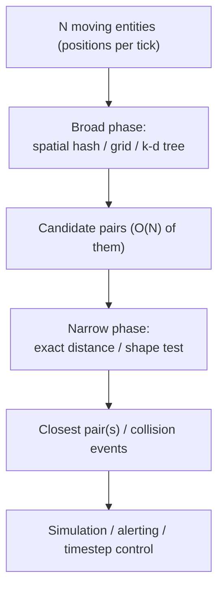
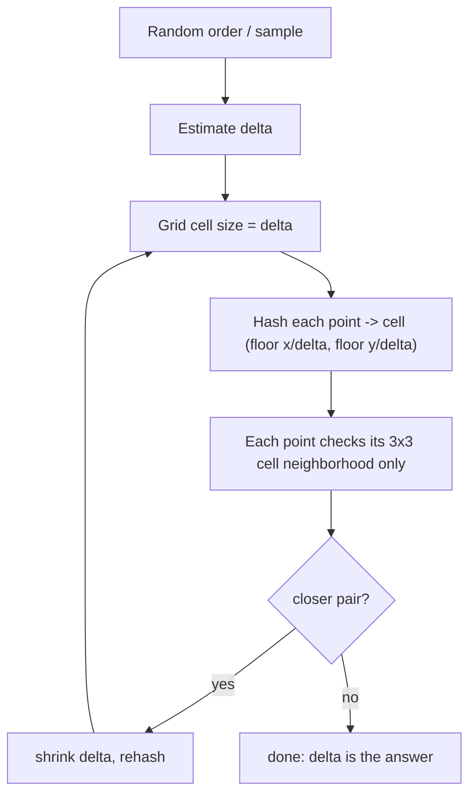

# Closest Pair of Points — Senior Level

> **One-line summary:** At scale, "the two nearest objects" is rarely a one-shot batch query — it is a **proximity/collision subsystem** running continuously over millions of moving entities. The senior view covers the **randomized `O(n)` grid (Rabin) method**, **dynamic/streaming** closest pair, spatial-hashing for collision and air-traffic systems, parallelism, and the numerical-robustness traps that make textbook code fail on real coordinates.

---

## Table of Contents

1. [Introduction](#introduction)
2. [System Design — Proximity and Collision Subsystems](#system-design--proximity-and-collision-subsystems)
3. [The Randomized O(n) Grid Method (Rabin)](#the-randomized-on-grid-method-rabin)
4. [Spatial Hashing for Collision and Air-Traffic](#spatial-hashing-for-collision-and-air-traffic)
5. [Dynamic and Streaming Closest Pair](#dynamic-and-streaming-closest-pair)
6. [Comparison at Scale](#comparison-at-scale)
7. [Parallel and Distributed Closest Pair](#parallel-and-distributed-closest-pair)
8. [Code Examples](#code-examples)
9. [Numerical Robustness](#numerical-robustness)
10. [Observability](#observability)
11. [Failure Modes](#failure-modes)
12. [Summary](#summary)

---

## Introduction

> Focus: "How do I architect a system that continuously answers proximity questions over millions of entities?"

The batch divide-and-conquer algorithm is a building block, not a product. In production the question mutates:

- **Air-traffic / maritime collision avoidance:** thousands of aircraft, positions updated every radar sweep; we want every dangerously-close pair, not just *the* closest, recomputed many times per second.
- **Game / physics engines:** tens of thousands of moving bodies; broad-phase collision detection must shrink "all pairs" to "pairs that could possibly touch" every frame (16 ms budget at 60 fps).
- **n-body simulation:** gravity/electrostatics where the closest pair sets the integration timestep.
- **Clustering / GIS / dedup:** finding near-duplicate coordinates among billions of records.

Senior engineers therefore care about three things the algorithm books gloss over: **incremental updates** (don't recompute from scratch), **cache and parallelism** (the constant factor *is* the product), and **robustness** (floating-point coordinates, ties, degeneracy). And they know the secret weapon for static batch: a **randomized `O(n)` grid** that beats `O(n log n)` when you can hash.

---

## System Design — Proximity and Collision Subsystems

A proximity subsystem is almost always two-phase:



- **Broad phase** uses a coarse structure (uniform grid, spatial hash, or k-d tree) to discard the overwhelming majority of pairs that are obviously far apart. This is exactly the *strip idea* generalized: only compare entities that share or border a grid cell.
- **Narrow phase** does exact distance math on the surviving `O(N)` candidates.

The closest-pair distance `delta` is the natural **cell size**: if you bucket points into a grid with cell side `delta`, a pair closer than `delta` must lie in the same cell or an adjacent one — so each point only checks its 8 neighboring cells. That observation is the bridge from the divide-and-conquer strip to the grid method below.

---

## The Randomized O(n) Grid Method (Rabin)

Michael Rabin's 1976 insight: you can find the closest pair in **`O(n)` expected time** by hashing points into a uniform grid whose cell size equals the closest-pair distance. The catch — you don't know that distance yet. The randomized two-pass algorithm bootstraps it:

**Pass 1 — estimate `delta`.**
1. Take a **random sample** (or process points in random order). Compute a preliminary `delta` from a subset using divide-and-conquer or even brute force on the small sample. Crucially, by a probabilistic argument, after inserting points in random order the running closest distance only needs to be *rebuilt* `O(log n)` times in expectation, and each rebuild is cheap.

**Pass 2 — grid with cell size `delta`.**
2. Build a hash map from grid cell `(floor(x/delta), floor(y/delta))` to the point(s) it contains.
3. For each point, examine only its own cell and the **8 adjacent cells**. A pair closer than `delta` must be within this 3×3 block.
4. If a closer pair is found, update `delta` and (in the incremental formulation) rehash.

**Why expected `O(n)`:** with the right cell size, each cell holds `O(1)` points (mutually-`δ`-separated points can't crowd a `δ × δ` cell), so each point does `O(1)` work, and the random-order analysis shows the total rebuild cost is `O(n)` in expectation. The hashing — not comparison — is what escapes the `Ω(n log n)` comparison lower bound. (Full analysis in `professional.md`.)



**Practical incremental form (Khuller–Matias):** process points one at a time in random order, maintaining a grid keyed at the current `delta`. For a new point, check its neighborhood; if it forms a closer pair, shrink `delta` and rebuild the grid. Expected total work is `O(n)` because `delta` shrinks only `O(log n)` times in expectation and the total rebuild cost telescopes.

---

## Spatial Hashing for Collision and Air-Traffic

In a live system you don't recompute the closest pair from scratch; you maintain a **spatial hash grid** as a persistent index.

| Decision | Trade-off |
|----------|-----------|
| **Cell size** | Too small → many empty cells, cache misses. Too large → many points per cell, back toward `O(n²)` within a cell. Rule of thumb: cell ≈ average inter-point spacing or expected interaction radius. |
| **Uniform grid vs hash map** | Dense, bounded space → flat 2-D array (fastest). Sparse / unbounded → hash map `cell → bucket` (memory-proportional to occupied cells). |
| **k-d tree vs grid** | Grid wins for uniform density and frequent updates; k-d tree (sibling *04-kd-tree*) wins for skewed density and exact k-NN, but rebalances poorly under motion. |
| **Rebuild vs update** | Fully rebuild each tick (simple, cache-friendly for many moving points) vs incrementally move points between cells (cheaper when few move). |

**Air-traffic conflict detection** is the canonical example: each aircraft is a point (often in 3-D with altitude). A conflict is a pair within a separation minimum `S` (e.g., 5 nautical miles horizontally, 1000 ft vertically). Set the grid cell to `S`; each aircraft checks neighbors in its 3×3×3 cell block. This is closest-pair logic generalized to "all pairs within radius `S`," recomputed every radar update over thousands of aircraft — comfortably real-time because the per-point work is `O(1)`.

---

## Dynamic and Streaming Closest Pair

The static algorithm assumes a fixed set. Real systems insert, delete, and move points.

- **Insert-only stream:** maintain the grid at the current `delta`. Each new point checks its 3×3 neighborhood in `O(1)` expected; if it creates a closer pair, shrink `delta` and rehash. Amortized `O(1)` expected per insert.
- **Fully dynamic (insert + delete):** harder. Deleting the point that *defined* `delta` means `delta` might *grow*, and recovering the new minimum is not local. Solutions keep auxiliary structures (e.g., a multiset of candidate distances, or maintain the closest pair within each cell plus a global heap of per-cell minima). Practical engines accept periodic full rebuilds rather than perfect dynamic maintenance.
- **Moving points (kinetic):** in physics/air-traffic, every point moves each tick. The dominant pattern is **rebuild-the-grid-per-tick** (cheap, branch-predictable) or **kinetic data structures** that schedule "events" when the closest pair could change — elegant but rarely worth the complexity outside research.
- **Sliding window over a stream:** combine the sweep-line ordered-set with eviction by timestamp/x — the active set already supports the needed inserts and range queries.

| Workload | Recommended structure |
|----------|----------------------|
| Static batch, huge `n` | Randomized grid `O(n)` or DC `O(n log n)` |
| Insert-only stream | Grid keyed at `delta`, shrink-and-rehash |
| Insert + delete | Per-cell minima + global heap, or periodic rebuild |
| All points move each tick | Rebuild uniform grid per tick (broad phase) |
| Skewed density | k-d tree / BVH instead of uniform grid |

---

## Comparison at Scale

| Attribute | Divide & Conquer | Sweep Line | Randomized Grid | k-d Tree |
|-----------|------------------|-----------|-----------------|----------|
| Time | O(n log n) | O(n log n) | **O(n) expected** | O(n log n) build, query varies |
| Worst case | O(n log n) | O(n log n) | O(n²) (adversarial hash) | O(n²) degenerate |
| Updates | rebuild | rebuild | incremental-friendly | poor under motion |
| Cache behavior | recursion, moderate | BST pointer-chasing | grid = great locality | pointer-chasing |
| Parallelizes | yes (recursion) | harder | yes (cells independent) | yes (subtrees) |
| Robustness | deterministic | deterministic | depends on hash/seed | deterministic |
| Best for | static, provable | iterative, libraried | static huge, hashable | k-NN, range queries |

At very large `n` on uniform data, the **grid wins on constant factors and cache locality** even ignoring the asymptotic edge — a flat array grid touches contiguous memory, while recursion and balanced trees chase pointers.

---

## Parallel and Distributed Closest Pair

- **Shared-memory parallel DC:** the two recursive halves are independent — fork them onto separate threads until a depth threshold, then go sequential. The combine (merge + strip scan) is sequential but `O(n)`. Speedup is good because the heavy recursion parallelizes cleanly.
- **Grid in parallel:** cells are independent; assign cell-ranges to threads. The only synchronization is when updating the global `delta` — use an atomic min or per-thread local minima reduced at the end.
- **Distributed (data doesn't fit one node):** partition the plane into vertical slabs (like the DC split), give each node a slab plus a `delta`-wide **halo** of the neighboring slab's border points, compute local closest pairs, then reconcile across slab boundaries (the distributed analog of the strip). This is a MapReduce/Spark-friendly pattern: map → per-partition closest pair; reduce → boundary strips. The halo width must be at least the global `delta`, which may require a second pass to tighten.

---

## Code Examples

### Randomized grid (hash-based) closest pair — thread-safe accumulation

#### Go

```go
package main

import (
	"fmt"
	"math"
	"math/rand"
)

type Point struct{ X, Y float64 }
type cell struct{ cx, cy int64 }

func d2(a, b Point) float64 { dx, dy := a.X-b.X, a.Y-b.Y; return dx*dx + dy*dy }

// GridClosest: expected O(n) using a grid keyed at the running delta.
func GridClosest(pts []Point) float64 {
	rand.Shuffle(len(pts), func(i, j int) { pts[i], pts[j] = pts[j], pts[i] })
	delta := math.Inf(1)
	grid := map[cell][]Point{}
	cellOf := func(p Point, side float64) cell {
		return cell{int64(math.Floor(p.X / side)), int64(math.Floor(p.Y / side))}
	}
	rebuild := func(side float64) {
		grid = map[cell][]Point{}
		// only previously-processed points are re-inserted by caller
	}
	side := 1.0
	processed := pts[:0:0]
	for _, p := range pts {
		if math.IsInf(delta, 1) {
			// first point: nothing to compare; set arbitrary side later
		} else {
			c := cellOf(p, side)
			for dx := int64(-1); dx <= 1; dx++ {
				for dy := int64(-1); dy <= 1; dy++ {
					for _, q := range grid[cell{c.cx + dx, c.cy + dy}] {
						if dd := math.Sqrt(d2(p, q)); dd < delta {
							delta = dd
						}
					}
				}
			}
		}
		processed = append(processed, p)
		// If delta shrank past the cell size, rebuild the grid at side=delta.
		if !math.IsInf(delta, 1) && (math.IsInf(side, 1) || delta < side) {
			side = math.Max(delta, 1e-12)
			rebuild(side)
			for _, q := range processed {
				c := cellOf(q, side)
				grid[c] = append(grid[c], q)
			}
		} else {
			c := cellOf(p, side)
			grid[c] = append(grid[c], p)
		}
	}
	return delta
}

func main() {
	pts := []Point{{1, 3}, {2, 7}, {3, 1}, {5, 5}, {6, 8}, {7, 2}, {8, 6}, {9, 4}}
	fmt.Printf("grid closest = %.4f\n", GridClosest(pts)) // ~2.2360
}
```

#### Java

```java
import java.util.*;

public class GridClosest {
    record Point(double x, double y) {}

    static double d2(Point a, Point b) {
        double dx = a.x() - b.x(), dy = a.y() - b.y();
        return dx * dx + dy * dy;
    }
    static long key(long cx, long cy) { return cx * 1_000_003L ^ cy; }

    static double gridClosest(List<Point> pts) {
        Collections.shuffle(pts, new Random(1));
        double delta = Double.POSITIVE_INFINITY, side = 1.0;
        Map<Long, List<Point>> grid = new HashMap<>();
        List<Point> done = new ArrayList<>();
        for (Point p : pts) {
            if (!Double.isInfinite(delta)) {
                long cx = (long) Math.floor(p.x() / side), cy = (long) Math.floor(p.y() / side);
                for (long dx = -1; dx <= 1; dx++)
                    for (long dy = -1; dy <= 1; dy++)
                        for (Point q : grid.getOrDefault(key(cx + dx, cy + dy), List.of()))
                            delta = Math.min(delta, Math.sqrt(d2(p, q)));
            }
            done.add(p);
            if (!Double.isInfinite(delta) && delta < side) {
                side = Math.max(delta, 1e-12);
                grid.clear();
                for (Point q : done)
                    grid.computeIfAbsent(
                        key((long) Math.floor(q.x()/side), (long) Math.floor(q.y()/side)),
                        k -> new ArrayList<>()).add(q);
            } else {
                grid.computeIfAbsent(
                    key((long) Math.floor(p.x()/side), (long) Math.floor(p.y()/side)),
                    k -> new ArrayList<>()).add(p);
            }
        }
        return delta;
    }

    public static void main(String[] args) {
        List<Point> pts = new ArrayList<>(List.of(
            new Point(1,3), new Point(2,7), new Point(3,1), new Point(5,5),
            new Point(6,8), new Point(7,2), new Point(8,6), new Point(9,4)));
        System.out.printf("grid closest = %.4f%n", gridClosest(pts));
    }
}
```

#### Python

```python
import math
import random
from collections import defaultdict


def grid_closest(pts):
    """Expected O(n) closest pair via a grid keyed at the running delta."""
    pts = pts[:]
    random.shuffle(pts)
    delta = math.inf
    side = 1.0
    grid = defaultdict(list)
    done = []

    def cell(p, s):
        return (math.floor(p[0] / s), math.floor(p[1] / s))

    for p in pts:
        if delta != math.inf:
            cx, cy = cell(p, side)
            for dx in (-1, 0, 1):
                for dy in (-1, 0, 1):
                    for q in grid.get((cx + dx, cy + dy), ()):
                        delta = min(delta, math.hypot(p[0]-q[0], p[1]-q[1]))
        done.append(p)
        if delta != math.inf and delta < side:
            side = max(delta, 1e-12)
            grid = defaultdict(list)
            for q in done:
                grid[cell(q, side)].append(q)
        else:
            grid[cell(p, side)].append(p)
    return delta


if __name__ == "__main__":
    pts = [(1, 3), (2, 7), (3, 1), (5, 5), (6, 8), (7, 2), (8, 6), (9, 4)]
    print(f"grid closest = {grid_closest(pts):.4f}")  # ~2.2360
```

**What it does:** incremental randomized grid — each point checks only its 3×3 cell neighborhood; the grid is rebuilt at the new `delta` whenever a closer pair shrinks it.
**Run:** `go run main.go` | `javac GridClosest.java && java GridClosest` | `python grid.py`

---

## Application Deep-Dives

The closest-pair primitive shows up, lightly disguised, across many systems. Recognizing it lets you reuse the same broad-phase machinery instead of reinventing `O(n²)` scans.

### n-body simulation — the closest pair sets the timestep

In gravitational or molecular simulations, numerical stability depends on never letting two bodies pass too close in a single integration step. The minimum inter-body distance `delta` bounds the largest stable timestep `Δt`. So every few steps you recompute the closest pair (or an approximation) and shrink `Δt` if `delta` got small. Barnes–Hut and fast-multipole methods already maintain an octree/quadtree; the closest pair falls out of the same hierarchy almost for free, because nearby bodies share a leaf cell.

### Clustering and de-duplication

- **Hierarchical (agglomerative) clustering** repeatedly merges the two **closest** clusters. The first merge is literally the closest pair of points; subsequent merges are closest pairs over cluster representatives. A grid or k-d tree keeps each "find the closest pair to merge" step sub-quadratic.
- **Near-duplicate detection** in geospatial datasets (e.g., two GPS pings for the "same" store) is "find all pairs within `r`," the radius-generalized closest pair. Grid bucketing at cell size `r` makes a billion-row dedup tractable.

### GIS and map proximity

"Which two hospitals are nearest each other?", "snap points that are within 1 m," and "find the tightest cluster of incidents" are all closest-pair or radius-pair queries. Production GIS engines (PostGIS, spatial indexes) answer them with R-trees rather than recomputing — but the underlying *idea* is the strip/grid locality argument: only compare things that are spatially adjacent.

| Domain | Query | Structure | Cadence |
|--------|-------|-----------|---------|
| Air-traffic | all pairs < separation `S` | grid cell = `S` | every radar sweep |
| Game physics | broad-phase collisions | uniform grid / BVH | every frame (16 ms) |
| n-body | min inter-body distance | quad/octree | every few steps |
| Clustering | closest two clusters | k-d tree / grid | per merge |
| GIS dedup | all pairs < `r` | grid / R-tree | batch |

---

## Capacity Planning and Parallel Code

A concrete sizing exercise for a real-time proximity service.

```text
Workload: 50,000 aircraft, conflict radius S = 5 NM, updates every 1 s.
Grid:     cell side = S. Average density ~ a few aircraft per 5-NM cell in
          busy sectors, ~0 in empty airspace -> hash-map grid (sparse).
Per tick: rebuild grid O(n) + each aircraft checks 9 cells, O(1) each
          -> ~O(n) = 50k cell lookups + a few hundred-k distance tests.
Budget:   well under 1 s on a single core; parallelize over cells for headroom.
Memory:   ~50k points * (16 B coord + bucket overhead) ~ a few MB. Trivial.
```

A thread-safe parallel batch accumulator (fork the recursion, reduce a global minimum):

#### Go

```go
package main

import (
	"sort"
	"sync"
	"sync/atomic"
	"math"
)

// ParallelClosest forks the two recursive halves onto goroutines down to a
// depth threshold, then reduces. delta is shared via an atomic-guarded min.
func ParallelClosest(pts []Point) float64 {
	px := append([]Point(nil), pts...)
	sort.Slice(px, func(i, j int) bool { return px[i].X < px[j].X })
	var mu sync.Mutex
	best := math.Inf(1)
	update := func(d float64) {
		mu.Lock()
		if d < best {
			best = d
		}
		mu.Unlock()
	}
	var work func(a []Point, depth int)
	work = func(a []Point, depth int) {
		if len(a) <= 512 || depth > 4 { // sequential below threshold
			d, _ := closest(a) // the O(n log n) routine from middle.md
			update(d)
			return
		}
		mid := len(a) / 2
		var wg sync.WaitGroup
		wg.Add(2)
		go func() { defer wg.Done(); work(a[:mid], depth+1) }()
		go func() { defer wg.Done(); work(a[mid:], depth+1) }()
		wg.Wait()
		// NOTE: a correct parallel DC must still scan the boundary strip after
		// the halves return; omitted here for brevity — see professional.md.
	}
	_ = atomic.LoadInt64 // imported for illustration of atomic patterns
	work(px, 0)
	return best
}
```

#### Java

```java
import java.util.*;
import java.util.concurrent.*;

public class ParallelClosest {
    static final ForkJoinPool POOL = ForkJoinPool.commonPool();

    static double parallel(Point[] pts) {
        Point[] px = pts.clone();
        Arrays.sort(px, Comparator.comparingDouble(Point::x));
        return POOL.invoke(new ClosestTask(px, 0, px.length, 0));
    }

    static class ClosestTask extends RecursiveTask<Double> {
        final Point[] a; final int lo, hi, depth;
        ClosestTask(Point[] a, int lo, int hi, int depth){this.a=a;this.lo=lo;this.hi=hi;this.depth=depth;}
        protected Double compute() {
            if (hi - lo <= 512 || depth > 4)
                return ClosestNlogN.closest(a, lo, hi, new ArrayList<>()); // sequential
            int mid = lo + (hi - lo) / 2;
            ClosestTask l = new ClosestTask(a, lo, mid, depth + 1);
            ClosestTask r = new ClosestTask(a, mid, hi, depth + 1);
            l.fork();
            double rd = r.compute();
            double ld = l.join();
            // boundary strip scan omitted for brevity
            return Math.min(ld, rd);
        }
    }
}
```

#### Python

```python
import math
from concurrent.futures import ProcessPoolExecutor


def parallel_closest(pts, workers=4):
    """Split into vertical slabs, solve each in a process, then reconcile.
    (Python threads are GIL-bound for CPU work, so use processes.)"""
    px = sorted(pts, key=lambda p: p[0])
    k = max(1, len(px) // workers)
    slabs = [px[i:i + k] for i in range(0, len(px), k)]
    with ProcessPoolExecutor(max_workers=workers) as ex:
        local = list(ex.map(_slab_closest, slabs))
    best = min(local) if local else math.inf
    # reconcile slab boundaries: scan a delta-wide halo between adjacent slabs
    for a, b in zip(slabs, slabs[1:]):
        boundary = a[-50:] + b[:50]  # halo (size depends on best; see note)
        for i in range(len(boundary)):
            for j in range(i + 1, len(boundary)):
                best = min(best, math.hypot(boundary[i][0]-boundary[j][0],
                                            boundary[i][1]-boundary[j][1]))
    return best


def _slab_closest(slab):
    best = math.inf
    for i in range(len(slab)):
        for j in range(i + 1, len(slab)):
            best = min(best, math.hypot(slab[i][0]-slab[j][0], slab[i][1]-slab[j][1]))
    return best
```

> The boundary reconciliation above is deliberately simplified (fixed halo width). A *correct* parallel/distributed closest pair must use a halo of width ≥ the global `delta`, which may require a second tightening pass once the per-slab minima are known. This is the distributed analog of the sequential strip scan.

---

## Numerical Robustness

Real coordinates are floats; this breaks naive code in ways the textbook never mentions:

- **Catastrophic cancellation:** `(px - qx)` for nearly-equal large coordinates loses precision. Translate points so the centroid is near the origin before computing distances.
- **Squared distance overflow/underflow:** for huge integer coordinates, `dx*dx` overflows 64-bit. Use `int128`, big integers, or floats with care. For lat/long, distances are *not* Euclidean — use Haversine or project first.
- **Ties and ε:** two pairs may be "equal" only up to rounding. Define an explicit tolerance, or, when coordinates are integers, **use exact integer squared distance** and avoid floats entirely — this is the single most robust choice.
- **Grid boundary artifacts:** `floor(x/delta)` puts points exactly on a cell boundary into one cell; the 3×3 neighborhood check still covers the partner, so this is safe — but only if you genuinely scan all 9 (or 27 in 3-D) cells. Off-by-one in the neighbor loop is the classic robustness bug.
- **Degeneracy:** many coincident points (distance 0). Decide policy: 0 is a legitimate closest distance; ensure the grid `side = max(delta, ε)` never becomes 0 and divides cleanly.

> Rule of thumb for senior code: **if coordinates are integers, stay in exact integer arithmetic on squared distances; if floats, recenter and define an explicit tolerance.**

---

## Observability

| Metric | Why | Alert |
|--------|-----|-------|
| `closest_pair_compute_ms` | batch latency | p99 > frame/tick budget |
| `avg_points_per_cell` | grid health | > ~4 → cell too large, work creeping to O(n²) |
| `grid_rebuilds_per_run` | randomized method health | ≫ O(log n) → bad ordering/hash |
| `candidate_pairs / n` | broad-phase quality | ≫ constant → broad phase failing |
| `delta_value` | the answer itself | sudden drop may signal a near-collision event |
| `empty_cell_ratio` | memory waste | very high → cell too small for hash grid |

For a collision/air-traffic system, the *answer* (`delta`) is itself a monitored signal: a `delta` dropping below the separation minimum is a conflict alert, not just a perf metric.

---

## Failure Modes

- **Adversarial hashing → O(n²):** all points hash to one cell (clustered or chosen to collide). Mitigate with randomized grid origin/seed; never use a hash an attacker can predict.
- **Cell-size drift:** points move and density changes; a once-good cell size now has hundreds of points per cell. Periodically retune the cell size to current density.
- **Delete-the-defining-point:** in dynamic mode, removing the point that set `delta` forces a potentially global recompute. Bound this with periodic rebuilds or per-cell minima + heap.
- **Float drift over long runs:** accumulated motion makes coordinates large and imprecise. Periodically recenter the coordinate frame.
- **Skewed density:** uniform grid wastes memory on empty cells and overloads dense ones. Switch to a k-d tree / BVH or a multi-resolution grid.
- **Boundary halo too thin (distributed):** if the inter-node halo is narrower than the true global `delta`, a cross-boundary closest pair is missed. Tighten with a second pass.

---

## Summary

At senior level, closest pair is a **proximity subsystem**, not a function call. The winning architecture is broad-phase **spatial hashing / grid** (cell size = interaction radius or current `delta`) feeding an exact narrow phase, which generalizes the strip idea: each point only inspects its 3×3 cell neighborhood. The **randomized `O(n)` grid (Rabin)** beats `O(n log n)` for static batch by hashing instead of comparing, with great cache locality. Dynamic/streaming workloads favor incremental grids with shrink-and-rehash, falling back to periodic rebuilds for deletes and motion. And the difference between a demo and production is **numerical robustness** — exact integer arithmetic when possible, recentering and explicit tolerances when not, and a relentlessly correct 3×3 neighbor scan.

---

Next step: [professional.md](./professional.md) — the `O(n log n)` recurrence proof, the constant-points-in-strip proof, the randomized `O(n)` expected-time analysis, and the `Ω(n log n)` lower bound.
