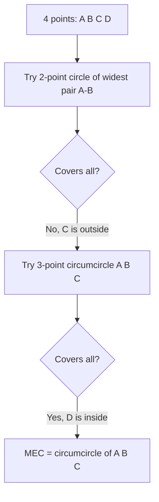
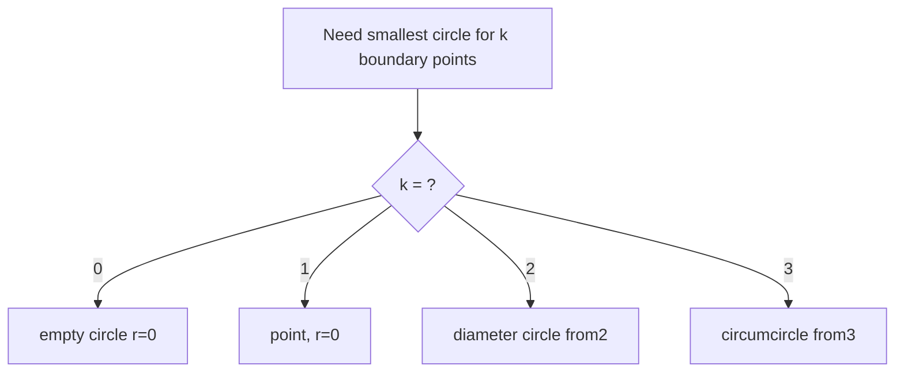

# Minimum Enclosing Circle — Junior Level

> **One-line summary:** The minimum enclosing circle (MEC) of a set of points is the **smallest circle that contains all of them** (inside or on the boundary). The remarkable fact is that this circle is always pinned down by just **2 or 3** of the points sitting on its boundary, and **Welzl's algorithm** finds it in **expected O(n)** time.

---

## Table of Contents

1. [Introduction](#introduction)
2. [Prerequisites](#prerequisites)
3. [Glossary](#glossary)
4. [Core Concepts](#core-concepts)
5. [Big-O Summary](#big-o-summary)
6. [Real-World Analogies](#real-world-analogies)
7. [Pros & Cons](#pros--cons)
8. [Step-by-Step Walkthrough](#step-by-step-walkthrough)
9. [Code Examples](#code-examples)
10. [Coding Patterns](#coding-patterns)
11. [Error Handling](#error-handling)
12. [Performance Tips](#performance-tips)
13. [Best Practices](#best-practices)
14. [Edge Cases & Pitfalls](#edge-cases--pitfalls)
15. [Common Mistakes](#common-mistakes)
16. [Cheat Sheet](#cheat-sheet)
17. [Visual Animation](#visual-animation)
18. [Summary](#summary)
19. [Further Reading](#further-reading)

---

## Introduction

Imagine you have a scattering of dots on a piece of paper and you want to draw **the smallest possible circle** that still covers every single dot. No dot is allowed to poke outside the circle, but they may sit right on the edge. That smallest circle is the **minimum enclosing circle** (MEC). You will also see it called the **smallest enclosing circle**, the **minimum bounding circle**, or — in operations-research language — the **1-center** of the points (the single center that minimizes the maximum distance to any point).

This problem shows up everywhere once you start looking. A game engine wraps a model in a **bounding sphere** so that two objects can be cheaply tested for "are they even close?" before doing expensive collision math. A telecom company wants to place **one** broadcast tower so that the *farthest* customer is as close as possible. A robot must find a meeting point that minimizes the worst-case travel for a swarm. All of these are minimum-enclosing-circle questions.

The first surprise for newcomers is *how few points actually matter*. You might have a million points, but the final circle is **fully determined by at most three of them** lying on its boundary — sometimes only two. Every other point is strictly inside and irrelevant to the circle's size. This is what makes a beautiful fast algorithm possible.

The second surprise is that the fast algorithm — **Welzl's algorithm (1991)** — is *randomized*. It shuffles the points, then adds them one at a time, and only does real work when a newly added point falls **outside** the circle it has built so far. Because that "outside" event becomes rare as the circle settles, the expected total work is just **O(n)** — linear. We will build up to it gently here; the full *why* lives in `middle.md` and the proof in `professional.md`.

This junior file answers the two beginner questions: **what is the MEC**, and **how do you compute the two small primitives** (a circle through 2 points, and the unique circle through 3 points) that every MEC algorithm is built on.

---

## Prerequisites

Before reading this file you should be comfortable with:

- **2-D coordinates** — a point is a pair `(x, y)` of real numbers.
- **The distance formula** — `dist((x1,y1),(x2,y2)) = sqrt((x1-x2)² + (y1-y2)²)`.
- **Basic loops and arrays** in any of Go / Java / Python.
- **Floating-point numbers** — and the idea that `==` on floats is dangerous (use a small tolerance `eps`).
- **Big-O notation** — `O(n)`, `O(n²)`, `O(n³)`, `O(n⁴)`.

Optional but helpful:

- A little geometry: what a **circle** is (a center and a radius), and what a **circumcircle** of a triangle is.
- **Recursion** basics — Welzl's algorithm (covered fully at middle level) is recursive.

You do **not** need calculus, linear algebra, or any prior computational-geometry topic. If you have done the sibling topic *01-convex-hull* it will help your intuition (the MEC's boundary points are always hull points), but it is not required.

---

## Glossary

| Term | Meaning |
|------|---------|
| **Point** | A location `(x, y)` in the plane. |
| **Circle** | A center point `c = (cx, cy)` plus a radius `r ≥ 0`. |
| **Enclosing / covering** | A circle *encloses* a point `p` if `dist(c, p) ≤ r` (inside or on the boundary). |
| **Minimum enclosing circle (MEC)** | The enclosing circle with the **smallest** radius. It is **unique**. |
| **Smallest enclosing circle** | A synonym for MEC. |
| **Minimum bounding circle** | Another synonym for MEC. |
| **1-center** | The MEC's center, viewed as the facility-location point that minimizes the maximum distance. |
| **Boundary point / support point** | A point that lies *exactly on* the MEC's edge. The MEC has 2 or 3 of these. |
| **Circumcircle** | The unique circle passing through 3 given (non-collinear) points. |
| **Diameter circle** | The circle whose diameter is the segment between 2 points (center = midpoint). |
| **Welzl's algorithm** | A randomized incremental algorithm computing the MEC in expected O(n) time. |
| **eps (epsilon)** | A tiny tolerance (e.g. `1e-9`) used to compare floating-point values safely. |

---

## Core Concepts

### 1. A circle is just a center and a radius

Everything in this topic reduces to one test: *is point `p` inside circle `(c, r)`?* The answer is "yes" exactly when `dist(c, p) ≤ r`. To avoid the slow `sqrt`, we usually compare **squared** distances: `(px-cx)² + (py-cy)² ≤ r²`. Squaring is safe because both sides are non-negative and `sqrt` is increasing.

### 2. The MEC is determined by 2 or 3 boundary points

Here is the key structural fact (proved in `professional.md` as the **2-or-3-points lemma**):

> The minimum enclosing circle of a point set always has **either two points on its boundary forming a diameter, or three points on its boundary**. Those points alone determine the entire circle; all other points lie strictly inside.

Intuitively, if the smallest circle had **zero** boundary points, you could shrink it a little and still cover everything — contradiction. If it had exactly **one**, you could slide the center toward that point and shrink — contradiction again. So at least two points must be "stuck" on the boundary, and at most three are needed to lock all degrees of freedom. This is why the two primitives below are all you ever need.

### 3. Primitive A — the circle through 2 points (diameter circle)

Given two points `a` and `b`, the smallest circle with **both on its boundary** has:

- **center** = the midpoint of `a` and `b`,
- **radius** = half the distance between them.

```
center = ((ax+bx)/2, (ay+by)/2)
radius = dist(a, b) / 2
```

This is the circle whose *diameter* is the segment `ab`. It is the right answer when those two points are the "widest apart" pair that pins the set.

### 4. Primitive B — the circumcircle through 3 points

Given three points `a`, `b`, `c` that are **not collinear**, there is exactly one circle passing through all three: the **circumcircle**. Its center is the point equidistant from all three (the *circumcenter*), found by intersecting the perpendicular bisectors of two sides. The closed-form (see code below) uses a determinant `d = 2·(ax(by−cy) + bx(cy−ay) + cx(ay−by))`. If `d = 0` the three points are collinear and there is **no** finite circumcircle (handle that case separately).

### 5. Why a fast algorithm is even possible

Because only 2 or 3 points matter, you do **not** need to consider all points equally. A naive method tries every pair and every triple of points (that is the slow `O(n⁴)`/`O(n³)` approach below). Welzl's algorithm instead grows the circle incrementally and almost never has to rebuild it, giving **expected O(n)**. Junior level: understand the primitives and the naive method first; the smart method is the star of `middle.md`.

---

## Big-O Summary

| Approach | Time | Space | Notes |
|----------|------|-------|-------|
| Inside test `dist(c,p) ≤ r` | **O(1)** | O(1) | The single most-used operation. |
| Circle from 2 points | **O(1)** | O(1) | Midpoint + half-distance. |
| Circumcircle from 3 points | **O(1)** | O(1) | Closed-form determinant. |
| Naive "try all triples + pairs" | **O(n⁴)** | O(1) | Test every candidate circle against all points. |
| Smarter naive (pairs, then triples) | **O(n³)** | O(1) | Still brute force, but pruned. |
| **Welzl's algorithm** | **expected O(n)** | O(n) | Randomized incremental — the one to use. |
| Welzl worst case (terrible shuffle) | O(n²) or worse | O(n) | Astronomically unlikely with a real shuffle. |

> `n` = number of input points. The expected O(n) of Welzl is over the *random* shuffle, not over the input — there is no "bad input," only a vanishingly unlikely bad coin flip.

---

## Real-World Analogies

| Concept | Analogy |
|---------|---------|
| The MEC itself | The smallest round table that still seats everyone — no guest's chair sticks out past the edge. |
| 2-point (diameter) circle | A tug-of-war rope: the two people pulling hardest define the whole span; the center is the midpoint of the rope. |
| 3-point circumcircle | A round pizza cut so that three specific toppings all land exactly on the crust's edge. |
| Points strictly inside | Spectators in a stadium — they don't change the size of the field; only the people on the boundary do. |
| Welzl's "only rebuild when a point is outside" | Packing a suitcase: you only resize/repack when something *doesn't fit*; if it already fits, you leave it alone. |
| Randomized shuffle | Dealing a deck of cards before a game so no one can rig the order against you. |
| 1-center / facility location | Choosing where to build the single fire station so the *farthest* house is reached as fast as possible. |

Where the analogies break: a round table can be *larger* than necessary and still seat everyone, but the MEC is specifically the **smallest** such circle — uniqueness matters. And the "suitcase" stops at one item, whereas Welzl recurses over a shrinking subset.

---

## Pros & Cons

| Pros | Cons |
|------|------|
| The MEC is **unique** — there is exactly one right answer. | Sensitive to floating-point error near degenerate (nearly collinear / nearly cocircular) inputs. |
| Determined by only **2 or 3** points — tiny "certificate." | The fast algorithm (Welzl) is recursive and randomized, so it can feel less obvious than a loop. |
| Welzl runs in **expected linear time** — scales to millions of points. | A single far-out outlier can blow up the radius (it's a *min-max* objective). |
| The two primitives (2-point, 3-point circle) are simple, exact formulas. | Generalizing to spheres in higher dimensions gets harder (covered at senior level). |
| Great for bounding volumes, clustering, and facility location. | Not the same as the *centroid* (center of mass) — beginners often confuse the two. |

**When to use:** bounding spheres for collision pre-checks, "place one facility to minimize worst-case distance," clustering radius estimation, meeting-point problems, any "smallest covering circle" query.

**When NOT to use:** when you want the *average* distance minimized (that's the geometric median, a different problem), or when outliers should be ignored (you'd want a *robust* / k-enclosing variant — see `senior.md`).

---

## Step-by-Step Walkthrough

Let's compute the MEC of four points by hand using the two primitives.

```
Points:  A=(0,0)  B=(4,0)  C=(2,3)  D=(2,1)
```

Plot them: `A` and `B` are on the x-axis 4 apart, `C` is up high, `D` sits low in the middle.

**Try the diameter circle of the widest pair, A–B:**

```
center = midpoint(A,B) = (2, 0)
radius = dist(A,B)/2  = 4/2 = 2
```

Does this circle (center `(2,0)`, r=2) cover everyone?

```
dist((2,0), C=(2,3)) = 3  >  2   ->  C is OUTSIDE. Reject.
```

So two points are not enough; `C` forces a bigger circle. **Try the circumcircle of A, B, C:**

```
Using the determinant formula (see code):
d = 2*( 0*(0-3) + 4*(3-0) + 2*(0-0) ) = 2*(0 + 12 + 0) = 24
cx = ( (0²+0²)*(0-3) + (4²+0²)*(3-0) + (2²+3²)*(0-0) ) / 24
   = ( 0*(-3) + 16*3 + 13*0 ) / 24 = 48/24 = 2
cy = ( (0²+0²)*(2-4) + (4²+0²)*(0-2) + (2²+3²)*(4-0) ) / 24
   = ( 0 + 16*(-2) + 13*4 ) / 24 = (-32 + 52)/24 = 20/24 ≈ 0.8333
center ≈ (2, 0.833),  radius = dist(center, A) = sqrt(2² + 0.833²) ≈ 2.166
```

Check every point against center `(2, 0.833)`, r ≈ 2.166:

```
A=(0,0): dist ≈ 2.166  = r   (on boundary) ✓
B=(4,0): dist ≈ 2.166  = r   (on boundary) ✓
C=(2,3): dist ≈ 2.166  = r   (on boundary) ✓
D=(2,1): dist ≈ 0.166  < r   (inside)      ✓
```

All four covered. The MEC is the **circumcircle of A, B, C** with three boundary points; `D` sits comfortably inside and never mattered. That is the 2-or-3-points lemma in action: we *tried* 2 points, it failed, so 3 points pinned it.



---

## Code Examples

### Example: the two primitives + a simple brute-force MEC

The brute force is `O(n³)`: for every pair and every triple, build the candidate circle and check whether it covers all points; keep the smallest valid one. It is slow but *obviously correct* and perfect for testing the fast algorithm later.

#### Go

```go
package main

import (
	"fmt"
	"math"
)

type Point struct{ X, Y float64 }
type Circle struct {
	C Point
	R float64
}

const eps = 1e-9

func dist(a, b Point) float64 {
	dx, dy := a.X-b.X, a.Y-b.Y
	return math.Sqrt(dx*dx + dy*dy)
}

// circleContains reports whether p is inside (or on) the circle.
func circleContains(c Circle, p Point) bool {
	return dist(c.C, p) <= c.R+eps
}

// circleFrom2 returns the circle with a and b as a diameter.
func circleFrom2(a, b Point) Circle {
	center := Point{(a.X + b.X) / 2, (a.Y + b.Y) / 2}
	return Circle{center, dist(a, b) / 2}
}

// circleFrom3 returns the unique circumcircle of a, b, c.
// If the points are collinear, ok is false.
func circleFrom3(a, b, c Point) (Circle, bool) {
	d := 2 * (a.X*(b.Y-c.Y) + b.X*(c.Y-a.Y) + c.X*(a.Y-b.Y))
	if math.Abs(d) < eps {
		return Circle{}, false // collinear: no finite circumcircle
	}
	ax2 := a.X*a.X + a.Y*a.Y
	bx2 := b.X*b.X + b.Y*b.Y
	cx2 := c.X*c.X + c.Y*c.Y
	ux := (ax2*(b.Y-c.Y) + bx2*(c.Y-a.Y) + cx2*(a.Y-b.Y)) / d
	uy := (ax2*(c.X-b.X) + bx2*(a.X-c.X) + cx2*(b.X-a.X)) / d
	center := Point{ux, uy}
	return Circle{center, dist(center, a)}, true
}

// bruteMEC: O(n^3) reference implementation.
func bruteMEC(pts []Point) Circle {
	n := len(pts)
	if n == 0 {
		return Circle{}
	}
	if n == 1 {
		return Circle{pts[0], 0}
	}
	best := Circle{R: math.Inf(1)}
	covers := func(c Circle) bool {
		for _, p := range pts {
			if !circleContains(c, p) {
				return false
			}
		}
		return true
	}
	// candidate circles from every pair (diameter)
	for i := 0; i < n; i++ {
		for j := i + 1; j < n; j++ {
			c := circleFrom2(pts[i], pts[j])
			if c.R < best.R && covers(c) {
				best = c
			}
		}
	}
	// candidate circles from every triple (circumcircle)
	for i := 0; i < n; i++ {
		for j := i + 1; j < n; j++ {
			for k := j + 1; k < n; k++ {
				if c, ok := circleFrom3(pts[i], pts[j], pts[k]); ok {
					if c.R < best.R && covers(c) {
						best = c
					}
				}
			}
		}
	}
	return best
}

func main() {
	pts := []Point{{0, 0}, {4, 0}, {2, 3}, {2, 1}}
	mec := bruteMEC(pts)
	fmt.Printf("center=(%.3f, %.3f) r=%.3f\n", mec.C.X, mec.C.Y, mec.R)
	// center=(2.000, 0.833) r=2.166
}
```

#### Java

```java
public class MEC {
    static final double EPS = 1e-9;

    record Point(double x, double y) {}
    record Circle(Point c, double r) {}

    static double dist(Point a, Point b) {
        double dx = a.x() - b.x(), dy = a.y() - b.y();
        return Math.sqrt(dx * dx + dy * dy);
    }

    static boolean contains(Circle c, Point p) {
        return dist(c.c(), p) <= c.r() + EPS;
    }

    static Circle from2(Point a, Point b) {
        Point center = new Point((a.x() + b.x()) / 2, (a.y() + b.y()) / 2);
        return new Circle(center, dist(a, b) / 2);
    }

    // Returns null if the three points are collinear.
    static Circle from3(Point a, Point b, Point c) {
        double d = 2 * (a.x() * (b.y() - c.y())
                      + b.x() * (c.y() - a.y())
                      + c.x() * (a.y() - b.y()));
        if (Math.abs(d) < EPS) return null;
        double a2 = a.x() * a.x() + a.y() * a.y();
        double b2 = b.x() * b.x() + b.y() * b.y();
        double c2 = c.x() * c.x() + c.y() * c.y();
        double ux = (a2 * (b.y() - c.y()) + b2 * (c.y() - a.y()) + c2 * (a.y() - b.y())) / d;
        double uy = (a2 * (c.x() - b.x()) + b2 * (a.x() - c.x()) + c2 * (b.x() - a.x())) / d;
        Point center = new Point(ux, uy);
        return new Circle(center, dist(center, a));
    }

    static boolean covers(Circle c, Point[] pts) {
        for (Point p : pts) if (!contains(c, p)) return false;
        return true;
    }

    // O(n^3) reference implementation.
    static Circle bruteMEC(Point[] pts) {
        int n = pts.length;
        if (n == 0) return new Circle(new Point(0, 0), 0);
        if (n == 1) return new Circle(pts[0], 0);
        Circle best = new Circle(new Point(0, 0), Double.POSITIVE_INFINITY);
        for (int i = 0; i < n; i++)
            for (int j = i + 1; j < n; j++) {
                Circle c = from2(pts[i], pts[j]);
                if (c.r() < best.r() && covers(c, pts)) best = c;
            }
        for (int i = 0; i < n; i++)
            for (int j = i + 1; j < n; j++)
                for (int k = j + 1; k < n; k++) {
                    Circle c = from3(pts[i], pts[j], pts[k]);
                    if (c != null && c.r() < best.r() && covers(c, pts)) best = c;
                }
        return best;
    }

    public static void main(String[] args) {
        Point[] pts = { new Point(0, 0), new Point(4, 0), new Point(2, 3), new Point(2, 1) };
        Circle mec = bruteMEC(pts);
        System.out.printf("center=(%.3f, %.3f) r=%.3f%n", mec.c().x(), mec.c().y(), mec.r());
        // center=(2.000, 0.833) r=2.166
    }
}
```

#### Python

```python
import math

EPS = 1e-9


def dist(a, b):
    return math.hypot(a[0] - b[0], a[1] - b[1])


def contains(circle, p):
    center, r = circle
    return dist(center, p) <= r + EPS


def from2(a, b):
    """Smallest circle with a and b on its boundary (a diameter)."""
    center = ((a[0] + b[0]) / 2, (a[1] + b[1]) / 2)
    return (center, dist(a, b) / 2)


def from3(a, b, c):
    """Circumcircle of a, b, c. Returns None if they are collinear."""
    d = 2 * (a[0] * (b[1] - c[1]) + b[0] * (c[1] - a[1]) + c[0] * (a[1] - b[1]))
    if abs(d) < EPS:
        return None
    a2 = a[0] ** 2 + a[1] ** 2
    b2 = b[0] ** 2 + b[1] ** 2
    c2 = c[0] ** 2 + c[1] ** 2
    ux = (a2 * (b[1] - c[1]) + b2 * (c[1] - a[1]) + c2 * (a[1] - b[1])) / d
    uy = (a2 * (c[0] - b[0]) + b2 * (a[0] - c[0]) + c2 * (b[0] - a[0])) / d
    center = (ux, uy)
    return (center, dist(center, a))


def brute_mec(pts):
    """O(n^3) reference implementation."""
    n = len(pts)
    if n == 0:
        return ((0, 0), 0)
    if n == 1:
        return (pts[0], 0)

    def covers(circle):
        return all(contains(circle, p) for p in pts)

    best = (None, math.inf)
    for i in range(n):
        for j in range(i + 1, n):
            c = from2(pts[i], pts[j])
            if c[1] < best[1] and covers(c):
                best = c
    for i in range(n):
        for j in range(i + 1, n):
            for k in range(j + 1, n):
                c = from3(pts[i], pts[j], pts[k])
                if c is not None and c[1] < best[1] and covers(c):
                    best = c
    return best


if __name__ == "__main__":
    pts = [(0, 0), (4, 0), (2, 3), (2, 1)]
    (cx, cy), r = brute_mec(pts)
    print(f"center=({cx:.3f}, {cy:.3f}) r={r:.3f}")
    # center=(2.000, 0.833) r=2.166
```

**What it does:** builds the two primitive circles and an `O(n³)` brute-force MEC, then verifies it on our four-point example.
**Run:** `go run main.go` | `javac MEC.java && java MEC` | `python mec.py`

---

## Coding Patterns

### Pattern 1: Compare squared distances to skip `sqrt`

**Intent:** the inside test runs millions of times; avoid the expensive `sqrt`.

```python
def contains_sq(center, r, p):
    dx, dy = center[0] - p[0], center[1] - p[1]
    return dx * dx + dy * dy <= r * r + EPS
```

Comparing `(dx² + dy²)` against `r²` gives the same answer as comparing distances, because squaring preserves order for non-negative numbers. Use this in hot loops; use the readable `sqrt` version only when you must report the actual radius.

### Pattern 2: Diameter-or-circumcircle dispatch

**Intent:** the "smallest circle through these few points" sub-problem always has 0, 1, 2, or 3 points.

```python
def trivial(points):
    if not points:
        return ((0.0, 0.0), 0.0)
    if len(points) == 1:
        return (points[0], 0.0)
    if len(points) == 2:
        return from2(points[0], points[1])
    # exactly 3 points -> circumcircle (or fall back to the best 2-point pair)
    c = from3(*points)
    return c if c else best_of_three_pairs(points)
```

This tiny helper is the **base case** of Welzl's recursion (see `middle.md`). Recognizing it now makes the fast algorithm click later.



### Pattern 3: Validate with the brute force

**Intent:** never trust a fast geometry routine until a slow obviously-correct one agrees.

```python
def agree(pts):
    fast = welzl(pts)       # your O(n) version (middle.md)
    slow = brute_mec(pts)   # this file's O(n^3) version
    return abs(fast[1] - slow[1]) < 1e-6
```

Run this on thousands of random point sets. It is the single most effective bug-catcher for MEC code.

---

## Error Handling

| Error | Cause | Fix |
|-------|-------|-----|
| Division by zero in `from3` | The three points are collinear (`d ≈ 0`). | Check `abs(d) < eps` and return "no circumcircle"; fall back to the best pair. |
| A point reports as outside when it's on the edge | Exact floating-point equality at the boundary. | Compare with tolerance: `dist ≤ r + eps`, not `<`. |
| Wrong (too small) circle returned | Brute force didn't test every triple/pair, or `covers` used `<` not `≤`. | Use `≤ r + eps` in `covers`; test all pairs *and* all triples. |
| `NaN` radius | Squaring overflowed or input had `Inf`/`NaN`. | Validate inputs; use 64-bit floats; keep coordinates in a reasonable range. |
| Empty input crash | No points given. | Define MEC of 0 points as radius 0; of 1 point as that point, radius 0. |

---

## Performance Tips

- **Square the distances** in the inside test to drop `sqrt` from the hot path.
- **Don't run the `O(n³)` brute force** on more than a few hundred points — it is only for correctness checks. Use Welzl (`middle.md`) in production.
- **Only the convex-hull points can be boundary points** of the MEC, so on huge inputs you *could* hull first (`O(n log n)`) and run MEC on the hull — but Welzl is already `O(n)`, so this rarely helps. Know the fact; don't over-engineer.
- **Keep coordinates centered near the origin** when possible; squaring large magnitudes loses float precision.
- **Reuse a single `covers` helper** so the inside test is written (and optimized) exactly once.

---

## Best Practices

- Write the **brute force first** — it is your oracle for testing the fast version.
- Always handle the **collinear** case in `from3` explicitly; never let it divide by zero.
- Use a named `eps` constant (e.g. `1e-9`) and pass it everywhere, rather than sprinkling magic numbers.
- Compare **squared** distances internally; only take `sqrt` when returning a human-facing radius.
- Treat `n = 0` and `n = 1` as defined special cases, not crashes.
- Test on **degenerate inputs**: all points identical, all collinear, exactly 2 points, points on a perfect circle.

---

## Edge Cases & Pitfalls

- **Zero points** — define the MEC as radius 0 (or "undefined" by convention); don't crash.
- **One point** — the MEC is that point with radius 0.
- **Two points** — the MEC is always their diameter circle; no triple is needed.
- **All points identical** — radius 0, center on the shared point.
- **All points collinear** — the MEC is the diameter circle of the two *extreme* points; `from3` will (correctly) refuse every triple.
- **Points exactly on a circle (cocircular)** — many triples give the same circle; floating point may wobble. Tolerances matter.
- **Duplicate points** — harmless; they never change the answer but waste a little time.
- **One far outlier** — legitimately blows up the radius; that is the *correct* min-max answer, not a bug.

---

## Common Mistakes

1. **Confusing the MEC center with the centroid** (average of the points). They are *different*; the centroid does not minimize the maximum distance.
2. **Using `<` instead of `≤ + eps`** in the inside test, so boundary points are wrongly rejected.
3. **Forgetting the collinear guard** in `from3`, causing a divide-by-zero.
4. **Only testing pairs OR only testing triples** in brute force — you need both (2-point *and* 3-point circles).
5. **Taking `sqrt` everywhere** and paying for it in the hot loop instead of comparing squared values.
6. **Assuming more boundary points means a better circle** — the MEC has *at most* 3; trying to force more is meaningless.
7. **Running brute force on big inputs** and concluding "MEC is slow." It isn't — Welzl is linear.

---

## Cheat Sheet

| Need | Formula / rule |
|------|----------------|
| Inside test | `dist(c, p) ≤ r` (use squared: `dx²+dy² ≤ r²`). |
| Circle from 2 points | center = midpoint, radius = `dist(a,b)/2`. |
| Circle from 3 points | circumcircle via determinant `d`; collinear if `d ≈ 0`. |
| Number of boundary points | always **2 or 3**. |
| MEC of 0 points | radius 0 (by convention). |
| MEC of 1 point | the point, radius 0. |
| MEC of 2 points | their diameter circle. |
| Brute force | `O(n³)` — pairs + triples, keep smallest valid; **testing only**. |
| Fast algorithm | **Welzl**, expected `O(n)` (see `middle.md`). |

Hard rule: **compare with a tolerance**, never raw float `==`.

---

## Visual Animation

> See [`animation.html`](./animation.html) for an interactive visual animation of the minimum enclosing circle.
>
> The animation demonstrates:
> - The scattered points and the current enclosing circle
> - The circle shrinking and re-centering as Welzl processes each point
> - The 2 or 3 **boundary (support) points** highlighted on the circle's edge
> - A point flagged when it falls *outside*, triggering a rebuild
> - Step / Run / Reset controls, an info panel, a Big-O table, and an operation log

---

## Summary

The minimum enclosing circle is the smallest circle covering a set of points, and it is **unique**. Its defining property — the one that makes everything else possible — is that it touches only **2 or 3** of the points on its boundary; everyone else is strictly inside. Two simple closed-form primitives build any candidate circle: the **diameter circle** through 2 points, and the **circumcircle** through 3. A brute-force `O(n³)` method tries all such candidates and keeps the smallest valid one — slow, but a perfect correctness oracle. In production you reach for **Welzl's randomized incremental algorithm**, which runs in **expected O(n)** by only rebuilding the circle when a new point falls outside. Master the inside test, the two primitives, and the 2-or-3-points fact, and you are ready for the real algorithm.

---

## Further Reading

- Welzl, E. (1991). *Smallest enclosing disks (balls and ellipsoids).* New Results and New Trends in Computer Science, LNCS 555 — the original paper.
- *Computational Geometry: Algorithms and Applications* (de Berg et al.), Chapter 4 — linear programming and the smallest enclosing disk.
- cp-algorithms.com — "Minimum Enclosing Circle (Welzl's algorithm)."
- Megiddo, N. (1983). *Linear-time algorithms for linear programming in R³ and related problems.* — the deterministic O(n) result.
- Sibling topics: *01-convex-hull* (MEC boundary points are hull points), *06-rotating-calipers* (diameter of a point set), *22-randomized-algorithms* (the randomized-incremental paradigm).

---

**Next step:** Continue to [`middle.md`](./middle.md) to learn Welzl's algorithm in full — the move-to-front trick, the recursion with up to 3 boundary points, and why the expected running time is O(n).
