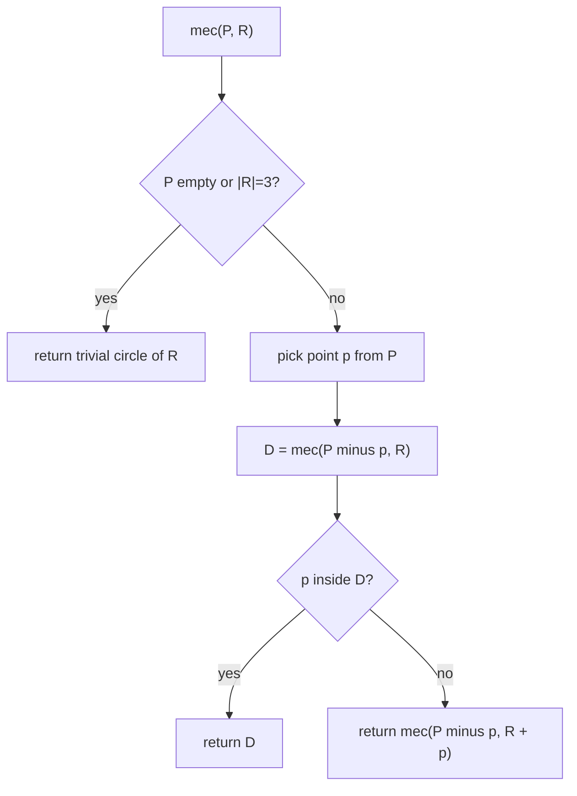

# Minimum Enclosing Circle — Middle Level

> **Focus:** *Why* Welzl's algorithm works and *when* to choose it. We dissect the randomized incremental method, the **move-to-front** heuristic, the recursion bounded by **at most 3** boundary points, the intuition for **expected O(n)**, and how it beats the naive `O(n⁴)`/`O(n³)` approaches. We also touch the **LP-type** view that links MEC to linear programming.

---

## Table of Contents

1. [Introduction](#introduction)
2. [Deeper Concepts](#deeper-concepts)
3. [Comparison with Alternatives](#comparison-with-alternatives)
4. [Welzl's Algorithm in Full](#welzls-algorithm-in-full)
5. [Why Expected O(n)?](#why-expected-on)
6. [The Move-to-Front Heuristic](#the-move-to-front-heuristic)
7. [Code Examples](#code-examples)
8. [Error Handling](#error-handling)
9. [Performance Analysis](#performance-analysis)
10. [Best Practices](#best-practices)
11. [Visual Animation](#visual-animation)
12. [Summary](#summary)

---

## Introduction

At junior level the MEC is "the smallest circle covering all points, pinned by 2 or 3 of them," and you compute it with a slow but obvious `O(n³)` brute force. At middle level you graduate to the algorithm people actually ship: **Welzl's randomized incremental algorithm**, which solves the same problem in **expected linear time**.

The engineering questions this file answers:

- *How* does Welzl turn "the circle is determined by ≤ 3 points" into a fast recursion?
- *Why* does shuffling the input make the expected running time `O(n)` rather than the worst case?
- *What* is the move-to-front refinement and why does production code use it?
- *When* should you prefer brute force, an incremental method, or an LP solver?
- *How* does this all connect to **linear programming** and the broader **LP-type** family (which also covers smallest enclosing ellipsoid, line fitting, and more)?

The payoff: you will be able to write a 30-line MEC routine that handles a million points in milliseconds, and explain to a skeptic exactly why it is correct and fast.

---

## Deeper Concepts

### The incremental idea

Process points one at a time, maintaining the MEC of everything seen so far. When you add a new point `p`:

- **If `p` is already inside the current circle**, the circle does not change — nothing to do.
- **If `p` is outside**, then `p` *must* lie on the boundary of the new MEC. (If it weren't, the old circle — which covers everyone else — would still be optimal, contradicting that `p` was outside.)

That second bullet is the engine of the whole algorithm. It lets us *fix `p` as a boundary point* and recompute the MEC of the earlier points **subject to the constraint that `p` is on the boundary**. That constrained sub-problem is smaller and has fewer free parameters, so the recursion bottoms out quickly.

### The "with these on the boundary" sub-problem

Welzl defines a helper `mec(P, R)`: the smallest circle that **encloses all points in `P`** *and* has **every point of `R` exactly on its boundary**. `R` is the set of *required boundary points*, and it never exceeds **3** elements — because 3 boundary points already lock a circle completely (the circumcircle), so a 4th required point would be over-determined and is never needed.

The base cases of `mec(P, R)`:

| `|R|` | `P` | Result |
|-------|-----|--------|
| 0 | empty | trivial empty circle (r = 0) |
| 1 | empty | the single point, r = 0 |
| 2 | empty | diameter circle of the two `R` points |
| 3 | empty | circumcircle of the three `R` points |
| — | `P` empty | build the circle from `R` alone (the rows above) |

So the recursion stops as soon as `P` is exhausted **or** `|R| = 3`. That bound of 3 is the entire reason this is fast.

### The recursive structure

```text
mec(P, R):
    if P is empty or |R| == 3:
        return trivial_circle(R)          # base case from the table above
    p = remove one point from P           # (the random order matters!)
    D = mec(P, R)                          # solve without p first
    if p is inside D:
        return D                           # p didn't matter
    # p is outside -> p MUST be on the boundary
    return mec(P, R ∪ {p})                # re-solve, forcing p onto the boundary
```

Two recursive calls, but the **second one fires only when `p` is outside `D`** — and that is rare once the circle has settled. Quantifying "rare" is the expected-time argument below.



### The 2-or-3-points lemma (why ≤ 3 is enough)

The MEC is the solution to a problem with **three degrees of freedom**: center `(cx, cy)` and radius `r`. Each "point on the boundary" equation `dist(c, p) = r` removes one degree of freedom. So **3 boundary points** generically determine the circle uniquely (the circumcircle). Sometimes only **2** are needed — when those two are a *diameter* and every other point already fits inside that diameter circle. You never need 4, because 3 equations already fix 3 unknowns. (The formal version, including why a valid configuration always exists, is the **2-or-3-points lemma** proved in `professional.md`.)

---

## Comparison with Alternatives

| Attribute | Welzl (randomized) | Naive O(n⁴) | Pruned brute O(n³) | Megiddo (deterministic) | Convex hull + MEC |
|-----------|-------------------|-------------|--------------------|-----------------------|-------------------|
| Time | **expected O(n)** | O(n⁴) | O(n³) | O(n) worst case | O(n log n) + O(h) |
| Space | O(n) | O(1) | O(1) | O(n) | O(n) |
| Deterministic? | No (randomized) | Yes | Yes | Yes | Yes |
| Code complexity | Low (~30 lines) | Trivial | Trivial | Very high (prune-and-search) | Medium |
| Practical speed | Fastest in practice | Unusable past ~100 pts | Test-only | Slower constants than Welzl | Rarely beats Welzl |
| Best for | Everything real | Teaching | Correctness oracle | Theory / hard-real-time | When hull already computed |

**Choose Welzl when:** you want the simplest fast code for any input size — the default.
**Choose brute force when:** `n` is tiny *and* you need a correctness oracle, or you must be deterministic and `n ≤ ~100`.
**Choose Megiddo when:** you need *worst-case* (not expected) linear time with no randomness — rare, e.g. hard-real-time or adversarial settings. See `professional.md`.

### Why the naive methods are O(n⁴) / O(n³)

The MEC is some 2-point or 3-point circle. The naive method enumerates **every** candidate:

- **Triples:** there are `C(n,3) = O(n³)` triples; each gives a circumcircle, and checking whether that circle covers all `n` points costs `O(n)`. That is `O(n⁴)` if you check coverage for every triple.
- **Pruned to O(n³):** generate the `O(n²)` pair-circles and `O(n³)` triple-circles, but verify coverage lazily / keep only the running best — still cubic in the triple loop. Either way it is hopeless past a few hundred points.

Welzl avoids enumeration entirely: it *grows* the answer, doing real work only on the rare "outside" event.

---

## Welzl's Algorithm in Full

The published algorithm has two layers:

1. **Shuffle** the points uniformly at random (this is what makes the expected analysis work).
2. Call `mec(points, R = {})` and recurse as above.

The randomness is the secret sauce. There is **no bad input** — only a vanishingly unlikely bad *shuffle*. For any fixed point set, the expected work over random shuffles is `O(n)`.

A subtle but important detail: the recursion as written is **deep** (up to `n` levels), which can overflow the call stack for large `n`. Production code therefore uses the **iterative move-to-front variant** (below), which is both stack-safe and slightly faster.

### Common bugs and how to avoid them

| Bug | Effect | Fix |
|-----|--------|-----|
| Forgot to shuffle | `O(n²)` on sorted/adversarial input | Shuffle first, always |
| Strict `<` in the inside test | Boundary points rejected → wrong/too-big circle | Use `≤ r + eps` |
| No collinear guard in `from3` | Divide-by-zero | Check `\|d\| < eps`, fall back to widest pair |
| Mutating the caller's array | Surprising side effects | Copy before shuffling |
| Recursing on millions of points | Stack overflow | Use the iterative MTF form |

These five account for nearly every broken MEC implementation in the wild. The first two are the most common in interviews.

---

## Why Expected O(n)?

Here is the *intuition* (the rigorous **backwards analysis** is in `professional.md`).

Consider adding points in random order and asking: *when we add the `i`-th point, what is the probability it falls outside the current MEC and forces a rebuild?*

The MEC of the first `i` points is determined by at most **3** of those `i` points. By symmetry of the random order, the `i`-th point added is equally likely to be *any* of the `i` points. It only triggers a rebuild if it is one of the (≤ 3) **determining** points. So:

```text
Pr[point i triggers a rebuild] ≤ 3 / i
```

A rebuild at step `i` costs `O(i)` work (re-scanning the earlier points with one more boundary constraint). Expected total work:

```text
E[total] = Σ_{i=1}^{n}  (3/i) · O(i)  =  Σ_{i=1}^{n} O(3)  =  O(n)
```

The magic is the cancellation: the `O(i)` cost of a rebuild is exactly killed by the `1/i` probability of needing one. The same cancellation happens one level deeper (the inner recursion forcing a 2nd or 3rd boundary point), and it still sums to `O(n)`. This `3/i` bound and its telescoping sum are the heart of the proof.

| Recursion level | Boundary points fixed | Rebuild prob at step i | Cost per rebuild | Contribution |
|-----------------|----------------------|------------------------|------------------|--------------|
| Outer | 0 | ≤ 3/i | O(i) | O(1) per i → O(n) |
| Middle | 1 | ≤ 2/i | O(i) | O(1) per i → O(n) |
| Inner | 2 | ≤ 1/i | O(i) | O(1) per i → O(n) |

Sum across all three levels: still `O(n)`.

---

## The Move-to-Front Heuristic

The recursive form re-shuffles conceptually every call. The **move-to-front (MTF)** variant — the one in Welzl's paper and in fast implementations — does something cleverer:

> When a point `p` is found to be **outside** the current circle, move it to the **front** of the list before continuing.

The idea: points that *recently violated* the circle are likely to be important (near the boundary), so trying them earlier next time settles the circle faster and reduces future violations. MTF keeps the same expected `O(n)` bound but improves the constant factor substantially in practice, and — crucially — lets the algorithm be written **iteratively** (no deep recursion). The standard MTF implementation runs three nested passes that grow the boundary set from 0 to 1 to 2, computing the circle from those boundary points plus the running prefix.

Below, the recursive version is given for clarity, and the MTF iterative version is what you would actually deploy.

---

## Code Examples

### Recursive Welzl (clear, for understanding)

#### Go

```go
package main

import (
	"fmt"
	"math"
	"math/rand"
)

type Point struct{ X, Y float64 }
type Circle struct {
	C Point
	R float64
}

const eps = 1e-9

func dist(a, b Point) float64 {
	dx, dy := a.X-b.X, a.Y-b.Y
	return math.Sqrt(dx*dx + dy*dy)
}
func inside(c Circle, p Point) bool { return dist(c.C, p) <= c.R+eps }

func from2(a, b Point) Circle {
	return Circle{Point{(a.X + b.X) / 2, (a.Y + b.Y) / 2}, dist(a, b) / 2}
}
func from3(a, b, c Point) Circle {
	d := 2 * (a.X*(b.Y-c.Y) + b.X*(c.Y-a.Y) + c.X*(a.Y-b.Y))
	if math.Abs(d) < eps {
		// collinear: best diameter circle of the extreme pair
		cands := []Circle{from2(a, b), from2(a, c), from2(b, c)}
		best := cands[0]
		for _, cc := range cands[1:] {
			if cc.R > best.R {
				best = cc
			}
		}
		return best
	}
	a2 := a.X*a.X + a.Y*a.Y
	b2 := b.X*b.X + b.Y*b.Y
	c2 := c.X*c.X + c.Y*c.Y
	ux := (a2*(b.Y-c.Y) + b2*(c.Y-a.Y) + c2*(a.Y-b.Y)) / d
	uy := (a2*(c.X-b.X) + b2*(a.X-c.X) + c2*(b.X-a.X)) / d
	center := Point{ux, uy}
	return Circle{center, dist(center, a)}
}

// trivial builds the circle from 0..3 boundary points.
func trivial(R []Point) Circle {
	switch len(R) {
	case 0:
		return Circle{}
	case 1:
		return Circle{R[0], 0}
	case 2:
		return from2(R[0], R[1])
	default:
		return from3(R[0], R[1], R[2])
	}
}

// welzlRec: smallest circle enclosing P with all of R on the boundary.
func welzlRec(P, R []Point) Circle {
	if len(P) == 0 || len(R) == 3 {
		return trivial(R)
	}
	p := P[len(P)-1]
	D := welzlRec(P[:len(P)-1], R)
	if inside(D, p) {
		return D
	}
	return welzlRec(P[:len(P)-1], append(append([]Point{}, R...), p))
}

func MEC(pts []Point) Circle {
	shuffled := append([]Point{}, pts...)
	rand.Shuffle(len(shuffled), func(i, j int) {
		shuffled[i], shuffled[j] = shuffled[j], shuffled[i]
	})
	return welzlRec(shuffled, nil)
}

func main() {
	pts := []Point{{0, 0}, {4, 0}, {2, 3}, {2, 1}}
	c := MEC(pts)
	fmt.Printf("center=(%.3f, %.3f) r=%.3f\n", c.C.X, c.C.Y, c.R)
}
```

### Move-to-front iterative Welzl (production)

#### Java

```java
import java.util.*;

public class WelzlMTF {
    static final double EPS = 1e-9;
    record Point(double x, double y) {}
    record Circle(double cx, double cy, double r) {
        boolean contains(Point p) {
            double dx = p.x() - cx, dy = p.y() - cy;
            return Math.sqrt(dx * dx + dy * dy) <= r + EPS;
        }
    }

    static double dist(Point a, Point b) {
        return Math.hypot(a.x() - b.x(), a.y() - b.y());
    }
    static Circle from2(Point a, Point b) {
        return new Circle((a.x() + b.x()) / 2, (a.y() + b.y()) / 2, dist(a, b) / 2);
    }
    static Circle from3(Point a, Point b, Point c) {
        double d = 2 * (a.x() * (b.y() - c.y()) + b.x() * (c.y() - a.y()) + c.x() * (a.y() - b.y()));
        if (Math.abs(d) < EPS) {
            Circle best = from2(a, b);
            for (Circle cc : new Circle[]{from2(a, c), from2(b, c)})
                if (cc.r() > best.r()) best = cc;
            return best;
        }
        double a2 = a.x() * a.x() + a.y() * a.y();
        double b2 = b.x() * b.x() + b.y() * b.y();
        double c2 = c.x() * c.x() + c.y() * c.y();
        double ux = (a2 * (b.y() - c.y()) + b2 * (c.y() - a.y()) + c2 * (a.y() - b.y())) / d;
        double uy = (a2 * (c.x() - b.x()) + b2 * (a.x() - c.x()) + c2 * (b.x() - a.x())) / d;
        return new Circle(ux, uy, Math.hypot(ux - a.x(), uy - a.y()));
    }

    // Three nested move-to-front passes: O(n) expected, no recursion.
    static Circle mec(Point[] input) {
        Point[] p = input.clone();
        Collections.shuffle(Arrays.asList(p));
        Circle c = new Circle(0, 0, 0);
        if (p.length >= 1) c = new Circle(p[0].x(), p[0].y(), 0);
        for (int i = 1; i < p.length; i++) {
            if (c.contains(p[i])) continue;
            c = new Circle(p[i].x(), p[i].y(), 0);          // p[i] on boundary
            for (int j = 0; j < i; j++) {
                if (c.contains(p[j])) continue;
                c = from2(p[i], p[j]);                       // p[i], p[j] on boundary
                for (int k = 0; k < j; k++) {
                    if (c.contains(p[k])) continue;
                    c = from3(p[i], p[j], p[k]);             // three on boundary
                }
            }
        }
        return c;
    }

    public static void main(String[] args) {
        Point[] pts = { new Point(0, 0), new Point(4, 0), new Point(2, 3), new Point(2, 1) };
        Circle c = mec(pts);
        System.out.printf("center=(%.3f, %.3f) r=%.3f%n", c.cx(), c.cy(), c.r());
    }
}
```

#### Python

```python
import math
import random

EPS = 1e-9


def dist(a, b):
    return math.hypot(a[0] - b[0], a[1] - b[1])


def inside(circle, p):
    (cx, cy), r = circle
    return math.hypot(p[0] - cx, p[1] - cy) <= r + EPS


def from2(a, b):
    return (((a[0] + b[0]) / 2, (a[1] + b[1]) / 2), dist(a, b) / 2)


def from3(a, b, c):
    d = 2 * (a[0] * (b[1] - c[1]) + b[0] * (c[1] - a[1]) + c[0] * (a[1] - b[1]))
    if abs(d) < EPS:                          # collinear -> widest pair
        return max((from2(a, b), from2(a, c), from2(b, c)), key=lambda cc: cc[1])
    a2, b2, c2 = (a[0]**2 + a[1]**2), (b[0]**2 + b[1]**2), (c[0]**2 + c[1]**2)
    ux = (a2 * (b[1] - c[1]) + b2 * (c[1] - a[1]) + c2 * (a[1] - b[1])) / d
    uy = (a2 * (c[0] - b[0]) + b2 * (a[0] - c[0]) + c2 * (b[0] - a[0])) / d
    return ((ux, uy), dist((ux, uy), a))


def mec(points):
    """Move-to-front Welzl: expected O(n), no recursion."""
    p = points[:]
    random.shuffle(p)
    if not p:
        return ((0.0, 0.0), 0.0)
    c = (p[0], 0.0)
    for i in range(1, len(p)):
        if inside(c, p[i]):
            continue
        c = (p[i], 0.0)
        for j in range(i):
            if inside(c, p[j]):
                continue
            c = from2(p[i], p[j])
            for k in range(j):
                if inside(c, p[k]):
                    continue
                c = from3(p[i], p[j], p[k])
    return c


if __name__ == "__main__":
    pts = [(0, 0), (4, 0), (2, 3), (2, 1)]
    (cx, cy), r = mec(pts)
    print(f"center=({cx:.3f}, {cy:.3f}) r={r:.3f}")
```

**What it does:** the recursive version mirrors the math; the iterative move-to-front version is the production form — three nested passes, expected `O(n)`, stack-safe.
**Run:** `go run main.go` | `javac WelzlMTF.java && java WelzlMTF` | `python welzl.py`

---

## Error Handling

| Scenario | What goes wrong | Correct approach |
|----------|----------------|-----------------|
| Stack overflow on large `n` | Recursive Welzl is `O(n)` deep | Use the **iterative MTF** form for `n` beyond a few thousand. |
| `from3` divides by zero | Three boundary points collinear | Detect `|d| < eps` and fall back to the widest diameter pair. |
| Boundary point reported outside | Float equality at the rim | Always test `dist ≤ r + eps`, never strict `<`. |
| Non-reproducible results in tests | Unseeded shuffle | Seed the RNG in tests; the *answer* is deterministic, only the path varies. |
| Wrong answer on cocircular input | Tiny float wobble picks a slightly-too-small circle | Use a robust `eps`; validate against brute force. |

---

## Performance Analysis

The three-pass MTF version touches each point `O(1)` times in expectation. Concretely:

#### Go

```go
import (
	"fmt"
	"math/rand"
	"time"
)

func benchmark() {
	for _, n := range []int{1_000, 10_000, 100_000, 1_000_000} {
		pts := make([]Point, n)
		for i := range pts {
			pts[i] = Point{rand.Float64() * 1000, rand.Float64() * 1000}
		}
		start := time.Now()
		MEC(pts)
		fmt.Printf("n=%8d: %v\n", n, time.Since(start))
	}
}
```

#### Java

```java
static void benchmark() {
    java.util.Random rng = new java.util.Random();
    for (int n : new int[]{1_000, 10_000, 100_000, 1_000_000}) {
        Point[] pts = new Point[n];
        for (int i = 0; i < n; i++)
            pts[i] = new Point(rng.nextDouble() * 1000, rng.nextDouble() * 1000);
        long t0 = System.nanoTime();
        mec(pts);
        System.out.printf("n=%8d: %.2f ms%n", n, (System.nanoTime() - t0) / 1e6);
    }
}
```

#### Python

```python
import random
import time

for n in (1_000, 10_000, 100_000, 1_000_000):
    pts = [(random.random() * 1000, random.random() * 1000) for _ in range(n)]
    t0 = time.perf_counter()
    mec(pts)
    print(f"n={n:>8}: {(time.perf_counter()-t0)*1000:.2f} ms")
```

You should observe **linear scaling**: 10× the points → roughly 10× the time. If you see super-linear growth, you forgot to shuffle (adversarial order can degrade it) or you are accidentally re-scanning all points on every step.

---

## Best Practices

- **Always shuffle** before running Welzl — the expected bound depends on it. Skipping the shuffle invites `O(n²)` on sorted/adversarial input.
- **Prefer the iterative MTF form** in production; reserve the recursive form for teaching and tiny inputs.
- **Validate against brute force** (`junior.md`) on thousands of random sets before trusting the fast code.
- **Centre and scale coordinates** if magnitudes are huge, to preserve float precision in `from3`.
- **Keep `eps` consistent** across `inside`, `from2`, and `from3`.
- Document that the result is **deterministic** even though the algorithm is randomized — only the *runtime path* varies, never the *answer*.

---

## Visual Animation

> See [`animation.html`](./animation.html) for interactive visualization.
>
> Middle-level animation includes:
> - The circle expanding/re-centering as each point is processed by move-to-front Welzl
> - The current 2 or 3 boundary points highlighted
> - A flash when a point falls outside and triggers a rebuild
> - A step counter and an operation log showing each `inside` / `rebuild` decision

---

## Summary

Welzl's algorithm computes the minimum enclosing circle in **expected O(n)** by processing points incrementally and rebuilding only when a new point falls *outside* the current circle — an event whose probability at step `i` is at most `3/i`, exactly cancelling the `O(i)` rebuild cost to give linear expected time. The recursion bottoms out at **≤ 3 boundary points** (the 2-or-3-points lemma), with base cases handled by the diameter and circumcircle primitives from `junior.md`. The **move-to-front** refinement keeps the same asymptotics, improves constants, and yields a clean iterative three-pass implementation that is stack-safe for millions of points. Against the naive `O(n⁴)`/`O(n³)` enumeration, Welzl wins decisively and is the algorithm you ship.

---

**Next step:** Continue to [`senior.md`](./senior.md) to see MEC inside real systems — bounding spheres for collision, facility-location services, robustness under floating point, higher-dimensional enclosing balls, and weighted/streaming variants.
