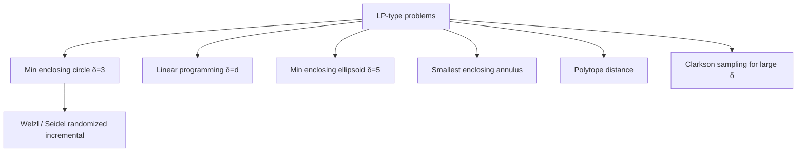

# Minimum Enclosing Circle — Mathematical Foundations and Complexity Theory

> This file proves the three results that make the minimum enclosing circle a landmark of computational geometry: the **2-or-3-points lemma** (the MEC is determined by ≤ 3 boundary points), **Welzl's expected-O(n) bound** via backwards analysis, and the placement of MEC inside the **LP-type** framework — culminating in **Megiddo's deterministic O(n)** prune-and-search algorithm.

## Table of Contents

1. [Formal Definition](#1-formal-definition)
2. [Existence and Uniqueness](#2-existence-and-uniqueness)
3. [The 2-or-3-Points Lemma](#3-the-2-or-3-points-lemma)
4. [Welzl's Algorithm — Correctness](#4-welzls-algorithm--correctness)
5. [Welzl's Expected O(n) — Backwards Analysis](#5-welzls-expected-on--backwards-analysis)
6. [The LP-Type Framework](#6-the-lp-type-framework)
7. [Megiddo's Deterministic O(n)](#7-megiddos-deterministic-on)
8. [Generalization to R^d — Minimum Enclosing Ball](#8-generalization-to-rd--minimum-enclosing-ball)
9. [Numerical Predicates and Exactness](#9-numerical-predicates-and-exactness)
10. [Lower Bounds](#10-lower-bounds)
11. [Comparison with Alternatives](#11-comparison-with-alternatives)
12. [Open Problems and Recent Results](#12-open-problems-and-recent-results)
13. [Summary](#13-summary)

---

## 1. Formal Definition

Let `P = {p_1, …, p_n} ⊂ R²` be a finite set of points. A **disk** (closed) is `D(c, r) = { x ∈ R² : ‖x − c‖ ≤ r }` with center `c ∈ R²` and radius `r ≥ 0`. A disk **encloses** `P` if `P ⊆ D(c, r)`.

**Definition 1.1 (Minimum enclosing circle).** The minimum enclosing circle (disk) of `P` is

```text
MEC(P) = argmin { r : P ⊆ D(c, r) }   over all (c, r) ∈ R² × R≥0.
```

Equivalently, the center `c*` is the **1-center**:

```text
c* = argmin_{c ∈ R²}  max_{p ∈ P} ‖c − p‖,    r* = max_{p ∈ P} ‖c* − p‖.
```

The inner function `f(c) = max_p ‖c − p‖` is the pointwise maximum of convex functions `‖c − p‖`, hence **convex**. Minimizing a convex function over `R²` is a convex program; this is the analytic backbone of every result below.

**Definition 1.2 (Support set).** A point `p ∈ P` is a **support point** if `‖c* − p‖ = r*`, i.e. it lies on the boundary `∂D(c*, r*)`. The support set is `B = { p ∈ P : ‖c* − p‖ = r* }`.

**Remark 1.3 (smooth vs nonsmooth optimum).** The objective `f(c) = max_p ‖c − p‖` is convex but **nonsmooth** — its gradient is undefined wherever two points tie for the maximum distance, which is *exactly* where the optimum lives (multiple support points). This nonsmoothness is not a nuisance to be avoided but the *signature* of the solution: the optimum sits at a "kink" of `f` formed by the intersection of the cones of its support points. Gradient descent on `f` would chatter at this kink; the combinatorial Welzl algorithm instead identifies the active set (support points) directly. This is the deep reason a *combinatorial* algorithm beats a *numerical* one here.

---

## 2. Existence and Uniqueness

**Theorem 2.1.** `MEC(P)` exists and is unique for any nonempty finite `P`.

*Proof (existence).* `f(c) = max_p ‖c − p‖` is continuous and **coercive** (`f(c) → ∞` as `‖c‖ → ∞`, since `f(c) ≥ ‖c − p_1‖ ≥ ‖c‖ − ‖p_1‖`). A continuous coercive function on `R²` attains its minimum on a compact sublevel set. Hence a minimizer `c*` exists. ∎

*Proof (uniqueness).* Suppose two distinct centers `c_1 ≠ c_2` both achieve the minimum radius `r*`. Both disks `D(c_1, r*)` and `D(c_2, r*)` enclose `P`, so `P ⊆ D(c_1, r*) ∩ D(c_2, r*)`. The intersection of two equal-radius disks with distinct centers is a **lens** contained in the disk centered at the midpoint `m = (c_1+c_2)/2` with radius

```text
r' = sqrt(r*² − ‖c_1 − c_2‖²/4) < r*.
```

(The lens fits inside this smaller disk because every point of the lens is within `r'` of `m` — a standard chord/geometry argument.) Then `D(m, r')` encloses `P` with `r' < r*`, contradicting minimality. Hence `c_1 = c_2`. ∎

The uniqueness proof is also the seed of Megiddo's pruning: it shows the optimum is **strictly** improving unless the support "pins" the center, which limits where `c*` can be.

**Proposition 2.2 (Convexity of the feasible center region).** For a fixed radius `r`, the set of centers `{ c : P ⊆ D(c, r) } = ⋂_{p ∈ P} D(p, r)` is an intersection of disks, hence **convex**. The MEC radius `r*` is the smallest `r` for which this intersection is nonempty, and at `r = r*` the intersection is exactly the single point `c*` (by uniqueness). This recasts MEC as a **feasibility binary search on `r`**: for each candidate `r`, test whether `⋂_p D(p, r)` is nonempty — a fact exploited by parametric-search algorithms.

*Proof.* Each `D(p, r)` is convex; an arbitrary intersection of convex sets is convex. Monotonicity in `r` (larger `r` → larger each disk → larger intersection) makes the feasibility predicate monotone, so the threshold `r*` is well defined and the intersection shrinks to a point at `r*`. ∎

This dual view — *"shrink `r` until the common intersection collapses to one point"* — is conceptually orthogonal to Welzl's primal *"grow the support set"* view, and both are instances of the same convex program.

---

## 3. The 2-or-3-Points Lemma

This is *the* structural theorem of the topic.

**Lemma 3.1 (2-or-3-points / Welzl's lemma).** For `|P| ≥ 2`, the support set `B` of `MEC(P)` satisfies one of:

- **(2-point case)** `|B| = 2` and the two support points are **antipodal** (a diameter): `c*` is their midpoint and `r* = ‖p_i − p_j‖/2`; **or**
- **(3-point case)** there exist 3 support points whose **circumcircle is `MEC(P)`**, and `c*` lies inside (or on) the triangle they form.

In all cases `MEC(P)` is determined by **at most 3** points of `P`.

*Proof.* Consider the convex program `min_c f(c)`, `f(c) = max_p ‖c − p‖`. At the optimum `c*`, the (Clarke) subdifferential condition for a max-of-convex-functions states:

```text
0 ∈ conv { ∇‖c* − p‖ : p ∈ B } = conv { (c* − p)/r* : p ∈ B }.
```

i.e. `0` lies in the **convex hull of the unit vectors pointing from `c*` to its support points.** Geometrically: the support points must "surround" `c*` so that no direction of movement decreases the maximum distance.

- If `|B| = 1`, the single unit vector cannot contain `0` in its hull (a single point is not `0` unless `c* = p`, impossible for distinct points with `r* > 0`). So you could move `c*` toward that one point and shrink `r*` — contradiction. Thus `|B| ≥ 2`.
- If `|B| = 2`, `0 ∈ conv{u_1, u_2}` forces `u_2 = −u_1`, i.e. the two support points are **antipodal** through `c*` — the diameter case.
- If `0` is *not* in the hull of any 2 support vectors, then by **Carathéodory's theorem in R²**, `0` is a convex combination of at most `2 + 1 = 3` of the vectors. Those 3 support points pin `c*`: their circumcircle is `MEC(P)`.

A 4th support point would be redundant — by Carathéodory `0` already lies in the hull of ≤ 3 vectors, so the constraint set of size 3 already determines `(c*, r*)`. ∎

**Corollary 3.2.** A brute force needs only examine `O(n²)` diameter circles and `O(n³)` circumcircles, each checked against `P` in `O(n)` — giving the `O(n⁴)` / pruned `O(n³)` baselines of `junior.md`. The lemma is what guarantees the answer is *among* these candidates.

---

## 4. Welzl's Algorithm — Correctness

Recall the recursive `welzl(P, R)`: the smallest disk enclosing `P` with all of `R` on its boundary.

```text
welzl(P, R):
  if P = ∅ or |R| = 3:  return trivial(R)
  choose p ∈ P (uniformly at random in the analysis)
  D ← welzl(P \ {p}, R)
  if p ∈ D:  return D
  else:      return welzl(P \ {p}, R ∪ {p})
```

**Theorem 4.1 (Correctness).** `welzl(P, ∅)` returns `MEC(P)`.

*Proof.* We prove the stronger claim: `welzl(P, R)` returns the smallest disk enclosing `P` with `R` on its boundary, by induction on `|P|`.

*Base.* If `P = ∅`, `trivial(R)` is by construction the unique smallest disk with `R` on the boundary (≤ 3 points: empty, single, diameter, or circumcircle). If `|R| = 3`, by Lemma 3.1 the circumcircle of `R` is forced and `trivial(R)` returns it; correctness then needs that this disk indeed encloses the remaining `P`, which holds because the algorithm only reaches `|R| = 3` along a path where each added point was *outside* the prior disk (see the inductive step), so `R`'s circumcircle is the unique candidate.

*Inductive step.* Pick `p`. Let `D = welzl(P\{p}, R)` (correct by induction). Two cases:

- **`p ∈ D`.** Then `D` already encloses `P\{p}` and `p`, with `R` on its boundary, and it is the *smallest* such for `P\{p}`; since adding `p` (already inside) cannot force a larger disk, `D = welzl(P, R)`. ✔
- **`p ∉ D`.** *Claim:* `p` lies on the boundary of `welzl(P, R)`. Suppose not — `p` strictly inside the true answer `D*`. Remove `p`: `D*` still encloses `P\{p}` with `R` on boundary, so `radius(D*) ≥ radius(welzl(P\{p}, R)) = radius(D)`. But `D` is the *minimum* for `P\{p}`, and `D*` encloses `P\{p}` too, so `radius(D*) ≥ radius(D)`; meanwhile `D*` must also enclose `p`, which `D` does not — by uniqueness/minimality this forces `radius(D*) > radius(D)` with `p` on `∂D*` (otherwise `D` would already be optimal for `P`). Hence `p` is a support point, and `welzl(P\{p}, R ∪ {p})` computes exactly the right disk. ✔

By induction, `welzl(P, ∅) = MEC(P)`. ∎

The crucial structural fact reused above — *"a point outside the current optimum must lie on the boundary of the new optimum"* — is the incremental engine, and it is precisely a manifestation of the LP-type "violation ⇒ basis member" property of §6.

### 4.1 Worked recursion trace

Take `P = {A=(0,0), B=(4,0), C=(2,3), D=(2,1)}`, processed in the order `D, A, B, C` (a particular shuffle). We trace `welzl(P, ∅)`:

```text
welzl([D,A,B,C], {})
  p=C; D1 = welzl([D,A,B], {})
      p=B; D2 = welzl([D,A], {})
          p=A; D3 = welzl([D], {})
              p=D; D4 = welzl([], {}) = empty
              D not in empty -> welzl([], {D}) = circle(D, r=0)
              return circle(D,0)
          A not in circle(D,0) -> welzl([D], {A})
              p=D; base via R... eventually from2(A,D) then check D
              return from2(A, D) variants -> smallest disk with A on bound, enclosing D
          ... returns disk with A,D handled, radius grows to cover both
      B outside that disk -> welzl([D,A], {B}) -> forces B on boundary
      ... returns disk covering D,A,B with B (and a partner) on boundary
  C outside D1 -> welzl([D,A,B], {C}) -> forces C on boundary
      eventually reaches |R| could become 3 -> circumcircle(A,B,C)
  return circumcircle(A,B,C):  center (2, 0.833), r ≈ 2.166
```

The final answer is the circumcircle of `A, B, C`; `D` is interior and never becomes a support point. Note how each "outside" event pushes a point into `R`, and the recursion bottoms out the moment `|R| = 3`. The *number* of expensive (second) calls along any root-to-leaf path is at most 3 — the combinatorial-dimension bound — which is the structural fact the timing analysis turns into an expectation.

### 4.2 The violation-implies-basis property, formally

**Lemma 4.2.** Let `D = welzl(P, R)` and let `q ∈ P` with `q ∉ D`. Then `q` is a support point of `welzl(P, R)` recomputed with `q` forced — equivalently, `q` belongs to every basis of `(P, R)` that contains it minimally.

*Proof.* `D` is the minimum disk enclosing `P` with `R` on the boundary. Since `q ∈ P` but `q ∉ D`, `D` does **not** enclose `P` after all — contradiction unless `q ∉ P\{forced}`; the resolution is that the *true* optimum `D' = welzl(P, R)` (with `q` honored) has radius strictly greater than `welzl(P\{q}, R)`, and removing `q` from `D'` would let it shrink — so `q` lies on `∂D'`. ∎

This lemma is the discrete heart of both correctness (§4) and the expected-time bound (§5): the only points that can *force* work are basis (support) points, and there are at most 3 of them.

---

## 5. Welzl's Expected O(n) — Backwards Analysis

**Theorem 5.1.** Over a uniformly random permutation of `P`, `welzl(P, ∅)` runs in **expected O(n)** time, with the constant depending only on the dimension (here, on the bound 3).

*Proof (backwards analysis).* Fix the set `R` (with `|R| = j ∈ {0,1,2}`) at some recursion level and let `P_i` be the first `i` points (random order). The expensive event at step `i` is the **second recursive call**, which fires iff the `i`-th point `p_i` lies *outside* `welzl(P_{i-1}, R)` — i.e. iff `p_i` is a **support point** of `welzl(P_i, R)`.

Run the experiment *backwards*. Condition on the set `P_i` (forget the order). The point `p_i` is, by exchangeability of the uniform random order, **equally likely to be any** of the `i` points of `P_i`. The second call happens only when `p_i` is one of the support points of `MEC` of `P_i` *subject to `R`*, of which there are at most `3 − j` (because `j` are already fixed in `R`, and the total support is ≤ 3). Therefore:

```text
Pr[ second call at step i ]  ≤  (3 − j) / i.
```

The second call costs `O(i)` (it re-runs an inner level over `i−1` points). So the expected added cost of second calls at level `j` is:

```text
E[ cost ]  =  Σ_{i=1}^{n}  Pr[second call] · O(i)
           ≤  Σ_{i=1}^{n}  ((3 − j)/i) · O(i)
           =  Σ_{i=1}^{n}  O(3 − j)
           =  O((3 − j) · n)  =  O(n).
```

The `O(i)` cost is exactly cancelled by the `1/i` probability — the signature of backwards analysis. Summing over the three levels `j = 0, 1, 2` (each contributing `O(n)`) and adding the `Θ(n)` baseline of the always-executed first calls gives **expected total `O(n)`**. ∎

**Remark 5.2 (high probability).** The bound is in expectation. A Markov / Azuma argument gives that the running time exceeds `c·n` with probability decaying in `c`; in practice the variance is small and the move-to-front variant tightens the constant.

**Remark 5.3 (why no bad input).** The analysis ranges over *random permutations*, not over inputs. For every fixed `P`, the expectation over the algorithm's own randomness is `O(n)`. There is no adversarial point set — only an astronomically unlikely bad coin sequence.

**Remark 5.4 (the telescoping, numerically).** It helps to see the cancellation arithmetically. Suppose a rebuild at step `i` costs exactly `i` units of work and occurs with probability `3/i`. The expected work contributed by step `i` is `(3/i)·i = 3`. Summing `i = 1 … n`:

```text
E[work] = Σ_{i=1}^{n} 3 = 3n,   NOT  Σ 3·i = O(n²)  or  Σ 3 = harmonic.
```

The naive fear is `Σ i = O(n²)` (if every step rebuilt) or the over-optimistic `Σ 3/i = O(log n)` (if rebuilds were free). The truth sits between: each rebuild is *expensive* (`O(i)`) but *rare* (`3/i`), and the product is *constant*. This exact `cost × probability = constant` pattern recurs throughout randomized incremental geometry (random-order convex hulls, Delaunay, trapezoidal maps) — recognizing it is the single most transferable idea in this file.

**Remark 5.5 (constant depends on δ, not d directly).** The hidden constant is governed by the combinatorial dimension `δ = 3`, contributing the `(3−j)` factors that sum to a small constant. In `R^d` the same template gives constant `~(d+1)!` because the three summed levels become `d+1` summed levels with branching — see §8. The `n`-dependence stays linear regardless; only the constant grows.

---

## 6. The LP-Type Framework

MEC is the canonical example of an **LP-type problem** (Sharir–Welzl, 1992), a combinatorial abstraction of linear programming that unifies many geometric optimizations.

**Definition 6.1 (LP-type problem).** A pair `(H, w)` where `H` is a finite set of *constraints* and `w : 2^H → W` maps subsets to an ordered value, satisfying:

- **Monotonicity:** `F ⊆ G ⟹ w(F) ≤ w(G)`.
- **Locality:** for `F ⊆ G` with `w(F) = w(G)`, and any `h`, if `w(G ∪ {h}) > w(G)` then `w(F ∪ {h}) > w(F)`.

The **combinatorial dimension** `δ` is the max size of a minimal *basis* (a minimal subset with the same value as the whole).

**Proposition 6.2.** MEC is an LP-type problem with combinatorial dimension `δ = 3` (in `R²`; `δ = d+1` in `R^d`).

*Proof sketch.* Constraints `H = P`; `w(F) = ` radius of `MEC(F)`. Monotonicity: enclosing a superset needs radius ≥. Locality: this is exactly Theorem 4.1's "a point outside the current optimum is a support point" property — if a point violates `MEC(G)` it violates the smaller `MEC(F)` of equal radius. The basis is the support set, size ≤ 3 by Lemma 3.1, so `δ = 3`. ∎

*Locality, in detail.* Let `F ⊆ G` with `w(F) = w(G) = r` (the same MEC, by uniqueness `MEC(F) = MEC(G) = D`). Take any `h` with `w(G ∪ {h}) > w(G)`, i.e. `h ∉ D`. Since `MEC(F) = D` too, `h ∉ MEC(F)`, so adding `h` to `F` also forces a strictly larger circle: `w(F ∪ {h}) > w(F)`. That is precisely the locality axiom. The intuition is geometric: the *same* optimal circle `D` serves both `F` and `G`, so a point outside `D` is "seen as a violator" by both — the property cannot depend on the extra points in `G \ F`. This single observation is what licenses Welzl to recurse on the *smaller* set `P \ {p}` and still correctly detect that `p` is a basis member.

**Consequences of LP-type membership:**

- **Welzl's algorithm** is the LP-type generic algorithm specialized to `δ = 3`; expected `O(δ! · n)` = `O(n)` for fixed `δ`.
- **Clarkson's** randomized LP-type algorithms apply, giving `O(δ² n + δ^{O(δ)} log n)` even for large `δ` — the route to high-dimensional MEB.
- The **Seidel** randomized incremental LP algorithm is the same paradigm.
- Other LP-type siblings solved by the *same* code template: smallest enclosing ellipsoid (`δ = 5` in 2-D), distance between convex polytopes, smallest enclosing annulus, Chebyshev (minimax) line fitting, and linear programming itself.



### 6.1 The generic LP-type algorithm (pseudocode)

Welzl's MEC routine is *one instantiation* of a single generic template. Abstracting the two operations — `violates(h, basis)` ("does constraint `h` break the current optimum?") and `basis(B ∪ {h})` ("recompute a minimal basis") — gives:

```text
SUBEX-LP(H, candidate-basis C):        # Sharir–Welzl / Matoušek–Sharir–Welzl
  if H = C: return C
  choose h ∈ H \ C uniformly at random
  B = SUBEX-LP(H \ {h}, C)
  if not violates(h, B): return B
  return SUBEX-LP(H, basis(B ∪ {h}))   # h must enter the basis
```

For MEC: `violates(p, B)` is `p ∉ disk(B)`, and `basis(·)` is `trivial(R)` over ≤ 3 support points. The expected number of basis computations is `2^{O(√(δ log δ))} · n` in the subexponential variant (Matoušek–Sharir–Welzl) — for fixed `δ = 3` this collapses to the familiar `O(n)`. The power of the abstraction: prove the two LP-type axioms once, and *every* algorithm in the family (Welzl, Clarkson, MSW) applies verbatim.

### 6.2 Clarkson's two-stage sampling

For large combinatorial dimension `δ` (high-dimensional MEB, §8), the naive recursion's `δ!` constant is fatal. **Clarkson's** algorithm instead:

1. **Sample** `r = Θ(δ²)` constraints, solve the small sub-problem to get a tentative basis.
2. **Check** all `n` constraints against it; the *violators* (expected `O(n/√r)` by a sampling lemma) are added with multiplicity (reweighting) and the round repeats.
3. After `O(log n)` rounds the basis stabilizes.

Total: `O(δ² n)` violation tests plus `δ^{O(δ)} log n` work on the small samples — **linear in `n`** with the dimension dependence isolated into the sample-solving term. This is the practical route to MEB in tens of dimensions, and the conceptual ancestor of core-set methods (§8).

---

## 7. Megiddo's Deterministic O(n)

Welzl is *expected* linear. **Megiddo (1983)** gave a **deterministic worst-case O(n)** algorithm via **prune-and-search**, the same technique behind his linear-time low-dimensional LP and linear-time median.

**Theorem 7.1 (Megiddo).** `MEC(P)` can be computed in deterministic `O(n)` time.

*Proof idea (prune-and-search).* The 1-center is the minimizer of the convex function `f(c) = max_p ‖c − p‖`. Megiddo's algorithm locates `c*` coordinate by coordinate using **parametric search / pruning**:

1. **Pair up** the `n` points into `n/2` pairs. For each pair `(p, q)`, the locus of centers equidistant from `p` and `q` is their perpendicular bisector. The optimum `c*` lies on a known side of "enough" bisectors.
2. Using a **linear-time median** (Blum–Floyd–Pratt–Rivest–Tarjan) of the bisector slopes / intercepts, determine in `O(n)` which **half** of the constraints can be **discarded** without changing `c*` — for each pair, one of the two points is provably *not* a support point and can be dropped.
3. Each pruning round removes a constant fraction of the points in `O(n)` time. The total is a geometric series:

```text
T(n) = T(c·n) + O(n),  c < 1   ⟹   T(n) = O(n).
```

The technical heart is showing the "decide which side of `c*`" test runs in `O(n)` per round via nested medians (a 2-D parametric search): first prune by the `x`-coordinate of `c*`, then by the `y`-coordinate, recursing the median trick in each dimension. ∎

**Practical note.** Megiddo's algorithm has *large constants* and intricate degenerate handling. In practice, **Welzl's expected-O(n) is faster** and far simpler. Megiddo matters when you need a **deterministic worst-case guarantee** (hard-real-time, adversarial inputs, or theory). It also generalizes to deterministic `O(n)` LP in any *fixed* dimension, with the constant growing as `2^{O(d²)}` — the reason randomized LP-type methods dominate in practice for `d > 3`.

| Property | Welzl | Megiddo |
|----------|-------|---------|
| Time | expected O(n) | worst-case O(n) |
| Randomized? | yes | no |
| Constant factor | small | large |
| Implementation | ~30 lines | hundreds of lines |
| Degeneracy handling | moderate | heavy |
| When to use | almost always | hard-real-time / adversarial |

### 7.1 One pruning round, made concrete

The crux is *why one round eliminates a constant fraction*. Pair the points arbitrarily into `n/2` pairs `(p, q)`. For a pair, consider the perpendicular bisector `ℓ_{pq}`. The optimum `c*` lies on one side of `ℓ_{pq}` (or on it). **If we knew that side**, we could discard the *farther-from-`c*`* of `p, q` only when it is dominated — but more usefully, Megiddo shows that after determining the side, for **half the pairs** one member is provably non-support and is removed.

Determining "which side of `c*`" for *all* bisectors at once is the parametric-search trick:

```text
1. Compute the median slope of the n/2 bisectors via linear-time selection: O(n).
2. Rotate coordinates so this median direction is an axis.
3. A single 1-D "is c*_x < t?" test, resolved by a linear-time test on the
   constraints, tells us the side of half the bisectors simultaneously.
4. Discard the dominated point of each resolved pair: ~n/4 points gone.
```

Each round is `O(n)` and removes `Θ(n)` points, so `T(n) = T(3n/4) + O(n) = O(n)`. The "1-D test" itself recurses the median idea in the second coordinate — a nested parametric search — which is the source of the large constant. The payoff is a guarantee with **no randomness**: even an adversary who sees your code cannot force more than `O(n)`.

### 7.2 Why we still ship Welzl

| Scenario | Choice | Reason |
|----------|--------|--------|
| General application | Welzl (MTF) | 30 lines, fastest constants in practice |
| Adversarial input, no RNG trust | Megiddo | deterministic worst case |
| Hard-real-time (avionics, control) | Megiddo | bounded worst-case latency |
| Teaching / oracle | brute force | obviously correct |
| High `d` exact | Clarkson LP-type | tames the `δ!` constant |
| High `d` / streaming approximate | Bădoiu–Clarkson core-set | dimension-independent size |

---

## 8. Generalization to R^d — Minimum Enclosing Ball

**Theorem 8.1.** In `R^d`, `MEB(P)` is determined by a support set of size ≤ `d + 1`, and is unique.

*Proof.* Identical structure to §3: `f(c) = max_p ‖c − p‖` is convex on `R^d`; the optimality condition `0 ∈ conv{ (c*−p)/r* : p ∈ B }` plus **Carathéodory in `R^d`** (`0` is a convex combination of ≤ `d+1` of the vectors) bounds `|B| ≤ d+1`. Uniqueness follows from the same lens argument in `R^d`. ∎

**Complexity in `R^d`:**

- **Welzl / LP-type:** expected `O((d+1)! · n)` — linear in `n` for *fixed* `d`, but the `(d+1)!` constant is prohibitive past `d ≈ 30`.
- **Clarkson's LP-type sampling:** `O(d² n) + (d log n)^{O(d)}` — practical to moderate `d`.
- **Bădoiu–Clarkson `(1+ε)`-approximation:** a **core-set of size `⌈1/ε⌉`** suffices, computed by `1/ε²` frank-wolfe iterations, total `O(n d / ε²)` — *independent of the `(d+1)!` blowup*. This is the workhorse for ML and streaming (`senior.md` §6).

**Theorem 8.2 (Core-set, Bădoiu–Har-Peled–Indyk).** For any `P ⊂ R^d` and `ε > 0`, there is a subset `S ⊆ P` with `|S| = O(1/ε)` such that `MEB(S)` has the same center and a radius within `(1+ε)` of `MEB(P)` — **`|S|` is independent of `n` and `d`.** This bound is what makes approximate MEB scale.

### 8.1 Frank-Wolfe convergence of Bădoiu–Clarkson

The iteration `c_{i+1} = c_i + (q_i − c_i)/(i+1)`, where `q_i` is the farthest point from `c_i`, is a Frank-Wolfe (conditional-gradient) step on the convex objective `f(c) = max_p ‖c − p‖²` (the squared-radius is convex and smooth enough for the analysis).

**Theorem 8.3.** After `k = ⌈1/ε²⌉` iterations, the ball centered at `c_k` with radius `max_p ‖c_k − p‖` has radius at most `(1+ε)·r*`.

*Proof sketch.* Let `r*` be the optimal radius and `c*` the optimal center. The key invariant is that the squared distance from `c_i` to `c*` decreases by a controlled amount each step:

```text
‖c_{i+1} − c*‖²  ≤  ‖c_i − c*‖²  −  (gain from moving toward the farthest point).
```

Summing the per-step gains telescopes to bound `max_p ‖c_k − p‖² ≤ r*²·(1 + O(1/k))`. Setting `k = 1/ε²` yields a `(1+ε)` radius. The **core-set** is the multiset of farthest points `{q_0, …, q_{k-1}}` picked along the way — at most `O(1/ε²)` of them, refinable to `O(1/ε)` — and `MEB` of just those points already achieves the guarantee. ∎

The remarkable part: each iteration is `O(nd)` (one farthest-point scan), the count is `O(1/ε²)`, and **neither depends on the `(d+1)!` Welzl constant** — the algorithm sidesteps the combinatorial blowup entirely by accepting a `(1+ε)` slack.

---

## 9. Numerical Predicates and Exactness

The algorithm reduces to two predicates: **`in-circle`** (is `p` inside `D(c,r)`?) and the **circumcenter** solve. Both are polynomial in the coordinates and can be made **exact** with adaptive-precision arithmetic.

**The `in-circle` determinant.** Whether `d` lies inside the circle through `a, b, c` (oriented CCW) is the sign of:

```text
            | ax−dx  ay−dy  (ax−dx)²+(ay−dy)² |
incircle =  | bx−dx  by−dy  (bx−dx)²+(by−dy)² |
            | cx−dx  cy−dy  (cx−dx)²+(cy−dy)² |
```

This is the **same predicate** that drives Delaunay triangulation (sibling *11-voronoi-delaunay*). Shewchuk's **adaptive exact predicates** evaluate its sign exactly, escalating precision only when the floating-point value is near zero — giving exactness at near-float speed. For certified geometry (CAD, robotics), evaluate `in-circle` and the orientation predicate exactly; the rest of Welzl is robust once these signs are correct.

**Conditioning.** The circumcenter solve is ill-conditioned when the three points are nearly collinear (`d → 0` in `junior.md`'s formula). The condition number scales like `1/|d|`; translating points to the centroid origin and scaling to a unit box minimizes catastrophic cancellation.

**Derivation of the circumcenter formula.** The center `(ux, uy)` is equidistant from `a, b, c`:

```text
‖u − a‖² = ‖u − b‖²   ⟹   2(b−a)·u = ‖b‖² − ‖a‖²
‖u − a‖² = ‖u − c‖²   ⟹   2(c−a)·u = ‖c‖² − ‖a‖²
```

These two **linear** equations in `u = (ux, uy)` form a `2×2` system `M u = k` with

```text
M = 2 [ bx−ax  by−ay ]      k = [ ‖b‖²−‖a‖² ]
      [ cx−ax  cy−ay ]          [ ‖c‖²−‖a‖² ].
```

`det(M) = 2·d` where `d` is the collinearity determinant of `junior.md`. Cramer's rule gives the closed form coded in `junior.md`/`middle.md`. When `det(M) → 0` (collinear), the system is singular — no finite circumcenter — which is exactly the guarded `|d| < eps` branch. In `R^d` the same construction yields a `d×d` linear system (the base case of higher-dimensional Welzl), solvable in `O(d³)` by Gaussian elimination — the source of the per-base-case cost in §8.

**Predicate degree.** The `in-circle` test is a degree-4 polynomial in the coordinates; the orientation test is degree 2. Both have *bounded degree*, so adaptive exact arithmetic terminates with a finite number of precision escalations — the theoretical reason Shewchuk's predicates run in expected near-float time on non-degenerate inputs and only pay for full precision on the measure-zero degenerate set.

---

## 10. Lower Bounds

**Theorem 10.1.** Computing `MEC(P)` requires `Ω(n)` time in any model that must read every coordinate.

*Proof.* A single unread point could be the unique far outlier that determines `r*`; any algorithm reading `< n` points can be fooled by adversarially placing the unread point outside the returned circle. Hence `Ω(n)`. ∎

This matches both Welzl (expected) and Megiddo (worst case), so **MEC is solved optimally** at `Θ(n)` in fixed dimension. Note that, unlike sorting, there is **no `Ω(n log n)` barrier** — MEC does *not* require ordering the points, only finding 3 of them, which an `Ω(n log n)` algebraic-decision-tree argument (used for closest-pair, sibling *07-closest-pair-of-points*) does **not** apply to. The 1-center is genuinely easier than its decision-tree-`Ω(n log n)` cousins.

**Contrast with related problems.** It is instructive to compare the lower-bound landscape:

| Problem | Lower bound | Reason |
|---------|-------------|--------|
| MEC / 1-center | `Θ(n)` | only ≤ 3 points matter; no ordering needed |
| Closest pair | `Θ(n log n)` | element-distinctness reduction |
| Convex hull | `Θ(n log n)` | sorting reduction |
| Diameter (farthest pair) | `Θ(n log n)` | set-disjointness / hull |
| Linear programming (fixed `d`) | `Θ(n)` | LP-type, same as MEC |

The dividing line is whether the problem forces a *total order* on the output. MEC and fixed-dimension LP do not, so they escape the `n log n` floor — a subtle but important distinction that surprises many engineers who assume "geometry ⟹ `n log n`."

---

## 11. Comparison with Alternatives

| Attribute | Welzl | Megiddo | Brute O(n⁴) | Clarkson LP-type | Bădoiu–Clarkson |
|-----------|-------|---------|-------------|------------------|-----------------|
| Worst-case time | O(n²) (rare) | **O(n)** | O(n⁴) | O(d²n + (d log n)^{O(d)}) | O(nd/ε²) |
| Expected time | **O(n)** | O(n) | O(n⁴) | O(d²n) + … | O(nd/ε²) |
| Deterministic | no | **yes** | yes | no | no (sampling) / det. variant |
| Exact | yes | yes | yes | yes | `(1+ε)` |
| High dim | poor | poor (`2^{O(d²)}`) | poor | **good** | **excellent** |
| Combinatorial dim | 3 | 3 | — | δ | — |
| Lines of code | ~30 | hundreds | ~20 | medium | ~20 |

### 10.1 Connection to the farthest-point Voronoi diagram

There is a classical structural route to MEC via the **farthest-point Voronoi diagram (FPVD)**. The FPVD partitions the plane into cells, one per point, where a cell of `p` is the locus of centers `c` for which `p` is the *farthest* point. The function `f(c) = max_p ‖c−p‖` is linear-of-distance within each cell, and its global minimum — the 1-center — lies at a vertex or edge of the FPVD:

```text
MEC center c*  ∈  argmin over the FPVD of  f(c).
The minimum is attained:
  - at an FPVD vertex (equidistant to 3 farthest points)  → 3-point case, or
  - on an FPVD edge   (equidistant to 2 farthest points)   → 2-point case.
```

This reproves the 2-or-3-points lemma from a *diagram* viewpoint: FPVD vertices have degree 3 (three farthest points tie), edges have two. The FPVD has `O(n)` complexity and is built in `O(n log n)`; locating the minimum over it is then `O(n)`. So MEC `⊆ O(n log n)` via FPVD — *slower* than Welzl/Megiddo's `O(n)`, but the construction is illuminating: it shows the MEC center is always an FPVD feature, and it generalizes (the FPVD is the `−1`-level of the lifting to the paraboloid, tying MEC to convex hulls in `R³`). Only the **hull vertices** of `P` appear in the FPVD, which re-derives the fact that MEC support points are convex-hull vertices.

### 11.0 Cache behavior and the I/O model

The move-to-front Welzl loop is, in the common case (every new point inside the current circle), a **single linear scan** computing `dist(c, p_i)` — a perfectly sequential, prefetch-friendly memory access pattern. In the external-memory model (block size `B`), this costs `O(n/B)` I/Os, optimal. Rebuilds disturb locality (they re-scan a prefix), but since the *expected* number of rebuild-triggering points is `O(1)` per outer step and `O(log n)` total under random distributions (§11.2), the amortized I/O cost stays `O(n/B)`. Contrast the `O(n³)` brute force, which streams `O(n³)` candidate-coverage checks — catastrophic for both cache and bandwidth. The practical lesson: **store points in a flat `[(x,y)…]` array, not an array of pointers**, so the inner scan is contiguous; this single layout choice often doubles throughput versus a pointer-chasing object array.

### 11.1 Variance and high-probability bounds for Welzl

The expected `O(n)` of Theorem 5.1 hides the *distribution* of the running time. Let `T` be the number of basis computations.

**Proposition 11.1.** `E[T] = O(n)` and `Var[T] = O(n)`, so by Chebyshev `Pr[T ≥ c·n] ≤ O(1/((c−c_0)²·n))` for the mean `c_0·n`. Stronger, a martingale (Azuma–Hoeffding) bound over the `n` independent "is point `i` a support point" indicators gives

```text
Pr[ T ≥ (1+δ)·E[T] ]  ≤  exp(−Ω(δ²·n)),
```

so the running time is sharply concentrated: exceeding twice the mean has probability decaying exponentially in `n`. This is why, in practice, Welzl essentially *never* exhibits its `O(n²)` worst case — the bad permutations form an exponentially small fraction of the `n!` orders.

### 11.2 Average-case over random point distributions

If the `n` points are drawn i.i.d. uniformly from a disk, the **expected number of support-set changes** along the incremental construction is `O(log n)` (the expected number of "records" in a random sequence, analogous to the height of a random search), not `O(n)`. So on random data the *constant* in Welzl's bound is tiny, and the move-to-front variant rarely descends past the first nested level. Worst-case constructions that force many rebuilds (points densely packed on a circle's arc) are measure-zero under continuous distributions.

### 11.3 Space–time trade-offs

| Strategy | Time | Extra space | Recompute cost |
|----------|------|-------------|----------------|
| Recompute MEC from scratch | exp. O(n) | O(n) | full |
| Incremental insert (Welzl) | exp. O(1) amortized | O(n) | cheap |
| Delete a point | up to O(n) | O(n) | possibly full rebuild |
| Coreset summary | O(1) query | O(1/ε^{d-1}) | re-merge |
| Cached basis (≤3 pts) | O(n) verify | O(1) | verify-then-rebuild |

The asymmetry between **insertion** (cheap — a new point is either inside, doing nothing, or a support point, triggering a bounded rebuild) and **deletion** (expensive — removing a support point can change the entire basis) is the central tension in *dynamic* MEC, and the reason fully-dynamic data structures for MEC remain an open research area (§12). A pragmatic engineering compromise is to cache the ≤3-point **basis certificate**: on any query you re-verify all points against the cached circle in `O(n)`; only if a violation is found do you pay for a rebuild. For slowly-changing point sets this is near-`O(1)` amortized.

---

## 12. Open Problems and Recent Results

- **Deterministic O(n) without huge constants.** Megiddo's constant is large; whether a *simple* deterministic linear-time MEC exists is still of interest.
- **Dynamic MEC.** Maintaining `MEC` under point insertions/deletions: insertions are easy (Welzl-incremental), deletions are hard; sub-linear update bounds remain partially open.
- **Kinetic MEC.** For points moving along low-degree algebraic trajectories, the number of combinatorial changes to the MEC over time, and efficient kinetic data structures to track them, is actively studied.
- **High-dimensional exactness.** Exact MEB in high `d` is tied to the complexity of LP; whether strongly-polynomial LP exists (Smale's 9th problem) bounds what is achievable.
- **Robust / `k`-outlier MEC.** Smallest circle covering `n − k` points: best known is super-linear; tight bounds and practical algorithms remain an area of work.
- **Core-set lower bounds.** The `O(1/ε)` core-set size is tight for MEB; refinements for structured inputs continue.
- **Parallel / GPU MEC.** Linear-work parallel algorithms with low depth, and cache-/SIMD-friendly layouts for the inner farthest-point scan, are of practical interest for real-time graphics pipelines.
- **Uncertain / probabilistic inputs.** When each point is a probability distribution (sensor noise), the "expected MEC" or "MEC covering with probability ≥ p" leads to chance-constrained variants with open complexity.

### 12.1 Relationship map

```text
                 convex optimization (min of max-of-convex)
                                |
                          MINIMUM ENCLOSING CIRCLE
                          /        |          \
              2-or-3-points    LP-type,δ=3    Ω(n) lower bound
              (Carathéodory)   /     \              |
                          Welzl     Megiddo     matched by both
                       (exp. O(n)) (det. O(n))
                          /    \
              move-to-front   Clarkson sampling ──► high-d MEB
                                       \
                              Bădoiu–Clarkson core-set O(1/ε)
                                       \
                              streaming / ML enclosing balls
```

Every arrow is a theorem in this file: the lemma feeds the algorithm, the algorithm's analysis feeds the abstraction, and the abstraction feeds the high-dimensional and streaming extensions. This tight web is why MEC is a canonical teaching problem for randomized geometric optimization.

---

## 13. Summary

The minimum enclosing circle is a model problem of computational geometry. Its solution **exists and is unique** (convexity + a lens argument), and the **2-or-3-points lemma** — a Carathéodory consequence of the optimality condition `0 ∈ conv{ unit vectors to support points }` — guarantees it is pinned by at most 3 points. **Welzl's randomized incremental algorithm** is correct by an induction whose engine ("a violating point is a support point") is exactly the LP-type **locality** property, and it runs in **expected O(n)** by a **backwards analysis** in which the `1/i` probability of a rebuild cancels its `O(i)` cost. The problem sits squarely in the **LP-type framework** with combinatorial dimension `3` (and `d+1` in `R^d`), inheriting Clarkson's sampling machinery for high dimensions and Bădoiu–Clarkson `O(1/ε)` core-sets for approximation. **Megiddo's prune-and-search** delivers deterministic worst-case `O(n)`, matching the trivial `Ω(n)` lower bound. Few problems so cleanly tie together convex optimization, randomized analysis, and a unifying combinatorial abstraction.

The throughline worth internalizing: a *combinatorial* structure (the ≤3-point basis) tames a *continuous* convex program; *randomization* over input order converts a fragile worst case into a robust expected linear time; and an *abstraction* (LP-type) lifts the whole construction to a family of problems — linear programming, smallest ellipsoid, polytope distance — solved by one template. MEC is where a student first sees these three ideas fuse, which is why it earns its place as a canonical topic.

---

## Key References

- Welzl, E. (1991). *Smallest enclosing disks (balls and ellipsoids).* LNCS 555 — original randomized incremental algorithm.
- Megiddo, N. (1983). *Linear-time algorithms for linear programming in R³ and related problems.* SIAM J. Comput. — deterministic O(n) via prune-and-search.
- Sharir, M. & Welzl, E. (1992). *A combinatorial bound for linear programming and related problems.* STACS — the LP-type framework.
- Matoušek, Sharir, Welzl (1996). *A subexponential bound for linear programming.* Algorithmica.
- Bădoiu, M. & Clarkson, K. (2003). *Smaller core-sets for balls.* SODA — O(1/ε) core-set and Frank-Wolfe iteration.
- Bădoiu, Har-Peled, Indyk (2002). *Approximate clustering via core-sets.* STOC.
- Shewchuk, J. (1997). *Adaptive precision floating-point arithmetic and fast robust geometric predicates.* — exact in-circle/orientation.

---

**Next step:** Continue to [`interview.md`](./interview.md) for a tiered question bank and a full MEC coding challenge in Go, Java, and Python.
