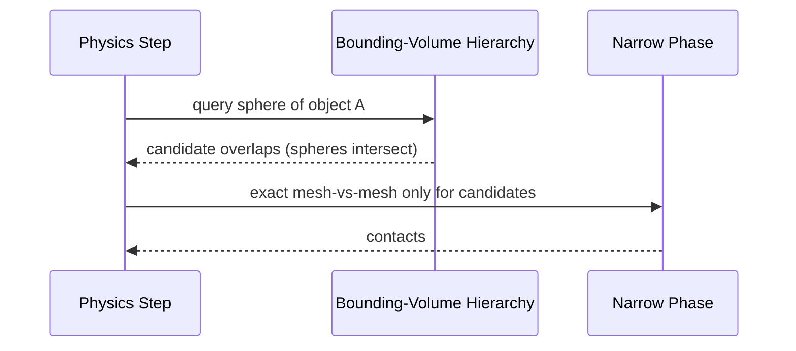
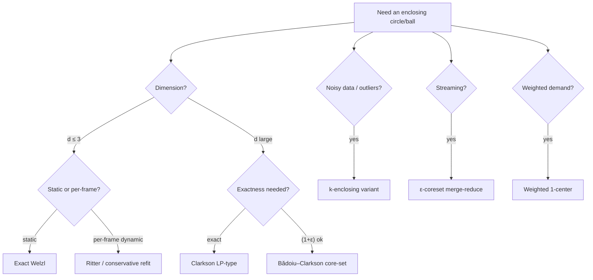
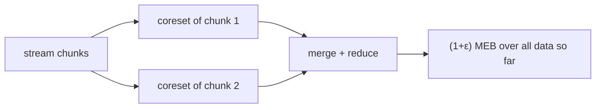
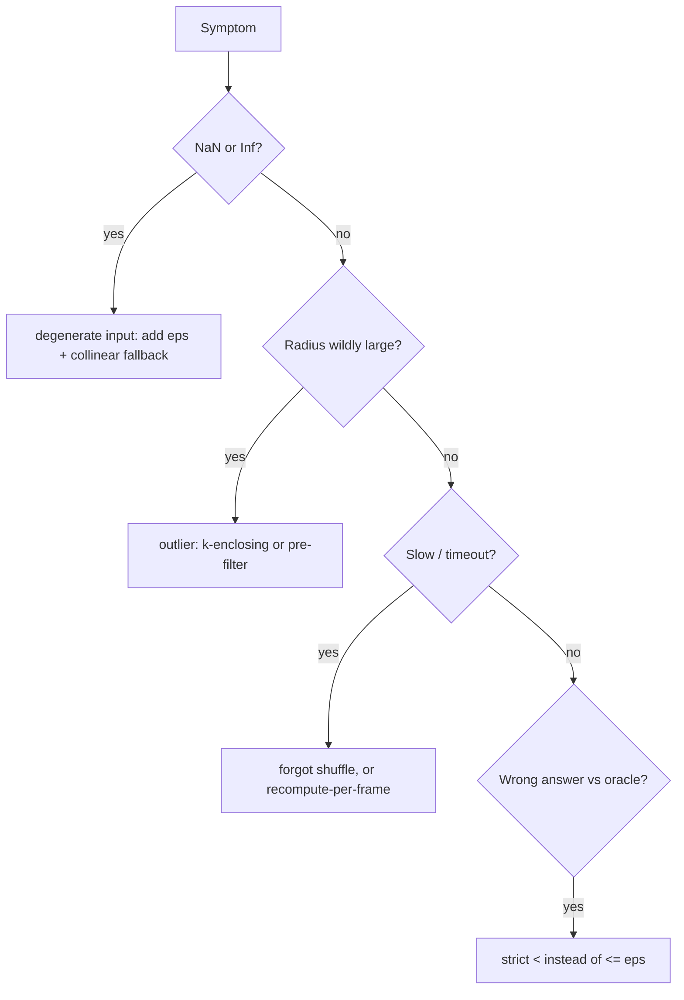

# Minimum Enclosing Circle — Senior Level

> Textbook Welzl computes a 2-D smallest circle in microseconds. A senior engineer's problems are different: a physics engine rebuilds **bounding spheres for millions of meshes every frame** and cannot tolerate a `NaN` from a degenerate triangle; a logistics platform places **k facilities** to minimize worst-case service distance under SLAs; a sensor pipeline must keep a **streaming enclosing ball** over an unbounded data stream in bounded memory. At this level the algorithm is the easy part — robustness, dimensionality, weighting, and the system around it are the product.

## Table of Contents

1. [Introduction](#1-introduction)
2. [System Design — Where MEC Lives](#2-system-design--where-mec-lives)
3. [Bounding Spheres for Collision Detection](#3-bounding-spheres-for-collision-detection)
4. [Facility Location and the 1-Center](#4-facility-location-and-the-1-center)
5. [Numerical Robustness](#5-numerical-robustness)
6. [Higher Dimensions — Minimum Enclosing Ball](#6-higher-dimensions--minimum-enclosing-ball)
7. [Weighted, Constrained, and Approximate Variants](#7-weighted-constrained-and-approximate-variants)
8. [Streaming and Coreset Techniques](#8-streaming-and-coreset-techniques)
9. [Comparison at Scale](#9-comparison-at-scale)
10. [Code — Robust 3-D Bounding Sphere](#10-code--robust-3-d-bounding-sphere)
11. [Observability](#11-observability)
12. [Failure Modes](#12-failure-modes)
13. [Capacity Planning](#13-capacity-planning)
14. [Summary](#14-summary)

---

## 1. Introduction

At senior level the question is no longer "how does Welzl work" but "where does smallest-enclosing-ball computation sit in my system, and what breaks when it does?" Three properties of the MEC drive every architectural decision:

- **It is a min-max objective.** A single outlier dictates the radius. That is exactly what you want for a *guaranteed* bound (collision, coverage) and exactly what you do *not* want when the data has noise (you'll want a robust or `k`-enclosing variant).
- **It is degenerate-prone.** Collinear, cocircular, coincident, and near-flat inputs are the norm in real geometry (mesh vertices on a plane, GPS points on a road). Naive floating point produces `NaN`, wrong circles, or non-termination. Robustness is the senior deliverable.
- **It generalizes to `d` dimensions but the constant explodes.** The 2-or-3-points lemma becomes "≤ `d+1` points," Welzl still gives expected `O(n)` *for fixed `d`*, but the hidden constant grows roughly like `(d+1)!` — so beyond ~10–20 dimensions you switch to iterative approximation (Bădoiu–Clarkson, core-sets).

This document covers the five questions a senior owns:

1. Which variant — exact Welzl, approximate `(1+ε)`, streaming coreset — fits this workload?
2. How do you make the geometry **numerically robust** against degenerate inputs without losing speed?
3. How does the problem change in **3-D and higher** (bounding spheres, ML feature balls)?
4. How do you handle **weighted** points, **outliers**, and **constraints**?
5. How do you keep a bound over a **stream** in bounded memory?

---

## 2. System Design — Where MEC Lives

```mermaid
flowchart LR
    A[Exact 2-D / 3-D<br/>Welzl O(n)<br/>millions of points<br/>microseconds] --> B[Approximate (1+ε)<br/>Bădoiu-Clarkson<br/>high-dim ML balls<br/>O(n d / ε²)]
    B --> C[Streaming coreset<br/>bounded memory<br/>unbounded stream<br/>(1+ε) over time]
```

| Tier | Technique | Scale | Latency | Use case |
|------|-----------|-------|---------|----------|
| Exact | Welzl (MTF) | up to ~10^7 points, `d ≤ ~3` | μs–ms | Game bounding spheres, GIS, single-facility siting |
| Approximate | Bădoiu–Clarkson iteration | high `d`, large `n` | ms | ML enclosing balls, SVDD, anomaly radius |
| Streaming | ε-coreset / merge-reduce | unbounded `n` | per-point O(1) amortized | Telemetry bounds, online clustering |

The architectural rule: **exact in low dimensions, approximate in high dimensions, coreset over streams.** A common mistake is to run exact Welzl in 50-D ML feature space — it is correct but the `(d+1)!`-flavored constant and conditioning make it impractical; use `(1+ε)`-approximation there.

---

## 3. Bounding Spheres for Collision Detection

The MEC's flagship engineering use is the **bounding volume**: wrap each object in the smallest sphere, then test sphere–sphere overlap (`dist(c1,c2) ≤ r1 + r2`) as a cheap *broad-phase* filter before exact collision math.



Engineering trade-offs unique to bounding spheres:

- **Tightness vs cost.** The *true* MEC is the tightest sphere but costs `O(n)` per mesh. Cheaper approximations (Ritter's algorithm, ~2 passes, within ~5–20% of optimal) are often preferred when you rebuild spheres every frame for deforming meshes. Use exact MEC for static colliders, Ritter for dynamic ones.
- **Rebuild frequency.** Rigid bodies: compute the sphere once at load time. Deforming/skinned meshes: recompute or use a conservative *refit* that only grows the sphere, never shrinks it (avoids per-frame `O(n)`).
- **Hierarchy.** Spheres compose into a **bounding-volume hierarchy (BVH)**; the MEC of two child spheres is itself a small enclosing-circle-of-circles problem (a weighted/ball variant, §7).

**Ritter vs exact MEC:** Ritter starts from an initial diameter guess and expands once over the points — `O(n)`, simple, but not minimal. Exact Welzl is also `O(n)` expected but with larger constants and the degenerate-handling burden. For 60 fps with 10^5 dynamic objects, the constant matters: profile both.

---

## 4. Facility Location and the 1-Center

The MEC center is the **1-center**: the location minimizing the maximum distance to any demand point — the classic "where do we put the single fire station / cell tower / warehouse so the *worst-served* customer is best off?"

| Objective | Optimal point | Algorithm |
|-----------|--------------|-----------|
| Minimize **max** distance (worst case) | **1-center = MEC center** | Welzl, O(n) |
| Minimize **sum** of distances | geometric median (Weber point) | Weiszfeld iteration |
| Minimize **sum of squares** | centroid (mean) | trivial average |

Senior nuances:

- **Constraints.** Real siting has obstacles, road networks (not Euclidean distance), and zoning. Euclidean MEC is a *relaxation*; you then snap to the nearest feasible road node and re-optimize locally.
- **k-center.** "Place `k` facilities to minimize the max distance to the nearest facility" is **NP-hard** in general; the standard `2-approximation` is Gonzalez's farthest-point greedy. MEC is the `k = 1` exact case.
- **Weighted demand.** Customers with different populations/priorities → the **weighted 1-center** (§7), where the objective is `max w_i · dist(c, p_i)`.

### 4.1 Clustering and anomaly radii

MEC is a natural primitive inside clustering and outlier detection:

- **Cluster radius / tightness.** After `k-means` or `DBSCAN` assigns points to clusters, the MEC radius of each cluster is a *tight, geometrically meaningful* measure of its spread — unlike the variance, it bounds the **worst** member. Dashboards that flag "this cluster has a member 5σ out" are really computing per-cluster MEC radii.
- **Support Vector Data Description (SVDD).** The one-class SVM for anomaly detection is *exactly* a minimum enclosing ball in a kernel feature space: find the smallest ball containing the normal data; points outside are anomalies. With a soft margin it becomes the `k`-enclosing variant (§7). This is the single most important ML appearance of MEB, and it is why high-dimensional approximate MEB (§6) matters in practice.
- **Bounding-ball indexing.** Metric trees (ball trees, M-trees) wrap each node's points in an enclosing ball for nearest-neighbor pruning; tighter balls (exact MEC) mean fewer branches explored at query time — a direct latency win traded against build cost.

The recurring senior judgment: a *tighter* enclosing ball costs more to build but pays off at query/inference time. Profile the build-vs-query ratio of your workload before choosing exact MEC over a cheap approximation.

### 4.2 GIS and coverage

In geographic systems the 1-center answers "smallest broadcast/coverage radius from one transmitter." Two senior caveats specific to GIS:

- **Geodesic, not Euclidean.** On the Earth's surface, distance is geodesic (great-circle). The planar MEC is only valid for small regions; for continental scale you solve the **smallest enclosing circle on the sphere** (a different primitive — the smallest spherical cap), or project to a locally-conformal map first and bound the projection error.
- **Datum and precision.** Lat/long in degrees has wildly anisotropic scale (a degree of longitude shrinks toward the poles). Always project to a metric CRS (e.g. UTM) before running MEC, or the "circle" is meaningless.

---

## 5. Numerical Robustness

This is where senior MEC code earns its keep. The two primitives are exact formulas, but floating point makes them fragile:

| Degeneracy | Symptom | Mitigation |
|-----------|---------|-----------|
| Collinear triple | `from3` determinant `d ≈ 0` → divide by zero / huge center | Threshold `|d| < eps_rel · scale`; fall back to widest diameter pair. |
| Cocircular cluster | Many triples "equal"; wobble picks a too-small circle | Use a relative `eps`; pick the *largest* valid candidate among ties. |
| Coincident points | Zero-radius sub-circles, redundant work | Deduplicate (snap to grid) before running. |
| Huge coordinates | `x²+y²` overflows precision; center loses digits | **Translate** points so the centroid is at the origin; optionally scale to unit box. |
| Tight `eps` | A boundary point reads as outside → infinite expansion | Use `eps` *relative* to the coordinate magnitude, not absolute. |

**The single most valuable practice:** make `eps` *relative*. An absolute `eps = 1e-9` is meaningless when coordinates are `1e7`. Compute a scale `S = max(|coord|)` and test `dist ≤ r + eps_rel · S`. For correctness-critical use (CAD, robotics certification), consider **exact predicates** (Shewchuk's adaptive arithmetic) for the in-circle test, which is the same primitive used by Delaunay triangulation (sibling *11-voronoi-delaunay*).

---

## 6. Higher Dimensions — Minimum Enclosing Ball

The minimum enclosing **ball** (MEB) generalizes the circle to `R^d`. Key facts:

- The **2-or-3-points lemma becomes "≤ `d+1` support points."** In 3-D a sphere is determined by ≤ 4 points; in `d`-D by ≤ `d+1`.
- **Welzl still gives expected `O(n)` for fixed `d`**, but the base case solves a `(d+1) × (d+1)` linear system, and the hidden constant grows like `(d+1)!`. Practical up to `d ≈ 10–20`.
- Beyond that, switch to **iterative approximation**: Bădoiu–Clarkson and the *frank-wolfe / core-set* methods give a `(1+ε)`-radius ball in `O(n d / ε²)` time, independent of the `(d+1)!` blowup.

```text
MEB(P) in R^d:
  exact (Welzl)         : expected O(n) for fixed d, constant ~ (d+1)!
  (1+ε) Bădoiu-Clarkson : O(n d / ε²), core-set of size O(1/ε)
```

The **core-set insight** (Bădoiu, Har-Peled, Indyk): there is a subset of only `O(1/ε)` points whose MEB is a `(1+ε)`-approximation of the whole set's MEB — *independent of `n` and `d`*. This is what makes high-dimensional and streaming MEB tractable.

---

## 7. Weighted, Constrained, and Approximate Variants

| Variant | Definition | Approach |
|---------|-----------|----------|
| **Weighted 1-center** | minimize `max w_i · dist(c, p_i)` | LP-type; still expected O(n) (Megiddo). |
| **Smallest enclosing ball of balls** | enclose disks/spheres, not points | each constraint `dist(c, c_i) + r_i ≤ r`; LP-type. |
| **k-enclosing circle** | smallest circle covering `n−k` points (drop `k` outliers) | harder; `O(n k + n log n)`-ish; robust to noise. |
| **Min enclosing of moving points** | kinetic MEC over time | kinetic data structures; recompute on events. |
| **(1+ε)-approximate** | radius within factor `(1+ε)` | Bădoiu–Clarkson core-set, `O(n/ε²)`. |
| **Constrained center** | center must lie in a region/on a network | project + local re-optimize. |

The **enclosing-ball-of-balls** variant is what a bounding-volume hierarchy needs: merging two child spheres into the smallest parent sphere. It is solved with the same LP-type machinery — each child sphere `(c_i, r_i)` contributes the constraint "the parent must extend at least `r_i` beyond `c_i`."

For noisy data, the **`k`-enclosing** variant (ignore the `k` worst outliers) is the senior's answer to "one bad sensor reading inflated my radius 100×." It trades exactness for robustness and is closely related to robust statistics.

### 7.1 Choosing a variant — a decision flow



This single chart captures the senior decision space: dimension picks exact-vs-approximate, freshness picks Welzl-vs-Ritter, noise picks `k`-enclosing, and unboundedness picks coresets. The wrong branch is usually "exact Welzl in 128-D for streaming ML" — three wrong turns at once.

---

## 8. Streaming and Coreset Techniques

A stream of points (telemetry, sensor data) cannot be buffered. You need a bound that updates online in bounded memory.

- **Naive online**: keep the current ball; when a point arrives outside, expand minimally toward it (`Ritter`-style). One pass, `O(1)` per point, but the result drifts and is *not* minimal — only a guaranteed *over*-estimate.
- **Coreset / merge-reduce**: maintain a small `ε`-coreset of `O(1/ε^{d-1})` points; the MEB of the coreset `(1+ε)`-approximates the stream's MEB. Merge coresets hierarchically as data arrives.



The merge-reduce pattern (the same one used for streaming quantiles) keeps memory at `O(1/ε^{d-1} · log n)` while answering `(1+ε)`-MEB queries at any time.

### 8.1 Online over-estimate in three languages

The simplest production-grade streaming bound — guaranteed enclosing, `O(1)` per point, `O(1)` memory:

#### Go

```go
type StreamBall struct {
	cx, cy, r float64
	started   bool
}

func (s *StreamBall) Add(px, py float64) {
	if !s.started {
		s.cx, s.cy, s.r, s.started = px, py, 0, true
		return
	}
	dx, dy := px-s.cx, py-s.cy
	d := math.Hypot(dx, dy)
	if d <= s.r {
		return // already inside
	}
	newR := (s.r + d) / 2
	k := (newR - s.r) / d // fraction to move toward p
	s.cx += dx * k
	s.cy += dy * k
	s.r = newR
}
```

#### Java

```java
static class StreamBall {
    double cx, cy, r; boolean started;
    void add(double px, double py) {
        if (!started) { cx = px; cy = py; r = 0; started = true; return; }
        double dx = px - cx, dy = py - cy, d = Math.hypot(dx, dy);
        if (d <= r) return;
        double newR = (r + d) / 2, k = (newR - r) / d;
        cx += dx * k; cy += dy * k; r = newR;
    }
}
```

#### Python

```python
import math

class StreamBall:
    def __init__(self):
        self.cx = self.cy = self.r = 0.0
        self.started = False

    def add(self, px, py):
        if not self.started:
            self.cx, self.cy, self.r, self.started = px, py, 0.0, True
            return
        dx, dy = px - self.cx, py - self.cy
        d = math.hypot(dx, dy)
        if d <= self.r:
            return
        new_r = (self.r + d) / 2
        k = (new_r - self.r) / d
        self.cx += dx * k
        self.cy += dy * k
        self.r = new_r
```

This always encloses every point seen, uses constant memory, and never recomputes from scratch — the trade-off being a radius typically 10–20% above the true MEC. For tighter bounds at the cost of memory, layer the `ε`-coreset on top.

---

## 9. Comparison at Scale

| Attribute | Exact Welzl | Ritter (approx) | Bădoiu–Clarkson | Streaming coreset |
|-----------|-------------|-----------------|-----------------|-------------------|
| Radius quality | optimal | ~5–20% loose | `(1+ε)` | `(1+ε)` |
| Time | exp. O(n) | O(n), 1–2 passes | O(n d / ε²) | O(1) per point amortized |
| Memory | O(n) | O(1) | O(n) | O(1/ε^{d-1}) |
| High dim? | poor (`(d+1)!`) | poor | **good** | good |
| Degenerate-safe? | needs care | yes | yes | yes |
| Production use | static colliders, GIS, 1-center | dynamic game spheres | ML balls, SVDD | telemetry, online |

---

## 10. Code — Robust 3-D Bounding Sphere

A senior-grade 3-D MEB with coordinate translation for stability and a relative `eps`. (2-D is the same with `z = 0` and ≤ 3 support points.)

#### Go

```go
package main

import (
	"fmt"
	"math"
	"math/rand"
)

type V3 struct{ X, Y, Z float64 }
type Sphere struct {
	C V3
	R float64
}

func sub(a, b V3) V3    { return V3{a.X - b.X, a.Y - b.Y, a.Z - b.Z} }
func dot(a, b V3) float64 { return a.X*b.X + a.Y*b.Y + a.Z*b.Z }
func norm(a V3) float64 { return math.Sqrt(dot(a, a)) }

func contains(s Sphere, p V3, eps float64) bool {
	return norm(sub(p, s.C)) <= s.R+eps
}

// Bădoiu–Clarkson (1+eps)-approximate MEB: simple, robust, dimension-friendly.
func approxMEB(pts []V3, iters int) Sphere {
	if len(pts) == 0 {
		return Sphere{}
	}
	c := pts[0]
	for i := 1; i <= iters; i++ {
		// find farthest point
		far := pts[0]
		best := -1.0
		for _, p := range pts {
			if d := norm(sub(p, c)); d > best {
				best, far = d, p
			}
		}
		// move center a 1/(i+1) step toward the farthest point
		t := 1.0 / float64(i+1)
		c = V3{c.X + (far.X-c.X)*t, c.Y + (far.Y-c.Y)*t, c.Z + (far.Z-c.Z)*t}
	}
	// final radius = farthest distance
	r := 0.0
	for _, p := range pts {
		if d := norm(sub(p, c)); d > r {
			r = d
		}
	}
	return Sphere{c, r}
}

func main() {
	rand.Seed(1)
	pts := make([]V3, 100000)
	for i := range pts {
		pts[i] = V3{rand.Float64(), rand.Float64(), rand.Float64()}
	}
	s := approxMEB(pts, 200)
	fmt.Printf("center=(%.3f,%.3f,%.3f) r=%.3f\n", s.C.X, s.C.Y, s.C.Z, s.R)
}
```

#### Java

```java
import java.util.*;

public class ApproxMEB {
    record V3(double x, double y, double z) {}
    record Sphere(V3 c, double r) {}

    static double dist(V3 a, V3 b) {
        double dx = a.x()-b.x(), dy = a.y()-b.y(), dz = a.z()-b.z();
        return Math.sqrt(dx*dx + dy*dy + dz*dz);
    }

    // Bădoiu–Clarkson (1+ε) approximate minimum enclosing ball.
    static Sphere approxMEB(V3[] pts, int iters) {
        if (pts.length == 0) return new Sphere(new V3(0,0,0), 0);
        V3 c = pts[0];
        for (int i = 1; i <= iters; i++) {
            V3 far = pts[0]; double best = -1;
            for (V3 p : pts) { double d = dist(p, c); if (d > best) { best = d; far = p; } }
            double t = 1.0 / (i + 1);
            c = new V3(c.x() + (far.x()-c.x())*t,
                       c.y() + (far.y()-c.y())*t,
                       c.z() + (far.z()-c.z())*t);
        }
        double r = 0;
        for (V3 p : pts) r = Math.max(r, dist(p, c));
        return new Sphere(c, r);
    }

    public static void main(String[] args) {
        Random rng = new Random(1);
        V3[] pts = new V3[100000];
        for (int i = 0; i < pts.length; i++)
            pts[i] = new V3(rng.nextDouble(), rng.nextDouble(), rng.nextDouble());
        Sphere s = approxMEB(pts, 200);
        System.out.printf("center=(%.3f,%.3f,%.3f) r=%.3f%n", s.c().x(), s.c().y(), s.c().z(), s.r());
    }
}
```

#### Python

```python
import math
import random


def dist(a, b):
    return math.sqrt(sum((x - y) ** 2 for x, y in zip(a, b)))


def approx_meb(pts, iters=200):
    """Bădoiu–Clarkson (1+ε) approximate minimum enclosing ball in any dimension."""
    if not pts:
        return (None, 0.0)
    c = list(pts[0])
    for i in range(1, iters + 1):
        far = max(pts, key=lambda p: dist(p, c))
        t = 1.0 / (i + 1)
        c = [ci + (fi - ci) * t for ci, fi in zip(c, far)]
    r = max(dist(p, c) for p in pts)
    return (tuple(c), r)


if __name__ == "__main__":
    random.seed(1)
    pts = [(random.random(), random.random(), random.random()) for _ in range(100_000)]
    c, r = approx_meb(pts)
    print(f"center=({c[0]:.3f},{c[1]:.3f},{c[2]:.3f}) r={r:.3f}")
```

**What it does:** a dimension-agnostic `(1+ε)`-approximate MEB via the Bădoiu–Clarkson frank-wolfe iteration — the high-dimensional / streaming-friendly counterpart to exact Welzl.
**Run:** `go run main.go` | `javac ApproxMEB.java && java ApproxMEB` | `python approx_meb.py`

---

## 11. Observability

| Metric | Why | Alert |
|--------|-----|-------|
| `mec_radius` distribution | sudden spikes flag outliers / bad sensor data | radius > p99 historical |
| `degenerate_fallback_rate` | how often `from3` hit the collinear path | > 5% → investigate input quality |
| `mec_compute_latency_p99` | per-mesh / per-query budget | > frame budget (e.g. 1 ms) |
| `nan_or_inf_count` | robustness failures | any nonzero |
| `coreset_size` (streaming) | memory growth | exceeds `1/ε^{d-1}` bound |
| `approx_ratio` (sampled exact vs approx) | quality drift | > `(1+ε)` target |

**SLO framing.** For an interactive routing/siting service, a useful SLO triplet is: (1) *correctness* — sampled `approx_ratio ≤ 1+ε` on 1% of requests verified against exact; (2) *latency* — `mec_compute_latency_p99 < budget`; (3) *robustness* — `nan_or_inf_count == 0` and `degenerate_fallback_rate` within baseline. The first catches silent quality regressions (e.g. someone lowered iteration count), the second catches input-size creep, and the third catches a new data source feeding collinear or duplicate points. Wire `mec_radius` into an anomaly detector too: a step-change in the radius distribution is often the *earliest* signal that an upstream sensor or geocoder has started emitting garbage coordinates — MEC's outlier sensitivity, normally a liability, becomes a free data-quality alarm.

---

## 12. Failure Modes

- **Outlier explosion.** One bad point inflates the radius arbitrarily. Mitigation: `k`-enclosing variant, input clamping, or robust pre-filtering.
- **`NaN` from degenerate triangles.** Collinear support points divide by ~0. Mitigation: relative `eps`, collinear fallback, exact predicates for critical paths.
- **Precision loss at large coordinates.** Mitigation: translate to centroid origin; scale to unit box.
- **Stack overflow.** Recursive Welzl on millions of points. Mitigation: iterative MTF.
- **Adversarial / sorted input without shuffle.** Degrades expected `O(n)` toward `O(n²)`. Mitigation: always shuffle.
- **Wrong distance metric.** Using Euclidean MEC where the domain needs road-network or Manhattan distance (sibling *16-manhattan-chebyshev*). Mitigation: pick the metric the problem demands.
- **Non-monotone bounding sphere on deforming meshes.** Exact MEC recomputed each frame can shrink then grow, causing physics jitter. Mitigation: conservative grow-only refit between full rebuilds.
- **Coreset staleness over a sliding window.** A coreset built on old data over-/under-estimates after the window slides. Mitigation: time-decay the coreset or rebuild on window roll.



---

## 13. Capacity Planning

For a physics engine rebuilding bounding spheres:

```text
Objects: 100,000 dynamic meshes, avg 5,000 verts each, 60 fps.
Exact Welzl per mesh: ~5,000 inside-tests expected ≈ 5k ops.
Per frame (rebuild all): 100k × 5k = 5×10^8 ops → too slow at 60 fps.

Strategy:
  - Static colliders (90%): compute MEC once at load (one-time 4.5×10^8 ops).
  - Dynamic (10%): use Ritter (2 passes) or conservative refit, not exact.
  - Per frame dynamic cost: 10k × 5k × 2 ≈ 10^8 ops → fits with SIMD + threading.
```

The senior takeaway: **don't recompute exact MEC every frame for everything.** Compute exact once for static geometry, approximate/refit for dynamic, and amortize via the BVH.

For a high-dimensional ML anomaly service (SVDD radius over a feature stream):

```text
Features: d = 256, stream 50,000 events/s, freshness window 1 minute.
Exact MEB: (d+1)! constant is astronomical → infeasible.
Approx (Bădoiu–Clarkson), ε = 0.05:
  iterations ≈ 1/ε² = 400, each a farthest-point scan over the window.
  Window size ≈ 50k × 60 = 3M points → 400 × 3M × 256 ≈ 3×10^11 flops/recompute.
  Too slow to recompute per second.
Coreset strategy:
  Maintain an ε-coreset of O(1/ε) ≈ 20–40 representative points incrementally.
  Recompute the ball from the coreset: 400 × 40 × 256 ≈ 4×10^6 flops → trivial.
  Refresh coreset on merge-reduce as the window slides.
```

The lesson mirrors the physics case at a different scale: **summarize, don't reprocess.** The coreset turns a 3×10^11-flop recompute into a 4×10^6-flop one with a provable `(1+ε)` guarantee — five orders of magnitude, from the single structural fact that a constant-size subset captures the ball.

---

## 14. Summary

At senior level the minimum enclosing circle expands into a family of engineering decisions. Exact Welzl wins in low dimensions for static geometry, GIS, and single-facility (1-center) siting; **Ritter** and conservative refits win for per-frame dynamic bounding spheres; **Bădoiu–Clarkson core-sets** win in high dimensions and over streams. The recurring senior themes are **numerical robustness** (relative `eps`, collinear fallbacks, centroid translation, exact predicates), the **min-max sensitivity to outliers** (answered by `k`-enclosing and weighted variants), and **choosing exact vs `(1+ε)`-approximate** based on dimension and freshness requirements. The algorithm is a primitive; the system you wrap around it is the job.

---

**Next step:** Continue to [`professional.md`](./professional.md) for the formal proofs — Welzl's expected-O(n) backwards analysis, the 2-or-3-points lemma, the LP-type framework, and Megiddo's deterministic linear-time algorithm.
