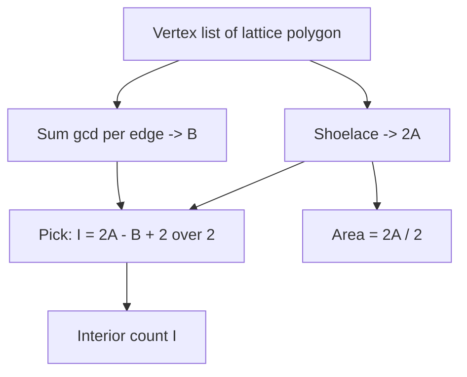

# Pick's Theorem and Lattice-Point Geometry — Junior Level

> **One-line summary:** For a simple polygon whose corners all sit on integer grid points, Pick's theorem says **Area = I + B/2 − 1**, where `I` is the number of grid points strictly *inside* the polygon and `B` is the number of grid points *on the boundary*. Pair it with the **shoelace formula** for area and **gcd(|dx|,|dy|)** for boundary counts, and you can count lattice points without ever drawing the grid.

---

## Table of Contents

1. [Introduction](#introduction)
2. [Prerequisites](#prerequisites)
3. [Glossary](#glossary)
4. [Core Concepts](#core-concepts)
5. [Big-O Summary](#big-o-summary)
6. [Real-World Analogies](#real-world-analogies)
7. [Pros & Cons](#pros--cons)
8. [Step-by-Step Walkthrough](#step-by-step-walkthrough)
9. [Code Examples](#code-examples)
10. [Coding Patterns](#coding-patterns)
11. [Error Handling](#error-handling)
12. [Performance Tips](#performance-tips)
13. [Best Practices](#best-practices)
14. [Edge Cases & Pitfalls](#edge-cases--pitfalls)
15. [Common Mistakes](#common-mistakes)
16. [Cheat Sheet](#cheat-sheet)
17. [Visual Animation](#visual-animation)
18. [Summary](#summary)
19. [Further Reading](#further-reading)

---

## Introduction

Imagine a sheet of graph paper where every line crossing is a **lattice point** — a point with whole-number coordinates like `(0,0)`, `(3,1)`, or `(−2,4)`. Now draw a polygon whose every corner lands exactly on one of those crossings. **Pick's theorem** (Georg Alexander Pick, 1899) gives you the polygon's area from nothing but a count of dots:

> **Area = I + B/2 − 1**

- `I` = the number of lattice points **strictly inside** the polygon.
- `B` = the number of lattice points **on the boundary** (corners plus points where edges cross grid lines).

That is the whole theorem. A triangle with no interior dots and just its 3 corners on the grid has area `0 + 3/2 − 1 = 1/2`. Check it against the usual `½·base·height` and it matches every time.

Why should you care as a programmer? Because Pick's theorem turns two different problems into each other:

1. If you can **compute the area** (the shoelace formula does this in `O(n)` from the vertices) and you can **count the boundary points** (a `gcd` per edge), then you instantly get the **interior count**:

   > **I = Area − B/2 + 1**

2. Counting lattice points inside arbitrary shapes is normally fiddly; Pick's theorem reduces it to two clean, fast computations.

This shows up constantly in competitive programming ("how many integer points lie inside this triangle?"), in **digital geometry** and **image analysis** (the pixels of a region *are* lattice points), and anywhere a shape is described by integer coordinates.

The three tools you will master in this file:

- **Shoelace formula** — area of any simple polygon from its vertex list.
- **gcd(|dx|, |dy|)** — number of boundary lattice points contributed by one edge.
- **Pick's theorem** — the bridge that converts area ↔ interior count.

The one rule you must never forget: Pick's theorem only works when **all vertices are lattice points** and the polygon is **simple** (edges do not cross themselves). Break either condition and the formula is meaningless.

---

## Prerequisites

Before reading this file you should be comfortable with:

- **Integer coordinates** — points `(x, y)` where `x` and `y` are whole numbers.
- **gcd (greatest common divisor)** — `gcd(12, 8) = 4`. We use the Euclidean algorithm. (See topic *19-number-theory/01-gcd-lcm*.)
- **Basic loops and arrays** — to walk a list of polygon vertices.
- **Absolute value** — `|x|` for distances along an axis.
- **Big-O notation** — `O(n)` for a single pass over `n` vertices.

Optional but helpful:

- A rough memory of the **area of a triangle** (`½·base·height`) so you can sanity-check results.
- The idea of a **cross product** of two 2-D vectors (it appears inside the shoelace formula). We will explain it as we go.

You do **not** need calculus, trigonometry, or any prior computational-geometry background.

---

## Glossary

| Term | Meaning |
|------|---------|
| **Lattice point** | A point `(x, y)` with both coordinates integers. The crossings of graph paper. |
| **Simple polygon** | A closed shape whose edges do not cross or touch except at shared corners. |
| **Lattice polygon** | A simple polygon whose every vertex is a lattice point. |
| **`I` (interior points)** | Lattice points strictly inside the polygon (not on any edge). |
| **`B` (boundary points)** | Lattice points lying on the polygon's edges, including the corners. |
| **Area `A`** | The 2-D area enclosed by the polygon. |
| **Shoelace formula** | A way to compute polygon area from its ordered vertices in `O(n)`. |
| **Cross product (2-D)** | For vectors `(x1,y1)` and `(x2,y2)`: `x1·y2 − y1·x2`. Signed; its absolute value is twice a triangle's area. |
| **gcd** | Greatest common divisor; `gcd(|dx|,|dy|)` counts lattice points on a segment. |
| **Edge** | A straight segment between two consecutive vertices. |
| **Vertex** | A corner of the polygon (always a lattice point here). |
| **2A (twice area)** | The shoelace sum *before* dividing by 2; always an integer for a lattice polygon. |

---

## Core Concepts

### 1. Lattice points and what we are counting

A polygon drawn on graph paper covers some grid crossings. Pick's theorem splits those crossings into two buckets:

- **Boundary points `B`** — the dots that the polygon's outline passes through.
- **Interior points `I`** — the dots strictly enclosed, none of them on the outline.

Everything in Pick's theorem is about counting these dots. A dot is never counted in both buckets.

### 2. The shoelace formula — area from vertices

Given vertices `(x0,y0), (x1,y1), …, (x_{n-1},y_{n-1})` listed in order around the polygon, the **signed area** is:

```
2A = Σ (x_i · y_{i+1} − x_{i+1} · y_i)      (indices wrap: after n-1 comes 0)
A  = |2A| / 2
```

The name comes from the criss-cross multiplication pattern — like lacing a shoe. For a **lattice polygon**, every `x_i` and `y_i` is an integer, so `2A` is always an **integer**. That is a gift: you can compute area in exact integer arithmetic, with no rounding error.

### 3. Counting boundary points on one edge — gcd

How many lattice points lie on the segment from `(x1,y1)` to `(x2,y2)`, *not counting the start* (so we do not double-count corners)? The answer is:

```
gcd(|x2 − x1|, |y2 − y1|)
```

For example, the segment from `(0,0)` to `(4,2)` has `gcd(4,2) = 2` lattice points if we count one endpoint, meaning it passes through one *extra* lattice point in the middle (at `(2,1)`) plus the endpoint. Summing `gcd(|dx|,|dy|)` over every edge gives the **total boundary count `B`**, with each corner counted exactly once.

### 4. Pick's theorem — the bridge

Put the pieces together:

```
A = I + B/2 − 1          (Pick's theorem)
```

Rearranged, it lets you *count interior points* without scanning the grid:

```
I = A − B/2 + 1
```

So the recipe to count interior lattice points is:
1. Shoelace → `A`.
2. Sum of edge `gcd`s → `B`.
3. Plug into `I = A − B/2 + 1`.

All three steps are `O(n)` in the number of vertices, independent of how *big* the polygon is. A triangle spanning a billion units costs the same as a tiny one.

### 5. Why "+1" and "B/2"?

Intuition (the full proof is in `professional.md`): each interior point "owns" a full unit of area, each boundary point owns half (it is shared with the outside), and the `−1` corrects for the single unit the polygon "loses" by being a closed loop. The precise version comes from triangulating the polygon into tiny lattice triangles and adding up Euler's formula — but for now, trust the dots.

---

## Big-O Summary

| Task | Complexity | Notes |
|------|-----------|-------|
| Shoelace area (`2A`) | **O(n)** | `n` = number of vertices. |
| Boundary count `B` (sum of gcds) | **O(n · log C)** | `C` = max coordinate; gcd is `O(log C)`. |
| Interior count `I` via Pick | **O(n · log C)** | Dominated by the gcd sum. |
| One edge's gcd | **O(log C)** | Euclidean algorithm. |
| Naive grid scan (brute force) | **O(W · H)** | `W·H` = bounding-box cells; only for tiny shapes. |

> Key takeaway: Pick's method depends on the **number of vertices**, not the **size** of the polygon. Brute-force grid counting depends on the area and blows up fast.

---

## Real-World Analogies

| Concept | Analogy |
|---------|---------|
| Lattice points | Crossings on graph paper, or pixels on a screen. |
| Counting `I` and `B` | Counting the apples *inside* a fenced orchard vs the apple trees planted *on* the fence line. |
| Boundary point owns ½ | A tree planted exactly on the property line is shared 50/50 with your neighbor. |
| Shoelace formula | Lacing a shoe — you multiply crossing diagonally, up one side and down the other. |
| gcd on an edge | A staircase: from `(0,0)` to `(4,2)` you take 2 identical "down-right" steps, and each step start is a lattice point. |
| The `−1` correction | The "closing-the-loop" tax: a fence that returns to its start encloses one unit less than the naive dot-count suggests. |

Where the analogies break: the orchard analogy ignores that boundary points can be corners shared by three regions in more complex tilings; and a real shoe-lace does not handle signed (clockwise) areas, which the formula does via its sign.

---

## Pros & Cons

| Pros | Cons |
|------|------|
| Counts interior lattice points in `O(n)` regardless of polygon size. | Requires **all vertices to be lattice points** — useless for arbitrary real coordinates. |
| Uses exact integer arithmetic (shoelace `2A` is an integer) — no floating-point error. | Requires a **simple** polygon (no self-intersection). |
| Elegant bridge: area ↔ interior count, either direction. | Does **not** generalize to 3-D (the Reeve tetrahedron breaks it — see `professional.md`). |
| `gcd` boundary trick is short and fast. | Holes (polygons with inner boundaries) need a modified formula. |
| Perfect for competitive-programming lattice-counting problems. | Gives only counts/area — not *which* points are inside. |

**When to use:** counting integer points inside a polygon with integer corners; computing exact area of a lattice polygon; converting between area and lattice-point counts; digital-image region measurements.

**When NOT to use:** polygons with non-integer vertices, self-intersecting polygons, when you need the *list* of interior points (then you must enumerate), or any 3-D volume problem.

---

## Step-by-Step Walkthrough

Take the triangle with vertices `A = (0,0)`, `B = (4,0)`, `C = (0,3)`.

```
y
3 C
2 . .
1 . . .
0 A . . . B
  0 1 2 3 4   x
```

**Step 1 — Shoelace area.**

```
2A = (x_A·y_B − x_B·y_A) + (x_B·y_C − x_C·y_B) + (x_C·y_A − x_A·y_C)
   = (0·0 − 4·0)        + (4·3 − 0·0)         + (0·0 − 0·3)
   = 0                  + 12                  + 0
   = 12
A  = |12| / 2 = 6
```

**Step 2 — Boundary points `B` (sum of edge gcds).**

```
Edge A→B: gcd(|4−0|, |0−0|) = gcd(4, 0) = 4
Edge B→C: gcd(|0−4|, |3−0|) = gcd(4, 3) = 1
Edge C→A: gcd(|0−0|, |0−3|) = gcd(0, 3) = 3
B = 4 + 1 + 3 = 8
```

(Each `gcd` counts the lattice points on an edge excluding its start vertex, so summing over the closed loop counts every corner exactly once.)

**Step 3 — Interior points `I` via Pick.**

```
I = A − B/2 + 1 = 6 − 8/2 + 1 = 6 − 4 + 1 = 3
```

So the triangle has **3 interior lattice points**. Let us verify by eye — the interior dots are `(1,1)`, `(2,1)`, `(1,2)`. Yes, exactly 3. And Pick's theorem checks out: `A = I + B/2 − 1 = 3 + 4 − 1 = 6`. ✓

**Step 4 — Cross-check the area** with `½·base·height = ½·4·3 = 6`. ✓

That four-step routine — shoelace, gcd-sum, Pick, sanity-check — is the entire workflow.

---

## Code Examples

### Example: Area, boundary count `B`, and interior count `I` for a lattice polygon

#### Go

```go
package main

import "fmt"

// gcd via the Euclidean algorithm (always non-negative inputs here).
func gcd(a, b int) int {
	for b != 0 {
		a, b = b, a%b
	}
	if a < 0 {
		return -a
	}
	return a
}

func abs(x int) int {
	if x < 0 {
		return -x
	}
	return x
}

// twiceArea returns 2A using the shoelace formula (exact integer).
func twiceArea(xs, ys []int) int {
	n := len(xs)
	sum := 0
	for i := 0; i < n; i++ {
		j := (i + 1) % n
		sum += xs[i]*ys[j] - xs[j]*ys[i]
	}
	return abs(sum)
}

// boundaryPoints returns B = sum of gcd(|dx|,|dy|) over edges.
func boundaryPoints(xs, ys []int) int {
	n := len(xs)
	b := 0
	for i := 0; i < n; i++ {
		j := (i + 1) % n
		b += gcd(abs(xs[j]-xs[i]), abs(ys[j]-ys[i]))
	}
	return b
}

// interiorPoints uses Pick: I = A - B/2 + 1 = (2A - B + 2) / 2.
func interiorPoints(xs, ys []int) int {
	twoA := twiceArea(xs, ys)
	b := boundaryPoints(xs, ys)
	return (twoA - b + 2) / 2
}

func main() {
	xs := []int{0, 4, 0}
	ys := []int{0, 0, 3}
	twoA := twiceArea(xs, ys)
	b := boundaryPoints(xs, ys)
	i := interiorPoints(xs, ys)
	fmt.Printf("Area = %d/2 = %.1f\n", twoA, float64(twoA)/2) // 12/2 = 6.0
	fmt.Println("Boundary B =", b)                            // 8
	fmt.Println("Interior I =", i)                            // 3
}
```

#### Java

```java
public class Pick {
    static long gcd(long a, long b) {
        while (b != 0) { long t = a % b; a = b; b = t; }
        return Math.abs(a);
    }

    // 2A via shoelace (exact integer).
    static long twiceArea(int[] xs, int[] ys) {
        int n = xs.length;
        long sum = 0;
        for (int i = 0; i < n; i++) {
            int j = (i + 1) % n;
            sum += (long) xs[i] * ys[j] - (long) xs[j] * ys[i];
        }
        return Math.abs(sum);
    }

    // B = sum of gcd(|dx|,|dy|) over edges.
    static long boundaryPoints(int[] xs, int[] ys) {
        int n = xs.length;
        long b = 0;
        for (int i = 0; i < n; i++) {
            int j = (i + 1) % n;
            b += gcd(Math.abs(xs[j] - xs[i]), Math.abs(ys[j] - ys[i]));
        }
        return b;
    }

    // Pick: I = (2A - B + 2) / 2.
    static long interiorPoints(int[] xs, int[] ys) {
        return (twiceArea(xs, ys) - boundaryPoints(xs, ys) + 2) / 2;
    }

    public static void main(String[] args) {
        int[] xs = {0, 4, 0};
        int[] ys = {0, 0, 3};
        long twoA = twiceArea(xs, ys);
        System.out.printf("Area = %d/2 = %.1f%n", twoA, twoA / 2.0); // 12/2 = 6.0
        System.out.println("Boundary B = " + boundaryPoints(xs, ys)); // 8
        System.out.println("Interior I = " + interiorPoints(xs, ys)); // 3
    }
}
```

#### Python

```python
from math import gcd


def twice_area(pts):
    """2A via the shoelace formula (exact integer)."""
    n = len(pts)
    s = 0
    for i in range(n):
        x1, y1 = pts[i]
        x2, y2 = pts[(i + 1) % n]
        s += x1 * y2 - x2 * y1
    return abs(s)


def boundary_points(pts):
    """B = sum of gcd(|dx|, |dy|) over all edges."""
    n = len(pts)
    b = 0
    for i in range(n):
        x1, y1 = pts[i]
        x2, y2 = pts[(i + 1) % n]
        b += gcd(abs(x2 - x1), abs(y2 - y1))
    return b


def interior_points(pts):
    """Pick: I = A - B/2 + 1 = (2A - B + 2) // 2."""
    return (twice_area(pts) - boundary_points(pts) + 2) // 2


if __name__ == "__main__":
    triangle = [(0, 0), (4, 0), (0, 3)]
    two_a = twice_area(triangle)
    print(f"Area = {two_a}/2 = {two_a / 2}")          # 12/2 = 6.0
    print("Boundary B =", boundary_points(triangle))  # 8
    print("Interior I =", interior_points(triangle))  # 3
```

**What it does:** computes the exact area (as `2A`), the boundary lattice-point count `B`, and the interior count `I` for the example triangle.
**Run:** `go run main.go` | `javac Pick.java && java Pick` | `python pick.py`

---

## Coding Patterns

### Pattern 1: Keep area in `2A` form to stay integer

**Intent:** avoid floating-point by never dividing until the end.

```python
two_a = abs(sum(x1 * y2 - x2 * y1 for ...))   # always an integer
# Pick rearranged to avoid fractions:
#   I = (2A - B + 2) // 2
i = (two_a - b + 2) // 2
```

`2A − B` is always even for a valid lattice polygon, so the integer division is exact. Working in `2A` form sidesteps `0.5` rounding bugs entirely.

### Pattern 2: gcd-per-edge boundary count

**Intent:** count `B` without enumerating points.

```python
from math import gcd
b = sum(gcd(abs(x2 - x1), abs(y2 - y1)) for (x1, y1), (x2, y2) in edges)
```

Remember `gcd(d, 0) = d`: a horizontal edge of length `d` contributes `d` boundary points (its `d` lattice steps), which is exactly right.

### Pattern 3: The "count integer points in a triangle" shortcut

**Intent:** a common interview/contest phrasing.

```python
# Points strictly inside triangle (a, b, c):
#   I = (2*area - boundary + 2) // 2
# Points inside OR on the boundary:
#   total = I + B = (2*area + boundary + 2) // 2
```



---

## Error Handling

| Error | Cause | Fix |
|-------|-------|-----|
| Wrong area (off by 2×) | Forgot to divide `2A` by 2, or divided too early. | Keep `2A` integer; divide only when reporting area. |
| Negative area | Vertices listed clockwise. | Take `abs()` of the shoelace sum. |
| `I` comes out fractional | A vertex was **not** a lattice point, or polygon is self-intersecting. | Validate integer vertices and simplicity before applying Pick. |
| Boundary undercount | Horizontal/vertical edge handled with `gcd(d,d)` instead of `gcd(d,0)`. | Use `gcd(|dx|, |dy|)`; note `gcd(d,0)=d`. |
| Integer overflow | Large coordinates multiplied in 32-bit. | Use 64-bit (`long` / Go `int` is 64-bit on most platforms). |
| Off-by-one in wrap | Last edge from `v[n-1]` back to `v[0]` skipped. | Index with `(i+1) % n`. |

---

## Performance Tips

- **Stay in integer arithmetic.** The shoelace `2A` is exactly an integer; never introduce floats until you print the final area.
- **Use the language's built-in `gcd`** (`math.gcd` in Python, `Math.abs` + Euclid in Java/Go) — they are tight and correct.
- **One pass is enough.** You can compute `2A` and `B` in the same loop over edges.
- **Avoid the grid scan.** Brute-forcing every cell in the bounding box is `O(W·H)` and explodes for big polygons; Pick is `O(n)`.
- **Reserve 64-bit accumulators** for the shoelace sum when coordinates can reach `10^9`.

---

## Best Practices

- Validate that all vertices are integers and the polygon is simple **before** trusting Pick's result.
- Compute and store `2A` (twice area) as the canonical exact value; derive area and `I` from it.
- Always take the absolute value of the shoelace sum so vertex orientation (CW vs CCW) does not matter.
- Test on shapes with a known answer: the unit triangle (`A=½, I=0, B=3`) and the unit square (`A=1, I=0, B=4`).
- Use `(i + 1) % n` for edge indexing so the closing edge is never forgotten.
- Document the assumptions (lattice vertices, simple polygon) right next to the function.

---

## Edge Cases & Pitfalls

- **Degenerate polygon** (all points collinear) — area is 0; `I` and `B` still computable but the shape has no interior.
- **Clockwise ordering** — shoelace sum is negative; `abs()` fixes it.
- **Single horizontal/vertical edge** — `gcd(d, 0) = d`, counting the `d` lattice steps correctly.
- **Very large coordinates** — guard the shoelace product against 32-bit overflow.
- **Non-lattice vertex** — Pick's theorem simply does not apply; the result is garbage.
- **Self-intersecting polygon** — "simple" is required; a bow-tie shape breaks the formula.
- **Polygon with a hole** — standard Pick is for hole-free simple polygons; holes need a corrected formula (`senior.md`).

---

## Common Mistakes

1. **Dividing the shoelace sum by 2 too early** and losing the integer guarantee.
2. **Forgetting `abs()`** and getting a negative area for clockwise polygons.
3. **Using `gcd(|dx|, |dy|)` but counting each edge's *both* endpoints**, double-counting corners. Count one endpoint per edge.
4. **Applying Pick to non-integer vertices** — it is only valid for lattice polygons.
5. **Confusing `I` and `B`** in the formula — interior gets the `+1`/`−1`, boundary gets the `/2`.
6. **32-bit overflow** on `x_i · y_{i+1}` for big coordinates.
7. **Assuming Pick works in 3-D** — it does not (Reeve tetrahedron).

---

## Cheat Sheet

| Quantity | Formula |
|----------|---------|
| Twice area | `2A = |Σ (x_i·y_{i+1} − x_{i+1}·y_i)|` |
| Area | `A = 2A / 2` |
| Boundary points | `B = Σ gcd(|dx_e|, |dy_e|)` over edges |
| Pick's theorem | `A = I + B/2 − 1` |
| Interior points | `I = A − B/2 + 1 = (2A − B + 2)/2` |
| Total lattice pts (interior + boundary) | `I + B = (2A + B + 2)/2` |

Hard rules:

```
1. All vertices must be LATTICE points (integer coords).
2. Polygon must be SIMPLE (no self-intersection).
3. Works in 2-D only — NOT 3-D.
```

---

## Visual Animation

> See [`animation.html`](./animation.html) for an interactive visual animation of Pick's theorem.
>
> The animation demonstrates:
> - A lattice grid with an editable polygon
> - Interior points (`I`) and boundary points (`B`) counted and color-coded live
> - The `Area = I + B/2 − 1` relation recomputed as you change the polygon
> - The shoelace area and per-edge `gcd` boundary counts shown step by step
> - Controls to add/move vertices, preset shapes, and a Big-O panel

---

## Summary

Pick's theorem, `Area = I + B/2 − 1`, ties together three simple computations: the **shoelace formula** for area (exact integer `2A`), a **gcd per edge** for the boundary count `B`, and the rearranged Pick formula `I = A − B/2 + 1` for the interior count. The whole pipeline is `O(n)` in the number of vertices and independent of the polygon's size, which is why it crushes brute-force grid scanning. Master three things and the topic is yours: the **shoelace formula**, the **gcd boundary trick**, and **Pick's bridge** between area and lattice-point counts. Never forget the two preconditions — lattice vertices and a simple polygon — and never trust the formula in 3-D.

---

## Further Reading

- Pick, G. A. (1899). *Geometrisches zur Zahlenlehre.* — the original paper.
- *Concrete Mathematics* (Graham, Knuth, Patashnik) — lattice points and gcd.
- cp-algorithms.com — "Pick's theorem" and "Lattice points inside a non-lattice polygon."
- *Computational Geometry: Algorithms and Applications* (de Berg et al.) — polygon area and orientation.
- Sibling topics: *19-number-theory/01-gcd-lcm* (the gcd boundary trick), *03-point-in-polygon* (membership testing), *01-convex-hull* (building lattice polygons).
- Next step: continue to [`middle.md`](./middle.md).

---

**Next step:** [Pick's Theorem — Middle Level](./middle.md)
