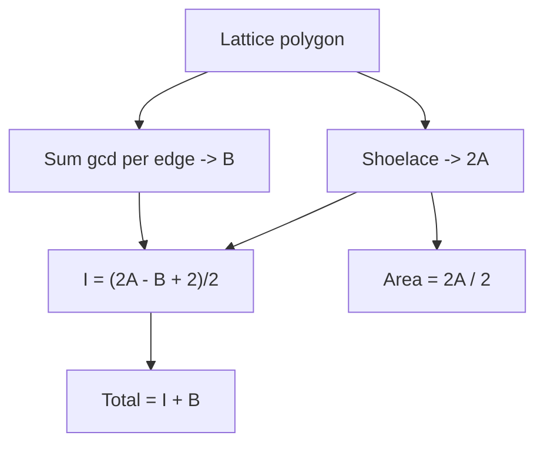
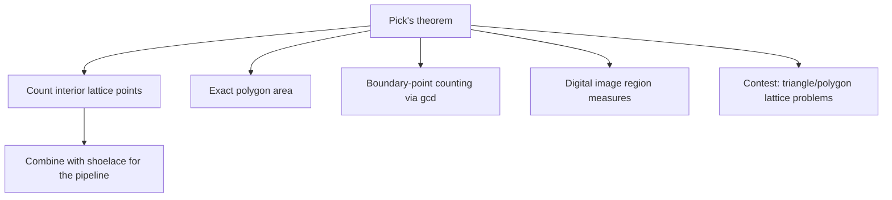

# Pick's Theorem and Lattice-Point Geometry — Middle Level

> **Focus:** *Why* `Area = I + B/2 − 1` holds, *how* to derive interior counts and combine shoelace + Pick, the lattice-counting problem family it solves, the gcd boundary trick in depth, and exactly *when* the theorem stops applying (non-lattice vertices, holes, 3-D).

---

## Table of Contents

1. [Introduction](#introduction)
2. [Deeper Concepts](#deeper-concepts)
3. [Comparison with Alternatives](#comparison-with-alternatives)
4. [Advanced Patterns](#advanced-patterns)
5. [Geometry and Counting Applications](#geometry-and-counting-applications)
6. [Algorithmic Integration](#algorithmic-integration)
7. [Code Examples](#code-examples)
8. [Error Handling](#error-handling)
9. [Performance Analysis](#performance-analysis)
10. [Best Practices](#best-practices)
11. [Visual Animation](#visual-animation)
12. [Summary](#summary)

---

## Introduction

At junior level Pick's theorem is a recipe: shoelace for area, gcd for boundary, plug into `I = A − B/2 + 1`. At middle level you start asking the *engineering* and *mathematical* questions that decide whether you reach for it at all:

- *Why* is `Area = I + B/2 − 1` true, and what does the proof tell you about its limits?
- How do you turn a "count integer points inside this shape" problem into a Pick computation — and when can't you?
- Why is `gcd(|dx|, |dy|)` exactly the boundary count of a segment?
- How do shoelace and Pick combine, and what is the cleanest integer-only pipeline?
- When does Pick **fail** (non-lattice vertices, holes, self-intersection, 3-D), and what replaces it?

These distinctions separate "I memorized the formula" from "I know which contest problem this solves and which it doesn't."

---

## Deeper Concepts

### Why `gcd(|dx|, |dy|)` counts boundary lattice points

Take a segment from `(x1, y1)` to `(x2, y2)`. Let `dx = x2 − x1`, `dy = y2 − y1`, and `g = gcd(|dx|, |dy|)`. The lattice points strictly between the endpoints are exactly those at:

```
(x1 + k·dx/g,  y1 + k·dy/g)   for k = 1, 2, …, g−1
```

Because `dx/g` and `dy/g` are coprime integers, these are the *only* lattice points on the open segment, and there are `g − 1` of them. Including one endpoint, the segment contributes `g` boundary points. Summing `g` over all edges of a closed polygon counts every vertex exactly once (each vertex is the "included endpoint" of exactly one edge), giving the total boundary count `B`. This is why the gcd trick is exact, not an approximation.

### The shoelace + Pick integer pipeline

Both ingredients are integers if we keep area in `2A` form:

```
2A = |Σ (x_i·y_{i+1} − x_{i+1}·y_i)|      (integer)
B  = Σ gcd(|dx_e|, |dy_e|)                (integer)
```

Pick's theorem `A = I + B/2 − 1` multiplied through by 2 becomes:

```
2A = 2I + B − 2
⟹  I = (2A − B + 2) / 2
```

The numerator `2A − B + 2` is always **even** for a valid lattice polygon (a consequence of the theorem itself), so the division is exact in integer arithmetic. This is the cleanest, overflow-safe, rounding-free way to compute `I`.

### Deriving the three quantities from each other

Pick's theorem is a single linear relation among `A`, `I`, `B`. Knowing any two gives the third:

| Known | Derive |
|-------|--------|
| `A`, `B` | `I = A − B/2 + 1` |
| `I`, `B` | `A = I + B/2 − 1` |
| `A`, `I` | `B = 2(A − I + 1)` |
| `A`, `B` | total interior+boundary `= I + B = A + B/2 + 1` |

This flexibility is what makes Pick a *counting* tool: many problems hand you two quantities and ask for the third.

### Why the theorem needs lattice vertices and simplicity

The proof (full version in `professional.md`) triangulates the polygon into **primitive (unit) lattice triangles** — triangles with exactly 3 boundary points and 0 interior points, each of area exactly `1/2`. Two facts make this work:

1. **Lattice vertices** guarantee every sub-triangle is itself a lattice triangle, so the unit-area-`1/2` building block exists.
2. **Simplicity** guarantees the triangulation tiles the interior exactly once — no overlaps, no gaps.

Break either condition and the building blocks no longer tile cleanly, so the count is wrong. A non-lattice vertex creates a triangle whose area is *not* a half-integer; a self-intersection makes a region get covered twice (or negatively).

### Polygons with holes

For a polygon with `h` holes (an annulus-like region), Pick's theorem generalizes via the Euler characteristic:

```
A = I + B/2 − 1 + h
```

Each hole adds `+1` because it removes a "closing-the-loop" unit. We treat this carefully in `senior.md`; for now, note that standard Pick assumes `h = 0`.

---

## Comparison with Alternatives

| Attribute | Pick's theorem | Brute-force grid scan | Direct integration / formula |
|-----------|----------------|-----------------------|------------------------------|
| Counts interior pts | Yes (`I`) | Yes | Indirectly |
| Computes area | Yes (via shoelace) | Approx (count cells) | Yes |
| Time | **O(n)** vertices | **O(W·H)** cells | O(n) |
| Needs lattice vertices | **Yes** | No | No |
| Exact integer arithmetic | Yes | Yes | Often floating-point |
| Handles non-lattice polygon | No | Yes | Yes (area only) |
| Gives the *list* of points | No (count only) | Yes | No |
| Best for | Lattice point counting | Tiny shapes / verification | Real-coordinate area |

**Choose Pick when:** vertices are integers and you need interior/boundary counts or exact area cheaply, regardless of polygon size.

**Choose a grid scan when:** the polygon is tiny and you need the actual *set* of interior points, or you are verifying a Pick implementation.

**Choose plain shoelace (no Pick) when:** vertices are real-valued and you only need area, not lattice counts.

---

## Advanced Patterns

### Pattern: Lattice points inside a triangle (no full polygon needed)

A triangle is the smallest lattice polygon. Counting interior integer points is the canonical Pick application.

#### Go

```go
package main

import "fmt"

func gcd(a, b int) int {
	for b != 0 {
		a, b = b, a%b
	}
	if a < 0 {
		a = -a
	}
	return a
}

func abs(x int) int { if x < 0 { return -x }; return x }

// interiorInTriangle returns the number of lattice points strictly inside.
func interiorInTriangle(ax, ay, bx, by, cx, cy int) int {
	twoA := abs((bx-ax)*(cy-ay) - (cx-ax)*(by-ay)) // |cross| = 2 * area
	b := gcd(abs(bx-ax), abs(by-ay)) +
		gcd(abs(cx-bx), abs(cy-by)) +
		gcd(abs(ax-cx), abs(ay-cy))
	return (twoA - b + 2) / 2 // Pick rearranged
}

func main() {
	fmt.Println(interiorInTriangle(0, 0, 4, 0, 0, 3)) // 3
}
```

#### Java

```java
public class TriangleLattice {
    static long gcd(long a, long b) {
        while (b != 0) { long t = a % b; a = b; b = t; }
        return Math.abs(a);
    }

    static long interiorInTriangle(long ax, long ay, long bx, long by,
                                   long cx, long cy) {
        long twoA = Math.abs((bx - ax) * (cy - ay) - (cx - ax) * (by - ay));
        long b = gcd(Math.abs(bx - ax), Math.abs(by - ay))
               + gcd(Math.abs(cx - bx), Math.abs(cy - by))
               + gcd(Math.abs(ax - cx), Math.abs(ay - cy));
        return (twoA - b + 2) / 2;
    }

    public static void main(String[] args) {
        System.out.println(interiorInTriangle(0, 0, 4, 0, 0, 3)); // 3
    }
}
```

#### Python

```python
from math import gcd


def interior_in_triangle(a, b, c):
    ax, ay = a; bx, by = b; cx, cy = c
    two_a = abs((bx - ax) * (cy - ay) - (cx - ax) * (by - ay))  # |cross|
    boundary = (gcd(abs(bx - ax), abs(by - ay))
                + gcd(abs(cx - bx), abs(cy - by))
                + gcd(abs(ax - cx), abs(ay - cy)))
    return (two_a - boundary + 2) // 2


if __name__ == "__main__":
    print(interior_in_triangle((0, 0), (4, 0), (0, 3)))  # 3
```

### Pattern: Boundary points on a single segment (reusable helper)

**Intent:** the gcd trick isolated, used inside many geometry routines.

```python
from math import gcd
def boundary_on_segment(p, q):
    """Lattice points on segment p..q, EXCLUDING p (so the polygon loop counts each corner once)."""
    return gcd(abs(q[0] - p[0]), abs(q[1] - p[1]))
```

### Pattern: total lattice points (interior + boundary) in one shot

**Intent:** many contest problems want "points inside *or on*" the polygon.

```python
def total_lattice_points(pts):
    two_a = abs(shoelace(pts))
    b = sum(boundary_on_segment(pts[i], pts[(i+1) % len(pts)]) for i in range(len(pts)))
    interior = (two_a - b + 2) // 2
    return interior + b      # = (2A + B + 2) // 2
```



---

## Geometry and Counting Applications



### The lattice-counting problem family

Pick's theorem is the engine behind a recognizable cluster of problems:

- **"How many integer points are strictly inside / on a given polygon?"** — direct Pick.
- **"Area of a polygon with integer corners?"** — shoelace, optionally cross-checked by Pick.
- **"Given area and boundary count, find interior count"** (or any 2-of-3) — rearranged Pick.
- **"Count lattice points under a line / inside a triangle formed by lattice points"** — Pick after forming the triangle.
- **"Number of grid squares a polygon covers"** — relates to `I + B/2` style measures.

### Connection to Farey sequences and Stern–Brocot (brief)

The gcd boundary trick is the same coprimality that underlies **Farey sequences**: the lattice points visible from the origin (no lattice point between them and the origin) are exactly the coprime pairs `(p, q)` with `gcd(p, q) = 1`, which are the Farey fractions `p/q`. The **Stern–Brocot tree** enumerates all coprime pairs and mirrors the mediant structure of segments between visible lattice points. So "how many lattice points does this segment pass through" and "which fractions appear in the Farey sequence" are two faces of the same coprimality counting. This is a brief pointer — the full theory lives in number-theory topics — but it explains *why* gcd, of all things, governs lattice geometry.

---

## Algorithmic Integration

Pick's theorem rarely stands alone; it slots into larger geometry pipelines.

#### Go

```go
// After building a convex hull of lattice points, Pick gives the lattice
// count enclosed for free.
func hullLatticeStats(hullX, hullY []int) (area2, boundary, interior int) {
	n := len(hullX)
	for i := 0; i < n; i++ {
		j := (i + 1) % n
		area2 += hullX[i]*hullY[j] - hullX[j]*hullY[i]
		boundary += gcd(abs(hullX[j]-hullX[i]), abs(hullY[j]-hullY[i]))
	}
	if area2 < 0 {
		area2 = -area2
	}
	interior = (area2 - boundary + 2) / 2
	return
}
```

#### Java

```java
// Combine with a convex-hull output (vertices in order) to count enclosed points.
static long[] hullLatticeStats(int[] hx, int[] hy) {
    int n = hx.length;
    long area2 = 0, boundary = 0;
    for (int i = 0; i < n; i++) {
        int j = (i + 1) % n;
        area2 += (long) hx[i] * hy[j] - (long) hx[j] * hy[i];
        boundary += gcd(Math.abs(hx[j] - hx[i]), Math.abs(hy[j] - hy[i]));
    }
    area2 = Math.abs(area2);
    long interior = (area2 - boundary + 2) / 2;
    return new long[]{area2, boundary, interior};
}
```

#### Python

```python
from math import gcd

def hull_lattice_stats(hull):
    """hull = convex-hull vertices in order. Returns (2A, B, I)."""
    n = len(hull)
    area2 = boundary = 0
    for i in range(n):
        x1, y1 = hull[i]
        x2, y2 = hull[(i + 1) % n]
        area2 += x1 * y2 - x2 * y1
        boundary += gcd(abs(x2 - x1), abs(y2 - y1))
    area2 = abs(area2)
    interior = (area2 - boundary + 2) // 2
    return area2, boundary, interior
```

---

## Code Examples

### Full lattice-polygon analyzer with validation

#### Go

```go
package main

import (
	"errors"
	"fmt"
)

func gcd2(a, b int) int {
	for b != 0 {
		a, b = b, a%b
	}
	if a < 0 {
		a = -a
	}
	return a
}
func abs2(x int) int { if x < 0 { return -x }; return x }

type Stats struct {
	TwiceArea, Boundary, Interior int
}

// Analyze validates and applies Pick. Returns an error if 2A-B+2 is odd
// (a strong signal of non-lattice or non-simple input).
func Analyze(pts [][2]int) (Stats, error) {
	n := len(pts)
	if n < 3 {
		return Stats{}, errors.New("need at least 3 vertices")
	}
	area2 := 0
	boundary := 0
	for i := 0; i < n; i++ {
		j := (i + 1) % n
		area2 += pts[i][0]*pts[j][1] - pts[j][0]*pts[i][1]
		boundary += gcd2(abs2(pts[j][0]-pts[i][0]), abs2(pts[j][1]-pts[i][1]))
	}
	area2 = abs2(area2)
	num := area2 - boundary + 2
	if num%2 != 0 {
		return Stats{}, errors.New("2A - B + 2 is odd: not a valid lattice polygon")
	}
	return Stats{area2, boundary, num / 2}, nil
}

func main() {
	// Square (0,0)-(4,0)-(4,4)-(0,4): A=16, B=16, I=9
	s, err := Analyze([][2]int{{0, 0}, {4, 0}, {4, 4}, {0, 4}})
	fmt.Println(s, err) // {32 16 9} <nil>
}
```

#### Java

```java
import java.util.*;

public class LatticeAnalyzer {
    static long gcd(long a, long b) {
        while (b != 0) { long t = a % b; a = b; b = t; }
        return Math.abs(a);
    }

    // Returns {2A, B, I}; throws if 2A-B+2 is odd.
    static long[] analyze(int[][] pts) {
        int n = pts.length;
        if (n < 3) throw new IllegalArgumentException("need >= 3 vertices");
        long area2 = 0, boundary = 0;
        for (int i = 0; i < n; i++) {
            int j = (i + 1) % n;
            area2 += (long) pts[i][0] * pts[j][1] - (long) pts[j][0] * pts[i][1];
            boundary += gcd(Math.abs(pts[j][0] - pts[i][0]),
                            Math.abs(pts[j][1] - pts[i][1]));
        }
        area2 = Math.abs(area2);
        long num = area2 - boundary + 2;
        if ((num & 1) != 0)
            throw new IllegalStateException("2A - B + 2 odd: invalid lattice polygon");
        return new long[]{area2, boundary, num / 2};
    }

    public static void main(String[] args) {
        int[][] sq = {{0, 0}, {4, 0}, {4, 4}, {0, 4}};
        System.out.println(Arrays.toString(analyze(sq))); // [32, 16, 9]
    }
}
```

#### Python

```python
from math import gcd


def analyze(pts):
    """Validate + apply Pick. Returns (2A, B, I). Raises on invalid input."""
    n = len(pts)
    if n < 3:
        raise ValueError("need at least 3 vertices")
    area2 = boundary = 0
    for i in range(n):
        x1, y1 = pts[i]
        x2, y2 = pts[(i + 1) % n]
        area2 += x1 * y2 - x2 * y1
        boundary += gcd(abs(x2 - x1), abs(y2 - y1))
    area2 = abs(area2)
    num = area2 - boundary + 2
    if num % 2 != 0:
        raise ValueError("2A - B + 2 is odd: not a valid lattice polygon")
    return area2, boundary, num // 2


if __name__ == "__main__":
    square = [(0, 0), (4, 0), (4, 4), (0, 4)]
    print(analyze(square))  # (32, 16, 9)  -> A=16, B=16, I=9
```

**What it does:** validates the polygon and returns `2A`, `B`, and `I`. The parity check on `2A − B + 2` is a cheap guard against non-lattice or non-simple input.
**Run:** `go run main.go` | `javac LatticeAnalyzer.java && java LatticeAnalyzer` | `python analyze.py`

---

## Error Handling

| Scenario | What goes wrong | Correct approach |
|----------|----------------|------------------|
| Non-lattice vertex | `2A − B + 2` becomes odd → `I` fractional. | Parity-check `2A − B + 2`; reject if odd. |
| Self-intersecting polygon | Shoelace gives a meaningless signed area. | Validate simplicity separately (sweep-line or pairwise edge test). |
| Polygon with holes | Standard formula undercounts by `h`. | Use `A = I + B/2 − 1 + h`. |
| Clockwise vertices | Negative `2A`. | Always `abs()` the shoelace sum. |
| Coordinate overflow | `x·y` exceeds 32-bit. | Use 64-bit accumulators. |
| Degenerate (collinear) | `2A = 0`, no interior. | Handle area-0 as a special, valid case. |

---

## Performance Analysis

The whole pipeline is a single pass over `n` edges, each doing one cross-product term (`O(1)`) and one gcd (`O(log C)` where `C` is the max coordinate). Total: `O(n log C)`, **independent of the polygon's physical size**.

#### Go

```go
import (
	"fmt"
	"time"
)

func benchmarkPick(sizes []int) {
	for _, n := range sizes {
		// build an n-gon approximating a big circle on the lattice
		xs := make([]int, n)
		ys := make([]int, n)
		for i := 0; i < n; i++ {
			xs[i] = i      // simple monotone fan to keep it cheap; replace as needed
			ys[i] = i * i % 1000
		}
		start := time.Now()
		for r := 0; r < 1000; r++ {
			_ = twiceArea(xs, ys) // see junior.md for twiceArea
		}
		fmt.Printf("n=%6d: %v\n", n, time.Since(start)/1000)
	}
}
```

#### Java

```java
public static void benchmarkPick(int[] sizes) {
    for (int n : sizes) {
        int[] xs = new int[n], ys = new int[n];
        for (int i = 0; i < n; i++) { xs[i] = i; ys[i] = (i * i) % 1000; }
        long start = System.nanoTime();
        for (int r = 0; r < 1000; r++) twiceArea(xs, ys);
        System.out.printf("n=%6d: %.3f ms%n", n,
                (System.nanoTime() - start) / 1000.0 / 1_000_000);
    }
}
```

#### Python

```python
import timeit

for n in [100, 1_000, 10_000, 100_000]:
    pts = [(i, (i * i) % 1000) for i in range(n)]
    t = timeit.timeit(lambda: twice_area(pts), number=100)  # see junior.md
    print(f"n={n:>7}: {t / 100 * 1000:.3f} ms")
```

Compare with the brute-force grid scan, which is `O(W·H)`: for a polygon spanning `10^6 × 10^6`, that is `10^12` cells — utterly infeasible — while Pick handles it in microseconds.

---

## Best Practices

- Keep area as integer `2A`; derive everything else from it.
- Add the `2A − B + 2` parity check as a free validity guard.
- Use a battle-tested `gcd` and remember `gcd(d, 0) = d`.
- Separate concerns: one function for shoelace, one for boundary, one for Pick.
- Test against unit triangle (`A=½, I=0, B=3`), unit square (`A=1, I=0, B=4`), and a known big triangle.
- For holes, explicitly add `+h`; document whether your input may contain them.
- Never apply Pick to floating-point coordinates — convert to a lattice first or use plain shoelace for area only.

---

## Visual Animation

> See [`animation.html`](./animation.html) for interactive visualization.
>
> Middle-level animation includes:
> - Live recomputation of `A`, `I`, `B` as you drag vertices
> - Per-edge `gcd` boundary contributions highlighted
> - The `Area = I + B/2 − 1` identity displayed and verified each frame
> - Preset shapes (triangle, square, L-shape) to compare counts
> - A log of every recomputation

---

## Summary

At middle level, Pick's theorem becomes a *derivation*, not a recipe. The gcd boundary count is exact because `dx/g` and `dy/g` are coprime, so a segment carries exactly `g` lattice points. The shoelace `2A` and the boundary `B` are both integers, so `I = (2A − B + 2)/2` is exact and overflow-safe. Knowing any two of `{A, I, B}` yields the third — the source of Pick's power as a lattice-counting tool, with a brief but real connection to Farey/coprimality. The theorem's limits are baked into its proof: it needs **lattice vertices** and a **simple** polygon, gains a `+h` term for holes, and does **not** survive into 3-D. Choose Pick over grid scanning whenever vertices are integers, because its cost depends on vertex count, not polygon size.

---

**Next step:** [Pick's Theorem — Senior Level](./senior.md)
