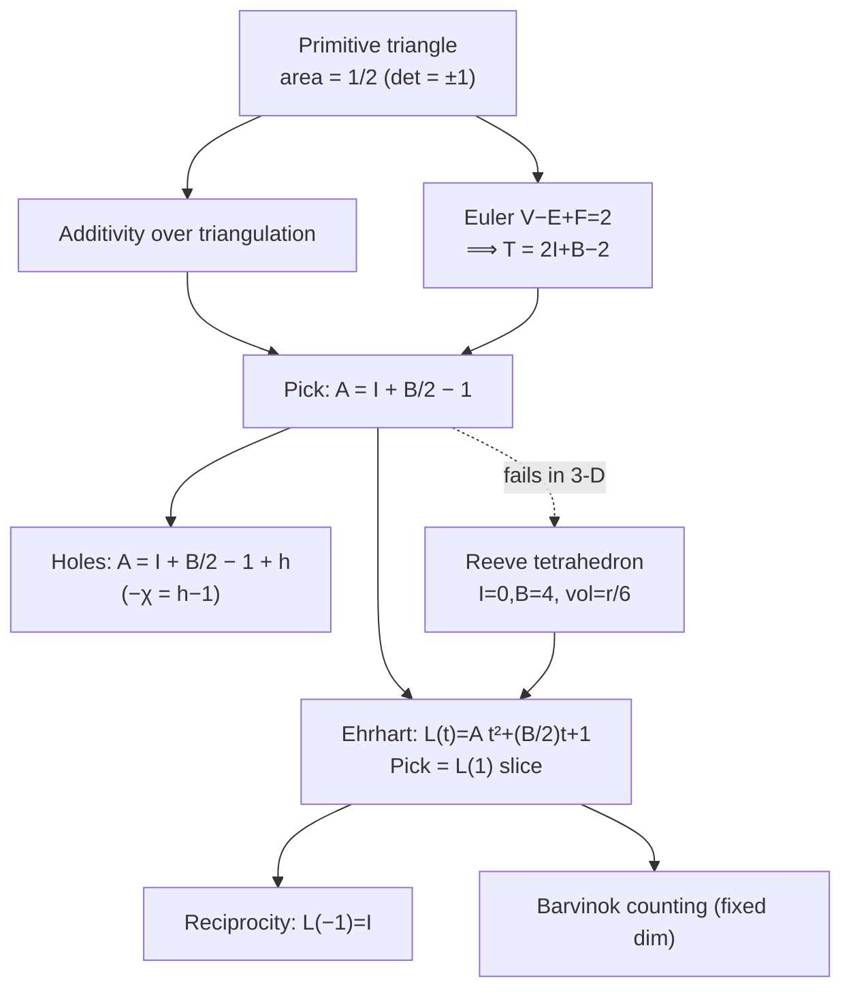

# Pick's Theorem and Lattice-Point Geometry — Mathematical Foundations

## Table of Contents
1. [Formal Definition](#1-formal-definition)
2. [Proof via Additivity over Triangulation](#2-proof-via-additivity-over-triangulation)
3. [Proof of the Primitive-Triangle Lemma (Euler's Formula)](#3-proof-of-the-primitive-triangle-lemma-eulers-formula)
4. [The gcd Boundary Count — Proof](#4-the-gcd-boundary-count--proof)
5. [Worked Triangulation Trace](#5-worked-triangulation-trace)
6. [Ehrhart Theory — Pick Generalized](#6-ehrhart-theory--pick-generalized)
7. [Worked Ehrhart Computation](#7-worked-ehrhart-computation)
8. [Higher Dimensions — The Reeve Tetrahedron](#8-higher-dimensions--the-reeve-tetrahedron)
9. [Polygons with Holes — Euler-Characteristic Form](#9-polygons-with-holes--euler-characteristic-form)
10. [Minkowski, Determinants, and the Primitive Lattice](#10-minkowski-determinants-and-the-primitive-lattice)
11. [Complexity and Exactness](#11-complexity-and-exactness)
12. [Comparison with Alternatives](#12-comparison-with-alternatives)
13. [Open Threads and Connections](#13-open-threads-and-connections)
14. [Summary](#14-summary)

---

## 1. Formal Definition

Let `Λ = ℤ²` be the integer lattice in the plane. A **lattice polygon** `P` is a simple (non-self-intersecting) polygon whose vertices all lie in `Λ`. Define:

```text
A  = area(P)                         (Lebesgue area of the closed region)
I  = | interior(P) ∩ Λ |             (lattice points strictly inside P)
B  = | ∂P ∩ Λ |                      (lattice points on the boundary of P)
```

**Theorem (Pick, 1899).** For every lattice polygon `P`,

```text
A = I + B/2 − 1.
```

Equivalently, in the integer-only form used in code:

```text
2A = 2I + B − 2,   so   I = (2A − B + 2) / 2,
```

where `2A` is the absolute shoelace sum, a non-negative integer.

The logical structure of the whole topic — from the atomic primitive triangle up to the higher-dimensional generalizations and the 3-D impossibility — is shown below.



We prove the theorem by reducing `P` to a triangulation into **primitive lattice triangles** and showing two facts: (i) each primitive triangle has area exactly `1/2`, and (ii) Pick's formula is *additive* under gluing two lattice polygons along a shared lattice edge. Together these force the formula for every lattice polygon.

**Definition 1.1 (Primitive / unimodular triangle).** A lattice triangle `T` is **primitive** if its only lattice points are its three vertices: `I(T) = 0`, `B(T) = 3`. Equivalently, the two edge vectors from any vertex form a basis of `Λ` (determinant `±1`).

---

## 2. Proof via Additivity over Triangulation

We establish Pick's theorem in three steps.

### Step 1 — Define the Pick functional and prove additivity

For any lattice polygon `Q`, define

```text
Pick(Q) := I(Q) + B(Q)/2 − 1.
```

The claim is `Pick(Q) = area(Q)`. We first show `Pick` is **additive**: if `Q = Q₁ ∪ Q₂` where `Q₁` and `Q₂` are lattice polygons meeting along a single shared lattice edge `e` (and disjoint interiors), then

```text
Pick(Q) = Pick(Q₁) + Pick(Q₂).
```

**Proof of additivity.** Let the shared edge `e` contain `k ≥ 2` lattice points (its two endpoints plus `k − 2` interior-to-the-edge points). Count contributions:

- **Interior points.** Every lattice point interior to `Q` is either interior to `Q₁`, interior to `Q₂`, or one of the `k − 2` points strictly inside edge `e` (these become interior to `Q` after gluing). So
  ```text
  I(Q) = I(Q₁) + I(Q₂) + (k − 2).
  ```
- **Boundary points.** The `k` points of `e` are boundary points of both `Q₁` and `Q₂`, but after gluing, the `k − 2` interior-to-`e` points are no longer on `∂Q`; only the 2 endpoints of `e` remain on `∂Q`. Every other boundary point of `Q₁` or `Q₂` stays on `∂Q`. Hence
  ```text
  B(Q) = B(Q₁) + B(Q₂) − 2(k − 2) − 2.
  ```
  (We subtract the `k − 2` shared interior-edge points *twice* — once from each piece — and subtract `2` because the 2 shared endpoints were counted in both pieces but appear once in `Q`.)

Now compute:

```text
Pick(Q₁) + Pick(Q₂)
  = I(Q₁) + I(Q₂) + (B(Q₁) + B(Q₂))/2 − 2
  = [I(Q) − (k − 2)] + [B(Q) + 2(k − 2) + 2]/2 − 2
  = I(Q) − (k − 2) + B(Q)/2 + (k − 2) + 1 − 2
  = I(Q) + B(Q)/2 − 1
  = Pick(Q).                                              ∎ (additivity)
```

Since `area` is trivially additive (`area(Q) = area(Q₁) + area(Q₂)`), proving `Pick = area` for the building blocks (triangles, then primitive triangles) extends to all lattice polygons by induction on the triangulation.

### Step 2 — Every lattice polygon triangulates into lattice triangles, each into primitive triangles

A simple polygon admits a triangulation using only its vertices (ear-clipping); for a lattice polygon every triangle is a lattice triangle. Any lattice triangle that contains an extra lattice point (interior or on an edge) can be subdivided at that point into smaller lattice triangles. This terminates because area strictly decreases and is bounded below by `1/2`. The result is a triangulation of `P` into **primitive** lattice triangles. By additivity (Step 1), it suffices to prove Pick for one primitive triangle.

### Step 3 — A primitive triangle has area `1/2`, satisfying Pick

For a primitive triangle `T`: `I(T) = 0`, `B(T) = 3`, so

```text
Pick(T) = 0 + 3/2 − 1 = 1/2.
```

We must show `area(T) = 1/2`. The two edge vectors `u, v` from one vertex form a basis of `ℤ²` (Definition 1.1 / proved in Section 3), so `|det(u, v)| = 1`, and `area(T) = ½|det(u, v)| = 1/2`. Thus `Pick(T) = area(T)` for primitive triangles, and by Steps 1–2, for all lattice polygons. **∎ (Pick's theorem)**

The one remaining gap is *why a primitive triangle's edge vectors form a unimodular basis* — i.e. why "no interior or edge lattice points" forces `|det| = 1`. That is the primitive-triangle lemma, which we prove next via Euler's formula (an alternative route that also re-derives Pick globally).

---

## 3. Proof of the Primitive-Triangle Lemma (Euler's Formula)

**Lemma 3.1.** A lattice triangle with no lattice points other than its 3 vertices has area exactly `1/2`.

**Proof (via a unit-cell / determinant argument).** Let the triangle have vertices `0, u, v` (translate so one vertex is the origin). The lattice points are exactly `{0, u, v}`, so the parallelogram `{αu + βv : 0 ≤ α, β < 1}` contains **no** lattice point except `0` (any such point would lie in the triangle or its reflected copy, contradicting primitivity). A fundamental domain of the sublattice `ℤu + ℤv` containing no other point of `ℤ²` means `ℤu + ℤv = ℤ²`, i.e. `{u, v}` is a basis of `ℤ²`, hence `|det(u, v)| = 1` and `area = ½|det| = 1/2`. ∎

### Global re-derivation of Pick via Euler's formula

Triangulate `P` into `T` primitive triangles. View this triangulation as a planar graph with `V` vertices, `E` edges, `F` faces. **Euler's formula** for a connected planar graph:

```text
V − E + F = 2.
```

Here `F = T + 1` (the `T` triangles plus the unbounded outer face), and `V = I + B` (all lattice points are triangulation vertices). Count edge incidences: each triangle has 3 edges; interior edges are shared by 2 triangles, boundary edges by 1 triangle and the outer face. Let `E_in` and `E_bd` be interior and boundary edges. Then `E_bd = B` (the polygon boundary has `B` lattice points, hence `B` unit boundary edges) and counting `3T = 2E_in + E_bd` gives `2E = 3T + B` (since `E = E_in + E_bd`). Substitute into Euler:

```text
(I + B) − E + (T + 1) = 2
⟹  (I + B) − (3T + B)/2 + T + 1 = 2
⟹  I + B − (3T)/2 − B/2 + T + 1 = 2
⟹  I + B/2 − T/2 − 1 = 0
⟹  T = 2I + B − 2.
```

Each primitive triangle has area `1/2`, so `A = T/2 = I + B/2 − 1`. **∎ (Pick via Euler)**

This Euler-formula route is the most-cited proof: it shows Pick's `−1` is precisely the Euler characteristic `χ = 1` of a disk, foreshadowing the hole-corrected form (Section 8) and the Ehrhart constant term (Section 6).

---

## 4. The gcd Boundary Count — Proof

**Proposition 4.1.** The number of lattice points on the closed segment from `p = (x₁, y₁)` to `q = (x₂, y₂)`, with `p, q ∈ ℤ²`, is `gcd(|x₂ − x₁|, |y₂ − y₁|) + 1`. Excluding one endpoint, the segment contributes exactly `g = gcd(|dx|, |dy|)` to the polygon's boundary count.

**Proof.** Let `dx = x₂ − x₁`, `dy = y₂ − y₁`, `g = gcd(|dx|, |dy|)`. A point on the segment is `p + λ(dx, dy)` for `λ ∈ [0,1]`. It is a lattice point iff `λ·dx ∈ ℤ` and `λ·dy ∈ ℤ`. Write `dx = g·a`, `dy = g·b` with `gcd(a, b) = 1`. Then `λ·g·a ∈ ℤ` and `λ·g·b ∈ ℤ`. Since `gcd(a,b)=1`, there exist integers with `ma + nb = 1`, so `λg = λg(ma+nb) = m(λga) + n(λgb) ∈ ℤ`. Thus `λg ∈ ℤ`, i.e. `λ ∈ {0, 1/g, 2/g, …, 1}`. Conversely each such `λ = j/g` gives an integer point `(x₁ + j·a, y₁ + j·b)`. There are `g + 1` values `j = 0,…,g`, giving `g + 1` lattice points including both endpoints, hence `g` excluding one. ∎

**Corollary 4.2 (Total boundary).** Summing `g` over the `n` edges of a simple polygon counts each vertex exactly once (each is the excluded endpoint of one edge and the included endpoint of the next), so `B = Σ_e gcd(|dx_e|, |dy_e|)`. ∎

---

## 5. Worked Triangulation Trace

Triangulate the quadrilateral `P = (0,0), (4,0), (4,3), (0,3)` (a `4×3` rectangle) and verify additivity and the primitive count.

```text
(0,3) ---- (4,3)
  |  \        |
  |    \      |     diagonal (0,0)-(4,3) splits P into T1, T2
  |      \    |
(0,0) ---- (4,0)
```

Rectangle totals (direct):
```text
A = 12,  B = 2*(4) + 2*(3) = 14,  I = A − B/2 + 1 = 12 − 7 + 1 = 6.
```

Split by diagonal `(0,0)–(4,3)` into `T1 = (0,0),(4,0),(4,3)` and `T2 = (0,0),(4,3),(0,3)`.

```text
T1:  2A = |4*3 − 0*0 + ...| = 12,  A = 6
     B = gcd(4,0)+gcd(0,3)+gcd(4,3) = 4 + 3 + 1 = 8
     I = 6 − 8/2 + 1 = 3
T2:  by symmetry  A = 6,  B = 8,  I = 3
```

Additivity check. Shared edge `(0,0)–(4,3)` has `gcd(4,3)+1 = 2` lattice points (just the endpoints, `k = 2`):
```text
I(P) = I(T1) + I(T2) + (k − 2) = 3 + 3 + 0 = 6        ✓
B(P) = B(T1) + B(T2) − 2(k−2) − 2 = 8 + 8 − 0 − 2 = 14 ✓
A(P) = 6 + 6 = 12                                      ✓
```

Now triangulate `T1` fully into primitive triangles. `T1` has area 6, so it must consist of `2A = 12` primitive triangles (each area `1/2`). Indeed `T = 2I + B − 2 = 2·3 + 8 − 2 = 12`. The Euler-formula relation `T = 2I + B − 2` is confirmed numerically, closing the loop with Section 3.

---

## 6. Ehrhart Theory — Pick Generalized

Pick's theorem is the 2-D shadow of a far more general phenomenon discovered by **Eugène Ehrhart (1962)**.

**Definition 6.1 (Ehrhart counting function).** For a `d`-dimensional lattice polytope `P` and a positive integer `t`, let `tP = {t·x : x ∈ P}` be the `t`-fold dilation, and define

```text
L_P(t) = | tP ∩ ℤ^d |   (lattice points in the scaled copy).
```

**Theorem 6.2 (Ehrhart).** `L_P(t)` agrees with a polynomial of degree `d` in `t` for all integers `t ≥ 1`:

```text
L_P(t) = vol(P)·t^d + … + 1.
```

The leading coefficient is the volume; the constant term is the Euler characteristic (`= 1` for a convex polytope). For `d = 2`:

```text
L_P(t) = A·t² + (B/2)·t + 1.
```

**Connecting to Pick.** Evaluate at `t = 1`:

```text
L_P(1) = A + B/2 + 1.
```

But `L_P(1)` counts *all* lattice points in `P` (interior + boundary) `= I + B`. Therefore

```text
I + B = A + B/2 + 1  ⟹  A = I + B/2 − 1,
```

which is **exactly Pick's theorem**. So Pick is the `t = 1` instance of the 2-D Ehrhart polynomial, and the polynomial's three coefficients are precisely `(A, B/2, 1)` — area, half-boundary, Euler characteristic.

**Theorem 6.3 (Ehrhart–Macdonald reciprocity).** Interior lattice points satisfy

```text
L_P(−t) = (−1)^d · L_{P°}(t),
```

where `P°` is the open interior. For `d = 2`, `L_P(−1) = L_{P°}(1) = I`. Check: `L_P(−1) = A − B/2 + 1 = I`. Reciprocity *is* the rearranged Pick formula. This duality between boundary-inclusive and interior counts is the deep structural reason Pick has the symmetric `I ↔ A` form.

Ehrhart theory thus subsumes Pick, scales to all dimensions, and — via Barvinok's algorithm — gives polynomial-time lattice-point counting in fixed dimension. The naive-but-important caveat: the *coefficient interpretation* (area, half-boundary, 1) that makes Pick so clean does **not** survive into dimension 3, as the next section shows.

---

## 7. Worked Ehrhart Computation

Make the Ehrhart polynomial concrete on the unit square `S = [0,1]²` (vertices `(0,0),(1,0),(1,1),(0,1)`), then on a non-trivial triangle, and verify the coefficient interpretation `L(t) = A t² + (B/2) t + 1`.

### 7.1 The unit square

`A = 1`, `B = 4`, so the predicted Ehrhart polynomial is

```text
L_S(t) = 1·t² + (4/2)·t + 1 = t² + 2t + 1 = (t + 1)².
```

Check by direct counting. The dilation `tS = [0,t]²` is a `t×t` axis-aligned square; its lattice points are `{0,1,…,t}²`, of which there are `(t+1)²`. ✓

| `t` | `tS` lattice points (direct) | `(t+1)²` | `L_S(t)` |
|-----|------------------------------|----------|----------|
| 1 | `{0,1}²` → 4 | 4 | 4 |
| 2 | `{0,1,2}²` → 9 | 9 | 9 |
| 3 | `{0,1,2,3}²` → 16 | 16 | 16 |

At `t = 1`: `L_S(1) = 4 = I + B = 0 + 4`. ✓ — this *is* Pick for the unit square.

Reciprocity: `L_S(−1) = (−1+1)² = 0 = I`. The square has no interior lattice points, confirming `L_S(−1) = I = 0`. ✓

### 7.2 A triangle with interior points

Take `T = (0,0), (4,0), (0,3)` (from `junior.md`): `A = 6`, `B = 8`, `I = 3`.

```text
L_T(t) = 6 t² + 4 t + 1.
```

| `t` | `L_T(t)` | Identity check |
|-----|----------|----------------|
| 1 | `6 + 4 + 1 = 11` | `I + B = 3 + 8 = 11` ✓ |
| 2 | `24 + 8 + 1 = 33` | lattice pts in the doubled triangle `(0,0),(8,0),(0,6)` |
| −1 | `6 − 4 + 1 = 3` | reciprocity: `= I = 3` ✓ |

The doubled triangle `2T = (0,0),(8,0),(0,6)` has `A' = 24`, `B' = gcd(8,0)+gcd(8,6)+gcd(0,6) = 8 + 2 + 6 = 16`, `I' = 24 − 8 + 1 = 17`, total `I' + B' = 33`. ✓ matches `L_T(2)`.

This is the payoff of Ehrhart: the *same* coefficients `(A, B/2, 1)` predict the lattice count of *every* integer dilation, and Pick's theorem is just the `t = 1` (and reciprocity the `t = −1`) evaluation of that one quadratic.

---

## 8. Higher Dimensions — The Reeve Tetrahedron

A natural hope: in 3-D, volume should be some clean function of interior and boundary lattice points, mirroring Pick. **It is provably false**, and the counterexample is the **Reeve tetrahedron** (Reeve, 1957).

**Definition 7.1 (Reeve tetrahedron).** For an integer `r ≥ 1`, let

```text
T_r = conv{ (0,0,0), (1,0,0), (0,1,0), (1,1,r) }.
```

**Lattice-point count.** For every `r ≥ 1`:

```text
Interior lattice points  I(T_r) = 0,
Boundary lattice points  B(T_r) = 4   (just the four vertices).
```

That the four vertices are the *only* lattice points (no edge, face, or interior points) can be checked directly: every edge vector is primitive, and the slanted face `(1,0,0),(0,1,0),(1,1,r)` contains no interior lattice point for any `r`.

**Volume.**

```text
vol(T_r) = (1/6) | det[ (1,0,0), (0,1,0), (1,1,r) ] | = r/6.
```

**The contradiction.** `I` and `B` are *constant* (`0` and `4`) for all `r`, yet the volume `r/6` takes **infinitely many distinct values**. No formula `vol = f(I, B)` can output infinitely many different numbers from a single fixed input `(I, B) = (0, 4)`. **Therefore no Pick-type theorem exists in 3 dimensions.** ∎

**Why it fails — the missing data.** In 2-D, "no interior points, three boundary points" pins down a primitive triangle of area exactly `1/2`. In 3-D, the analogous "empty" tetrahedron (the **empty / unimodular-vs-non-unimodular** distinction) can have arbitrarily large volume because lattice emptiness does not bound determinant. The fix that *does* work is Ehrhart's: count lattice points in *dilations* and read volume off the *leading coefficient* of the Ehrhart polynomial — but you need the whole polynomial (multiple `t` values), not just `(I, B)`. Reeve himself introduced these tetrahedra to motivate the Ehrhart approach.

This is the single most important caveat a professional must carry: **Pick is intrinsically 2-D.** Counting lattice points in higher dimensions requires Ehrhart polynomials / Barvinok's algorithm, not a `(I, B)`-style identity.

---

## 9. Polygons with Holes — Euler-Characteristic Form

**Theorem 8.1.** For a polygon `P` with `h` holes (a region homotopy-equivalent to a disk with `h` punctures),

```text
A = I + B/2 − 1 + h,
```

where `B` counts lattice points on **all** boundary components (outer + the `h` inner loops), and `I` counts lattice points in the material region (excluding hole interiors).

**Proof sketch.** Re-run the Euler-formula derivation of Section 3 with the region's Euler characteristic `χ = 1 − h` instead of `1`. The `−1` in Pick was exactly `−χ` for the disk; replacing `χ = 1` by `χ = 1 − h` turns it into `−(1 − h) = −1 + h`. ∎

This makes precise the senior-level rule that "each hole adds `+1`," and exposes the unifying theme: **the additive constant in every Pick/Ehrhart statement is an Euler characteristic.**

---

## 10. Minkowski, Determinants, and the Primitive Lattice

The primitive-triangle area `1/2` is one face of a broader fact about lattices that is worth stating precisely, because it is what *fails* in 3-D.

**Theorem 10.1 (Determinant of a sublattice).** Let `u, v ∈ ℤ²` be linearly independent. The sublattice `L = ℤu + ℤv` has **index** `[ℤ² : L] = |det(u, v)|` in `ℤ²`. Equivalently, the fundamental parallelogram spanned by `u, v` has area `|det(u, v)|` and contains exactly `|det(u, v)|` lattice points in a half-open fundamental domain.

**Corollary 10.2.** A lattice triangle with edge vectors `u, v` has area `½|det(u, v)|`, and it is primitive (empty of other lattice points) **iff** `|det(u, v)| = 1`, i.e. iff `{u, v}` is a *unimodular* basis of `ℤ²`. This is the rigorous version of Lemma 3.1.

**Connection to Minkowski's theorem.** Minkowski's convex-body theorem states that a centrally symmetric convex set of area `> 4` contains a nonzero lattice point. A primitive triangle's "doubled" symmetric hull has area `2·(1/2)·2 = 2 < 4`, consistent with containing no nonzero lattice point — the boundary case that makes `1/2` the minimal positive lattice-triangle area. The deep statement is:

> **In 2-D, lattice emptiness pins down the determinant (`= ±1`), hence the area (`= 1/2`). In 3-D, it does not** — there exist empty tetrahedra of arbitrarily large volume (Section 8). This single dimensional difference is *exactly why Pick exists in 2-D and dies in 3-D.*

**Unimodular invariance (restated).** Any `M ∈ GL₂(ℤ)` (`det = ±1`) maps `ℤ²` bijectively to itself, so it preserves `I`, `B`, and `A` of every lattice polygon. Combined with Theorem 10.1, a *general* integer matrix `M` scales area by `|det M|` and maps `ℤ²` onto the sublattice of index `|det M|`; counting lattice points then requires dividing by that index — the bridge to counting points in arbitrary affine-image polygons.

---

## 11. Complexity and Exactness

```text
Shoelace 2A:        O(n) integer mults/adds; values up to n·C²
Boundary B:         O(n · log C) (one Euclidean gcd per edge)
Pick I:             O(1) after the above
Total:              O(n · log C),  independent of polygon AREA.
```

**Exactness theorem.** For a lattice polygon, `2A`, `B`, and `2A − B + 2` are integers, and `2A − B + 2` is even, so `I = (2A − B + 2)/2 ∈ ℤ` is computed with **no rounding**. *Proof of evenness:* Pick gives `2A = 2I + B − 2`, so `2A − B + 2 = 2I`, manifestly even. ∎ The parity check `(2A − B + 2) mod 2 = 0` is therefore a *necessary* condition for valid lattice input and a cheap corruption detector.

**Overflow bound.** `|2A| ≤ Σ|x_i y_{i+1} − x_{i+1} y_i| ≤ 2n·C²`. Choose 64-bit when `2n·C² < 2^{63}`; otherwise use big integers (see `senior.md`). Vertex-shifting by `v₀` reduces effective `C` to the polygon's diameter, often re-enabling 64-bit.

---

## 11b. The Three Proof Strategies — Compared

We have given (or sketched) three independent proofs of Pick's theorem. A professional should know which to reach for in which context.

| Proof | Core machinery | Strength | Weakness |
|-------|----------------|----------|----------|
| **Additivity + primitive triangles** (§2–3) | Pick functional is additive; primitive triangle has area `1/2` | Cleanest conceptually; generalizes to Ehrhart | Needs the primitive-triangle lemma (determinant theory) |
| **Euler's formula** (§3) | `V − E + F = 2` on the triangulation | Exposes `−1 = −χ`; foreshadows holes & Ehrhart | Requires planar-graph counting setup |
| **Rectangle/right-triangle induction** (§12b) | Concrete arithmetic on boxes and diagonals | Fully elementary; no abstract lemmas | Heavy case-bookkeeping |

All three rely on the *same* atomic fact — a primitive lattice triangle has area `1/2` — and on additivity over a triangulation. The differences are pedagogical: the Euler route best reveals *why* the constant is `−1` (topology), the additivity route best reveals *how* it scales (Ehrhart), and the elementary route best reveals that *nothing deep is needed* (arithmetic). The unifying invariant across all three is **unimodularity** (`det = ±1`), which is also what fails in dimension 3.

**A note on numerical correctness.** Because every quantity (`2A`, `B`, `T`, `2A − B + 2`) is an integer, all three proofs hold *exactly* in integer arithmetic — there is no epsilon, no tolerance, no floating-point subtlety. This is rare in computational geometry, where most identities (orientation, in-circle, segment intersection) require careful exact-arithmetic or interval techniques to be provably correct. Pick's lattice restriction buys total numerical robustness, and the only failure mode is integer overflow (a magnitude bound, `|2A| ≤ 2n·C²`), never round-off.

---

## 12. Comparison with Alternatives

| Method | Dim | Counts | Time | Exact | Needs |
|--------|-----|--------|------|-------|-------|
| Pick (shoelace + gcd) | 2 | `I`, `B`, `A` | `O(n log C)` | Yes | lattice, simple |
| Euler-formula derivation | 2 | structural `T = 2I+B−2` | — | Yes | triangulation |
| Ehrhart polynomial | any | `L_P(t)` | poly (fixed `d`) | Yes | lattice polytope |
| Barvinok's algorithm | any | `|P ∩ ℤ^d|` | poly (fixed `d`) | Yes | rational polytope |
| Grid scan | any | full set | `O(vol)` | Yes | none |
| Reeve tetrahedron | 3 | counterexample | — | — | shows Pick impossible |

The hierarchy: **Pick ⊂ 2-D Ehrhart ⊂ general Ehrhart ⊂ Barvinok counting**. Grid scan is the brute-force oracle; the Reeve tetrahedron is the negative result that forces the jump from Pick to Ehrhart in dimension ≥ 3.

---

## 12b. Elementary Inductive Proof — Rectangles and Right Triangles

For completeness, here is a self-contained proof avoiding both Euler's formula and the abstract primitive-triangle machinery. It builds Pick from three explicit cases, each verified by hand, then glued by additivity (Section 2).

**Case 1 — Axis-aligned rectangle.** A rectangle with integer width `w` and height `h`:

```text
A = w·h.
B = 2w + 2h          (perimeter lattice points; corners shared).
I = (w−1)(h−1)       (interior grid points).
Pick:  I + B/2 − 1 = (w−1)(h−1) + (w + h) − 1
                   = wh − w − h + 1 + w + h − 1 = wh = A.   ✓
```

**Case 2 — Right triangle (legs axis-aligned).** Cut an `w×h` rectangle along its diagonal into two congruent right triangles. The diagonal from `(0,0)` to `(w,h)` carries `gcd(w,h) − 1` interior-to-diagonal lattice points plus 2 endpoints. Let `d = gcd(w,h)`. For one right triangle:

```text
B_tri = w + h + d            (two legs of gcd w and h, plus the hypotenuse's d).
By symmetry the two triangles split the rectangle's interior and the
diagonal's interior points:
   2·I_tri + (d − 1) = I_rect = (w−1)(h−1)
   ⟹  I_tri = [(w−1)(h−1) − (d − 1)] / 2.
Pick:  I_tri + B_tri/2 − 1
     = [(w−1)(h−1) − d + 1]/2 + (w + h + d)/2 − 1
     = [wh − w − h + 1 − d + 1 + w + h + d − 2]/2
     = wh/2 = A_tri.          ✓
```

**Case 3 — Arbitrary triangle.** Any lattice triangle embeds in its bounding box; subtract the (at most three) right triangles and (at most one) rectangle that fill the box around it. Each piece satisfies Pick (Cases 1–2), and additivity (Section 2) gives Pick for the arbitrary triangle. Triangulating any simple lattice polygon into such triangles extends Pick to all polygons. ∎

This route is the one usually taught first because every step is a concrete arithmetic identity — no Euler's formula, no determinant theory — at the cost of more case-bookkeeping.

---

## 12c. Algorithmic Lattice-Point Counting Beyond Pick

Pick answers "how many lattice points" *only* for simple 2-D lattice polygons. The general computational problem — count `|P ∩ ℤ^d|` for a rational polytope `P` in dimension `d` — has a rich algorithmic theory.

**Barvinok's algorithm (1994).** For *fixed* dimension `d`, the number of lattice points in a rational polytope can be computed in **polynomial time**, via signed decompositions of cones into unimodular cones and generating functions `Σ_{x ∈ P ∩ ℤ^d} z^x`. Pick is the trivial `d = 2`, single-polytope shadow; Barvinok is the general engine (implemented in LattE, barvinok).

**The generating-function viewpoint.** Encode lattice points as a rational generating function. For an interval `[0, n] ⊂ ℤ`, `Σ z^k = (1 − z^{n+1})/(1 − z)`. Polytope generating functions multiply/combine these; evaluating at `z → 1` recovers the count, and the Ehrhart polynomial is the lattice-point count of the dilation, read from the same function. Pick's `(A, B/2, 1)` are the first three Taylor-like data of the 2-D case.

| Problem | Best known | Pick's role |
|---------|-----------|-------------|
| `|P ∩ ℤ²|`, simple polygon | `O(n log C)` (Pick) | exact, this topic |
| `|P ∩ ℤ^d|`, fixed `d` | poly (Barvinok) | `d=2` special case |
| `|P ∩ ℤ^d|`, `d` part of input | #P-hard | — |

The last row is the boundary: counting lattice points is **#P-hard** when the dimension is not fixed, so no fully general efficient formula exists. Pick's elegance is a low-dimensional luxury.

---

## 12d. Verifying the Reeve Tetrahedron Computationally

To make the impossibility concrete, here is the explicit check that `T_r = conv{(0,0,0),(1,0,0),(0,1,0),(1,1,r)}` is lattice-empty (only its 4 vertices) for any `r`, while its volume grows. A point `p = (x,y,z)` is in `T_r` iff its barycentric coordinates are all in `[0,1]` and sum to `≤ 1`.

```text
Express p = α(1,0,0) + β(0,1,0) + γ(1,1,r),  with α,β,γ ≥ 0, α+β+γ ≤ 1.
Then:  x = α + γ,  y = β + γ,  z = r·γ.
So:    γ = z/r,  α = x − z/r,  β = y − z/r.

For an INTEGER interior/boundary point with 0 ≤ z ≤ r:
   γ = z/r ∈ [0,1].  For α,β ≥ 0 we need x,y ≥ z/r.
   The constraint α+β+γ ≤ 1 forces x + y − z/r ≤ 1.
   With x,y,z integers and 0 < z < r, z/r is a non-integer in (0,1),
   so x,y ≥ z/r ⟹ x,y ≥ 1, giving x + y ≥ 2 > 1 + z/r — contradiction.
   Hence no integer point exists with 0 < z < r.
   For z = 0: the triangle (0,0,0),(1,0,0),(0,1,0) — only its 3 vertices are lattice.
   For z = r: the apex (1,1,r) only.
```

So `I(T_r) = 0`, `B(T_r) = 4` for every `r ≥ 1`, confirmed symbolically. The volume `vol(T_r) = r/6` is computed from the scalar triple product of the three edge vectors from the origin: `det[(1,0,0),(0,1,0),(1,1,r)] = r`. Constant counts, unbounded volume — no `(I,B)` formula can reproduce this, which is the whole point. (A brute-force scan of the bounding box `[0,1]×[0,1]×[0,r]` reaches the same conclusion numerically and is a good test-case for any lattice-counting code.)

---

## 12e. The gcd Trick, Continued Fractions, and the Three-Distance Theorem

The boundary-count gcd is the visible tip of a deep number-theoretic structure.

**Visibility and Farey fractions.** A lattice point `(p, q)` is *visible from the origin* (no lattice point strictly between it and `0`) iff `gcd(p, q) = 1`. These are exactly the points the gcd trick "skips over." Ordered by slope in `[0,1]`, the visible points are the **Farey sequence** `F_Q = { p/q : 0 ≤ p ≤ q ≤ Q, gcd(p,q)=1 }`.

**Stern–Brocot mediants.** Between two adjacent Farey fractions `p/q < p'/q'` (with `p'q − pq' = 1`, i.e. unimodular), the next fraction to appear is the **mediant** `(p+p')/(q+q')`. This is precisely the unimodular-basis condition (Section 10) — adjacent Farey fractions correspond to primitive triangles `(0,0),(q,p),(q',p')` of area `1/2`. So **the Stern–Brocot tree is a tree of primitive lattice triangles**, and Pick's atom (area `1/2`) is its node.

**Continued fractions and the Euclidean recursion.** Counting lattice points under the line `y = (a/b)x` reduces, via the floor sum `Σ floor(ax/b)`, to a Euclidean-style recursion that mirrors the continued-fraction expansion of `a/b`. The same `gcd(a,b)` that counts boundary points drives the recursion depth `O(log b)`.

**Three-distance (Steinhaus) theorem.** Placing points `{kα mod 1}` on a circle leaves at most three distinct gaps; the connection to lattice geometry is that these gaps are governed by the continued-fraction convergents of `α` — the same convergents that appear when counting lattice points near a line of slope `α`. This ties Pick-adjacent lattice counting to equidistribution theory.

These connections explain *why* an elementary dot-counting formula sits at the crossroads of geometry, number theory, and the theory of continued fractions: the common thread is **unimodularity** — determinant `±1`, coprimality, primitive triangles, Farey neighbors — all the same condition wearing different clothes.

---

## 13. Open Threads and Connections

1. **Lattice-width and flatness.** The flatness theorem bounds the lattice width of empty convex bodies; it is the higher-dimensional structure that Reeve tetrahedra exploit and that Pick (trivially) satisfies in 2-D.
2. **Coefficient positivity of Ehrhart polynomials.** Whether all coefficients are non-negative is false in general (dimension ≥ 3) but holds for special polytopes; the 2-D coefficients `(A, B/2, 1)` are always positive — another way 2-D is special.
3. **Counting lattice points under a line / Stern–Brocot.** The gcd boundary count is the same coprimality that generates the Farey sequence and the Stern–Brocot tree; lattice-point counting under `y = (a/b)x` connects to the three-distance theorem and continued fractions.
4. **Toric geometry.** Lattice polygons correspond to toric surfaces; Pick's `A` and `B` become the self-intersection and degree data of divisors — a bridge from this elementary identity to algebraic geometry. Specifically, a lattice polygon `P` defines a polarized toric surface `(X_P, L)` with `L² = 2A` (twice the area) and arithmetic genus tied to `I` (the interior points are the dimension of the space of sections of the adjoint bundle). The Riemann–Roch theorem on `X_P` *is* Pick's theorem dressed in cohomological language — the most striking instance of an elementary count reappearing as a deep theorem.

5. **Scissors congruence.** Two lattice polygons of equal area are scissors-congruent via lattice-preserving cuts; Pick's additivity (Section 2) is the discrete shadow of the Dehn-invariant-free 2-D scissors theory, contrasting with dimension 3 where the Dehn invariant (and the Reeve phenomenon) obstruct any such clean equivalence.

6. **Empty simplices and the width spectrum.** Classifying *empty lattice simplices* (lattice-point-free, like the Reeve tetrahedron) in dimension `d ≥ 3` is an active research area; their volumes are unbounded in `d = 3` but the *normalized volume* is constrained by the lattice width, and a full classification is known only in low dimensions. This is the precise mathematical statement of "why no 3-D Pick," refined.

7. **Coefficient interpretation in higher dimensions.** While the 2-D Ehrhart coefficients are exactly `(A, B/2, 1)`, in dimension `d ≥ 3` only the leading (volume) and constant (`= 1`) coefficients have a clean universal meaning; the intermediate coefficients are subtle invariants (related to the polytope's faces and the Todd class in the toric dictionary). Pick's tidy three-term reading is, once more, a 2-D luxury.

---

## 14. Summary

- **Statement.** `A = I + B/2 − 1` for any simple lattice polygon; integer form `I = (2A − B + 2)/2`.
- **Proof.** Additive Pick functional + triangulation into primitive triangles (area `1/2`), or equivalently Euler's formula `V − E + F = 2`, which yields `T = 2I + B − 2` and exposes the `−1` as the disk's Euler characteristic `χ = 1`.
- **Boundary count.** `B = Σ gcd(|dx_e|, |dy_e|)`, proven via coprimality of `(dx/g, dy/g)`.
- **Generalization up.** Ehrhart's `L_P(t) = A t² + (B/2) t + 1` makes Pick the `t = 1` slice; Ehrhart–Macdonald reciprocity `L_P(−1) = I` *is* the rearranged formula; this scales to all dimensions and to Barvinok's polynomial-time counting.
- **Generalization sideways.** Holes give `A = I + B/2 − 1 + h`, the constant being `−χ`.
- **Hard limit.** The **Reeve tetrahedron** `conv{0, e₁, e₂, (1,1,r)}` has `I = 0`, `B = 4` for all `r` but volume `r/6` — proving no `(I, B)`-style Pick formula can exist in 3-D. Higher dimensions require Ehrhart, not Pick.

Pick (1899) gave the identity; Reeve (1957) showed it cannot extend to 3-D; Ehrhart (1962) found the polynomial that does. A 125-year-old dot-counting formula that turns out to be the first term of one of the deepest series in discrete geometry.

---

**Next step:** [Pick's Theorem — Interview Preparation](./interview.md)
