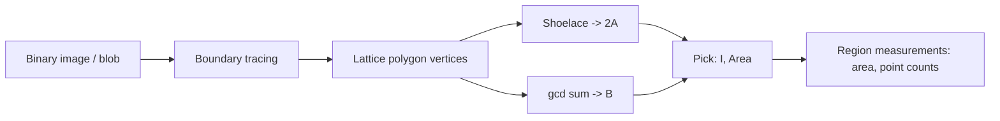
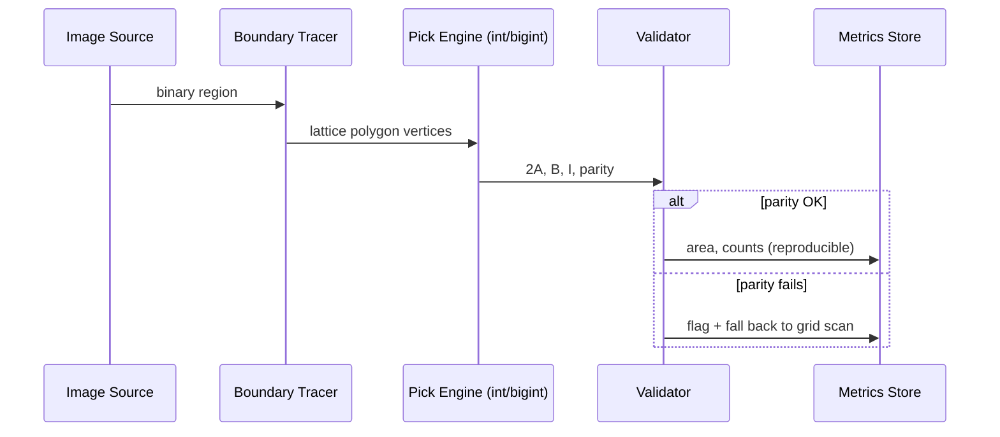

# Pick's Theorem and Lattice-Point Geometry — Senior Level

> Pick's theorem is a one-line identity, but at senior level it is a *measurement engine* for the discrete plane. In digital geometry and image analysis, every pixel is a lattice point, so "how big is this region" and "how many cells does it cover" reduce to `I`, `B`, and `Area = I + B/2 − 1`. The senior questions are about **robustness** (big integers, exact arithmetic, validation), **generalizations** (holes, non-lattice polygons, lattice transforms), and **where this sits inside a real pipeline**.

## Table of Contents

1. [Introduction](#1-introduction)
2. [Digital Geometry and Image Analysis](#2-digital-geometry-and-image-analysis)
3. [Robustness — Big Integers and Exact Arithmetic](#3-robustness--big-integers-and-exact-arithmetic)
4. [Generalizations of Pick's Theorem](#4-generalizations-of-picks-theorem)
5. [Comparison at Scale](#5-comparison-at-scale)
6. [Architecture Patterns](#6-architecture-patterns)
7. [Code Examples — Production Lattice Engine](#7-code-examples--production-lattice-engine)
8. [Observability](#8-observability)
9. [Failure Modes](#9-failure-modes)
10. [The Non-Lattice Fallback — Per-Column Counting](#10-the-non-lattice-fallback--per-column-counting)
11. [Worked Image-Region Example](#11-worked-image-region-example)
12. [Capacity and Decision Guide](#12-capacity-and-decision-guide)
13. [Summary](#13-summary)

---

## 1. Introduction

At senior level the question shifts from "how do I apply the formula" to "where does lattice measurement sit in my system, and what breaks when it does?" Pick's theorem has three properties that drive every design decision:

- **It is exact and integer.** The shoelace `2A` and boundary `B` are integers, so `I = (2A − B + 2)/2` is computed with zero floating-point error — a rare and valuable guarantee in geometry, where most algorithms fight rounding.
- **It is size-independent.** Cost depends on the number of vertices, not the polygon's extent. A region spanning `10^9 × 10^9` lattice units costs the same as a `3 × 3` one.
- **It is fragile to preconditions.** Lattice vertices and simplicity are non-negotiable; holes and 3-D break it. A senior must validate, not assume.

This document covers the five questions a senior owns:

1. How does Pick's theorem power digital-geometry and image-analysis measurements?
2. How do you keep the computation robust at extreme coordinate magnitudes (big integers, overflow)?
3. What are the correct generalizations — holes, non-lattice polygons, lattice transformations?
4. How does Pick compare to alternatives at scale, and when is it the wrong tool?
5. How do you observe, validate, and fail safely in a pipeline that depends on it?

---

## 2. Digital Geometry and Image Analysis

In **digital geometry**, shapes live on a pixel grid — which *is* the integer lattice. A binary region (foreground pixels) is a set of lattice points, and its polygonal outline has lattice vertices by construction. That makes Pick's theorem a natural measurement primitive.

### 2.1 Region area from a traced boundary

A classic image-processing task: you have a binary blob, you trace its boundary (Moore-neighbor tracing, marching squares on the pixel grid), and you get a lattice polygon. Pick's theorem then gives:

- **Continuous area** `A = I + B/2 − 1` — the area of the *polygon* enclosing the pixel centers.
- **Boundary length proxy** via `B` — the number of lattice points on the contour.

This is faster and more numerically stable than summing pixel areas with floating-point, and it ties the discrete pixel count to a continuous area measure.



### 2.2 The pixel-counting subtlety

There are two distinct "areas" for a digital region, and confusing them is a common senior-level bug:

| Measure | Meaning | Relation to Pick |
|---------|---------|------------------|
| **Pixel count** | Number of foreground pixels (lattice points). | `I + B` if pixels are the lattice points enclosed/on the polygon. |
| **Polygon area** | Continuous area enclosed by the contour. | `A = I + B/2 − 1`. |

The difference `(I + B) − A = B/2 + 1` is the "boundary half-pixel" correction. When a downstream metric (e.g. object size in mm²) needs continuous area, you want `A`, not the raw pixel count. When it needs "how many sensor cells fired," you want `I + B`. Pick gives you both from the same trace.

### 2.3 Why integer exactness matters here

Image pipelines run on millions of regions. Floating-point area accumulation drifts and is non-reproducible across hardware. Pick's integer `2A` is **bit-for-bit reproducible**, which matters for regression testing, medical-imaging audits, and any system where "the same input must give the same number forever."

---

## 3. Robustness — Big Integers and Exact Arithmetic

### 3.1 Where overflow bites

The shoelace term `x_i · y_{i+1}` is the danger. With coordinates up to `C`, each product is up to `C²`, and the sum over `n` edges is up to `n·C²`. For `C = 10^9` and `n = 10^5`, that is `10^{23}` — far past 64-bit (`~9.2·10^{18}`).

| Coordinate bound `C` | Vertices `n` | Max `2A` ≈ `n·C²` | Fits int64? |
|----------------------|--------------|-------------------|-------------|
| `10^4` | `10^3` | `10^{11}` | Yes |
| `10^6` | `10^4` | `10^{16}` | Yes |
| `10^9` | `10^5` | `10^{23}` | **No → big integer** |

### 3.2 Strategies

- **Shift to the centroid / first vertex.** Subtract `v[0]` from every vertex before the shoelace sum. This does not change the area but shrinks magnitudes when coordinates are large but the polygon is small.
- **Use 128-bit or big integers** when `n·C²` can overflow 64-bit: Go `math/big`, Java `BigInteger`, Python's native unbounded `int`.
- **Compute incrementally** with the centroid-shifted cross products to keep partial sums small.
- **Validate parity** (`2A − B + 2` even) as a cheap corruption detector that also catches silent overflow (an overflow usually breaks parity).

### 3.3 Robustness, not "precision"

Note the framing: with lattice inputs there is *no precision problem* — everything is exact integer. The robustness work is purely about **magnitude** (overflow) and **validation** (rejecting bad input), never about epsilon comparisons. This is a key advantage over real-coordinate computational geometry, where orientation tests and epsilon tuning dominate.

---

## 4. Generalizations of Pick's Theorem

### 4.1 Polygons with holes

For a polygon with `h` holes:

```
A = I + B/2 − 1 + h
```

`B` counts boundary points on *all* boundaries (outer + holes); `I` counts points strictly inside the material region (not inside a hole). Each hole contributes `+1` because it is its own closed loop. Derivation: the Euler characteristic of a region with `h` holes is `1 − h`, and Pick's `−1` is exactly `−χ` for a disk (`χ = 1`).

### 4.2 Non-lattice polygons — what replaces Pick

When vertices are *not* on the lattice, Pick fails, but you can still count enclosed lattice points by other means:

- **Per-column counting:** for each integer `x` in range, compute the `y`-interval the polygon covers at that column and count integer `y` values. `O(W·n)` — feasible when the width `W` is moderate.
- **Sweep + summation formulas:** for triangles with rational vertices, lattice-point counts have closed forms involving floor sums (related to the **Ehrhart** theory below).
- These are the right tools when the "lattice vertices" precondition is violated; do not force Pick.

### 4.3 Lattice transformations preserve relative counts

A **unimodular** transformation (an integer matrix with determinant `±1`) maps the lattice to itself bijectively. So if you apply such a transform to a lattice polygon, `I`, `B`, and `A` are all **invariant**. This is the reason you can rotate/shear lattice problems into a convenient orientation (e.g. make one edge axis-aligned) without changing the answer — a frequent senior-level simplification. A non-unimodular integer matrix scales area by `|det|` and rescales counts accordingly.

### 4.4 Ehrhart polynomials (preview)

If you scale a lattice polygon by an integer factor `t`, the number of lattice points inside the scaled copy is a **polynomial in `t`** — the Ehrhart polynomial `L(t)`. For a 2-D lattice polygon:

```
L(t) = A·t² + (B/2)·t + 1
```

Notice the coefficients: leading term is the area, linear term is half the boundary, constant term is `1` (the Euler characteristic). **Pick's theorem is exactly `L(1) − (boundary contribution)` unpacked** — `L(1) = A + B/2 + 1 = I + B`, the total lattice points. Ehrhart theory is the higher-dimensional, scalable generalization of Pick; we cover its statement in `professional.md`.

---

## 5. Comparison at Scale

| Approach | Time | Exact? | Handles big size | Handles non-lattice | Production fit |
|----------|------|--------|------------------|---------------------|----------------|
| Pick (shoelace + gcd) | `O(n log C)` | Yes (int) | Yes | No | Lattice measurement, image regions |
| Grid scan | `O(W·H)` | Yes | No (blows up) | Yes | Tiny shapes, verification only |
| Per-column lattice count | `O(W·n)` | Yes | Width-bound | Yes | Non-lattice, moderate width |
| Ehrhart polynomial | `O(n)` per `t` after setup | Yes | Yes | Rational | Scaled-copy counting |
| Monte-Carlo area | `O(samples)` | Approx | Yes | Yes | Rough estimates only |

The relationships to remember: **Pick ⊂ Ehrhart** (Pick is the `t=1` slice of the Ehrhart polynomial), and **grid scan** is the brute-force ground truth you validate Pick against on small inputs.

---

## 6. Architecture Patterns



The pattern: a fast exact Pick path for the common case, a **validator** (parity + simplicity), and a **fallback** (grid scan or per-column count) for inputs that violate preconditions. The fallback is slower but always correct, so the system degrades gracefully instead of returning silent garbage.

---

## 7. Code Examples — Production Lattice Engine

A robust engine that auto-escalates to big integers and validates output.

#### Go

```go
package main

import (
	"fmt"
	"math/big"
)

func gcdInt(a, b int64) int64 {
	for b != 0 {
		a, b = b, a%b
	}
	if a < 0 {
		a = -a
	}
	return a
}

// PickBig computes 2A, B, I using big.Int for overflow safety, after
// shifting all vertices by the first vertex to shrink magnitudes.
func PickBig(pts [][2]int64) (twoA, B, I *big.Int, ok bool) {
	n := len(pts)
	ox, oy := pts[0][0], pts[0][1]
	area2 := new(big.Int)
	boundary := int64(0)
	t := new(big.Int)
	for i := 0; i < n; i++ {
		j := (i + 1) % n
		x1, y1 := pts[i][0]-ox, pts[i][1]-oy
		x2, y2 := pts[j][0]-ox, pts[j][1]-oy
		// area2 += x1*y2 - x2*y1
		t.Mul(big.NewInt(x1), big.NewInt(y2))
		area2.Add(area2, t)
		t.Mul(big.NewInt(x2), big.NewInt(y1))
		area2.Sub(area2, t)
		dx := pts[j][0] - pts[i][0]
		dy := pts[j][1] - pts[i][1]
		if dx < 0 {
			dx = -dx
		}
		if dy < 0 {
			dy = -dy
		}
		boundary += gcdInt(dx, dy)
	}
	area2.Abs(area2)
	B = big.NewInt(boundary)
	// I = (2A - B + 2) / 2
	num := new(big.Int).Sub(area2, B)
	num.Add(num, big.NewInt(2))
	if num.Bit(0) != 0 { // odd -> invalid
		return area2, B, nil, false
	}
	I = new(big.Int).Rsh(num, 1)
	return area2, B, I, true
}

func main() {
	pts := [][2]int64{{0, 0}, {1_000_000_000, 0}, {0, 1_000_000_000}}
	twoA, B, I, ok := PickBig(pts)
	fmt.Println("2A =", twoA, "B =", B, "I =", I, "ok =", ok)
}
```

#### Java

```java
import java.math.BigInteger;

public class PickEngine {
    static long gcd(long a, long b) {
        while (b != 0) { long t = a % b; a = b; b = t; }
        return Math.abs(a);
    }

    // Returns {2A, B, I} as BigIntegers; null I if parity fails.
    static BigInteger[] pick(long[][] pts) {
        int n = pts.length;
        long ox = pts[0][0], oy = pts[0][1];
        BigInteger area2 = BigInteger.ZERO;
        long boundary = 0;
        for (int i = 0; i < n; i++) {
            int j = (i + 1) % n;
            BigInteger x1 = BigInteger.valueOf(pts[i][0] - ox);
            BigInteger y1 = BigInteger.valueOf(pts[i][1] - oy);
            BigInteger x2 = BigInteger.valueOf(pts[j][0] - ox);
            BigInteger y2 = BigInteger.valueOf(pts[j][1] - oy);
            area2 = area2.add(x1.multiply(y2)).subtract(x2.multiply(y1));
            boundary += gcd(Math.abs(pts[j][0] - pts[i][0]),
                            Math.abs(pts[j][1] - pts[i][1]));
        }
        area2 = area2.abs();
        BigInteger B = BigInteger.valueOf(boundary);
        BigInteger num = area2.subtract(B).add(BigInteger.TWO);
        if (num.testBit(0)) return new BigInteger[]{area2, B, null};
        return new BigInteger[]{area2, B, num.shiftRight(1)};
    }

    public static void main(String[] args) {
        long[][] pts = {{0, 0}, {1_000_000_000L, 0}, {0, 1_000_000_000L}};
        BigInteger[] r = pick(pts);
        System.out.println("2A=" + r[0] + " B=" + r[1] + " I=" + r[2]);
    }
}
```

#### Python

```python
from math import gcd


def pick(pts):
    """Exact, overflow-proof (Python ints are unbounded). Returns (2A, B, I) or I=None."""
    n = len(pts)
    ox, oy = pts[0]
    area2 = 0
    boundary = 0
    for i in range(n):
        x1, y1 = pts[i][0] - ox, pts[i][1] - oy
        x2, y2 = pts[(i + 1) % n][0] - ox, pts[(i + 1) % n][1] - oy
        area2 += x1 * y2 - x2 * y1
        dx = pts[(i + 1) % n][0] - pts[i][0]
        dy = pts[(i + 1) % n][1] - pts[i][1]
        boundary += gcd(abs(dx), abs(dy))
    area2 = abs(area2)
    num = area2 - boundary + 2
    if num % 2 != 0:
        return area2, boundary, None  # invalid lattice polygon
    return area2, boundary, num // 2


if __name__ == "__main__":
    pts = [(0, 0), (10**9, 0), (0, 10**9)]
    print(pick(pts))  # exact even at 10^9 scale
```

**What it does:** computes `2A`, `B`, `I` with overflow-safe big integers, vertex-shifting to keep magnitudes small, and a parity gate that flags invalid input.
**Run:** `go run main.go` | `javac PickEngine.java && java PickEngine` | `python pick.py`

---

## 8. Observability

| Metric | Why it matters | Alert when |
|--------|----------------|-----------|
| `parity_fail_rate` | Fraction of polygons where `2A − B + 2` is odd. | `> 0` → upstream producing non-lattice/non-simple polygons. |
| `bigint_escalation_rate` | How often int64 was exceeded. | Spikes → coordinate magnitudes growing unexpectedly. |
| `fallback_grid_scan_rate` | How often the slow path runs. | High → too many invalid inputs; fix the tracer. |
| `area_reproducibility_check` | Re-run sampled inputs, compare bit-for-bit. | Any mismatch → a non-integer path crept in. |
| `vertex_count_p99` | Polygon complexity. | High → consider simplification before measuring. |

---

## 9. Failure Modes

- **Silent non-lattice input** — a producer emits a vertex at `(1.5, 2)` rounded inconsistently; Pick returns a fractional/odd result. *Mitigation:* parity gate + reject.
- **Self-intersection from a buggy tracer** — boundary tracing crosses itself; shoelace area is meaningless. *Mitigation:* simplicity check, fall back to grid scan.
- **Overflow at extreme scale** — 64-bit shoelace wraps to a wrong (often negative) value that may *still* pass parity by luck. *Mitigation:* escalate to big integers when `n·C²` risks overflow; never rely on parity alone.
- **Hole miscount** — applying hole-free Pick to a region with holes undercounts by `h`. *Mitigation:* detect holes and add `+h`.
- **3-D misuse** — someone tries to extend the formula to a polyhedron's lattice points; it is provably impossible (Reeve tetrahedron). *Mitigation:* hard-stop at 2-D; use Ehrhart/Barvinok for higher dimensions.
- **Confusing pixel count with area** — reporting `I + B` where continuous `A` was needed (or vice versa). *Mitigation:* expose both, document which downstream consumers want which.

---

## 10. The Non-Lattice Fallback — Per-Column Counting

When the "lattice vertices" precondition is violated — the polygon has real-valued or rational corners — Pick cannot run, but you still often need the count of lattice points enclosed. The robust fallback is **per-column counting**: for each integer `x` in the polygon's horizontal range, find the vertical interval(s) the polygon covers at that column and count the integer `y` values inside.

The algorithm sweeps a vertical line `x = c` across the polygon. At each integer column it intersects the polygon's edges, collects the `y`-coordinates of the crossings, sorts them, and pairs them up into "inside" intervals; the integer points in those intervals are counted with floor/ceil.

#### Go

```go
package main

import (
	"fmt"
	"math"
	"sort"
)

// countLatticePoints counts integer points strictly inside a polygon whose
// vertices may be NON-lattice (float). O(W * n log n), W = x-range width.
func countLatticePoints(xs, ys []float64) int {
	n := len(xs)
	minX, maxX := math.Inf(1), math.Inf(-1)
	for _, x := range xs {
		minX = math.Min(minX, x)
		maxX = math.Max(maxX, x)
	}
	count := 0
	for c := int(math.Ceil(minX)); float64(c) <= maxX; c++ {
		var crossings []float64
		for i := 0; i < n; i++ {
			j := (i + 1) % n
			x1, y1, x2, y2 := xs[i], ys[i], xs[j], ys[j]
			if (x1 <= float64(c)) != (x2 <= float64(c)) {
				// edge straddles the column; interpolate y
				t := (float64(c) - x1) / (x2 - x1)
				crossings = append(crossings, y1+t*(y2-y1))
			}
		}
		sort.Float64s(crossings)
		for k := 0; k+1 < len(crossings); k += 2 {
			lo := int(math.Ceil(crossings[k]))
			hi := int(math.Floor(crossings[k+1]))
			if hi >= lo {
				count += hi - lo + 1
			}
		}
	}
	return count
}

func main() {
	// A triangle with a non-lattice vertex.
	xs := []float64{0, 4.5, 0}
	ys := []float64{0, 0, 3.5}
	fmt.Println("lattice points inside:", countLatticePoints(xs, ys))
}
```

#### Java

```java
import java.util.*;

public class PerColumn {
    static int countLatticePoints(double[] xs, double[] ys) {
        int n = xs.length;
        double minX = Double.POSITIVE_INFINITY, maxX = Double.NEGATIVE_INFINITY;
        for (double x : xs) { minX = Math.min(minX, x); maxX = Math.max(maxX, x); }
        int count = 0;
        for (int c = (int) Math.ceil(minX); c <= maxX; c++) {
            List<Double> cr = new ArrayList<>();
            for (int i = 0; i < n; i++) {
                int j = (i + 1) % n;
                double x1 = xs[i], y1 = ys[i], x2 = xs[j], y2 = ys[j];
                if ((x1 <= c) != (x2 <= c)) {
                    double t = (c - x1) / (x2 - x1);
                    cr.add(y1 + t * (y2 - y1));
                }
            }
            Collections.sort(cr);
            for (int k = 0; k + 1 < cr.size(); k += 2) {
                int lo = (int) Math.ceil(cr.get(k));
                int hi = (int) Math.floor(cr.get(k + 1));
                if (hi >= lo) count += hi - lo + 1;
            }
        }
        return count;
    }

    public static void main(String[] args) {
        System.out.println(countLatticePoints(
                new double[]{0, 4.5, 0}, new double[]{0, 0, 3.5}));
    }
}
```

#### Python

```python
import math


def count_lattice_points(pts):
    """Count integer points inside a polygon with possibly non-lattice vertices."""
    n = len(pts)
    min_x = min(p[0] for p in pts)
    max_x = max(p[0] for p in pts)
    count = 0
    c = math.ceil(min_x)
    while c <= max_x:
        crossings = []
        for i in range(n):
            x1, y1 = pts[i]
            x2, y2 = pts[(i + 1) % n]
            if (x1 <= c) != (x2 <= c):
                t = (c - x1) / (x2 - x1)
                crossings.append(y1 + t * (y2 - y1))
        crossings.sort()
        for k in range(0, len(crossings) - 1, 2):
            lo = math.ceil(crossings[k])
            hi = math.floor(crossings[k + 1])
            if hi >= lo:
                count += hi - lo + 1
        c += 1
    return count


if __name__ == "__main__":
    print(count_lattice_points([(0, 0), (4.5, 0), (0, 3.5)]))
```

This is the principled escalation path: try Pick (fast, exact, lattice-only); if the input is non-lattice, fall back to per-column counting (slower, width-bound, but correct for arbitrary real vertices). It is `O(W · n log n)` where `W` is the x-extent — fine for moderate widths, but unlike Pick it *does* depend on polygon size, so it is a fallback, not the default.

---

## 11. Worked Image-Region Example

Consider a small binary blob whose traced contour is the lattice polygon `(2,2), (8,2), (8,6), (5,6), (5,4), (2,4)` — an L-shaped region.

```text
6  . . . X X X . .
5  . . . X X X . .
4  X X X X X X X .
3  X X X X X X X .
2  X X X X X X X .
   2 3 4 5 6 7 8
```

**Shoelace.** Walking the six vertices:

```text
2A = |(2·2 − 8·2) + (8·6 − 8·2) + (8·6 − 5·6)
      + (5·4 − 5·6) + (5·4 − 2·4) + (2·2 − 2·4)|
   = |(4−16) + (48−16) + (48−30) + (20−30) + (20−8) + (4−8)|
   = |−12 + 32 + 18 − 10 + 12 − 4| = 36,   A = 18.
```

**Boundary.** Sum of edge gcds:

```text
(2,2)→(8,2): gcd(6,0)=6   (8,2)→(8,6): gcd(0,4)=4
(8,6)→(5,6): gcd(3,0)=3   (5,6)→(5,4): gcd(0,2)=2
(5,4)→(2,4): gcd(3,0)=3   (2,4)→(2,2): gcd(0,2)=2
B = 6+4+3+2+3+2 = 20.
```

**Interior via Pick.** `I = A − B/2 + 1 = 18 − 10 + 1 = 9`.

**The two region measures.**

| Measure | Value | Use |
|---------|-------|-----|
| Continuous area `A` | `18` | physical region size (mm² after scaling) |
| Pixel count `I + B` | `9 + 20 = 29` | number of grid cells covered by contour |
| Difference `B/2 + 1` | `11` | boundary half-pixel + closure correction |

If a downstream "object size" metric expects continuous area, it must use `A = 18`; if it expects "how many sensor cells fired," it must use `I + B = 29`. Reporting the wrong one is the single most common image-analysis bug this topic prevents. Both come from the *same* contour trace in one `O(n)` pass — no per-pixel scan.

---

## 12. Capacity and Decision Guide

A senior choosing how to measure lattice regions weighs four axes: are vertices integer, how large are coordinates, how many polygons per second, and is reproducibility required?

| Situation | Choice | Why |
|-----------|--------|-----|
| Integer vertices, any size, high QPS | **Pick (int)** | `O(n)`, exact, size-independent |
| Integer vertices, coords > `~10^9` with many vertices | **Pick (big integer)** | overflow safety; shift by `v₀` first |
| Non-lattice vertices, moderate width | **Per-column counting** | correct for real coords, width-bound |
| Need the *set* of points, tiny shape | **Grid scan** | only brute force enumerates points |
| Region with holes | **Pick + `+h`** | hole-corrected formula |
| Scaled-copy counts | **Ehrhart polynomial** | `L(t) = A t² + (B/2) t + 1` |
| 3-D volume from lattice points | **Ehrhart / Barvinok** | Pick impossible (Reeve) |

**Throughput note.** A Pick computation on a typical `n ≤ 1000`-vertex contour is microseconds, so a single core handles hundreds of thousands of regions per second. The bottleneck in an image pipeline is almost always the *boundary tracing*, not Pick. Budget accordingly: optimize tracing and the validator, not the formula.

**Memory note.** Pick is `O(1)` working memory beyond the vertex list — no per-pixel buffer. This is a decisive advantage over grid scanning for large regions, which needs `O(W·H)` and is what makes Pick viable at billion-coordinate scale.

---

## 13. Summary

At senior level, Pick's theorem is a **reproducible, exact, size-independent measurement engine** for the integer lattice — ideal for digital geometry and image-analysis region metrics, where pixels *are* lattice points. Its only robustness concerns are magnitude (escalate to big integers when `n·C²` overflows 64-bit; shift vertices to shrink coordinates) and validation (parity-check `2A − B + 2`, verify simplicity, fall back to grid scan or per-column counting for invalid input). The principled generalizations are: `+h` for holes, unimodular invariance for rotating problems into convenient orientations, and **Ehrhart polynomials** `L(t) = A·t² + (B/2)·t + 1` as the scalable, higher-dimensional successor. And the hard boundary every senior must respect: Pick is 2-D only — the Reeve tetrahedron proves no analogous count-to-volume formula exists in 3-D.

---

**Next step:** [Pick's Theorem — Professional Level](./professional.md)
