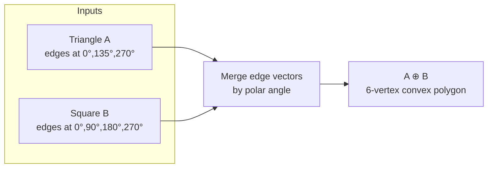
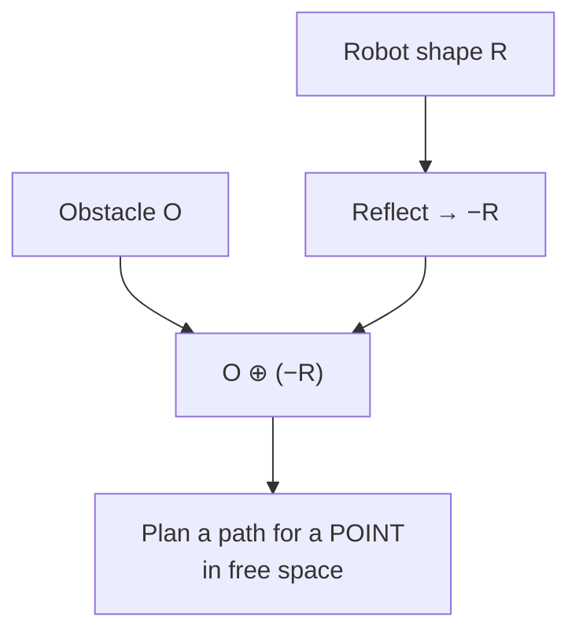

# Minkowski Sum of Convex Polygons — Junior Level

> **One-line summary:** The Minkowski sum of two shapes `A` and `B` is the set of *all* pairwise sums `a + b` — geometrically, sweep one shape over the other and keep every point either of them ever touches. For two **convex** polygons it is again a convex polygon, and you can build it in **`O(n + m)`** by taking the edge vectors of both polygons and chaining them in order of angle.

---

## Table of Contents

1. [Introduction](#introduction)
2. [Prerequisites](#prerequisites)
3. [Glossary](#glossary)
4. [Geometry Primitives](#geometry-primitives)
5. [Core Concepts](#core-concepts)
6. [Big-O Summary](#big-o-summary)
7. [Real-World Analogies](#real-world-analogies)
8. [Pros & Cons](#pros--cons)
9. [Step-by-Step Walkthrough](#step-by-step-walkthrough)
10. [Code Examples](#code-examples)
11. [Coding Patterns](#coding-patterns)
12. [Error Handling](#error-handling)
13. [Performance Tips](#performance-tips)
14. [Best Practices](#best-practices)
15. [Edge Cases & Pitfalls](#edge-cases--pitfalls)
16. [Common Mistakes](#common-mistakes)
17. [Cheat Sheet](#cheat-sheet)
18. [Visual Animation](#visual-animation)
19. [Summary](#summary)
20. [Further Reading](#further-reading)

---

## Introduction

Imagine you have a small coin and a flat metal plate with some shape cut out of it. Now glue the center of the coin to a pencil and drag the pencil along the *entire* plate — every point inside and on its border. The region swept out by the *whole coin* (not just its center) is bigger than the plate: it bulges outward by the radius of the coin in every direction. That swept region is the **Minkowski sum** of the plate and the coin.

Formally, given two sets of points `A` and `B` in the plane, their **Minkowski sum** is

```
A ⊕ B = { a + b : a ∈ A, b ∈ B }
```

where `a + b` is ordinary vector addition: `(a.x + b.x, a.y + b.y)`. You take every point of `A`, add to it every point of `B`, and collect all the results. The symbol `⊕` (a plus inside a circle) is the standard notation, sometimes written just `+`.

That definition looks like it would produce an enormous, messy cloud of points. The beautiful fact — and the reason this topic exists — is:

> **If `A` and `B` are both convex polygons, then `A ⊕ B` is again a convex polygon, and its boundary is built simply by merging the edge vectors of `A` and `B` in angular order.**

So instead of forming all `n × m` pairwise sums and taking a convex hull (slow), you walk around the two polygons once each and **interleave their edges by angle**, giving an `O(n + m)` algorithm. This is the workhorse you will learn here.

Why care? The Minkowski sum is the mathematical engine behind:

- **Robot motion planning** — "inflate" obstacles by the shape of the robot so the robot shrinks to a single point that must avoid the inflated obstacles (the *configuration space* trick).
- **Collision detection** — the GJK algorithm tests whether the *Minkowski difference* of two shapes contains the origin.
- **CAD / CAM offsetting** — growing or shrinking a part by a tool radius.
- **Games** — fattening level geometry so a character of nonzero size can be treated as a point.

A mental anchor for the whole topic:

> **Minkowski sum = "place a copy of `B` at every point of `A`" (or vice versa) and take the union.** For convex polygons that union has a boundary made of `A`'s edges and `B`'s edges, sorted by direction.

---

## Prerequisites

Before reading this file you should be comfortable with:

- **Points and vectors** — a point is a pair `(x, y)`; a vector is the difference of two points. Adding vectors adds components.
- **Convex polygons** — a polygon with no inward dents; given as a list of vertices in counter-clockwise (CCW) order. (See sibling topic *01-convex-hull*.)
- **The cross product / orientation test** — `cross(O, A, B)` tells you whether `O→A→B` turns left, right, or goes straight. We use it to find a starting vertex and to sort by angle. (See *01-convex-hull*, "Geometry Primitives".)
- **Sorting and merging** — the construction is essentially the *merge* step of merge sort applied to two angle-sorted edge lists.
- **Big-O notation** — `O(n)`, `O(n + m)`, `O((n + m) log(n + m))`, `O(n²m²)`.

Optional but helpful:

- A feel for **polar angle** (the direction a vector points, measured as an angle from the positive x-axis).
- The sibling topic *06-rotating-calipers*, which also walks two convex chains in lockstep.

---

## Glossary

| Term | Meaning |
|------|---------|
| **Minkowski sum `A ⊕ B`** | The set `{ a + b : a ∈ A, b ∈ B }`. |
| **Minkowski difference `A ⊖ B`** | Erosion: `{ c : c + B ⊆ A }`. Closely related but **not** the same as `A ⊕ (−B)`. |
| **Reflection `−B`** | `B` flipped through the origin: `{ −b : b ∈ B }`. Used by GJK. |
| **Edge vector** | For a polygon edge from vertex `Pᵢ` to `Pᵢ₊₁`, the vector `Pᵢ₊₁ − Pᵢ`. |
| **Polar angle** | The direction a vector points, an angle in `[0, 2π)` from the +x axis. |
| **CCW order** | Vertices listed counter-clockwise; the standard convention here. |
| **Bottom-most vertex** | The starting vertex: lowest `y`, breaking ties by lowest `x`. Its outgoing edge has the smallest polar angle. |
| **Convex** | No inward dents; every interior angle ≤ 180°. |
| **Configuration space (C-space)** | The space of all robot positions; obstacles are inflated by the robot shape so the robot becomes a point. |
| **Offsetting** | Growing (positive offset) or shrinking (negative offset) a shape — a Minkowski sum/difference with a disk. |
| **GJK** | Gilbert–Johnson–Keerthi: a collision test that asks whether the Minkowski difference contains the origin. |

---

## Geometry Primitives

Everything here rests on two tiny operations on 2-D points. Get these right once and reuse them.

A point/vector is just `(x, y)`. The two primitives:

```text
add(a, b)   = (a.x + b.x, a.y + b.y)     # vector addition — the heart of the sum
sub(a, b)   = (a.x - b.x, a.y - b.y)     # vector from b to a (an edge vector)
cross(a, b) = a.x*b.y - a.y*b.x          # signed area of the parallelogram a,b
```

The **cross product** `cross(u, v)` is the single most important sign in 2-D geometry:

- `cross(u, v) > 0` → `v` is **counter-clockwise** from `u` (a left turn).
- `cross(u, v) < 0` → `v` is **clockwise** from `u` (a right turn).
- `cross(u, v) = 0` → `u` and `v` are **parallel** (collinear directions).

We use the cross product to compare the *angles* of two edge vectors without ever computing an actual angle (`atan2`) — comparing by cross product is exact for integer coordinates and avoids floating-point trig. When we say "the edge with the smaller polar angle," we decide it with a cross-product comparison.

```text
# "Does edge u come before edge v in CCW angular order (starting from +x)?"
# half(w) = 0 if w points into the upper half-plane (or +x), else 1
# compare halves first, then break ties with cross product
```

For convex polygons given in CCW order and started at the bottom-most vertex, the edge vectors **already come out in increasing polar angle** as you walk the boundary. That single fact is what makes the merge so cheap — no sorting needed if the inputs are well-formed.

---

## Core Concepts

### 1. The sum is "B stamped at every point of A"

The cleanest way to picture `A ⊕ B`: take shape `B`, and stamp a translated copy of it centered at *every* point `a` of `A`. The union of all those stamps is `A ⊕ B`. Equivalently, slide `B` around so its reference point traces all of `A`; the total region covered is the sum. Because the operation is symmetric (`A ⊕ B = B ⊕ A`), you may stamp `A` over `B` instead — same result.

### 2. For convex polygons, only the edges matter

Here is the key structural insight. Walk around convex polygon `A` and list its **edge vectors** `a₀, a₁, …` in CCW order; do the same for `B` to get `b₀, b₁, …`. The boundary of `A ⊕ B` is made of *exactly these edges*, all of them, reordered by angle. No new edge directions appear, and none disappear. The sum's boundary is the two edge lists **merged by polar angle**, chained tip-to-tail.

Intuition: an edge of `A ⊕ B` points in some direction `d`. The vertex of the sum "furthest in direction `d`" is `(vertex of A furthest in d) + (vertex of B furthest in d)`. As `d` rotates, the supporting vertex of `A` changes exactly when you cross one of `A`'s edges, and the supporting vertex of `B` changes when you cross one of `B`'s edges. So the sum's edges are `A`'s edges and `B`'s edges, in the order their directions occur.

### 3. The `O(n + m)` edge-merge algorithm

Concretely:

1. Reorder each polygon so it **starts at its bottom-most vertex** (lowest `y`, then lowest `x`) and is in CCW order. Now each polygon's edge vectors are in increasing polar angle.
2. The **first vertex** of the sum is `A[0] + B[0]` (bottom-most of `A` plus bottom-most of `B` — itself the bottom-most vertex of the sum).
3. **Merge** the two edge lists like merge sort: at each step append whichever next edge has the smaller polar angle (cross-product comparison); on a tie, append both (their sum direction). Each appended edge extends the current boundary vertex tip-to-tail.
4. Stop when both edge lists are exhausted. The accumulated vertices are the convex polygon `A ⊕ B`.

That is it: two pointers walking two edge lists, `O(n + m)` total.

### 4. Minkowski difference (erosion) and reflection

The **Minkowski difference** `A ⊖ B = { c : c + B ⊆ A }` *shrinks* `A` by `B` — useful for "where can the center of `B` go while `B` stays inside `A`?" It is **not** simply `A ⊕ (−B)`; that confusion is a classic trap. However, the *reflection* `−B` (flip `B` through the origin) is what collision detection uses: two convex shapes overlap **iff** the origin lies inside `A ⊕ (−B)`. That `A ⊕ (−B)` set is often (loosely) called "the Minkowski difference" in collision-detection literature, including GJK. Keep the two meanings separate; we will be careful.

### 5. The motion-planning payoff (configuration space)

Suppose a robot shaped like polygon `R` must move among obstacles. Treat the robot as a single reference point. Then the robot collides with obstacle `O` exactly when the reference point enters the *inflated* obstacle `O ⊕ (−R)`. Inflate every obstacle this way once, and path planning becomes "move a **point** through free space" — far simpler. This is the **configuration-space** (C-space) transformation, and the Minkowski sum is how you build it.

---

## Big-O Summary

| Operation | Complexity | Notes |
|-----------|-----------|-------|
| Sum of two **convex** polygons (`n`, `m` vertices) | **O(n + m)** | Edge merge; inputs already CCW from bottom vertex. |
| Sum if inputs not pre-sorted by angle | **O(n log n + m log m)** | One sort each, then merge. |
| Add a single point to a polygon (`A ⊕ {p}`) | **O(n)** | Pure translation — shift every vertex by `p`. |
| Naive all-pairs + convex hull | **O(nm log(nm))** | Form `nm` points, hull them. Avoid this. |
| Sum of two **non-convex** polygons | **O(n²m²)** | Decompose into convex pieces, sum pairwise, union. |
| Point-in-sum test (e.g. GJK origin test) | **O(n + m)** | Without ever materializing the sum. |

> `n`, `m` = vertex counts of `A`, `B`. The sum of two convex polygons has at most `n + m` vertices, which is why the merge is linear.

---

## Real-World Analogies

| Concept | Analogy |
|---------|---------|
| `A ⊕ B` | Stamping a cookie cutter (`B`) at every point of a region (`A`) and unioning the cookies. |
| Inflating an obstacle by the robot | A Roomba near a wall: the *center* of the Roomba can't get within one radius of the wall, so the "no-go" wall is fattened by the Roomba's radius. |
| Edge-merge by angle | Zipping two zippers whose teeth are sorted by angle into one combined zipper. |
| Reflection `−B` | Flipping a stencil over before stamping. |
| Minkowski difference (erosion) | Shaving a layer off the inside of a shape — how far in can a ball roll? |
| Sum is convex | Two smooth bulges add up to a smooth bulge; no dent appears from adding two dentless shapes. |

Where the analogies break: the cookie-cutter picture suggests overlap matters, but the *union* automatically dissolves overlaps; and the Roomba's true inflated region uses a *disk*, giving rounded corners that a polygon approximates with many edges.

---

## Pros & Cons

| Pros | Cons |
|------|------|
| `O(n + m)` for convex polygons — optimal and simple. | Linear-time merge only works for **convex** inputs. |
| Output is convex, so downstream tests (point-in-polygon, GJK) stay easy. | Non-convex inputs blow up to `O(n²m²)` after decomposition. |
| Turns motion planning into "move a point" — huge conceptual simplification. | True circular offset needs infinitely many edges; polygons only approximate it. |
| Same idea powers collision detection (GJK) and CAD offsetting. | Floating-point angle comparisons need care; prefer exact cross products. |
| Symmetric and associative — easy to reason about and compose. | Minkowski *difference* (erosion) is subtler than the sum; easy to confuse with `A ⊕ (−B)`. |

**When to use:** inflating obstacles for robot/character motion, collision detection between convex shapes, offsetting convex parts in CAD, computing reachable regions.

**When NOT to use:** when shapes are wildly non-convex with many pieces (decomposition cost dominates — consider grid/sampling methods), or when an exact rounded offset is required (use arcs, not polygons).

---

## Step-by-Step Walkthrough

Let `A` be a triangle and `B` be a square, both CCW.

```
A (triangle):  P0=(0,0)  P1=(2,0)  P2=(0,2)
B (square):    Q0=(0,0)  Q1=(1,0)  Q2=(1,1)  Q3=(0,1)
```

**Step 1 — start each at its bottom-most vertex.** Both already start at `(0,0)` (lowest `y`, then lowest `x`). Good.

**Step 2 — list edge vectors in CCW order.**

```
A edges:  a0 = P1-P0 = ( 2, 0)   angle 0°
          a1 = P2-P1 = (-2, 2)   angle 135°
          a2 = P0-P2 = ( 0,-2)   angle 270°
B edges:  b0 = Q1-Q0 = ( 1, 0)   angle 0°
          b1 = Q2-Q1 = ( 0, 1)   angle 90°
          b2 = Q3-Q2 = (-1, 0)   angle 180°
          b3 = Q0-Q3 = ( 0,-1)   angle 270°
```

**Step 3 — first vertex of the sum** = `A[0] + B[0]` = `(0,0)+(0,0)` = `(0,0)`.

**Step 4 — merge edges by increasing angle**, chaining tip-to-tail from `(0,0)`:

```
angle  0°:   a0=(2,0) and b0=(1,0) tie → take both:  (0,0) →(2,0)→ (3,0)
angle 90°:   b1=(0,1):                                (3,0) → (3,1)
angle135°:   a1=(-2,2):                               (3,1) → (1,3)
angle180°:   b2=(-1,0):                               (1,3) → (0,3)
angle270°:   a2=(0,-2) and b3=(0,-1) tie → both:      (0,3) →(0,1)→ (0,0)
```

The accumulated boundary (dropping the final return to start) is:

```
A ⊕ B = (0,0), (3,0), (3,1), (1,3), (0,3), (0,1)
```

A 6-vertex convex polygon — exactly `3 + 4 − 1` distinct edge directions because two pairs of edges were collinear and merged. Notice every edge of `A ⊕ B` is parallel to an edge of `A` or of `B`. That is the whole algorithm: **interleave the edges by angle.**



---

## Code Examples

### Example: Minkowski sum of two convex polygons in `O(n + m)`

The helper `reorder` rotates a CCW polygon so it starts at the bottom-most vertex; then we merge edge vectors by polar angle using a cross-product comparison.

#### Go

```go
package main

import "fmt"

type Pt struct{ X, Y int64 }

func add(a, b Pt) Pt   { return Pt{a.X + b.X, a.Y + b.Y} }
func sub(a, b Pt) Pt   { return Pt{a.X - b.X, a.Y - b.Y} }
func cross(a, b Pt) int64 { return a.X*b.Y - a.Y*b.X }

// reorder rotates a CCW polygon to start at its bottom-most (then left-most) vertex.
func reorder(p []Pt) []Pt {
	k := 0
	for i := 1; i < len(p); i++ {
		if p[i].Y < p[k].Y || (p[i].Y == p[k].Y && p[i].X < p[k].X) {
			k = i
		}
	}
	out := make([]Pt, 0, len(p))
	for i := 0; i < len(p); i++ {
		out = append(out, p[(k+i)%len(p)])
	}
	return out
}

// half returns 0 for the lower half-plane sort key trick: edges of a CCW polygon
// started at the bottom vertex are already in increasing polar angle, so we only
// need the cross product to break ties.
func minkowski(a, b []Pt) []Pt {
	a = reorder(a)
	b = reorder(b)
	// Repeat first edge so the wrap-around edge is included.
	a = append(a, a[0], a[1])
	b = append(b, b[0], b[1])

	var res []Pt
	i, j := 0, 0
	for i < len(a)-2 || j < len(b)-2 {
		res = append(res, add(a[i], b[j]))
		c := cross(sub(a[i+1], a[i]), sub(b[j+1], b[j]))
		if c > 0 { // edge of A turns first (smaller angle)
			i++
		} else if c < 0 {
			j++
		} else { // collinear edges — advance both
			i++
			j++
		}
	}
	return res
}

func main() {
	a := []Pt{{0, 0}, {2, 0}, {0, 2}}
	b := []Pt{{0, 0}, {1, 0}, {1, 1}, {0, 1}}
	fmt.Println(minkowski(a, b))
	// [{0 0} {2 0} {3 0} {3 1} {1 3} {0 3} {0 1}]  (collinear vertices may appear)
}
```

#### Java

```java
import java.util.*;

public class Minkowski {
    record Pt(long x, long y) {}

    static Pt add(Pt a, Pt b) { return new Pt(a.x + b.x, a.y + b.y); }
    static Pt sub(Pt a, Pt b) { return new Pt(a.x - b.x, a.y - b.y); }
    static long cross(Pt a, Pt b) { return a.x * b.y - a.y * b.x; }

    static List<Pt> reorder(List<Pt> p) {
        int k = 0;
        for (int i = 1; i < p.size(); i++) {
            Pt a = p.get(i), b = p.get(k);
            if (a.y() < b.y() || (a.y() == b.y() && a.x() < b.x())) k = i;
        }
        List<Pt> out = new ArrayList<>();
        for (int i = 0; i < p.size(); i++) out.add(p.get((k + i) % p.size()));
        return out;
    }

    static List<Pt> minkowski(List<Pt> a, List<Pt> b) {
        a = reorder(a);
        b = reorder(b);
        a = new ArrayList<>(a); a.add(a.get(0)); a.add(a.get(1));
        b = new ArrayList<>(b); b.add(b.get(0)); b.add(b.get(1));

        List<Pt> res = new ArrayList<>();
        int i = 0, j = 0;
        while (i < a.size() - 2 || j < b.size() - 2) {
            res.add(add(a.get(i), b.get(j)));
            long c = cross(sub(a.get(i + 1), a.get(i)), sub(b.get(j + 1), b.get(j)));
            if (c > 0) i++;
            else if (c < 0) j++;
            else { i++; j++; }
        }
        return res;
    }

    public static void main(String[] args) {
        List<Pt> a = List.of(new Pt(0,0), new Pt(2,0), new Pt(0,2));
        List<Pt> b = List.of(new Pt(0,0), new Pt(1,0), new Pt(1,1), new Pt(0,1));
        System.out.println(minkowski(a, b));
    }
}
```

#### Python

```python
def add(a, b): return (a[0] + b[0], a[1] + b[1])
def sub(a, b): return (a[0] - b[0], a[1] - b[1])
def cross(a, b): return a[0] * b[1] - a[1] * b[0]


def reorder(p):
    """Rotate a CCW polygon to start at its bottom-most (then left-most) vertex."""
    k = min(range(len(p)), key=lambda i: (p[i][1], p[i][0]))
    return p[k:] + p[:k]


def minkowski(a, b):
    a = reorder(a)
    b = reorder(b)
    a = a + [a[0], a[1]]   # wrap so the closing edge is included
    b = b + [b[0], b[1]]
    res = []
    i = j = 0
    while i < len(a) - 2 or j < len(b) - 2:
        res.append(add(a[i], b[j]))
        c = cross(sub(a[i + 1], a[i]), sub(b[j + 1], b[j]))
        if c > 0:
            i += 1
        elif c < 0:
            j += 1
        else:
            i += 1
            j += 1
    return res


if __name__ == "__main__":
    a = [(0, 0), (2, 0), (0, 2)]
    b = [(0, 0), (1, 0), (1, 1), (0, 1)]
    print(minkowski(a, b))
    # [(0, 0), (2, 0), (3, 0), (3, 1), (1, 3), (0, 3), (0, 1)]
```

**What it does:** merges the edge vectors of two CCW convex polygons by polar angle, producing their Minkowski sum in linear time.
**Run:** `go run main.go` | `javac Minkowski.java && java Minkowski` | `python minkowski.py`

---

## Coding Patterns

### Pattern 1: Translate-only sum (polygon ⊕ point)

**Intent:** `A ⊕ {p}` is just `A` shifted by `p`. No merge needed.

```python
def translate(poly, p):
    return [add(v, p) for v in poly]
```

This is the simplest Minkowski sum and a sanity check: summing with a single-point set must equal a translation.

### Pattern 2: Reflect a polygon (for collision / GJK)

**Intent:** GJK needs `−B`. Reflecting through the origin negates every vertex; to keep CCW order you must also reverse the list.

```python
def reflect(poly):
    return [(-x, -y) for x, y in reversed(poly)]
```

### Pattern 3: Inflate an obstacle by a robot shape (C-space)

**Intent:** the configuration-space obstacle for robot `R` and obstacle `O` is `O ⊕ (−R)`.

```python
def cspace_obstacle(obstacle, robot):
    return minkowski(obstacle, reflect(robot))
```

After inflating every obstacle, the robot is treated as a single point that must stay out of all inflated obstacles.



---

## Error Handling

| Error | Cause | Fix |
|-------|-------|-----|
| Garbage / self-intersecting output | Input polygon was clockwise, not CCW. | Normalize orientation first (check signed area; reverse if negative). |
| Missing the wrap-around edge | Forgot to append the first edge again before merging. | Append `p[0]` (and `p[1]`) so the closing edge is processed. |
| Wrong start vertex | Did not rotate to the bottom-most vertex. | `reorder` to lowest `y`, then lowest `x`, before merging. |
| Collinear vertices in output | Two edges shared a direction. | Usually harmless; optionally strip points where `cross == 0`. |
| Off-by-one in pointer loop | Loop bound doesn't account for the duplicated wrap vertices. | Loop while `i < len(a)-2 || j < len(b)-2`. |
| Overflow on `cross` | Large integer coordinates. | Use 64-bit (Go `int64`, Java `long`); for huge values use big integers. |

---

## Performance Tips

- **Keep inputs convex and CCW.** Then the merge is a clean `O(n + m)` with no sorting.
- **Compare angles with cross products, not `atan2`.** Exact for integers, faster, and avoids trig rounding.
- **Avoid the all-pairs construction.** Forming `nm` points and hulling them is `O(nm log(nm))` — orders of magnitude worse.
- **Reuse the bottom-vertex normalization** if you sum the same polygon repeatedly (precompute its reordered form).
- **Strip collinear points lazily.** Only clean the output if a later stage (e.g. point-in-polygon) needs strictly convex vertices.

---

## Best Practices

- Always document and enforce the orientation convention (CCW) at function boundaries.
- Validate that both inputs are actually convex before calling the linear-time routine; fall back to hull-of-all-pairs only when you must.
- Treat `A ⊕ {p}` (translation) and `A ⊕ (−B)` (reflection-sum) as named helpers — they appear constantly in robotics code.
- Test the sum against the brute-force `convexHull(all a+b pairs)` on random small convex polygons; the vertex sets must match.
- Keep coordinates integer when possible for exact cross-product comparisons.

---

## Edge Cases & Pitfalls

- **One input is a single point** — the sum is a pure translation of the other polygon.
- **One input is a segment** — the sum is the other polygon "smeared" along the segment (a valid degenerate convex shape).
- **Collinear edges between the two polygons** — they merge into one edge; advance both pointers on a tie.
- **Clockwise input** — silently produces nonsense; always normalize to CCW.
- **Duplicate vertices in the input** — clean them first; zero-length edges have undefined angle.
- **Confusing `A ⊖ B` with `A ⊕ (−B)`** — erosion is not reflection-sum; keep the two operations distinct.

---

## Common Mistakes

1. **Using `atan2` to sort edges** — slower and introduces floating-point ties; use cross-product comparison.
2. **Forgetting to reflect `B` for collision tests** — GJK needs `A ⊕ (−B)`, not `A ⊕ B`.
3. **Not reordering to the bottom vertex** — the edges then aren't in clean angular order and the merge misbehaves.
4. **Applying the linear merge to non-convex polygons** — only convex inputs guarantee the `O(n + m)` result.
5. **Dropping the wrap-around edge** — leaves a gap in the boundary.
6. **Assuming `A ⊖ B = A ⊕ (−B)`** — false in general; the difference (erosion) is a different set.
7. **Integer overflow in `cross`** — use 64-bit accumulators for large coordinates.

---

## Cheat Sheet

| Step | What to do |
|------|------------|
| Normalize | Make both polygons CCW; rotate each to its bottom-most vertex. |
| Seed | First sum vertex = `A[0] + B[0]`. |
| Merge | Walk both edge lists; append the edge with smaller polar angle (cross-product test); on tie, advance both. |
| Output | Accumulated vertices form the convex `A ⊕ B`. |
| Translate | `A ⊕ {p}` = shift all vertices by `p`. |
| Reflect | `−B` = negate all vertices **and** reverse order (keep CCW). |
| Collision | `A` and `B` overlap ⇔ origin ∈ `A ⊕ (−B)`. |

Complexity:

```
convex ⊕ convex : O(n + m)        # edge merge
not pre-sorted  : O(n log n + m log m)
non-convex      : O(n^2 m^2)      # decompose + sum + union
```

Hard rule: **inputs must be convex and CCW for the linear merge.**

---

## Visual Animation

> See [`animation.html`](./animation.html) for an interactive visual animation of the Minkowski sum.
>
> The animation demonstrates:
> - Two convex polygons `A` and `B` and their edge vectors
> - The edge vectors being merged by polar angle, one at a time
> - The sum polygon `A ⊕ B` growing edge by edge
> - The configuration-space inflation idea (obstacle ⊕ reflected robot)
> - Step / Run / Reset controls, an info panel, a Big-O table, and an operation log

---

## Summary

The Minkowski sum `A ⊕ B = { a + b }` is the union of `B` stamped at every point of `A`. For two convex polygons it is again convex, and you build it in `O(n + m)` by merging the two polygons' **edge vectors in polar-angle order** — essentially the merge step of merge sort applied to angle-sorted edges. The same operation underlies robot motion planning (inflate obstacles into configuration-space obstacles so the robot becomes a point), collision detection (GJK's origin-in-Minkowski-difference test), and CAD offsetting. Master three things: the **a + b definition**, the **edge-merge construction**, and the **CCW/bottom-vertex normalization** that makes the merge clean.

---

## Further Reading

- de Berg, Cheong, van Kreveld, Overmars — *Computational Geometry: Algorithms and Applications*, Chapter 13 ("Robot Motion Planning").
- Latombe, J.-C. — *Robot Motion Planning* — the configuration-space framework in depth.
- Ericson, C. — *Real-Time Collision Detection* — GJK and Minkowski-difference collision tests.
- cp-algorithms.com — "Minkowski sum of convex polygons."
- Sibling topics: *01-convex-hull* (preprocessing non-convex inputs), *06-rotating-calipers* (also walks two convex chains), *03-point-in-polygon* (testing the resulting sum).

---

Next step: [middle.md](./middle.md) — why the sum is convex, the Minkowski difference, configuration-space motion planning, and why the edge-merge beats the naive all-pairs construction.
