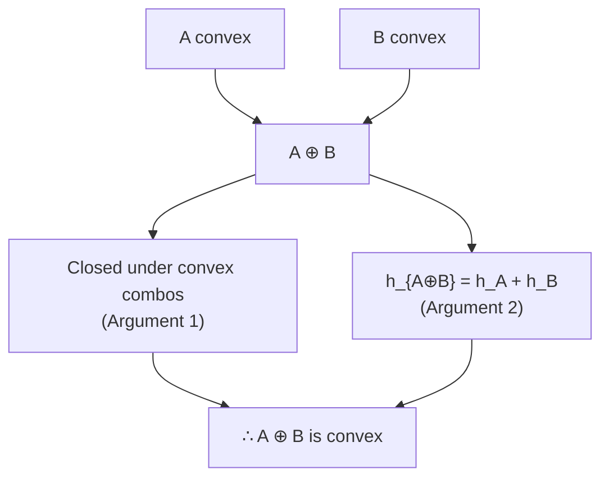
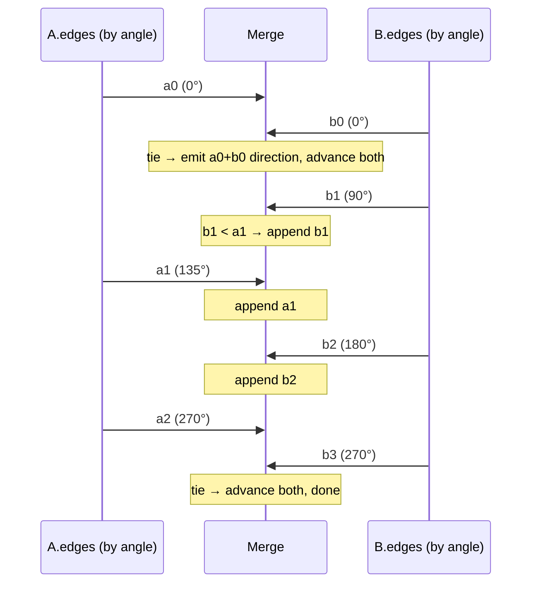
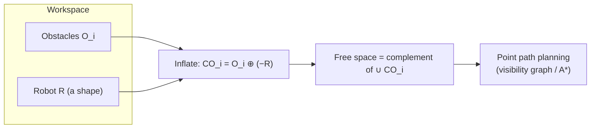

# Minkowski Sum of Convex Polygons — Middle Level

> **One-line summary:** The Minkowski sum is convex because it is the convex-combination-closed set `{a+b}`, and its boundary is the *angularly merged* edge set of the two operands. Understanding **why** that holds unlocks the Minkowski *difference* (erosion), the **configuration-space** trick that reduces robot motion planning to moving a point, and a clear answer to **when** the `O(n+m)` merge beats the naive `O(nm log nm)` all-pairs construction.

---

## Table of Contents

1. [Introduction](#introduction)
2. [Deeper Concepts](#deeper-concepts)
3. [Why the Sum Is Convex](#why-the-sum-is-convex)
4. [Comparison with Alternatives](#comparison-with-alternatives)
5. [The Edge-Merge Construction in Depth](#the-edge-merge-construction-in-depth)
6. [Minkowski Difference and Erosion](#minkowski-difference-and-erosion)
7. [Configuration-Space Motion Planning](#configuration-space-motion-planning)
8. [Code Examples](#code-examples)
9. [Error Handling](#error-handling)
10. [Performance Analysis](#performance-analysis)
11. [Best Practices](#best-practices)
12. [Visual Animation](#visual-animation)
13. [Summary](#summary)

---

## Introduction

> Focus: "Why does it work?" and "When should I choose this?"

At the junior level you learned the recipe: merge the two polygons' edge vectors by angle, get `A ⊕ B` in `O(n + m)`. This file explains the three things a working engineer actually needs:

1. **Why the result is convex** and why the boundary is exactly the merged edge set (so the recipe is *correct*, not just a coincidence).
2. **When** the linear merge applies and when you are forced into slower constructions (the convex-vs-non-convex boundary).
3. **What it's for** — the configuration-space transformation that turns motion planning into a point-navigation problem, and the Minkowski *difference* (erosion) that answers "how far can `B` move inside `A`?".

The unifying idea is the **support function**: for a direction `d`, the support vertex of a convex set is the point furthest along `d`. The support function of a sum is the sum of the support functions — `h_{A⊕B}(d) = h_A(d) + h_B(d)`. Almost everything in this topic is a corollary of that one equation.

---

## Deeper Concepts

### Invariant: edges of the sum = edges of the operands, reordered by angle

The structural invariant maintained by the construction:

> At every step, the partial boundary built so far consists of a prefix of `A`'s edges and a prefix of `B`'s edges, interleaved in non-decreasing polar-angle order, chained tip-to-tail starting from `A[0] + B[0]`.

If you violate it — say by appending an edge out of angular order — the boundary becomes self-intersecting and is no longer convex. The cross-product comparison `cross(edgeA, edgeB)` is precisely the test that preserves the invariant: a positive cross means `edgeA`'s direction comes first.

### The support function

For a convex set `S` and unit direction `d`, define the **support function** and **support point**:

```text
h_S(d) = max_{s ∈ S} (s · d)        # how far S reaches in direction d
support_S(d) = argmax_{s ∈ S} (s · d)
```

The single most important identity for this whole topic:

```text
h_{A ⊕ B}(d) = h_A(d) + h_B(d)
support_{A⊕B}(d) = support_A(d) + support_B(d)
```

Proof sketch: `max_{a,b}((a+b)·d) = max_a(a·d) + max_b(b·d)` because the two maximizations are independent. The boundary vertex of the sum in direction `d` is therefore the sum of the two operands' support vertices in that same direction. As `d` sweeps around the circle, each support vertex stays put until `d` crosses an edge normal, then jumps to the next vertex — giving exactly the merged edge sequence.

### Recurrence / cost relation

The merge processes each edge of `A` and each edge of `B` exactly once:

```text
T(n, m) = T(n-1, m)  or  T(n, m-1)   per step, +O(1) work
        = O(n + m) total
```

No subproblem is revisited, so there is no logarithmic factor — unlike the all-pairs approach which must hull `nm` points.

---

## Why the Sum Is Convex

Two independent arguments; either suffices.

**Argument 1 — closure under convex combinations.** Let `p = a₁ + b₁` and `q = a₂ + b₂` be two points of `A ⊕ B`, with `a_i ∈ A`, `b_i ∈ B`. For `t ∈ [0,1]`:

```text
(1-t)p + t q = [(1-t)a₁ + t a₂] + [(1-t)b₁ + t b₂]
```

The bracketed terms are convex combinations of points of `A` and of `B` respectively. Since `A` and `B` are convex, those terms lie in `A` and `B`, so the whole expression lies in `A ⊕ B`. Thus the segment `pq ⊆ A ⊕ B`: the set is convex. ∎

**Argument 2 — support function.** A set is convex iff it is the intersection of half-planes `{x : x·d ≤ h(d)}` over all directions `d`, with `h` its support function. Since `h_{A⊕B} = h_A + h_B` is a sum of two convex (sublinear) support functions, it is itself a valid support function of a convex set. ∎

Either way: **summing two dentless shapes can never create a dent.**



---

## Comparison with Alternatives

| Attribute | Edge-merge (convex) | All-pairs + hull | Convex decomposition (non-convex) |
|-----------|--------------------|--------------------|----------------------------------|
| Time | **O(n + m)** | O(nm log(nm)) | O(n²m²) |
| Inputs allowed | Convex only | Any (but useless extra work if convex) | Any (general polygons) |
| Output size | ≤ n + m vertices | ≤ n + m vertices | up to O(n²m²) |
| Implementation effort | Low | Very low (reuse hull) | High (decomp + sum + union) |
| Numerical robustness | High (cross products) | Medium (hull degeneracies) | Low (union of many pieces) |
| Best for | Both operands convex | Quick correctness oracle / tiny inputs | Genuinely non-convex shapes |

**Choose the edge-merge when:** both operands are convex (or you can afford to convex-hull them first and a convex result is acceptable).

**Choose all-pairs + hull when:** you need a one-line reference implementation to test the merge against, or `n·m` is tiny.

**Choose decomposition when:** at least one operand is non-convex and you need the *exact* (possibly non-convex) sum, not a convex over-approximation.

---

## The Edge-Merge Construction in Depth

The algorithm is the *merge* step of merge sort, where the "keys" are polar angles of edge vectors. Three subtleties matter:

### 1. Starting vertex pins the origin of the boundary

The sum's bottom-most vertex is `A_bottom + B_bottom` (the support point of both in direction `−y`). Starting both walks there guarantees the first emitted edge has the smallest angle in each list, so the merge produces a valid CCW traversal.

### 2. The half-plane / angle ordering

Edge vectors of a CCW polygon, started at the bottom vertex, increase monotonically in polar angle from near 0 up toward 2π. The merge therefore never needs a full angular sort — it just compares the *current* front edge of each list. Comparing by cross product:

```text
cross(edgeA, edgeB) > 0  → edgeA has the smaller angle → take edgeA
cross(edgeA, edgeB) < 0  → edgeB has the smaller angle → take edgeB
cross(edgeA, edgeB) = 0  → parallel → take both (they fuse into one edge)
```

### 3. Collinear fusion

When an edge of `A` and an edge of `B` point the same way, the sum has a single edge equal to their vector sum. Advancing both pointers on a tie handles this. If you advance only one, you still get a correct polygon but with a redundant collinear vertex.



---

## Minkowski Difference and Erosion

Two distinct operations share the word "difference." Keep them apart.

### Erosion (the true Minkowski difference)

```text
A ⊖ B = { c : c + B ⊆ A } = ⋂_{b ∈ B} (A − b)
```

This *shrinks* `A` by `B`. It answers: "Where can the reference point of `B` sit so that the whole of `B` stays inside `A`?" It is the intersection of translated copies of `A`, **not** a Minkowski sum. For convex `A` and `B` it is again convex, computable as `A ⊕ (−B)` *only in the support-function sense for outer offsets* — but as a set, `A ⊖ B ≠ A ⊕ (−B)` in general. Treat erosion as its own routine (intersection of half-planes shifted inward by `B`'s support).

### Reflection-sum (the collision "difference")

```text
A ⊕ (−B) = { a − b : a ∈ A, b ∈ B }
```

This is what GJK and SAT-style collision code mean by "Minkowski difference." Its key property:

> **`A` and `B` intersect ⇔ `0 ∈ A ⊕ (−B)`.**

Because `a = b` for some `a ∈ A`, `b ∈ B` exactly when `a − b = 0`. So a collision test becomes: *does the origin lie inside this one convex set?* — a point-in-convex-polygon test you already know.

| Operation | Definition | Effect | Use |
|-----------|-----------|--------|-----|
| Sum `A ⊕ B` | `{a+b}` | Grows / inflates | C-space obstacles, offsetting |
| Reflection-sum `A ⊕ (−B)` | `{a−b}` | Collision set | GJK origin test |
| Erosion `A ⊖ B` | `{c : c+B ⊆ A}` | Shrinks | Clearance, "fits inside?" |

---

## Configuration-Space Motion Planning

This is the headline application and the reason robotics courses teach Minkowski sums.

**The problem.** A robot `R` (a rigid polygon, translation-only for now) must travel from start to goal among obstacles `O₁, …, O_k` without colliding.

**The trick.** Replace the robot with a single reference point `r`. The robot collides with obstacle `Oᵢ` exactly when `r` enters the *inflated* obstacle

```text
CO_i = O_i ⊕ (−R)
```

Why `−R`? Because `R` placed at `r` is `{ r + p : p ∈ R }`; it touches `Oᵢ` when some `r + p = o`, i.e. `r = o − p ∈ O_i ⊕ (−R)`. Inflate every obstacle this way to build the **configuration-space obstacles**. Now:

> The robot (a shape) navigating among obstacles ≡ a **point** navigating among the inflated obstacles `CO_i`.

Free space is everything outside all `CO_i`. Run any point-based planner on it — a visibility graph, a road map, or grid A*. The Minkowski sum is the *preprocessing* that makes the robot disappear into a point.



Caveats handled at senior level: rotation adds a third C-space dimension (orientation θ), non-convex robots/obstacles need decomposition, and the inflated obstacles can overlap and must be unioned.

---

## Code Examples

### Full implementation: sum, reflection-sum, and the GJK-style origin test

#### Go

```go
package main

import "fmt"

type Pt struct{ X, Y int64 }

func add(a, b Pt) Pt      { return Pt{a.X + b.X, a.Y + b.Y} }
func sub(a, b Pt) Pt      { return Pt{a.X - b.X, a.Y - b.Y} }
func cross(a, b Pt) int64 { return a.X*b.Y - a.Y*b.X }

func reorder(p []Pt) []Pt {
	k := 0
	for i := 1; i < len(p); i++ {
		if p[i].Y < p[k].Y || (p[i].Y == p[k].Y && p[i].X < p[k].X) {
			k = i
		}
	}
	out := make([]Pt, len(p))
	for i := range p {
		out[i] = p[(k+i)%len(p)]
	}
	return out
}

func minkowski(a, b []Pt) []Pt {
	a, b = reorder(a), reorder(b)
	a = append(a, a[0], a[1])
	b = append(b, b[0], b[1])
	var res []Pt
	i, j := 0, 0
	for i < len(a)-2 || j < len(b)-2 {
		res = append(res, add(a[i], b[j]))
		c := cross(sub(a[i+1], a[i]), sub(b[j+1], b[j]))
		switch {
		case c > 0:
			i++
		case c < 0:
			j++
		default:
			i++
			j++
		}
	}
	return res
}

// reflect returns -B, keeping CCW order.
func reflect(b []Pt) []Pt {
	out := make([]Pt, len(b))
	for i, p := range b {
		out[len(b)-1-i] = Pt{-p.X, -p.Y}
	}
	return out
}

// pointInConvex reports whether the origin is inside CCW convex polygon p.
func originInside(p []Pt) bool {
	n := len(p)
	for i := 0; i < n; i++ {
		if cross(sub(p[(i+1)%n], p[i]), sub(Pt{0, 0}, p[i])) < 0 {
			return false // origin is right of some edge → outside
		}
	}
	return true
}

// intersect reports whether convex polygons A and B overlap (GJK idea).
func intersect(a, b []Pt) bool {
	return originInside(minkowski(a, reflect(b)))
}

func main() {
	a := []Pt{{0, 0}, {2, 0}, {2, 2}, {0, 2}}
	b := []Pt{{1, 1}, {3, 1}, {3, 3}, {1, 3}}
	fmt.Println("overlap:", intersect(a, b)) // true (they share a corner region)
}
```

#### Java

```java
import java.util.*;

public class MinkowskiMid {
    record Pt(long x, long y) {}
    static Pt add(Pt a, Pt b) { return new Pt(a.x + b.x, a.y + b.y); }
    static Pt sub(Pt a, Pt b) { return new Pt(a.x - b.x, a.y - b.y); }
    static long cross(Pt a, Pt b) { return a.x * b.y - a.y * b.x; }

    static List<Pt> reorder(List<Pt> p) {
        int k = 0;
        for (int i = 1; i < p.size(); i++)
            if (p.get(i).y() < p.get(k).y()
                || (p.get(i).y() == p.get(k).y() && p.get(i).x() < p.get(k).x())) k = i;
        List<Pt> out = new ArrayList<>();
        for (int i = 0; i < p.size(); i++) out.add(p.get((k + i) % p.size()));
        return out;
    }

    static List<Pt> minkowski(List<Pt> a, List<Pt> b) {
        a = new ArrayList<>(reorder(a)); a.add(a.get(0)); a.add(a.get(1));
        b = new ArrayList<>(reorder(b)); b.add(b.get(0)); b.add(b.get(1));
        List<Pt> res = new ArrayList<>();
        int i = 0, j = 0;
        while (i < a.size() - 2 || j < b.size() - 2) {
            res.add(add(a.get(i), b.get(j)));
            long c = cross(sub(a.get(i + 1), a.get(i)), sub(b.get(j + 1), b.get(j)));
            if (c > 0) i++; else if (c < 0) j++; else { i++; j++; }
        }
        return res;
    }

    static List<Pt> reflect(List<Pt> b) {
        List<Pt> out = new ArrayList<>(Collections.nCopies(b.size(), null));
        for (int i = 0; i < b.size(); i++)
            out.set(b.size() - 1 - i, new Pt(-b.get(i).x(), -b.get(i).y()));
        return out;
    }

    static boolean originInside(List<Pt> p) {
        int n = p.size();
        for (int i = 0; i < n; i++)
            if (cross(sub(p.get((i + 1) % n), p.get(i)),
                      sub(new Pt(0, 0), p.get(i))) < 0) return false;
        return true;
    }

    static boolean intersect(List<Pt> a, List<Pt> b) {
        return originInside(minkowski(a, reflect(b)));
    }

    public static void main(String[] args) {
        List<Pt> a = List.of(new Pt(0,0), new Pt(2,0), new Pt(2,2), new Pt(0,2));
        List<Pt> b = List.of(new Pt(1,1), new Pt(3,1), new Pt(3,3), new Pt(1,3));
        System.out.println("overlap: " + intersect(a, b));
    }
}
```

#### Python

```python
def add(a, b): return (a[0] + b[0], a[1] + b[1])
def sub(a, b): return (a[0] - b[0], a[1] - b[1])
def cross(a, b): return a[0] * b[1] - a[1] * b[0]


def reorder(p):
    k = min(range(len(p)), key=lambda i: (p[i][1], p[i][0]))
    return p[k:] + p[:k]


def minkowski(a, b):
    a, b = reorder(a), reorder(b)
    a, b = a + [a[0], a[1]], b + [b[0], b[1]]
    res, i, j = [], 0, 0
    while i < len(a) - 2 or j < len(b) - 2:
        res.append(add(a[i], b[j]))
        c = cross(sub(a[i + 1], a[i]), sub(b[j + 1], b[j]))
        if c > 0:
            i += 1
        elif c < 0:
            j += 1
        else:
            i += 1
            j += 1
    return res


def reflect(b):
    return [(-x, -y) for x, y in reversed(b)]


def origin_inside(p):
    n = len(p)
    for i in range(n):
        if cross(sub(p[(i + 1) % n], p[i]), sub((0, 0), p[i])) < 0:
            return False
    return True


def intersect(a, b):
    """Two convex polygons overlap iff the origin is inside A ⊕ (−B)."""
    return origin_inside(minkowski(a, reflect(b)))


if __name__ == "__main__":
    a = [(0, 0), (2, 0), (2, 2), (0, 2)]
    b = [(1, 1), (3, 1), (3, 3), (1, 3)]
    print("overlap:", intersect(a, b))  # True
```

**What it does:** builds the Minkowski sum, reflects a polygon for collision detection, and tests overlap via the origin-in-Minkowski-difference property.

---

## Error Handling

| Scenario | What goes wrong | Correct approach |
|----------|-----------------|------------------|
| Input not convex | Edge angles not monotone → broken merge | Convex-hull the input first, or use decomposition. |
| Clockwise input | Negative signed area → inverted result | Normalize to CCW (reverse if signed area < 0). |
| Reflection without reversal | `−B` ends up clockwise | Negate **and** reverse to preserve CCW. |
| Origin test with CW polygon | Inside/outside flipped | Ensure the sum is CCW before the half-plane test. |
| Confusing erosion with reflection-sum | Wrong set computed for "fits inside?" | Use `A ⊖ B` (intersection of shifted copies) for clearance. |
| Float angle ties | Edges sorted inconsistently | Use exact integer cross-product comparison. |

---

## Performance Analysis

Empirically, the linear merge crushes the all-pairs approach as sizes grow. Benchmark the merge against the all-pairs-hull oracle.

#### Go

```go
import (
	"fmt"
	"time"
)

func benchmark() {
	sizes := []int{16, 64, 256, 1024, 4096}
	for _, n := range sizes {
		a := regularPolygon(n) // n-gon, convex, CCW
		b := regularPolygon(n)
		start := time.Now()
		for k := 0; k < 50; k++ {
			_ = minkowski(a, b)
		}
		fmt.Printf("n=%5d: %.3f ms\n", n,
			float64(time.Since(start).Microseconds())/50.0/1000.0)
	}
}
```

#### Java

```java
public static void benchmark() {
    int[] sizes = {16, 64, 256, 1024, 4096};
    for (int n : sizes) {
        List<Pt> a = regularPolygon(n), b = regularPolygon(n);
        long start = System.nanoTime();
        for (int k = 0; k < 50; k++) minkowski(a, b);
        long el = System.nanoTime() - start;
        System.out.printf("n=%5d: %.3f ms%n", n, el / 50.0 / 1_000_000);
    }
}
```

#### Python

```python
import timeit

for n in (16, 64, 256, 1024, 4096):
    a = regular_polygon(n)
    b = regular_polygon(n)
    t = timeit.timeit(lambda: minkowski(a, b), number=50)
    print(f"n={n:>5}: {t/50*1000:.3f} ms")
```

The merge scales linearly; doubling `n` roughly doubles the time. The all-pairs approach scales near-quadratically and falls off a cliff past a few hundred vertices.

| Approach | n=256 (relative) | n=4096 (relative) |
|----------|------------------|-------------------|
| Edge-merge | 1× | ~16× |
| All-pairs + hull | ~256× | ~65000× |

---

## Best Practices

- Implement the linear merge once from scratch; understand the cross-product comparison before reaching for a library.
- Always validate convexity and CCW orientation at the API boundary; fail loudly on violations.
- Keep `reflect`, `translate`, and `erode` as named helpers — they are the operations robotics code reuses.
- Document which "difference" a function computes (erosion vs reflection-sum); the ambiguity causes real bugs.
- Test every routine against the brute-force all-pairs-hull oracle on random small convex inputs.
- Prefer integer coordinates and exact cross products; switch to robust floating-point predicates only when forced.

---

## Visual Animation

> See [`animation.html`](./animation.html) for interactive visualization.
>
> Middle-level animation includes:
> - Side-by-side: the edge-merge construction vs the all-pairs point cloud
> - Each merge step highlighting which operand's edge has the smaller angle
> - The configuration-space inflation toggle (obstacle ⊕ reflected robot)
> - Step counter and a live Big-O comparison

---

## Summary

At the middle level the Minkowski sum is understood through its **support function**: `h_{A⊕B} = h_A + h_B`, which proves both that the sum is convex and that its boundary is the operands' edges merged by angle. That correctness justifies the `O(n + m)` merge and shows exactly when it applies (convex inputs only) versus when you must fall back to all-pairs-hull or convex decomposition. The two payoff applications are the **configuration-space** transformation — inflate obstacles by the reflected robot so the robot becomes a point — and **collision detection** via the reflection-sum's origin test. Keep the Minkowski *difference* (erosion) mentally separate from the reflection-sum, because they answer different questions.

---

Next step: [senior.md](./senior.md) — robotics and collision-detection systems, GJK in production, non-convex decomposition, CAD offsetting, and numerical robustness.
