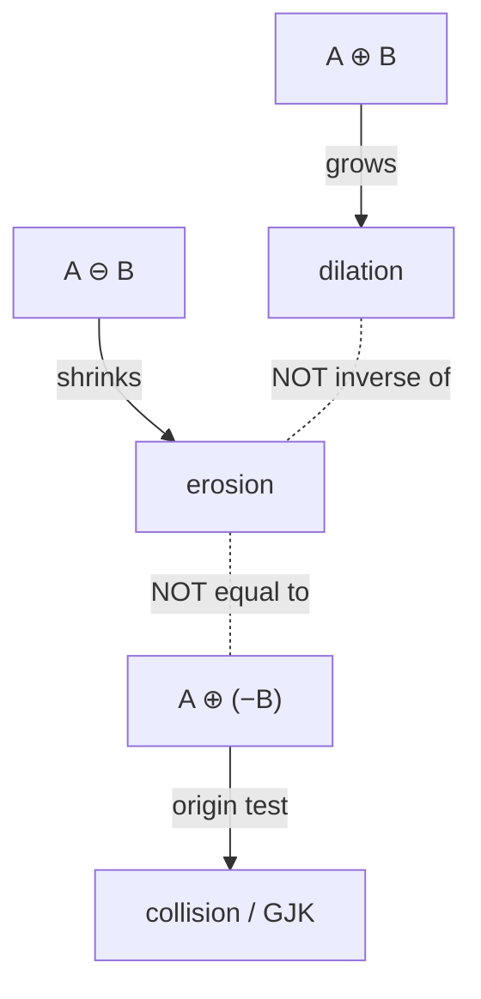
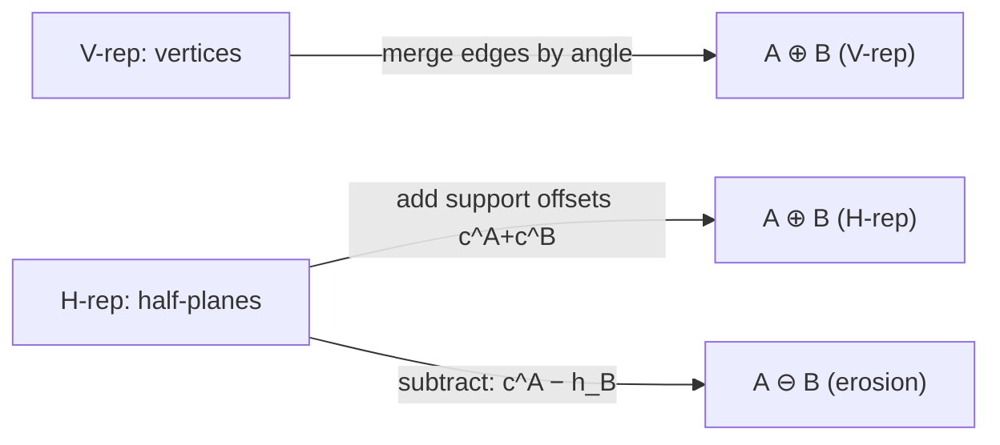

# Minkowski Sum of Convex Polygons — Mathematical Foundations and Complexity Theory

> **One-line summary:** The Minkowski sum of two convex polygons is convex (closure under convex combinations / additivity of support functions), has at most `n + m` edges, and is computed by an angular merge whose correctness rests on the identity `support_{A⊕B}(d) = support_A(d) + support_B(d)`. This file proves the `O(n+m)` merge correct via a loop invariant, proves the GJK origin-test equivalence, and establishes the `O(n²m²)` worst-case bound for non-convex operands.

---

## Table of Contents

1. [Formal Definitions](#formal-definitions)
2. [Convexity and the Support Function](#convexity-and-the-support-function)
3. [Edge-Count Bound](#edge-count-bound)
4. [Correctness Proof — The Angular Merge](#correctness-proof-the-angular-merge)
5. [The GJK / Minkowski-Difference Origin Test](#the-gjk-minkowski-difference-origin-test)
6. [Minkowski Difference (Erosion) — Formal Treatment](#minkowski-difference-erosion)
7. [Complexity of the Non-Convex Case](#complexity-of-the-non-convex-case)
8. [Numerical Robustness and Exact Predicates](#numerical-robustness)
9. [Comparison with Alternatives](#comparison-with-alternatives)
10. [Summary](#summary)

---

## Formal Definitions

```text
Definition (Minkowski sum).
  For sets A, B ⊆ ℝ²:   A ⊕ B = { a + b : a ∈ A, b ∈ B }.

Definition (reflection).
  −B = { −b : b ∈ B }.

Definition (reflection-sum / "difference" in collision detection).
  A ⊕ (−B) = { a − b : a ∈ A, b ∈ B }.

Definition (Minkowski difference / erosion).
  A ⊖ B = { c ∈ ℝ² : c + B ⊆ A } = ⋂_{b ∈ B} (A − b).

Definition (support function of a compact convex set K, direction d ∈ ℝ²).
  h_K(d) = max_{x ∈ K} ⟨x, d⟩,   with support set  F_K(d) = argmax_{x∈K} ⟨x, d⟩.

Definition (convex polygon).
  A polygon P with vertices v₀,…,v_{k−1} in CCW order is convex iff
  cross(v_{i+1} − v_i, v_{i+2} − v_{i+1}) ≥ 0 for all i (indices mod k).
```

We assume `A`, `B` are compact convex polygons with `n`, `m` vertices, given in CCW order. `cross(u, v) = u_x v_y − u_y v_x` is the scalar 2-D cross product.

---

## Convexity and the Support Function

### Lemma 1 (Additivity of support functions)

For compact convex `A, B` and every direction `d`:

```text
h_{A⊕B}(d) = h_A(d) + h_B(d),    and    F_{A⊕B}(d) = F_A(d) + F_B(d).
```

**Proof.**
```text
h_{A⊕B}(d) = max_{a∈A, b∈B} ⟨a + b, d⟩
           = max_{a∈A, b∈B} (⟨a,d⟩ + ⟨b,d⟩)
           = max_{a∈A} ⟨a,d⟩ + max_{b∈B} ⟨b,d⟩      (independent maximizations)
           = h_A(d) + h_B(d).
The maximizers compose: any (a*,b*) with a*∈F_A(d), b*∈F_B(d) gives a*+b*∈F_{A⊕B}(d),
and conversely. ∎
```

### Theorem 1 (The sum is convex)

`A ⊕ B` is convex.

**Proof (closure under convex combinations).**
```text
Let p = a₁+b₁, q = a₂+b₂ ∈ A⊕B and t ∈ [0,1].
(1−t)p + t q = [(1−t)a₁ + t a₂] + [(1−t)b₁ + t b₂].
Since A convex: (1−t)a₁ + t a₂ ∈ A.   Since B convex: (1−t)b₁ + t b₂ ∈ B.
Hence (1−t)p + t q ∈ A⊕B. The segment pq lies in A⊕B, so A⊕B is convex. ∎
```

**Alternative proof (support functions).** `h_{A⊕B} = h_A + h_B` (Lemma 1) is a sum of sublinear functions, hence sublinear, hence the support function of a unique compact convex set — which is `A ⊕ B`. ∎

---

## Edge-Count Bound

### Theorem 2 (At most `n + m` edges)

`A ⊕ B` has at most `n + m` edges (and at most `n + m` vertices).

**Proof.**
```text
An edge of a convex polygon corresponds to a maximal arc of directions d for which
the support set F(d) is that edge (a 1-dimensional face). The "normal directions"
of P are the directions normal to its edges; equivalently, the outward edge normals
partition the unit circle into arcs, one per vertex.

By Lemma 1, F_{A⊕B}(d) = F_A(d) + F_B(d). F_{A⊕B}(d) is an edge (1-dim) iff at least
one of F_A(d), F_B(d) is an edge (and the other is a vertex or a parallel edge).
Therefore every edge of A⊕B is parallel to an edge of A or an edge of B, and arises
exactly when d enters the angular arc of that edge.

A has n edge-normals; B has m edge-normals. Their multiset on the circle has ≤ n+m
distinct directions, so the boundary of A⊕B has ≤ n+m edges. When an edge of A and an
edge of B share a normal direction, they fuse into one edge, strictly reducing the count.
Hence #edges(A⊕B) ≤ n + m. ∎
```

This bound is exactly why the merge is `O(n + m)`: the output cannot be larger.

---

## Correctness Proof — The Angular Merge

We prove the two-pointer angular merge produces the boundary of `A ⊕ B` in CCW order.

### Setup

```text
Normalize A and B to CCW order starting at the bottom-most (then left-most) vertex.
Let A's edge vectors be e₀^A, e₁^A, …, e_{n−1}^A  in non-decreasing polar angle.
Let B's edge vectors be e₀^B, …, e_{m−1}^B        in non-decreasing polar angle.
Both lists start at angle ≈ 0 (the bottom vertex's outgoing edge) and increase to < 2π.

Algorithm: v ← A[0] + B[0]; emit v.  Pointers i=j=0.
  Repeat until both edge lists exhausted:
    if angle(e_i^A) < angle(e_j^B):  v ← v + e_i^A; i++
    elif angle(e_i^A) > angle(e_j^B): v ← v + e_j^B; j++
    else (equal):                     v ← v + e_i^A + e_j^B; i++; j++
    emit v
Angle comparison uses cross(e_i^A, e_j^B): >0 ⇒ first is smaller, <0 ⇒ larger, =0 ⇒ equal.
```

### Loop Invariant

```text
Invariant I(after k emitted edges):
  The emitted polyline is the boundary of A⊕B restricted to directions in [0, θ_k],
  where θ_k is the polar angle of the last-appended edge, AND the current vertex v
  equals F_A(d) + F_B(d) for d just past θ_k (the support vertex of the sum at that
  direction), AND the emitted edges are exactly the edges of A and B with normal
  arcs ≤ θ_k, in non-decreasing angle.
```

### Proof by induction

```text
Base case (k=0):
  v = A[0] + B[0] is the bottom-most vertex of A⊕B (support point in direction −y),
  because F_A(−y)=A[0], F_B(−y)=B[0], and by Lemma 1 F_{A⊕B}(−y)=A[0]+B[0].
  No edges emitted; I holds vacuously for the empty prefix.

Inductive step:
  Assume I after k edges; current vertex v = support of A⊕B just past θ_k.
  The next edge of the sum in CCW order is the one whose normal arc starts soonest,
  i.e. the edge (of A or B) with the smallest polar angle among the unprocessed
  e_i^A, e_j^B. The algorithm appends exactly that edge:
    - If angle(e_i^A) < angle(e_j^B): A's support vertex advances along e_i^A while B's
      stays fixed; by Lemma 1 the sum's support point moves by e_i^A. Correct.
    - Symmetric for B.
    - If equal: both supports advance simultaneously; the sum's edge is e_i^A + e_j^B
      (collinear fusion). Correct, and Theorem 2's fusion case is realized.
  After appending, v is again F_A(d)+F_B(d) for d just past the new θ_{k+1}, and the
  emitted edge set still matches all edges with normal arc ≤ θ_{k+1}. I holds.

Termination:
  Each iteration advances i or j (or both); i ≤ n, j ≤ m, so the loop runs ≤ n+m times.
  The monotone-angle ordering guarantees we never need to revisit an edge.

Postcondition:
  When both lists are exhausted, θ has swept [0, 2π); by I the full boundary of A⊕B
  has been emitted in CCW order, and it closes back to A[0]+B[0]. ∎
```

**Complexity:** `O(n + m)` iterations, `O(1)` work each (one cross product, one vector add) ⇒ `O(n + m)` time and output size, matching Theorem 2.

---

## The GJK / Minkowski-Difference Origin Test

### Theorem 3 (Intersection ⇔ origin in reflection-sum)

For convex `A`, `B`:  `A ∩ B ≠ ∅  ⇔  0 ∈ A ⊕ (−B)`.

**Proof.**
```text
(⇒) If x ∈ A ∩ B, then x ∈ A and x ∈ B, so 0 = x − x ∈ {a − b : a∈A, b∈B} = A ⊕ (−B).
(⇐) If 0 ∈ A ⊕ (−B), then 0 = a − b for some a∈A, b∈B, i.e. a = b. That common point
    lies in A ∩ B, which is therefore nonempty. ∎
```

### Why GJK needs only the support function

GJK never builds `A ⊕ (−B)`. By Lemma 1 and the reflection rule `h_{−B}(d) = h_B(−d)`:

```text
support_{A⊕(−B)}(d) = F_A(d) − F_B(−d).
```

GJK maintains a simplex `S ⊆ A ⊕ (−B)` (≤ 3 points in 2-D, ≤ 4 in 3-D) and, at each step, queries the support point in the direction of the origin relative to the current simplex's nearest feature. The Carathéodory theorem guarantees that if `0` is in the convex hull of `A ⊕ (−B)`, it is in the convex hull of some `d+1` of its points (a simplex), so the search is finite.

```text
Termination / progress argument:
  Let p_k = support_{A⊕(−B)}(d_k). If ⟨p_k, d_k⟩ < 0, then the supporting hyperplane with
  normal d_k separates the origin from A⊕(−B) (since p_k is the furthest point along d_k
  yet still on the wrong side of 0) ⇒ 0 ∉ A⊕(−B) ⇒ no intersection. Otherwise the simplex
  is updated to the sub-feature nearest the origin, strictly decreasing dist(0, conv S)
  until 0 ∈ conv S (intersection) — finite for polytopes.
```

EPA then expands the terminal simplex to the boundary of `A ⊕ (−B)`; the closest boundary point to the origin is the **penetration vector** (minimum translation to separate), with magnitude `dist(0, ∂(A ⊕ (−B)))` and direction the contact normal.

---

### GJK Convergence via Carathéodory and Distance Subalgorithm

Two formal pillars make GJK terminate and be correct.

```text
Carathéodory's theorem (ℝ^d): if x ∈ conv(S), then x ∈ conv(T) for some T ⊆ S, |T| ≤ d+1.
Consequence: if 0 ∈ A ⊕ (−B) (a convex polytope), it lies in the convex hull of at most
d+1 difference vertices — a SIMPLEX. GJK searches over such simplices.

Johnson's distance subalgorithm: given the current simplex W (|W| ≤ d+1), compute the
point of conv(W) closest to the origin and the minimal sub-simplex W' ⊆ W whose convex
hull still contains that closest point. Drop the rest.

Progress measure: let v_k = closest point of conv(W_k) to 0. The next support direction
is d_k = −v_k. The new support point p_k = support_{A⊕(−B)}(d_k) satisfies, if no overlap,
    ⟨p_k, d_k⟩ < ⟨v_k, d_k⟩ = −|v_k|²  ⇒  ⟨p_k, d_k⟩ < 0  ⇒  separating hyperplane found.
Otherwise |v_{k+1}| < |v_k| strictly (the simplex moved closer to 0). Since the difference is
a finite polytope with finitely many faces, the strictly-decreasing distance terminates. ∎
```

This is why GJK runs in a handful of iterations in practice: each iteration either certifies separation (origin on the far side of a supporting plane) or strictly reduces the distance from the simplex to the origin, and the polytope's finite face set bounds the number of distinct simplices.

```mermaid
graph TD
    S0["simplex W (≤ d+1 points)"] --> CLOSE["v = closest point of conv(W) to 0"]
    CLOSE --> DIR["d = −v"]
    DIR --> SUP["p = support_{A⊕(−B)}(d)"]
    SUP --> Q{⟨p,d⟩ < 0?}
    Q -- yes --> SEP["separated: no collision"]
    Q -- no --> ADD["add p to W, reduce via Johnson"]
    ADD --> ZERO{0 ∈ conv(W)?}
    ZERO -- yes --> HIT["collision → hand to EPA"]
    ZERO -- no --> CLOSE
```

---

## Minkowski Difference (Erosion) — Formal Treatment

### Proposition (Erosion via support functions)

For convex `A`, `B`, the erosion `A ⊖ B = ⋂_{b∈B}(A − b)` is convex, and its support function satisfies, for directions `d` where it is finite:

```text
h_{A⊖B}(d) ≤ h_A(d) − h_B(d).
```

Equality holds for outer-regular cases but **not** in general; crucially, `A ⊖ B` is **not** equal to `A ⊕ (−B)` as a set. The two are related by the duality (for sufficiently regular sets):

```text
(A ⊖ B) ⊕ B ⊆ A,   with equality iff A is "B-open" (no thin necks narrower than B).
```

This is why erosion is computed as an **intersection of half-planes** shifted inward by `B`'s support, not by a Minkowski-sum routine. Confusing `A ⊖ B` with `A ⊕ (−B)` is the canonical formal error in this topic.



---

## Complexity of the Non-Convex Case

### Theorem 4 (Non-convex Minkowski sum is `O(n²m²)`)

For simple (possibly non-convex) polygons `A`, `B` with `n`, `m` vertices, `A ⊕ B` can have `Θ(n²m²)` boundary complexity in the worst case, and that bound is tight.

**Proof sketch.**
```text
Lower bound (construction): Comb-shaped polygons. Let A be a "comb" with Θ(n) teeth and
B a comb with Θ(m) teeth, oriented orthogonally. Sliding B over A, each of the Θ(n) teeth
of A interacts with each of the Θ(m) teeth of B, and each such interaction can create
Θ(nm) boundary features (the teeth sweep across one another). The total boundary
complexity reaches Θ(n²m²) — a classic construction (Kedem–Sharir; see also de Berg et al.).

Upper bound: Convex-decompose A into p convex pieces (Σ|A_i| = O(n)) and B into q pieces
(Σ|B_j| = O(m)). Each pairwise convex sum A_i ⊕ B_j has |A_i|+|B_j| edges (Theorem 2) and
costs O(|A_i|+|B_j|). Summing over all pairs:
    Σ_{i,j} (|A_i| + |B_j|) = q·Σ|A_i| + p·Σ|B_j| = O(qn + pm) = O(nm)   (p≤n, q≤m).
The pieces' boundary edges, before union, total O(nm). Their arrangement (overlay) of
O(nm) segments has up to O((nm)²) = O(n²m²) intersection points, which the Boolean union
must resolve. Hence O(n²m²) overall, matching the lower bound. ∎
```

**Practical consequence:** minimize the number of convex pieces `p`, `q` (approximate convex decomposition), because the union step's quadratic blowup in the segment count dominates.

| Case | Output size | Time |
|------|-------------|------|
| Convex ⊕ Convex | O(n + m) | O(n + m) |
| Convex ⊕ Non-convex (m pieces) | O(nm) | O(nm log nm) |
| Non-convex ⊕ Non-convex | O(n²m²) | O(n²m² · α) (union) |

---

## Numerical Robustness

The merge and GJK rest on the **sign of a cross product** (an orientation predicate). With floating-point coordinates, near-degenerate configurations (collinear edges, vertices on edges) can flip that sign, yielding a non-convex "sum" or a non-terminating GJK.

```text
Robust orientation predicate (Shewchuk):
  Compute cross(u,v) with adaptive-precision arithmetic; fall back to exact rational
  evaluation only when the floating-point result is within the error bound of 0.

Error bound for double cross product with coordinates ≤ C:
  |fl(cross) − cross| ≤ (3 + 3ε) ε · |u_x v_y| + … ≈ O(ε C²).
  If |fl(cross)| > error bound, the sign is certified; else recompute exactly.
```

Strategies in order of cost/robustness:
1. **Integer coordinates** + 64-bit cross product (use `__int128`/`BigInteger` if `C` large) — exact, cheap.
2. **Symbolic perturbation** (Simulation of Simplicity) to break degenerate ties consistently.
3. **Adaptive exact predicates** (Shewchuk, CGAL kernels) for general floating-point input.

GJK additionally needs an **iteration cap + margin**: treat `|⟨p,d⟩| < ε` as "boundary touch" so the simplex search terminates near degenerate contacts.

---

## Algebraic Properties

The Minkowski sum endows the family of compact convex sets with the structure of a commutative monoid, which justifies folding many summands and reordering them freely.

```text
Commutativity:   A ⊕ B = B ⊕ A.
                 (a+b ranges over the same set as b+a.)

Associativity:   (A ⊕ B) ⊕ C = A ⊕ (B ⊕ C) = {a+b+c}.
                 (vector addition is associative.)

Identity:        A ⊕ {0} = A.

Distribution over scaling (Minkowski / Brunn–Minkowski regime):
                 (λ + μ)·K = λK ⊕ μK   for convex K, λ,μ ≥ 0.
                 (Holds for convex K; fails for non-convex sets — a subtle point.)

Monotonicity:    A ⊆ A'  ⇒  A ⊕ B ⊆ A' ⊕ B.

Support additivity (the master identity):
                 h_{A ⊕ B} = h_A + h_B,  hence  h_{⊕ᵢ Aᵢ} = Σ h_{Aᵢ}.
```

### Corollary (sum of `k` convex polygons)

Because `h` is additive and `⊕` is associative/commutative, the sum `P₁ ⊕ … ⊕ P_k` has at most `Σ |Pᵢ|` edges, and **all** edge vectors of all `k` polygons can be merged in a single angular pass:

```text
Naive fold:   ((P₁ ⊕ P₂) ⊕ P₃) ⊕ …    cost Σ partial sizes = O(k · N), N = Σ|Pᵢ|
Single merge: sort all N edge vectors by angle, chain.   O(N log N)  (or O(N) if pre-sorted)
```

The single-merge form is the professional-grade way to inflate by several shapes at once (e.g. robot ⊕ uncertainty ⊕ safety margin).

---

## The Brunn–Minkowski Inequality (why "summing grows volume")

For compact convex bodies `A`, `B` in `ℝ^d`, the Brunn–Minkowski inequality bounds the volume (area, in 2-D) of the sum:

```text
vol(A ⊕ B)^{1/d} ≥ vol(A)^{1/d} + vol(B)^{1/d}.
```

In 2-D this gives `√area(A⊕B) ≥ √area(A) + √area(B)`, formalizing the intuition that the sum is at least as "spread out" as either operand and quantifying offsetting growth. Equality holds iff `A` and `B` are homothetic (scaled copies). This inequality underlies isoperimetric results and clearance/volume estimates in motion planning.

---

## A 3-D Note

In `ℝ³`, the Minkowski sum of two convex polytopes with `n`, `m` faces has complexity `Θ(nm)` (each pair of a face-normal arc can contribute), and computing it explicitly is comparatively expensive. This is precisely why production collision systems abandon materialization in 3-D and use **support-function GJK + EPA**, whose cost depends on iteration count, not on the (potentially quadratic) size of the explicit sum. The support identity `support_{A⊕(−B)}(d) = support_A(d) − support_B(−d)` is dimension-agnostic, so the *same* code serves 2-D and 3-D.

---

## Worked Numerical Robustness Example

Consider near-collinear edges with double coordinates around `C = 10⁶`:

```text
u = (1_000_000, 1),  v = (2_000_000, 2)   (exactly parallel: cross = 0)
exact cross(u,v) = 1_000_000·2 − 1·2_000_000 = 0.

Perturb v slightly: v' = (2_000_000, 2 + δ), δ tiny.
cross(u, v') = 1_000_000·(2+δ) − 1·2_000_000 = 1_000_000·δ.
For δ ≈ 1e-9, the true cross ≈ 1e-3, but the floating-point rounding error in the
products (each ~ ε·C² ≈ 2.2e-16 · 1e12 ≈ 2e-4) can swamp or flip that sign.
```

Mitigation: certify with the error bound; if `|fl(cross)| < bound`, recompute exactly. With integer inputs and a 64-bit (or 128-bit) accumulator, `cross` is exact and no certification is needed — the strongly preferred regime for offline/CAD work.

---

## Comparison with Alternatives

| Attribute | Angular merge | All-pairs + hull | GJK (lazy) | Decomposition |
|-----------|--------------|------------------|-----------|---------------|
| Worst-case time | O(n + m) | O(nm log nm) | O(k(n+m)) | O(n²m²) |
| Output | Full sum polygon | Full sum polygon | Yes/no + depth | Full (non-convex) sum |
| Inputs | Convex | Any | Convex | Any |
| Deterministic? | Yes | Yes | Yes (with cap) | Yes |
| Exactness | Cross-product exact | Hull degeneracies | Tolerance-bound | Union-robustness needed |
| 3-D? | Hard (Θ(nm)) | Hard | Yes | Hard |
| Optimal? | Yes (matches edge bound) | No (extra hull) | Yes for query | Matches Ω(n²m²) lower bound |

---

## Half-Plane (H-Representation) View

A convex polygon has two dual representations: the **V-representation** (vertices) and the **H-representation** (intersection of half-planes). The Minkowski sum is clean in V-rep (merge edges); the H-rep view illuminates *why*.

```text
H-rep of convex K:   K = ⋂_i { x : ⟨x, nᵢ⟩ ≤ cᵢ }     (nᵢ = outward edge normals)
Support function:    h_K(nᵢ) = cᵢ  (the offset of the i-th supporting line).

For the sum, the supporting line in direction n has offset:
    c^{A⊕B}(n) = h_{A⊕B}(n) = h_A(n) + h_B(n) = c^A(n) + c^B(n).
```

So `A ⊕ B`'s supporting line in any direction is the *sum of offsets* of the two operands' supporting lines in that direction. The boundary edges occur exactly at the normals present in `A` or `B`:

```text
Normals(A ⊕ B) = Normals(A) ∪ Normals(B)   (as a set; shared normals merge).
Offset for a shared normal n: c^A(n) + c^B(n).
```

This gives an alternative construction — for each distinct edge normal, take the sum of the two support offsets — and re-derives the `≤ n + m` edge bound (Theorem 2) from the union of normal sets. It is also the basis for computing the **erosion** `A ⊖ B`: keep `A`'s normals but *subtract* `B`'s support, `c^A(n) − h_B(n)`, which is why erosion is naturally an H-rep operation (intersection of inward-shifted half-planes), not a V-rep merge.



---

## Worked Merge Trace (formal)

Re-derive the triangle ⊕ square example, tracking the loop invariant explicitly.

```text
A (CCW, bottom-start): (0,0),(2,0),(0,2)
  edge vectors / angles:  a0=(2,0)/0°, a1=(-2,2)/135°, a2=(0,-2)/270°
B (CCW, bottom-start): (0,0),(1,0),(1,1),(0,1)
  edge vectors / angles:  b0=(1,0)/0°, b1=(0,1)/90°, b2=(-1,0)/180°, b3=(0,-1)/270°

v ← A[0]+B[0] = (0,0).                    [I: v = F_A(−y)+F_B(−y) ✓]
k=1: cross(a0,b0)=2·0−0·1=0  (tie, 0°)  → v += a0+b0=(3,0); i,j→1,1; emit (3,0)
k=2: cross(a1,b1)=(-2)·1−2·0=-2 (<0)    → b1 smaller; v += b1=(0,1)→(3,1); j→2; emit (3,1)
k=3: cross(a1,b2)=(-2)·0−2·(-1)=2 (>0)  → a1 smaller; v += a1=(-2,2)→(1,3); i→2; emit (1,3)
k=4: cross(a2,b2)=0·0−(-2)·(-1)=-2 (<0) → b2 smaller; v += b2=(-1,0)→(0,3); j→3; emit (0,3)
k=5: cross(a2,b3)=0·(-1)−(-2)·0=0 (tie) → v += a2+b3=(0,-3)→(0,0); i,j→3,4; close
Result: (0,0),(3,0),(3,1),(1,3),(0,3)   [closing edge returns to (0,0); 5 distinct edges]
```

Edge count `= 5 = 3 + 4 − 2` (two normal-direction ties at 0° and 270° fused), consistent with Theorem 2.

---

## Output-Sensitivity and Lower Bounds

### Theorem 5 (Optimality of the merge)

Any algorithm that outputs the boundary of `A ⊕ B` for convex `A`, `B` must take `Ω(n + m)` time, and the angular merge achieves it.

**Proof.**
```text
Lower bound: the output itself can have Θ(n + m) edges (take A and B with no shared
edge normals, e.g. two regular polygons rotated by an incommensurable angle). Merely
writing the output costs Ω(n + m). Reading the n + m input vertices is also Ω(n + m).
Upper bound: the angular merge (Section "Correctness Proof") runs in O(n + m). ∎
```

So the merge is **optimal and output-sensitive simultaneously**: its running time equals the output size up to constants, with no log factor — unlike the all-pairs hull, whose `O(nm log nm)` is dominated by the `nm` intermediate points that the final answer never contains.

### Why the log factor is unavoidable for all-pairs

```text
The all-pairs method produces nm candidate points and must sort/hull them: any
comparison-based convex hull of nm points is Ω(nm log nm) in the worst case
(reduction from sorting). The merge avoids this by never generating the interior
points — it works directly on the O(n + m) edge directions that survive in the output.
```

---

## Amortized View of the Two-Pointer Merge

Frame the merge with the **aggregate method** to make the linear bound rigorous against an adversary who interleaves edges arbitrarily.

```text
Define a potential Φ = (remaining unprocessed edges of A) + (remaining of B) = (n−i) + (m−j).
Initially Φ = n + m; at termination Φ = 0.
Each loop iteration performs O(1) actual work (one cross product, one vector add, one emit)
and decreases Φ by at least 1 (it advances i, j, or both).
Aggregate cost = Σ actual = (number of iterations)·O(1) ≤ (n + m)·O(1) = O(n + m).
No iteration can run without decreasing Φ, so the adversary cannot force extra work. ∎
```

This is the geometric analogue of the merge step's analysis in merge sort: the "keys" are polar angles, and each key is consumed exactly once.

---

## Summary

The Minkowski sum of two convex polygons is convex (Theorem 1, via convex-combination closure *or* additivity of support functions, Lemma 1), has at most `n + m` edges (Theorem 2), and is built in optimal `O(n + m)` by an angular merge whose loop invariant ties each emitted edge to the support identity `F_{A⊕B}(d) = F_A(d) + F_B(d)`. Collision detection reduces to the origin test `0 ∈ A ⊕ (−B)` (Theorem 3), which GJK answers using support queries alone — never materializing the difference — with EPA recovering penetration depth. The Minkowski *difference* (erosion) is a distinct, intersection-based operation that must not be conflated with the reflection-sum. For non-convex operands the sum reaches `Θ(n²m²)` complexity (Theorem 4), so practical systems minimize convex-piece counts and lean on robust/exact orientation predicates to keep the cross-product sign trustworthy.

---

Next step: [interview.md](./interview.md) — tiered interview questions and a multi-language Minkowski-sum coding challenge.
