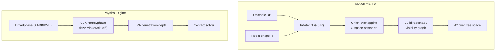
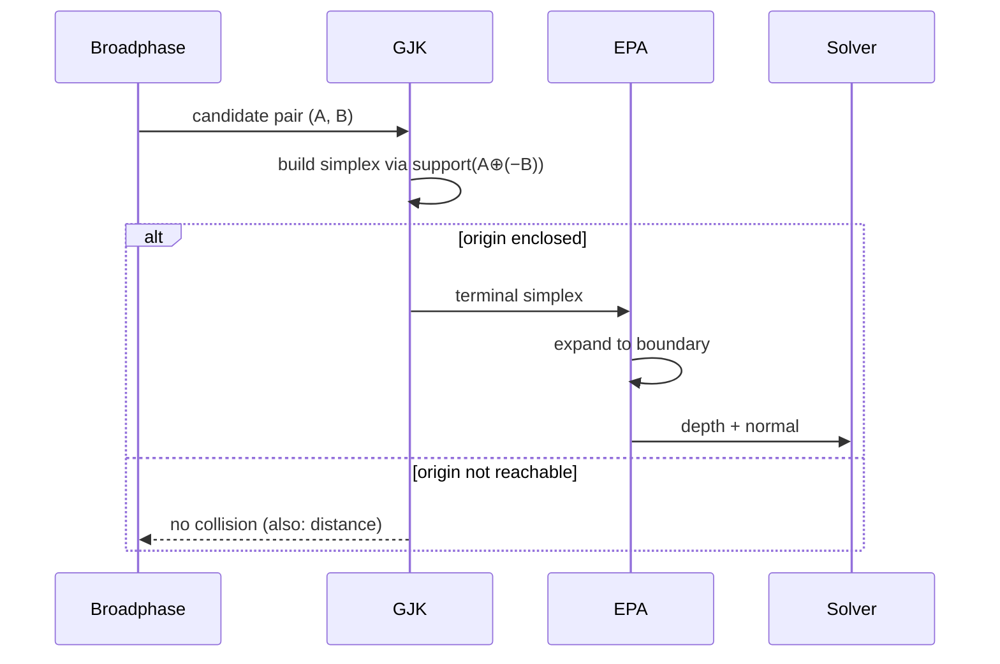
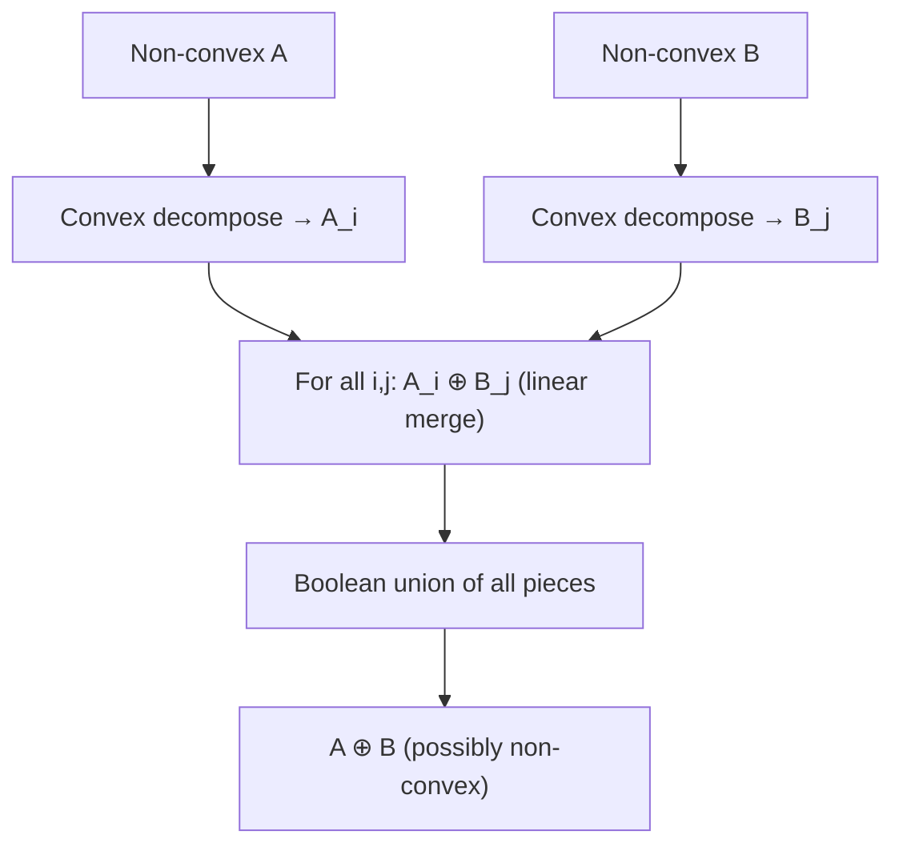
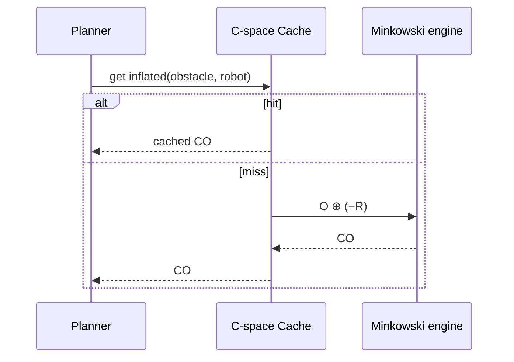
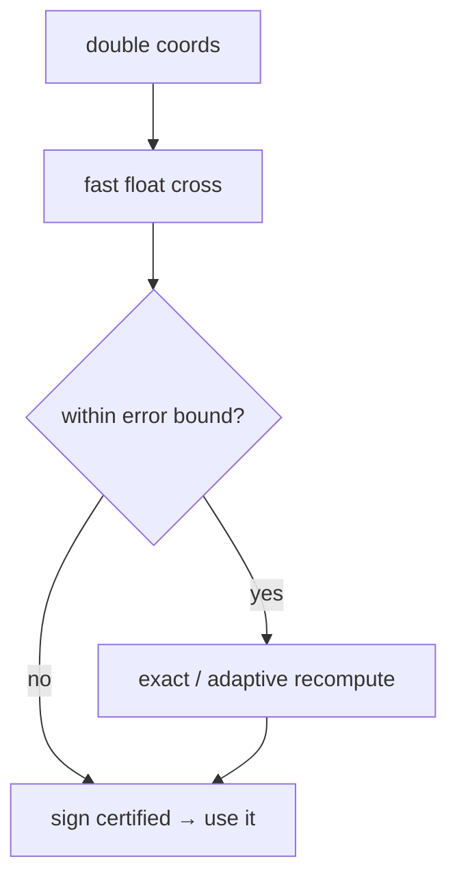

# Minkowski Sum of Convex Polygons — Senior Level

> **One-line summary:** In real systems the Minkowski sum is rarely materialized — it is *queried lazily* through support functions. Senior engineers wire it into **collision-detection engines (GJK + EPA)**, **robot/AGV motion planners** (configuration-space road maps), and **CAD/CAM offsetting** pipelines, while managing the two hard realities: **non-convex inputs require decomposition** (`O(n²m²)` worst case) and **floating-point geometry is fragile** without robust predicates.

---

## Table of Contents

1. [Introduction](#introduction)
2. [System Design with Minkowski Sums](#system-design-with-minkowski-sums)
3. [Collision Detection: GJK and EPA in Production](#collision-detection-gjk-and-epa)
4. [Non-Convex Inputs: Decomposition](#non-convex-inputs-decomposition)
5. [CAD/CAM Offsetting](#cadcam-offsetting)
6. [Comparison with Alternatives](#comparison-with-alternatives)
7. [Architecture Patterns](#architecture-patterns)
8. [Code Examples](#code-examples)
9. [Observability](#observability)
10. [Failure Modes](#failure-modes)
11. [Summary](#summary)

---

## Introduction

> Focus: "How to architect systems around the Minkowski sum?"

A naive view computes `A ⊕ B` as an explicit polygon and hands it downstream. Production systems almost never do this. Instead they exploit the support-function identity `support_{A⊕B}(d) = support_A(d) + support_B(d)` to answer queries — *is the origin inside?*, *what is the penetration depth?*, *how far apart are the shapes?* — **without ever building the sum polygon**. This lazy evaluation is the difference between a physics engine that ships and one that allocates millions of polygons per frame.

Three system domains dominate:

- **Real-time collision detection** (games, robotics, VR): GJK answers "do these convex shapes touch?" by sampling the Minkowski difference's support function; EPA recovers penetration depth and contact normal.
- **Motion planning** (mobile robots, AGVs, CNC, drones): inflate obstacles into configuration-space obstacles, then plan a point through free space.
- **CAD/CAM offsetting** (tool-path generation, clearance checks): offset a part by a tool radius — a Minkowski sum with a disk, approximated by a polygon or computed with arcs.

The senior skill is choosing *when* to materialize the sum, *when* to query it lazily, and *how* to keep the arithmetic robust.

---

## System Design with Minkowski Sums



The two pipelines share the same math (`A ⊕ (−B)`) but use it oppositely: the planner **materializes** inflated obstacles once (they are static), while the physics engine **queries lazily** every frame (shapes move).

---

## Collision Detection: GJK and EPA

### GJK — the origin test, done lazily

GJK (Gilbert–Johnson–Keerthi) decides whether two convex shapes intersect by asking whether `0 ∈ A ⊕ (−B)`. It never builds the Minkowski difference. Instead it uses a **support function**:

```text
support_{A⊕(−B)}(d) = support_A(d) − support_B(−d)
```

GJK iteratively builds a **simplex** (point → segment → triangle) of difference points, each chosen to make progress toward the origin, until it either encloses the origin (collision) or proves the origin is unreachable (no collision). It typically converges in a handful of support queries — `O(iterations × (n + m))` for support evaluation, often far better than building the whole sum.

### EPA — penetration depth

When GJK reports a collision, the **Expanding Polytope Algorithm (EPA)** continues from GJK's terminal simplex, expanding it toward the boundary of the Minkowski difference to find the closest boundary point to the origin. That closest point gives the **penetration depth** and **contact normal** the physics solver needs to push shapes apart.



### Why lazy beats materialized here

| | Materialize `A ⊕ (−B)` then test | GJK (lazy) |
|---|----------------------------------|-----------|
| Cost per pair | O(n + m) to build + O(n+m) test | O(k(n+m)), k ≈ small constant |
| Works in 3-D | Hard (3-D Minkowski sum is `O((nm)…)`) | Yes, same support-function code |
| Allocation | Allocates a polygon/polytope | Stack-only simplex |
| Distance when apart | Extra work | Falls out naturally |

In 3-D the materialized Minkowski sum is impractical, so GJK's support-only approach is essentially mandatory.

---

## Non-Convex Inputs: Decomposition

The linear merge assumes convex operands. For non-convex polygons:

```text
A = A₁ ∪ A₂ ∪ … ∪ A_p     (convex decomposition)
B = B₁ ∪ B₂ ∪ … ∪ B_q
A ⊕ B = ⋃_{i,j} (A_i ⊕ B_j)
```

You decompose each into convex pieces, sum every pair, and **union** the results. With `p`, `q` pieces and `n`, `m` total vertices, the worst case is `O(n²m²)` (each pairwise sum is up to `O(nᵢ + mⱼ)` vertices; there are `pq` of them, and unioning overlapping convex polygons is itself costly).

Decomposition choices:

- **Triangulation** — simplest, but produces many pieces (`O(n)` triangles), inflating `pq`.
- **Optimal convex decomposition** — fewest pieces; minimizes `pq` but is more expensive to compute (and NP-hard with Steiner points in some formulations; the no-Steiner version is polynomial via dynamic programming).
- **Approximate convex decomposition (ACD / V-HACD)** — used heavily in games/robotics; tolerates small concavities to keep piece counts low.



The practical lesson: **minimize the number of convex pieces.** Piece count dominates cost.

---

## CAD/CAM Offsetting

Offsetting a part outward by radius `r` is `part ⊕ disk(r)`; inward is the erosion `part ⊖ disk(r)`. Because a disk has infinitely many edge directions, exact offsetting produces **circular arcs** at convex corners and straight segments along edges:

- **Convex corner** → a circular arc of radius `r`.
- **Edge** → parallel segment offset by `r` along its outward normal.
- **Reflex corner (inward dent)** → segments may self-intersect; trim with a self-intersection cleanup (the classic "offsetting is hard near concavities" problem).

Most CAM systems approximate the disk by a regular `k`-gon and run the polygon Minkowski sum, then clean up. Choosing `k` trades accuracy (arc chord error `≈ r(1 − cos(π/k))`) against vertex count. Tool-path generation, sheet-metal bend allowances, and clearance verification all rest on this.

---

## Comparison with Alternatives

| Attribute | Lazy GJK (support fn) | Materialized Minkowski sum | SAT (separating axis) |
|-----------|----------------------|---------------------------|------------------------|
| Dimension | 2-D and 3-D | 2-D practical, 3-D hard | 2-D / 3-D convex |
| Output | Yes/no + distance/depth | Full sum polygon | Yes/no + axis |
| Cost (overlap test) | O(k(n+m)) | O(n+m) build + test | O(n+m) axes |
| Reuse for planning | No (per-pair) | Yes (static obstacles) | No |
| Best for | Dynamic collision | C-space preprocessing, offsetting | Few-vertex convex (boxes) |
| Production examples | Bullet, Box2D (distance), ODE | Robot planners, CGAL offsets | Many 2-D game engines |

**Rule of thumb:** static + reused → materialize; dynamic + per-frame → query lazily (GJK/SAT).

---

## Architecture Patterns

### Pattern: cached C-space obstacles



Inflated obstacles are pure functions of `(obstacle, robot shape)`. Cache them keyed by both; invalidate only when the robot's footprint or an obstacle changes. For a fleet of identical AGVs the inflation is computed once per obstacle.

### Pattern: broadphase before narrowphase

Never run GJK on every pair. A broadphase (AABB sweep-and-prune, BVH, or spatial hash) prunes to candidate pairs; only those reach the Minkowski-difference narrowphase.

---

## Code Examples

### Thread-safe, lazily-evaluated collision service (support-function GJK in 2-D)

#### Go

```go
package main

import (
	"math"
	"sync"
)

type V struct{ X, Y float64 }

func dot(a, b V) float64 { return a.X*b.X + a.Y*b.Y }
func sub(a, b V) V       { return V{a.X - b.X, a.Y - b.Y} }

// supportPoly returns the vertex of poly furthest along direction d.
func supportPoly(poly []V, d V) V {
	best := poly[0]
	bestDot := dot(best, d)
	for _, p := range poly[1:] {
		if x := dot(p, d); x > bestDot {
			best, bestDot = p, x
		}
	}
	return best
}

// support of the Minkowski difference A ⊕ (−B) along d.
func supportDiff(a, b []V, d V) V {
	return sub(supportPoly(a, d), supportPoly(b, V{-d.X, -d.Y}))
}

type CollisionService struct {
	mu sync.RWMutex
}

// Intersects runs a 2-D GJK origin test using only support queries.
func (cs *CollisionService) Intersects(a, b []V) bool {
	cs.mu.RLock()
	defer cs.mu.RUnlock()
	d := V{1, 0}
	simplex := []V{supportDiff(a, b, d)}
	d = V{-simplex[0].X, -simplex[0].Y}
	for i := 0; i < 64; i++ {
		p := supportDiff(a, b, d)
		if dot(p, d) < 0 {
			return false // no overlap: passed the origin without enclosing it
		}
		simplex = append(simplex, p)
		if contained, nd := handleSimplex(&simplex); contained {
			return true
		} else {
			d = nd
		}
	}
	return true // converged near the boundary → treat as touching
}

// handleSimplex updates the simplex toward the origin; returns (origin enclosed, new dir).
func handleSimplex(s *[]V) (bool, V) {
	simplex := *s
	if len(simplex) == 2 {
		a, b := simplex[1], simplex[0]
		ab, ao := sub(b, a), V{-a.X, -a.Y}
		d := tripleCross(ab, ao, ab)
		if d.X == 0 && d.Y == 0 {
			d = V{-ab.Y, ab.X}
		}
		return false, d
	}
	// triangle case
	a, b, c := simplex[2], simplex[1], simplex[0]
	ab, ac, ao := sub(b, a), sub(c, a), V{-a.X, -a.Y}
	abp := tripleCross(ac, ab, ab)
	acp := tripleCross(ab, ac, ac)
	if dot(abp, ao) > 0 {
		*s = []V{b, a}
		return false, abp
	}
	if dot(acp, ao) > 0 {
		*s = []V{c, a}
		return false, acp
	}
	return true, V{} // origin inside triangle
}

func tripleCross(a, b, c V) V {
	z := a.X*b.Y - a.Y*b.X
	return V{-c.Y * z, c.X * z}
}

func main() {
	a := []V{{0, 0}, {2, 0}, {2, 2}, {0, 2}}
	b := []V{{1, 1}, {3, 1}, {3, 3}, {1, 3}}
	cs := &CollisionService{}
	println("overlap:", cs.Intersects(a, b))
	_ = math.Pi
}
```

#### Java

```java
import java.util.*;

public class CollisionService {
    record V(double x, double y) {}
    static double dot(V a, V b) { return a.x * b.x + a.y * b.y; }
    static V sub(V a, V b) { return new V(a.x - b.x, a.y - b.y); }
    static V neg(V a) { return new V(-a.x, -a.y); }

    static V support(List<V> poly, V d) {
        V best = poly.get(0); double bd = dot(best, d);
        for (V p : poly) { double x = dot(p, d); if (x > bd) { best = p; bd = x; } }
        return best;
    }
    static V supportDiff(List<V> a, List<V> b, V d) {
        return sub(support(a, d), support(b, neg(d)));
    }
    static V tripleCross(V a, V b, V c) {
        double z = a.x * b.y - a.y * b.x;
        return new V(-c.y * z, c.x * z);
    }

    public synchronized boolean intersects(List<V> a, List<V> b) {
        V d = new V(1, 0);
        List<V> s = new ArrayList<>(List.of(supportDiff(a, b, d)));
        d = neg(s.get(0));
        for (int i = 0; i < 64; i++) {
            V p = supportDiff(a, b, d);
            if (dot(p, d) < 0) return false;
            s.add(p);
            V[] res = handle(s);
            if (res == null) return true;
            d = res[0];
        }
        return true;
    }

    private V[] handle(List<V> s) {
        if (s.size() == 2) {
            V a = s.get(1), b = s.get(0);
            V ab = sub(b, a), ao = neg(a);
            V d = tripleCross(ab, ao, ab);
            if (d.x() == 0 && d.y() == 0) d = new V(-ab.y(), ab.x());
            return new V[]{d};
        }
        V a = s.get(2), b = s.get(1), c = s.get(0);
        V ab = sub(b, a), ac = sub(c, a), ao = neg(a);
        V abp = tripleCross(ac, ab, ab), acp = tripleCross(ab, ac, ac);
        if (dot(abp, ao) > 0) { s.clear(); s.add(b); s.add(a); return new V[]{abp}; }
        if (dot(acp, ao) > 0) { s.clear(); s.add(c); s.add(a); return new V[]{acp}; }
        return null;
    }

    public static void main(String[] args) {
        var a = List.of(new V(0,0), new V(2,0), new V(2,2), new V(0,2));
        var b = List.of(new V(1,1), new V(3,1), new V(3,3), new V(1,3));
        System.out.println("overlap: " + new CollisionService().intersects(a, b));
    }
}
```

#### Python

```python
import threading


def dot(a, b): return a[0] * b[0] + a[1] * b[1]
def sub(a, b): return (a[0] - b[0], a[1] - b[1])
def neg(a): return (-a[0], -a[1])


def support(poly, d):
    return max(poly, key=lambda p: dot(p, d))


def support_diff(a, b, d):
    return sub(support(a, d), support(b, neg(d)))


def triple_cross(a, b, c):
    z = a[0] * b[1] - a[1] * b[0]
    return (-c[1] * z, c[0] * z)


class CollisionService:
    def __init__(self):
        self._lock = threading.RLock()

    def intersects(self, a, b):
        with self._lock:
            d = (1.0, 0.0)
            simplex = [support_diff(a, b, d)]
            d = neg(simplex[0])
            for _ in range(64):
                p = support_diff(a, b, d)
                if dot(p, d) < 0:
                    return False
                simplex.append(p)
                contained, d = self._handle(simplex)
                if contained:
                    return True
            return True

    def _handle(self, simplex):
        if len(simplex) == 2:
            a, b = simplex[1], simplex[0]
            ab, ao = sub(b, a), neg(a)
            d = triple_cross(ab, ao, ab)
            if d == (0, 0):
                d = (-ab[1], ab[0])
            return False, d
        a, b, c = simplex[2], simplex[1], simplex[0]
        ab, ac, ao = sub(b, a), sub(c, a), neg(a)
        abp, acp = triple_cross(ac, ab, ab), triple_cross(ab, ac, ac)
        if dot(abp, ao) > 0:
            simplex[:] = [b, a]
            return False, abp
        if dot(acp, ao) > 0:
            simplex[:] = [c, a]
            return False, acp
        return True, (0, 0)


if __name__ == "__main__":
    a = [(0, 0), (2, 0), (2, 2), (0, 2)]
    b = [(1, 1), (3, 1), (3, 3), (1, 3)]
    print("overlap:", CollisionService().intersects(a, b))
```

**What it does:** a thread-safe collision service that decides overlap of two convex polygons using only support-function queries on the Minkowski difference — no sum polygon is ever built.

---

## Production Case Studies

### Case 1 — Warehouse AGV fleet (motion planning)

A fleet of identical automated guided vehicles (AGVs) navigates a static warehouse. Footprint `R` is the same for every robot, so the inflation `O ⊕ (−R)` is computed **once per obstacle** and cached for the whole fleet. The free space is meshed into a roadmap (a navigation graph); each AGV runs A* over the same roadmap. When a robot carries an oversized load, its footprint changes — the system swaps to a *second* set of inflated obstacles keyed by the load profile. Key engineering decisions:

- **Materialize, don't query.** Obstacles are static; computing inflated polygons once amortizes across thousands of path queries.
- **Cache key = (obstacle id, footprint hash).** Load changes invalidate only the affected key set.
- **Union overlapping C-space obstacles** so the roadmap sees a single connected free region, not overlapping holes.

### Case 2 — 2-D game physics (collision)

A platformer with thousands of moving convex colliders. Shapes move every frame, so inflation is pointless. The engine runs sweep-and-prune broadphase, then **GJK distance** between non-overlapping pairs (for "about to touch" triggers) and **GJK+EPA** for resolving penetrations. Temporal coherence: the previous frame's simplex / separating axis is reused as a warm start, cutting average GJK iterations to 1–2.

### Case 3 — CNC tool-path / CAM offsetting

A milling part is offset outward by the tool radius to generate the cutter centerline. The disk is approximated by a 64-gon (chord error `r(1−cos(π/64)) ≈ 0.0012·r`, sub-thou for typical radii). After the Minkowski sum, a self-intersection cleanup pass removes invalid loops at reflex corners. For finishing passes requiring exact arcs, the system carries true circular-arc geometry instead of a polygon approximation.

### Decision matrix: materialize vs query lazily

| Situation | Static geometry? | Reused many times? | Choice |
|-----------|------------------|--------------------|--------|
| AGV obstacle inflation | Yes | Yes (per query) | Materialize + cache |
| Per-frame moving colliders | No | No | Lazy GJK |
| One-shot offset for export | Yes | No | Materialize once |
| Distance field / clearance map | Yes | Yes | Materialize (precompute) |
| Continuous collision (swept) | No | No | Lazy + conservative advancement |

---

## Scaling and Concurrency Considerations

- **Embarrassingly parallel inflation.** Each obstacle's `O ⊕ (−R)` is independent; fan out across a worker pool, then merge into the roadmap. The union step is the only serial bottleneck — partition the plane and union per-cell.
- **Read-mostly C-space.** Inflated obstacles change rarely; guard them with a read–write lock (readers = planners, writers = obstacle updates) as shown in the collision service code above.
- **Narrowphase is per-pair independent.** GJK calls parallelize across the candidate-pair list; the broadphase that produces that list is the coordination point.
- **Memory.** Lazy GJK allocates only a tiny simplex (stack); materialized inflation allocates `O(n+m)` per obstacle — budget accordingly for large maps.

---

## Observability

| Metric | What it tells you | Alert threshold |
|--------|-------------------|-----------------|
| `gjk_iterations_avg` | Convergence health of the narrowphase | > 20 (degenerate shapes / bad tolerances) |
| `gjk_nonconvergence_rate` | Fraction hitting the iteration cap | > 0.1% |
| `cspace_inflation_ms` | Cost of building inflated obstacles | > planning budget |
| `convex_pieces_per_shape` | Decomposition bloat | > 32 (re-decompose) |
| `offset_self_intersections` | Robustness of CAD offsetting | > 0 unexpected |
| `narrowphase_pairs` / `broadphase_pairs` | Broadphase pruning quality | ratio > 0.5 (weak broadphase) |

---

## Robustness Engineering

Geometry code lives or dies on numerical robustness. Senior-level hardening:

- **Choose the arithmetic regime deliberately.** Integer coordinates with 64-bit (or 128-bit) cross products are *exact* and the safest default for offline/CAD pipelines. Floating-point is unavoidable in real-time engines — pair it with tolerances tuned to the coordinate magnitude.
- **Robust orientation predicates.** When you must use doubles, the cross-product sign near degeneracy can flip. Use adaptive-precision predicates (Shewchuk's `orient2d`, or a CGAL exact kernel) that compute a fast floating-point estimate and fall back to exact arithmetic only when the result is within the rounding-error bound.
- **GJK margins.** Treat `|⟨p, d⟩| < ε` as a boundary touch so the simplex search terminates at near-degenerate contacts instead of cycling. Add an iteration cap (e.g. 32–64) as a backstop.
- **Snap-rounding for unions.** When unioning many decomposed pieces, snap-round vertices to a grid to avoid sliver polygons and inconsistent intersection points.
- **Validate orientation at the boundary.** Reject or auto-correct clockwise inputs (signed area `< 0`) before any merge; a silently-inverted polygon produces a non-convex "sum" with no error.



---

## Extending to 3-D

Everything above is 2-D, but the same ideas scale — with one big caveat.

- **Explicit 3-D Minkowski sum is expensive.** The sum of two convex polytopes with `n`, `m` faces has `Θ(nm)` complexity, computed by merging face normals on the Gauss sphere (the 3-D analogue of the angular merge). Materializing it is rarely worth it.
- **GJK/EPA are dimension-agnostic.** The support identity `support_{A⊕(−B)}(d) = support_A(d) − support_B(−d)` holds verbatim in 3-D. The *same* collision code that worked in 2-D works in 3-D by swapping the support function and the simplex handler (tetrahedron instead of triangle). This is the decisive reason production engines never materialize the 3-D sum.
- **C-space grows a dimension per rotational DOF.** A translating-and-rotating rigid body in the plane has a 3-D configuration space `(x, y, θ)`; a free-flying body in 3-D has a 6-D one. Inflated obstacles become 3-D/6-D regions, usually sampled rather than computed exactly (this motivates sampling-based planners like RRT and PRM).

| | 2-D | 3-D |
|---|-----|-----|
| Explicit sum complexity | O(n + m) | Θ(nm) |
| Materialize in practice? | Often (static) | Rarely |
| GJK/EPA | Triangle simplex | Tetrahedron simplex |
| Translation C-space | 2-D | 3-D |
| Rigid-body C-space | 3-D (x,y,θ) | 6-D (pose) |

---

## Failure Modes

- **Floating-point degeneracy:** near-collinear edges flip cross-product signs, producing non-convex "sums" or GJK that oscillates. Mitigation: exact/robust predicates (Shewchuk), epsilon tolerances tuned to coordinate magnitude, or integer/rational arithmetic for offline computation.
- **GJK non-termination:** numerically, the simplex can cycle near the boundary. Mitigation: iteration cap + a small margin so touching counts as overlap.
- **Decomposition explosion:** a non-convex robot with many notches yields huge `pq`. Mitigation: approximate convex decomposition (V-HACD) with a concavity tolerance.
- **Offset self-intersection at reflex vertices:** inward offsets fold over. Mitigation: arc joins + a Boolean cleanup pass to remove invalid loops.
- **Stale C-space cache:** robot footprint changed (load attached) but inflated obstacles not invalidated. Mitigation: key the cache on footprint hash.
- **Rotation ignored:** translation-only C-space is wrong if the robot rotates. Mitigation: 3-D C-space `(x, y, θ)` with per-orientation slices.

---

## Summary

At senior level the Minkowski sum stops being a polygon you build and becomes a **support-function you query**. Collision engines use lazy GJK (origin test on `A ⊕ (−B)`) plus EPA for penetration; motion planners *materialize* inflated obstacles once and cache them to reduce robots to points; CAD offsetting Minkowski-sums with a disk and cleans up arcs and self-intersections. The two recurring hazards are **non-convex inputs** (decompose, then sum pairwise and union — `O(n²m²)` worst case, so minimize piece count) and **numerical fragility** (use robust predicates and tolerances). Architect by separating static, materialized inflation from dynamic, per-frame lazy queries, and always pair a broadphase with the narrowphase.

---

Next step: [professional.md](./professional.md) — the `O(n+m)` correctness proof, why the sum is provably convex, the GJK origin-test argument, and the `O(n²m²)` non-convex complexity bound.
