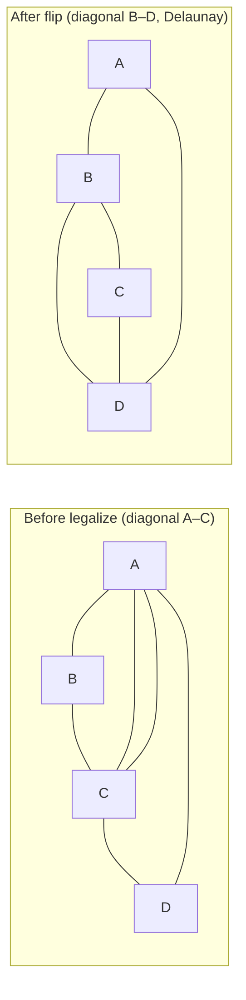
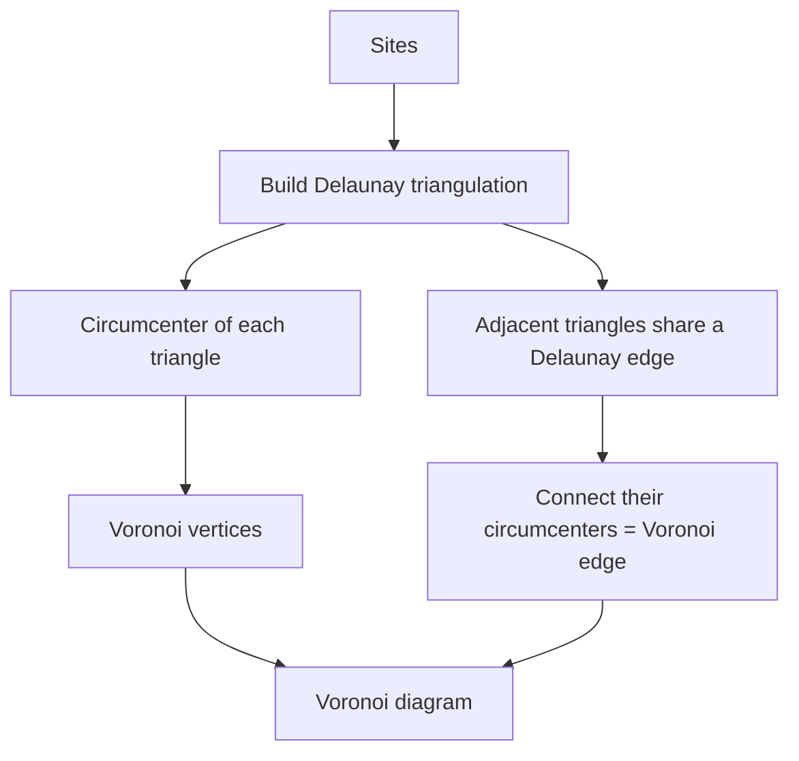

# Voronoi Diagram & Delaunay Triangulation — Junior Level

> **One-line summary:** Given a set of points ("sites") in the plane, the **Voronoi diagram** carves the plane into one cell per site — each cell is the region of all locations closest to that site. The **Delaunay triangulation** is its *dual*: connect two sites whenever their cells touch, and you get a triangle mesh with the magic **empty-circumcircle property** — no site lies strictly inside any triangle's circumscribed circle. The two structures are two views of the same information and are built in `O(n log n)`.

---

## Table of Contents

1. [Introduction](#introduction)
2. [Prerequisites](#prerequisites)
3. [Glossary](#glossary)
4. [Geometry Primitives](#geometry-primitives)
5. [Core Concepts](#core-concepts)
6. [Big-O Summary](#big-o-summary)
7. [Real-World Analogies](#real-world-analogies)
8. [Pros & Cons](#pros--cons)
9. [Step-by-Step Walkthrough](#step-by-step-walkthrough)
10. [Code Examples](#code-examples)
11. [Coding Patterns](#coding-patterns)
12. [Error Handling](#error-handling)
13. [Performance Tips](#performance-tips)
14. [Best Practices](#best-practices)
15. [Edge Cases & Pitfalls](#edge-cases--pitfalls)
16. [Common Mistakes](#common-mistakes)
17. [Cheat Sheet](#cheat-sheet)
18. [Visual Animation](#visual-animation)
19. [Summary](#summary)
20. [Further Reading](#further-reading)

---

## Introduction

Imagine dropping a handful of cell-phone towers onto a map. A natural question follows immediately: *for any spot in the city, which tower is the nearest?* If you color every spot by the tower closest to it, the map splits into patches — one patch per tower. Those patches are the **Voronoi cells**, and the whole colored map is the **Voronoi diagram**.

Formally, given a finite set of points `P = {p1, p2, ..., pn}` called **sites**, the Voronoi cell of site `pi` is:

```
cell(pi) = { all points q in the plane such that
             dist(q, pi) <= dist(q, pj) for every other site pj }
```

In words: *the cell of a site is everywhere that site wins the "who is closest" contest.* The boundary between two neighboring cells is exactly the **perpendicular bisector** of the segment joining the two sites — the set of points equidistant from both. Where three cells meet you get a **Voronoi vertex**, equidistant from three sites.

Now flip your viewpoint. Instead of drawing the *boundaries*, draw a line connecting two sites whenever their cells share an edge. That graph of connections is the **Delaunay triangulation**. It is the geometric **dual** of the Voronoi diagram: Voronoi *cells* ↔ Delaunay *vertices*, Voronoi *edges* ↔ Delaunay *edges*, Voronoi *vertices* ↔ Delaunay *triangles*. One diagram, two pictures.

The Delaunay triangulation has a beautiful, defining property — the **empty-circumcircle property**:

> For every triangle in the Delaunay triangulation, the unique circle passing through its three corners (its **circumcircle**) contains **no other site** strictly inside it.

This single rule makes Delaunay triangles "as fat as possible": it provably **maximizes the minimum angle** over all triangulations, so you never get thin, sliver triangles unless the points force it. That is exactly what you want when meshing a surface for physics simulation or rendering a terrain.

These two structures are among the most useful objects in all of computational geometry. They power nearest-neighbor search, mesh generation for engineering simulation (FEM), terrain modeling (TINs), spatial interpolation, robot path planning, and much more. This file teaches the *what* and *how* with a small worked example; later levels explain *why* the math works and *how* to scale and harden it.

---

## Prerequisites

Before reading this file you should be comfortable with:

- **Points and vectors** — a point is a pair `(x, y)`; a vector is the difference of two points.
- **Distance** — Euclidean distance `dist(a, b) = sqrt((ax-bx)^2 + (ay-by)^2)`. We usually compare *squared* distances to avoid `sqrt`.
- **The orientation / cross-product test** — given three points A, B, C, the sign of the cross product `(B-A) × (C-A)` tells you whether A→B→C turns left, right, or goes straight. (See sibling topic *01-convex-hull*.)
- **Triangles and circles** — a triangle has a unique **circumcircle** through its three corners; its center is the **circumcenter**.
- **Big-O notation** — `O(n)`, `O(n log n)`, `O(n^2)`.
- **A graph / adjacency list** — the Delaunay triangulation is a planar graph.

Optional but helpful:

- Familiarity with sibling topics *01-convex-hull* (the lifting trick reuses hulls) and *05-sweep-line* (Fortune's algorithm is a sweep).
- Knowing what a **determinant** is — the key test is a small determinant.

---

## Glossary

| Term | Meaning |
|------|---------|
| **Site** | One of the input points `pi` we build the diagram around. |
| **Voronoi cell** | The region of all locations whose nearest site is `pi`. Always a convex polygon (possibly unbounded). |
| **Voronoi edge** | A boundary segment between two cells; lies on the perpendicular bisector of two sites. |
| **Voronoi vertex** | A point where three (generically) cells meet; equidistant from three sites. |
| **Perpendicular bisector** | The line of all points equidistant from two given points. |
| **Delaunay triangulation (DT)** | The dual graph: connect two sites whose cells share an edge → a triangulation of the sites. |
| **Dual** | A correspondence swapping the roles of cells/vertices/edges between the two diagrams. |
| **Circumcircle** | The unique circle through a triangle's three corners. |
| **Circumcenter** | The center of the circumcircle = a Voronoi vertex. |
| **Empty-circumcircle property** | No site lies strictly inside any Delaunay triangle's circumcircle. The defining rule. |
| **In-circle test** | A predicate: "is point D inside the circumcircle of triangle A,B,C?" computed as the sign of a 4×4 determinant. |
| **Edge flip** | Swapping the shared diagonal of two adjacent triangles forming a quadrilateral, to restore the empty-circle rule. |
| **Convex position** | When sites lie on a convex polygon — a degenerate case with many valid triangulations. |
| **Cocircular points** | Four or more sites on a common circle — a degenerate case. |

---

## Geometry Primitives

Everything in this topic is built on a couple of tiny primitives. Get these right and the rest follows.

### The orientation (cross-product) test

For three points `A`, `B`, `C`, define

```
cross(A, B, C) = (B.x - A.x) * (C.y - A.y) - (B.y - A.y) * (C.x - A.x)
```

- `> 0` → A→B→C turns **left** (counter-clockwise, CCW)
- `< 0` → turns **right** (clockwise, CW)
- `= 0` → the three points are **collinear**

We use this to keep triangles consistently oriented (CCW) and to test point-in-triangle.

### The circumcircle

A triangle `(A, B, C)` (not collinear) has a unique circle through all three corners. Its center, the **circumcenter**, is found by intersecting the perpendicular bisectors of two sides. The circumcenter is *exactly* the Voronoi vertex shared by the three cells of A, B, C.

### The in-circle test (the star of the show)

The single most important predicate is: *given a triangle `(A, B, C)` listed CCW and a fourth point `D`, is `D` strictly inside the circumcircle of `(A, B, C)`?* It is the sign of this 4×4 determinant:

```
            | Ax  Ay  Ax²+Ay²  1 |
inCircle =  | Bx  By  Bx²+By²  1 |
            | Cx  Cy  Cx²+Cy²  1 |
            | Dx  Dy  Dx²+Dy²  1 |
```

If `(A,B,C)` is CCW: `> 0` ⇒ D is **inside**, `< 0` ⇒ **outside**, `= 0` ⇒ D is **on** the circle (cocircular). A triangulation is Delaunay exactly when **no** in-circle test against a triangle's three neighbors comes back "inside."

We will not expand the determinant by hand at this level — every code example below computes it directly. Just remember: **one determinant decides whether an edge should flip.**

---

## Core Concepts

### 1. The Voronoi diagram: closest-site regions

Stand anywhere on the map. Whoever the nearest site is, that is the cell you are in. The boundaries between cells are perpendicular bisectors because a point on the boundary is *tied* — equidistant from two sites. Three-way ties are isolated points (Voronoi vertices). For `n` sites the diagram has `O(n)` cells, edges, and vertices — it is a planar structure, so it stays small.

### 2. The Delaunay triangulation: the dual mesh

Connect two sites whenever their Voronoi cells are neighbors. Because the Voronoi diagram is planar with degree-3 vertices (generically), the dual is a **triangulation** that covers the convex hull of the sites. The corners of every Delaunay triangle are three sites whose three cells meet at one Voronoi vertex — and that vertex is the triangle's circumcenter.

### 3. The empty-circumcircle property

This is the rule that *defines* Delaunay. Draw any triangle's circumcircle: if some other site sits strictly inside, the triangle is **illegal** and must be fixed (by flipping an edge). When every triangle's circumcircle is empty, the triangulation is Delaunay. Equivalent statements you will hear:

- **Empty-circle:** no site inside any circumcircle.
- **Max-min angle:** among all triangulations of the points, Delaunay makes the smallest angle as large as possible — it avoids slivers.
- **Local Delaunay:** for every internal edge shared by two triangles, neither triangle's circumcircle contains the opposite vertex.

These three are equivalent (the equivalence is proven in `professional.md`).

### 4. Duality, in one table

| Voronoi diagram | ↔ | Delaunay triangulation |
|-----------------|---|------------------------|
| Site (cell) | ↔ | Vertex |
| Edge between two cells | ↔ | Edge between two sites |
| Vertex (3 cells meet) | ↔ | Triangle (3 sites) |
| Vertex location = circumcenter | ↔ | The triangle it is dual to |
| Unbounded cell | ↔ | Site on the convex hull |

Build one, and you essentially have the other.

### 5. How we construct them

Two families of algorithms appear at this level; deeper construction lives in `middle.md`/`professional.md`:

- **Bowyer–Watson (incremental):** insert sites one at a time. Each new site "deletes" all triangles whose circumcircle contains it, leaving a star-shaped hole, then re-triangulates the hole back to the new point. Simple to code; `O(n^2)` worst case, near `O(n log n)` with good point order.
- **Fortune's sweep line:** sweep a line down the plane maintaining a "beach line" of parabolic arcs; emit Voronoi edges as arcs appear and disappear. Optimal `O(n log n)` for the Voronoi diagram. (See *05-sweep-line*.)

The example below uses **Bowyer–Watson** because it is the easiest to read.

---

## Big-O Summary

| Operation / Algorithm | Time | Space | Notes |
|-----------------------|------|-------|-------|
| Voronoi via Fortune's sweep | **O(n log n)** | O(n) | Optimal; the gold standard. |
| Delaunay, randomized incremental | **O(n log n)** expected | O(n) | With good randomization + point location. |
| Delaunay, Bowyer–Watson naive | **O(n^2)** worst | O(n) | Simple; fine for small/medium `n`. |
| Delaunay, divide & conquer | **O(n log n)** | O(n) | Guibas–Stolfi; tricky to code. |
| In-circle test | **O(1)** | O(1) | One 4×4 determinant. |
| Single edge flip | **O(1)** | O(1) | Swap a diagonal between two triangles. |
| Output size (cells/edges/triangles) | **O(n)** | O(n) | Both diagrams are linear in `n`. |
| Lower bound (any algorithm) | **Ω(n log n)** | — | Sorting reduces to it (see `professional.md`). |

> Both diagrams have only `O(n)` features even though there are `O(n^2)` *pairs* of sites — most pairs are simply not neighbors. That is why the output is small and the algorithms can be fast.

---

## Real-World Analogies

| Concept | Analogy |
|---------|---------|
| Voronoi cell | The "delivery zone" of the nearest pizza shop: every address goes to whichever shop is closest. |
| Voronoi edge | The street where two shops are exactly tied — customers there could go either way. |
| Voronoi vertex | A street corner equidistant from three shops at once. |
| Delaunay edge | A "natural neighbor" relationship: two shops whose zones touch are rivals on the same border. |
| Empty-circumcircle | A fair refereeing rule: a triangle of three shops is "valid" only if no fourth shop is closer to their meeting point. |
| Edge flip | Two neighboring triangles realize their shared wall is in the wrong place, so they swap the diagonal to make fatter triangles. |
| Max-min angle | Choosing the triangulation that avoids long thin "sliver" triangles — like preferring sturdy near-equilateral tiles over flimsy splinters. |

Where the analogies break: real delivery zones use road distance, not straight-line distance; Voronoi assumes pure Euclidean distance, so the cells are exact polygons rather than messy road-network shapes.

---

## Pros & Cons

| Pros | Cons |
|------|------|
| Linear-size output (`O(n)`) even for huge point sets. | Construction is subtle; naive code is `O(n^2)` and easy to get wrong. |
| Delaunay maximizes the minimum angle → great-quality meshes, no slivers. | **Numerical robustness** of the in-circle/orientation tests is genuinely hard (see `senior.md`). |
| One structure answers many queries: nearest neighbor, EMST, largest empty circle. | Degenerate inputs (collinear / cocircular points) need special handling. |
| `O(n log n)` optimal algorithms exist (Fortune, divide & conquer). | Extending cleanly to 3D and beyond multiplies the difficulty and the output size. |
| Voronoi ↔ Delaunay duality lets you compute one and read off the other. | Constrained variants (forcing certain edges) are a separate, harder problem. |
| Connects to the convex hull via the **3D lifting** trick (an elegant unification). | Floating-point error can produce inconsistent, non-planar output if predicates aren't exact. |

**When to use:** nearest-neighbor / "natural neighbor" problems, mesh generation for FEM, terrain models (TIN), spatial interpolation, facility-location and coverage analysis, motion planning.

**When NOT to use:** when distance is *not* Euclidean (road networks, graphs — use graph algorithms instead), or when you only need a single nearest neighbor query and a k-d tree (*04-kd-tree*) already suffices.

---

## Step-by-Step Walkthrough

Let us build a Delaunay triangulation of four sites with **Bowyer–Watson**, then read off the Voronoi diagram. Sites:

```
A = (0, 0)
B = (4, 0)
C = (4, 4)
D = (0, 4)
```

They form a unit-ish square. There are two ways to triangulate a square — split along diagonal `A–C` or diagonal `B–D`. Delaunay must pick the one obeying the empty-circle rule.

**Step 0 — super-triangle.** Bowyer–Watson starts with one huge triangle containing every site (so every insertion has a triangle to land in). Call its corners `S1, S2, S3`, far away.

**Step 1 — insert A.** `A` lands inside the super-triangle. Its circumcircle "bad set" is just the super-triangle. Delete it, re-triangulate the hole around `A`. (Details of the super-triangle are bookkeeping; we focus on the real sites below.)

**Step 2 — after inserting A, B, C, D**, suppose at some point we have the two triangles `(A, B, C)` and `(A, C, D)` — i.e. the square split along diagonal `A–C`.

**Step 3 — legalize.** Check the shared edge `A–C`. Triangle `(A, B, C)`'s circumcircle: the square's diagonal is `A–C`, and for an axis-aligned square the circumcircle of `(A,B,C)` passes through all four corners (the four corners are **cocircular** — they lie on one circle of radius `2√2` centered at `(2,2)`). Run the in-circle test of `D` against `(A,B,C)`:

```
inCircle(A, B, C, D) = 0   →  D lies exactly ON the circumcircle (cocircular)
```

A zero means **degenerate**: both diagonals are equally valid Delaunay triangulations. Either `A–C` or `B–D` is acceptable; implementations break the tie by a fixed rule. Let us instead perturb `C` slightly to `(4, 5)` to see a *real* flip.

**Re-run with `C = (4, 5)`.** Now the four points are not cocircular. Say we again start with diagonal `A–C` giving triangles `(A,B,C)` and `(A,C,D)`. Test:

```
inCircle(A, B, C, D):
  A=(0,0) B=(4,0) C=(4,5) D=(0,4), with (A,B,C) oriented CCW
  → determinant > 0  →  D is INSIDE the circumcircle of (A,B,C)  →  ILLEGAL edge
```

Because `D` is inside, edge `A–C` is illegal. **Flip it** to `B–D`: replace triangles `(A,B,C)` and `(A,C,D)` with `(A,B,D)` and `(B,C,D)`.

**Step 4 — re-check.** Test the new edge `B–D`:

```
inCircle(A, B, D, C):  → determinant < 0  →  C is OUTSIDE  →  edge B–D is legal
```

No more illegal edges. The Delaunay triangulation is the two triangles `(A,B,D)` and `(B,C,D)`, diagonal `B–D`.

**Read off the Voronoi diagram.** Each triangle's circumcenter is a Voronoi vertex; dual edges connect circumcenters of triangles sharing a Delaunay edge, and each Delaunay edge corresponds to a Voronoi edge on the perpendicular bisector of its two endpoints. The shared diagonal `B–D` means cells of `B` and `D` are neighbors; the perpendicular bisector of `B–D` is their common Voronoi edge.



The takeaway: **start with any triangulation, then keep flipping illegal edges (in-circle says "inside") until none remain.** That loop *is* the algorithm.

---

## Code Examples

### Example: Bowyer–Watson Delaunay triangulation + circumcenters (Voronoi vertices)

The code inserts sites one at a time, deletes triangles whose circumcircle contains the new site, and re-triangulates the resulting cavity. A super-triangle bootstraps the process and is removed at the end.

#### Go

```go
package main

import (
	"fmt"
	"math"
)

type Point struct{ X, Y float64 }

type Triangle struct{ A, B, C Point }

// circumcircle returns the circumcenter and squared radius of triangle t.
func circumcircle(t Triangle) (Point, float64) {
	ax, ay := t.A.X, t.A.Y
	bx, by := t.B.X, t.B.Y
	cx, cy := t.C.X, t.C.Y
	d := 2 * (ax*(by-cy) + bx*(cy-ay) + cx*(ay-by))
	ux := ((ax*ax+ay*ay)*(by-cy) + (bx*bx+by*by)*(cy-ay) + (cx*cx+cy*cy)*(ay-by)) / d
	uy := ((ax*ax+ay*ay)*(cx-bx) + (bx*bx+by*by)*(ax-cx) + (cx*cx+cy*cy)*(bx-ax)) / d
	center := Point{ux, uy}
	r2 := (ax-ux)*(ax-ux) + (ay-uy)*(ay-uy)
	return center, r2
}

// inCircumcircle reports whether p lies strictly inside t's circumcircle.
func inCircumcircle(t Triangle, p Point) bool {
	center, r2 := circumcircle(t)
	dx, dy := p.X-center.X, p.Y-center.Y
	return dx*dx+dy*dy < r2-1e-9
}

type Edge struct{ A, B Point }

func sameEdge(e, f Edge) bool {
	return (e.A == f.A && e.B == f.B) || (e.A == f.B && e.B == f.A)
}

// BowyerWatson returns the Delaunay triangulation of pts.
func BowyerWatson(pts []Point) []Triangle {
	// Super-triangle large enough to contain all points.
	const M = 1e6
	super := Triangle{Point{-M, -M}, Point{M, -M}, Point{0, M}}
	tris := []Triangle{super}

	for _, p := range pts {
		var bad []Triangle
		for _, t := range tris {
			if inCircumcircle(t, p) {
				bad = append(bad, t)
			}
		}
		// Collect boundary edges of the cavity (edges used by exactly one bad triangle).
		var boundary []Edge
		for i, t := range bad {
			for _, e := range []Edge{{t.A, t.B}, {t.B, t.C}, {t.C, t.A}} {
				shared := false
				for j, u := range bad {
					if i == j {
						continue
					}
					for _, f := range []Edge{{u.A, u.B}, {u.B, u.C}, {u.C, u.A}} {
						if sameEdge(e, f) {
							shared = true
						}
					}
				}
				if !shared {
					boundary = append(boundary, e)
				}
			}
		}
		// Remove bad triangles.
		var kept []Triangle
		for _, t := range tris {
			isBad := false
			for _, b := range bad {
				if t == b {
					isBad = true
				}
			}
			if !isBad {
				kept = append(kept, t)
			}
		}
		// Re-triangulate the cavity to p.
		for _, e := range boundary {
			kept = append(kept, Triangle{e.A, e.B, p})
		}
		tris = kept
	}

	// Drop triangles touching the super-triangle.
	isSuper := func(p Point) bool { return math.Abs(p.X) == M || p.Y == M }
	var out []Triangle
	for _, t := range tris {
		if isSuper(t.A) || isSuper(t.B) || isSuper(t.C) {
			continue
		}
		out = append(out, t)
	}
	return out
}

func main() {
	pts := []Point{{0, 0}, {4, 0}, {4, 5}, {0, 4}}
	dt := BowyerWatson(pts)
	for _, t := range dt {
		c, _ := circumcircle(t)
		fmt.Printf("triangle %v %v %v  circumcenter (Voronoi vertex) = (%.2f, %.2f)\n",
			t.A, t.B, t.C, c.X, c.Y)
	}
}
```

#### Java

```java
import java.util.*;

public class Delaunay {
    record Point(double x, double y) {}
    record Triangle(Point a, Point b, Point c) {}
    record Edge(Point a, Point b) {
        boolean same(Edge o) {
            return (a.equals(o.a) && b.equals(o.b)) || (a.equals(o.b) && b.equals(o.a));
        }
    }

    static double[] circumcircle(Triangle t) { // returns {cx, cy, r2}
        double ax = t.a().x(), ay = t.a().y();
        double bx = t.b().x(), by = t.b().y();
        double cx = t.c().x(), cy = t.c().y();
        double d = 2 * (ax * (by - cy) + bx * (cy - ay) + cx * (ay - by));
        double ux = ((ax*ax+ay*ay)*(by-cy) + (bx*bx+by*by)*(cy-ay) + (cx*cx+cy*cy)*(ay-by)) / d;
        double uy = ((ax*ax+ay*ay)*(cx-bx) + (bx*bx+by*by)*(ax-cx) + (cx*cx+cy*cy)*(bx-ax)) / d;
        double r2 = (ax-ux)*(ax-ux) + (ay-uy)*(ay-uy);
        return new double[]{ux, uy, r2};
    }

    static boolean inCircumcircle(Triangle t, Point p) {
        double[] cc = circumcircle(t);
        double dx = p.x() - cc[0], dy = p.y() - cc[1];
        return dx*dx + dy*dy < cc[2] - 1e-9;
    }

    static List<Triangle> bowyerWatson(List<Point> pts) {
        final double M = 1e6;
        Triangle sup = new Triangle(new Point(-M, -M), new Point(M, -M), new Point(0, M));
        List<Triangle> tris = new ArrayList<>(List.of(sup));

        for (Point p : pts) {
            List<Triangle> bad = new ArrayList<>();
            for (Triangle t : tris) if (inCircumcircle(t, p)) bad.add(t);

            List<Edge> boundary = new ArrayList<>();
            for (int i = 0; i < bad.size(); i++) {
                Triangle t = bad.get(i);
                Edge[] es = { new Edge(t.a(), t.b()), new Edge(t.b(), t.c()), new Edge(t.c(), t.a()) };
                for (Edge e : es) {
                    boolean shared = false;
                    for (int j = 0; j < bad.size(); j++) {
                        if (i == j) continue;
                        Triangle u = bad.get(j);
                        Edge[] fs = { new Edge(u.a(), u.b()), new Edge(u.b(), u.c()), new Edge(u.c(), u.a()) };
                        for (Edge f : fs) if (e.same(f)) shared = true;
                    }
                    if (!shared) boundary.add(e);
                }
            }
            tris.removeAll(bad);
            for (Edge e : boundary) tris.add(new Triangle(e.a(), e.b(), p));
        }

        List<Triangle> out = new ArrayList<>();
        for (Triangle t : tris) {
            if (isSuper(t.a(), M) || isSuper(t.b(), M) || isSuper(t.c(), M)) continue;
            out.add(t);
        }
        return out;
    }

    static boolean isSuper(Point p, double M) {
        return Math.abs(p.x()) == M || p.y() == M;
    }

    public static void main(String[] args) {
        List<Point> pts = List.of(new Point(0,0), new Point(4,0), new Point(4,5), new Point(0,4));
        for (Triangle t : bowyerWatson(pts)) {
            double[] cc = circumcircle(t);
            System.out.printf("triangle (%.0f,%.0f)(%.0f,%.0f)(%.0f,%.0f)  Voronoi vertex=(%.2f,%.2f)%n",
                t.a().x(), t.a().y(), t.b().x(), t.b().y(), t.c().x(), t.c().y(), cc[0], cc[1]);
        }
    }
}
```

#### Python

```python
import math


def circumcircle(t):
    """t = (A, B, C). Returns (center, r2)."""
    (ax, ay), (bx, by), (cx, cy) = t
    d = 2 * (ax * (by - cy) + bx * (cy - ay) + cx * (ay - by))
    ux = ((ax*ax+ay*ay)*(by-cy) + (bx*bx+by*by)*(cy-ay) + (cx*cx+cy*cy)*(ay-by)) / d
    uy = ((ax*ax+ay*ay)*(cx-bx) + (bx*bx+by*by)*(ax-cx) + (cx*cx+cy*cy)*(bx-ax)) / d
    r2 = (ax - ux) ** 2 + (ay - uy) ** 2
    return (ux, uy), r2


def in_circumcircle(t, p):
    (cx, cy), r2 = circumcircle(t)
    return (p[0] - cx) ** 2 + (p[1] - cy) ** 2 < r2 - 1e-9


def same_edge(e, f):
    return e == f or e == (f[1], f[0])


def bowyer_watson(pts):
    M = 1e6
    sup = ((-M, -M), (M, -M), (0, M))
    tris = [sup]

    for p in pts:
        bad = [t for t in tris if in_circumcircle(t, p)]
        boundary = []
        for i, t in enumerate(bad):
            for e in ((t[0], t[1]), (t[1], t[2]), (t[2], t[0])):
                shared = False
                for j, u in enumerate(bad):
                    if i == j:
                        continue
                    for f in ((u[0], u[1]), (u[1], u[2]), (u[2], u[0])):
                        if same_edge(e, f):
                            shared = True
                if not shared:
                    boundary.append(e)
        tris = [t for t in tris if t not in bad]
        for e in boundary:
            tris.append((e[0], e[1], p))

    def is_super(pt):
        return abs(pt[0]) == M or pt[1] == M

    return [t for t in tris if not any(is_super(v) for v in t)]


if __name__ == "__main__":
    pts = [(0, 0), (4, 0), (4, 5), (0, 4)]
    for t in bowyer_watson(pts):
        center, _ = circumcircle(t)
        print(f"triangle {t}  Voronoi vertex = ({center[0]:.2f}, {center[1]:.2f})")
```

**What it does:** builds the Delaunay triangulation of four sites and prints each triangle plus its circumcenter (a Voronoi vertex). Swap the point set to experiment.
**Run:** `go run main.go` | `javac Delaunay.java && java Delaunay` | `python delaunay.py`

---

## Coding Patterns

### Pattern 1: The legalize-edge (flip) loop

**Intent:** turn *any* triangulation into a Delaunay one by repeatedly flipping illegal edges.

```python
def legalize(edge, triangulation):
    # edge is shared by triangles T1=(a,b,c) and T2=(a,b,d)
    # if d is inside circumcircle(a,b,c) -> flip the diagonal a-b to c-d
    if in_circumcircle((a, b, c), d):
        replace_triangles(T1, T2, with=[(a, c, d), (b, c, d)])
        legalize((a, c), triangulation)   # recurse on the two new edges
        legalize((b, c), triangulation)
```

Every insertion in incremental Delaunay ends with a cascade of `legalize` calls. The cascade terminates because each flip strictly increases the lexicographically-sorted vector of triangle angles.

### Pattern 2: Compare squared distances, never call `sqrt`

**Intent:** keep the "which site is closer" decision exact-ish and fast.

```python
def closest_site(q, sites):
    best, best_d2 = None, float("inf")
    for s in sites:
        d2 = (q[0]-s[0])**2 + (q[1]-s[1])**2   # squared distance
        if d2 < best_d2:
            best, best_d2 = s, d2
    return best
```

`sqrt` is slower and introduces rounding; comparisons of squared distances give the same ordering.

### Pattern 3: Build Delaunay, then read the Voronoi for free

**Intent:** you rarely build the Voronoi diagram directly; build Delaunay and dualize.

```python
# For each Delaunay triangle, its circumcenter is a Voronoi vertex.
# For each Delaunay edge shared by triangles T1, T2,
#   the Voronoi edge connects circumcenter(T1) to circumcenter(T2).
voronoi_vertices = [circumcircle(t)[0] for t in delaunay]
```



---

## Error Handling

| Error | Cause | Fix |
|-------|-------|-----|
| Division by zero in circumcircle | Three collinear points (`d = 0`). | Detect collinearity (`cross == 0`) before computing; skip/perturb. |
| Triangles overlap or leave gaps | In-circle test using a sloppy tolerance. | Use a tight, consistent epsilon — or exact arithmetic (see `senior.md`). |
| Infinite flip loop | Floating-point makes `inCircle` inconsistent (A says flip, B says flip back). | Make the predicate exact / symbolic-perturbation; never compare with a loose epsilon. |
| Missing triangles near the border | Super-triangle too small, or its triangles removed too eagerly. | Make the super-triangle far larger than the bounding box. |
| Duplicate sites crash insertion | Two identical input points. | De-duplicate sites before building. |
| Wrong orientation breaks in-circle sign | Triangle vertices listed clockwise. | Force CCW order (swap two vertices if `cross < 0`). |

---

## Performance Tips

- **Don't recompute circumcircles repeatedly.** Cache each triangle's circumcenter and squared radius.
- **Insert points in a spatially-coherent order** (e.g. along a space-filling curve) so each insertion touches few triangles — this is what turns Bowyer–Watson from `O(n^2)` toward near-linear in practice.
- **Use a point-location structure** (a history DAG or a walk) to find which triangle a new site lands in, instead of scanning all triangles.
- **Prefer building Delaunay and dualizing** to the Voronoi diagram, rather than computing Voronoi cells directly.
- **Square distances, skip `sqrt`** in every distance comparison.
- For the cleanest asymptotics, reach for a library (CGAL, scipy.spatial) once you understand the mechanics.

---

## Best Practices

- Implement Bowyer–Watson once from scratch to internalize the cavity/flip mechanics before trusting a library.
- Always orient triangles CCW so the in-circle determinant has a consistent sign.
- Handle the degenerate cases explicitly: collinear sites, cocircular sites, duplicate sites.
- Keep the input within a sane coordinate range; huge coordinates blow up the `x²+y²` terms in the determinant.
- Test on known small cases (square, equilateral triangle, points on a circle) where you can verify the answer by hand.
- When you need production quality, use **exact predicates** (Shewchuk's adaptive arithmetic) rather than naive doubles.

---

## Edge Cases & Pitfalls

- **Collinear sites** — no triangle has area; the Delaunay "triangulation" degenerates to a path. Detect and handle.
- **Cocircular sites** (≥4 on one circle) — multiple valid Delaunay triangulations; the in-circle test returns 0. Pick a deterministic tie-break.
- **Duplicate sites** — must be removed; otherwise circumcircle math breaks.
- **All points on the convex hull** (convex position) — every internal diagonal is a free choice modulo the empty-circle rule.
- **Very close points** — floating-point error can flip the sign of the predicate. This is the central robustness problem.
- **Single / two sites** — there is no triangle; the Voronoi diagram is the whole plane / one bisector.
- **Unbounded Voronoi cells** — every site on the convex hull has an infinite cell; you must clip to a bounding box for display.

---

## Common Mistakes

1. **Calling `sqrt` and comparing with a loose epsilon** — introduces rounding that makes the in-circle test inconsistent. Use the determinant or squared distances.
2. **Listing triangle vertices clockwise** — flips the determinant's sign, so "inside" and "outside" swap and the flip loop diverges.
3. **A super-triangle that is too small** — some sites fall outside it and the algorithm produces a broken mesh.
4. **Forgetting to remove super-triangle triangles** at the end — leaves giant fake triangles in the output.
5. **Building the Voronoi diagram directly** when dualizing Delaunay would have been far simpler.
6. **Ignoring degeneracies** (cocircular/collinear) — works on random data, then crashes on grids and symmetric inputs.
7. **Comparing `Point` structs with `==` on floats expecting exact equality** — fine only when points come straight from input; never after arithmetic.

---

## Cheat Sheet

| Idea | One-liner |
|------|-----------|
| Voronoi cell | All points whose nearest site is `pi`. |
| Voronoi edge | Perpendicular bisector segment between two sites. |
| Voronoi vertex | Equidistant from 3 sites = circumcenter of a Delaunay triangle. |
| Delaunay = dual | Connect sites whose cells touch. |
| Defining rule | Empty circumcircle: no site strictly inside any triangle's circumcircle. |
| Equivalent rule | Delaunay maximizes the minimum angle (no slivers). |
| The test | `inCircle(A,B,C,D)` = sign of a 4×4 determinant. |
| The fix | Edge **flip** when the test says "inside." |
| Build it | Bowyer–Watson (incremental) or Fortune's sweep (`O(n log n)`). |
| Get Voronoi | Build Delaunay, take circumcenters, connect adjacent triangles. |

```
Voronoi via Fortune     : O(n log n)   optimal
Delaunay incremental    : O(n log n)   expected (good order)
Bowyer–Watson naive     : O(n^2)       simple
in-circle / flip        : O(1)
output size             : O(n)
lower bound             : Omega(n log n)
```

---

## Visual Animation

> See [`animation.html`](./animation.html) for an interactive visual animation.
>
> The animation demonstrates:
> - A set of **sites** with their colored **Voronoi cells**
> - The dual **Delaunay triangulation** overlaid on the same sites
> - The **empty-circumcircle property** drawn for a chosen triangle
> - An **incremental insert** that shows an **edge flip** restoring Delaunay
> - Controls (Step / Run / Reset), an info panel, a Big-O table, and an operation log

---

## Summary

The Voronoi diagram partitions the plane into nearest-site cells; the Delaunay triangulation is its dual and is *defined* by the empty-circumcircle property, which is equivalent to maximizing the minimum angle (no sliver triangles). The whole subject rests on two `O(1)` primitives — the orientation test and the in-circle determinant — and one loop: flip illegal edges until none remain. Build the Delaunay triangulation (Bowyer–Watson is the easiest; Fortune's sweep is the optimal `O(n log n)`), then read off the Voronoi diagram by taking circumcenters. Master the duality table, the in-circle test, and the flip, and you own this topic at a working level.

---

## Further Reading

- de Berg, Cheong, van Kreveld, Overmars — *Computational Geometry: Algorithms and Applications*, Chapters 7 (Voronoi) and 9 (Delaunay).
- Fortune, S. (1987). *A sweepline algorithm for Voronoi diagrams.* Algorithmica 2:153–174.
- Bowyer, A. (1981) and Watson, D. (1981) — the two original incremental-insertion papers.
- Shewchuk, J. R. — "Robust Adaptive Floating-Point Geometric Predicates" (the exact in-circle test).
- scipy.spatial `Delaunay` / `Voronoi`, CGAL `Triangulation` documentation.
- Sibling topics: *01-convex-hull* (the 3D lifting duality), *05-sweep-line* (Fortune), *07-closest-pair-of-points*, *04-kd-tree*.

---

**Next step:** Continue to [`middle.md`](./middle.md) to learn *why* the in-circle test works, the incremental/flip construction in detail, Fortune's sweep overview, and how Delaunay relates to the Euclidean MST and nearest-neighbor graph.
