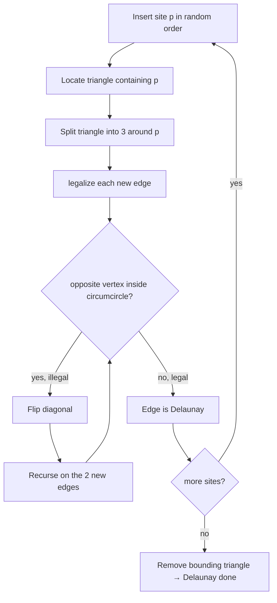
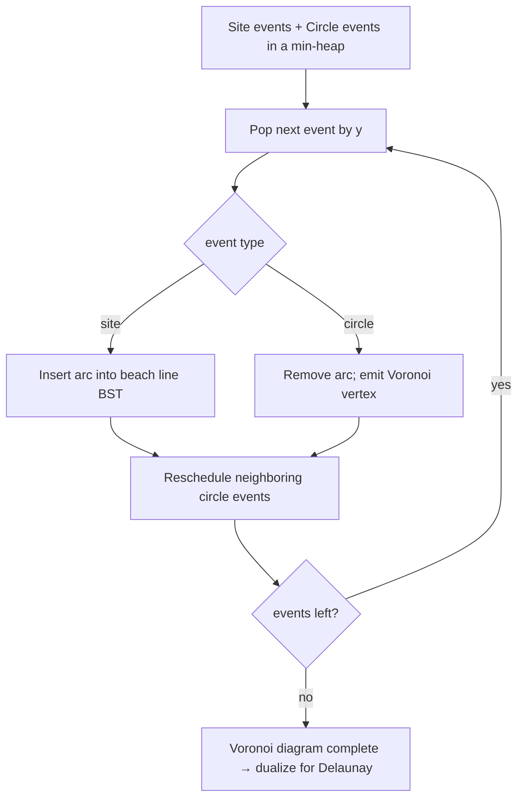

# Voronoi Diagram & Delaunay Triangulation — Middle Level

> **One-line summary:** At the middle level the focus shifts from *what* to *why and when*. We dissect the **in-circle predicate** (the 4×4 determinant that decides every flip), build the **randomized incremental** Delaunay algorithm with edge flips, sketch **Fortune's sweep** and **Bowyer–Watson**, and connect the triangulation to the wider toolbox: the **Euclidean Minimum Spanning Tree is a subgraph of Delaunay**, the **nearest-neighbor graph** lives inside it, and the **largest empty circle** is read off Voronoi vertices.

---

## Table of Contents

1. [Introduction](#introduction)
2. [Deeper Concepts](#deeper-concepts)
3. [The In-Circle Predicate, Dissected](#the-in-circle-predicate-dissected)
4. [Construction Algorithms Compared](#construction-algorithms-compared)
5. [Randomized Incremental with Edge Flips](#randomized-incremental-with-edge-flips)
6. [Fortune's Sweep Overview](#fortunes-sweep-overview)
7. [Relations: EMST, Nearest-Neighbor, Largest Empty Circle](#relations-emst-nearest-neighbor-largest-empty-circle)
8. [Code Examples](#code-examples)
9. [Error Handling](#error-handling)
10. [Performance Analysis](#performance-analysis)
11. [Best Practices](#best-practices)
12. [Visual Animation](#visual-animation)
13. [Summary](#summary)

---

## Introduction

> Focus: "Why does it work?" and "When should I reach for it?"

The junior file gave you the mechanics: closest-site cells, the dual triangulation, the empty-circumcircle rule, and the flip loop. Now we explain *why* those mechanics are correct and *when* this structure is the right tool.

Three ideas unlock everything at this level:

1. **The in-circle predicate is the whole game.** Every construction algorithm — incremental, divide-and-conquer, Bowyer–Watson, even Fortune's sweep in disguise — is ultimately deciding, over and over, "is this point inside that circumcircle?" Understanding the determinant, its sign convention, and its sensitivity to rounding is the single highest-leverage thing you can learn.

2. **Local Delaunay implies global Delaunay.** You never have to check a triangle's circumcircle against *all* sites — only against the opposite vertices of its neighboring triangles. Lawson's flip algorithm exploits exactly this: fix edges locally and the whole triangulation becomes globally Delaunay. This is why `O(1)` flips compose into an `O(n log n)` algorithm.

3. **Delaunay is a hub.** It is not an end in itself so much as a *substrate*. The Euclidean MST, the nearest-neighbor graph, the relative neighborhood graph, and the Gabriel graph all sit inside Delaunay as subgraphs. Compute Delaunay once and many proximity problems become trivial graph queries on `O(n)` edges instead of `O(n^2)` brute force.

---

## Deeper Concepts

### Invariant: every internal edge is "legal"

The structural invariant a Delaunay triangulation maintains is:

> For every internal edge `e` shared by triangles `T1 = (a, b, c)` and `T2 = (a, b, d)`, vertex `d` is **not** strictly inside the circumcircle of `T1` (equivalently `c` is not inside that of `T2`).

An edge that violates this is **illegal**, and flipping it (replacing diagonal `a–b` with `c–d`) makes both the flipped edge and — after recursion — the whole region legal. When no illegal edge remains, the triangulation is Delaunay. The remarkable fact (proved in `professional.md`) is that **local legality is equivalent to global emptiness**: you do not need to test against far-away points.

### The max-min angle view

Among *all* triangulations of a fixed point set, Delaunay is the one whose sorted vector of angles (smallest angle first) is **lexicographically maximal**. Each legal flip replaces the six angles of a quadrilateral with a set whose minimum is at least as large. This is why Delaunay meshes avoid thin slivers — a property engineers depend on for stable simulations.

### Why the Voronoi diagram is planar and linear-size

By Euler's formula for planar graphs, a triangulation of `n` points has at most `2n − 5` triangles and `3n − 6` edges. The dual Voronoi diagram therefore has `O(n)` cells, edges, and vertices. The key consequence: even though there are `Θ(n^2)` *pairs* of sites, only `O(n)` of them are Delaunay neighbors. This linear output size is what makes an `O(n log n)` algorithm possible — and it is why proximity graphs derived from Delaunay are sparse.

### Degeneracies you must respect

- **Collinear points**: produce zero-area triangles; the determinant for orientation is 0.
- **Cocircular points** (≥4 on one circle): the in-circle determinant is 0; multiple Delaunay triangulations exist. A deterministic tie-break (e.g., symbolic perturbation) picks one.
These are not exotic — grids, regular polygons, and snapped-to-integer coordinates produce them constantly.

---

## The In-Circle Predicate, Dissected

The predicate "is `D` inside the circumcircle of `A, B, C`?" is the sign of:

```
            | Ax  Ay  Ax²+Ay²  1 |
inCircle =  | Bx  By  Bx²+By²  1 |
            | Cx  Cy  Cx²+Cy²  1 |
            | Dx  Dy  Dx²+Dy²  1 |
```

**Sign convention (with `A, B, C` listed CCW):**

- `inCircle > 0` ⇒ `D` is **inside** the circumcircle.
- `inCircle < 0` ⇒ `D` is **outside**.
- `inCircle = 0` ⇒ `D` lies **on** the circle (the four points are cocircular).

**Why a determinant?** Lift each point `(x, y)` to the paraboloid `(x, y, x²+y²)` in 3D. The circle through `A, B, C` lifts to a plane; a point is inside the circle exactly when its lift is *below* that plane. "Below a plane through three lifted points" is precisely the sign of this determinant — the same algebra as the orientation test, one dimension up. (Full lifting argument: `professional.md` and sibling *01-convex-hull*.)

**Reducing it to a 3×3.** Subtract row `D` from the others to eliminate the constant column, giving the cheaper, numerically friendlier form:

```
              | Ax-Dx   Ay-Dy   (Ax²-Dx²)+(Ay²-Dy²) |
inCircle = det| Bx-Dx   By-Dy   (Bx²-Dx²)+(By²-Dy²) |
              | Cx-Dx   Cy-Dy   (Cx²-Dx²)+(Cy²-Dy²) |
```

This is what the code below computes.

**Robustness preview.** Computed in naive `double`, this determinant is a difference of large nearly-equal products and can return the *wrong sign* near degeneracy — which makes flip loops cycle forever. Senior/professional levels cover exact and adaptive predicates; at this level, know that the danger is real and use a tolerance only as a stopgap.

---

## Construction Algorithms Compared

| Algorithm | Time | Idea | Pros | Cons |
|-----------|------|------|------|------|
| **Bowyer–Watson (incremental insertion)** | `O(n^2)` worst, ~`O(n log n)` typical | Delete triangles whose circumcircle contains the new point; re-triangulate the cavity. | Easiest to code; very intuitive. | Worst case quadratic; needs point location to be fast. |
| **Randomized incremental + flips (Lawson/Guibas)** | `O(n log n)` expected | Insert in random order; locate triangle; split; legalize via recursive flips. | Optimal expected time; standard in practice. | Point-location structure adds bookkeeping. |
| **Divide & conquer (Guibas–Stolfi)** | `O(n log n)` worst | Sort, recursively triangulate halves, merge along a "rising bubble" seam. | Worst-case optimal; deterministic. | Hard to implement; quad-edge data structure. |
| **Fortune's sweep** | `O(n log n)` worst | Sweep a line; maintain a beach line of parabolic arcs; emit Voronoi edges. | Optimal; builds Voronoi directly. | Subtle event handling; builds Voronoi, dualize for Delaunay. |
| **Lifting → 3D lower hull** | `O(n log n)` | Lift to paraboloid, take the lower convex hull, project faces down. | Conceptually unifies hull & Delaunay. | Needs a 3D hull routine. |

**Choose Bowyer–Watson when** you want correctness fast and `n` is modest. **Choose randomized incremental** for general production code. **Choose Fortune** when you specifically want the Voronoi diagram and want guaranteed `O(n log n)`. **Choose lifting** when you already have a robust 3D convex hull and value the elegance.

---

## Randomized Incremental with Edge Flips

This is the workhorse. The algorithm:

1. Start with a big bounding triangle containing all sites.
2. **Insert sites in random order.** Randomization gives `O(n log n)` *expected* time regardless of input (no adversary can force the worst case).
3. For each new site `p`: **locate** the triangle containing it (walk, or a history DAG), **split** that triangle into three by connecting `p` to its corners.
4. **Legalize** each of the three new edges. `legalize(edge)` checks the opposite vertex against the circumcircle; if illegal, **flip** and recurse on the two newly exposed edges.

The recursion terminates because each flip strictly increases the lexicographic angle vector; the expected total number of flips is `O(n)` (a backwards-analysis argument, in `professional.md`).



The single subtle point: **point location**. A naive scan makes insertion `O(n)`. A history DAG (Delaunay tree) or a directed walk brings it to `O(log n)` expected, recovering the overall `O(n log n)`.

---

## Fortune's Sweep Overview

Fortune's algorithm computes the Voronoi diagram directly in `O(n log n)` worst case. The idea:

- A horizontal **sweep line** moves down the plane. Above it everything is decided; below, nothing yet.
- The **beach line** is the lower envelope of parabolas, one per site already passed. Each parabola is the locus equidistant from its site and the sweep line. The breakpoints between adjacent arcs trace out the Voronoi edges.
- Two **event** types drive it:
  - **Site events** (a new site is reached): insert a new arc into the beach line, splitting an existing arc.
  - **Circle events** (three consecutive arcs converge to a point): an arc disappears; that convergence point is a **Voronoi vertex** (a circumcenter). Circle events are scheduled in a priority queue keyed by the lowest point of the circumcircle.
- A balanced BST stores the beach line so arc insert/delete is `O(log n)`; the event queue is a heap. Total: `O(n log n)`.



Why "Fortune is a sweep" matters: it ties this topic to sibling *05-sweep-line*. The status structure is the beach line; the events are sites and circle events. The same paradigm that finds segment intersections finds Voronoi cells.

---

## Relations: EMST, Nearest-Neighbor, Largest Empty Circle

This is the *when to reach for it* payoff. The Delaunay/Voronoi pair is a hub for proximity problems.

### Euclidean Minimum Spanning Tree (EMST) ⊆ Delaunay

**Theorem.** Every edge of the Euclidean MST of a point set is a Delaunay edge.

So to compute the EMST in `O(n log n)`: build Delaunay (`O(n)` edges), then run Kruskal/Prim on just those edges. This beats the `O(n^2)` complete-graph MST. *Sketch:* if `(u, v)` is an MST edge, the circle with diameter `uv` (the smallest enclosing circle of just `u, v`) is empty of other points — otherwise a cheaper edge would replace `(u, v)` (the cut property). An empty diameter-circle makes `(u, v)` a Gabriel edge, and every Gabriel edge is Delaunay.

### Nearest-Neighbor Graph ⊆ Delaunay

Each point's nearest neighbor is connected to it by a Delaunay edge. *Sketch:* if `q` is `p`'s nearest neighbor, the circle centered at the midpoint, or more simply the open disk around `p` of radius `|pq|`, contains no other site, so `p` and `q`'s Voronoi cells must touch. Hence you can answer all-nearest-neighbors in `O(n log n)` via Delaunay. The containment chain is:

```
Nearest-Neighbor Graph ⊆ EMST ⊆ Relative Neighborhood Graph ⊆ Gabriel Graph ⊆ Delaunay
```

### Largest Empty Circle ↔ Voronoi vertices

The **largest empty circle** (biggest circle containing no site, useful for facility location — "where to put a new store farthest from competitors") is centered either at a **Voronoi vertex** or on a Voronoi edge where it meets the convex hull. So you scan the `O(n)` Voronoi vertices, not infinitely many candidate centers.

| Problem | Solved via | Complexity |
|---------|-----------|------------|
| Euclidean MST | Delaunay edges → Kruskal | `O(n log n)` |
| All nearest neighbors | Delaunay edges | `O(n log n)` |
| Largest empty circle | Voronoi vertices | `O(n log n)` |
| Nearest-neighbor query (static) | Voronoi cell point-location | `O(log n)` per query after `O(n log n)` build |
| Natural-neighbor interpolation | Voronoi cell areas | `O(n)` per query (local) |

---

## Code Examples

### Example: Robust-ish in-circle predicate + Lawson edge-flip legalization

#### Go

```go
package main

import "fmt"

type Pt struct{ X, Y float64 }

// orient2d > 0 means a,b,c are CCW.
func orient2d(a, b, c Pt) float64 {
	return (b.X-a.X)*(c.Y-a.Y) - (b.Y-a.Y)*(c.X-a.X)
}

// inCircle > 0 means d is inside the circumcircle of a,b,c (a,b,c CCW).
// Uses the 3x3 reduced determinant for numerical friendliness.
func inCircle(a, b, c, d Pt) float64 {
	ax, ay := a.X-d.X, a.Y-d.Y
	bx, by := b.X-d.X, b.Y-d.Y
	cx, cy := c.X-d.X, c.Y-d.Y
	az := ax*ax + ay*ay
	bz := bx*bx + by*by
	cz := cx*cx + cy*cy
	return ax*(by*cz-bz*cy) - ay*(bx*cz-bz*cx) + az*(bx*cy-by*cx)
}

// shouldFlip reports whether diagonal a-b shared by (a,b,c) and (a,b,d)
// is illegal and must be flipped to c-d.
func shouldFlip(a, b, c, d Pt) bool {
	// ensure (a,b,c) is CCW for a consistent inCircle sign
	if orient2d(a, b, c) < 0 {
		a, b = b, a
	}
	return inCircle(a, b, c, d) > 1e-12
}

func main() {
	a, b, c, d := Pt{0, 0}, Pt{4, 0}, Pt{4, 5}, Pt{0, 4}
	fmt.Println("inCircle(A,B,C,D) =", inCircle(a, b, c, d))
	fmt.Println("flip A-B diagonal? ", shouldFlip(a, b, c, d))
}
```

#### Java

```java
public class InCircle {
    record Pt(double x, double y) {}

    static double orient2d(Pt a, Pt b, Pt c) {
        return (b.x()-a.x())*(c.y()-a.y()) - (b.y()-a.y())*(c.x()-a.x());
    }

    // > 0 => d inside circumcircle of (a,b,c) when a,b,c CCW
    static double inCircle(Pt a, Pt b, Pt c, Pt d) {
        double ax = a.x()-d.x(), ay = a.y()-d.y();
        double bx = b.x()-d.x(), by = b.y()-d.y();
        double cx = c.x()-d.x(), cy = c.y()-d.y();
        double az = ax*ax + ay*ay;
        double bz = bx*bx + by*by;
        double cz = cx*cx + cy*cy;
        return ax*(by*cz - bz*cy) - ay*(bx*cz - bz*cx) + az*(bx*cy - by*cx);
    }

    static boolean shouldFlip(Pt a, Pt b, Pt c, Pt d) {
        if (orient2d(a, b, c) < 0) { Pt t = a; a = b; b = t; }
        return inCircle(a, b, c, d) > 1e-12;
    }

    public static void main(String[] args) {
        Pt a = new Pt(0,0), b = new Pt(4,0), c = new Pt(4,5), d = new Pt(0,4);
        System.out.println("inCircle = " + inCircle(a, b, c, d));
        System.out.println("flip? " + shouldFlip(a, b, c, d));
    }
}
```

#### Python

```python
def orient2d(a, b, c):
    return (b[0]-a[0]) * (c[1]-a[1]) - (b[1]-a[1]) * (c[0]-a[0])


def in_circle(a, b, c, d):
    """> 0 => d strictly inside circumcircle of (a,b,c) when a,b,c CCW."""
    ax, ay = a[0]-d[0], a[1]-d[1]
    bx, by = b[0]-d[0], b[1]-d[1]
    cx, cy = c[0]-d[0], c[1]-d[1]
    az = ax*ax + ay*ay
    bz = bx*bx + by*by
    cz = cx*cx + cy*cy
    return ax*(by*cz - bz*cy) - ay*(bx*cz - bz*cx) + az*(bx*cy - by*cx)


def should_flip(a, b, c, d):
    if orient2d(a, b, c) < 0:
        a, b = b, a
    return in_circle(a, b, c, d) > 1e-12


if __name__ == "__main__":
    a, b, c, d = (0, 0), (4, 0), (4, 5), (0, 4)
    print("inCircle =", in_circle(a, b, c, d))
    print("flip?", should_flip(a, b, c, d))
```

**What it does:** computes the in-circle determinant in its reduced 3×3 form and decides whether an internal edge must be flipped to satisfy the Delaunay condition.
**Run:** `go run main.go` | `javac InCircle.java && java InCircle` | `python in_circle.py`

### Example: Euclidean MST from Delaunay edges (Kruskal)

Because the EMST is a subgraph of Delaunay, running Kruskal on only the `O(n)` Delaunay edges yields the exact EMST in `O(n log n)` — no `O(n^2)` complete graph needed.

#### Go

```go
package main

import (
	"fmt"
	"sort"
)

type DSU struct{ parent []int }

func newDSU(n int) *DSU {
	p := make([]int, n)
	for i := range p {
		p[i] = i
	}
	return &DSU{p}
}
func (d *DSU) find(x int) int {
	for d.parent[x] != x {
		d.parent[x] = d.parent[d.parent[x]]
		x = d.parent[x]
	}
	return x
}
func (d *DSU) union(a, b int) bool {
	ra, rb := d.find(a), d.find(b)
	if ra == rb {
		return false
	}
	d.parent[ra] = rb
	return true
}

// EuclideanMST builds the EMST from Delaunay edges only.
func EuclideanMST(pts [][2]float64, delEdges [][2]int) ([][2]int, float64) {
	d2 := func(i, j int) float64 {
		dx, dy := pts[i][0]-pts[j][0], pts[i][1]-pts[j][1]
		return dx*dx + dy*dy
	}
	sort.Slice(delEdges, func(a, b int) bool {
		return d2(delEdges[a][0], delEdges[a][1]) < d2(delEdges[b][0], delEdges[b][1])
	})
	dsu := newDSU(len(pts))
	var mst [][2]int
	var total float64
	for _, e := range delEdges {
		if dsu.union(e[0], e[1]) {
			mst = append(mst, e)
			total += d2(e[0], e[1])
		}
	}
	return mst, total
}

func main() {
	pts := [][2]float64{{0, 0}, {4, 0}, {4, 5}, {0, 4}}
	edges := [][2]int{{0, 1}, {1, 2}, {2, 3}, {3, 0}, {1, 3}}
	mst, _ := EuclideanMST(pts, edges)
	fmt.Println("EMST edges:", mst)
}
```

#### Java

```java
import java.util.*;

public class EuclideanMST {
    static int[] parent;
    static int find(int x) {
        while (parent[x] != x) { parent[x] = parent[parent[x]]; x = parent[x]; }
        return x;
    }
    static boolean union(int a, int b) {
        int ra = find(a), rb = find(b);
        if (ra == rb) return false;
        parent[ra] = rb; return true;
    }

    static List<int[]> emst(double[][] pts, List<int[]> delEdges) {
        parent = new int[pts.length];
        for (int i = 0; i < pts.length; i++) parent[i] = i;
        delEdges.sort(Comparator.comparingDouble(e -> d2(pts, e[0], e[1])));
        List<int[]> mst = new ArrayList<>();
        for (int[] e : delEdges) if (union(e[0], e[1])) mst.add(e);
        return mst;
    }
    static double d2(double[][] p, int i, int j) {
        double dx = p[i][0]-p[j][0], dy = p[i][1]-p[j][1];
        return dx*dx + dy*dy;
    }

    public static void main(String[] args) {
        double[][] pts = {{0,0},{4,0},{4,5},{0,4}};
        List<int[]> edges = new ArrayList<>(List.of(
            new int[]{0,1}, new int[]{1,2}, new int[]{2,3}, new int[]{3,0}, new int[]{1,3}));
        for (int[] e : emst(pts, edges)) System.out.println(e[0] + "-" + e[1]);
    }
}
```

#### Python

```python
def euclidean_mst(points, delaunay_edges):
    """delaunay_edges: list of (i, j) index pairs from a Delaunay build."""
    def d2(i, j):
        return (points[i][0]-points[j][0])**2 + (points[i][1]-points[j][1])**2

    parent = list(range(len(points)))
    def find(x):
        while parent[x] != x:
            parent[x] = parent[parent[x]]
            x = parent[x]
        return x

    edges = sorted(delaunay_edges, key=lambda e: d2(e[0], e[1]))
    mst, total = [], 0.0
    for i, j in edges:
        ri, rj = find(i), find(j)
        if ri != rj:
            parent[ri] = rj
            mst.append((i, j))
            total += d2(i, j) ** 0.5
    return mst, total
```

**What it does:** sorts the `O(n)` Delaunay edges by length and runs Kruskal with a disjoint-set, producing the exact Euclidean MST.
**Run:** `go run main.go` | `javac EuclideanMST.java && java EuclideanMST` | `python euclidean_mst.py`

### Worked legalize walkthrough on a quad

Take quadrilateral `A=(0,0)`, `B=(4,0)`, `C=(4,5)`, `D=(0,4)` split by diagonal `A–C` into triangles `(A,B,C)` and `(A,C,D)`. Run the in-circle test of `D` against `(A,B,C)`:

```
inCircle(A, B, C, D) > 0   →  D is INSIDE circumcircle(A,B,C)  →  edge A–C illegal
```

Flip `A–C` to `B–D`, producing `(A,B,D)` and `(B,C,D)`. Re-test the new edge: `C` against `(A,B,D)`:

```
inCircle(A, B, D, C) < 0   →  C is OUTSIDE  →  edge B–D legal  →  Delaunay
```

The cascade stops after one flip. In a full incremental build, a freshly inserted point triggers up to three initial edges, each of which may cascade — but the *total* number of flips across the whole build is `O(n)` in expectation (the backwards-analysis bound).

---

## Error Handling

| Scenario | What goes wrong | Correct approach |
|----------|-----------------|------------------|
| In-circle returns wrong sign near cocircular points | Cancellation in `double`; flip loop oscillates | Use exact/adaptive predicates; never trust a loose epsilon for the *decision*. |
| Triangle orientation not normalized | `inCircle` sign meaning flips | Always force CCW before testing. |
| Recursive `legalize` overflows the stack | Degenerate input causing many flips | Convert to an explicit work-stack; bound by total flip count. |
| Point location fails (walk leaves the mesh) | New site outside the current hull | Use a sufficiently large bounding triangle; handle hull-edge insertions. |
| EMST uses wrong edge set | Forgot Delaunay is only a *superset* of EMST | EMST ⊆ Delaunay holds — run MST on Delaunay edges, never assume Delaunay edges *are* the MST. |

---

## Performance Analysis

| Quantity | Value | Why |
|----------|-------|-----|
| Triangles | `≤ 2n − 5` | Euler's formula for a planar triangulation. |
| Edges | `≤ 3n − 6` | Same. |
| Expected flips per insertion (randomized) | `O(1)` amortized | Backwards analysis; total `O(n)` flips. |
| Point location per insertion | `O(log n)` expected | History DAG / Delaunay tree. |
| Overall (randomized incremental) | `O(n log n)` expected | Location + `O(n)` total structural work. |
| Fortune's sweep | `O(n log n)` worst | Heap of `O(n)` events × `O(log n)` BST ops. |
| Bowyer–Watson naive | `O(n^2)` worst | Scanning all triangles per insertion. |

#### Go (micro-benchmark of the in-circle predicate)

```go
import (
	"fmt"
	"time"
)

func benchInCircle() {
	a, b, c, d := Pt{0, 0}, Pt{1, 0}, Pt{0, 1}, Pt{0.3, 0.3}
	start := time.Now()
	const N = 10_000_000
	var acc float64
	for i := 0; i < N; i++ {
		acc += inCircle(a, b, c, d)
	}
	fmt.Printf("%d in-circle tests in %v (acc=%.1f)\n", N, time.Since(start), acc)
}
```

The predicate is a handful of multiplies — the cost of a triangulation is dominated by *how many* tests, i.e., point location and flips, not the test itself.

---

## Best Practices

- **Insert in random order** for incremental construction — it converts adversarial `O(n^2)` inputs into `O(n log n)` expected.
- **Build Delaunay, dualize to Voronoi** — almost never construct Voronoi cells directly unless you specifically need Fortune.
- **Normalize triangle orientation** to CCW everywhere so predicate signs are consistent.
- **Treat the in-circle test as a *decision*, not a number** — feed it to exact predicates when robustness matters.
- **Cache circumcenters** when you will dualize to Voronoi.
- **Exploit the subgraph relations**: need an EMST or all-nearest-neighbors? Build Delaunay first.
- **Reach for CGAL / scipy.spatial** in production once you understand the internals; their predicates are exact.

---

## Visual Animation

> See [`animation.html`](./animation.html) for interactive visualization.
>
> Middle-level focus:
> - Inserting a site and watching the cavity / split + the **flip cascade** restore Delaunay
> - The **in-circle test** drawn as a circumcircle with the tested point highlighted inside/outside
> - The dual **Voronoi cells** updating as the triangulation changes
> - Step counter and operation log to follow each legalize call

---

## Summary

At the middle level, the Voronoi/Delaunay pair is understood through one predicate and one invariant: the **in-circle determinant** decides every flip, and **local legality equals global Delaunay**, which is why `O(1)` flips compose into `O(n log n)` construction. The randomized incremental algorithm (insert in random order, locate, split, legalize) is the practical default; Bowyer–Watson is the simplest; Fortune's sweep builds Voronoi optimally. The biggest payoff is the web of relations: the **EMST and nearest-neighbor graph are subgraphs of Delaunay**, and the **largest empty circle** lives at Voronoi vertices — so building this one structure makes a whole family of proximity problems easy.

---

**Next step:** Continue to [`senior.md`](./senior.md) for mesh generation / FEM / GIS / terrain systems, the robustness of the in-circle predicate at scale, constrained Delaunay, and 3D / higher-dimensional triangulations.
