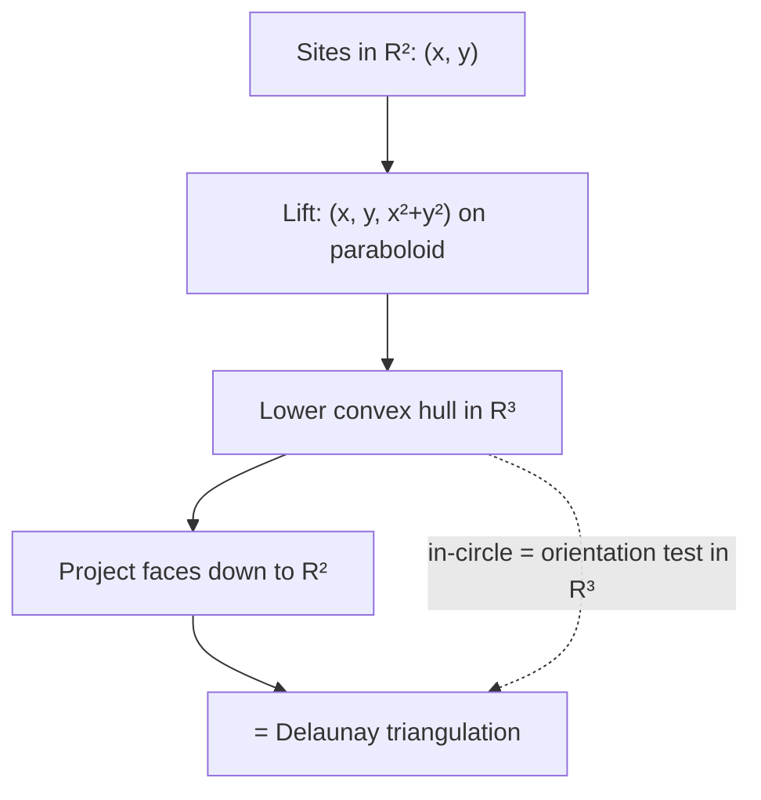
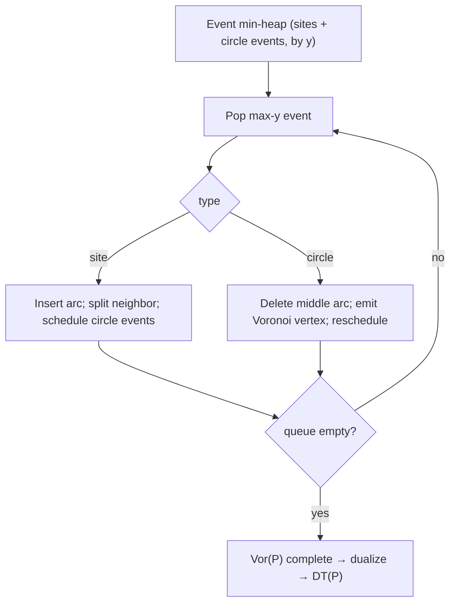

# Voronoi Diagram & Delaunay Triangulation — Mathematical Foundations and Complexity Theory

> **One-line summary:** This file proves the theory the earlier levels relied on: the **empty-circumcircle property ⟺ the local-Delaunay (flip) condition ⟺ the lexicographic max-min-angle property**; the **lifting-to-paraboloid duality** that makes a planar Delaunay triangulation literally the projection of a 3D **lower convex hull** (so the in-circle test is an orientation test one dimension up); the **`O(n log n)` correctness and complexity of Fortune's sweep**; the **exactness of the in-circle determinant**; and the **`Ω(n log n)` lower bound** via reduction from sorting.

---

## Table of Contents

1. [Formal Definitions](#formal-definitions)
2. [The In-Circle Determinant and Its Exactness](#the-in-circle-determinant-and-its-exactness)
3. [Lifting to the Paraboloid: Delaunay = Lower Convex Hull](#lifting-to-the-paraboloid-delaunay--lower-convex-hull)
4. [Empty-Circle ⟺ Max-Min-Angle: The Equivalence Theorem](#empty-circle--max-min-angle-the-equivalence-theorem)
5. [Local Delaunay ⟺ Global Delaunay (Lawson)](#local-delaunay--global-delaunay-lawson)
6. [Fortune's Sweep: Correctness and O(n log n)](#fortunes-sweep-correctness-and-on-log-n)
7. [Expected Complexity of Randomized Incremental](#expected-complexity-of-randomized-incremental)
8. [The Ω(n log n) Lower Bound](#the-Ω-n-log-n-lower-bound)
9. [Comparison with Alternatives](#comparison-with-alternatives)
10. [Summary](#summary)

---

## Formal Definitions

```text
Let P = {p_1, ..., p_n} ⊂ R² be a set of n sites in general position
(no 3 collinear, no 4 cocircular) unless stated otherwise.

Voronoi cell of p_i:
   V(p_i) = { q ∈ R² : ||q − p_i|| ≤ ||q − p_j|| for all j }
          = ∩_{j≠i} H(p_i, p_j),
   where H(p_i, p_j) is the half-plane on p_i's side of the
   perpendicular bisector of segment p_i p_j.

   Each V(p_i) is a convex polygon (intersection of half-planes),
   possibly unbounded.

Voronoi diagram Vor(P): the planar subdivision { V(p_1), ..., V(p_n) }.
   - Voronoi edges: 1-D loci equidistant from exactly two sites.
   - Voronoi vertices: points equidistant from ≥3 sites (=3 in general position).

Delaunay triangulation DT(P): the dual straight-line graph; p_i p_j is a
   Delaunay edge iff V(p_i) and V(p_j) share a Voronoi edge. Equivalently
   (general position) the unique triangulation in which the circumcircle of
   every triangle contains no site of P in its open interior.
```

**Existence/uniqueness (general position).** `DT(P)` exists and is unique when no four sites are cocircular and no three collinear. With degeneracies, multiple triangulations satisfy the (now non-strict) empty-circle condition; symbolic perturbation selects a canonical one.

---

## The In-Circle Determinant and Its Exactness

```text
InCircle predicate. For A, B, C listed counter-clockwise and a query D:

           | Ax  Ay  Ax²+Ay²  1 |
  I(A,B,C,D) = | Bx  By  Bx²+By²  1 |
           | Cx  Cy  Cx²+Cy²  1 |
           | Dx  Dy  Dx²+Dy²  1 |

  sign(I) = +1  ⇒ D strictly inside  circumcircle(A,B,C)
          = -1  ⇒ D strictly outside
          =  0  ⇒ A,B,C,D cocircular.
```

**Theorem (geometric meaning).** With `A,B,C` CCW, `I(A,B,C,D) > 0` iff `D` lies inside the circumcircle of `A,B,C`.

```text
Proof sketch via lifting. Map φ(x,y) = (x, y, x²+y²) onto the paraboloid
z = x²+y² in R³. The circle through A,B,C lifts to the intersection of the
paraboloid with a unique plane Π. A point (x,y) is inside that circle iff its
lift φ(x,y) lies strictly below Π (the paraboloid dips below the secant plane
inside the circle). "Below the plane through φ(A),φ(B),φ(C)" is exactly the
sign of the 4×4 orientation determinant of φ(A),φ(B),φ(C),φ(D) — which, after
appending the homogeneous 1-column, is I(A,B,C,D). The CCW orientation of
A,B,C fixes the overall sign. ∎
```

### Exactness

```text
I is a polynomial of total degree 4 in the input coordinates with integer
coefficients (±1). Therefore:

  (a) If all coordinates are integers bounded by |·| ≤ U, then |I| ≤ c·U⁴ for a
      small constant c, so I is an EXACT integer computable with O(log U)-bit
      (or expansion) arithmetic — its sign is decidable with no rounding error.

  (b) In floating point, I is a sum of products of squared coordinates;
      near cocircularity (|I| → 0) catastrophic cancellation can flip sign(I).
      Shewchuk's ADAPTIVE evaluation computes a fast estimate Î with a rigorous
      forward error bound ε(inputs); if |Î| > ε the sign is certified, else the
      computation escalates to exact expansion arithmetic. Common case O(1)
      flops; exact only when geometrically necessary.

  (c) Simulation of Simplicity: treat each p_i as perturbed by (ε^{2i}, ε^{4i})
      for an infinitesimal ε; this makes I ≠ 0 always, breaking cocircular ties
      consistently and removing all degenerate special cases.
```

Exactness of the sign is **not** a numerical nicety — an inconsistent sign breaks the planarity invariant and can make the flip algorithm fail to terminate (proven below to terminate only under a *consistent* predicate).

---

## Lifting to the Paraboloid: Delaunay = Lower Convex Hull

This is the deepest unifying theorem in the topic — it ties Delaunay to the convex hull (sibling *01-convex-hull*).

```text
Theorem (Brown / Edelsbrunner). Lift each site p=(x,y) to
   φ(p) = (x, y, x²+y²) ∈ R³  (the unit paraboloid).
Let LH be the LOWER convex hull of { φ(p) : p ∈ P } (faces whose outward
normal has negative z-component — those seen from below). Then the vertical
projection of the faces of LH back to the xy-plane is exactly DT(P).
```

```text
Proof.
(⇒ empty-circle ⇒ lower-hull face)
  Suppose triangle (A,B,C) is Delaunay: its circumcircle contains no other
  site. The lifted points φ(A),φ(B),φ(C) span a plane Π. For any other site D,
  D outside the circumcircle ⇔ φ(D) lies strictly ABOVE Π (by the lifting
  lemma above). So ALL other lifted points are above Π ⇒ (φ(A),φ(B),φ(C)) is a
  face of the lower convex hull.

(⇐ lower-hull face ⇒ empty-circle)
  Conversely, if (φ(A),φ(B),φ(C)) is a lower-hull face, every other φ(D) is
  above its supporting plane Π, hence every other D is outside circumcircle
  (A,B,C) ⇒ the projected triangle satisfies the empty-circle property ⇒ it is
  a Delaunay triangle.

The two directions establish a bijection between lower-hull faces and Delaunay
triangles. ∎
```

**Consequences.**

```text
1. The in-circle test in R² is literally the orientation (above/below plane)
   test in R³ on the lifted points — "geometry one dimension up." This is why
   the same robust-predicate machinery serves both hulls and triangulations.

2. A d-dimensional Delaunay triangulation is the projection of the lower convex
   hull of points lifted to the paraboloid in R^{d+1}. The duality is
   dimension-independent.

3. The (upper) hull of the lifted points projects to the FARTHEST-point
   Delaunay triangulation; the Voronoi diagram is the projection of the upper
   envelope of the tangent planes (the dual of the same lift).
```



---

## Empty-Circle ⟺ Max-Min-Angle: The Equivalence Theorem

```text
Theorem. For a point set in general position, a triangulation T is Delaunay
(empty-circumcircle) ⟺ T maximizes, lexicographically, the sorted vector of
its angles (smallest angle first) over ALL triangulations of P. In particular,
Delaunay maximizes the minimum angle.
```

The engine is the local **flip lemma**:

```text
Flip Lemma (Lawson / Thales). Let edge e = AB be shared by triangles ABC and
ABD forming convex quadrilateral A C B D. Exactly one of the two diagonals
(AB or CD) is locally Delaunay. The choice that is locally Delaunay also yields
the LEXICOGRAPHICALLY larger angle 6-tuple of the quadrilateral's two triangles.

Proof uses the inscribed-angle (Thales) theorem: if D lies inside the
circumcircle of ABC, then for the quadrilateral, switching diagonal AB → CD
strictly increases the minimum of the six interior angles. The angle opposite
a chord grows as the opposite vertex moves outside the circle. ∎
```

```text
Proof of the theorem.
(Delaunay ⇒ max-min-angle)
  Suppose T is Delaunay but some triangulation T' has a lexicographically
  larger angle vector. Take the angle vectors; some edge differs. Because every
  edge of T is locally Delaunay (def.), no single flip can increase the angle
  vector — but a sequence of flips connects any two triangulations (the flip
  graph of a planar point set is connected). Along that sequence each flip TO a
  non-Delaunay configuration would DECREASE the angle vector (Flip Lemma,
  contrapositive). Hence no T' exceeds T. 

(max-min-angle ⇒ Delaunay)
  If T is not Delaunay it has an illegal edge; flipping it strictly increases
  the angle vector (Flip Lemma), so T was not the maximizer. ∎
```

```text
Termination of Lawson's flip algorithm:
  Define Φ(T) = sorted angle vector. Each legal flip strictly increases Φ in
  lexicographic order. There are finitely many triangulations of P, so Φ takes
  finitely many values and strictly increases each flip ⇒ the algorithm
  terminates, at the (unique) Delaunay triangulation. This termination proof
  REQUIRES a consistent predicate; an inconsistent sign(I) can create A↔B flip
  cycles, violating monotonicity — the formal reason robustness matters.
```

---

## Local Delaunay ⟺ Global Delaunay (Lawson)

```text
Theorem (Delaunay's Lemma, 1934). A triangulation T of P is globally Delaunay
(every triangle's circumcircle is empty of ALL sites) ⟺ it is locally Delaunay
(for every internal edge, the opposite vertex of the adjacent triangle lies
outside that triangle's circumcircle).

Proof (⇐, the non-trivial direction).
  Assume T is locally Delaunay. Suppose for contradiction some triangle τ has a
  site s strictly inside its circumcircle C(τ). Among all (triangle, interior
  site) violating pairs, pick the one minimizing the distance from s to the
  edge e of τ that faces s (the edge of τ "between" τ and s). Let τ' be the
  triangle sharing e. Local Delaunayhood of e says the apex of τ' is outside
  C(τ). A short inscribed-angle argument shows s must then lie inside C(τ') and
  STRICTLY closer to its facing edge than to e — contradicting minimality.
  Hence no interior site exists ⇒ T is globally Delaunay. ∎
```

**Why this is the linchpin of efficiency:** it certifies that checking only `O(1)` neighbors per edge (not all `n` sites) suffices. That is what makes each flip `O(1)` and the whole construction `O(n log n)` instead of `O(n^2)`.

---

## Fortune's Sweep: Correctness and O(n log n)

```text
Setup. Sweep a horizontal line ℓ downward (decreasing y). The "beach line" B(ℓ)
is the lower envelope of the parabolas { arc(p_i) }, where arc(p_i) is the
locus of points equidistant from site p_i and line ℓ. A point on B(ℓ) is
equidistant from its defining site and ℓ, and closer to that site than to any
site already above ℓ.

Key invariant. The breakpoints (intersections of adjacent arcs) trace out
exactly the Voronoi edges as ℓ descends. A point of the plane is "decided"
(its Voronoi cell is fixed) once ℓ has passed below it AND below the lowest
point of the relevant circumcircle.
```

```text
Events.
  Site event (ℓ reaches a new site p): p's arc appears, splitting one existing
    arc into two ⇒ +1 net arc. A site can create an arc at most once.
  Circle event: three consecutive arcs (sites a,b,c) converge to a single
    point as ℓ descends; that point is the lowest point of circumcircle(a,b,c),
    and the convergence point is a VORONOI VERTEX (= circumcenter). The middle
    arc disappears ⇒ −1 arc.

Correctness. Each site event adds the correct new arc; each (valid) circle
event removes an arc exactly when its site is no longer closest to any point on
ℓ, emitting the circumcenter as a Voronoi vertex. False circle events
(invalidated by an intervening site insertion) are detected and skipped. When
the queue empties, every breakpoint trace has been completed ⇒ Vor(P) is
correct. Dualizing yields DT(P).
```

```text
Complexity.
  Arcs in B(ℓ): O(n) at all times (each site contributes ≤ a bounded number of
    live arcs; total arcs created ≤ 2n−1).
  Events: n site events + O(n) circle events = O(n) total. (Linear because the
    Voronoi diagram has O(n) vertices.)
  Beach line stored in a balanced BST keyed by arc order along x: insert /
    delete / neighbor query = O(log n).
  Event queue: a min-heap on the y-coordinate of each event = O(log n) per
    op.

  Total: O(n) events × O(log n) per event = O(n log n) time, O(n) space. ∎
```



---

## Expected Complexity of Randomized Incremental

```text
Theorem. Randomized incremental Delaunay (insert sites in uniformly random
order, with a conflict/history structure for point location) runs in O(n log n)
expected time and O(n) expected space.

Backwards analysis of structural changes (flips):
  At step r (the r-th insertion into a triangulation of r sites), the number of
  triangles created equals 3 + 2·(#flips). By backwards analysis, the expected
  degree of the just-inserted (random) site in DT of r points is < 6 (planar,
  avg degree < 6), so E[triangles created at step r] = O(1).
  Summing over r = 1..n: E[total structural changes] = O(n).

Point location via the history DAG (Delaunay tree):
  Each created triangle is a node; an inserted point descends the DAG to find
  its containing triangle. Expected search cost is O(log r) at step r
  (the conflict graph has expected O(log r) depth on the search path).
  Summing: Σ O(log r) = O(n log n).

Total expected: O(n) flips + O(n log n) location = O(n log n). ∎

Concentration. By a Chernoff/high-probability argument over the random
insertion order, the running time is O(n log n) with probability ≥ 1 − n^{-c}.
```

---

## Uniqueness, Flip-Graph Connectivity, and the Flip Number

```text
Theorem (Uniqueness). If P is in general position (no 4 cocircular), DT(P) is
unique.

Proof. Suppose two distinct Delaunay triangulations T, T' exist. They share the
same vertex set and convex hull. Pick an edge e ∈ T \ T'. Then e is crossed by
some edge e' ∈ T'. The four endpoints of e, e' form a convex quad; the empty-
circle condition picks exactly ONE diagonal unless the four are cocircular.
General position forbids cocircularity ⇒ both T and T' must contain the same
diagonal ⇒ contradiction. Hence T = T'. ∎
```

```text
Theorem (Flip-graph connectivity, Lawson 1972). The flip graph of all
triangulations of a planar point set P — vertices are triangulations, edges are
single diagonal flips — is CONNECTED, and from ANY triangulation a sequence of
"toward-Delaunay" flips reaches DT(P).

Proof idea. Define the potential Φ(T) = sorted angle vector. Every non-Delaunay
T has an illegal edge whose flip strictly increases Φ. Since Φ is bounded above
(finitely many triangulations) and strictly increasing along legal flips, the
process is a monotone walk that cannot cycle and terminates at the unique
maximum = DT(P). Connectivity follows because DT(P) is reachable from every T. ∎
```

```text
Bound (Number of flips). From an arbitrary triangulation, Lawson's algorithm
performs O(n²) flips in the worst case (and Θ(n²) for some inputs). In the
INCREMENTAL setting with random insertion, the EXPECTED total is O(n) (the
aggregate bound below). The gap is why randomization matters: it converts a
worst-case-quadratic flip count into an expected-linear one.
```

## Why the Beach Line Has Only O(n) Arcs

The `O(n log n)` bound for Fortune hinges on the beach line never growing too large.

```text
Lemma. At any sweep position, the beach line consists of at most 2n − 1 arcs,
and over the whole sweep at most 2n − 1 arcs are ever created.

Proof. An arc is created ONLY by a site event: when the sweep reaches a new
site p, p's parabola pierces the current beach line, splitting one existing arc
into two. So each of the n site events adds at most 2 arcs and removes the
split arc — a net change bounded by +1, plus the very first arc. Circle events
only DELETE arcs. Hence:
   total arcs created ≤ 1 (first) + (n−1) site splits · 2  = O(n),
   and a deletion (circle event) can happen at most once per created arc, so
   the number of circle events is also O(n).
Therefore both event types total O(n), each processed in O(log n) (heap +
balanced BST), giving O(n log n). ∎
```

```text
Lemma (no false vertex). Every circle event that actually fires corresponds to
a real Voronoi vertex (a circumcenter equidistant from three sites). A circle
event scheduled for arcs (a,b,c) is INVALIDATED if a later site event inserts
an arc between them before it fires; invalidated events are lazily skipped.
Thus exactly the O(n) true Voronoi vertices are emitted. ∎
```

## Aggregate Bound on Total Flips

```text
Theorem (incremental flips, aggregate). Over a full randomized incremental
build, the expected total number of edge flips is O(n).

Aggregate method via backwards analysis:
  Consider the triangulation DT_r after inserting r of the n sites. By symmetry
  of the random order, the r-th inserted site is a UNIFORMLY RANDOM one of the
  r present sites. The structural changes caused by its insertion equal the
  degree of that site in DT_r (the edges incident to it). The sum of all vertex
  degrees in a planar triangulation is 2·(#edges) ≤ 2·(3r − 6) < 6r, so the
  AVERAGE degree is < 6. Hence:
     E[changes at step r] = E[deg(random vertex in DT_r)] < 6 = O(1).
  Summing:  E[total changes] = Σ_{r=1}^{n} O(1) = O(n).
  Each change is one split or flip done in O(1) ⇒ O(n) total structural work.

Combined with O(n log n) point location, the total is O(n log n) expected. ∎
```

This is the amortized heart of the algorithm: although a single insertion can trigger many flips, the *average* is constant because the average vertex degree in any planar triangulation is below 6 (a direct consequence of Euler's formula).

## The Ω(n log n) Lower Bound

```text
Theorem. Computing the Voronoi diagram (or Delaunay triangulation) of n points
requires Ω(n log n) time in the algebraic computation-tree model.

Proof by reduction from SORTING (which is Ω(n log n) in this model).
  Given n real numbers x_1, ..., x_n to sort:
    1. Map each x_i to the planar site p_i = (x_i, x_i²) on the parabola y=x².
       (O(n) time.)
    2. Build the Voronoi diagram / Delaunay triangulation of {p_i}.
  Claim: along the parabola y=x², consecutive-in-x sites are Delaunay
  neighbors. Because the parabola is convex, the points are in convex position
  and the lower-hull-of-lift argument forces the Delaunay edges to connect
  x-adjacent sites — i.e. the Delaunay triangulation reveals the sorted order
  of the x_i in O(n) extra time (walk the boundary).
  Thus a Voronoi/Delaunay algorithm faster than O(n log n) would sort in
  o(n log n), contradiction. ∎
```

```text
Corollary. Fortune's O(n log n), divide-and-conquer's O(n log n), and the
expected bound of randomized incremental are all OPTIMAL. The naive
Bowyer–Watson O(n²) and any "test every triangle against every site" scheme
are asymptotically suboptimal.
```

---

## Proximity-Graph Containment Proofs

The middle-level claim "EMST ⊆ Delaunay" rests on a chain of containments, each proved by an empty-region argument.

```text
Theorem (Gabriel ⇒ Delaunay). Edge (u,v) is a GABRIEL edge iff the closed disk
with diameter uv contains no other site. Every Gabriel edge is a Delaunay edge.

Proof. Let D be the disk with diameter uv, empty of other sites. Its center is
the midpoint m of uv with radius |uv|/2. Shrink any circle through u and v down
to D: D is the SMALLEST circle through u and v. Since no site lies in D, there
exists a circle through u and v empty of all other sites (namely D itself), so
u and v lie on a common empty circle ⇒ their Voronoi cells share an edge ⇒
(u,v) ∈ DT(P). ∎
```

```text
Theorem (EMST ⇒ Gabriel ⇒ Delaunay). Every Euclidean MST edge is Gabriel,
hence Delaunay.

Proof. Let (u,v) be an MST edge and suppose, for contradiction, a site w lies
in the closed disk with diameter uv. Then both |uw| < |uv| and |vw| < |uv|
(any point in a diameter-disk is closer to each endpoint than the endpoints are
to each other, by Thales' right-angle theorem). Removing (u,v) from the MST
splits it into two components; w is in one of them, so one of (u,w), (v,w)
reconnects the tree with a STRICTLY shorter edge — contradicting minimality of
the MST. Hence the diameter-disk is empty ⇒ (u,v) is Gabriel ⇒ Delaunay. ∎
```

```text
Corollary. EMST ⊆ Gabriel ⊆ Delaunay, and the Nearest-Neighbor Graph ⊆ EMST.
Therefore all of these proximity graphs are computable in O(n log n) by first
building DT(P) (which has only O(n) edges) and filtering.
```

## A Worked Lifting Example (numbers)

```text
Sites A=(0,0), B=(2,0), C=(0,2). Lift to the paraboloid z = x²+y²:
   φ(A)=(0,0,0)  φ(B)=(2,0,4)  φ(C)=(0,2,4)

Plane Π through φ(A),φ(B),φ(C):  z = 2x + 2y   (check: A:0=0, B:4=4, C:4=4 ✓)
This Π is the lift of circumcircle(A,B,C), center (1,1), r²=2.

Test D=(1,1) (the circumcenter, clearly inside the circle):
   φ(D) = (1,1,2);  plane value at (1,1) = 2·1+2·1 = 4.
   φ(D).z = 2  <  4  ⇒ φ(D) BELOW Π  ⇒ D inside the circle ✓.

Test E=(3,3) (outside):
   φ(E) = (3,3,18);  plane value = 2·3+2·3 = 12.
   φ(E).z = 18 > 12 ⇒ ABOVE Π ⇒ E outside the circle ✓.

The in-circle determinant reproduces these signs exactly:
   I(A,B,C,D) > 0 (inside), I(A,B,C,E) < 0 (outside).
```

This concretely shows the abstract lifting lemma: "below the secant plane" = "inside the circle" = "positive in-circle determinant."

## Degeneracy, Symbolic Perturbation, and Consistency

```text
Definition (consistency of a predicate). A predicate sign() is CONSISTENT if it
satisfies the algebraic identities the geometry implies — e.g. orientation
antisymmetry: orient(a,b,c) = −orient(b,a,c), and the cocircularity transitivity
the flip algorithm assumes. A floating-point predicate that rounds independently
can VIOLATE consistency, e.g. report orient(a,b,c) > 0 yet orient(b,a,c) > 0.

Theorem (consistency ⇒ termination). If the in-circle predicate is consistent,
Lawson's flip algorithm terminates (the angle vector is well-defined and strictly
monotone). If it is inconsistent, the angle "vector" is no longer monotone and
the algorithm may cycle (A flips to B, B flips back to A).

This is the formal reason exact predicates are mandatory, not merely "nicer":
correctness of the TERMINATION proof requires a consistent sign function.
```

```text
Simulation of Simplicity (Edelsbrunner–Mücke). Replace each site p_i = (x_i, y_i)
by the perturbed site
        p_i(ε) = (x_i + ε^{2^i}, y_i + ε^{2^{i + n}})
for an infinitesimal ε > 0. Then:
  (1) No 4 perturbed sites are cocircular and no 3 collinear (the perturbations
      are algebraically independent), so every predicate is NON-ZERO.
  (2) The sign of each predicate is the sign of its leading-ε term, computable
      from the determinant's minors in a fixed order — no extra arithmetic in the
      common (non-degenerate) case.
  (3) The resulting triangulation is a valid Delaunay triangulation of the
      original points (it converges as ε → 0) and is canonical (deterministic).
SoS removes ALL special-case code for degeneracies while keeping consistency. ∎
```

## Comparison with Alternatives

| Attribute | Delaunay (planar) | Fortune Voronoi | 3D Delaunay | k-d tree (NN only) |
|-----------|-------------------|-----------------|-------------|--------------------|
| Output size | `Θ(n)` | `Θ(n)` | `Θ(n)`..`Θ(n²)` | `Θ(n)` |
| Build time | `O(n log n)` | `O(n log n)` | `O(n log n)`..`O(n²)` | `O(n log n)` |
| Worst-case optimal? | Yes (D&C) | Yes | Output-sensitive | Yes |
| Key predicate | in-circle (deg-4 det) | circle event (det) | in-sphere (deg-5 det) | coordinate compare |
| Max-min-angle guarantee | Yes (2D) | (dual) | **No** (slivers) | n/a |
| Lower bound | `Ω(n log n)` | `Ω(n log n)` | `Ω(n log n)` | `Ω(n log n)` |
| Deterministic exactness | with exact predicates | with exact predicates | harder | trivial |

---

## Summary

The professional view collapses the whole topic onto a few theorems. The **in-circle determinant** is a degree-4 integer polynomial whose sign is the geometric "inside the circumcircle" test, exactly decidable with integer/adaptive arithmetic. **Lifting to the paraboloid** reveals that a planar Delaunay triangulation *is* the projection of a 3D **lower convex hull** — so the in-circle test is an orientation test one dimension up, and the duality generalizes to all dimensions. The **empty-circle property is equivalent to the lexicographic max-min-angle property**, and **local Delaunay equals global Delaunay** (Lawson/Delaunay's lemma), which together justify the `O(1)` flip and the termination of Lawson's algorithm. **Fortune's sweep** is provably correct and runs in optimal `O(n log n)`, matched by the randomized incremental algorithm's expected bound — and **`Ω(n log n)` is a true lower bound** by reduction from sorting via the parabola `y = x²`. Robustness is not cosmetic: only a *consistent* predicate guarantees the flip algorithm terminates.

---

**Next step:** Continue to [`interview.md`](./interview.md) for tiered interview questions and a multi-language coding challenge, or revisit [`junior.md`](./junior.md) to see the mechanics with fresh eyes.
