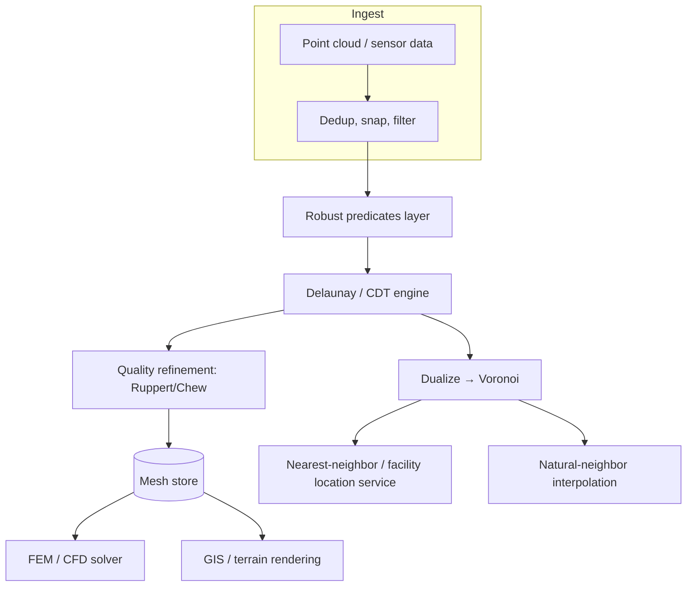

# Voronoi Diagram & Delaunay Triangulation — Senior Level

> **One-line summary:** At the senior level we architect *systems* around these structures: mesh generation for finite-element simulation (where Delaunay's max-min-angle quality is non-negotiable), terrain models (TINs) and GIS, and spatial interpolation. The dominant engineering concern becomes **numerical robustness of the in-circle / orientation predicates** — naive doubles produce inconsistent, non-planar meshes — alongside **constrained Delaunay**, **3D / higher-dimensional** triangulations, and **scaling** to billions of points out of core and across machines.

---

## Table of Contents

1. [Introduction](#introduction)
2. [System Design: Where These Structures Live](#system-design-where-these-structures-live)
3. [Mesh Generation and FEM](#mesh-generation-and-fem)
4. [Terrain, TINs, and GIS](#terrain-tins-and-gis)
5. [Robustness of the In-Circle Predicate](#robustness-of-the-in-circle-predicate)
6. [Constrained and Conforming Delaunay](#constrained-and-conforming-delaunay)
7. [3D and Higher Dimensions](#3d-and-higher-dimensions)
8. [Scaling: Parallel, Out-of-Core, Streaming](#scaling-parallel-out-of-core-streaming)
9. [Code Examples](#code-examples)
10. [Observability](#observability)
11. [Failure Modes](#failure-modes)
12. [Summary](#summary)

---

## Introduction

> Focus: "How do I build production systems around Voronoi/Delaunay?"

By the senior level, the algorithm is a commodity — you will almost always call CGAL, Triangle, TetGen, scipy.spatial, or a GIS engine rather than hand-roll Bowyer–Watson. The hard parts move elsewhere:

- **Quality, not just correctness.** A finite-element solver does not just need *a* triangulation; it needs one whose smallest angle is bounded away from zero, whose elements are sized to the local feature scale, and which conforms to domain boundaries. Delaunay is the starting point because it maximizes the minimum angle, but real meshers (Ruppert's refinement, Chew's algorithm) add Steiner points to *guarantee* angle bounds.
- **Robustness at scale.** Run a naive `double` in-circle test on a billion real-world coordinates and you *will* hit cases where the predicate lies, the mesh becomes non-planar, triangles overlap, and the solver diverges. Exact predicates are not optional in production.
- **Constraints.** Real domains have required edges (coastlines, road centerlines, crease lines on a CAD model). Plain Delaunay cannot honor them; you need *constrained* Delaunay.
- **Dimensions and distribution.** 3D Delaunay (tetrahedralization) underpins volumetric simulation and has `Θ(n^2)` worst-case output; massive point clouds force out-of-core and parallel construction.

This file is about those system-level concerns.

---

## System Design: Where These Structures Live



The pipeline is the same across domains: **clean → robust predicates → triangulate → (refine) → consume.** The two non-negotiable layers are *cleaning* (dedup/snap, because duplicate and near-duplicate points break predicates) and the *robust predicate layer* (the foundation everything else stands on).

---

## Mesh Generation and FEM

Finite-element methods discretize a domain into elements (triangles in 2D, tetrahedra in 3D) and solve PDEs over them. Element **shape quality** directly controls the solver's accuracy and conditioning:

- **Why Delaunay?** It maximizes the minimum angle, so it avoids the *thin sliver* triangles that wreck interpolation error and matrix conditioning. A sliver with a 2° angle can make the stiffness matrix nearly singular.
- **Quality refinement.** Plain Delaunay still permits poor angles if the input demands it. **Ruppert's algorithm** inserts Steiner points at circumcenters of bad triangles, provably terminating with all angles ≥ ~20.7°. **Chew's second algorithm** is similar. Both rely on Delaunay's empty-circle property to know *where* to insert.
- **Sizing fields.** Real meshes vary element size: fine near stress concentrations, coarse in the bulk. A sizing function drives where refinement adds points.

| Mesh property | Why it matters for FEM | How Delaunay/refinement provides it |
|---------------|------------------------|-------------------------------------|
| Bounded min angle | Solver accuracy & conditioning | Delaunay max-min-angle + Ruppert refinement |
| Boundary conformance | Geometry must be represented | Constrained Delaunay (CDT) |
| Graded sizing | Efficiency: few elements where possible | Sizing field driving Steiner insertion |
| No overlaps / planarity | Valid topology for assembly | Exact predicates |

Tools: **Triangle** (Shewchuk, 2D), **TetGen** / **CGAL Mesh_3** (3D), **Gmsh**.

---

## Terrain, TINs, and GIS

A **Triangulated Irregular Network (TIN)** models a terrain surface from scattered elevation samples `(x, y, z)`. The 2D Delaunay triangulation of the `(x, y)` positions, lifted to `z`, gives the standard TIN because:

- Delaunay's well-shaped triangles minimize interpolation artifacts on slopes.
- It is the triangulation that, among all triangulations, tends to produce the most "natural" surface for elevation (related to minimizing the roughness of the linear interpolant).

GIS uses of Voronoi/Delaunay:

- **Nearest-facility / service-area** maps (Voronoi cells = catchment areas for hospitals, schools, cell towers).
- **Spatial interpolation**: **natural-neighbor interpolation** weights samples by how much area a query point "steals" from each neighbor's Voronoi cell — smooth and local. Compare with IDW and kriging.
- **Watershed / hydrology** on TINs (flow follows triangle gradients).
- **Largest empty circle** for siting (place a new store maximally far from competitors).

| GIS task | Structure used | Note |
|----------|----------------|------|
| Catchment / service areas | Voronoi cells | Clip to study-region polygon |
| Terrain surface (TIN) | Delaunay of (x,y) lifted to z | Watch for flat areas / coplanar samples |
| Natural-neighbor interpolation | Voronoi cell areas (Sibson weights) | Smooth, exact at samples |
| Facility location | Voronoi vertices (largest empty circle) | Combined with constraints |

---

## Robustness of the In-Circle Predicate

This is the heart of senior-level work. The in-circle determinant computed in floating point can return the **wrong sign** when points are nearly cocircular — and a single wrong sign produces a non-Delaunay, often **non-planar** mesh: overlapping triangles, infinite flip loops, or crashes deep in the solver.

### Why naive doubles fail

The determinant is a sum of products of coordinates squared. Near degeneracy the true value is tiny, but the intermediate products are large, so catastrophic cancellation swamps the result in rounding error. The computed sign becomes essentially random.

### The robustness ladder

| Approach | Cost | Robustness |
|----------|------|-----------|
| Naive `double` | Fastest | Unsafe — wrong signs near degeneracy |
| Epsilon tolerance | Fast | Worse — creates *inconsistent* decisions (A says inside, B says outside) |
| **Adaptive exact (Shewchuk)** | Fast common case, exact when needed | Correct sign always; the industry standard |
| Exact rational (e.g., GMP) | Slow | Always correct; used as a fallback / oracle |
| Integer coordinates + exact integer det | Fast & exact | Correct *if* inputs are integers within range |

**Shewchuk's adaptive predicates** are the canonical answer: compute a fast floating-point estimate with a rigorous error bound; only if the estimate is within the error bound do you escalate to higher-precision (expansion) arithmetic. The common case stays fast; the rare degenerate case is exact. CGAL and Triangle use exactly this.

### Symbolic perturbation (SoS)

Even with exact arithmetic, a determinant of *exactly* 0 (true cocircular points) leaves the algorithm without a decision. **Simulation of Simplicity** consistently breaks ties as if each point were perturbed by an infinitesimal, distinct amount — guaranteeing a single, consistent triangulation with no special-case code for cocircularity.

### Engineering rules

- **Snap and dedup** inputs first; near-duplicates are the main source of degeneracy.
- **Use exact predicates** (don't reinvent them — link CGAL/Triangle/Shewchuk's code).
- **Prefer integer or fixed-point coordinates** when the domain allows; exact integer determinants are both fast and provably correct.
- **Never use a tolerance to *decide* a flip** — only to detect that you must escalate precision.

---

## Constrained and Conforming Delaunay

Real domains require certain edges (a coastline, a building footprint, a CAD crease) to appear in the triangulation. Plain Delaunay may not include them.

- **Constrained Delaunay Triangulation (CDT):** forces a set of input segments to be edges, then makes every *other* edge as Delaunay as possible (empty-circle property restricted to visibility — a point only "counts" if it is visible to the triangle, not blocked by a constraint). No new points added.
- **Conforming Delaunay:** keeps the strict empty-circle property by *subdividing* constraint segments with Steiner points until each sub-segment is Delaunay. Adds points; needed when you cannot tolerate non-Delaunay edges.

| Variant | Adds points? | Strict empty-circle? | Use when |
|---------|--------------|----------------------|----------|
| Plain Delaunay | No | Yes | No required edges |
| Constrained (CDT) | No | Constrained (visibility) | Must honor input edges, can't add points |
| Conforming Delaunay | Yes (Steiner) | Yes | Need both edges *and* empty-circle |
| Quality (Ruppert/Chew) | Yes | Yes | Need bounded angles for FEM |

---

## 3D and Higher Dimensions

In 3D the Delaunay triangulation becomes a **tetrahedralization** with the empty-**circumsphere** property. Key differences that bite at scale:

- **Output can be `Θ(n^2)`.** Points on a moment curve produce a quadratic number of tetrahedra — unlike the linear 2D case. Memory planning matters.
- **Slivers reappear.** 3D Delaunay does *not* avoid sliver tetrahedra (nearly flat, four near-cocircular points). Sliver removal is a whole research area; Delaunay's max-min-angle guarantee does not carry to 3D.
- **Predicates get heavier.** The in-sphere test is a 5×5 determinant; robustness is even more critical.
- **Lifting generalizes.** A `d`-dimensional Delaunay triangulation is the projection of the lower convex hull of points lifted to the paraboloid in `d+1` dimensions — the same elegant duality as 2D, which is why hull and Delaunay codes share infrastructure.

Tools: **TetGen**, **CGAL 3D triangulations**, **Qhull** (n-dimensional via the lifting/hull route).

---

## Scaling: Parallel, Out-of-Core, Streaming

For massive point clouds (LiDAR terrain, cosmology simulations):

- **Spatial divide & conquer:** partition the domain (e.g., by a k-d tree or grid), triangulate each cell, and **merge** along boundaries — only points near a boundary can affect the seam, so merges are local.
- **Parallel insertion:** insert points concurrently when their cavities are disjoint; lock or retry on conflicts. GPU Delaunay (e.g., gDel3D) batches independent flips.
- **Out-of-core / streaming:** process points in spatial order; once a region is "finalized" (no future point can fall in its triangles' circumcircles), flush it to disk. Streaming Delaunay exploits the locality of the empty-circle property.
- **Distributed:** shard by spatial region; handle the *boundary halo* of each shard explicitly so seam triangles are consistent.

| Scaling strategy | Mechanism | Watch out for |
|------------------|-----------|---------------|
| Divide & conquer + merge | Triangulate cells, stitch seams | Boundary halo width; degenerate seams |
| Parallel cavity insertion | Disjoint cavities run concurrently | Conflicts when cavities overlap |
| Streaming / out-of-core | Finalize + flush spatial regions | Determining when a region is safe to flush |
| GPU batched flips | Massively parallel legalization | Robustness on the device; deterministic order |

---

## Code Examples

### Example: Adaptive (filtered) in-circle predicate — fast path with error bound

The standard production pattern: a fast `double` estimate with a rigorous error bound; escalate only when the estimate is too close to zero to trust.

#### Go

```go
package main

import (
	"fmt"
	"math"
	"math/big"
)

type Pt struct{ X, Y float64 }

// inCircleFast: float64 estimate (3x3 reduced determinant).
func inCircleFast(a, b, c, d Pt) float64 {
	ax, ay := a.X-d.X, a.Y-d.Y
	bx, by := b.X-d.X, b.Y-d.Y
	cx, cy := c.X-d.X, c.Y-d.Y
	az := ax*ax + ay*ay
	bz := bx*bx + by*by
	cz := cx*cx + cy*cy
	return ax*(by*cz-bz*cy) - ay*(bx*cz-bz*cx) + az*(bx*cy-by*cx)
}

// inCircleExact: big.Rat fallback — always the correct sign.
func inCircleExact(a, b, c, d Pt) int {
	r := func(f float64) *big.Rat { return new(big.Rat).SetFloat64(f) }
	sub := func(x, y *big.Rat) *big.Rat { return new(big.Rat).Sub(x, y) }
	mul := func(x, y *big.Rat) *big.Rat { return new(big.Rat).Mul(x, y) }
	add := func(x, y *big.Rat) *big.Rat { return new(big.Rat).Add(x, y) }

	ax, ay := sub(r(a.X), r(d.X)), sub(r(a.Y), r(d.Y))
	bx, by := sub(r(b.X), r(d.X)), sub(r(b.Y), r(d.Y))
	cx, cy := sub(r(c.X), r(d.X)), sub(r(c.Y), r(d.Y))
	az := add(mul(ax, ax), mul(ay, ay))
	bz := add(mul(bx, bx), mul(by, by))
	cz := add(mul(cx, cx), mul(cy, cy))
	det := sub(
		add(mul(ax, sub(mul(by, cz), mul(bz, cy))), mul(az, sub(mul(bx, cy), mul(by, cx)))),
		mul(ay, sub(mul(bx, cz), mul(bz, cx))),
	)
	return det.Sign()
}

// inCircle: adaptive — fast path, exact fallback near zero.
func inCircle(a, b, c, d Pt) int {
	est := inCircleFast(a, b, c, d)
	// crude static error bound; production code uses Shewchuk's tight bound.
	bound := 1e-10 * (math.Abs(est) + 1)
	if est > bound {
		return 1
	}
	if est < -bound {
		return -1
	}
	return inCircleExact(a, b, c, d) // escalate
}

func main() {
	a, b, c, d := Pt{0, 0}, Pt{1, 0}, Pt{0, 1}, Pt{1, 1} // cocircular (unit circle? no) test
	fmt.Println("inCircle sign:", inCircle(a, b, c, d))
}
```

#### Java

```java
import java.math.BigDecimal;

public class AdaptiveInCircle {
    record Pt(double x, double y) {}

    static double fast(Pt a, Pt b, Pt c, Pt d) {
        double ax = a.x()-d.x(), ay = a.y()-d.y();
        double bx = b.x()-d.x(), by = b.y()-d.y();
        double cx = c.x()-d.x(), cy = c.y()-d.y();
        double az = ax*ax+ay*ay, bz = bx*bx+by*by, cz = cx*cx+cy*cy;
        return ax*(by*cz-bz*cy) - ay*(bx*cz-bz*cx) + az*(bx*cy-by*cx);
    }

    static int exact(Pt a, Pt b, Pt c, Pt d) {
        BigDecimal ax = bd(a.x()).subtract(bd(d.x())), ay = bd(a.y()).subtract(bd(d.y()));
        BigDecimal bx = bd(b.x()).subtract(bd(d.x())), by = bd(b.y()).subtract(bd(d.y()));
        BigDecimal cx = bd(c.x()).subtract(bd(d.x())), cy = bd(c.y()).subtract(bd(d.y()));
        BigDecimal az = ax.multiply(ax).add(ay.multiply(ay));
        BigDecimal bz = bx.multiply(bx).add(by.multiply(by));
        BigDecimal cz = cx.multiply(cx).add(cy.multiply(cy));
        BigDecimal det = ax.multiply(by.multiply(cz).subtract(bz.multiply(cy)))
                .subtract(ay.multiply(bx.multiply(cz).subtract(bz.multiply(cx))))
                .add(az.multiply(bx.multiply(cy).subtract(by.multiply(cx))));
        return det.signum();
    }

    static BigDecimal bd(double v) { return new BigDecimal(v); }

    static int inCircle(Pt a, Pt b, Pt c, Pt d) {
        double est = fast(a, b, c, d);
        double bound = 1e-10 * (Math.abs(est) + 1);
        if (est > bound) return 1;
        if (est < -bound) return -1;
        return exact(a, b, c, d);
    }

    public static void main(String[] args) {
        Pt a = new Pt(0,0), b = new Pt(1,0), c = new Pt(0,1), d = new Pt(1,1);
        System.out.println("inCircle sign: " + inCircle(a, b, c, d));
    }
}
```

#### Python

```python
from fractions import Fraction


def in_circle_fast(a, b, c, d):
    ax, ay = a[0]-d[0], a[1]-d[1]
    bx, by = b[0]-d[0], b[1]-d[1]
    cx, cy = c[0]-d[0], c[1]-d[1]
    az, bz, cz = ax*ax+ay*ay, bx*bx+by*by, cx*cx+cy*cy
    return ax*(by*cz-bz*cy) - ay*(bx*cz-bz*cx) + az*(bx*cy-by*cx)


def in_circle_exact(a, b, c, d):
    F = Fraction
    ax, ay = F(a[0])-F(d[0]), F(a[1])-F(d[1])
    bx, by = F(b[0])-F(d[0]), F(b[1])-F(d[1])
    cx, cy = F(c[0])-F(d[0]), F(c[1])-F(d[1])
    az, bz, cz = ax*ax+ay*ay, bx*bx+by*by, cx*cx+cy*cy
    det = ax*(by*cz-bz*cy) - ay*(bx*cz-bz*cx) + az*(bx*cy-by*cx)
    return (det > 0) - (det < 0)


def in_circle(a, b, c, d):
    est = in_circle_fast(a, b, c, d)
    bound = 1e-10 * (abs(est) + 1)
    if est > bound:
        return 1
    if est < -bound:
        return -1
    return in_circle_exact(a, b, c, d)   # escalate to exact arithmetic


if __name__ == "__main__":
    print(in_circle((0, 0), (1, 0), (0, 1), (1, 1)))
```

**What it does:** demonstrates the adaptive-predicate pattern — a fast `double` estimate guarded by an error bound, falling back to exact rational arithmetic only when the sign is uncertain.
**Run:** `go run main.go` | `javac AdaptiveInCircle.java && java AdaptiveInCircle` | `python adaptive_incircle.py`

### Example: Ruppert-style quality check and circumcenter insertion

The skeleton of a quality refiner: find a "bad" triangle (smallest angle below a threshold), and insert its circumcenter as a new Steiner point. The empty-circle property guarantees the circumcenter is a valid insertion site. Real refiners add encroachment handling on constraint segments; this is the core loop.

#### Python

```python
import math


def min_angle(a, b, c):
    def ang(p, q, r):  # angle at q
        v1 = (p[0]-q[0], p[1]-q[1])
        v2 = (r[0]-q[0], r[1]-q[1])
        dot = v1[0]*v2[0] + v1[1]*v2[1]
        n1 = math.hypot(*v1)
        n2 = math.hypot(*v2)
        return math.degrees(math.acos(max(-1, min(1, dot/(n1*n2)))))
    return min(ang(a, b, c), ang(b, c, a), ang(c, a, b))


def circumcenter(a, b, c):
    d = 2 * (a[0]*(b[1]-c[1]) + b[0]*(c[1]-a[1]) + c[0]*(a[1]-b[1]))
    ux = ((a[0]**2+a[1]**2)*(b[1]-c[1]) + (b[0]**2+b[1]**2)*(c[1]-a[1]) + (c[0]**2+c[1]**2)*(a[1]-b[1])) / d
    uy = ((a[0]**2+a[1]**2)*(c[0]-b[0]) + (b[0]**2+b[1]**2)*(a[0]-c[0]) + (c[0]**2+c[1]**2)*(b[0]-a[0])) / d
    return (ux, uy)


def steiner_points(triangles, min_angle_deg=20.7):
    """Return circumcenters of all triangles below the angle bound."""
    out = []
    for (a, b, c) in triangles:
        if min_angle(a, b, c) < min_angle_deg:
            out.append(circumcenter(a, b, c))
    return out


if __name__ == "__main__":
    sliver = [(0, 0), (10, 0), (5, 0.4)]   # very thin
    print("min angle:", round(min_angle(*sliver), 2), "deg")
    print("insert circumcenter at:", steiner_points([sliver]))
```

The refinement loop is: build Delaunay → while a triangle violates the angle bound, insert its circumcenter and re-legalize → terminate (Ruppert proved termination for angle bounds up to ~20.7°). This is why FEM meshers wrap Delaunay rather than using it raw.

### Divide-and-conquer merge (the seam idea)

For distributed and out-of-core builds you triangulate sub-regions and stitch them. The merge walks a "rising bubble": start from the lowest bridge edge between the two hulls, and repeatedly add the Delaunay-legal cross edge, advancing up the seam. Only candidate points near the seam are tested, which is what makes the merge linear in the seam length and enables parallelism.

| Merge concern | Handling |
|---------------|----------|
| Which cross edges are legal | In-circle test against both sides' candidate apexes |
| Seam width | Only points within the union of relevant circumcircles matter |
| Degenerate seams (cocircular across the cut) | Symbolic perturbation for a consistent choice |
| Parallel correctness | Each shard owns its interior; seam owned by a deterministic rule |

---

## Observability

| Metric | Why | Alert threshold |
|--------|-----|-----------------|
| `min_triangle_angle` | Mesh quality for FEM | < 20° (refine) |
| `exact_predicate_escalations` / total | Degeneracy / robustness pressure | spiking ⇒ snap/dedup inputs |
| `flip_count` per insertion | Detect pathological inputs / loops | unbounded ⇒ predicate inconsistency |
| `non_planar_violations` (overlap checks) | Correctness canary | any > 0 is a bug |
| `triangles` vs `2n−5` | Sanity of output size | far above ⇒ duplicates / bug |
| `mesh_build_seconds` per million pts | Throughput | regression ⇒ point-location degraded |

Always run a **post-build validator**: every internal edge legal, Euler's formula satisfied, no overlapping triangles. It catches robustness regressions before the solver does.

---

## Topology Data Structures: DCEL and Quad-Edge

How you *store* the triangulation governs how fast flips, traversal, and dualization are. Two structures dominate:

- **DCEL (Doubly-Connected Edge List) / half-edge:** every edge is two directed half-edges; each half-edge knows its `next`, `twin`, origin vertex, and incident face. Walking around a vertex or a face is `O(1)`-per-step. Ideal when you also store the dual Voronoi faces explicitly.
- **Quad-edge (Guibas–Stolfi):** a single structure that represents a planar subdivision *and its dual simultaneously*. The `Rot` operator jumps from a Delaunay edge to the corresponding Voronoi edge in `O(1)`. This is why the Guibas–Stolfi divide-and-conquer algorithm uses it — you get Delaunay and Voronoi from one structure.

| Structure | Flip cost | Dual access | Used by |
|-----------|-----------|-------------|---------|
| Triangle-soup (array of triples) | `O(n)` to find neighbors | recompute | toy/Bowyer–Watson demos |
| DCEL / half-edge | `O(1)` neighbor, `O(1)` flip | store dual faces | CGAL, most meshers |
| Quad-edge | `O(1)` flip | `Rot` operator `O(1)` | Guibas–Stolfi D&C |

The lesson: the naive "array of triangle triples" used in the junior code is `O(n)` per neighbor lookup, which is one reason naive Bowyer–Watson is slow. Production code uses a half-edge or quad-edge mesh so flips and walks are constant time.

## Library Landscape

You will almost never ship a hand-rolled triangulator. Know the trade-offs:

| Library | Language | Strengths | Notes |
|---------|----------|-----------|-------|
| **CGAL** | C++ | Exact predicates, 2D/3D/dD, constrained, regular | The gold standard; steep API |
| **Triangle** (Shewchuk) | C | 2D Delaunay + quality meshing, robust | Single-file, battle-tested |
| **TetGen** | C++ | 3D Delaunay tetrahedralization + meshing | FEM volumetric meshes |
| **Qhull** | C | Convex hull → Delaunay/Voronoi via lifting, n-D | Powers scipy.spatial |
| **scipy.spatial** | Python | `Delaunay`, `Voronoi`, KDTree wrappers | Qhull under the hood |
| **Gmsh** | C++/GUI | Full mesh-generation pipeline | CAD import, sizing fields |

When evaluating a library for production, check three things: **are the predicates exact?** (robustness), **does it support constraints?** (real domains have required edges), and **what is the output topology?** (half-edge vs index arrays affects your downstream code).

## Voronoi Variants You Will Meet in Production

Plain Euclidean Voronoi is the start; real systems often need a variant. Each changes the *distance* or *weight*, which changes the predicate.

| Variant | Distance / weight | Cell boundaries | Typical use |
|---------|-------------------|-----------------|-------------|
| **Power (Laguerre) diagram** | `dist² − weight` | Still straight lines | Weighted sites, sphere packings, molecular models |
| **Multiplicatively weighted** | `dist / weight` | Circular arcs (Apollonius) | Influence zones with differing "strength" |
| **Additively weighted (Apollonius)** | `dist − radius` | Hyperbolic arcs | Disks/circles of different radii (VLSI, GIS buffers) |
| **Manhattan (L1) Voronoi** | `|dx| + |dy|` | Axis-aligned / 45° segments | Grid/routing domains (see sibling *16-manhattan-chebyshev*) |
| **Geodesic Voronoi** | shortest path on a surface/with obstacles | curved | Robotics, terrain-aware planning |

The **power diagram** is the most important: it is the *only* one whose dual is still a (regular/weighted Delaunay) triangulation and whose construction reuses the lifting trick — lift each weighted site `(x, y)` with weight `w` to `(x, y, x²+y²−w)`. The lower hull of these lifted points projects to the **regular triangulation**, the weighted analogue of Delaunay. This is how meshers handle protein atoms of differing van der Waals radii.

## 3D In-Sphere Predicate

In 3D the empty-circle becomes the empty-**circumsphere**, decided by a 5×5 determinant. Robustness pressure is even higher because the polynomial degree is larger.

#### Python

```python
def in_sphere(a, b, c, d, e):
    """> 0 => e inside circumsphere of tetra (a,b,c,d) for a positively-oriented tetra."""
    def row(p):
        return [p[0]-e[0], p[1]-e[1], p[2]-e[2],
                (p[0]-e[0])**2 + (p[1]-e[1])**2 + (p[2]-e[2])**2]
    m = [row(a), row(b), row(c), row(d)]

    # 4x4 determinant by cofactor expansion
    def det4(mat):
        from itertools import permutations
        total = 0
        for perm in permutations(range(4)):
            sign = 1
            for i in range(4):
                for j in range(i+1, 4):
                    if perm[i] > perm[j]:
                        sign = -sign
            prod = 1
            for i in range(4):
                prod *= mat[i][perm[i]]
            total += sign * prod
        return total
    return det4(m)


if __name__ == "__main__":
    tet = [(0, 0, 0), (1, 0, 0), (0, 1, 0), (0, 0, 1)]
    print("inside:", in_sphere(*tet, (0.2, 0.2, 0.2)))   # > 0
    print("outside:", in_sphere(*tet, (5, 5, 5)))         # < 0
```

The same lifting logic applies: lift to a paraboloid in 4D and the in-sphere test is an orientation test there. The takeaway for system design: every dimension adds a coordinate column, raises the determinant degree, and tightens the robustness budget.

## Failure Modes

- **Inconsistent predicate ⇒ infinite flips / non-planar mesh.** Fix: exact predicates + SoS tie-breaking.
- **Near-duplicate points.** Fix: snap to a grid and dedup before triangulating.
- **Sliver tetrahedra in 3D.** Fix: explicit sliver-removal passes; Delaunay alone doesn't prevent them.
- **Quadratic blow-up in 3D output.** Fix: detect pathological inputs; budget memory; consider alternative meshing.
- **Constraint not honored.** Fix: use CDT/conforming Delaunay, not plain Delaunay.
- **Unbounded Voronoi cells crash a consumer.** Fix: clip to a bounding box / study region.
- **Seam inconsistency in distributed builds.** Fix: explicit boundary halos with shared, deterministic predicates.

---

## Capacity and Cost Planning

Back-of-envelope numbers a senior should be able to produce on demand:

| Quantity | Estimate | Reasoning |
|----------|----------|-----------|
| Triangles for `n` 2D sites | `≈ 2n` | Euler bound `2n − 5`. |
| Edges (Delaunay) | `≈ 3n` | Euler bound `3n − 6`. |
| Memory (half-edge mesh) | `≈ (large constant) · n` | Per-edge twin/next/face pointers; budget ~100–200 bytes/site in practice. |
| Tetrahedra for `n` 3D sites | `O(n)` typical, `O(n²)` worst | Plan memory for the pathological case if inputs are adversarial. |
| Build time, `n = 10⁷`, single core | seconds–minutes | `O(n log n)` with exact predicates; dominated by predicate escalations on degenerate data. |

For a billion-point terrain you are firmly in out-of-core / distributed territory: a single machine's RAM cannot hold the half-edge mesh, so you stream and finalize regions, or shard across nodes with boundary halos. The robustness budget also scales — more points means more near-degenerate quadruples, so the fraction of exact-predicate escalations rises and must be monitored.

## Summary

At the senior level, Voronoi/Delaunay is plumbing inside larger systems — FEM mesh generation (where Delaunay's max-min-angle quality plus Ruppert/Chew refinement guarantees usable elements), terrain/TIN and GIS (service areas, natural-neighbor interpolation), and proximity services. The defining engineering challenge is **robustness**: naive floating-point in-circle tests lie near degeneracy and produce broken, non-planar meshes, so production code uses **adaptive exact predicates** plus **symbolic perturbation**. Add **constrained/conforming Delaunay** to honor domain edges, respect the harsher realities of **3D** (slivers, quadratic output, in-sphere tests), and scale via **divide-and-conquer merging, parallel cavity insertion, and streaming** for billion-point clouds.

---

**Next step:** Continue to [`professional.md`](./professional.md) for the formal proofs — empty-circle ⟺ max-min-angle, the lifting-to-paraboloid duality (Delaunay = lower convex hull in 3D), Fortune's `O(n log n)` correctness, in-circle determinant exactness, and the `Ω(n log n)` lower bound.
