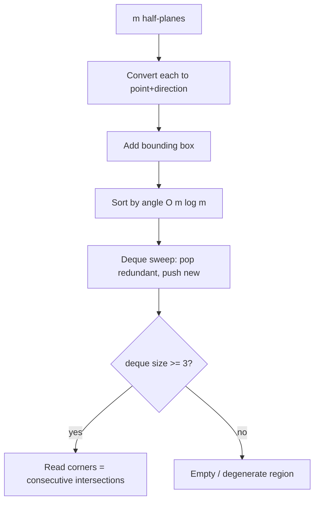

# Half-Plane Intersection — Junior Level

> **One-line summary:** A **half-plane** is everything on one side of a line — all points `(x, y)` satisfying `a·x + b·y ≤ c`. The **intersection** of several half-planes is the (possibly empty, possibly unbounded) **convex region** of points that satisfy *all* the inequalities at once. With `m` half-planes you can find this region in `O(m log m)` by sorting them by angle and sweeping a **deque** that keeps only the lines that still matter.

---

## Table of Contents

1. [Introduction](#introduction)
2. [Prerequisites](#prerequisites)
3. [Glossary](#glossary)
4. [Geometry Primitives](#geometry-primitives)
5. [Core Concepts](#core-concepts)
6. [Big-O Summary](#big-o-summary)
7. [Real-World Analogies](#real-world-analogies)
8. [Pros & Cons](#pros--cons)
9. [Step-by-Step Walkthrough](#step-by-step-walkthrough)
10. [Code Examples](#code-examples)
11. [Coding Patterns](#coding-patterns)
12. [Error Handling](#error-handling)
13. [Performance Tips](#performance-tips)
14. [Best Practices](#best-practices)
15. [Edge Cases & Pitfalls](#edge-cases--pitfalls)
16. [Common Mistakes](#common-mistakes)
17. [Cheat Sheet](#cheat-sheet)
18. [Visual Animation](#visual-animation)
19. [Summary](#summary)
20. [Further Reading](#further-reading)

---

## Introduction

Draw a straight line across a piece of paper. The line splits the paper into two halves. Pick one of those halves — say, "everything below the line" — and shade it. That shaded region is a **half-plane**. It is infinite (it stretches off the page in every direction on its side), it has a perfectly straight edge (the line itself), and it is **convex**: any two shaded points have the whole segment between them shaded too.

Now draw a second line, shade one side of it, and ask: *where do the two shaded regions overlap?* That overlap is again a region — bounded by two straight edges instead of one. Add a third line, a fourth, a fifth, each time keeping only the overlap. The region keeps shrinking, and it is always convex, always bounded by straight edges. What you are building, one constraint at a time, is the **intersection of half-planes**.

Formally, a half-plane is the set of all points satisfying a single linear inequality:

```
{ (x, y) : a·x + b·y ≤ c }
```

Given `m` such inequalities, the **half-plane intersection** is the set of points that satisfy *every one of them*:

```
{ (x, y) : a₁x + b₁y ≤ c₁  AND  a₂x + b₂y ≤ c₂  AND  ...  AND  aₘx + bₘy ≤ cₘ }
```

This region is always a **convex polygon** — possibly with infinitely long sides (unbounded), possibly a single point or segment (degenerate), and possibly **empty** (no point satisfies all the constraints at once).

Why does this matter? Half-plane intersection is one of the foundational operations in computational geometry. It shows up in:

- **2D linear programming** — "is there any point satisfying all these constraints, and which one maximizes my objective?" Each constraint is a half-plane.
- **Visibility / the kernel of a polygon** — the set of points inside a room from which you can see *every* wall is exactly an intersection of half-planes.
- **Clipping** — cutting a shape down to the part that fits inside a window or a convex boundary.
- **Feasible-region modeling** — any system of linear "≤" constraints carves out a convex feasible region.

This file teaches the *what* and *how*: what a half-plane is, how to intersect a few of them by hand, and the shape of the standard algorithm. We will lean on the same single primitive that powers the sibling topic *01-convex-hull* — the **cross product** — because, as you will see, half-plane intersection is the *mirror image* (the geometric **dual**) of building a convex hull.

A mental anchor for the whole topic:

> **A convex hull wraps a rubber band *around* a set of points. A half-plane intersection carves a convex region *out* by shaving off everything on the wrong side of each line.** One builds up an outline from points; the other cuts down a region with cuts. They are two views of the same geometry.

---

## Prerequisites

Before reading this file you should be comfortable with:

- **Basic coordinate geometry** — points `(x, y)`, lines, and the equation of a line `a·x + b·y = c`.
- **Vectors** — adding them, subtracting them, and the idea of a direction `(dx, dy)`.
- **The cross product (2D)** — `cross((ax,ay),(bx,by)) = ax·by − ay·bx`; its sign tells you left turn / right turn / straight. (See sibling *01-convex-hull*, "Geometry Primitives".)
- **Sorting with a custom comparator** — sorting items by an angle, not by a number.
- **A deque (double-ended queue)** — pushing and popping from *both* ends. (See topic *05-basic-data-structures/03-queues*.)
- **Big-O notation** — `O(m)`, `O(m log m)`.

Optional but helpful:

- Familiarity with the **convex hull** (sibling *01-convex-hull*) — the algorithm here is its dual.
- Knowing how to **intersect two lines** (sibling *02-line-intersection*) — we use it to find each polygon corner.
- A rough idea of **linear programming** — half-plane intersection is its geometric heart in 2D.

---

## Glossary

| Term | Meaning |
|------|---------|
| **Half-plane** | All points on one side of a line: `{(x,y) : a·x + b·y ≤ c}`. |
| **Bounding line** | The line `a·x + b·y = c` that forms the straight edge of the half-plane. |
| **Inward normal** | The direction `(−a, −b)` pointing *into* the allowed (`≤`) side — toward the points that satisfy the inequality. |
| **Direction vector** | The direction you walk *along* the bounding line; for normal `(a,b)` it is `(b, −a)` (or its negative). |
| **Angle (of a half-plane)** | The polar angle `atan2` of its direction vector — used to sort half-planes. |
| **Feasible region** | The intersection: the set of points satisfying *all* the half-planes. Always convex. |
| **Bounded region** | A feasible region of finite area — a closed convex polygon. |
| **Unbounded region** | A feasible region that stretches to infinity (e.g. a wedge or a strip). |
| **Empty region** | No point satisfies all constraints — the half-planes have no common point. |
| **Redundant half-plane** | One whose constraint is already implied by the others; removing it does not change the region. |
| **Deque** | Double-ended queue; here it holds the half-planes that currently form the boundary, in angular order. |
| **Cross product** | `cross(u, v) = u.x·v.y − u.y·v.x`; sign gives orientation (left/right turn). |
| **Convex** | A shape where the segment between any two interior points stays inside. |

---

## Geometry Primitives

Everything in this topic is built from two tiny operations. Get these right and the rest is bookkeeping.

### A half-plane as data

We store a half-plane not as `(a, b, c)` directly, but as a **point `p` on its boundary line** plus a **direction `d` along that line**. The allowed side is, by convention, **to the left of `d`** (the side a left turn points toward). This is the form the angle-sort algorithm wants.

```text
HalfPlane = { p: (px, py),   // any point on the boundary line
              d: (dx, dy) }  // direction of the line; allowed side is LEFT of d
```

To convert an inequality `a·x + b·y ≤ c` into this form: the line is `a·x + b·y = c`. Pick any point on it (e.g. solve for one coordinate). The direction along the line is `(b, −a)`. The allowed side (`≤`) must be on the left of the direction; if it is not, flip the direction to `(−b, a)`.

### The cross product

The single test we use everywhere:

```text
cross(u, v) = u.x * v.y - u.y * v.x
```

- `cross(u, v) > 0` → `v` turns **left** from `u` (counter-clockwise).
- `cross(u, v) < 0` → `v` turns **right** from `u` (clockwise).
- `cross(u, v) == 0` → `u` and `v` are **parallel** (same or opposite direction).

### "Is point on the allowed side?"

A point `q` is on the allowed (left) side of half-plane `h` exactly when:

```text
cross(h.d, q - h.p) > 0      // strictly inside (on the line if == 0)
```

That one check — "is `q` to the left of the line, measured from a point on the line?" — is the whole geometric meaning of "satisfies the constraint."

### Intersecting two boundary lines

To find a polygon corner we intersect the boundary lines of two half-planes. Given lines through `p1` with direction `d1`, and through `p2` with direction `d2`:

```text
t  = cross(p2 - p1, d2) / cross(d1, d2)
intersection = p1 + t * d1
```

If `cross(d1, d2) == 0` the lines are **parallel** and there is no single intersection (handled specially). This is the sibling topic *02-line-intersection* in one line.

---

## Core Concepts

### 1. One inequality = one half-plane

A linear inequality `a·x + b·y ≤ c` divides the plane into the points that satisfy it (the half-plane) and the points that don't. The boundary line `a·x + b·y = c` is the edge. Everything is decided by **which side** a point is on, and the cross product tells us the side.

### 2. Intersecting half-planes = AND-ing constraints

The intersection asks for points that satisfy *all* the inequalities simultaneously — a logical AND. Geometrically, you overlay all the shaded half-planes and keep only the region shaded by every one of them. Because each half-plane is convex and the intersection of convex sets is convex, **the result is always convex**.

### 3. The result is a convex polygon (maybe weird)

The feasible region is bounded by pieces of the half-plane lines. It can be:

- a normal **closed convex polygon** (bounded),
- an **unbounded** region — a wedge, a strip, or a half-plane itself,
- a **single point** or a **segment** (degenerate),
- **empty** — the constraints contradict each other.

A junior-level implementation handles the bounded case directly and "boxes in" the unbounded case by adding four big bounding-box half-planes (more on this below).

### 4. Sort by angle, then sweep

The fast algorithm has two phases:

1. **Sort** all half-planes by the **angle** of their direction vector. Half-planes pointing in similar directions end up next to each other.
2. **Sweep** through them in angular order, maintaining a **deque** of the half-planes that currently form the boundary. As each new half-plane comes in, it may make some of the ones already in the deque **redundant** (their corner now lies on the wrong side), so we pop them off — from the back, and sometimes from the front. Then we push the new one on the back.

This is the *exact dual* of Andrew's monotone chain for convex hull: there you sort points by `x` and pop with a turn test; here you sort lines by angle and pop with a side test.

### 5. Why a deque (both ends)?

When the half-planes span more than 180° of angle, the region "wraps around." A newly added half-plane can invalidate corners at **both** the recent (back) end *and* the oldest (front) end of the boundary chain. So we need to pop from both ends — that is precisely what a **double-ended queue** gives us. (The full justification of the deque invariants is in `professional.md`.)

### 6. Three special cases to remember

- **Parallel half-planes** facing the *same* way: keep only the tighter one (the one cutting more off).
- **Parallel half-planes** facing *opposite* ways with no overlap: the region is **empty**.
- **Unbounded** input: add a huge bounding box so the algorithm always produces a finite polygon; if a real edge touches the box, the true region was unbounded there.

---

## Big-O Summary

| Approach | Time | Space | Best for |
|----------|------|-------|----------|
| **Sort + deque (angular sweep)** | **O(m log m)** | O(m) | The standard, optimal method. |
| Incremental (add one plane at a time, re-clip polygon) | **O(m²)** | O(m) | Simple to code; fine for small `m`. |
| Brute force (check every pair of lines for corners, then filter) | **O(m³)** | O(m²) | Only for tiny inputs / teaching. |
| Single "point on allowed side?" test | **O(1)** | — | The inner primitive. |
| Two-line intersection (one corner) | **O(1)** | — | Used to compute each polygon vertex. |

> `m` = number of half-planes. The `log m` in the fast method comes entirely from the initial angular sort; the deque sweep itself is linear, because each half-plane is pushed and popped at most a constant number of times (an amortized argument, exactly like the convex-hull sweep).

---

## Real-World Analogies

| Concept | Analogy |
|---------|---------|
| A half-plane | A "Keep Out" line painted across a field: you may stand on *this* side of the line only. |
| Intersecting many half-planes | Several "keep on this side" rules at once; the legal standing area is wherever *all* rules are satisfied. |
| The feasible region | The overlap of several spotlight beams shone from different angles — only the spot lit by *every* beam counts. |
| Unbounded region | A wedge of open desert fenced on two sides but stretching to the horizon. |
| Empty region | Two rules that say "stand north of this line" and "stand south of that line" with a gap between — nowhere is legal. |
| Redundant half-plane | A fence built so far back it never actually blocks you — the other fences already hold you in. |
| Duality with convex hull | Turning a "wrap a band around nails" problem inside-out into a "shave the region with cuts" problem — same geometry, opposite viewpoint. |

Where the analogies break: real fences are finite segments; half-planes are infinite. And the "spotlight" picture suggests soft edges, but half-plane boundaries are perfectly sharp straight lines.

---

## Pros & Cons

| Pros | Cons |
|------|------|
| Produces the exact convex feasible region of any system of linear `≤` constraints. | Floating-point geometry is delicate — needs careful epsilon handling. |
| `O(m log m)` is fast enough for large constraint sets. | The deque algorithm is fiddly to get exactly right (both-end popping). |
| It is the geometric engine of **2D linear programming**. | Only works in 2D directly; higher dimensions need different methods. |
| Naturally answers visibility/kernel questions on polygons. | Unbounded and empty cases need explicit, careful handling. |
| Dual to convex hull, so insight transfers both ways. | Parallel and coincident lines are easy to mishandle. |
| The `O(m²)` incremental version is trivially simple when `m` is small. | The output can be empty/degenerate — callers must check. |

**When to use:** computing a convex feasible region, 2D LP feasibility, polygon kernel / visibility, clipping against convex boundaries, intersecting many constraints.

**When NOT to use:** a single line-vs-line query (use *02-line-intersection*); non-linear constraints (half-planes are linear only); very high dimensions (use LP solvers); when you actually need the *hull of points* rather than the *intersection of constraints* (use *01-convex-hull*).

---

## Step-by-Step Walkthrough

Let us intersect four half-planes that fence in a square-ish region. Read each as "stay on the allowed side."

```
H1:  x ≥ 0     ⇔   −x ≤ 0       (allowed: right of the y-axis)
H2:  y ≥ 0     ⇔   −y ≤ 0       (allowed: above the x-axis)
H3:  x ≤ 4                       (allowed: left of x = 4)
H4:  y ≤ 3                       (allowed: below y = 3)
```

Intuitively the feasible region is the axis-aligned rectangle with corners `(0,0)`, `(4,0)`, `(4,3)`, `(0,3)`. Let us see how the sweep builds it.

**Step 0 — convert and sort by angle.** Each half-plane gets a direction vector (allowed side on the left). Sorting by angle orders them, say, as `H1, H4, H3, H2` going counter-clockwise. (Exact order depends on your angle convention; the point is they are processed in rotational order.)

```
Sorted by angle:   H1  →  H4  →  H3  →  H2
deque: [ ]   (empty)
```

**Step 1 — push H1.** Deque has one plane; no corner yet.

```
deque: [ H1 ]
```

**Step 2 — push H4.** Two planes meet at one corner. Compute `intersection(H1, H4)`. The corner is on the allowed side of both, so keep both.

```
deque: [ H1, H4 ]      corner(H1,H4) = (0, 3)
```

**Step 3 — push H3.** Before pushing, check the *back* corner `intersection(H1, H4)`: is it still on H3's allowed side? `(0,3)` has `x = 0 ≤ 4` → yes, keep. Push H3.

```
deque: [ H1, H4, H3 ]   corner(H4,H3) = (4, 3)
```

**Step 4 — push H2.** Now check the *back*: is `corner(H4,H3) = (4,3)` on H2's allowed side (`y ≥ 0`)? Yes. Check the *front*: is `corner(H1,H4) = (0,3)` on H2's allowed side? Yes. Push H2. After pushing, also close the loop: check the front corner against the last plane.

```
deque: [ H1, H4, H3, H2 ]
corners: (0,3), (4,3), (4,0), (0,0)
```

**Result.** Reading off the corners of consecutive planes in the deque gives the rectangle `(0,0), (4,0), (4,3), (0,3)` — exactly the expected region.

Now change `H3` to `x ≤ −1`. When we try to push it, the corner `intersection(H1, H3)` would require `x ≥ 0` *and* `x ≤ −1` simultaneously — impossible. The popping logic empties the deque and the algorithm reports an **empty region**: the constraints contradict.

And if we *remove* `H3` and `H4` entirely, the region `{x ≥ 0, y ≥ 0}` is the unbounded first quadrant. A junior implementation adds a giant bounding box (e.g. `±10⁹`) up front so the output is a finite polygon whose edges sit on the box — a signal the true region was unbounded.

---

## Code Examples

### Example: Half-plane intersection via the O(m log m) angular sweep

The function below takes half-planes in `(point, direction)` form (allowed side = left of direction), adds a large bounding box, sorts by angle, runs the deque sweep, and returns the polygon corners. Coordinates are floating point.

#### Go

```go
package main

import (
	"fmt"
	"math"
	"sort"
)

type Vec struct{ X, Y float64 }

func (a Vec) Sub(b Vec) Vec   { return Vec{a.X - b.X, a.Y - b.Y} }
func (a Vec) Add(b Vec) Vec   { return Vec{a.X + b.X, a.Y + b.Y} }
func (a Vec) Mul(t float64) Vec { return Vec{a.X * t, a.Y * t} }

func cross(a, b Vec) float64 { return a.X*b.Y - a.Y*b.X }

// HalfPlane: allowed side is to the LEFT of direction D (from point P).
type HalfPlane struct {
	P, D Vec
}

func (h HalfPlane) angle() float64 { return math.Atan2(h.D.Y, h.D.X) }

// out reports whether point q is strictly OUTSIDE (to the right of) h.
func (h HalfPlane) out(q Vec) bool { return cross(h.D, q.Sub(h.P)) < -1e-9 }

// inter returns the intersection point of the boundary lines of a and b.
func inter(a, b HalfPlane) Vec {
	t := cross(b.P.Sub(a.P), b.D) / cross(a.D, b.D)
	return a.P.Add(a.D.Mul(t))
}

// HalfPlaneIntersection returns the polygon (CCW corners) of the feasible region,
// or nil if it is empty. A large bounding box keeps unbounded regions finite.
func HalfPlaneIntersection(planes []HalfPlane) []Vec {
	const BIG = 1e9
	box := []HalfPlane{
		{Vec{-BIG, -BIG}, Vec{1, 0}},  // y >= -BIG
		{Vec{BIG, -BIG}, Vec{0, 1}},   // x <= BIG
		{Vec{BIG, BIG}, Vec{-1, 0}},   // y <= BIG
		{Vec{-BIG, BIG}, Vec{0, -1}},  // x >= -BIG
	}
	hp := append(append([]HalfPlane{}, planes...), box...)

	sort.Slice(hp, func(i, j int) bool {
		ai, aj := hp[i].angle(), hp[j].angle()
		if math.Abs(ai-aj) < 1e-9 {
			// same angle: keep the tighter one first (smaller signed offset)
			return cross(hp[i].D, hp[j].P.Sub(hp[i].P)) < 0
		}
		return ai < aj
	})

	dq := make([]HalfPlane, 0, len(hp))
	for _, h := range hp {
		// drop near-duplicate angles, keeping only the tighter constraint
		if len(dq) > 0 && math.Abs(dq[len(dq)-1].angle()-h.angle()) < 1e-9 {
			continue
		}
		for len(dq) >= 2 && h.out(inter(dq[len(dq)-1], dq[len(dq)-2])) {
			dq = dq[:len(dq)-1]
		}
		for len(dq) >= 2 && h.out(inter(dq[0], dq[1])) {
			dq = dq[1:]
		}
		dq = append(dq, h)
	}
	// final cleanup: front vs back
	for len(dq) >= 3 && dq[0].out(inter(dq[len(dq)-1], dq[len(dq)-2])) {
		dq = dq[:len(dq)-1]
	}
	for len(dq) >= 3 && dq[len(dq)-1].out(inter(dq[0], dq[1])) {
		dq = dq[1:]
	}
	if len(dq) < 3 {
		return nil // empty / degenerate
	}

	poly := make([]Vec, 0, len(dq))
	for i := range dq {
		j := (i + 1) % len(dq)
		poly = append(poly, inter(dq[i], dq[j]))
	}
	return poly
}

func main() {
	planes := []HalfPlane{
		{Vec{0, 0}, Vec{0, 1}},   // x >= 0
		{Vec{0, 0}, Vec{1, 0}},   // y <= 0 ... adjust per convention
		{Vec{4, 0}, Vec{0, -1}},  // x <= 4
		{Vec{0, 3}, Vec{-1, 0}},  // y <= 3
	}
	poly := HalfPlaneIntersection(planes)
	fmt.Printf("region has %d corners:\n", len(poly))
	for _, p := range poly {
		fmt.Printf("  (%.2f, %.2f)\n", p.X, p.Y)
	}
}
```

#### Java

```java
import java.util.*;

public class HalfPlaneIntersection {
    static double cross(double ax, double ay, double bx, double by) {
        return ax * by - ay * bx;
    }

    // Half-plane: allowed side is LEFT of direction (dx,dy) from point (px,py).
    static class HP {
        double px, py, dx, dy;
        HP(double px, double py, double dx, double dy) {
            this.px = px; this.py = py; this.dx = dx; this.dy = dy;
        }
        double angle() { return Math.atan2(dy, dx); }
        boolean out(double qx, double qy) {
            return cross(dx, dy, qx - px, qy - py) < -1e-9;
        }
    }

    static double[] inter(HP a, HP b) {
        double t = cross(b.px - a.px, b.py - a.py, b.dx, b.dy)
                 / cross(a.dx, a.dy, b.dx, b.dy);
        return new double[]{a.px + a.dx * t, a.py + a.dy * t};
    }

    static List<double[]> solve(List<HP> planes) {
        final double BIG = 1e9;
        List<HP> hp = new ArrayList<>(planes);
        hp.add(new HP(-BIG, -BIG, 1, 0));
        hp.add(new HP(BIG, -BIG, 0, 1));
        hp.add(new HP(BIG, BIG, -1, 0));
        hp.add(new HP(-BIG, BIG, 0, -1));

        hp.sort((a, b) -> {
            double ai = a.angle(), aj = b.angle();
            if (Math.abs(ai - aj) < 1e-9) {
                return cross(a.dx, a.dy, b.px - a.px, b.py - a.py) < 0 ? -1 : 1;
            }
            return Double.compare(ai, aj);
        });

        Deque<HP> dq = new ArrayDeque<>();
        List<HP> list = new ArrayList<>(); // we need index access for inter()
        for (HP h : hp) {
            if (!list.isEmpty()
                && Math.abs(list.get(list.size() - 1).angle() - h.angle()) < 1e-9)
                continue;
            while (list.size() >= 2) {
                double[] p = inter(list.get(list.size() - 1), list.get(list.size() - 2));
                if (h.out(p[0], p[1])) list.remove(list.size() - 1);
                else break;
            }
            while (list.size() >= 2) {
                double[] p = inter(list.get(0), list.get(1));
                if (h.out(p[0], p[1])) list.remove(0);
                else break;
            }
            list.add(h);
        }
        while (list.size() >= 3) {
            double[] p = inter(list.get(list.size() - 1), list.get(list.size() - 2));
            if (list.get(0).out(p[0], p[1])) list.remove(list.size() - 1);
            else break;
        }
        while (list.size() >= 3) {
            double[] p = inter(list.get(0), list.get(1));
            if (list.get(list.size() - 1).out(p[0], p[1])) list.remove(0);
            else break;
        }
        if (list.size() < 3) return null;

        List<double[]> poly = new ArrayList<>();
        for (int i = 0; i < list.size(); i++) {
            HP a = list.get(i), b = list.get((i + 1) % list.size());
            poly.add(inter(a, b));
        }
        return poly;
    }

    public static void main(String[] args) {
        List<HP> planes = new ArrayList<>();
        planes.add(new HP(0, 0, 0, 1));
        planes.add(new HP(0, 0, 1, 0));
        planes.add(new HP(4, 0, 0, -1));
        planes.add(new HP(0, 3, -1, 0));
        List<double[]> poly = solve(planes);
        System.out.println("corners: " + (poly == null ? 0 : poly.size()));
        if (poly != null)
            for (double[] p : poly)
                System.out.printf("  (%.2f, %.2f)%n", p[0], p[1]);
    }
}
```

#### Python

```python
import math


def cross(ax, ay, bx, by):
    return ax * by - ay * bx


class HP:
    """Half-plane: allowed side is LEFT of direction (dx,dy) from point (px,py)."""
    def __init__(self, px, py, dx, dy):
        self.px, self.py, self.dx, self.dy = px, py, dx, dy

    def angle(self):
        return math.atan2(self.dy, self.dx)

    def out(self, q):
        return cross(self.dx, self.dy, q[0] - self.px, q[1] - self.py) < -1e-9


def inter(a, b):
    t = cross(b.px - a.px, b.py - a.py, b.dx, b.dy) / cross(a.dx, a.dy, b.dx, b.dy)
    return (a.px + a.dx * t, a.py + a.dy * t)


def half_plane_intersection(planes):
    BIG = 1e9
    hp = list(planes) + [
        HP(-BIG, -BIG, 1, 0),
        HP(BIG, -BIG, 0, 1),
        HP(BIG, BIG, -1, 0),
        HP(-BIG, BIG, 0, -1),
    ]

    def cmp_key(h):
        return h.angle()

    hp.sort(key=cmp_key)

    dq = []
    for h in hp:
        if dq and abs(dq[-1].angle() - h.angle()) < 1e-9:
            continue
        while len(dq) >= 2 and h.out(inter(dq[-1], dq[-2])):
            dq.pop()
        while len(dq) >= 2 and h.out(inter(dq[0], dq[1])):
            dq.pop(0)
        dq.append(h)

    while len(dq) >= 3 and dq[0].out(inter(dq[-1], dq[-2])):
        dq.pop()
    while len(dq) >= 3 and dq[-1].out(inter(dq[0], dq[1])):
        dq.pop(0)

    if len(dq) < 3:
        return None

    return [inter(dq[i], dq[(i + 1) % len(dq)]) for i in range(len(dq))]


if __name__ == "__main__":
    planes = [
        HP(0, 0, 0, 1),    # x >= 0
        HP(0, 0, 1, 0),    # y <= 0 (adjust per convention)
        HP(4, 0, 0, -1),   # x <= 4
        HP(0, 3, -1, 0),   # y <= 3
    ]
    poly = half_plane_intersection(planes)
    print("corners:", 0 if poly is None else len(poly))
    if poly:
        for p in poly:
            print(f"  ({p[0]:.2f}, {p[1]:.2f})")
```

**What it does:** intersects a list of half-planes and returns the corners of the resulting convex region (or "empty"). A large bounding box keeps unbounded regions finite.
**Run:** `go run main.go` | `javac HalfPlaneIntersection.java && java HalfPlaneIntersection` | `python hpi.py`

> Note: the exact direction vectors above are illustrative. The reliable way to build a half-plane from `a·x + b·y ≤ c` is shown in the "Coding Patterns" section.

---

## Coding Patterns

### Pattern 1: Build a half-plane from `a·x + b·y ≤ c`

**Intent:** convert a raw inequality into the `(point, direction, allowed-left)` form the sweep expects.

```python
def from_inequality(a, b, c):
    # boundary line a*x + b*y = c; pick a point on it
    if abs(a) > abs(b):
        p = (c / a, 0.0)
    else:
        p = (0.0, c / b)
    # direction along the line; allowed (<=) side must be LEFT of d
    d = (b, -a)
    # check: a point just left of d should satisfy a*x + b*y <= c
    # left normal of d is (-d.y, d.x) = (a, b); moving along (a,b) increases a*x+b*y,
    # so the <= side is OPPOSITE; flip d so allowed side is on the left.
    d = (-b, a)
    return HP(p[0], p[1], d[0], d[1])
```

The subtle part is the flip: get it wrong and your "inside" becomes "outside." Always test with a known point.

### Pattern 2: The "point on allowed side?" test

**Intent:** the one primitive that means "satisfies the constraint."

```python
def satisfies(h, q):
    return cross(h.dx, h.dy, q[0] - h.px, q[1] - h.py) >= -1e-9
```

### Pattern 3: Incremental O(m²) intersection (clip a polygon)

**Intent:** the simple-to-code alternative — start with a big box polygon and clip it by each half-plane (Sutherland–Hodgman).

```python
def clip(poly, h):
    out = []
    n = len(poly)
    for i in range(n):
        cur, nxt = poly[i], poly[(i + 1) % n]
        cin = satisfies(h, cur)
        nin = satisfies(h, nxt)
        if cin:
            out.append(cur)
        if cin != nin:  # edge crosses the line -> add intersection
            out.append(line_cross(cur, nxt, h))
    return out
```

Call `clip` once per half-plane: `O(m)` clips, each `O(current polygon size)` ≤ `O(m)`, so `O(m²)` total.



---

## Error Handling

| Error | Cause | Fix |
|-------|-------|-----|
| "Inside" and "outside" swapped | Direction vector points the wrong way for the `≤` side. | Build half-planes with the Pattern 1 helper and unit-test with a known interior point. |
| Division by zero in `inter` | The two lines are parallel (`cross(d1, d2) == 0`). | Skip near-duplicate angles before intersecting; handle parallels separately. |
| Wrong/empty result on unbounded input | No bounding box added. | Always add four big bounding-box half-planes first. |
| Spurious empty region | Epsilon too tight; a valid corner is judged "outside." | Use a consistent tolerance (e.g. `1e-9`) in `out` and the sort comparator. |
| Corners in wrong order | Half-planes not sorted by angle, or inconsistent orientation. | Sort by `atan2` of the direction; keep all directions CCW-consistent. |
| Crash on fewer than 3 planes left | Reading corners from a deque of size < 3. | Guard: if `len(dq) < 3`, report empty/degenerate. |

---

## Performance Tips

- **Sort once.** The only `log` factor is the angular sort; everything else is linear. Do not re-sort inside the loop.
- **Use a real deque.** Popping from the front of a Python list is `O(n)`; use `collections.deque` for large `m` (the example uses a list for clarity).
- **Avoid recomputing intersections.** Cache the corner between two adjacent deque entries if you read it more than once.
- **Pick `BIG` carefully.** Large enough to never clip a real region, small enough to avoid float blow-up — `1e9` is a common sweet spot for double precision.
- **Prefer the O(m²) clip for tiny `m`.** Below ~20 half-planes it is simpler and the constant factor wins.
- **Deduplicate equal-angle half-planes early** so the inner loops never see parallels.

---

## Best Practices

- Store half-planes as `(point, direction)` with a fixed "allowed = left" convention; convert raw inequalities at the boundary.
- Always unit-test the side test with a point you know is inside and one you know is outside.
- Add a bounding box by default; decide afterward whether the true region was unbounded.
- Use a single, named epsilon constant everywhere (`EPS = 1e-9`), never scattered magic numbers.
- Return a clear sentinel (`nil`/`None`/empty list) for the empty region and let callers check it.
- Cross-check against the simple `O(m²)` clip on random inputs before trusting the `O(m log m)` sweep.

---

## Edge Cases & Pitfalls

- **Empty region** — contradictory constraints; the deque shrinks below 3. Always check.
- **Unbounded region** — handled by the bounding box; an output edge lying on the box flags it.
- **Single point / segment** — the region degenerates; corner count drops. Decide how you report it.
- **Parallel, same direction** — keep the tighter one, drop the looser (redundant) one.
- **Parallel, opposite direction** — either redundant (one inside the other) or empty (no overlap).
- **Duplicate half-planes** — equal angle and offset; collapse to one.
- **All half-planes identical side of one line** — the region is that whole half-plane (unbounded).
- **Floating-point ties** — a corner exactly on a boundary; consistent epsilon decides keep/drop.

---

## Common Mistakes

1. **Flipping the allowed side** — the most common bug. Test the side predicate with a known interior point.
2. **Forgetting the bounding box** — unbounded regions then produce nonsense or crash.
3. **Popping from only one end** — when angles span > 180° you must pop from both ends of the deque.
4. **Intersecting parallel lines** — division by zero; skip equal-angle pairs first.
5. **Inconsistent epsilon** — different tolerances in the comparator and the side test give contradictory decisions.
6. **Reading corners from a too-small deque** — guard for `size < 3` to avoid wrapping into garbage.
7. **Assuming the region is bounded** — always handle empty and unbounded explicitly.

---

## Cheat Sheet

| Step | What to do |
|------|------------|
| Represent | Each half-plane as `(point P, direction D)`, allowed side = left of `D`. |
| Side test | `q` inside ⇔ `cross(D, q − P) ≥ 0`. |
| Corner | `inter(a,b) = a.P + a.D · [cross(b.P−a.P, b.D) / cross(a.D, b.D)]`. |
| Box | Add 4 big bounding-box half-planes for unbounded safety. |
| Sort | By `atan2(D.y, D.x)` ascending; ties → keep tighter. |
| Sweep | Pop back while new plane excludes back corner; pop front while it excludes front corner; push. |
| Finish | Clean front/back; if `deque < 3` → empty. |
| Output | Corners = `inter(dq[i], dq[i+1])` around the deque. |

Complexity:

```
sort + deque sweep : O(m log m)   # standard, optimal
incremental clip   : O(m^2)       # simple, small m
```

Hard rule: **fix one "allowed = left" convention and never deviate.**

---

## Visual Animation

> See [`animation.html`](./animation.html) for an interactive visual animation of half-plane intersection.
>
> The animation demonstrates:
> - Each half-plane drawn with its bounding line and shaded allowed side
> - Half-planes added one at a time, sorted by angle
> - The convex feasible region shrinking as constraints accumulate
> - The deque of active half-planes (in angular order) updating live
> - Empty and unbounded outcomes highlighted
> - Step / Run / Reset controls and an operation log

---

## Summary

A half-plane is one linear inequality `a·x + b·y ≤ c` — everything on one side of a line. Intersecting `m` of them yields a convex region: a polygon that may be bounded, unbounded, degenerate, or empty. The workhorse algorithm sorts the half-planes by the **angle** of their boundary direction, then sweeps a **deque** that holds the currently relevant half-planes, popping any that a new constraint makes redundant — the exact dual of Andrew's monotone-chain convex hull. Master three things and you own this topic at a working level: the **side test** (`cross(D, q−P)`), the **two-line corner** intersection, and the **deque sweep** with both-end popping. Handle the bounding box for unbounded regions and the size-check for empty ones, and you have a correct `O(m log m)` solver.

---

## Further Reading

- de Berg, Cheong, van Kreveld, Overmars — *Computational Geometry: Algorithms and Applications*, Chapter 4 (Linear Programming) — the canonical treatment.
- cp-algorithms.com — "Half-plane intersection" and "Convex hull" (the dual).
- Preparata & Shamos — *Computational Geometry: An Introduction* — duality and intersection.
- O'Rourke — *Computational Geometry in C* — the polygon kernel via half-planes.
- Sibling topics: *01-convex-hull* (the dual algorithm), *02-line-intersection* (each corner), *03-point-in-polygon* (testing the result).

---

**Next step:** [middle.md](./middle.md) — the angle-sort + deque algorithm in detail, parallel/unbounded/empty cases, and 2D linear-programming feasibility.
