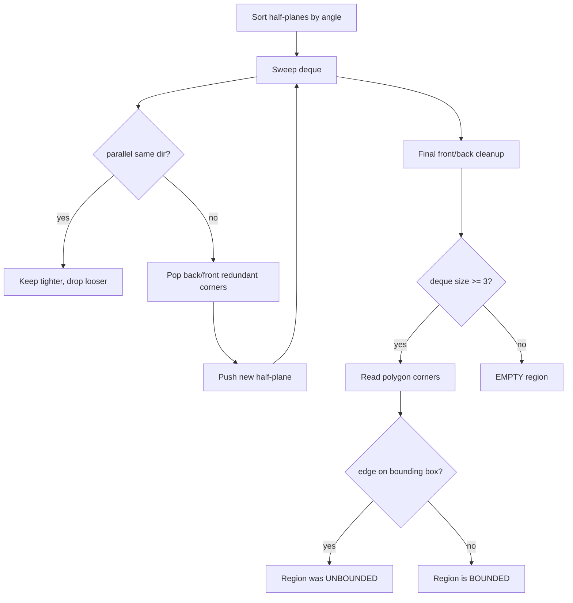

# Half-Plane Intersection — Middle Level

> **One-line summary:** The `O(m log m)` half-plane intersection algorithm sorts the half-planes by the **angle** of their boundary direction, then sweeps a **deque** of currently-relevant half-planes, popping from the **back** any whose corner the new constraint excludes and from the **front** any the new constraint excludes there. Getting the **parallel**, **unbounded**, and **empty** cases right is what separates a correct implementation from a flaky one — and the whole thing is the geometric **dual** of Andrew's monotone-chain convex hull.

---

## Table of Contents

1. [Introduction](#introduction)
2. [Deeper Concepts](#deeper-concepts)
3. [The Angle-Sort + Deque Algorithm](#the-angle-sort--deque-algorithm)
4. [Parallel, Unbounded, and Empty Cases](#parallel-unbounded-and-empty-cases)
5. [Comparison with Alternatives](#comparison-with-alternatives)
6. [Duality with Convex Hull](#duality-with-convex-hull)
7. [Linear Programming Feasibility in 2D](#linear-programming-feasibility-in-2d)
8. [Code Examples](#code-examples)
9. [Error Handling](#error-handling)
10. [Performance Analysis](#performance-analysis)
11. [Best Practices](#best-practices)
12. [Visual Animation](#visual-animation)
13. [Summary](#summary)

---

## Introduction

> Focus: "Why does it work?" and "When should I choose this?"

At the junior level you learned *what* a half-plane is and saw the shape of the deque sweep. Here we get precise about *why* the sweep is correct, *why* it runs in `O(m log m)`, and *how* to handle the three cases that break naive code: **parallel** half-planes, **unbounded** regions, and **empty** results.

The mental model to hold throughout:

> The deque holds, at every moment, the half-planes that currently contribute an edge to the boundary of the running intersection — **in angular order**. Adding a new half-plane is like rotating one more cut into place; it can shave off corners at the recent end of the chain *and*, once the cuts wrap past 180°, at the old end too.

The key invariant — the one that makes the algorithm correct — is that the half-planes in the deque are kept **sorted by angle** and every consecutive pair contributes a real corner that lies inside all the *other* half-planes seen so far. When a new half-plane would exclude such a corner, that corner's owning half-plane is now redundant, so we pop it. This is the precise dual of "pop a point that makes a non-left turn" in the convex-hull sweep.

---

## Deeper Concepts

### Invariant: angular monotonicity of the deque

The algorithm processes half-planes in increasing angle. The deque, read front-to-back, is always sorted by angle. This is what lets us reason locally: a new half-plane has the *largest* angle so far, so it can only affect the chain near its angular neighbors — the back of the deque (most recent, closest angle) and, after wrap-around, the front (smallest angle, which is "next" in cyclic order).

If you ever break angular order — for example by failing to sort, or by mixing two angle conventions — the local popping logic becomes meaningless and the result is garbage.

### Invariant: every adjacent pair gives a live corner

Between two adjacent half-planes in the deque, `dq[i]` and `dq[i+1]`, their boundary lines cross at a single point `inter(dq[i], dq[i+1])`. The invariant is that this point lies on the allowed side of **every other half-plane currently in the deque**. It is a genuine vertex of the running feasible polygon. When a new half-plane `h` arrives and `inter(dq[i], dq[i+1])` falls on `h`'s *forbidden* side, that vertex is cut off — so the half-plane that produced it must leave.

### Why pop from both ends

Consider half-planes whose directions sweep through more than 180°. The feasible region "closes up": the most recent half-plane (back of deque) and the oldest (front) become angular neighbors in the *cyclic* order around the polygon. A new cut can therefore invalidate the front corner just as it can the back corner. A stack (one end) suffices for convex hull because points are sorted by a *linear* coordinate (`x`), so the chain never wraps; half-planes are sorted by a *cyclic* coordinate (angle), so the chain does wrap, and we need a **deque**.

### The redundancy test

"Is the back corner excluded by the new half-plane?" is exactly:

```text
h.out( inter(dq[back], dq[back-1]) )    // back corner on h's forbidden side?
```

If yes, pop `dq[back]`. Repeat while the deque has ≥ 2 entries. Then do the same at the front:

```text
h.out( inter(dq[front], dq[front+1]) )  // front corner on h's forbidden side?
```

Only after both ends are clean do we push `h` on the back.

### Recurrence / cost

```text
Each half-plane is pushed once and popped at most once.
Sorting:      O(m log m)
Deque sweep:  O(m) amortized (push/pop bounded by 2m total)
Total:        T(m) = O(m log m) + O(m) = O(m log m)
```

The sweep is linear by the same amortized argument as the convex-hull sweep: a half-plane, once popped, never returns, so total pops ≤ total pushes ≤ `m`.

---

## The Angle-Sort + Deque Algorithm

Here is the algorithm in full, in pseudocode, with the special-case handling folded in.

```text
function HalfPlaneIntersection(H):           # H = list of half-planes
    add 4 bounding-box half-planes to H      # keep unbounded regions finite
    sort H by angle = atan2(d.y, d.x)         # cyclic order
    dq = empty deque
    for h in H:
        if dq nonempty and angle(h) == angle(dq.back):
            # parallel, same direction: keep the tighter (more restrictive) one
            if h is tighter than dq.back: dq.pop_back()
            else: continue
        while size(dq) >= 2 and h.out(inter(dq.back, dq.back-1)):
            dq.pop_back()
        while size(dq) >= 2 and h.out(inter(dq.front, dq.front+1)):
            dq.pop_front()
        dq.push_back(h)
    # final cleanup: the back may now exclude the front corner and vice versa
    while size(dq) >= 3 and dq.front.out(inter(dq.back, dq.back-1)):
        dq.pop_back()
    while size(dq) >= 3 and dq.back.out(inter(dq.front, dq.front+1)):
        dq.pop_front()
    if size(dq) < 3: return EMPTY
    return [ inter(dq[i], dq[i+1]) for i in cyclic order ]
```

Three things make this correct:

1. **Sorted by angle** → local reasoning is valid.
2. **Both-end popping** → wrap-around is handled.
3. **Final cleanup** → after the last push, the chain must be closed into a cycle, so the front and back may still exclude each other's corner.

---

## Parallel, Unbounded, and Empty Cases

These three cases are where naive implementations fail. Handle them explicitly.

### Parallel half-planes

Two half-planes are parallel when their direction vectors have the same angle (cross product of directions is 0). Two sub-cases:

| Sub-case | Picture | Action |
|----------|---------|--------|
| **Same direction** (point the same way) | Two parallel cuts on the same side | Keep the **tighter** one (cuts off more); the looser is redundant. |
| **Opposite direction** (point opposite ways) | Two cuts facing each other | If they overlap → keep both (a strip); if they leave a gap → region is **empty**. |

The angle sort puts same-direction parallels adjacent, so you can detect and collapse them in the loop. Opposite-direction parallels are 180° apart in angle and are caught naturally by the redundancy test (one will exclude the other's corner, or the deque will empty out).

### Unbounded regions

If the constraints do not box the region in, the intersection runs off to infinity — a wedge, a strip, or a half-plane. The clean trick: **add four enormous bounding-box half-planes** (`x ≥ −BIG`, `x ≤ BIG`, `y ≥ −BIG`, `y ≤ BIG`) before sorting. The algorithm then always yields a finite polygon. If a polygon edge lies on the bounding box, the true region was unbounded in that direction — you can detect this and report it.

Choose `BIG` large enough that it never clips a real region but small enough to avoid float overflow in the corner computations. For double precision, `1e9` is a typical choice.

### Empty regions

The constraints contradict each other; no point satisfies all of them. Symptoms:

- During the sweep, the deque is popped down below 2 and cannot recover.
- After the final cleanup, the deque has fewer than 3 half-planes — you cannot form a polygon.

Always check `size(dq) < 3` at the end and return an explicit "empty" sentinel. Do **not** read corners from a too-small deque; you will wrap indices and produce garbage.



---

## Comparison with Alternatives

| Attribute | Angle-sort + deque | Incremental clip (Sutherland–Hodgman) | Brute-force pairs |
|-----------|--------------------|----------------------------------------|-------------------|
| Time (typical) | **O(m log m)** | O(m²) | O(m³) |
| Time (worst) | O(m log m) | O(m²) | O(m³) |
| Space | O(m) | O(m) | O(m²) |
| Code complexity | High (both-end popping) | Low (clip one plane at a time) | Trivial |
| Handles unbounded | Yes (bounding box) | Yes (start from box polygon) | Awkward |
| Detects empty | Yes (size < 3) | Yes (empty polygon) | Yes |
| Numerical robustness | Needs care | More forgiving | Worst (all pairs) |
| Best for | Large `m`, performance | Small/medium `m`, clarity | Teaching only |

**Choose angle-sort + deque when:** `m` is large or you intersect many constraint sets — the `log` factor pays off.
**Choose incremental clip when:** `m` is small (≤ ~50), you want code you can trust quickly, or you already have a polygon to clip (clipping is reusable for clipping against any convex window).

The incremental clip is genuinely useful and worth knowing: maintain a polygon, and for each half-plane keep only the part of the polygon on the allowed side (Sutherland–Hodgman). Each clip is `O(current size)`, and the polygon has at most `m` edges, so `m` clips cost `O(m²)`.

---

## Duality with Convex Hull

Half-plane intersection and convex hull are **dual** problems. The clearest correspondence runs through **point–line duality**: map a point `(a, b)` to the line `y = a·x − b`, and a line to a point, in a way that preserves "above/below" relationships. Under this map:

| Convex hull side | Half-plane intersection side |
|------------------|------------------------------|
| Point `(a, b)` | Line `a·x + b·y = c` |
| Upper hull | Lower envelope of lines = part of the feasible boundary |
| "Point above a line" | "Line passes below a point" |
| Andrew's monotone chain: sort by `x`, pop non-left turns | Angle sweep: sort by angle, pop redundant corners |
| Stack (linear order, no wrap) | Deque (cyclic order, wraps past 180°) |

The practical upshot: the two algorithms are structurally the same sweep. Where convex hull sorts points by `x` and uses a **stack** (the chain never wraps because `x` is linear), half-plane intersection sorts lines by **angle** and uses a **deque** (the chain wraps because angle is cyclic). The orientation test in convex hull ("does adding this point make a clockwise turn?") becomes the redundancy test here ("does adding this half-plane exclude the last corner?"). If you understand one, you are most of the way to the other.

A concrete consequence: the **lower envelope of a set of lines** (the pointwise minimum) is exactly the boundary of the intersection of the "below each line" half-planes, and it corresponds to the upper convex hull of the dual points. This is why "minimize a linear objective subject to linear constraints" (2D LP) reduces to half-plane intersection — see below.

---

## Linear Programming Feasibility in 2D

A 2D linear program is:

```text
maximize   c₁·x + c₂·y
subject to aᵢ·x + bᵢ·y ≤ dᵢ   for i = 1..m
```

Each constraint is a half-plane. The **feasible region** is their intersection — a convex polygon. The optimum of a linear objective over a convex polygon is always attained at a **vertex** (or along an edge). So:

1. **Feasibility:** is the intersection non-empty? Run half-plane intersection; if it returns "empty," the LP is infeasible.
2. **Optimization:** if feasible, the optimum is one of the polygon's corners. Evaluate the objective at each corner and take the best — `O(m)` after the `O(m log m)` intersection.

There is an even slicker `O(m)` *expected*-time randomized LP (Seidel's algorithm) that adds constraints one at a time in random order, but the half-plane-intersection route is the most direct way to *see* the feasible region. We cover Seidel's method in `senior.md`.

```text
LP feasibility check (sketch):
    region = HalfPlaneIntersection(constraints)
    if region is EMPTY:  report "infeasible"
    else:                report "feasible", optionally optimize over corners
```

Worked intuition: the constraints `x ≥ 0`, `y ≥ 0`, `x + y ≤ 4` carve a triangle with corners `(0,0)`, `(4,0)`, `(0,4)`. Maximizing `x + 2y` evaluates to `0, 4, 8` at those corners → optimum `8` at `(0,4)`. The intersection found the corners; the objective picked the winner.

---

## Code Examples

### Example: Full angular-sweep solver with parallel/empty handling + LP optimize

#### Go

```go
package main

import (
	"fmt"
	"math"
	"sort"
)

type Vec struct{ X, Y float64 }

func (a Vec) Sub(b Vec) Vec     { return Vec{a.X - b.X, a.Y - b.Y} }
func (a Vec) Add(b Vec) Vec     { return Vec{a.X + b.X, a.Y + b.Y} }
func (a Vec) Mul(t float64) Vec { return Vec{a.X * t, a.Y * t} }
func cross(a, b Vec) float64    { return a.X*b.Y - a.Y*b.X }

type HP struct{ P, D Vec }

func (h HP) angle() float64 { return math.Atan2(h.D.Y, h.D.X) }
func (h HP) out(q Vec) bool { return cross(h.D, q.Sub(h.P)) < -1e-9 }

func inter(a, b HP) Vec {
	t := cross(b.P.Sub(a.P), b.D) / cross(a.D, b.D)
	return a.P.Add(a.D.Mul(t))
}

func HPI(planes []HP) []Vec {
	const BIG = 1e9
	hp := append([]HP{}, planes...)
	hp = append(hp,
		HP{Vec{-BIG, -BIG}, Vec{1, 0}}, HP{Vec{BIG, -BIG}, Vec{0, 1}},
		HP{Vec{BIG, BIG}, Vec{-1, 0}}, HP{Vec{-BIG, BIG}, Vec{0, -1}})

	sort.Slice(hp, func(i, j int) bool {
		if math.Abs(hp[i].angle()-hp[j].angle()) < 1e-9 {
			return cross(hp[i].D, hp[j].P.Sub(hp[i].P)) < 0
		}
		return hp[i].angle() < hp[j].angle()
	})

	dq := []HP{}
	for _, h := range hp {
		if len(dq) > 0 && math.Abs(dq[len(dq)-1].angle()-h.angle()) < 1e-9 {
			continue // parallel same-dir: sort already put tighter first
		}
		for len(dq) >= 2 && h.out(inter(dq[len(dq)-1], dq[len(dq)-2])) {
			dq = dq[:len(dq)-1]
		}
		for len(dq) >= 2 && h.out(inter(dq[0], dq[1])) {
			dq = dq[1:]
		}
		dq = append(dq, h)
	}
	for len(dq) >= 3 && dq[0].out(inter(dq[len(dq)-1], dq[len(dq)-2])) {
		dq = dq[:len(dq)-1]
	}
	for len(dq) >= 3 && dq[len(dq)-1].out(inter(dq[0], dq[1])) {
		dq = dq[1:]
	}
	if len(dq) < 3 {
		return nil
	}
	poly := make([]Vec, len(dq))
	for i := range dq {
		poly[i] = inter(dq[i], dq[(i+1)%len(dq)])
	}
	return poly
}

// Optimize maximizes c·p over the region corners; returns best value & point.
func Optimize(poly []Vec, c Vec) (float64, Vec) {
	best := math.Inf(-1)
	var arg Vec
	for _, p := range poly {
		if v := c.X*p.X + c.Y*p.Y; v > best {
			best, arg = v, p
		}
	}
	return best, arg
}

func main() {
	// x>=0, y>=0, x+y<=4  -> triangle (0,0),(4,0),(0,4)
	planes := []HP{
		{Vec{0, 0}, Vec{0, 1}},  // x >= 0
		{Vec{0, 0}, Vec{-1, 0}}, // y >= 0  (allowed left of (-1,0) is y>=0)
		{Vec{4, 0}, Vec{-1, 1}}, // x + y <= 4
	}
	poly := HPI(planes)
	if poly == nil {
		fmt.Println("infeasible")
		return
	}
	val, at := Optimize(poly, Vec{1, 2})
	fmt.Printf("corners=%d  max(x+2y)=%.1f at (%.1f,%.1f)\n", len(poly), val, at.X, at.Y)
}
```

#### Java

```java
import java.util.*;

public class HPI {
    static double cross(double ax, double ay, double bx, double by) { return ax*by - ay*bx; }

    static class HP {
        double px, py, dx, dy;
        HP(double px, double py, double dx, double dy){ this.px=px; this.py=py; this.dx=dx; this.dy=dy; }
        double angle(){ return Math.atan2(dy, dx); }
        boolean out(double qx, double qy){ return cross(dx, dy, qx-px, qy-py) < -1e-9; }
    }
    static double[] inter(HP a, HP b){
        double t = cross(b.px-a.px, b.py-a.py, b.dx, b.dy) / cross(a.dx, a.dy, b.dx, b.dy);
        return new double[]{ a.px + a.dx*t, a.py + a.dy*t };
    }

    static List<double[]> hpi(List<HP> planes){
        final double BIG = 1e9;
        List<HP> hp = new ArrayList<>(planes);
        hp.add(new HP(-BIG,-BIG,1,0)); hp.add(new HP(BIG,-BIG,0,1));
        hp.add(new HP(BIG,BIG,-1,0));  hp.add(new HP(-BIG,BIG,0,-1));
        hp.sort((a,b)->{
            if (Math.abs(a.angle()-b.angle())<1e-9)
                return cross(a.dx,a.dy,b.px-a.px,b.py-a.py)<0?-1:1;
            return Double.compare(a.angle(), b.angle());
        });
        List<HP> dq = new ArrayList<>();
        for (HP h: hp){
            if (!dq.isEmpty() && Math.abs(dq.get(dq.size()-1).angle()-h.angle())<1e-9) continue;
            while (dq.size()>=2){ double[] p=inter(dq.get(dq.size()-1), dq.get(dq.size()-2));
                if (h.out(p[0],p[1])) dq.remove(dq.size()-1); else break; }
            while (dq.size()>=2){ double[] p=inter(dq.get(0), dq.get(1));
                if (h.out(p[0],p[1])) dq.remove(0); else break; }
            dq.add(h);
        }
        while (dq.size()>=3){ double[] p=inter(dq.get(dq.size()-1), dq.get(dq.size()-2));
            if (dq.get(0).out(p[0],p[1])) dq.remove(dq.size()-1); else break; }
        while (dq.size()>=3){ double[] p=inter(dq.get(0), dq.get(1));
            if (dq.get(dq.size()-1).out(p[0],p[1])) dq.remove(0); else break; }
        if (dq.size()<3) return null;
        List<double[]> poly = new ArrayList<>();
        for (int i=0;i<dq.size();i++) poly.add(inter(dq.get(i), dq.get((i+1)%dq.size())));
        return poly;
    }

    public static void main(String[] args){
        List<HP> planes = new ArrayList<>();
        planes.add(new HP(0,0,0,1));
        planes.add(new HP(0,0,-1,0));
        planes.add(new HP(4,0,-1,1));
        List<double[]> poly = hpi(planes);
        if (poly==null){ System.out.println("infeasible"); return; }
        double best=-1e18; double[] arg=null;
        for (double[] p: poly){ double v=p[0]+2*p[1]; if (v>best){best=v; arg=p;} }
        System.out.printf("corners=%d  max=%.1f at (%.1f,%.1f)%n", poly.size(), best, arg[0], arg[1]);
    }
}
```

#### Python

```python
import math
from functools import cmp_to_key


def cross(ax, ay, bx, by):
    return ax * by - ay * bx


class HP:
    def __init__(self, px, py, dx, dy):
        self.px, self.py, self.dx, self.dy = px, py, dx, dy

    def angle(self):
        return math.atan2(self.dy, self.dx)

    def out(self, q):
        return cross(self.dx, self.dy, q[0] - self.px, q[1] - self.py) < -1e-9


def inter(a, b):
    t = cross(b.px - a.px, b.py - a.py, b.dx, b.dy) / cross(a.dx, a.dy, b.dx, b.dy)
    return (a.px + a.dx * t, a.py + a.dy * t)


def hpi(planes):
    BIG = 1e9
    hp = list(planes) + [HP(-BIG, -BIG, 1, 0), HP(BIG, -BIG, 0, 1),
                         HP(BIG, BIG, -1, 0), HP(-BIG, BIG, 0, -1)]

    def cmp(a, b):
        if abs(a.angle() - b.angle()) < 1e-9:
            return -1 if cross(a.dx, a.dy, b.px - a.px, b.py - a.py) < 0 else 1
        return -1 if a.angle() < b.angle() else 1

    hp.sort(key=cmp_to_key(cmp))

    dq = []
    for h in hp:
        if dq and abs(dq[-1].angle() - h.angle()) < 1e-9:
            continue
        while len(dq) >= 2 and h.out(inter(dq[-1], dq[-2])):
            dq.pop()
        while len(dq) >= 2 and h.out(inter(dq[0], dq[1])):
            dq.pop(0)
        dq.append(h)
    while len(dq) >= 3 and dq[0].out(inter(dq[-1], dq[-2])):
        dq.pop()
    while len(dq) >= 3 and dq[-1].out(inter(dq[0], dq[1])):
        dq.pop(0)
    if len(dq) < 3:
        return None
    return [inter(dq[i], dq[(i + 1) % len(dq)]) for i in range(len(dq))]


if __name__ == "__main__":
    planes = [HP(0, 0, 0, 1), HP(0, 0, -1, 0), HP(4, 0, -1, 1)]
    poly = hpi(planes)
    if poly is None:
        print("infeasible")
    else:
        best, arg = max((p[0] + 2 * p[1], p) for p in poly)
        print(f"corners={len(poly)}  max={best:.1f} at ({arg[0]:.1f},{arg[1]:.1f})")
```

**What it does:** intersects half-planes and maximizes a linear objective over the resulting region's corners — a complete 2D LP solver.
**Run:** `go run main.go` | `javac HPI.java && java HPI` | `python hpi.py`

---

## Error Handling

| Scenario | What goes wrong | Correct approach |
|----------|-----------------|------------------|
| New plane parallel to deque back | `inter` divides by zero | Detect equal angle first; collapse to the tighter plane. |
| Region empty but code reads corners | Index wrap → garbage polygon | Guard `len(dq) < 3` → return empty. |
| Unbounded region | Corners shoot to ±∞ or NaN | Add the bounding box before sorting. |
| Inconsistent epsilon | A corner judged inside by one test, outside by another | Single shared `EPS`; use it everywhere. |
| Mixed orientation | Some half-planes "allowed = right" | Normalize all to "allowed = left" at construction. |
| Near-degenerate sliver | Corner jitters across the boundary | Snap with epsilon; prefer integer/rational arithmetic for exactness. |

---

## Performance Analysis

The dominant cost is the sort; the sweep is linear. Benchmark how the two scale.

#### Go

```go
import (
	"fmt"
	"math/rand"
	"time"
)

func benchmark() {
	for _, n := range []int{100, 1000, 10000, 100000} {
		planes := make([]HP, n)
		for i := range planes {
			a := rand.Float64()*2*math.Pi
			planes[i] = HP{Vec{math.Cos(a) * 100, math.Sin(a) * 100}, Vec{-math.Sin(a), math.Cos(a)}}
		}
		start := time.Now()
		HPI(planes)
		fmt.Printf("m=%7d: %.3f ms\n", n, float64(time.Since(start).Microseconds())/1000)
	}
}
```

#### Java

```java
static void benchmark() {
    for (int n : new int[]{100, 1000, 10000, 100000}) {
        List<HP> planes = new ArrayList<>();
        for (int i = 0; i < n; i++) {
            double a = Math.random() * 2 * Math.PI;
            planes.add(new HP(Math.cos(a)*100, Math.sin(a)*100, -Math.sin(a), Math.cos(a)));
        }
        long s = System.nanoTime();
        hpi(planes);
        System.out.printf("m=%7d: %.3f ms%n", n, (System.nanoTime()-s)/1e6);
    }
}
```

#### Python

```python
import random, time

def benchmark():
    for n in [100, 1000, 10000, 100000]:
        planes = []
        for _ in range(n):
            a = random.uniform(0, 2 * math.pi)
            planes.append(HP(math.cos(a)*100, math.sin(a)*100, -math.sin(a), math.cos(a)))
        s = time.perf_counter()
        hpi(planes)
        print(f"m={n:>7}: {(time.perf_counter()-s)*1000:.3f} ms")
```

You should see roughly `m log m` growth: a 10× increase in `m` costs a bit more than 10× in time. (Note: Python's `pop(0)` is `O(n)`; for large `m` switch the deque to `collections.deque`.)

---

## Best Practices

- Normalize every half-plane to one orientation convention ("allowed = left") at construction.
- Add the bounding box by default; strip box edges from the output if you need the "true" unbounded shape.
- Detect parallels by equal angle *before* calling `inter`, never after a divide-by-zero.
- Keep one epsilon constant and thread it through the comparator, the side test, and parallel detection.
- Validate the fast solver against the `O(m²)` clip on random inputs in tests.
- Return an explicit empty sentinel; never let callers infer emptiness from a malformed polygon.
- For exact answers (contest/critical code), use integer or rational arithmetic instead of doubles.

---

## Visual Animation

> See [`animation.html`](./animation.html) for interactive visualization.
>
> Middle-level animation includes:
> - Half-planes added in angular order with shaded allowed sides
> - The feasible region shrinking as each constraint is applied
> - The deque contents (sorted by angle) shown live, with pops highlighted
> - Empty and unbounded outcomes called out explicitly
> - Step counter and a running operation log

---

## Summary

At the middle level, half-plane intersection is understood through two invariants: the deque is **sorted by angle**, and every adjacent pair contributes a **live corner** that survives all constraints so far. Adding a half-plane pops redundant corners from **both** ends — both, because angle is cyclic and the chain wraps past 180°, unlike the convex-hull stack. The three cases that break naive code — **parallel** (keep tighter / detect empty), **unbounded** (bounding box), and **empty** (deque < 3) — must each be handled explicitly. The whole method is the **dual** of Andrew's monotone-chain convex hull, and it is the geometric engine of **2D linear programming**: the feasible region is the intersection, and a linear objective is optimized at one of its corners.

---

## Further Reading

- de Berg et al. — *Computational Geometry: Algorithms and Applications*, Chapter 4 — 2D LP and half-plane intersection.
- cp-algorithms.com — "Half-plane intersection" with the deque implementation.
- Sedgewick & Wayne — *Algorithms* — convex hull (the dual sweep).
- Seidel, R. (1991) — "Small-dimensional linear programming and convex hulls made easy" — the randomized `O(m)` LP (covered in `senior.md`).
- Sibling topics: *01-convex-hull* (dual), *02-line-intersection* (corners), *05-sweep-line* (related sweep technique).

---

**Next step:** [senior.md](./senior.md) — LP and constraint systems at scale, polygon kernel / visibility, robustness, and the bounding-box treatment of unbounded regions.
