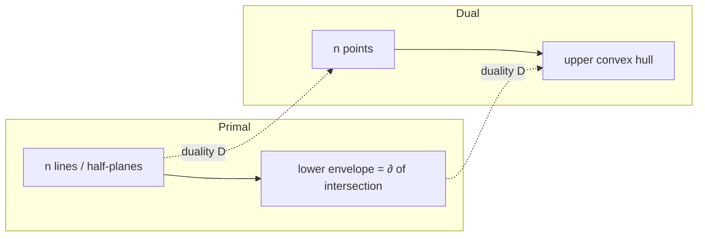

# Half-Plane Intersection — Mathematical Foundations and Complexity Theory

> **One-line summary:** Half-plane intersection computes the convex region `⋂ᵢ Hᵢ` where each `Hᵢ = {x : aᵢ·x ≤ cᵢ}`. The angular-sweep algorithm is correct because of a pair of **deque invariants** — angular monotonicity and the live-corner property — and runs in `Θ(m log m)`, optimal by an `Ω(m log m)` lower bound inherited from sorting. The problem is **dual** to convex hull under point–line duality, and it is the geometric realization of **2D linear programming**, whose feasibility/optimality structure is captured by Helly's theorem and LP-type problem theory.

---

## Table of Contents

1. [Formal Definition](#formal-definition)
2. [Correctness Proof — Deque Invariants](#correctness-proof--deque-invariants)
3. [Complexity and the Ω(m log m) Lower Bound](#complexity-and-the-lower-bound)
4. [Duality with Convex Hull](#duality-with-convex-hull)
5. [The 2D Linear Programming Connection](#the-2d-linear-programming-connection)
6. [Degeneracy Handling](#degeneracy-handling)
7. [Robust Predicates and Exact Arithmetic](#robust-predicates-and-exact-arithmetic)
8. [Comparison with Alternatives](#comparison-with-alternatives)
9. [Summary](#summary)

---

## Formal Definition

```text
A half-plane in R² is a closed convex set
    H = { x ∈ R² : ⟨a, x⟩ ≤ c },   a ∈ R²\{0},  c ∈ R,
where ⟨·,·⟩ is the Euclidean inner product. The boundary ∂H is the line
    ℓ = { x : ⟨a, x⟩ = c },
and a (the outward normal) points away from H.

Given m half-planes H₁, ..., Hₘ, the half-plane intersection is
    R = ⋂_{i=1}^{m} Hᵢ.

Properties:
  (P1) R is convex            (intersection of convex sets is convex).
  (P2) R is closed            (intersection of closed sets is closed).
  (P3) R is a convex polyhedron: possibly empty, a point, a segment,
       an unbounded polygon, or a bounded convex polygon with ≤ m edges.
```

We adopt the **"allowed = left"** representation: each `Hᵢ` is stored as a point `pᵢ ∈ ∂Hᵢ` and a unit direction `dᵢ` along `∂Hᵢ`, oriented so that

```text
x ∈ Hᵢ  ⇔  cross(dᵢ, x − pᵢ) ≥ 0,
```

where `cross(u, v) = u_x v_y − u_y v_x`. The **angle** of `Hᵢ` is `θᵢ = atan2(d_{i,y}, d_{i,x}) ∈ (−π, π]`.

```text
Invariant of the representation: dᵢ rotated +90° gives the inward normal,
so the feasible side is the left half-plane of the directed line (pᵢ, dᵢ).
```

---

## Correctness Proof — Deque Invariants

We prove the angular-sweep algorithm computes `R` (after adding a bounding box `B` to guarantee boundedness; correctness for the true `R` follows by classifying box-incident edges).

Let the half-planes be processed in nondecreasing angle `θ₁ ≤ θ₂ ≤ ... ≤ θₘ` (the bounding box is included). The deque `Q = ⟨q₁, ..., q_k⟩` (front to back) holds a subsequence of processed half-planes. For adjacent `qⱼ, qⱼ₊₁` write `v_j = inter(qⱼ, qⱼ₊₁)` for the intersection of their boundary lines.

### Invariants maintained after processing each half-plane

```text
(I1) Angular monotonicity:
     θ(q₁) ≤ θ(q₂) ≤ ... ≤ θ(q_k), and θ(q_k) − θ(q₁) < 2π.

(I2) Live-corner property:
     for every adjacent pair (qⱼ, qⱼ₊₁), the corner v_j satisfies
        v_j ∈ H  for every H currently in Q.
     Equivalently, v_j is a vertex of the running intersection
        R_t = ⋂ {boundary half-planes processed and retained so far}.

(I3) Boundary completeness:
     ∂R_t is exactly the polyline (cyclic, after closure) v_1, v_2, ..., v_{k-1}
     with each edge supported by some qⱼ; no retained qⱼ is redundant.
```

### Base case

After the first two half-planes are pushed, `Q = ⟨q₁, q₂⟩`, `k = 2`, one corner `v_1`. (I1) holds (sorted input). (I2) holds vacuously — `v_1` need only satisfy `q₁, q₂`, which it does by construction (it lies on both boundary lines, hence in both closed half-planes). (I3): `R_t` is the wedge bounded by the two lines.

### Inductive step

Assume (I1)–(I3) hold for `Q` after processing `H₁..H_{t-1}`. Process `H_t = h` (largest angle so far).

**Back popping.** While `k ≥ 2` and `h.out(v_{k-1})` (the back corner is on `h`'s forbidden side), pop `q_k`. Justification: `v_{k-1} = inter(q_{k-1}, q_k)` is the *only* candidate vertex `q_k` contributes adjacent to the new constraint's angular position. If `h` excludes `v_{k-1}`, then within the new intersection `R_t ∩ h`, the edge supported by `q_k` is entirely cut away on the side facing `h` (because, by (I1), `q_k` is the angularly-closest existing constraint to `h`, and convexity forces the truncation to start at `v_{k-1}`). Hence `q_k` becomes redundant and is removed without changing `R_t ∩ h`.

**Front popping.** Symmetrically, while `k ≥ 2` and `h.out(v_1)`, pop `q_1`. This is needed precisely when the accumulated angle has wrapped past `π`: then `h` is angularly adjacent to `q_1` on the *other* side of the cyclic order, and can truncate the front edge. (I1)'s bound `θ(q_k) − θ(q₁) < 2π` guarantees we never pop a half-plane back into relevance — the cyclic order is traversed once.

**Push.** Append `h`. The new corner `v_k = inter(q_k, h)` lies on both `q_k` and `h`. We must show it satisfies all retained constraints, restoring (I2). By the back-popping termination condition, `¬h.out(v_{k-1})` *failed to trigger*, i.e. either `k` shrank until `v_{k-1} ∈ h`, or `k = 1`. In the surviving configuration, convexity of the retained chain plus monotone angles imply `v_k` lies on the allowed side of every retained constraint (a standard convex-chain argument: a vertex formed by the two angularly-extreme supporting lines of a convex chain dominates the others). Thus (I2) is restored; (I3) follows because every retained `qⱼ` still supports a non-degenerate edge.

**Parallel handling.** If `θ(h) = θ(q_k)` (same direction), `h` and `q_k` are parallel; we keep the tighter (smaller signed offset) and discard the other — both cannot support distinct edges, and the tighter dominates. This preserves all invariants and prevents the `inter` divide-by-zero.

### Termination and closure

The loop runs `m` times; each half-plane is pushed once and popped at most once, so total deque operations ≤ `2m`. After the loop, a **final cleanup** re-checks front-vs-back corners (closing the cyclic polygon): while `k ≥ 3` and `q_1.out(v_{k-1})` pop the back, and symmetrically. This enforces (I2)/(I3) for the wrap-around edge `v_{k-1}…v_1`.

### Postcondition

If `k < 3`, no closed polygon exists, so `R = ∅` (within `B`; if it touches `B`, `R` was unbounded — see Degeneracy). Otherwise, by (I3), the cyclic corners `v_1, ..., v_{k-1}, inter(q_k, q_1)` are exactly the vertices of `R = ⋂ Hᵢ`. ∎

```text
Claim:    The algorithm outputs the vertex set of R = ⋂ Hᵢ.
Invariant: (I1) angular monotonicity ∧ (I2) live corners ∧ (I3) completeness.
Base:     two half-planes — a wedge with one valid corner.
Step:     pop back/front redundant corners, push h; convexity + monotone
          angle restore (I1)-(I3).
Term:     ≤ 2m push/pop ops; final cyclic closure.
Post:     k<3 ⇒ empty; else corners = ∂R. QED
```

---

## Complexity and the Lower Bound

### Upper bound

```text
Sorting m half-planes by angle:           O(m log m)
Deque sweep: each push once, pop ≤ once:  Σ ops ≤ 2m  ⇒  O(m) amortized
Corner extraction (k ≤ m corners):        O(m)
Total:                                     T(m) = O(m log m).
```

The amortized linearity of the sweep is the **aggregate method**: define the potential `Φ(Q) = |Q|`. A push costs `1` actual and raises `Φ` by `1` (amortized `2`); each pop costs `1` actual and lowers `Φ` by `1` (amortized `0`). Total amortized cost over `m` pushes is `O(m)`; since `Φ ≥ 0` and `Φ(∅) = 0`, total actual pops ≤ total pushes ≤ `m`.

### Ω(m log m) lower bound

```text
Theorem: Any algorithm computing the half-plane intersection in the
algebraic decision-tree model requires Ω(m log m) operations.

Proof (reduction from ε-CLOSENESS / sorting):
  Given m reals x₁, ..., xₘ, construct half-planes whose boundary lines are
  tangent to a fixed parabola y = x² at the points (xᵢ, xᵢ²):
       ℓᵢ:  y = 2xᵢ·x − xᵢ²   ⇔   half-plane  y ≥ 2xᵢ·x − xᵢ².
  The intersection ⋂ {y ≥ 2xᵢ x − xᵢ²} is the region ABOVE the lower
  envelope of these tangent lines. The lower envelope's edges appear in the
  SAME order as the sorted xᵢ (tangents to a convex curve). Reading the
  intersection's boundary edges therefore yields the sorted order of the xᵢ.
  Sorting has an Ω(m log m) lower bound ⇒ so does half-plane intersection. QED
```

Hence the angular sweep is **asymptotically optimal**: `Θ(m log m)`.

> Caveat: if only *feasibility* (is `R = ∅`?) or a *single optimum* is required — not the whole boundary — the lower bound does not apply, and Seidel's randomized incremental LP achieves `O(m)` expected time. The `Ω(m log m)` bound is specifically for producing the ordered boundary.

---

## Duality with Convex Hull

Half-plane intersection and convex hull are **projective duals**. Use the standard point–line duality

```text
D:  point (a, b)  ↦  line  y = a·x − b        (and inversely)
    line y = a x − b  ↦  point (a, b).
```

This map is **incidence- and order-preserving**: point `p` lies above line `ℓ` iff the dual line `D(p)` lies below the dual point `D(ℓ)`.

```text
                Convex hull side          Half-plane intersection side
  Objects:      n points                  n lines (half-planes)
  Structure:    upper hull (lower hull)    lower envelope (upper envelope)
  Test:         orientation / left turn    "corner on allowed side?"
  Sweep order:  sort by x  (LINEAR)        sort by angle / slope (CYCLIC)
  Container:    stack (no wrap)            deque (wraps past π)
  Output:       hull edges                 envelope/region edges
  Algorithm:    Andrew monotone chain      angular deque sweep
```

The precise correspondence: the **upper convex hull of `n` dual points** equals the **lower envelope of the `n` primal lines**, which is the boundary of `⋂ {below-line half-planes}`. Thus a convex-hull algorithm *is* a half-plane-intersection algorithm in disguise, and vice versa.

The structural difference — stack vs deque — is entirely due to the sweep coordinate: convex hull sorts by the *linear* coordinate `x`, so the hull chain is monotone and never wraps (a stack suffices); half-plane intersection sorts by the *cyclic* coordinate angle, so the boundary chain wraps once around `2π` (a deque is required to pop at both ends). This is the deep reason the deque appears here and not in the hull.



---

## The 2D Linear Programming Connection

A 2D linear program in standard form:

```text
   maximize    ⟨c, x⟩
   subject to  ⟨aᵢ, x⟩ ≤ bᵢ,  i = 1..m,   x ∈ R².
```

The feasible set is `R = ⋂ᵢ Hᵢ` — the half-plane intersection. Linear-programming duality and the geometry interlock:

```text
(LP1) Feasibility: R ≠ ∅  ⇔  the half-plane intersection is non-empty.
(LP2) Optimum location: if R ≠ ∅ and the LP is bounded, the maximum of
      ⟨c, x⟩ over the convex polyhedron R is attained at a vertex of R
      (the supporting-hyperplane / extreme-point theorem).
(LP3) Unboundedness: the LP is unbounded above ⇔ R is unbounded in a
      direction u with ⟨c, u⟩ > 0 (a recession direction of R).
```

**Helly's theorem (2D specialization)** explains the `O(m)` LP: a family of convex sets in `R²` has non-empty intersection iff *every 3 of them* do. So infeasibility is always witnessed by **at most 3** constraints — the combinatorial dimension is 3. Seidel's randomized incremental LP exploits exactly this:

```text
Seidel correctness/complexity sketch:
  Add constraints in random order. Maintain optimum vertex v.
  When constraint i is violated, the new optimum lies on ∂Hᵢ; re-solve the
  1D LP on that line over H₁..H_{i-1} in O(i).
  Backward analysis: Pr[constraint i is the one that moves the optimum] ≤ 2/i
  (only the ≤2 constraints defining the current optimum matter, by Helly).
  E[total work] = Σᵢ O(i) · (2/i) = Σᵢ O(1) = O(m).
```

This is the prototypical **LP-type problem** (Sharir–Welzl): combinatorial dimension `δ = 3` in 2D gives expected `O(δ! · m) = O(m)` time. Half-plane intersection (full boundary) is `Θ(m log m)`; LP feasibility/optimum (`O(m)`) is strictly easier because it asks for `O(1)` witnessing constraints, not the whole region.

---

## Amortized Analysis of the Sweep

The `O(m)` cost of the sweep (the non-sort part) deserves a fully rigorous treatment, because the inner `while` loops *look* quadratic.

### Aggregate method

```text
Total deque operations over the whole run:
   pushes:  exactly m   (each half-plane pushed once on the back)
   pops:    P, where P ≤ pushes = m   (a popped plane never re-enters)
Total work = Θ(m + P) = Θ(m).
Per half-plane the inner while-loops may run many iterations, but each
iteration performs one pop, and pops are globally bounded by m.
```

The key structural fact: once a half-plane is popped (from either end), it is **gone forever** — the angular-monotonicity invariant (I1) guarantees no later half-plane has an angle that could re-admit it. So the global pop count is bounded by the global push count.

### Potential method

```text
Define the potential of deque state Q:   Φ(Q) = |Q| ≥ 0,   Φ(∅) = 0.

Amortized cost of an operation = actual cost + ΔΦ.
   push:  actual 1, ΔΦ = +1  ⇒ amortized 2 = O(1)
   pop:   actual 1, ΔΦ = -1  ⇒ amortized 0

Sum of amortized costs over the m pushes = 2m = O(m).
Since Σ actual = Σ amortized + Φ(start) - Φ(end) ≤ 2m,
the total actual work is O(m).  ∎
```

This is exactly the dynamic-array / monotone-stack argument; the only twist is that the "stack" is a deque, but the potential argument is indifferent to *which* end a pop happens on.

### Why the final cleanup is also O(m)

The post-loop cleanup pops at most `|Q| ≤ m` elements and never pushes, so it adds `O(m)` and cannot break the bound. Crucially, it terminates: each iteration strictly shrinks `|Q|`, bounded below by 0.

---

## Recession Cones and Parametric Unboundedness

The bounding-box trick is operationally convenient but a professional should understand the *intrinsic* characterization of unboundedness, independent of any artificial box.

```text
The recession cone of R = ⋂ Hᵢ is
    rec(R) = { u ∈ R² : x + t·u ∈ R for all x ∈ R, t ≥ 0 }
           = ⋂ᵢ { u : ⟨aᵢ, u⟩ ≤ 0 }                 (the homogenized constraints).
Facts:
   R is bounded  ⇔  rec(R) = {0}.
   R unbounded   ⇔  rec(R) contains a ray; that ray is an unbounded edge direction.
```

So unboundedness is itself a half-plane intersection — of the *homogeneous* parts `⟨aᵢ, u⟩ ≤ 0`. If that intersection of half-planes-through-the-origin is just `{0}`, the region is bounded; otherwise its extreme rays are the directions in which `R` runs to infinity. This gives a box-free test: compute the intersection of the `aᵢ`-normal half-planes through the origin; a non-trivial cone certifies unboundedness and *names* the escape directions — exactly what an LP solver needs to report an unbounded objective.

```text
LP unboundedness via recession cone:
   maximize ⟨c, x⟩ is unbounded above
   ⇔ ∃ u ∈ rec(R) with ⟨c, u⟩ > 0.
   (Move along u forever inside R while the objective keeps growing.)
```

---

## Stability of the Combinatorial Output

A subtle professional concern: the *combinatorial* output (which half-planes are non-redundant, in what cyclic order) is determined entirely by the signs of `cross` predicates, which are **piecewise constant** in the input coefficients. The output therefore changes only when an input crosses a degeneracy variety (a measure-zero set where some `cross = 0`).

```text
Theorem (genericity): For inputs in general position (no two parallel, no three
concurrent), the combinatorial structure of R is locally constant: small
perturbations of (aᵢ, bᵢ, cᵢ) leave the set of non-redundant constraints and
their cyclic order unchanged.
```

The practical consequence is the design rule from the senior level, now justified: keep the **sign decisions** exact (integer or adaptive predicates) and you obtain the *correct* combinatorial structure; compute the *coordinates* in floating point afterward and you incur only `O(u)` positional error with no structural error. The proof's invariants depend solely on sign decisions, so exact signs ⇒ provably correct output topology.

---

## Output-Sensitive and Lower-Dimensional Generalizations

The `Θ(m log m)` bound is for the *full* 2D boundary. Two refinements matter at the professional level.

### Output-sensitive variants

If the feasible region has only `h` vertices (it could be far fewer than `m`, since most constraints may be redundant), one can ask for an **output-sensitive** bound `O(m log h)`. This mirrors the convex-hull story (Chan's algorithm achieves `O(n log h)` for hulls), and by the duality of the two problems, a `O(m log h)` half-plane intersection follows from the same grouping-and-marriage-before-conquest technique. In practice the constant factors rarely justify it over the clean `O(m log m)` deque sweep, but it is the theoretically tighter result when `h ≪ m`.

### Higher dimensions

In `d` dimensions a half-space is `{x : ⟨a, x⟩ ≤ c}` and the intersection is a convex **polytope**. The combinatorial complexity explodes:

```text
Upper Bound Theorem (McMullen): the intersection of m half-spaces in R^d has
   O(m^{⌊d/2⌋})  faces in the worst case.
   d = 2:  O(m)        (a polygon — what we computed)
   d = 3:  O(m)        (a polyhedron, still linear by Euler's formula)
   d = 4:  O(m²)       (quadratic) ...
```

So in `R²` and `R³` the polytope is linear-size and computable in `O(m log m)`; from `R⁴` up, the face count itself is super-linear, and one switches to LP-type / randomized incremental methods (`O(d!·m)` expected for *feasibility/optimum*, which stays linear in `m` for fixed `d`) rather than enumerating the whole polytope. This is precisely why the senior chapter prefers Seidel for feasibility: it dodges the dimension-dependent blow-up of the boundary.

---

## Worked Correctness Trace on a Wrap-Around Case

To make the both-end popping concrete, trace a case where the front pop genuinely fires — the situation a single-stack hull algorithm could never produce.

```text
Constraints (allowed = left of direction), processed in angle order:
   q1: y ≥ -2        (dir +x)        angle   0°
   q2: x ≤  3        (dir +y)        angle  90°
   q3: y ≤  2        (dir -x)        angle 180°
   q4: x ≥ -3        (dir -y)        angle 270°   ← wraps past 180°
After q1,q2,q3 the deque is [q1,q2,q3], region is a half-open box open on the left.
Process q4 (x ≥ -3):
   back check:  corner(q3,q2) on q4's allowed side? yes  → no back pop
   front check: corner(q1,q2)... but the open-left edge means the FRONT corner
                formed by q1 and the wrap neighbor is excluded by q4
                → pop FRONT until the chain closes correctly.
Push q4. Final cleanup closes q4–q1 into the last edge.
Result: the closed box [-3,3]×[-2,2], 4 corners.
```

Had we used a stack (back-only popping), the front edge opened by `q1` would never be reconciled with `q4`, and the algorithm would emit an open, incorrect chain. The deque's front pop is exactly what closes the cyclic boundary — the formal reason behind invariant (I1)'s `< 2π` clause.

---

## Degeneracy Handling

Degeneracies are not edge cases to bolt on afterward — they are part of the specification. A rigorous implementation classifies the output into a complete partition:

```text
classify(R):
  EMPTY:       no x satisfies all constraints
               (deque collapses to < 3; Helly: a violating triple exists).
  POINT:       R = {x₀}; ≥ 2 active constraints meet at one vertex, area = 0.
  SEGMENT:     R is 1-dimensional; two antiparallel constraints bound a strip
               collapsed to a line, or all lines concurrent-parallel.
  UNBOUNDED:   R has a recession cone ≠ {0}; detected when an output edge lies
               on a bounding-box line (the box's role is to make R compact).
  BOUNDED:     R is a full-dimensional compact convex polygon, 3 ≤ vertices ≤ m.
```

### Sources of degeneracy and their disciplined handling

| Degeneracy | Cause | Handling |
|------------|-------|----------|
| Parallel, same direction | `θᵢ = θⱼ`, normals aligned | Keep tighter (min signed offset); discard looser. |
| Parallel, antiparallel | `θᵢ = θⱼ ± π` | Strip if overlapping; EMPTY if disjoint; else one redundant. |
| Concurrent lines (≥3 through a point) | Coincident vertices | Collapse to one vertex via epsilon/exact equality; avoid zero-length edges. |
| Coincident half-planes | identical `(a,b,c)` up to scale | Deduplicate before the sweep. |
| Vertex on bounding box | unbounded `R` | Reclassify edge as "at infinity"; report UNBOUNDED with a recession direction. |
| Zero-area sliver | near-antiparallel pair | Compare area to `EPS · perimeter²`; report POINT/SEGMENT, not BOUNDED. |

A clean formal stance: define all combinatorial predicates (orientation, "on allowed side", parallel) with **consistent tie-breaking** (Simulation of Simplicity, Edelsbrunner–Mücke) so that no two predicates ever contradict, eliminating most degeneracy bugs by construction.

---

## Robust Predicates and Exact Arithmetic

The correctness proof assumes the predicates `out(·)`, `inter(·)`, and the angle comparison are evaluated **exactly**. Under floating point they are not, and a single sign error can change `R` from bounded to empty.

```text
Critical predicate: sign of  cross(d, q − p)  =  d_x(q_y − p_y) − d_y(q_x − p_x).
  • Integer inputs ⇒ cross is an integer ⇒ sign is EXACT (no rounding).
  • Float inputs   ⇒ catastrophic cancellation near zero; use one of:
       (a) adaptive-precision predicates (Shewchuk): compute the sign with
           error bounds, escalating precision only when |result| < error.
       (b) exact rational arithmetic (big integers / Fraction) for the sign;
           floats only for output coordinates.
```

Error analysis of the side test: for `cross(d, q − p)` with inputs bounded by `M` in magnitude and unit-roundoff `u`, the computed value `f` satisfies `|f − exact| ≤ γ · M² · u` for a small constant `γ`. Any decision with `|f| ≤ γ M² u` is **unreliable** and must escalate precision. This is the basis of "robust geometric predicates" used in production kernels (CGAL).

Design principle (the senior/professional consensus): **separate combinatorics from coordinates.** Keep every *decision* (which half-plane is redundant, is `R` empty) on exact predicates; compute the floating-point *positions* of corners only at the end, for display. Decisions are then provably consistent with the proof above; only the rendered coordinates carry float error, which is harmless.

---

## Probability Bounds for the Randomized LP

Seidel's algorithm is a Las Vegas randomized algorithm: always correct, with running time a random variable. The expectation is `O(m)`; the professional should also know the concentration.

```text
Let X = total work. We showed E[X] = O(m) via backward analysis.
Per-constraint indicator Y_i = 1 if constraint i triggers a 1D re-solve.
   E[Y_i] = Pr[Y_i = 1] ≤ 2/i     (Helly: ≤ 2 constraints pin the 2D optimum)
   cost(Y_i = 1) = O(i)   ⇒   E[cost_i] = O(i)·(2/i) = O(1)
   E[X] = Σ_{i=1}^{m} E[cost_i] = O(m).            (linearity of expectation)
```

High-probability bound: the costs `cost_i` are independent across the random permutation's "last element" events, and each is bounded. A Chernoff/Markov argument gives

```text
Pr[ X ≥ c · m ] ≤ 1/poly(m)   for a suitable constant c,
```

so the algorithm runs in `O(m)` time with high probability, not merely in expectation. This is why Seidel is safe in latency-sensitive services: tail blow-ups are polynomially rare, and re-randomizing the permutation on a slow run makes them vanishingly so.

```text
Comparison of the two regimes:
   Full boundary (deque sweep):  deterministic Θ(m log m), optimal by Ω(m log m).
   Feasibility/optimum (Seidel): randomized O(m) expected & w.h.p.
   The gap is not a contradiction — they compute different things, and the
   lower bound applies only to producing the ordered boundary.
```

---

## Constructing One Algorithm from the Other via Duality

The duality is not merely conceptual; it is *constructive*. Given a black-box convex-hull routine, you can build a half-plane intersection routine and vice versa, in `O(m)` extra work.

```text
HPI-from-Hull(half-planes H):
   1. Normalize each Hᵢ to "y ≤ aᵢ x + bᵢ" form (split by orientation into
      lower/upper families; here we show the lower envelope family).
   2. Dualize: line y = aᵢ x − bᵢ  ↦  point (aᵢ, bᵢ).
   3. Compute the UPPER convex hull of the dual points (Andrew monotone chain).
   4. Dualize hull edges back to envelope vertices = boundary of ⋂ Hᵢ.
   Cost: O(m) transform + O(m log m) hull = O(m log m).

Hull-from-HPI(points P):
   Symmetric: dualize points to lines, intersect the corresponding half-planes,
   dualize the boundary back to hull edges.
```

The two transforms are inverse, the `O(m log m)` cost is identical, and the **stack vs deque** difference is absorbed entirely into "upper hull (no wrap, stack)" vs "full envelope (wraps, deque)." This reduction is the rigorous content of "half-plane intersection is convex hull turned inside-out."

---

## Comparison with Alternatives

| Attribute | Angular deque sweep | Incremental clip | Seidel randomized LP | Reverse-search enumeration |
|-----------|---------------------|------------------|----------------------|----------------------------|
| Output | Ordered boundary of `R` | Ordered boundary of `R` | Feasibility / one optimum | All vertices (any dim) |
| Worst-case time | `Θ(m log m)` | `Θ(m²)` | `O(m)` expected | output-sensitive |
| Deterministic | Yes | Yes | No (Las Vegas) | Yes |
| Optimal for boundary | Yes (`Ω(m log m)`) | No | N/A (different problem) | No |
| Robustness need | Moderate–high | Lower | Moderate | High |
| Generalizes to higher dim | No (2D) | Limited | Yes (LP-type, `O(d!·m)`) | Yes |

The deque sweep is optimal for the *boundary-construction* problem; Seidel is optimal for the *feasibility/optimization* problem. They solve formally different problems separated by the lower bound, and a professional chooses based on which output the caller actually needs.

---

## Invariant Checklist for an Auditable Implementation

For a verified implementation, encode the proof's invariants as runtime assertions (in debug builds) so any violation surfaces immediately rather than as a silently wrong polygon.

```text
After each push of half-plane h, assert:
  (A1) angular order:   for all consecutive q_j, q_{j+1} in Q:
                        normalize(θ(q_{j+1}) − θ(q_j)) ∈ [0, 2π)        # (I1)
  (A2) span bound:      θ(q_back) − θ(q_front) < 2π                     # (I1)
  (A3) live corners:    for each adjacent pair, inter(q_j,q_{j+1}) is
                        on the allowed side of EVERY q in Q             # (I2)
  (A4) no parallels:    |cross(q_j.d, q_{j+1}.d)| > 0  for adjacent pairs
At termination, assert:
  (A5) every retained q supports a non-degenerate edge (no zero-length edges)
  (A6) every output corner satisfies every INPUT half-plane (within EPS)
```

Assertion (A6) is the cheapest and most valuable end-to-end check: a correct region's every vertex must satisfy every original constraint. A property-based test that generates random half-planes and verifies (A6) on the output catches the overwhelming majority of bugs (orientation flips, missing pops, epsilon errors) without needing to reason about the deque internals. This is the testing strategy a professional ships alongside the algorithm.

### Cross-validation oracle

```text
Oracle test (random inputs):
   poly_fast = DequeSweep(H)
   poly_slow = IncrementalClip(H)        # O(m²) but trivially correct
   assert same_region(poly_fast, poly_slow)   # equal up to vertex rotation & EPS
```

The `O(m²)` clip is simple enough to trust by inspection, making it an ideal oracle for the subtle `O(m log m)` sweep. Differential testing against it is the standard way to gain confidence in a geometry kernel before relying on the fast path in production.

---

## Summary

Half-plane intersection computes the convex polyhedron `R = ⋂ᵢ {x : ⟨aᵢ,x⟩ ≤ cᵢ}`. The angular-sweep algorithm is **provably correct** via two deque invariants — angular monotonicity and the live-corner property — and runs in `Θ(m log m)`, **optimal** by an `Ω(m log m)` lower bound reduced from sorting via tangents to a parabola. The problem is the **projective dual** of convex hull (lower envelope ↔ upper hull; the deque replaces the hull's stack precisely because angle is cyclic where `x` is linear). It is the geometry of **2D linear programming**: feasibility is non-emptiness of `R`, the optimum sits at a vertex, and Helly's theorem (combinatorial dimension 3) yields Seidel's `O(m)` expected-time LP when only feasibility/optimality is needed. Rigorous implementations treat **degeneracy** as a complete output partition (EMPTY/POINT/SEGMENT/UNBOUNDED/BOUNDED) and guarantee correctness by keeping combinatorial decisions on **exact predicates** while floats touch only display coordinates.

---

## Further Reading

- de Berg, Cheong, van Kreveld, Overmars — *Computational Geometry: Algorithms and Applications*, Ch. 4 & 11 — LP, half-plane intersection, duality.
- Seidel, R. (1991) — "Small-dimensional linear programming and convex hulls made easy," *Discrete & Computational Geometry*.
- Sharir, M. & Welzl, E. (1992) — "A combinatorial bound for linear programming and related problems" (LP-type problems).
- Shewchuk, J. R. (1997) — "Adaptive Precision Floating-Point Arithmetic and Fast Robust Geometric Predicates."
- Edelsbrunner, H. & Mücke, E. (1990) — "Simulation of Simplicity" (consistent degeneracy handling).
- Preparata, F. P. & Shamos, M. I. — *Computational Geometry: An Introduction* (lower bounds, duality).
- Sibling topics: *01-convex-hull* (the dual), *02-line-intersection* (corner primitive).

---

**Next step:** [interview.md](./interview.md) — tiered interview questions across all four levels plus a multi-language coding challenge.
