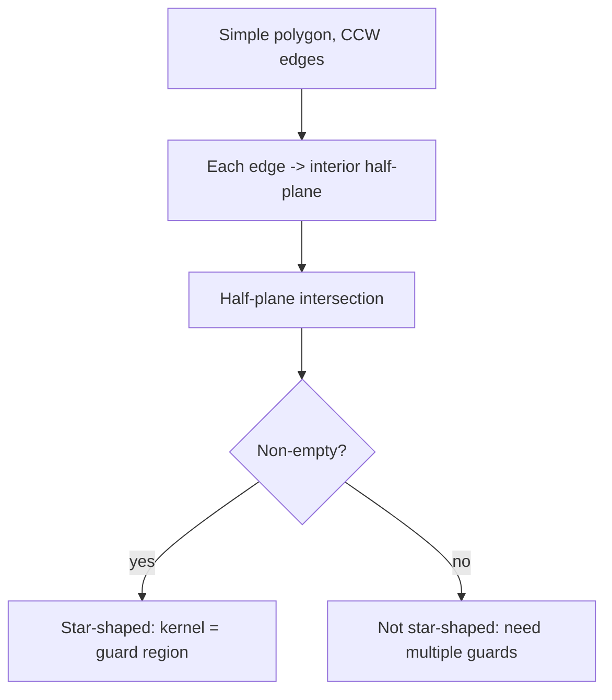
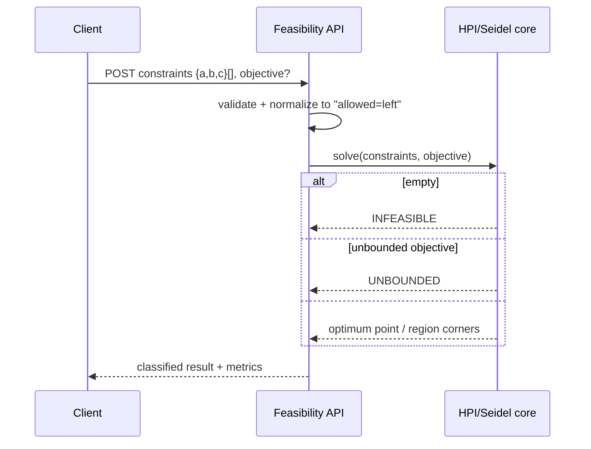

# Half-Plane Intersection — Senior Level

> **One-line summary:** At the senior level, half-plane intersection stops being "an algorithm" and becomes "the engine inside" constraint systems, 2D linear programming, polygon-kernel/visibility queries, and clipping pipelines. The senior concerns are **robustness** (floating-point vs exact arithmetic), **scaling** to many constraints and many queries, **graceful handling of unbounded/degenerate output**, and choosing between the `O(m log m)` intersection and the `O(m)` expected-time randomized LP when you only need a feasibility answer or a single optimum.

---

## Table of Contents

1. [Introduction](#introduction)
2. [Constraint Systems and 2D Linear Programming](#constraint-systems-and-2d-linear-programming)
3. [Polygon Kernel and Visibility](#polygon-kernel-and-visibility)
4. [Robustness and Numerical Engineering](#robustness-and-numerical-engineering)
5. [Bounding-Box Treatment of Unbounded Regions](#bounding-box-treatment-of-unbounded-regions)
6. [Comparison with Alternatives](#comparison-with-alternatives)
7. [Architecture Patterns](#architecture-patterns)
8. [Code Examples](#code-examples)
9. [Observability and Failure Modes](#observability-and-failure-modes)
10. [Summary](#summary)

---

## Introduction

> Focus: "How do I build a reliable system around this primitive?"

A junior asks "how do I intersect half-planes?" A senior asks: *"This service receives thousands of constraint sets per second; some are infeasible, some unbounded, some degenerate, and the inputs are floating-point sensor readings. How do I make the answer correct, fast, and observable?"*

Three forces shape every senior decision here:

1. **Robustness.** Geometry with doubles is a minefield: a corner that is "just barely" inside one constraint and "just barely" outside another flips the entire output between bounded, unbounded, and empty. The cross-product side test, the line-intersection divide, and the angle sort all accumulate error.
2. **Scale.** The intersection is `O(m log m)`. If you only need *feasibility* or *one optimum*, the randomized 2D LP runs in `O(m)` expected time — a real win at high `m` and high query volume. If you reuse the same constraints with changing objectives, you precompute the region once and query corners.
3. **Degeneracy.** Real constraint sets produce empty, single-point, segment, and unbounded regions far more often than textbook examples. The system must classify and report these, not crash or silently return a malformed polygon.

This file treats half-plane intersection as a component in larger pipelines: LP solvers, visibility engines, clipping stages, and feasibility microservices.

---

## Constraint Systems and 2D Linear Programming

Any system of linear `≤` constraints defines a convex feasible region — the half-plane intersection. The senior view distinguishes three distinct *questions* you might ask of that region, each with a different best tool:

| Question | Best tool | Time |
|----------|-----------|------|
| What is the full feasible polygon? | Half-plane intersection (deque sweep) | `O(m log m)` |
| Is the system feasible at all? | Randomized incremental LP (Seidel) | `O(m)` expected |
| Optimize a linear objective `c·x`? | Randomized incremental LP, or HPI + corner scan | `O(m)` exp / `O(m log m)` |

### Seidel's randomized incremental LP

When you only need feasibility or the optimum (not the whole polygon), Seidel's algorithm is the senior's default. Add constraints in **random order**, maintaining the current optimum vertex. When a new constraint is violated by the current optimum, the new optimum must lie *on that constraint's line* — so re-solve a 1D LP restricted to that line in `O(current index)`. By backward analysis, the expected total work is `O(m)`.

```text
Seidel(constraints H, objective c):
    shuffle H randomly
    v = optimum at infinity in direction c (or a bounding box corner)
    for i, h in enumerate(H):
        if h is violated by v:
            # optimum now lies on line(h); solve 1D LP on that line over H[0..i-1]
            v = optimize_on_line(h, c, H[0..i-1])   # O(i)
            if no feasible point on the line: report INFEASIBLE
    return v
```

The reason a senior reaches for Seidel: it is `O(m)` expected, has tiny constants, and answers exactly the feasibility/optimization question most systems actually need — without materializing a polygon that may be unbounded or degenerate.

### When to materialize the polygon instead

Materialize the full region (deque sweep) when:
- You must *display* or *clip against* the feasible region.
- The objective changes often but the constraints don't (precompute corners once).
- You need to detect and report *which* constraints are redundant or active.

### Detecting redundant vs active constraints

A senior is often asked not just *"is it feasible?"* but *"which constraints actually matter?"* — useful for explaining infeasibility to a user, simplifying a model, or sensitivity analysis.

```text
After the sweep, the deque holds exactly the NON-REDUNDANT constraints —
those contributing an edge to the boundary. Everything else is redundant.
  active   = constraints in the final deque
  redundant = original constraints absent from the final deque
  tight-at-optimum = the (≤ 2) active constraints whose lines pass through
                     the LP optimum vertex
```

This is a free by-product of materializing the region: the surviving deque *is* the irredundant constraint set. For infeasibility explanation, Helly guarantees a witnessing triple — find it by re-running on growing prefixes until the region first becomes empty, then minimize to 3.

### Incremental and online constraint streams

When constraints arrive over time (robotics safety envelopes, online feasibility), recomputing from scratch each time is wasteful. Two practical strategies:

| Strategy | Add cost | Notes |
|----------|----------|-------|
| Maintain the polygon, clip by each new half-plane | `O(current size)` | Simple; region only ever shrinks, so this is monotone and cheap. |
| Re-run Seidel feasibility per query | `O(m)` expected | Best when you only need yes/no, not the shape. |

Because intersection is **monotone** (adding a constraint can only shrink `R`, never grow it), the clip-on-add approach is correct and never needs to "undo." If you must also *remove* constraints, that monotonicity is lost and you need a more elaborate structure (e.g. a kinetic / fully-dynamic convex-intersection data structure) — usually not worth it; recompute instead.

---

## Polygon Kernel and Visibility

The **kernel** of a simple polygon is the set of points from which *every* point of the polygon is visible — equivalently, the points that can "see the whole room." A polygon with a non-empty kernel is called **star-shaped**.

The kernel is exactly a **half-plane intersection**. Walk the polygon's edges in order; each edge, extended to a line, defines a half-plane (the interior side). The kernel is the intersection of all `n` edge half-planes:

```text
Kernel(P):
    H = []
    for each directed edge (a -> b) of polygon P (CCW):
        H.append( half-plane to the LEFT of line(a, b) )   # interior side
    return HalfPlaneIntersection(H)
```

This is `O(n log n)` via the deque sweep (and `O(n)` with the specialized Lee–Preparata kernel algorithm, but the half-plane route is simpler and reuses code). Applications:

- **Guard placement** — where to stand to watch an entire convex-ish room (art-gallery flavored problems).
- **Camera / sensor positioning** — a viewpoint that sees the whole region.
- **Robotics** — a configuration that maintains line-of-sight to all of a workspace.
- **Light/illumination** — where a single point light fully illuminates a polygonal room.

If the kernel is empty, the polygon is not star-shaped — no single point sees everything, and you need multiple guards (the general art-gallery problem).

A senior caveat on the kernel computation: the edge half-planes must be oriented **consistently** with the polygon's winding. For a CCW polygon, "interior on the left" gives the correct half-planes; feeding a CW polygon (or mixing windings) silently inverts every constraint and yields an empty or nonsensical kernel. Normalize the winding (compute the signed area; flip if negative) before extracting edge half-planes. This is the single most common bug in kernel code, and it is invisible until you test a CW input.



---

## Robustness and Numerical Engineering

Floating-point geometry is the senior's chief enemy. Three operations leak error:

1. **The side test** `cross(D, q − P)` — catastrophic cancellation when `q` is near the line.
2. **Line intersection** — dividing by `cross(d1, d2)` blows up as lines approach parallel.
3. **The angle sort** — `atan2` near ties can order parallel half-planes inconsistently.

### Strategies, from cheapest to most rigorous

| Strategy | Cost | When |
|----------|------|------|
| Consistent epsilon (`EPS = 1e-9`) everywhere | Free | Most applications; "good enough." |
| Scale/normalize coordinates to a known range | Cheap | Sensor data with wild magnitudes. |
| Integer / fixed-point arithmetic | Cheap if inputs are integers | Contest code, lattice problems (`cross` is exact for integers). |
| Exact rational (`big.Rat`, `Fraction`) | Slow | Correctness-critical, small `m`. |
| Adaptive-precision predicates (Shewchuk) | Moderate | Production geometry kernels (CGAL-style). |

### The integer cross product is your friend

When inputs are integers, the **side test is exact**: `cross` of integer vectors is an integer; its sign is unambiguous. The error only enters at line *intersections* (which produce rationals). A common robust design: keep the **combinatorial decisions** (which half-plane is redundant) on exact integer predicates, and compute the **coordinates** of corners in floating point only at the very end for display.

### Avoiding the parallel-divide trap

Never call the intersection routine on two half-planes whose directions are parallel. Detect parallelism by `|cross(d1, d2)| < EPS` (float) or `cross == 0` (integer) and branch: same direction → keep tighter; opposite → redundant or empty. This single guard removes the most common crash.

---

## Bounding-Box Treatment of Unbounded Regions

Unbounded feasible regions are normal, not exceptional. The robust pattern:

1. **Add four bounding-box half-planes** (`±BIG` in `x` and `y`) before the sweep.
2. Run the sweep; you always get a finite polygon.
3. **Classify the output:** if any polygon edge lies *on* a bounding-box line, the true region extended to infinity in that direction.

```text
classify(poly, BIG):
    on_box = any edge with both endpoints at |coord| ~ BIG
    if region empty:            return EMPTY
    if on_box:                  return UNBOUNDED (with the finite "clipped" witness)
    if area(poly) < EPS:        return DEGENERATE (point or segment)
    return BOUNDED
```

Choosing `BIG`:
- Too small → it clips real regions, giving wrong answers.
- Too large → corner coordinates overflow or lose precision when intersected with steep lines.
- For doubles, `1e9` balances both for coordinates up to `~1e6`. Scale `BIG` to your input range.

For LP optimization, the bounding box also doubles as a way to detect an **unbounded objective**: if the optimum lands on a box edge, the LP is unbounded (the objective can grow without limit) — report that rather than the artificial box corner.

---

## Comparison with Alternatives

| Attribute | HPI deque sweep | Seidel randomized LP | Incremental clip | Simplex (general LP) |
|-----------|-----------------|----------------------|------------------|----------------------|
| Output | Full polygon | One optimum / feasibility | Full polygon | One optimum |
| Time | `O(m log m)` | `O(m)` expected | `O(m²)` | Exponential worst, fast in practice |
| Dimensions | 2D | Low-D (`O(d! m)` const) | 2D | Any |
| Unbounded handling | Bounding box | Natural (detects directly) | Box polygon | Detects |
| Reuse for many objectives | Yes (corners cached) | Re-run per objective | Yes | Re-run / warm start |
| Robustness effort | Moderate | Moderate | Lower | High |
| Best for | Visualizing/clipping the region | Feasibility & single optimum at scale | Small `m`, clarity | High-D LP |

**Senior rule of thumb:** need the *shape* → deque sweep; need a *yes/no* or a *single best point* at scale → Seidel; high-dimensional or many variables → a real LP solver (simplex/interior-point), not geometry.

---

## Architecture Patterns

### Feasibility microservice



Design notes a senior bakes in:
- **Validation at the edge:** reject NaN/Inf, normalize orientation, deduplicate, scale coordinates.
- **Classification is part of the contract:** the response always says BOUNDED / UNBOUNDED / EMPTY / DEGENERATE.
- **Pick the solver by query type:** feasibility/optimum → Seidel; region → deque sweep.
- **Cache** the materialized region keyed on the constraint set when objectives vary.
- **Timeouts and size limits:** cap `m` per request; geometry on adversarial input can be slow if robustness falls back to exact arithmetic.

### Clipping pipeline

Half-plane intersection underlies convex clipping (clip a polygon to a convex window). In rendering and GIS, a stream of polygons is clipped against a fixed convex region; precompute the region's half-planes once and apply Sutherland–Hodgman per polygon — `O(k)` per polygon of size `k`.

---

## Code Examples

### Robust solver core with classification + integer side test

#### Go

```go
package main

import (
	"fmt"
	"math"
	"sort"
)

type Vec struct{ X, Y float64 }

func sub(a, b Vec) Vec       { return Vec{a.X - b.X, a.Y - b.Y} }
func cross(a, b Vec) float64 { return a.X*b.Y - a.Y*b.X }

type HP struct{ P, D Vec }

func (h HP) angle() float64 { return math.Atan2(h.D.Y, h.D.X) }
func (h HP) out(q Vec) bool { return cross(h.D, sub(q, h.P)) < -1e-9 }

func inter(a, b HP) (Vec, bool) {
	den := cross(a.D, b.D)
	if math.Abs(den) < 1e-12 {
		return Vec{}, false // parallel — no unique intersection
	}
	t := cross(sub(b.P, a.P), b.D) / den
	return Vec{a.P.X + a.D.X*t, a.P.Y + a.D.Y*t}, true
}

type Result struct {
	Kind  string // "BOUNDED" | "UNBOUNDED" | "EMPTY" | "DEGENERATE"
	Poly  []Vec
}

func Solve(planes []HP) Result {
	const BIG = 1e9
	hp := append([]HP{}, planes...)
	hp = append(hp,
		HP{Vec{-BIG, -BIG}, Vec{1, 0}}, HP{Vec{BIG, -BIG}, Vec{0, 1}},
		HP{Vec{BIG, BIG}, Vec{-1, 0}}, HP{Vec{-BIG, BIG}, Vec{0, -1}})
	sort.Slice(hp, func(i, j int) bool {
		if math.Abs(hp[i].angle()-hp[j].angle()) < 1e-9 {
			return cross(hp[i].D, sub(hp[j].P, hp[i].P)) < 0
		}
		return hp[i].angle() < hp[j].angle()
	})

	dq := []HP{}
	push := func(h HP) bool {
		if len(dq) > 0 && math.Abs(dq[len(dq)-1].angle()-h.angle()) < 1e-9 {
			return true
		}
		for len(dq) >= 2 {
			p, ok := inter(dq[len(dq)-1], dq[len(dq)-2])
			if ok && h.out(p) {
				dq = dq[:len(dq)-1]
			} else {
				break
			}
		}
		for len(dq) >= 2 {
			p, ok := inter(dq[0], dq[1])
			if ok && h.out(p) {
				dq = dq[1:]
			} else {
				break
			}
		}
		dq = append(dq, h)
		return true
	}
	for _, h := range hp {
		push(h)
	}
	for len(dq) >= 3 {
		p, ok := inter(dq[len(dq)-1], dq[len(dq)-2])
		if ok && dq[0].out(p) {
			dq = dq[:len(dq)-1]
		} else {
			break
		}
	}
	if len(dq) < 3 {
		return Result{Kind: "EMPTY"}
	}
	poly := make([]Vec, 0, len(dq))
	onBox := false
	for i := range dq {
		p, _ := inter(dq[i], dq[(i+1)%len(dq)])
		if math.Abs(p.X) > BIG*0.9 || math.Abs(p.Y) > BIG*0.9 {
			onBox = true
		}
		poly = append(poly, p)
	}
	if onBox {
		return Result{Kind: "UNBOUNDED", Poly: poly}
	}
	return Result{Kind: "BOUNDED", Poly: poly}
}

func main() {
	// unbounded wedge: x >= 0, y >= 0
	r := Solve([]HP{{Vec{0, 0}, Vec{0, 1}}, {Vec{0, 0}, Vec{-1, 0}}})
	fmt.Println("kind:", r.Kind, "corners:", len(r.Poly))
}
```

#### Java

```java
import java.util.*;

public class RobustHPI {
    record Vec(double x, double y) {}
    static double cross(Vec a, Vec b) { return a.x()*b.y() - a.y()*b.x(); }
    static Vec sub(Vec a, Vec b) { return new Vec(a.x()-b.x(), a.y()-b.y()); }

    static class HP {
        Vec p, d;
        HP(double px, double py, double dx, double dy){ p=new Vec(px,py); d=new Vec(dx,dy); }
        double angle(){ return Math.atan2(d.y(), d.x()); }
        boolean out(Vec q){ return cross(d, sub(q, p)) < -1e-9; }
    }
    static Vec inter(HP a, HP b){
        double den = cross(a.d, b.d);
        if (Math.abs(den) < 1e-12) return null;
        double t = cross(sub(b.p, a.p), b.d) / den;
        return new Vec(a.p.x()+a.d.x()*t, a.p.y()+a.d.y()*t);
    }

    static String solve(List<HP> planes, List<Vec> outPoly){
        final double BIG = 1e9;
        List<HP> hp = new ArrayList<>(planes);
        hp.add(new HP(-BIG,-BIG,1,0)); hp.add(new HP(BIG,-BIG,0,1));
        hp.add(new HP(BIG,BIG,-1,0));  hp.add(new HP(-BIG,BIG,0,-1));
        hp.sort((a,b)-> Math.abs(a.angle()-b.angle())<1e-9
            ? (cross(a.d, sub(b.p,a.p))<0?-1:1) : Double.compare(a.angle(), b.angle()));
        List<HP> dq = new ArrayList<>();
        for (HP h: hp){
            if (!dq.isEmpty() && Math.abs(dq.get(dq.size()-1).angle()-h.angle())<1e-9) continue;
            while (dq.size()>=2){ Vec p=inter(dq.get(dq.size()-1), dq.get(dq.size()-2));
                if (p!=null && h.out(p)) dq.remove(dq.size()-1); else break; }
            while (dq.size()>=2){ Vec p=inter(dq.get(0), dq.get(1));
                if (p!=null && h.out(p)) dq.remove(0); else break; }
            dq.add(h);
        }
        while (dq.size()>=3){ Vec p=inter(dq.get(dq.size()-1), dq.get(dq.size()-2));
            if (p!=null && dq.get(0).out(p)) dq.remove(dq.size()-1); else break; }
        if (dq.size()<3) return "EMPTY";
        boolean onBox=false;
        for (int i=0;i<dq.size();i++){ Vec p=inter(dq.get(i), dq.get((i+1)%dq.size()));
            if (Math.abs(p.x())>BIG*0.9 || Math.abs(p.y())>BIG*0.9) onBox=true; outPoly.add(p); }
        return onBox ? "UNBOUNDED" : "BOUNDED";
    }

    public static void main(String[] args){
        List<HP> planes = new ArrayList<>(List.of(new HP(0,0,0,1), new HP(0,0,-1,0)));
        List<Vec> poly = new ArrayList<>();
        System.out.println("kind: " + solve(planes, poly) + " corners: " + poly.size());
    }
}
```

#### Python

```python
import math
from functools import cmp_to_key


class Vec:
    __slots__ = ("x", "y")
    def __init__(self, x, y): self.x, self.y = x, y


def cross(a, b): return a.x * b.y - a.y * b.x
def sub(a, b):   return Vec(a.x - b.x, a.y - b.y)


class HP:
    def __init__(self, px, py, dx, dy):
        self.p, self.d = Vec(px, py), Vec(dx, dy)
    def angle(self): return math.atan2(self.d.y, self.d.x)
    def out(self, q): return cross(self.d, sub(q, self.p)) < -1e-9


def inter(a, b):
    den = cross(a.d, b.d)
    if abs(den) < 1e-12:
        return None  # parallel
    t = cross(sub(b.p, a.p), b.d) / den
    return Vec(a.p.x + a.d.x * t, a.p.y + a.d.y * t)


def solve(planes):
    BIG = 1e9
    hp = list(planes) + [HP(-BIG, -BIG, 1, 0), HP(BIG, -BIG, 0, 1),
                         HP(BIG, BIG, -1, 0), HP(-BIG, BIG, 0, -1)]

    def cmp(a, b):
        if abs(a.angle() - b.angle()) < 1e-9:
            return -1 if cross(a.d, sub(b.p, a.p)) < 0 else 1
        return -1 if a.angle() < b.angle() else 1

    hp.sort(key=cmp_to_key(cmp))
    dq = []
    for h in hp:
        if dq and abs(dq[-1].angle() - h.angle()) < 1e-9:
            continue
        while len(dq) >= 2 and (p := inter(dq[-1], dq[-2])) and h.out(p):
            dq.pop()
        while len(dq) >= 2 and (p := inter(dq[0], dq[1])) and h.out(p):
            dq.pop(0)
        dq.append(h)
    while len(dq) >= 3 and (p := inter(dq[-1], dq[-2])) and dq[0].out(p):
        dq.pop()
    if len(dq) < 3:
        return "EMPTY", []
    poly, on_box = [], False
    for i in range(len(dq)):
        p = inter(dq[i], dq[(i + 1) % len(dq)])
        if abs(p.x) > BIG * 0.9 or abs(p.y) > BIG * 0.9:
            on_box = True
        poly.append((p.x, p.y))
    return ("UNBOUNDED" if on_box else "BOUNDED"), poly


if __name__ == "__main__":
    kind, poly = solve([HP(0, 0, 0, 1), HP(0, 0, -1, 0)])  # x>=0, y>=0
    print("kind:", kind, "corners:", len(poly))
```

**What it does:** intersects half-planes, guards against parallel divides, and classifies the result as BOUNDED / UNBOUNDED / EMPTY.
**Run:** `go run main.go` | `javac RobustHPI.java && java RobustHPI` | `python robust_hpi.py`

---

## Observability and Failure Modes

| Metric | Why it matters | Alert threshold |
|--------|----------------|-----------------|
| `result_kind` distribution | Spike in EMPTY/UNBOUNDED signals bad inputs | EMPTY rate > expected baseline |
| `solve_latency_p99` | Robust fallback to exact arithmetic is slow | > SLA (e.g. 10 ms) |
| `constraints_per_request` | Adversarial large `m` | > configured cap |
| `parallel_pair_count` | Many parallels stress the degenerate path | sustained high |
| `nan_inf_rejected` | Upstream sensor garbage | > 0 sustained |

Failure modes a senior plans for:

- **Hot adversarial input** — near-parallel lines force tiny denominators; cap `m`, scale coordinates, or fall back to exact predicates with a budget.
- **Silent wrong answer from epsilon** — a corner flips inside/outside under float noise. Mitigate with exact integer side tests; reserve floats for display coordinates.
- **Unbounded objective mistaken for a box corner** — in LP mode, detect optimum on the bounding box and report UNBOUNDED, not the artificial corner.
- **Empty mistaken for tiny region** — a legitimate sliver collapses under epsilon. Tune epsilon to the input scale; report DEGENERATE explicitly.
- **Orientation drift** — mixed "allowed = left/right" conventions across input sources corrupt everything. Normalize at ingest.

---

## Summary

At senior level, half-plane intersection is a **component**, not an endpoint. It powers constraint-system feasibility, 2D linear programming, polygon-kernel/visibility queries, and convex clipping. The senior decisions are: choose the **deque sweep** when you need the region's *shape* and **Seidel's `O(m)` randomized LP** when you need only feasibility or one optimum; engineer **robustness** by keeping combinatorial decisions on exact (integer) predicates and floats only for output coordinates; tame **unbounded** regions with a bounding box and explicit classification; and treat **empty/degenerate/unbounded** as first-class outcomes in the API contract, with observability on their rates. Get those right and the primitive scales from a textbook exercise to a production geometry service.

---

## Further Reading

- de Berg et al. — *Computational Geometry*, Chapter 4 — 2D LP, half-plane intersection, randomized incremental method.
- Seidel, R. (1991) — "Small-dimensional linear programming and convex hulls made easy."
- Lee, D. T. & Preparata, F. P. (1979) — "An optimal algorithm for finding the kernel of a polygon."
- Shewchuk, J. R. — "Adaptive Precision Floating-Point Arithmetic and Fast Robust Geometric Predicates."
- The CGAL manual — exact geometric kernels and `Linear_program` / `QP_solver`.
- Sibling topics: *01-convex-hull* (dual), *03-point-in-polygon* (testing membership), *05-sweep-line* (related technique).

---

**Next step:** [professional.md](./professional.md) — the `O(m log m)` correctness proof via deque invariants, formal point–line duality to convex hull, the 2D LP connection, and rigorous degeneracy handling.
