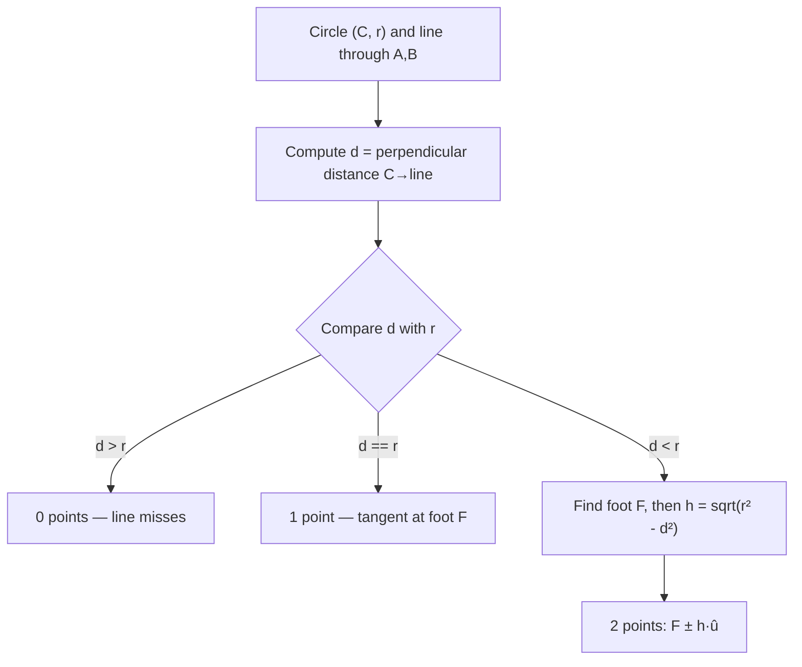
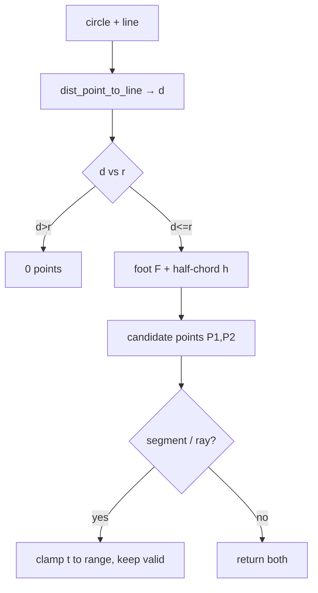

# Circle–Line Intersection — Junior Level

> **One-line summary:** To find where a line meets a circle, drop a perpendicular from the centre to the line. The length of that perpendicular is the **distance** `d`. Compare `d` with the radius `r`: if `d > r` the line misses (0 points), if `d == r` it just kisses (1 point, tangent), and if `d < r` it cuts through (2 points). The two crossing points sit a **half-chord** `h = sqrt(r² - d²)` on either side of the perpendicular's foot.

---

## Table of Contents

1. [Introduction](#introduction)
2. [Prerequisites](#prerequisites)
3. [Glossary](#glossary)
4. [Core Concepts](#core-concepts)
5. [Big-O Summary](#big-o-summary)
6. [Real-World Analogies](#real-world-analogies)
7. [Pros & Cons](#pros--cons)
8. [Step-by-Step Walkthrough](#step-by-step-walkthrough)
9. [Code Examples](#code-examples)
10. [Coding Patterns](#coding-patterns)
11. [Error Handling](#error-handling)
12. [Performance Tips](#performance-tips)
13. [Best Practices](#best-practices)
14. [Edge Cases & Pitfalls](#edge-cases--pitfalls)
15. [Common Mistakes](#common-mistakes)
16. [Cheat Sheet](#cheat-sheet)
17. [Visual Animation](#visual-animation)
18. [Summary](#summary)
19. [Further Reading](#further-reading)

---

## Introduction

A **circle** is the set of all points exactly `r` away from a centre `C`. A **line** is an infinite straight path. The question "where do they meet?" has exactly three possible answers:

- **Two points** — the line slices clean through the circle (like a sword cutting an apple in half-ish).
- **One point** — the line grazes the circle at a single spot. This is the **tangent** case.
- **No points** — the line passes by entirely outside the circle.

You meet this question constantly:

- A **ray-tracer** shoots a light ray and asks "does it hit this round object, and where first?"
- A **2-D game** checks whether a ball's straight-line path crosses a circular wall or a planet's gravity field.
- A **robot's laser sensor** fires a beam and asks "how far until it hits that cylindrical pillar?"
- A **map tool** finds where a straight road crosses a circular zone (a delivery radius, a no-fly ring).

The brute-force instinct is to write the line as `y = mx + b`, substitute into the circle equation `(x - cx)² + (y - cy)² = r²`, and grind through the algebra. That works, but vertical lines (infinite slope) break it and the algebra is error-prone. This file teaches a cleaner, more **geometric** method first — the **perpendicular-distance + half-chord** approach — because it needs almost no algebra and never special-cases vertical lines. Then we preview the algebraic (quadratic) method, which `middle.md` develops fully.

> **Mental anchor:** the whole problem collapses to comparing two lengths — the distance `d` from the centre to the line, and the radius `r`. The count of intersection points is just the sign of `r - d`.

---

## Prerequisites

Before reading this file you should be comfortable with:

- **2-D coordinates** — a point is a pair `(x, y)`. Everything lives in the plane.
- **A circle** described by its **centre** `C = (cx, cy)` and **radius** `r`.
- **Vectors** — subtracting two points `B - A = (Bx - Ax, By - Ay)` gives the direction "from A to B." Adding a vector to a point moves you.
- **The dot product** — `u · v = ux·vx + uy·vy`. We use it to **project** one vector onto another (find the "shadow" of one along the other).
- **Length / magnitude** — `|v| = sqrt(vx² + vy²)`. And the square root function in general.
- **The Pythagorean theorem** — `a² + b² = c²`. The half-chord formula is just Pythagoras.
- **`if`/`else`, loops, functions** in any of Go / Java / Python.

Optional but helpful:

- Awareness that **floating-point** arithmetic is not exact, so "is `d` *exactly* equal to `r`?" needs a small tolerance (epsilon), not `==`.
- The companion topic **`02-line-intersection`** (line vs line), whose vector toolkit we reuse.

---

## Glossary

| Term | Meaning |
|------|---------|
| **Circle** | All points at distance `r` from centre `C`. Equation: `(x - cx)² + (y - cy)² = r²`. |
| **Centre `C`** | The middle point `(cx, cy)` of the circle. |
| **Radius `r`** | The distance from the centre to any point on the circle. |
| **Line** | An infinite straight path, given by two points `A`, `B` (or a point + direction). |
| **Segment** | A finite piece of a line between two endpoints. Has a start and an end. |
| **Ray** | A half-line: starts at a point and goes forever in one direction. Used in graphics. |
| **Distance to line `d`** | The shortest (perpendicular) distance from the centre `C` to the line. |
| **Foot of perpendicular** | The point on the line closest to `C`; where the perpendicular from `C` lands. Call it `F`. |
| **Chord** | The straight segment joining the two intersection points inside the circle. |
| **Half-chord `h`** | Half the chord's length: `h = sqrt(r² - d²)`. Distance from `F` to each crossing point. |
| **Tangent** | A line touching the circle at exactly one point (`d == r`). |
| **Secant** | A line cutting the circle at two points (`d < r`). |
| **Discriminant** | In the quadratic method, the value `b² - 4ac`; its sign gives the point count. |
| **Projection** | The "shadow" of one vector onto another, found with the dot product. |
| **Epsilon (`eps`)** | A tiny tolerance for comparing floats, e.g. `1e-9`. |

---

## Core Concepts

### 1. The whole problem is one distance comparison

Forget points for a moment. Ask only: **how far is the centre `C` from the line?** Call that perpendicular distance `d`. Then:

```
d > r   →  line is entirely outside the circle      →  0 intersection points
d == r  →  line just touches (tangent)              →  1 intersection point
d < r   →  line cuts through (secant)               →  2 intersection points
```

That is the heart of the topic. Computing `d` and comparing it to `r` answers the *count* question immediately. Finding the actual points is a small extra step.

### 2. Distance from a point to a line

There are two common ways to get `d`.

**(a) Using the line through two points `A` and `B`.** The signed cross product of `AB` with `AC` gives twice the area of triangle `ABC`; dividing by the base length `|AB|` gives the height — which is exactly the perpendicular distance:

```
d = |cross(A, B, C)| / |AB|
where cross(A,B,C) = (Bx-Ax)(Cy-Ay) - (By-Ay)(Cx-Ax)
```

**(b) Using the line in `ax + by + c = 0` form.** If the line is given by coefficients `a, b, c` (with `a² + b² > 0`):

```
d = |a·cx + b·cy + c| / sqrt(a² + b²)
```

Both give the same number. Method (a) is natural when the line comes from two points; method (b) is natural when it comes from an equation.

### 3. The foot of the perpendicular `F`

`F` is the point on the line nearest to `C`. We find it by **projecting** the vector `C - A` onto the line's direction `d_hat` (the unit direction along the line). If `dir = B - A`, then:

```
t = ((C - A) · dir) / (dir · dir)     # how far along AB, in units of |dir|
F = A + t · dir                        # the foot
```

`F` is the **midpoint** of the chord. This is the pivot for everything else.

### 4. The half-chord and the two points

Once we have `F` and `d`, Pythagoras finishes the job. The radius `r` is the hypotenuse of a right triangle whose legs are `d` (centre to line) and `h` (foot to a crossing point):

```
r² = d² + h²    →    h = sqrt(r² - d²)
```

Walk distance `h` **along the line** in both directions from `F` to reach the two intersection points. Using the **unit** direction `u = dir / |dir|`:

```
P1 = F + h · u
P2 = F - h · u
```

If `d == r`, then `h = 0` and `P1 == P2 == F` — the single tangent point. If `d > r`, then `r² - d² < 0` and the square root is undefined — that is the algebraic signal for "0 points."



### 5. Circle vs **segment** vs **ray** (clamping)

The method above treats the line as **infinite**. Often you actually have a **segment** (`A` to `B`) or a **ray** (starts at `A`, goes forever). The fix is simple: each intersection point corresponds to a parameter `t` along the line (`point = A + t · dir`). Keep only the points whose `t` lies in the allowed range:

- **Infinite line:** any `t` (no restriction).
- **Ray from `A`:** keep `t >= 0`.
- **Segment `A`→`B`:** keep `0 <= t <= 1` (if `dir = B - A`).

So a line might cut the circle twice, but a short segment might only reach one of those points, or neither. **Clamp the parameter, then keep the valid points.** This is the core of `middle.md`.

### 6. The quadratic method (preview)

The other classic approach: substitute the parametric line `A + t·dir` into the circle equation. You get a **quadratic in `t`**:

```
a·t² + b·t + c = 0
```

The **discriminant** `Δ = b² - 4ac` decides the count: `Δ < 0` → 0 points, `Δ == 0` → 1 (tangent), `Δ > 0` → 2. Solve for `t`, then plug back to get the points. This method generalises beautifully to circle-ray and 3-D sphere intersection, which is why ray-tracers prefer it. We preview it in code below and develop it in `middle.md` and `professional.md` (including the equivalence proof: both methods give the same answer).

---

## Big-O Summary

| Operation | Complexity | Notes |
|-----------|-----------|-------|
| Distance from point to line `d` | **O(1)** | One cross product (or dot product) + one sqrt. |
| Foot of perpendicular `F` | **O(1)** | One projection (dot products). |
| Half-chord `h` and the two points | **O(1)** | One subtraction, one sqrt, two vector adds. |
| Count points (0 / 1 / 2) | **O(1)** | Compare `d` to `r`, or sign of discriminant. |
| Quadratic method (full) | **O(1)** | Build `a, b, c`; one discriminant; up to two roots. |
| Circle vs segment / ray (with clamp) | **O(1)** | Same, plus a range check on `t`. |
| Intersect a ray against **n** circles | **O(n)** | Test each circle; the heart of naive ray tracing. |
| Intersect a ray against **n** circles with a spatial index | **O(log n)** typical | BVH / grid broad-phase; see `senior.md`. |

> A single circle-line test is genuinely constant time. The scaling question — "a ray against *many* circles" — is what `senior.md` addresses with broad-phase acceleration.

---

## Real-World Analogies

| Concept | Analogy |
|---------|---------|
| Distance `d` vs radius `r` | How close a passing ship sails to a lighthouse, versus the lighthouse's light radius. Inside → seen twice; grazing → seen once; outside → never. |
| Foot of perpendicular `F` | The exact spot on a straight road that is nearest to a roundabout's centre. |
| Half-chord `h` | Half the length of the painted line where a straight footpath crosses a circular plaza. |
| Tangent (`d == r`) | A cue ball just kissing the edge of another ball — contact at a single point. |
| Secant (`d < r`) | A skewer pushed straight through a round fruit: it enters and exits, two holes. |
| Clamping to a segment | A short laser pointer: the *line* of the beam would hit the pillar, but the beam runs out of length first. |
| Discriminant sign | A traffic light for the answer: red (`<0`, miss), amber (`==0`, graze), green (`>0`, cut through). |

Where the analogies break: a real ship has width and a real beam spreads; our line is infinitely thin and our circle is an ideal curve, so "tangent" is an exact mathematical knife-edge, not a fuzzy near-miss.

---

## Pros & Cons

| Pros | Cons |
|------|------|
| The perpendicular method needs only dot products, one subtraction, and one sqrt — **no equation solving**. | It uses floating-point (sqrt and division), so the tangent case needs an **epsilon** comparison, not `==`. |
| **No special case for vertical lines** — unlike the `y = mx + b` substitution. | Near-tangent inputs are numerically delicate (`r² - d²` is a tiny difference of big numbers). |
| Constant time; trivial to implement and reason about. | You must decide whether the input is a line, ray, or segment and clamp accordingly. |
| The foot-of-perpendicular gives the chord midpoint **for free** — handy for many follow-up tasks. | Reporting "1 point" for a true secant whose two points are very close requires care (robustness). |
| The quadratic method generalises cleanly to **3-D spheres** and to **rays** in graphics. | The quadratic method can suffer **catastrophic cancellation** if coded naively (see `professional.md`). |

**When to use:** ray tracing, collision against round obstacles, finding where a path crosses a radius, robotics range sensing, geometry contest problems.

**When NOT to use:** when the boundary is not a circle (use ellipse/curve intersection), or when you only need *whether* a point is inside a circle (a single distance check, no intersection needed).

---

## Step-by-Step Walkthrough

Let us run the perpendicular method on a concrete secant case.

```
Circle:  centre C = (0, 0),  radius r = 5
Line:    through A = (-6, 3)  and  B = (6, 3)   (a horizontal line at y = 3)
```

By eye: the line `y = 3` is 3 units above the centre, well inside `r = 5`, so it should cross twice. Let us confirm with the method.

**Step 1 — direction of the line.**

```
dir = B - A = (6 - (-6), 3 - 3) = (12, 0)
|dir| = sqrt(12² + 0²) = 12
unit u = dir / |dir| = (1, 0)
```

**Step 2 — project `C - A` onto the line to find the foot `F`.**

```
C - A = (0 - (-6), 0 - 3) = (6, -3)
t = ((C - A) · dir) / (dir · dir) = (6·12 + (-3)·0) / (12·12) = 72 / 144 = 0.5
F = A + t·dir = (-6, 3) + 0.5·(12, 0) = (0, 3)
```

So the foot is `F = (0, 3)` — directly below the centre, on the line. Makes sense.

**Step 3 — distance `d` from `C` to the line.**

```
d = |C - F| = |(0,0) - (0,3)| = sqrt(0² + 3²) = 3
```

**Step 4 — compare `d` with `r`.**

```
d = 3 < r = 5   →  two intersection points (secant)
```

**Step 5 — half-chord and the points.**

```
h = sqrt(r² - d²) = sqrt(25 - 9) = sqrt(16) = 4
P1 = F + h·u = (0, 3) + 4·(1, 0) = ( 4, 3)
P2 = F - h·u = (0, 3) - 4·(1, 0) = (-4, 3)
```

**Check:** does `(4, 3)` lie on the circle? `4² + 3² = 16 + 9 = 25 = r²`. ✓ And `(-4, 3)` by symmetry. The line crosses at `(±4, 3)`. Done — and we never wrote `y = mx + b`.

Now a **tangent** example:

```
Circle:  C = (0, 0),  r = 5
Line:    horizontal at y = 5  →  A = (-6, 5), B = (6, 5)
```

The foot is `F = (0, 5)`, `d = 5 = r`, so `h = sqrt(25 - 25) = 0`. Both points collapse to `F = (0, 5)` — a single tangent point at the top of the circle.

And a **miss**:

```
Line:    horizontal at y = 7  →  d = 7 > r = 5  →  r² - d² = 25 - 49 = -24 < 0
```

The square root of a negative number is undefined — that is the algorithm telling us: **no intersection**. We check the sign *before* taking the root.

---

## Code Examples

### Example: Circle–line intersection (perpendicular + half-chord method)

We use floating-point coordinates. A small `EPS` distinguishes the tangent case from a near-tangent secant or miss.

#### Go

```go
package main

import (
	"fmt"
	"math"
)

const EPS = 1e-9

type Pt struct{ X, Y float64 }

func sub(a, b Pt) Pt    { return Pt{a.X - b.X, a.Y - b.Y} }
func add(a, b Pt) Pt    { return Pt{a.X + b.X, a.Y + b.Y} }
func scale(a Pt, s float64) Pt { return Pt{a.X * s, a.Y * s} }
func dot(a, b Pt) float64 { return a.X*b.X + a.Y*b.Y }
func norm(a Pt) float64  { return math.Hypot(a.X, a.Y) }

// circleLine returns the intersection points of the INFINITE line through A,B
// with the circle (centre C, radius r). It returns 0, 1, or 2 points.
func circleLine(C Pt, r float64, A, B Pt) []Pt {
	dir := sub(B, A)         // line direction
	len2 := dot(dir, dir)    // |dir|²
	if len2 < EPS {          // A and B coincide → not a real line
		return nil
	}
	// Project C onto the line to find the foot F.
	t := dot(sub(C, A), dir) / len2
	F := add(A, scale(dir, t))     // foot of perpendicular
	d := norm(sub(C, F))           // distance centre → line

	if d > r+EPS {
		return nil                 // 0 points: line misses
	}
	// Half-chord. Guard the sqrt against tiny negatives from round-off.
	rem := r*r - d*d
	if rem < 0 {
		rem = 0
	}
	h := math.Sqrt(rem)
	u := scale(dir, 1/math.Sqrt(len2)) // unit direction along the line

	if h < EPS {
		return []Pt{F}             // 1 point: tangent
	}
	P1 := add(F, scale(u, h))
	P2 := sub(F, scale(u, h))
	return []Pt{P1, P2}            // 2 points: secant
}

func main() {
	C := Pt{0, 0}
	pts := circleLine(C, 5, Pt{-6, 3}, Pt{6, 3})
	fmt.Println(pts) // [{4 3} {-4 3}]

	fmt.Println(circleLine(C, 5, Pt{-6, 5}, Pt{6, 5})) // tangent: [{0 5}]
	fmt.Println(circleLine(C, 5, Pt{-6, 7}, Pt{6, 7})) // miss:   []
}
```

#### Java

```java
import java.util.*;

public class CircleLine {

    static final double EPS = 1e-9;

    record Pt(double x, double y) {}

    static Pt sub(Pt a, Pt b)        { return new Pt(a.x - b.x, a.y - b.y); }
    static Pt add(Pt a, Pt b)        { return new Pt(a.x + b.x, a.y + b.y); }
    static Pt scale(Pt a, double s)  { return new Pt(a.x * s, a.y * s); }
    static double dot(Pt a, Pt b)    { return a.x * b.x + a.y * b.y; }
    static double norm(Pt a)         { return Math.hypot(a.x, a.y); }

    // Intersection of the infinite line A-B with circle (C, r). 0, 1, or 2 points.
    static List<Pt> circleLine(Pt C, double r, Pt A, Pt B) {
        Pt dir = sub(B, A);
        double len2 = dot(dir, dir);
        List<Pt> out = new ArrayList<>();
        if (len2 < EPS) return out;            // A and B coincide

        double t = dot(sub(C, A), dir) / len2;
        Pt F = add(A, scale(dir, t));          // foot of perpendicular
        double d = norm(sub(C, F));            // centre-to-line distance

        if (d > r + EPS) return out;           // 0 points

        double rem = r * r - d * d;
        if (rem < 0) rem = 0;                  // clamp round-off
        double h = Math.sqrt(rem);
        Pt u = scale(dir, 1.0 / Math.sqrt(len2)); // unit direction

        if (h < EPS) {                         // tangent
            out.add(F);
            return out;
        }
        out.add(add(F, scale(u, h)));
        out.add(sub(F, scale(u, h)));
        return out;
    }

    public static void main(String[] args) {
        Pt C = new Pt(0, 0);
        System.out.println(circleLine(C, 5, new Pt(-6, 3), new Pt(6, 3))); // 2 pts
        System.out.println(circleLine(C, 5, new Pt(-6, 5), new Pt(6, 5))); // tangent
        System.out.println(circleLine(C, 5, new Pt(-6, 7), new Pt(6, 7))); // miss
    }
}
```

#### Python

```python
import math

EPS = 1e-9


def sub(a, b):   return (a[0] - b[0], a[1] - b[1])
def add(a, b):   return (a[0] + b[0], a[1] + b[1])
def scale(a, s): return (a[0] * s, a[1] * s)
def dot(a, b):   return a[0] * b[0] + a[1] * b[1]
def norm(a):     return math.hypot(a[0], a[1])


def circle_line(C, r, A, B):
    """Intersect the INFINITE line through A,B with circle (centre C, radius r).
    Returns a list of 0, 1, or 2 points."""
    direction = sub(B, A)
    len2 = dot(direction, direction)
    if len2 < EPS:                    # A and B coincide
        return []

    t = dot(sub(C, A), direction) / len2
    F = add(A, scale(direction, t))  # foot of perpendicular
    d = norm(sub(C, F))              # centre-to-line distance

    if d > r + EPS:
        return []                    # 0 points: miss

    rem = r * r - d * d
    if rem < 0:                      # clamp tiny negative round-off
        rem = 0.0
    h = math.sqrt(rem)
    u = scale(direction, 1.0 / math.sqrt(len2))   # unit direction

    if h < EPS:
        return [F]                   # tangent: 1 point
    return [add(F, scale(u, h)), sub(F, scale(u, h))]


if __name__ == "__main__":
    C = (0.0, 0.0)
    print(circle_line(C, 5, (-6, 3), (6, 3)))  # [(4.0, 3.0), (-4.0, 3.0)]
    print(circle_line(C, 5, (-6, 5), (6, 5)))  # tangent: [(0.0, 5.0)]
    print(circle_line(C, 5, (-6, 7), (6, 7)))  # miss: []
```

**What it does:** finds where an infinite line crosses a circle by projecting the centre onto the line (foot `F`), measuring the distance `d`, and stepping the half-chord `h = sqrt(r² - d²)` along the line in both directions.
**Run:** `go run main.go` | `javac CircleLine.java && java CircleLine` | `python circle_line.py`

---

## Coding Patterns

### Pattern 1: Distance from a point to a line (the count primitive)

**Intent:** answer "0 / 1 / 2 points?" with a single number `d`.

```python
def dist_point_to_line(C, A, B):
    # |cross(A,B,C)| / |AB|
    cross = (B[0]-A[0])*(C[1]-A[1]) - (B[1]-A[1])*(C[0]-A[0])
    return abs(cross) / math.hypot(B[0]-A[0], B[1]-A[1])
```

Compare the result with `r`: `d > r` miss, `d == r` tangent, `d < r` two points. This is the cheapest possible test if you only need the **count**, not the points.

### Pattern 2: Foot of perpendicular via projection

**Intent:** find the chord's midpoint, reused everywhere.

```python
def foot(C, A, B):
    d = sub(B, A)
    t = dot(sub(C, A), d) / dot(d, d)
    return add(A, scale(d, t))
```

The foot `F` is also the closest point on the line to `C` — handy for distance queries on its own.

### Pattern 3: Clamp to a segment or ray

**Intent:** turn an infinite-line result into a segment/ray result.

```python
def keep_in_range(A, B, points, lo=0.0, hi=1.0):
    d = sub(B, A); len2 = dot(d, d)
    kept = []
    for P in points:
        t = dot(sub(P, A), d) / len2     # parameter of P along AB
        if lo - EPS <= t <= hi + EPS:
            kept.append(P)
    return kept
```

Use `lo=0, hi=1` for a segment, `lo=0, hi=inf` for a ray, no clamp for an infinite line.



---

## Error Handling

| Error | Cause | Fix |
|-------|-------|-----|
| `sqrt` of a negative number | `r² - d²` slightly below 0 from round-off on a near-tangent. | Clamp the radicand to 0 before the sqrt: `rem = max(0, r*r - d*d)`. |
| Division by zero in projection | The two points `A`, `B` are identical, so `|dir| = 0`. | Check `dot(dir, dir) < EPS` and reject (not a real line). |
| Tangent never reported | Comparing `d == r` exactly on floats. | Use a tolerance: treat `h < EPS` (or `|d - r| < EPS`) as tangent. |
| Wrong count near tangent | Tiny secant reported as miss, or tangent as 2 points. | Pick an `EPS` matched to your coordinate scale; see `senior.md`. |
| Points outside the segment returned | Forgot to clamp `t` for a segment/ray. | Filter points by their parameter `t` range. |
| `NaN` propagating | Earlier division by zero or sqrt(negative) leaked through. | Validate inputs and guard every division/sqrt. |

---

## Performance Tips

- **Skip the square root** when you only need the *count*. Compare `d²` with `r²` instead of `d` with `r` — one fewer sqrt per test. Only take the sqrt when you actually need the points.
- **Compute `len2 = dot(dir, dir)` once** and reuse it for both the projection and the unit direction.
- For a **ray vs many circles**, reject early: if the circle's centre projects *behind* the ray origin and the origin is outside the circle, skip it before any sqrt.
- Avoid normalising the direction (`/|dir|`) until the very end — work in parameter space (`t`) as long as you can; division is the costly step.
- Inline the tiny vector helpers in hot loops (ray tracers call this millions of times); function-call overhead dominates such small bodies.
- Batch tests benefit from a **broad-phase** filter (bounding boxes / spatial grid) so you only run the exact test on plausible circles — see `senior.md`.

---

## Best Practices

- Decide up front whether your input is a **line, ray, or segment**, and clamp the parameter `t` accordingly — write that policy in one place.
- Keep the **count test** (compare `d²`, `r²`) and the **point-finding** step as separate functions so each is testable alone.
- Always guard the `sqrt` radicand against tiny negatives; never trust that `r² - d²` is exactly `0` at tangency.
- Choose `EPS` relative to your coordinate magnitudes, not a blind `1e-9` — a scene measured in millions of units needs a larger tolerance.
- Return points in a stable order (e.g. by parameter `t`) so tests and downstream code are deterministic.
- Reuse the vector toolkit (`sub`, `dot`, `scale`) from `02-line-intersection`; do not reinvent geometry primitives per file.

---

## Edge Cases & Pitfalls

- **Line through the centre** — `d = 0`, the chord is a full **diameter**, `h = r`, and the two points are antipodal. The method handles this with no special case.
- **Tangent (`d == r`)** — exactly one point; with floats you must detect it via `h < EPS`, not exact equality.
- **Degenerate line (`A == B`)** — not a line at all; `|dir| = 0` causes division by zero. Reject it.
- **Zero-radius circle** — the "circle" is a single point `C`; it intersects the line only if `C` lies on the line (`d == 0`). A useful sanity check for your code.
- **Very near-tangent secant** — `d` just below `r`; `h` is tiny but nonzero. Your `EPS` decides whether this reads as 1 or 2 points; document the choice.
- **Segment that stops short** — the infinite line cuts twice but the segment only reaches one (or zero) of the points. Always clamp.
- **Huge coordinates** — `d²` and `r²` are big; their difference loses precision. The professional file covers the robust quadratic that avoids this.

---

## Common Mistakes

1. **Using `y = mx + b`** and dividing by the slope — breaks on vertical lines. The vector method never divides by a slope.
2. **Taking `sqrt(r² - d²)` without a sign check** — crashes or produces `NaN` on a miss. Check the sign (or clamp to 0) first.
3. **Comparing `d == r` with `==`** on floats — the tangent case is then *never* detected. Use an epsilon.
4. **Forgetting to normalise the direction** before stepping `h` along it — the two points land at the wrong distance.
5. **Returning infinite-line points for a segment query** — you must clamp the parameter `t` to `[0, 1]`.
6. **Treating "two coincident points" (tangent) as two separate intersections** — collapse them to one.
7. **Choosing `EPS` blindly** — too small and tangents are missed, too large and genuine near-misses are reported as hits. Scale it to your data.

---

## Cheat Sheet

| Step | What to do |
|------|------------|
| Direction | `dir = B - A`; `len2 = dir·dir`. Reject if `len2 ≈ 0`. |
| Foot `F` | `t = (C-A)·dir / len2`; `F = A + t·dir`. |
| Distance `d` | `d = |C - F|`  (or `|cross(A,B,C)| / |AB|`). |
| Count | `d>r` → 0, `d==r` → 1, `d<r` → 2 (use eps). |
| Half-chord | `h = sqrt(max(0, r² - d²))`. |
| Points | `F ± h·û`, where `û = dir / |dir|`. |
| Tangent | `h < eps` → single point `F`. |
| Segment/ray | clamp each point's parameter `t` to the allowed range. |

Hard rules: **compare `d²` vs `r²` to skip a sqrt; clamp the radicand before sqrt; use an epsilon for tangency.**

```
single circle-line test : O(1)
ray vs n circles (naive): O(n)
ray vs n circles (BVH)  : ~O(log n)   # see senior.md
```

---

## Visual Animation

> See [`animation.html`](./animation.html) for an interactive visual animation of circle–line intersection.
>
> The animation demonstrates:
> - A fixed **circle** and a **draggable line** (drag either endpoint)
> - The **foot of perpendicular** `F` drawn from the centre to the line, with the distance `d`
> - The **half-chord** `h = sqrt(r² - d²)` rendered as you move the line
> - The **0 / 1 / 2 intersection points** appearing and disappearing live
> - The **tangent** case called out explicitly when `d == r`
> - A live calculation panel, a Big-O reference table, and an operation log

---

## Summary

Circle–line intersection reduces to one comparison: the perpendicular **distance `d`** from the centre to the line, against the **radius `r`**. If `d > r` the line misses (0 points); if `d == r` it is tangent (1 point); if `d < r` it is a secant (2 points). Find the **foot of perpendicular** `F` by projecting the centre onto the line, then step the **half-chord** `h = sqrt(r² - d²)` along the line in both directions to reach the two crossing points — pure Pythagoras, no slopes, no vertical-line special case. For a **segment** or **ray**, clamp each point's parameter `t` to the allowed range. The alternative **quadratic** method substitutes the parametric line into the circle equation and reads the count off the discriminant's sign; it generalises to rays and 3-D spheres, which is why graphics uses it. The next level develops that quadratic method, the clamping rules, and the tangent/robustness story.

---

## Further Reading

- *Computational Geometry: Algorithms and Applications* (de Berg et al.) — primitives for distance and projection.
- *Real-Time Collision Detection* (Christer Ericson), Chapter 5 — ray/segment vs sphere, the quadratic method, robustness.
- cp-algorithms.com — "Circle-Line Intersection," "Distance from a point to a line."
- Sibling topics: `02-line-intersection` (the vector toolkit reused here), `14-circle-circle-intersection`, `15-circle-tangents`, `08-minimum-enclosing-circle`.

---

**Next step:** [middle.md](./middle.md) — the quadratic/parametric method, circle-segment and circle-ray clamping, the tangent case, and floating-point robustness near tangency.
