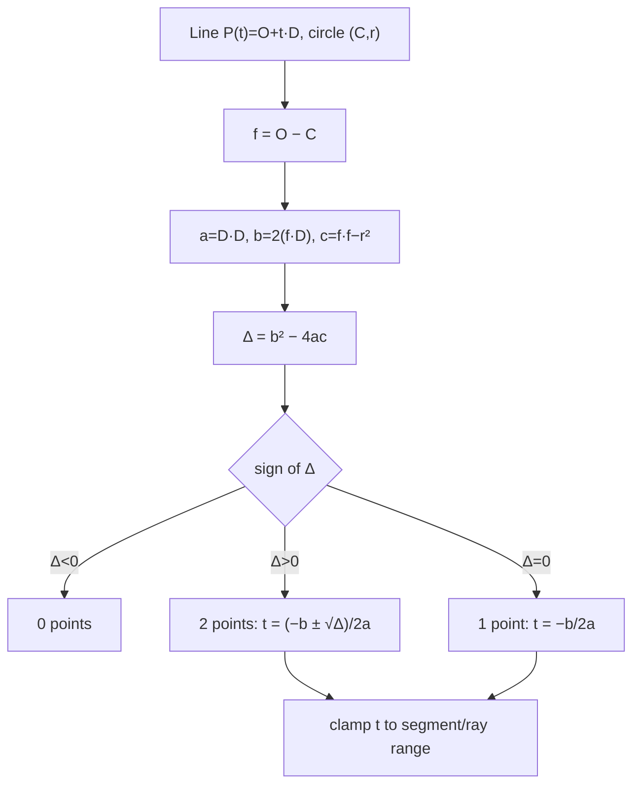
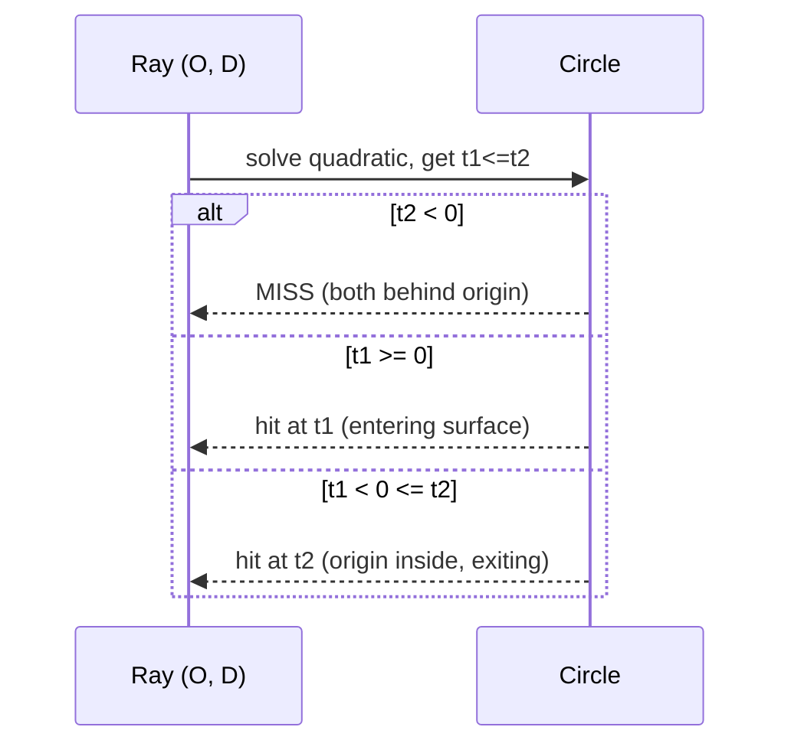

# Circle–Line Intersection — Middle Level

> **One-line summary:** Substitute the **parametric line** `P(t) = O + t·D` into the circle equation `|P - C|² = r²`. You get a **quadratic in `t`**, `a·t² + b·t + c = 0`, whose **discriminant** `Δ = b² - 4ac` tells you the count (0 / 1 / 2) by its sign. Solve for the roots `t`, plug back to recover the points, and — crucially — **clamp `t`** to the allowed range to turn a *line* result into a *ray* or *segment* result. The geometric (foot + half-chord) method and this algebraic method are the same calculation wearing different clothes.

---

## Table of Contents

1. [Introduction](#introduction)
2. [Deeper Concepts](#deeper-concepts)
3. [Comparison with Alternatives](#comparison-with-alternatives)
4. [The Quadratic / Parametric Method](#the-quadratic--parametric-method)
5. [Circle–Segment and Circle–Ray (Clamping)](#circle-segment-and-circle-ray-clamping)
6. [Tangency and Robustness](#tangency-and-robustness)
7. [Code Examples](#code-examples)
8. [Error Handling](#error-handling)
9. [Performance Analysis](#performance-analysis)
10. [Best Practices](#best-practices)
11. [Visual Animation](#visual-animation)
12. [Summary](#summary)

---

## Introduction

> Focus: "Why does it work?" and "When should I choose this method?"

At the junior level we found circle–line intersections **geometrically**: project the centre onto the line to get the foot `F`, measure `d`, and walk the half-chord `h = sqrt(r² - d²)` to both sides. That method is intuitive and division-light, and it is the right tool when you naturally think in terms of "closest point on the line."

This level develops the **algebraic** twin: parametrise the line as `P(t) = O + t·D`, substitute into the circle's equation, and solve the resulting **quadratic in `t`**. The two methods compute the *same* intersection points — `professional.md` proves their equivalence — but the quadratic form has three practical advantages:

1. It produces the **parameter `t`** of each hit directly, which is exactly what you need to **clamp** to a segment or a ray.
2. It generalises with zero changes to **3-D spheres**, so ray-tracers and physics engines use it everywhere.
3. Its **discriminant** is a single scalar whose sign answers the count question, and whose magnitude tells you *how close to tangent* you are — a robustness signal.

We also tackle the questions junior deferred: what changes when the "line" is really a **segment** or a **ray**, how to detect the **tangent** case reliably, and what makes the computation fragile **near tangency**.

> **Mental anchor:** the discriminant `Δ` is the algebraic mirror of `r² - d²`. Both are positive for a secant, zero at tangency, negative for a miss — they are literally proportional. Pick whichever method makes the surrounding code cleaner.

---

## Deeper Concepts

### Invariant: `t` is the universal coordinate along the line

Write every point on the line as `P(t) = O + t·D`, where `O` is an origin point on the line and `D` is its direction vector. Then:

- `t` increases monotonically as you slide along the line in the `+D` direction.
- If `D = B - A` and `O = A`, then `t = 0` is `A`, `t = 1` is `B`, and `t ∈ [0, 1]` is the segment.
- For a ray from `O`, the valid region is `t >= 0`.

Every downstream decision — is this hit on the segment? in front of the ray? which hit is nearer? — is a comparison on `t`. The quadratic gives you `t` for free; the geometric method makes you recover it. **That is the main reason graphics code prefers the quadratic.**

### Substituting the line into the circle

The circle is all points `P` with `|P - C|² = r²`. Substitute `P = O + t·D`:

```
|O + t·D - C|² = r²
```

Let `f = O - C` (vector from centre to the line's origin point). Expand using `|u|² = u·u`:

```
|t·D + f|² = r²
(D·D) t² + 2 (f·D) t + (f·f - r²) = 0
```

That is a quadratic `a·t² + b·t + c = 0` with:

```
a = D·D            (always > 0 for a real line; equals |D|²)
b = 2 (f·D)
c = f·f - r²       (= |O - C|² - r²)
```

### The discriminant decides everything

```
Δ = b² - 4ac

Δ < 0   →  no real root      →  0 intersection points (miss)
Δ == 0  →  one double root   →  1 point (tangent)
Δ > 0   →  two real roots    →  2 points (secant)
```

Then the roots are the familiar quadratic formula:

```
t = (-b ± sqrt(Δ)) / (2a)
```

and each point is `P(t) = O + t·D`. If you used `O = A`, `D = B - A`, then `a = |AB|²` and the `t` values are already in segment coordinates — ready to clamp.

### Why `Δ` and `r² - d²` are the same fact

A quick sanity link (full proof in `professional.md`). The distance from `C` to the line satisfies `d² = c·a... ` — more precisely, for the parametrisation above,

```
Δ / (4a²) = r² - d²
```

So `sign(Δ) == sign(r² - d²)`. The geometric "compare `d` with `r`" and the algebraic "look at the sign of `Δ`" are one and the same test, scaled by the positive constant `4a²`.



---

## Comparison with Alternatives

| Attribute | Foot + half-chord (geometric) | Quadratic substitution (algebraic) | `y = mx + b` substitution |
|-----------|-------------------------------|------------------------------------|---------------------------|
| Special-case vertical lines? | No | No | **Yes** (slope is infinite) |
| Gives the parameter `t` directly? | No (must recover) | **Yes** | No |
| Generalises to 3-D spheres? | Awkward | **Yes, unchanged** | No |
| Number of sqrts | 1 (plus 1 for `|D|`) | 1 | 1 |
| Robustness near tangent | Good (clamp radicand) | Needs care (cancellation in `b² - 4ac`) | Poor |
| Clamping to ray/segment | Recompute `t` per point | **Trivial** (already have `t`) | Awkward |
| Best for | "closest point" intuition, chord midpoint | ray tracing, physics, clamped queries | almost never — avoid |

**Choose the geometric method when:** you also want the chord midpoint (foot `F`) or you think naturally in "distance to line." 

**Choose the quadratic method when:** you need the parameter `t` (rays, segments, "nearest hit"), or you will port the same code to 3-D spheres. This is the default in graphics and game engines.

**Avoid `y = mx + b`** entirely: it cannot represent vertical lines and offers no advantage.

---

## The Quadratic / Parametric Method

Here is the full method laid out as a recipe, using `O = A`, `D = B - A`.

```
1.  f = A - C
2.  a = D·D                 # = |D|²,  > 0
3.  b = 2 (f·D)
4.  c = f·f - r²
5.  Δ = b² - 4ac
6.  if Δ < 0:  return []        # miss
7.  sq = sqrt(max(0, Δ))        # guard round-off
8.  t1 = (-b - sq) / (2a)
9.  t2 = (-b + sq) / (2a)       # t1 <= t2 since sq >= 0
10. if Δ ~ 0:  return [A + t1·D]   # tangent (t1 == t2)
11. return [A + t1·D, A + t2·D]
```

Two refinements professionals add (developed fully in `professional.md`):

- **Halve `b`.** Define `b' = f·D` (drop the factor 2). Then `Δ' = b'² - a·c` and `t = (-b' ± sqrt(Δ')) / a`. Fewer multiplications, identical result.
- **Stable roots.** When `b` is large relative to `sqrt(Δ)`, computing the *other* root by subtraction loses precision. Use the numerically stable form `t1 = q/a`, `t2 = c/q` with `q = -(b + sign(b)·sqrt(Δ))/2`. We show this in `professional.md`.

### Worked example (quadratic method)

Same secant as junior: `C = (0,0)`, `r = 5`, line `A = (-6, 3)`, `B = (6, 3)`.

```
D = B - A = (12, 0)
f = A - C = (-6, 3)
a = D·D = 144
b = 2(f·D) = 2·((-6)(12) + 3·0) = 2·(-72) = -144
c = f·f - r² = (36 + 9) - 25 = 20
Δ = b² - 4ac = 20736 - 4·144·20 = 20736 - 11520 = 9216
sqrt(Δ) = 96
t1 = (144 - 96)/288 = 48/288 = 1/6
t2 = (144 + 96)/288 = 240/288 = 5/6

P(t1) = A + (1/6)D = (-6,3) + (2,0) = (-4, 3)
P(t2) = A + (5/6)D = (-6,3) + (10,0) = ( 4, 3)
```

Same two points `(±4, 3)` the geometric method found. ✓ Note the `t` values `1/6` and `5/6` both lie in `[0,1]`, so they are also on the **segment** — clamping keeps both.

---

## Circle–Segment and Circle–Ray (Clamping)

The quadratic gives `t` values for an **infinite line**. To answer the segment or ray question, filter by `t`:

| Geometry | Keep roots with | Notes |
|----------|-----------------|-------|
| Infinite line | any `t` | no restriction |
| Ray from `O` along `+D` | `t >= 0` | the half in front of the origin |
| Segment `A`→`B` (`O=A`, `D=B-A`) | `0 <= t <= 1` | both ends inclusive |

A line crossing the circle twice can yield 2, 1, or 0 points once clamped — depending on how much of the chord lies inside the segment/ray.

### Ray tracing: only the **nearest** hit in front

For a ray (graphics), you usually want the **first** surface the ray meets: the smallest `t >= 0`. The algorithm:

```
compute t1 <= t2 (the two roots)
if t2 < 0:        return MISS        # both hits behind the origin
if t1 >= 0:       return hit at t1   # ray starts outside, first hit is t1
else:             return hit at t2   # origin is INSIDE the circle (t1<0<t2)
```

That last case — origin inside the circle — is important: the ray exits at `t2`, and inside/outside distinction drives refraction and "am I in the volume?" tests. We expand this in `senior.md`.



### Subtlety: the segment lies entirely inside

If both endpoints of a segment are *inside* the circle, the infinite line crosses twice but **both** `t` roots fall outside `[0,1]` → the clamped result is **empty**. The segment never reaches the boundary. This is correct: the segment is wholly contained, with no boundary crossing. If your application also cares about containment, test an endpoint with `|A - C| < r` separately.

---

## Tangency and Robustness

### Detecting tangency

Exact tangency (`Δ == 0`) almost never happens with floating-point inputs. Instead, decide a **band**: treat `|Δ| <= ε_Δ` as tangent. But `Δ` has units of (length)⁴ (it scales like `a·c`), so a fixed `ε_Δ` is meaningless across scales. Two robust options:

1. **Normalise `D` first** so `a = D·D = 1`. Then `Δ = b² - 4c` has units of (length)², and comparing it against `(ε·r)²` is scale-aware.
2. **Compare distances, not the raw discriminant:** compute `d` and test `|d - r| < ε·r`. This is the geometric tangency test and is the easiest to reason about.

### The near-tangent danger zone

When `d` is just below `r`, the half-chord `h = sqrt(r² - d²)` (equivalently `sqrt(Δ)/(2a)`) is a **tiny number formed from the difference of two large, nearly equal numbers**. That difference suffers **cancellation**: you might compute `r² - d² = 25.000000 - 24.999999 = 0.000001`, where most of the significant digits cancelled and only noise remains. The two intersection points then have garbage in their last digits, and the count (1 vs 2) becomes unstable.

Mitigations (full treatment in `professional.md`):

- **Avoid forming `r² - d²` directly.** Compute the discriminant from `b² - 4ac` with the halved-`b` form, and consider Kahan-style or higher-precision accumulation for the subtraction.
- **Keep coordinates near the origin.** Translate so `C = 0` before computing; large absolute coordinates inflate the magnitudes you subtract and worsen cancellation.
- **Use a relative epsilon** tied to `r`, not an absolute one.

### Tangent normal and contact point

At tangency the single contact point is the foot `F` (geometric) or `P(-b/2a)` (algebraic). The **surface normal** there is `(F - C)` normalised — pointing from the centre out to the contact. Collision response (bounce, slide) needs this normal, so compute it alongside the point.

---

## Code Examples

### Quadratic method with line / ray / segment modes and clamping

#### Go

```go
package main

import (
	"fmt"
	"math"
)

const EPS = 1e-9

type Pt struct{ X, Y float64 }

func sub(a, b Pt) Pt          { return Pt{a.X - b.X, a.Y - b.Y} }
func add(a, b Pt) Pt          { return Pt{a.X + b.X, a.Y + b.Y} }
func scale(a Pt, s float64) Pt { return Pt{a.X * s, a.Y * s} }
func dot(a, b Pt) float64     { return a.X*b.X + a.Y*b.Y }

type Mode int

const (
	Line Mode = iota // any t
	Ray              // t >= 0
	Seg              // 0 <= t <= 1
)

// circleQuad intersects the parametric line A + t*(B-A) with circle (C,r),
// keeping only the t values allowed by the mode. Returns the kept points.
func circleQuad(C Pt, r float64, A, B Pt, mode Mode) []Pt {
	D := sub(B, A)
	f := sub(A, C)
	a := dot(D, D)
	if a < EPS {
		return nil // A == B: not a line
	}
	bHalf := dot(f, D)            // b' = f·D  (halved b)
	c := dot(f, f) - r*r
	disc := bHalf*bHalf - a*c     // Δ' = b'² - a·c
	if disc < -EPS {
		return nil // miss
	}
	if disc < 0 {
		disc = 0 // clamp round-off → treat as tangent
	}
	sq := math.Sqrt(disc)
	t1 := (-bHalf - sq) / a
	t2 := (-bHalf + sq) / a

	keep := func(t float64) bool {
		switch mode {
		case Ray:
			return t >= -EPS
		case Seg:
			return t >= -EPS && t <= 1+EPS
		default:
			return true
		}
	}

	var out []Pt
	if sq < EPS { // tangent: single root
		if keep(t1) {
			out = append(out, add(A, scale(D, t1)))
		}
		return out
	}
	if keep(t1) {
		out = append(out, add(A, scale(D, t1)))
	}
	if keep(t2) {
		out = append(out, add(A, scale(D, t2)))
	}
	return out
}

func main() {
	C := Pt{0, 0}
	fmt.Println(circleQuad(C, 5, Pt{-6, 3}, Pt{6, 3}, Line)) // 2 points
	fmt.Println(circleQuad(C, 5, Pt{0, 0}, Pt{0, 3}, Seg))   // segment from centre: 0 pts (inside)
	fmt.Println(circleQuad(C, 5, Pt{0, 0}, Pt{10, 0}, Ray))  // ray from centre: 1 pt at (5,0)
}
```

#### Java

```java
import java.util.*;

public class CircleQuad {
    static final double EPS = 1e-9;

    record Pt(double x, double y) {}
    enum Mode { LINE, RAY, SEG }

    static Pt sub(Pt a, Pt b) { return new Pt(a.x - b.x, a.y - b.y); }
    static Pt add(Pt a, Pt b) { return new Pt(a.x + b.x, a.y + b.y); }
    static Pt scale(Pt a, double s) { return new Pt(a.x * s, a.y * s); }
    static double dot(Pt a, Pt b) { return a.x * b.x + a.y * b.y; }

    static boolean keep(double t, Mode m) {
        return switch (m) {
            case RAY -> t >= -EPS;
            case SEG -> t >= -EPS && t <= 1 + EPS;
            default  -> true;
        };
    }

    static List<Pt> circleQuad(Pt C, double r, Pt A, Pt B, Mode mode) {
        Pt D = sub(B, A), f = sub(A, C);
        double a = dot(D, D);
        List<Pt> out = new ArrayList<>();
        if (a < EPS) return out;            // A == B

        double bHalf = dot(f, D);
        double c = dot(f, f) - r * r;
        double disc = bHalf * bHalf - a * c;
        if (disc < -EPS) return out;        // miss
        if (disc < 0) disc = 0;             // round-off → tangent
        double sq = Math.sqrt(disc);
        double t1 = (-bHalf - sq) / a;
        double t2 = (-bHalf + sq) / a;

        if (sq < EPS) {                     // tangent
            if (keep(t1, mode)) out.add(add(A, scale(D, t1)));
            return out;
        }
        if (keep(t1, mode)) out.add(add(A, scale(D, t1)));
        if (keep(t2, mode)) out.add(add(A, scale(D, t2)));
        return out;
    }

    public static void main(String[] args) {
        Pt C = new Pt(0, 0);
        System.out.println(circleQuad(C, 5, new Pt(-6, 3), new Pt(6, 3), Mode.LINE));
        System.out.println(circleQuad(C, 5, new Pt(0, 0), new Pt(0, 3), Mode.SEG));
        System.out.println(circleQuad(C, 5, new Pt(0, 0), new Pt(10, 0), Mode.RAY));
    }
}
```

#### Python

```python
import math
from enum import Enum

EPS = 1e-9


class Mode(Enum):
    LINE = 0
    RAY = 1
    SEG = 2


def sub(a, b):   return (a[0] - b[0], a[1] - b[1])
def add(a, b):   return (a[0] + b[0], a[1] + b[1])
def scale(a, s): return (a[0] * s, a[1] * s)
def dot(a, b):   return a[0] * b[0] + a[1] * b[1]


def keep(t, mode):
    if mode is Mode.RAY:
        return t >= -EPS
    if mode is Mode.SEG:
        return -EPS <= t <= 1 + EPS
    return True


def circle_quad(C, r, A, B, mode=Mode.LINE):
    """Intersect A + t*(B-A) with circle (C, r), clamping t to the mode."""
    D = sub(B, A)
    f = sub(A, C)
    a = dot(D, D)
    if a < EPS:                 # A == B
        return []
    b_half = dot(f, D)          # halved b
    c = dot(f, f) - r * r
    disc = b_half * b_half - a * c
    if disc < -EPS:
        return []               # miss
    if disc < 0:
        disc = 0.0              # round-off → tangent
    sq = math.sqrt(disc)
    t1 = (-b_half - sq) / a
    t2 = (-b_half + sq) / a

    out = []
    if sq < EPS:                # tangent
        if keep(t1, mode):
            out.append(add(A, scale(D, t1)))
        return out
    if keep(t1, mode):
        out.append(add(A, scale(D, t1)))
    if keep(t2, mode):
        out.append(add(A, scale(D, t2)))
    return out


if __name__ == "__main__":
    C = (0.0, 0.0)
    print(circle_quad(C, 5, (-6, 3), (6, 3), Mode.LINE))  # 2 points
    print(circle_quad(C, 5, (0, 0), (0, 3), Mode.SEG))    # 0 (segment inside)
    print(circle_quad(C, 5, (0, 0), (10, 0), Mode.RAY))   # 1 point (5,0)
```

**What it does:** the quadratic method with a `mode` switch that clamps the parameter `t` so the same routine answers line, ray, and segment queries.
**Run:** `go run main.go` | `javac CircleQuad.java && java CircleQuad` | `python circle_quad.py`

---

## Error Handling

| Scenario | What goes wrong | Correct approach |
|----------|----------------|------------------|
| `a = D·D == 0` | `A == B`, division by zero in `t`. | Reject degenerate "line"; require `a > EPS`. |
| `disc` slightly negative at tangency | `sqrt` returns `NaN`. | Clamp: if `-EPS < disc < 0`, set `disc = 0`. |
| Tangent reported as 2 points | `sq` tiny but treated as positive. | Collapse when `sq < EPS` to a single point. |
| Segment hits dropped or kept wrongly | `t` compared without tolerance at the endpoints. | Use `>= -EPS` and `<= 1+EPS` so boundary hits count. |
| Wrong "nearest" hit on a ray | Returning `t1` when `t1 < 0`. | If `t1 < 0 <= t2`, the origin is inside; return `t2`. |
| Scale-dependent epsilon fails | `disc` units are length⁴; fixed `EPS` misbehaves. | Normalise `D` (so `a=1`) or test `|d - r|` instead. |

---

## Performance Analysis

The single test is `O(1)`; what matters is the **constant factor** when you call it millions of times (ray tracing). Below benchmarks a batch of ray-vs-circle tests across sizes.

#### Go

```go
package main

import (
	"fmt"
	"math"
	"time"
)

func hit(ox, oy, dx, dy, cx, cy, r float64) bool {
	fx, fy := ox-cx, oy-cy
	a := dx*dx + dy*dy
	bh := fx*dx + fy*dy
	c := fx*fx + fy*fy - r*r
	disc := bh*bh - a*c
	if disc < 0 {
		return false
	}
	t := (-bh - math.Sqrt(disc)) / a
	return t >= 0
}

func main() {
	sizes := []int{1000, 10000, 100000, 1000000}
	for _, n := range sizes {
		start := time.Now()
		cnt := 0
		for i := 0; i < n; i++ {
			if hit(0, 0, 1, 0, float64(i%50), float64(i%30), 5) {
				cnt++
			}
		}
		fmt.Printf("n=%8d: %.3f ms (hits=%d)\n", n,
			float64(time.Since(start).Microseconds())/1000.0, cnt)
	}
}
```

#### Java

```java
public class Bench {
    static boolean hit(double ox, double oy, double dx, double dy,
                       double cx, double cy, double r) {
        double fx = ox - cx, fy = oy - cy;
        double a = dx * dx + dy * dy;
        double bh = fx * dx + fy * dy;
        double c = fx * fx + fy * fy - r * r;
        double disc = bh * bh - a * c;
        if (disc < 0) return false;
        double t = (-bh - Math.sqrt(disc)) / a;
        return t >= 0;
    }

    public static void main(String[] args) {
        int[] sizes = {1000, 10000, 100000, 1000000};
        for (int n : sizes) {
            long start = System.nanoTime();
            int cnt = 0;
            for (int i = 0; i < n; i++)
                if (hit(0, 0, 1, 0, i % 50, i % 30, 5)) cnt++;
            System.out.printf("n=%8d: %.3f ms (hits=%d)%n",
                n, (System.nanoTime() - start) / 1e6, cnt);
        }
    }
}
```

#### Python

```python
import math
import timeit


def hit(ox, oy, dx, dy, cx, cy, r):
    fx, fy = ox - cx, oy - cy
    a = dx * dx + dy * dy
    bh = fx * dx + fy * dy
    c = fx * fx + fy * fy - r * r
    disc = bh * bh - a * c
    if disc < 0:
        return False
    t = (-bh - math.sqrt(disc)) / a
    return t >= 0


def run(n):
    for i in range(n):
        hit(0, 0, 1, 0, i % 50, i % 30, 5)


for n in (1_000, 10_000, 100_000, 1_000_000):
    t = timeit.timeit(lambda: run(n), number=1)
    print(f"n={n:>8}: {t*1000:.3f} ms")
```

Expect roughly linear scaling in `n`; Go/Java run an order of magnitude faster than Python for this arithmetic-heavy inner loop, which is exactly why production ray tracers are written in compiled languages and why `senior.md` adds a **broad-phase** to cut `n` itself.

---

## Best Practices

- Default to the **quadratic method with the halved `b'`** — fewer ops and the parameter `t` falls out for clamping.
- Store the **mode** (line / ray / segment) explicitly; never assume "line" silently.
- Return `t` alongside the point when callers may need ordering or "nearest hit."
- Translate so the **circle centre is at the origin** before the arithmetic to reduce cancellation.
- Use a **relative** epsilon (scaled by `r` or normalised `D`); avoid magic absolute constants.
- Reuse one vector toolkit across `02-line-intersection`, this topic, and `14-circle-circle-intersection`.
- Compute and return the **surface normal** `(P - C)/r` when the caller needs collision response.

---

## Visual Animation

> See [`animation.html`](./animation.html) for interactive visualization.
>
> Middle-level relevance:
> - Toggle the line between **infinite line / ray / segment** and watch clamping drop points
> - The live **discriminant** value and its sign next to the geometric `r² − d²`
> - The **tangent band** highlighted as you approach `d == r`
> - The two parameters `t1, t2` displayed so you can see the clamp decisions

---

## Summary

The algebraic method substitutes the parametric line `P(t) = O + t·D` into `|P - C|² = r²`, yielding `a·t² + b·t + c = 0` with `a = D·D`, `b = 2(f·D)`, `c = f·f - r²` where `f = O - C`. The **discriminant** `Δ = b² - 4ac` gives the count by sign — and it equals `4a²(r² - d²)`, so it is the same test the geometric method makes. The quadratic's payoff is the **parameter `t`** for each hit: clamp `t >= 0` for a ray, `t ∈ [0,1]` for a segment, and pick the smallest non-negative root for the nearest ray hit (handling the "origin inside" case). Tangency is a band, not an exact equality, best tested as `|d - r| < ε·r`; the near-tangent regime is where **cancellation** in `r² - d²` bites, motivating the robust formulas of the professional level. The next level scales this to **ray-tracing and collision systems** with broad-phase acceleration and batch processing.

---

**Next step:** [senior.md](./senior.md) — circle–line intersection inside ray-tracing and collision systems: broad-phase culling, batch/SIMD processing, numerical stability at scale, and failure modes.
