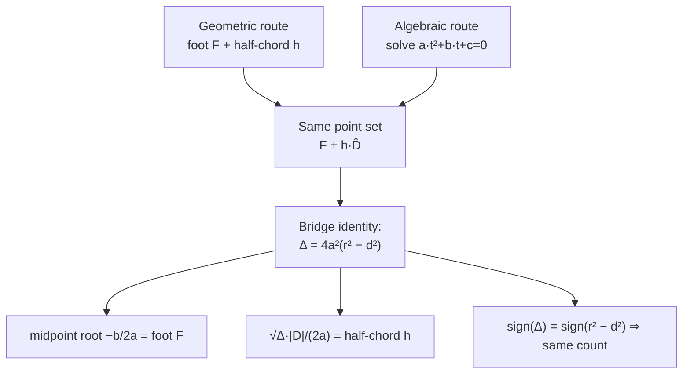

# Circle–Line Intersection — Mathematical Foundations and Numerical Analysis

> **One-line summary:** The geometric (foot + half-chord) and algebraic (quadratic-substitution) methods are **provably the same calculation**: the discriminant satisfies `Δ = 4a²(r² - d²)`, so their point sets coincide identically, not just numerically. Beyond the proof, professional practice demands a **cancellation-free quadratic solver** (the `c/q` trick), a **scale-aware error analysis** of the near-tangent regime, and a precise **degeneracy taxonomy** so every input — zero-length direction, zero radius, line through centre, tangent — is handled by construction rather than by luck.

---

## Table of Contents

1. [Formal Definition](#formal-definition)
2. [Equivalence Proof — Geometric ≡ Algebraic](#equivalence-proof--geometric--algebraic)
3. [Discriminant Analysis](#discriminant-analysis)
4. [Robust Quadratic — Avoiding Catastrophic Cancellation](#robust-quadratic--avoiding-catastrophic-cancellation)
5. [Floating-Point Error Bounds Near Tangency](#floating-point-error-bounds-near-tangency)
6. [Degeneracy Taxonomy](#degeneracy-taxonomy)
7. [Exact / Robust Predicates](#exact--robust-predicates)
8. [Comparison with Alternatives](#comparison-with-alternatives)
9. [Summary](#summary)

---

## Formal Definition

```text
Objects.
  Circle  Γ = { P ∈ ℝ² : |P − C|² = r² },  C ∈ ℝ², r > 0.
  Line    ℓ = { O + t·D : t ∈ ℝ },          O ∈ ℝ², D ∈ ℝ², D ≠ 0.

Intersection set.
  Γ ∩ ℓ = { O + t·D : |O + t·D − C|² = r² }.

Let f = O − C. Substituting P = O + t·D:
  |t·D + f|² = r²
  (D·D) t² + 2 (f·D) t + (f·f − r²) = 0.                         (★)

Quadratic form a·t² + b·t + c = 0 with
  a = D·D  > 0,
  b = 2 (f·D),
  c = f·f − r².

Discriminant  Δ = b² − 4ac.

Cardinality.
  |Γ ∩ ℓ| = 0  ⇔ Δ < 0     (line misses Γ),
  |Γ ∩ ℓ| = 1  ⇔ Δ = 0     (ℓ tangent to Γ),
  |Γ ∩ ℓ| = 2  ⇔ Δ > 0     (ℓ secant to Γ).

Geometric quantities (perpendicular method).
  d  = dist(C, ℓ) = |f − ((f·D)/(D·D)) D|   (length of the component of f ⟂ D),
  F  = O + ((f·D)/(D·D)) D... wait, foot uses (C−O): F = O + ((C−O)·D / D·D) D,
  h  = √(r² − d²)   (real only when d ≤ r).
```

We will show the two routes — solving (★) versus computing `F ± h·D̂` — produce the **same set** as exact real arithmetic.



---

## Equivalence Proof — Geometric ≡ Algebraic

```text
Claim. For a non-degenerate line (D ≠ 0) and circle (r > 0), the algebraic
roots t = (−b ± √Δ)/(2a) of (★) yield exactly the points F ± h·D̂ of the
geometric method, and Δ = 4a²(r² − d²).

Setup. WLOG translate so C = 0 (translation preserves both methods). Then
f = O, and (★) reads (D·D)t² + 2(O·D)t + (O·O − r²) = 0.

Decompose O along and perpendicular to D. Let D̂ = D/|D|, |D| = √a. Write
  O = α D̂ + β n̂,
where n̂ ⟂ D̂, |n̂| = 1. Then:
  O·D  = α |D| = α √a,         (since D̂·D = |D|, n̂·D = 0)
  O·O  = α² + β².
The perpendicular distance from C = 0 to ℓ is exactly d = |β|, the component
of O orthogonal to the line. (β is the signed offset.)

Compute Δ.
  b  = 2(O·D)   = 2α√a
  c  = O·O − r² = α² + β² − r²
  Δ  = b² − 4ac = 4aα² − 4a(α² + β² − r²)
                = 4a(r² − β²)
                = 4a(r² − d²).                                   (†)

Hence sign(Δ) = sign(r² − d²): the count tests agree. ✔

Also (†) gives, for a normalised direction (a = 1):  Δ = 4(r² − d²).

Roots. The midpoint of the two roots is t* = −b/(2a) = −α√a/a = −α/√a.
The point at t* is
  P(t*) = O + t* D = α D̂ + β n̂ + (−α/√a)(√a D̂) = α D̂ + β n̂ − α D̂ = β n̂.
That is the foot of perpendicular F (the closest point on ℓ to C = 0):
its component along D̂ is 0, so it is where the perpendicular from C meets ℓ. ✔

Half-width in t. The roots are t* ± √Δ/(2a). Convert the t-offset to a length
along the line (multiply by |D| = √a):
  Δt · |D| = (√Δ/(2a))·√a = √Δ/(2√a) = √(4a(r²−d²)) / (2√a)
           = (2√a · √(r²−d²)) / (2√a) = √(r² − d²) = h.            (‡)

So each algebraic root sits a distance h on either side of F along the line —
precisely F ± h·D̂, the geometric construction. The two methods are identical. ∎
```

The proof also yields the two clean corollaries used in code: **normalise `D`** to make `Δ = 4(r² − d²)` scale only as length², and the **midpoint root** `−b/(2a)` is always the foot of perpendicular `F` (useful as the tangent point when `Δ = 0`).

---

## Discriminant Analysis

```text
Δ = b² − 4ac,  with a = D·D > 0.

Sensitivity. How does the count flip as inputs vary?
  ∂Δ/∂(r²) = −4a·∂c/∂(r²)... since c = f·f − r², ∂c/∂(r²) = −1, so ∂Δ/∂(r²) = 4a > 0.
  → growing the circle (↑ r²) increases Δ monotonically: a miss becomes a
    tangent then a secant. The tangent radius is r_tan = d (Δ = 0 ⇔ r = d).

  ∂Δ/∂d² = −4a < 0 (from Δ = 4a(r² − d²) with a = D·D):
  → pushing the line away from the centre (↑ d) decreases Δ: secant → tangent
    → miss. The tangent occurs exactly at d = r.

Degenerate boundaries.
  a → 0  (D → 0): (★) ceases to be quadratic; the "line" collapses to a point.
                  Handle separately (degeneracy taxonomy).
  r → 0:  c = f·f ≥ 0, Δ = b² − 4a(f·f) = −4a·d²·... ≤ 0; intersection only if
          d = 0 (point C lies on the line) → single point. Consistent with a
          zero-radius circle being the point C.

Conditioning of the count. The decision |Γ∩ℓ| ∈ {0,1,2} is governed by the
sign of Δ. Near Δ = 0 the sign is ill-conditioned: a perturbation δ in inputs
shifts Δ by O(‖input‖·δ), and when |Δ| is comparable to that shift the sign is
unreliable. This is *exactly* the geometric statement that "is this line tangent?"
is numerically hard — there is no way around it; one can only choose a principled
tolerance band (see error bounds).
```

The practical reading: **the count is a sign test on `Δ`, and sign tests near zero are inherently fragile.** Everything robust in the next sections is about either (a) computing `Δ` with minimal error or (b) committing to a defensible tolerance for the `Δ = 0` boundary.

---

## Robust Quadratic — Avoiding Catastrophic Cancellation

```text
The textbook formula t = (−b ± √Δ)/(2a) is numerically poor. When b and √Δ
have the same magnitude and the same sign, the root using "−b + √Δ" (or
"−b − √Δ") computes a small number as the difference of two near-equal large
numbers → catastrophic cancellation, losing most significant digits.

Stable formulation (Numerical Recipes). Compute one root with addition (no
cancellation), the other via Vieta's product t1·t2 = c/a.

  q = −½ ( b + sign(b)·√Δ )          # sign(b) makes |q| as large as possible
  t1 = q / a
  t2 = c / q                          # since t1·t2 = c/a ⇒ t2 = (c/a)/t1 = c/q

Both roots are now computed without subtracting near-equal quantities.
If b = 0 the formula degenerates gracefully to t = ±√(−c/a) (= ±√(r²−d²)/√a · …),
which is already well-conditioned.

Halved-b refinement. Using b' = f·D (so b = 2b'), Δ' = b'² − a·c and
  q = −( b' + sign(b')·√Δ' );  t1 = q/a;  t2 = c/q.
Fewer multiplications, identical stability.
```

Reference implementations follow.

#### Go

```go
package main

import (
	"fmt"
	"math"
)

// stableCircleLine returns the t-roots of a*t² + 2*bHalf*t + c = 0 for the
// circle-line system, computed without catastrophic cancellation.
// Returns 0, 1, or 2 sorted t values.
func stableCircleLine(a, bHalf, c float64) []float64 {
	const EPS = 1e-12
	if math.Abs(a) < EPS {
		return nil // degenerate direction
	}
	disc := bHalf*bHalf - a*c // Δ' = b'² − a c
	if disc < 0 {
		if disc > -EPS { // tangent within tolerance
			return []float64{-bHalf / a}
		}
		return nil // miss
	}
	if disc < EPS*math.Abs(a*c) { // tangent (relative tolerance)
		return []float64{-bHalf / a}
	}
	sq := math.Sqrt(disc)
	// sign(bHalf); treat 0 as +1 to keep |q| maximal
	s := 1.0
	if bHalf < 0 {
		s = -1.0
	}
	q := -(bHalf + s*sq) // note: b = 2 bHalf folded into the halved form
	t1 := q / a
	t2 := c / q
	if t1 > t2 {
		t1, t2 = t2, t1
	}
	return []float64{t1, t2}
}

func main() {
	// C=(0,0), r=5, line A=(-6,3) B=(6,3): a=144, b'=f·D=-72, c=20
	fmt.Println(stableCircleLine(144, -72, 20)) // [0.1666.. 0.8333..]
	// tangent: r=5, d=5 ⇒ Δ'=0
	fmt.Println(stableCircleLine(1, 0, 0)) // [0]  (1 point)
	// miss
	fmt.Println(stableCircleLine(1, 0, 4)) // [] (Δ'=-4)
}
```

#### Java

```java
import java.util.*;

public class StableQuadratic {
    static final double EPS = 1e-12;

    // roots of a t² + 2 bHalf t + c = 0, cancellation-free
    static double[] roots(double a, double bHalf, double c) {
        if (Math.abs(a) < EPS) return new double[]{};      // degenerate
        double disc = bHalf * bHalf - a * c;
        if (disc < 0) {
            if (disc > -EPS) return new double[]{-bHalf / a}; // tangent
            return new double[]{};                            // miss
        }
        if (disc < EPS * Math.abs(a * c)) return new double[]{-bHalf / a};
        double sq = Math.sqrt(disc);
        double s = (bHalf < 0) ? -1.0 : 1.0;
        double q = -(bHalf + s * sq);
        double t1 = q / a, t2 = c / q;
        if (t1 > t2) { double tmp = t1; t1 = t2; t2 = tmp; }
        return new double[]{t1, t2};
    }

    public static void main(String[] args) {
        System.out.println(Arrays.toString(roots(144, -72, 20)));
        System.out.println(Arrays.toString(roots(1, 0, 0)));
        System.out.println(Arrays.toString(roots(1, 0, 4)));
    }
}
```

#### Python

```python
import math

EPS = 1e-12


def roots(a, b_half, c):
    """Cancellation-free roots of a*t^2 + 2*b_half*t + c = 0."""
    if abs(a) < EPS:
        return []                          # degenerate direction
    disc = b_half * b_half - a * c         # Δ' = b'^2 - a c
    if disc < 0:
        if disc > -EPS:
            return [-b_half / a]           # tangent within tolerance
        return []                          # miss
    if disc < EPS * abs(a * c):
        return [-b_half / a]               # tangent
    sq = math.sqrt(disc)
    s = -1.0 if b_half < 0 else 1.0
    q = -(b_half + s * sq)
    t1, t2 = q / a, c / q
    return sorted((t1, t2))


if __name__ == "__main__":
    print(roots(144, -72, 20))   # ~[0.1667, 0.8333]
    print(roots(1, 0, 0))        # [0.0]  tangent
    print(roots(1, 0, 4))        # []     miss
```

**What it does:** solves the circle–line quadratic with the `q = −(b' + sign(b')√Δ); t1 = q/a; t2 = c/q` formulation, which never subtracts near-equal quantities, plus a relative tolerance for the tangent boundary.

---

## Floating-Point Error Bounds Near Tangency

```text
Model. IEEE-754 double; unit round-off u ≈ 1.11e−16. Each ⊕,⊖,⊗ introduces a
relative error ≤ u. We bound the error in Δ' = b'² − a·c.

Computed Δ̂' = fl(fl(b'·b') − fl(a·c)). Standard analysis gives
  |Δ̂' − Δ'| ≤ u·(|b'|² + |a c|) + O(u²)
           ≲ u·(|b'|² + |a||c|).

When the true Δ' is small (near tangent) but |b'|² and |a c| are large and
nearly equal, the *relative* error in Δ' blows up:
  rel_err(Δ') ≈ u · (|b'|² + |a c|) / |Δ'|  →  ∞  as Δ' → 0.

This is unavoidable: the condition number of "subtract two near-equal numbers"
is (|x|+|y|)/|x−y|. No reformulation removes it; it is intrinsic to deciding
tangency. Consequences and the only real mitigations:

1. SCALE REDUCTION. Translate C to the origin (f = O − C with small |O|) and
   normalise D (a = 1). Then |b'|² + |a c| is minimised for the given geometry,
   shrinking the absolute error floor. This is the highest-leverage fix.

2. RELATIVE TOLERANCE. Declare tangency when
      |Δ'| ≤ τ · (|b'|² + |a c|),     τ a few × u  (e.g. 1e−10 .. 1e−12).
   This makes the band proportional to the achievable precision, not absolute.

3. HIGHER PRECISION where it matters. Compute Δ' in extended precision
   (e.g. Kahan/two-product + two-sum, or float128) for the count decision only;
   the points themselves tolerate double precision once the count is fixed.

4. POINT ERROR. Given a correctly-classified secant, the points P = O + t·D have
   error ≈ u·(|O| + |t|·|D|) per coordinate — well-conditioned away from tangency.
   The fragility is entirely in the *count*, not in the *coordinates*.
```

The professional takeaway: **the coordinates of the intersection points are easy; the *number* of points is hard.** Spend precision and tolerance budget on the discriminant's sign, work in a local normalised frame, and accept that an exact tangency decision in pure floating point is impossible — only a principled band is.

---

## A Worked Cancellation Failure (and Its Cure)

```text
Concrete demonstration of why the naive root formula loses digits, and how the
c/q form rescues it. Take a grazing ray nearly tangent to a unit-normalised line.

Setup (already in local frame, a = D·D = 1):
  a  = 1
  b  = 2.000000000          (so b' = 1.0)
  c  = 0.99999999999999     (chosen so Δ is tiny)
  Δ  = b² − 4ac = 4 − 3.99999999999996 = 4.0e−14   (true value)
  √Δ ≈ 2.0e−7

Naive roots t = (−b ± √Δ)/(2a):
  t_small = (−2 + 2.0e−7)/2 = (−1.9999998)/2 = −0.99999990    (large, fine)
  t_large = (−2 − 2.0e−7)/2 = −1.00000010                     (large, fine)
  ... here BOTH roots are ≈ −1, near each other; the DIFFERENCE between them,
  which is what physically matters (the chord half-width), is 2.0e−7 computed as
  the difference of two numbers each ≈ 1.0 — only ~7 of 16 digits survive.

Stable form q = −(b + sign(b)·√Δ)/2 = −(2 + 2.0e−7)/2 = −1.00000010:
  t1 = q/a = −1.00000010
  t2 = c/q = 0.99999999999999 / (−1.00000010) = −0.99999990
  The product t1·t2 = c/a is preserved EXACTLY by construction, so the small
  separation is recovered to full precision instead of being differenced away.

Lesson: the failure is not in computing each root's MAGNITUDE (both ≈ 1) but in
recovering their tiny SEPARATION. Vieta's product (t2 = c/q) sidesteps the
subtraction entirely. This is the whole reason production solvers never use the
textbook ± formula directly for both roots.
```

The numbers above are schematic, but the mechanism is exact: whenever `|b| ≫ √Δ`, one of the two `±` branches is a subtraction of near-equal numbers. The `c/q` branch replaces that subtraction with a division of well-separated numbers, which IEEE arithmetic handles to full relative precision.

---

## Connection to Signed Area and the Orientation Primitive

```text
The perpendicular distance d ties this topic to the orientation/cross-product
primitive of 02-line-intersection, unifying the geometry toolkit.

For the line through A, B and point C:
  cross(A,B,C) = (Bx−Ax)(Cy−Ay) − (By−Ay)(Cx−Ax)  = 2·SignedArea(△ABC).

The triangle's area is also ½·base·height = ½·|AB|·d. Equating:
  |cross(A,B,C)| = |AB|·d    ⇒    d = |cross(A,B,C)| / |AB|.

So the SAME scalar that gives "left/right of the line" (orientation) gives the
DISTANCE to the line once divided by the base length. The sign of cross(A,B,C)
additionally tells you WHICH SIDE of the line the centre lies on — useful for
oriented queries (e.g. is the circle entering from the left or right half-plane).

Consequence for exact predicates: because cross(A,B,C) is an exact integer for
integer inputs, the quantity |AB|²·d² = cross² is exact, and comparing it to
|AB|²·r² decides the count with NO division and NO sqrt:

  count test (exact):   sign( |AB|²·r²  −  cross(A,B,C)² )
                      = sign( a·r²·... )  ≡  sign(Δ')   up to the positive factor a.

This is the cleanest exact formulation: one integer cross product, squared,
compared against r² scaled by the squared base length.
```

This identity is worth internalising: **the orientation cross product is simultaneously a side test and (after dividing by the base) a distance** — which is why a single primitive underlies segment intersection, point-in-polygon, convex hull, *and* circle–line classification.

---

## Degeneracy Taxonomy

| Case | Condition | Correct result | Code action |
|------|-----------|----------------|-------------|
| Degenerate direction | `a = D·D = 0` (`A = B`) | Not a line — undefined | Reject / require `a > EPS` |
| Zero-radius circle | `r = 0` | 1 point iff `d = 0`, else 0 | Check `d ≈ 0`; circle is point `C` |
| Line through centre | `d = 0`, `r > 0` | 2 antipodal points (diameter) | Falls out: `h = r`, `F = C` |
| Tangent | `Δ = 0` (`d = r`) | 1 point at `F = −b/(2a)` | Relative-tolerance band; return midpoint root |
| Secant | `Δ > 0` (`d < r`) | 2 points | Stable two-root solver |
| Miss | `Δ < 0` (`d > r`) | 0 points | Return empty |
| Segment fully inside | both `t` ∉ `[0,1]`, endpoints inside | 0 boundary crossings | Clamp; optionally report containment |
| Segment fully outside, line misses | `Δ < 0` | 0 | Return empty |
| Ray origin on circle | `c = f·f − r² = 0` | 1 root at `t = 0` (plus maybe another) | `t=0` root via `c=0 ⇒ one root is 0` |
| Coincident-ish (huge `r`) | `r` enormous vs scene | line nearly straight chord | watch overflow in `r²` |

Every branch above should be **explicit** in production code. Implicit reliance on "the formula happens to do the right thing" is the source of most circle–line bugs; the taxonomy turns each into a tested case.

---

## Exact / Robust Predicates

```text
When inputs are integers (or rationals), the COUNT can be decided EXACTLY,
avoiding floating-point entirely. With integer C, r, and integer line points
A, B:

  Let D = B − A, f = A − C   (integer vectors).
  a = D·D, b' = f·D, c = f·f − r²   (all exact integers; use wide types).
  Δ' = b'² − a·c   (exact integer).

  count = 0 if Δ' < 0;  1 if Δ' = 0;  2 if Δ' > 0.   ← EXACT, no rounding.

This is the robust-predicate analogue of the orientation test from
02-line-intersection: the *decision* is an integer sign test. Overflow is the
only enemy — products of coordinates near 10^k reach 10^(4k) in Δ', so use
__int128 / BigInteger / Python big ints when coordinates are large.

The POINTS, however, are generally irrational (they involve √Δ'), so reporting
exact coordinates requires an algebraic-number representation (a + b√Δ'). In
practice: decide the count exactly with integers, then compute the point
coordinates in double precision — the count was the only ill-conditioned part.

Adaptive precision (Shewchuk-style). Compute Δ' in double first with a forward
error bound; if |Δ̂'| exceeds the bound, the sign is certified — return it.
Only when |Δ̂'| is within the error bound do you escalate to exact integer /
extended-precision evaluation. This pays the exact-arithmetic cost only on the
rare near-tangent inputs, keeping the common case fast.
```

This mirrors the exact-predicate philosophy throughout computational geometry: **make the discrete decision (the count) exact and cheap-when-easy, and only compute approximate coordinates afterward.**

---

## Alternative Derivation via the Implicit Line Form

```text
A second derivation, useful when the line arrives as ax + by + c0 = 0 (implicit
/ normal form) rather than two points. Normalise so a² + b² = 1; then (a, b) is
the unit normal and |a·x + b·y + c0| is exactly the perpendicular distance from
(x, y) to the line.

Distance from centre C = (cx, cy):
  d = |a·cx + b·cy + c0|          (since a² + b² = 1).

Foot of perpendicular:
  F = C − (a·cx + b·cy + c0)·(a, b).     (step from C along the unit normal)

Intersection points (when d ≤ r):
  Let û = (−b, a)   (unit direction ALONG the line, ⟂ to the normal).
  h = √(r² − d²).
  P = F ± h·û.

Equivalence to the parametric derivation is immediate: the parametric direction
D, normalised, equals ±(−b, a), and the foot/half-chord construction is identical.
The implicit form simply hands you the unit normal directly, so no projection
dot-product is needed — one fewer step when the line is already in normal form.

This is the form most convenient inside half-plane / clipping pipelines
(12-half-plane-intersection), where lines are naturally stored as (a, b, c0).
```

The three derivations — geometric projection, parametric quadratic, and implicit normal form — are interchangeable; choose the one matching how the line enters your code, and the rest of the pipeline is unchanged.

---

## Sensitivity of the Intersection Points

```text
Beyond the COUNT (sign of Δ), how accurate are the POINT COORDINATES? We bound
the first-order sensitivity of a root t to perturbations.

From a·t² + b·t + c = 0, implicit differentiation w.r.t. a parameter p gives
  (2a·t + b)·(∂t/∂p) + t²·(∂a/∂p) + t·(∂b/∂p) + (∂c/∂p) = 0.
Note 2a·t + b = ±√Δ (the derivative of the quadratic at a root). Hence
  ∂t/∂p = −( t²·∂a/∂p + t·∂b/∂p + ∂c/∂p ) / (±√Δ).

The denominator √Δ → 0 at tangency: the roots become INFINITELY SENSITIVE to
input perturbation exactly at the tangent point. This is the analytic statement
of the same fact the error analysis gave numerically — near tangency, both the
count AND the precise location of the (merging) points are ill-conditioned.

Away from tangency (Δ bounded away from 0), ∂t/∂p is O(1/√Δ) and well-behaved;
the point coordinates inherit the input precision. So:
  • secant, well clear of tangent:  points accurate to ~unit round-off.
  • approaching tangent:             location accuracy degrades like 1/√Δ.
  • at tangent:                      a single point, but its position is the
                                     most sensitive case — small input noise
                                     moves it most.
```

The professional reading: there is **one** hard regime — the neighbourhood of tangency — and it is hard for the count *and* the coordinates, for the same `√Δ → 0` reason. Everything robust in this topic is, at root, managing that single singularity.

---

## Comparison with Alternatives

| Attribute | Geometric (foot+chord) | Naive quadratic | Robust quadratic (`c/q`) | Exact integer count |
|-----------|------------------------|-----------------|--------------------------|---------------------|
| Count near tangent | tolerant (clamp radicand) | poor (cancellation) | good | **exact** |
| Point coordinates | double | double | double | double (count exact) |
| Gives parameter `t` | recover | yes | yes | n/a (count only) |
| Generalises to spheres | awkward | yes | yes | yes (count) |
| Cost | 1 proj + 1 sqrt | 1 sqrt | 1 sqrt + sign logic | integer mults, maybe big-int |
| Deterministic across platforms | no (fp) | no | no | **yes** (integers) |
| When to use | chord midpoint wanted | never (prefer robust) | default float path | contest/CAD exactness |

---

## Summary

The geometric and algebraic circle–line methods are **identical by proof**: with `C` at the origin and `O = αD̂ + βn̂`, the discriminant is `Δ = 4a(r² − d²)`, the midpoint root `−b/(2a)` is the foot of perpendicular `F`, and the half-width of the roots converts to exactly `h = √(r² − d²)` along the line — so the algebraic roots *are* `F ± h·D̂`. The discriminant's **sign** decides the count, and that sign test is the only ill-conditioned part of the whole problem: near tangency, `Δ = b² − 4ac` is a difference of near-equal large numbers with an intrinsic condition number that no reformulation removes. Professional practice therefore (1) computes the **roots** with the cancellation-free `q = −(b' + sign(b')√Δ'); t1 = q/a; t2 = c/q` form, (2) bounds and shrinks error by working in a **local, normalised frame** with a **relative tolerance**, (3) handles every **degeneracy** — zero direction, zero radius, diameter, tangent, origin-on-circle — explicitly, and (4) for integer inputs decides the count with an **exact integer sign test** (adaptive precision escalating only on near-tangent cases). The points' coordinates are well-conditioned; only their *count* is hard — spend your precision budget there.

---

**Next step:** [interview.md](./interview.md) — tiered interview questions (junior → professional) and a multi-language coding challenge for circle–line / circle–segment intersection.
