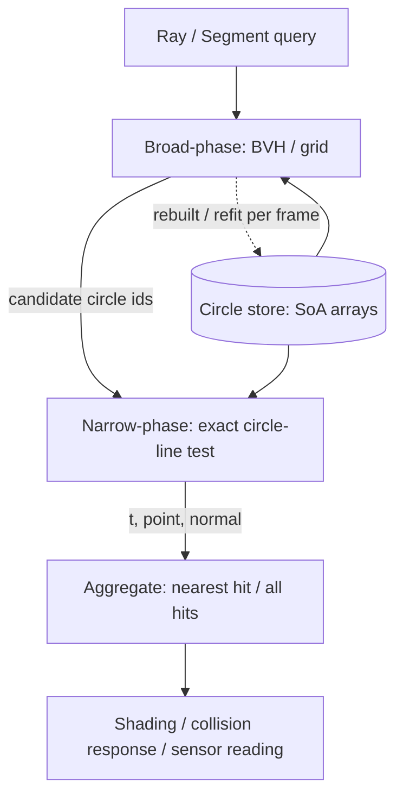
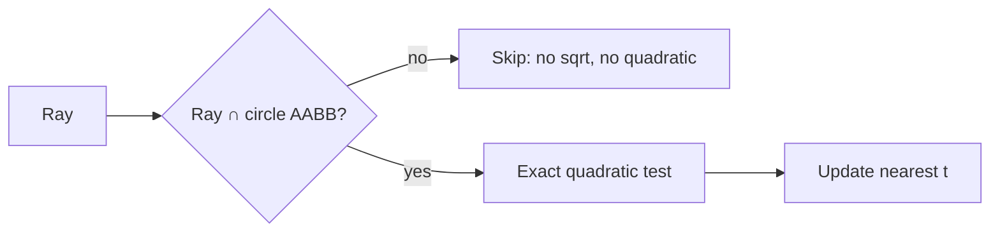

# Circle–Line Intersection — Senior Level

> **One-line summary:** A single circle–line test is `O(1)`; the engineering problem is doing it **millions of times per frame** against **thousands of circles**, robustly, in a ray-tracer, physics engine, or robotics sensor pipeline. Senior work is about the surrounding system: a **broad-phase** that cuts `n` before the exact test ever runs, **batch/SIMD** layouts that amortise the arithmetic, **numerical stability** that survives near-tangent inputs at scale, and a clear **failure-mode** catalogue.

---

## Table of Contents

1. [Introduction](#introduction)
2. [System Design with Circle–Line Intersection](#system-design-with-circle-line-intersection)
3. [Ray Tracing: the Nearest-Hit Pipeline](#ray-tracing-the-nearest-hit-pipeline)
4. [Collision Systems: Circle vs Walls](#collision-systems-circle-vs-walls)
5. [Broad-Phase and Spatial Acceleration](#broad-phase-and-spatial-acceleration)
6. [Comparison with Alternatives](#comparison-with-alternatives)
7. [Batch / SIMD and Data Layout](#batch--simd-and-data-layout)
8. [Code Examples](#code-examples)
9. [Numerical Stability at Scale](#numerical-stability-at-scale)
10. [Observability](#observability)
11. [Failure Modes](#failure-modes)
12. [Summary](#summary)

---

## Introduction

> Focus: "How do I architect systems around this primitive?"

The circle–line test you wrote at the junior and middle levels is correct and constant-time. Yet in a real system it is buried inside a loop that may execute **hundreds of millions** of times per second:

- A path-tracer firing 4 samples × 1080p ≈ 8M primary rays per frame, each bouncing several times, each bounce testing many round objects.
- A 2-D physics engine sweeping thousands of circular bodies against a polygon world, every fixed timestep.
- A LiDAR/sonar simulator casting hundreds of beams against cylindrical obstacles, at sensor frame rate.

At that volume, three things dominate the senior conversation, and **none of them is the formula itself**:

1. **Cut `n`.** Most circles are nowhere near a given ray. A broad-phase (BVH, grid, sweep) rejects them in bulk so the exact test runs only on plausible candidates.
2. **Make each test cheap and cache-friendly.** Structure-of-arrays layout, branch-light code, and SIMD let one instruction test four or eight circles at once.
3. **Stay correct under stress.** Near-tangent rays, rays starting *inside* a circle, degenerate (zero-length) directions, and accumulated floating-point error must not produce flicker, tunnelling, or NaN.

This file treats circle–line intersection as a *service* the rest of the engine consumes, with latency budgets, throughput targets, and failure modes — the senior framing.

---

## System Design with Circle–Line Intersection



The intersection primitive is the **narrow-phase**. Around it sit:

- A **scene store** holding circle data in cache-friendly arrays (centres, radii) — not an array of objects with scattered fields.
- A **broad-phase index** (BVH/grid) that maps a query to a short candidate list.
- An **aggregator** that turns raw hits into the answer the caller wants: nearest `t` (ray tracing), all hits (CSG/booleans), or the earliest time-of-impact (continuous collision).

This separation is the key senior insight: the *formula* is fixed and tiny; the *system* around it is where latency, throughput, and correctness are won or lost.

---

## Ray Tracing: the Nearest-Hit Pipeline

A primary ray `R(t) = O + t·D` (with `t >= 0`) must find the **closest** surface it hits. For each candidate circle/sphere:

1. Solve the quadratic (middle level), get roots `t1 <= t2`.
2. Discard if `t2 < t_near` (entirely behind the ray's current segment).
3. The entry hit is `t1` if `t1 >= t_near`, else `t2` (origin inside the circle).
4. Keep the smallest valid `t` across all candidates — that is the visible surface.
5. Compute the **normal** `N = (R(t) - C)/r` for shading; flip it if the ray came from inside (refraction/transmission).

Two senior details:

- **`t_near` / `t_far` bounds.** Carry an interval; shrink `t_far` to the best hit so far, so later candidates self-reject quickly. This is the single biggest constant-factor win after the broad-phase.
- **Self-intersection / shadow acne.** A reflected/shadow ray launched from a surface can immediately "hit" the very circle it left, at `t ≈ 0`, due to round-off. Offset the origin along the normal by a small epsilon, or use a `t_min = ε` lower bound, to suppress it. This is a classic correctness bug that only shows up at scale.

---

## Collision Systems: Circle vs Walls

In a physics engine, a moving circular body (radius `r`) against a static line wall reduces *directly* to circle–line distance:

- **Static overlap:** the body overlaps the wall iff the distance from its centre to the wall's line is `< r` **and** the foot of perpendicular lies on the wall segment (clamp the foot's parameter to `[0,1]`; otherwise test the nearer endpoint).
- **Continuous collision (CCD):** a body moving from `C0` to `C1` over a timestep traces a segment for its centre. Inflate the wall by `r` (Minkowski sum with a disc — see `10-minkowski-sum`) and intersect the centre's **swept segment** with the inflated wall. The earliest `t ∈ [0,1]` is the **time of impact**; this prevents fast bodies **tunnelling** through thin walls.
- **Response normal:** the contact normal is the wall normal (for a face hit) or `(C - endpoint)/|C - endpoint|` (for a corner hit). Resolve penetration along it.

So the same `r² - d²` / discriminant machinery powers both "are we touching now?" and "when will we touch?" — the difference is whether the centre is a point or a moving segment.

---

## Broad-Phase and Spatial Acceleration

Testing a ray against **every** circle is `O(n)` per ray and `O(n·rays)` per frame — unacceptable for large scenes. The broad-phase reduces candidates to `O(log n)` (tree) or `O(1)` expected (uniform grid) before the exact test.

| Structure | Build | Query (ray) | Best when |
|-----------|-------|-------------|-----------|
| **Uniform grid** | `O(n)` | `O(1)` expected per cell, DDA-traversed | uniform circle sizes, bounded world |
| **BVH (AABB tree)** | `O(n log n)` | `O(log n)` typical | varied sizes, mostly static scene, ray tracing |
| **Sweep-and-prune** | `O(n log n)` sort, `O(n)` resort | — | many moving bodies, temporal coherence (physics) |
| **k-d tree** | `O(n log n)` | `O(log n)` | static point/AABB sets; see `04-kd-tree` |

Each circle gets an **AABB** of `[cx-r, cx+r] × [cy-r, cy+r]`. The broad-phase first does the cheap **ray-vs-AABB** slab test; only circles whose box the ray pierces reach the exact circle test. Because ray-vs-AABB is branch-light and SIMD-friendly, this filter is far cheaper than the quadratic and removes the vast majority of candidates.



---

## Robotics and Sensor Simulation

A third major consumer is **range sensing**: LiDAR, sonar, and simulated depth cameras cast beams and report the distance to the first obstacle. When obstacles are modelled as discs (cylindrical pillars seen from above, circular footprints of robots), each beam is a **ray vs circle** query whose answer is the nearest `t`, converted to a range reading.

```mermaid
graph TD
    Sensor[Range sensor pose] --> Beams[Fan of N beams O+t·Dᵢ]
    Beams --> BP[Broad-phase over disc obstacles]
    BP --> NP[Ray ∩ circle: nearest t per beam]
    NP --> Range[Range reading rᵢ = t·|D|]
    Range --> SLAM[SLAM / occupancy grid / planner]
```

Senior considerations specific to sensing:

- **Beam coherence.** Adjacent beams in a fan hit nearly the same obstacles. Reuse the previous beam's candidate set as a warm start; the broad-phase query for beam `i+1` rarely differs much from beam `i`.
- **Max range clamp.** A real sensor has a maximum range `t_max`. Carry it as the initial `t_far` so any circle beyond it is culled for free.
- **Noise modelling.** Simulators add Gaussian noise to `t` *after* the exact hit. Keep the exact computation deterministic and inject noise as a separate, seedable stage so tests stay reproducible.
- **Grazing readings.** A near-tangent beam produces an unstable range (it may report "hit at the edge" or "miss"). Real sensors behave the same way, so a small tangent band that occasionally drops the reading is physically faithful — but document it.

This is the same `O(1)` primitive again, wrapped to answer "how far until I hit something?" instead of "what colour is this pixel?"

---

## Comparison with Alternatives

| Attribute | Per-circle exact test | Uniform grid + exact | BVH + exact |
|-----------|----------------------|----------------------|-------------|
| Rays/sec (relative) | 1× (baseline) | 5–50× | 10–100× |
| Memory overhead | none | `O(cells)` | `O(n)` nodes |
| Build cost per frame | none | low (rehash) | medium (refit/rebuild) |
| Handles huge `n` | poorly | well (bounded world) | very well |
| Dynamic scenes | trivial | rebuild/rehash | refit or rebuild |
| Production usage | tiny scenes, prototypes | tile/voxel games | Embree, PBRT, game ray tracers |

**Choose per-circle** when `n` is small (a handful of obstacles) — the broad-phase overhead isn't worth it. **Choose a grid** for many similarly sized circles in a bounded arena. **Choose a BVH** for large, size-varied, mostly static scenes (offline rendering, RTX-style pipelines).

---

## Batch / SIMD and Data Layout

The exact test is arithmetic with **no data-dependent branches** until the final classification — ideal for SIMD. The two enablers:

1. **Structure-of-Arrays (SoA).** Store `cx[]`, `cy[]`, `r2[]` in parallel arrays, not an array of `Circle` structs. Then one SIMD load fetches four centres, and one `fma` lane-set computes four discriminants.
2. **Branchless classification.** Compute `disc` for all lanes, then mask: `hit = disc >= 0`. Use the mask to select roots; never branch per lane.

A 4-wide (SSE) or 8-wide (AVX) kernel tests 4–8 circles per iteration, often a 3–6× speedup over scalar after the broad-phase has already culled. The pattern: **broad-phase cuts `n`, SIMD speeds the survivors.** They compose; do both.

Memory matters as much as math: at these volumes the test is frequently **memory-bandwidth bound**, not compute bound. Packing `r²` (precomputed) instead of `r` saves a multiply per test and keeps the hot arrays small.

---

## Code Examples

### Thread-safe scene with broad-phase AABB cull + exact nearest-hit ray test

A read-mostly scene (built once, queried by many ray threads) uses a read-write lock; queries take the read lock so they run concurrently.

#### Go

```go
package main

import (
	"fmt"
	"math"
	"sync"
)

type Circle struct{ Cx, Cy, R float64 }

type Scene struct {
	mu      sync.RWMutex
	circles []Circle
}

func (s *Scene) Add(c Circle) {
	s.mu.Lock()
	defer s.mu.Unlock()
	s.circles = append(s.circles, c)
}

// NearestHit returns (t, index, ok) for the closest circle a ray O+t*D hits, t>=tMin.
func (s *Scene) NearestHit(ox, oy, dx, dy, tMin float64) (float64, int, bool) {
	s.mu.RLock()
	defer s.mu.RUnlock()

	bestT, bestI, found := math.Inf(1), -1, false
	for i := range s.circles {
		c := s.circles[i]
		// --- broad-phase: ray vs circle AABB slab test ---
		if !raySlab(ox, dx, c.Cx-c.R, c.Cx+c.R, tMin, bestT) ||
			!raySlab(oy, dy, c.Cy-c.R, c.Cy+c.R, tMin, bestT) {
			continue
		}
		// --- narrow-phase: exact quadratic ---
		fx, fy := ox-c.Cx, oy-c.Cy
		a := dx*dx + dy*dy
		bh := fx*dx + fy*dy
		cc := fx*fx + fy*fy - c.R*c.R
		disc := bh*bh - a*cc
		if disc < 0 {
			continue
		}
		sq := math.Sqrt(disc)
		t := (-bh - sq) / a
		if t < tMin {
			t = (-bh + sq) / a // origin inside: take the exit root
		}
		if t >= tMin && t < bestT {
			bestT, bestI, found = t, i, true
		}
	}
	return bestT, bestI, found
}

// raySlab clips ray axis (origin o, dir d) to [lo,hi]; returns whether [tMin,tMax] survives.
func raySlab(o, d, lo, hi, tMin, tMax float64) bool {
	if math.Abs(d) < 1e-12 {
		return o >= lo && o <= hi // parallel to slab: inside or never
	}
	t0, t1 := (lo-o)/d, (hi-o)/d
	if t0 > t1 {
		t0, t1 = t1, t0
	}
	return math.Max(t0, tMin) <= math.Min(t1, tMax)
}

func main() {
	s := &Scene{}
	s.Add(Circle{10, 0, 2})
	s.Add(Circle{4, 0, 1})
	s.Add(Circle{100, 50, 3}) // far off-axis: culled by broad-phase
	t, i, ok := s.NearestHit(0, 0, 1, 0, 1e-4)
	fmt.Printf("hit=%v t=%.3f circle=%d\n", ok, t, i) // nearest: circle 1 (x=4,r=1) at t=3
}
```

#### Java

```java
import java.util.*;
import java.util.concurrent.locks.*;

public class Scene {
    record Circle(double cx, double cy, double r) {}

    private final ReentrantReadWriteLock lock = new ReentrantReadWriteLock();
    private final List<Circle> circles = new ArrayList<>();

    public void add(Circle c) {
        lock.writeLock().lock();
        try { circles.add(c); } finally { lock.writeLock().unlock(); }
    }

    // returns {t, index} or null if no hit with t >= tMin
    public double[] nearestHit(double ox, double oy, double dx, double dy, double tMin) {
        lock.readLock().lock();
        try {
            double bestT = Double.POSITIVE_INFINITY; int bestI = -1;
            for (int i = 0; i < circles.size(); i++) {
                Circle c = circles.get(i);
                if (!raySlab(ox, dx, c.cx() - c.r(), c.cx() + c.r(), tMin, bestT) ||
                    !raySlab(oy, dy, c.cy() - c.r(), c.cy() + c.r(), tMin, bestT)) continue;
                double fx = ox - c.cx(), fy = oy - c.cy();
                double a = dx*dx + dy*dy;
                double bh = fx*dx + fy*dy;
                double cc = fx*fx + fy*fy - c.r()*c.r();
                double disc = bh*bh - a*cc;
                if (disc < 0) continue;
                double sq = Math.sqrt(disc);
                double t = (-bh - sq) / a;
                if (t < tMin) t = (-bh + sq) / a;
                if (t >= tMin && t < bestT) { bestT = t; bestI = i; }
            }
            return bestI < 0 ? null : new double[]{bestT, bestI};
        } finally { lock.readLock().unlock(); }
    }

    static boolean raySlab(double o, double d, double lo, double hi, double tMin, double tMax) {
        if (Math.abs(d) < 1e-12) return o >= lo && o <= hi;
        double t0 = (lo - o) / d, t1 = (hi - o) / d;
        if (t0 > t1) { double tmp = t0; t0 = t1; t1 = tmp; }
        return Math.max(t0, tMin) <= Math.min(t1, tMax);
    }

    public static void main(String[] args) {
        Scene s = new Scene();
        s.add(new Circle(10, 0, 2));
        s.add(new Circle(4, 0, 1));
        s.add(new Circle(100, 50, 3));
        double[] hit = s.nearestHit(0, 0, 1, 0, 1e-4);
        System.out.println(hit == null ? "miss" : ("t=" + hit[0] + " circle=" + (int) hit[1]));
    }
}
```

#### Python

```python
import math
import threading


class Scene:
    def __init__(self):
        self._lock = threading.RLock()
        self._circles = []   # list of (cx, cy, r)

    def add(self, c):
        with self._lock:
            self._circles.append(c)

    def nearest_hit(self, ox, oy, dx, dy, t_min):
        with self._lock:
            best_t, best_i = math.inf, -1
            for i, (cx, cy, r) in enumerate(self._circles):
                if not _ray_slab(ox, dx, cx - r, cx + r, t_min, best_t) or \
                   not _ray_slab(oy, dy, cy - r, cy + r, t_min, best_t):
                    continue
                fx, fy = ox - cx, oy - cy
                a = dx * dx + dy * dy
                bh = fx * dx + fy * dy
                cc = fx * fx + fy * fy - r * r
                disc = bh * bh - a * cc
                if disc < 0:
                    continue
                sq = math.sqrt(disc)
                t = (-bh - sq) / a
                if t < t_min:
                    t = (-bh + sq) / a   # origin inside → exit root
                if t_min <= t < best_t:
                    best_t, best_i = t, i
            return (best_t, best_i) if best_i >= 0 else None


def _ray_slab(o, d, lo, hi, t_min, t_max):
    if abs(d) < 1e-12:
        return lo <= o <= hi
    t0, t1 = (lo - o) / d, (hi - o) / d
    if t0 > t1:
        t0, t1 = t1, t0
    return max(t0, t_min) <= min(t1, t_max)


if __name__ == "__main__":
    s = Scene()
    s.add((10, 0, 2)); s.add((4, 0, 1)); s.add((100, 50, 3))
    print(s.nearest_hit(0, 0, 1, 0, 1e-4))   # (3.0, 1)
```

**What it does:** a concurrent scene whose ray query first culls each circle by a cheap ray-vs-AABB slab test, then runs the exact quadratic only on survivors, tracking the nearest hit (including the origin-inside exit-root case).
**Run:** `go run main.go` | `javac Scene.java && java Scene` | `python scene.py`

---

## Worked Example: Continuous Collision (Time of Impact)

The continuous-collision reduction is worth seeing in code: a moving circle (radius `rb`) against a static wall segment, returning the earliest time of impact `t ∈ [0,1]`. The trick is that a circle of radius `rb` hitting a segment is the same as the circle's **centre point** hitting the segment **inflated by `rb`** — and intersecting a point's swept segment with an inflated capsule reduces to circle–line tests against the wall's line and a circle–point test against its endpoints.

#### Go

```go
package main

import (
	"fmt"
	"math"
)

type V struct{ X, Y float64 }

func sub(a, b V) V        { return V{a.X - b.X, a.Y - b.Y} }
func dot(a, b V) float64  { return a.X*b.X + a.Y*b.Y }

// timeOfImpact: circle centre moves C0→C1 (radius rb) vs wall segment W0-W1.
// Returns earliest t in [0,1] of contact, or -1 for none.
// We test the swept centre segment against the wall's line offset by rb,
// using the quadratic in t on the perpendicular distance.
func timeOfImpact(C0, C1 V, rb float64, W0, W1 V) float64 {
	wall := sub(W1, W0)
	wlen := math.Hypot(wall.X, wall.Y)
	if wlen < 1e-12 {
		return -1
	}
	// unit wall normal
	n := V{-wall.Y / wlen, wall.X / wlen}
	// signed distance of C0 and C1 from the wall line
	d0 := dot(sub(C0, W0), n)
	d1 := dot(sub(C1, W0), n)
	// we want |d(t)| == rb; d(t) = d0 + t*(d1-d0), linear.
	// approach from whichever side C0 is on:
	target := rb
	if d0 < 0 {
		target = -rb
	}
	denom := d1 - d0
	if math.Abs(denom) < 1e-12 {
		return -1 // moving parallel to wall: no face impact this frame
	}
	t := (target - d0) / denom
	if t < 0 || t > 1 {
		return -1
	}
	// verify the contact point projects onto the wall span (else it's a corner hit)
	cx := C0.X + t*(C1.X-C0.X)
	cy := C0.Y + t*(C1.Y-C0.Y)
	s := dot(sub(V{cx, cy}, W0), wall) / (wlen * wlen)
	if s < 0 || s > 1 {
		return -1 // would be an endpoint (corner) hit; handle with circle-point test
	}
	return t
}

func main() {
	// ball moving right toward a vertical wall at x=10, radius 1
	t := timeOfImpact(V{0, 0}, V{20, 0}, 1, V{10, -5}, V{10, 5})
	fmt.Printf("time of impact t = %.3f\n", t) // contact when centre x = 9 → t = 0.45
}
```

#### Java

```java
public class TimeOfImpact {
    record V(double x, double y) {}
    static V sub(V a, V b) { return new V(a.x - b.x, a.y - b.y); }
    static double dot(V a, V b) { return a.x * b.x + a.y * b.y; }

    static double timeOfImpact(V C0, V C1, double rb, V W0, V W1) {
        V wall = sub(W1, W0);
        double wlen = Math.hypot(wall.x(), wall.y());
        if (wlen < 1e-12) return -1;
        V n = new V(-wall.y() / wlen, wall.x() / wlen);
        double d0 = dot(sub(C0, W0), n), d1 = dot(sub(C1, W0), n);
        double target = (d0 < 0) ? -rb : rb;
        double denom = d1 - d0;
        if (Math.abs(denom) < 1e-12) return -1;
        double t = (target - d0) / denom;
        if (t < 0 || t > 1) return -1;
        double cx = C0.x() + t * (C1.x() - C0.x());
        double cy = C0.y() + t * (C1.y() - C0.y());
        double s = dot(sub(new V(cx, cy), W0), wall) / (wlen * wlen);
        if (s < 0 || s > 1) return -1;   // corner hit
        return t;
    }

    public static void main(String[] args) {
        double t = timeOfImpact(new V(0, 0), new V(20, 0), 1, new V(10, -5), new V(10, 5));
        System.out.printf("time of impact t = %.3f%n", t);
    }
}
```

#### Python

```python
import math


def sub(a, b): return (a[0] - b[0], a[1] - b[1])
def dot(a, b): return a[0] * b[0] + a[1] * b[1]


def time_of_impact(C0, C1, rb, W0, W1):
    wall = sub(W1, W0)
    wlen = math.hypot(*wall)
    if wlen < 1e-12:
        return -1
    n = (-wall[1] / wlen, wall[0] / wlen)         # unit wall normal
    d0 = dot(sub(C0, W0), n)
    d1 = dot(sub(C1, W0), n)
    target = -rb if d0 < 0 else rb
    denom = d1 - d0
    if abs(denom) < 1e-12:
        return -1
    t = (target - d0) / denom
    if not (0 <= t <= 1):
        return -1
    cx = C0[0] + t * (C1[0] - C0[0])
    cy = C0[1] + t * (C1[1] - C0[1])
    s = dot(sub((cx, cy), W0), wall) / (wlen * wlen)
    if not (0 <= s <= 1):
        return -1                                  # corner hit
    return t


if __name__ == "__main__":
    print(time_of_impact((0, 0), (20, 0), 1, (10, -5), (10, 5)))  # 0.45
```

**What it does:** computes the fraction of a timestep at which a moving circle first touches a wall's face, by tracking the signed distance of the centre to the wall line and solving for when it equals `±rb`. Corner hits fall through to a separate circle-point test. This is how physics engines stop fast bodies tunnelling.

---

## Numerical Stability at Scale

What is a harmless rounding error in one test becomes a **visible artifact** across millions:

- **Grazing rays (near tangent).** `disc ≈ 0` lives at the boundary between 1 and 2 hits. Flicker appears on silhouettes of round objects when the count toggles frame to frame. Mitigation: normalise `D` (so `a = 1`) and treat `|disc| < ε²·r²` as tangent consistently; keep the decision **temporally stable** with a small hysteresis band if needed.
- **Far-from-origin scenes.** Coordinates in the millions inflate `f·f` and `r²`; their subtraction `c = f·f - r²` loses bits. Mitigation: translate the query into the circle's local frame (`C` at origin) before computing — the single most effective fix.
- **Catastrophic cancellation in the roots.** `(-b - sqrt(disc))` cancels when `b > 0` and `sqrt(disc) ≈ b`. Mitigation: the stable-quadratic form `q = -(b + sign(b)·sqrt(disc))/2; t1 = q/a; t2 = c/q` (developed in `professional.md`).
- **Self-intersection (`t ≈ 0`).** Secondary rays re-hit their origin surface. Mitigation: a `t_min = ε` floor or an origin offset along the normal.

The senior rule: **choose epsilons relative to the data scale, normalise directions, and work in a local frame.** Absolute magic constants that pass your unit tests will fail on a scene measured in different units.

### A concrete stability checklist

Before shipping a circle–line routine into a high-volume pipeline, walk this list:

| Check | Why | Fix if it fails |
|-------|-----|-----------------|
| Direction normalised before the quadratic? | Keeps `a = 1`, makes `Δ` units length² | Divide `D` by `|D|` once up front |
| Computed in the circle's local frame? | Shrinks the magnitudes you subtract | Translate `C` to origin per query |
| `t_min` floor on secondary rays? | Stops self-intersection / acne | Set `t_min = ε` (or offset origin) |
| Origin-inside case returns exit root? | Inside rays must still hit | `if t1 < t_min <= t2: return t2` |
| Tangent band relative to `r`? | Absolute bands fail across scales | `|d - r| < τ·r` |
| Roots computed cancellation-free? | Tiny secant chords stay accurate | Use `q = -(b' + sign(b')√Δ'); t2 = c/q` |
| No NaN/Inf can escape? | One NaN can blank a tile | Guard every sqrt and division; assert in debug |

Treat this as a code-review gate. Each row is a real bug that has shipped in real engines.

---

## Observability

| Metric | What it tells you | Alert threshold |
|--------|-------------------|-----------------|
| `narrow_phase_tests / ray` | Broad-phase effectiveness | > 20 → broad-phase too coarse |
| `broadphase_cull_ratio` | Fraction of circles rejected pre-exact | < 0.9 → rebuild/refit the index |
| `tangent_band_hits / sec` | How often inputs land near `disc≈0` | spikes → expect flicker; widen hysteresis |
| `nan_or_inf_results` | Guard failures (sqrt of neg, div by 0) | > 0 → bug; should be exactly 0 |
| `mean_ray_latency_p99` | End-to-end query latency | > frame budget / rays |
| `inside_origin_hits` | Rays starting inside a circle | unexpected spikes → camera/emitter inside geometry |

Instrument the **broad-phase cull ratio** above all: if it drops, the exact test is running far too often and latency balloons — usually a sign the spatial index needs rebuilding after the scene moved.

---

## Failure Modes

- **Tunnelling.** A fast body skips through a thin wall between frames because you only tested the *current* position. Fix: continuous collision — sweep the centre's segment against the `r`-inflated wall (time-of-impact).
- **Silhouette flicker.** Near-tangent count toggling 1↔2. Fix: consistent tangent band + temporal hysteresis.
- **Shadow acne / self-hits.** `t ≈ 0` re-intersections. Fix: `t_min` floor or origin offset.
- **NaN propagation.** An unguarded `sqrt(negative)` or `/a` with `a=0` poisons downstream math and can blank a whole tile. Fix: guard every sqrt and division; assert no NaN in debug builds.
- **Broad-phase staleness.** A moving scene with a not-refit BVH returns wrong candidate sets → missed or phantom hits. Fix: refit/rebuild on the dirty frames; track a dirty flag per object.
- **Origin-inside mishandling.** Returning the (negative) entry root for a ray that starts inside the circle. Fix: fall through to the exit root when `t1 < t_min <= t2`.
- **Scale-mismatched epsilon.** Tolerances tuned for one unit system silently fail in another. Fix: relative epsilons; normalise directions.

---

## Summary

At senior level, circle–line intersection is a **narrow-phase service** wrapped by a system. The formula is fixed and `O(1)`; the wins come from (1) a **broad-phase** (grid/BVH + ray-vs-AABB slab test) that culls `n` to a short candidate list, (2) **SoA + SIMD + branchless** kernels that test 4–8 circles per instruction on the survivors, and (3) **numerical discipline** — local frames, normalised directions, relative epsilons, stable quadratic roots, and a `t_min` floor — that keeps grazing rays, origin-inside rays, and far-from-origin scenes correct. The same primitive drives ray-tracing nearest-hit, static overlap, and continuous (time-of-impact) collision; the difference is only whether the centre is a point or a swept segment. Catalogue the failure modes — tunnelling, flicker, acne, NaN, stale broad-phase — and instrument the broad-phase cull ratio so regressions surface before they hit the frame budget. The professional level proves the two methods equivalent and derives the robust, cancellation-free formulas this system depends on.

---

**Next step:** [professional.md](./professional.md) — the equivalence proof of the geometric and algebraic methods, full discriminant analysis, the cancellation-free robust quadratic, exact predicates, and degeneracy classification.
