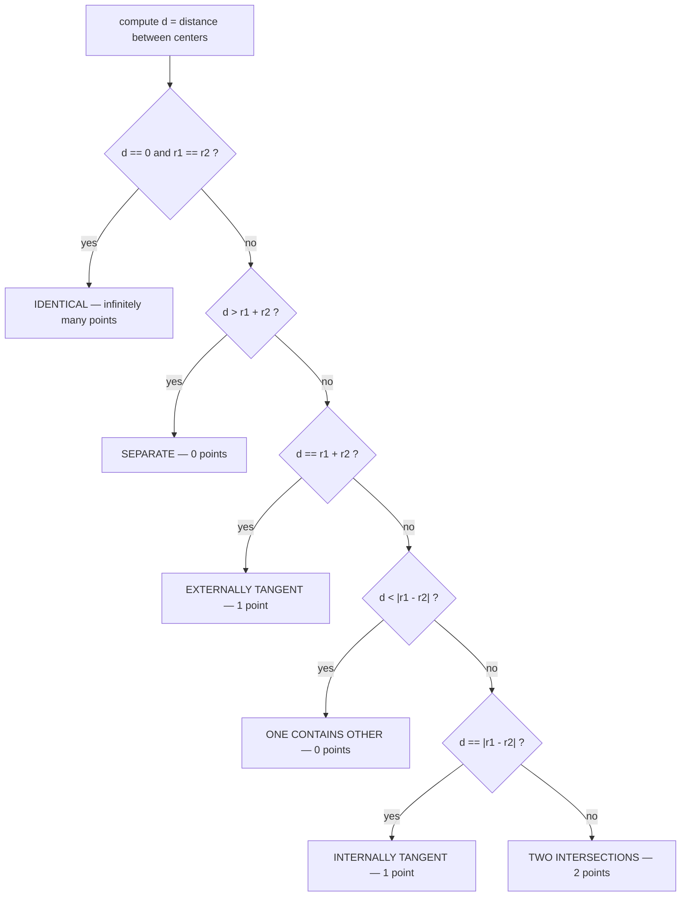
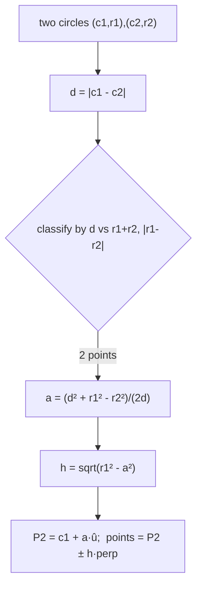

# Circle–Circle Intersection — Junior Level

> **One-line summary:** Given two circles `(c1, r1)` and `(c2, r2)`, you can tell *exactly* how they relate — separate, touching, overlapping, or one inside the other — just by comparing the center distance `d = |c1 - c2|` against the two sums `r1 + r2` and `|r1 - r2|`. When they cross, the two intersection points are found by a simple ruler-and-compass construction: walk a distance `a` along the line joining the centers, then step `h` perpendicular to it.

---

## Table of Contents

1. [Introduction](#introduction)
2. [Prerequisites](#prerequisites)
3. [Glossary](#glossary)
4. [Core Concepts](#core-concepts)
5. [The Classification Rule](#the-classification-rule)
6. [Big-O Summary](#big-o-summary)
7. [Real-World Analogies](#real-world-analogies)
8. [Pros & Cons](#pros--cons)
9. [Step-by-Step Walkthrough](#step-by-step-walkthrough)
10. [Code Examples](#code-examples)
11. [Coding Patterns](#coding-patterns)
12. [Error Handling](#error-handling)
13. [Performance Tips](#performance-tips)
14. [Best Practices](#best-practices)
15. [Edge Cases & Pitfalls](#edge-cases--pitfalls)
16. [Common Mistakes](#common-mistakes)
17. [Cheat Sheet](#cheat-sheet)
18. [Visual Animation](#visual-animation)
19. [Summary](#summary)
20. [Further Reading](#further-reading)

---

## Introduction

Two circles live in a plane. Each is described by a **center** (a point `(x, y)`) and a **radius** `r ≥ 0`. The question "how do these two circles relate?" sounds vague until you realize there are only **six** possible answers, and you can pick the right one with a couple of comparisons:

1. **Separate (apart):** the circles do not touch at all; they are too far away from each other.
2. **Externally tangent:** they touch at exactly **one** point, from the outside, like two coins set edge to edge.
3. **Two intersection points:** they overlap and the boundaries cross at **two** points — the classic "Venn diagram" picture.
4. **Internally tangent:** one circle is inside the other and they touch at exactly **one** point from the inside.
5. **One contains the other (no touch):** a small circle floats entirely inside a big one without touching it.
6. **Identical (coincident):** same center, same radius — infinitely many shared points.

The beautiful part is that **a single number decides everything**: the distance between the two centers, written `d`. Compare `d` to `r1 + r2` (the sum of radii) and to `|r1 - r2|` (the absolute difference of radii), and the case falls out immediately.

Once you know the circles actually *cross* at two points, finding those points is a short, mechanical recipe — the **a/h construction** — that you can code in a dozen lines. This topic teaches you both halves: the **classification** (what relationship?) and the **intersection points** (where exactly?).

This problem shows up everywhere: GPS and **trilateration** (locating a phone from distances to three towers), collision detection in games and robotics, and area/Venn-diagram puzzles in contests.

---

## Prerequisites

Before reading this file you should be comfortable with:

- **2-D coordinates** — points as `(x, y)` pairs, and basic vector ideas (subtract two points to get a direction).
- **The distance formula** — `d = sqrt((x2 - x1)² + (y2 - y1)²)`, straight from the Pythagorean theorem.
- **Square roots and squares** — and the idea that `sqrt` of a negative number is undefined (no real answer).
- **Basic algebra** — substituting into and rearranging a formula.
- **Floating-point numbers** — `float64` / `double`, and the idea that comparisons like `a == b` are fragile for decimals.

Optional but helpful:

- The equation of a circle: `(x - cx)² + (y - cy)² = r²`.
- A first taste of *why* comparing with a tiny tolerance `EPS` beats exact `==` for floats.

You do **not** need trigonometry, calculus, or any prior computational-geometry background for this file.

---

## Glossary

| Term | Meaning |
|------|---------|
| **Center** | The middle point of a circle, `c = (cx, cy)`. |
| **Radius (`r`)** | The distance from the center to any point on the circle; `r ≥ 0`. |
| **Center distance (`d`)** | `d = |c1 - c2| = sqrt((x2-x1)² + (y2-y1)²)`, the gap between the two centers. |
| **Sum of radii (`r1 + r2`)** | The threshold for "touching from outside." |
| **Difference of radii (`|r1 - r2|`)** | The threshold for "one inside the other." |
| **Tangent** | The circles touch at exactly **one** point. *External* (outside) or *internal* (inside). |
| **Intersection point** | A point lying on **both** circles at once; there are 0, 1, 2, or infinitely many. |
| **`a`** | Distance from `c1` to the foot of the line connecting the two intersection points (along `c1c2`). |
| **`h`** | Half the length of the common chord; the perpendicular offset to each intersection point. |
| **Common chord** | The straight line segment joining the two intersection points. |
| **Lens / vesica** | The overlapping "almond" region shared by two crossing circles. |
| **EPS (epsilon)** | A tiny tolerance (e.g. `1e-9`) used to compare floating-point numbers safely. |
| **Concentric** | Two circles sharing the same center (`d = 0`). |

---

## Core Concepts

### 1. Everything depends on the center distance `d`

Draw the segment between the two centers. Its length `d` is the only "global" measurement you need. Intuitively:

- If `d` is **larger** than `r1 + r2`, the circles cannot reach each other — they are **separate**.
- If `d` **equals** `r1 + r2`, they just barely touch on the outside — **externally tangent**.
- If `d` is **between** `|r1 - r2|` and `r1 + r2`, the boundaries cross at **two** points.
- If `d` **equals** `|r1 - r2|`, the smaller circle touches the larger from inside — **internally tangent**.
- If `d` is **smaller** than `|r1 - r2|`, one circle is fully **inside** the other without touching.
- If `d = 0` **and** `r1 = r2`, the circles are **identical**.

That is the whole classification, summarized in one sentence: *compare `d` with `r1 + r2` and `|r1 - r2|`.*

### 2. The two thresholds are radii sums

Why `r1 + r2` and `|r1 - r2|`? Picture the closest and farthest a point on circle 1 can be from `c2`:

- The **farthest reach outward** of circle 1 toward circle 2 is `r1`, and circle 2 reaches back `r2`. Together they span `r1 + r2`. If the centers are farther apart than that, no shared point exists.
- For one circle to be inside the other, the big radius must "cover" the small circle even at its farthest. The boundary case is `d = |r1 - r2|`: the small circle just grazes the big one from inside.

### 3. The intersection points via the a/h construction

When two circles cross, their two intersection points are mirror images across the line joining the centers. We find them in two steps:

1. **Find `a`:** the signed distance from `c1` to point `P2`, the foot of the common chord on the center line. The formula is
   ```
   a = (d² + r1² - r2²) / (2d)
   ```
2. **Find `h`:** the half-length of the chord, by the Pythagorean theorem on the right triangle with hypotenuse `r1`:
   ```
   h = sqrt(r1² - a²)
   ```

Then `P2 = c1 + a · (c2 - c1)/d` (walk `a` along the unit direction from `c1` toward `c2`), and the two intersection points are `P2 ± h · perpendicular`, where the perpendicular to `(c2 - c1)/d` is `(-(c2-c1).y, (c2-c1).x)/d`.

We will derive *why* this works in `professional.md`; for now, treat it as a reliable recipe.

### 4. Floating point means "use a tolerance"

Real circle data is rarely exact. `d` might come out as `4.9999999998` when it should be exactly `5`. So instead of asking `d == r1 + r2`, you ask `abs(d - (r1 + r2)) < EPS` with a small `EPS` like `1e-9`. Tangency (the "exactly one point" cases) is the fragile boundary — that is where tolerance matters most.

---

## The Classification Rule

The classification can be written as a single decision tree. Let `R = r1 + r2` (sum) and `r = |r1 - r2|` (difference).



| Condition on `d` | Relationship | # shared points |
|------------------|--------------|-----------------|
| `d > r1 + r2` | Separate (apart) | 0 |
| `d == r1 + r2` | Externally tangent | 1 |
| `|r1 - r2| < d < r1 + r2` | Two intersections | 2 |
| `d == |r1 - r2|` (and `d > 0`) | Internally tangent | 1 |
| `d < |r1 - r2|` | One contains the other | 0 |
| `d == 0` and `r1 == r2` | Identical / coincident | ∞ |

> Read every `==` as "within `EPS`," every `<` and `>` as "by more than `EPS`."

---

## Big-O Summary

| Operation | Complexity | Notes |
|-----------|-----------|-------|
| Compute `d` (one distance) | **O(1)** | A handful of arithmetic ops and one `sqrt`. |
| Classify the relationship | **O(1)** | Two comparisons against thresholds. |
| Compute the intersection point(s) | **O(1)** | The a/h construction: a few mults, one `sqrt`. |
| Lens (overlap) area | **O(1)** | Two `acos` calls and some arithmetic. |
| Classify `n` circles against one fixed circle | **O(n)** | One O(1) test per circle. |
| All-pairs among `n` circles | **O(n²)** | Naively test every pair; spatial structures reduce this (see `senior.md`). |

> There is **no loop** in the core computation. The whole thing is constant time — its difficulty is *numerical care*, not algorithmic complexity.

---

## Real-World Analogies

| Concept | Analogy |
|---------|---------|
| Two circles as reach ranges | Two sprinklers each watering a circular patch; the overlap is where the grass gets double water. |
| `d > r1 + r2` (separate) | Two people standing too far apart to shake hands even with arms fully outstretched. |
| Externally tangent | Two billiard balls resting against each other — touching at one point. |
| Two intersections | Two overlapping ripples on a pond crossing at two points. |
| Internally tangent | A small coin sitting inside a ring, touching the ring's inner edge at one spot. |
| One contains the other | A pea rattling around loose inside a bowl, never touching the rim. |
| Trilateration | Three cell towers each say "you're somewhere on *this* circle"; where the circles cross pins you down. |

Where the analogies break: real sprinklers and ripples have soft, fuzzy edges; our circles are perfectly sharp mathematical boundaries, which is exactly why floating-point tolerance matters.

---

## Pros & Cons

| Pros | Cons |
|------|------|
| Constant time — no loops, no data structures. | Tangency (one-point cases) is numerically fragile; needs `EPS` tuning. |
| Classification needs only `d`, `r1 + r2`, `|r1 - r2|`. | `sqrt` and division can lose precision for tiny or huge radii. |
| The a/h construction is short and memorable. | Division by `d` blows up when `d ≈ 0` (concentric circles). |
| Foundational for trilateration, collision, and area problems. | Real-world distance measurements carry noise — exact intersection may not exist. |
| Easy to test against brute-force / known cases. | Extending to 3-D (sphere–sphere) needs extra care (the chord becomes a circle). |

**When to use:** any time you must know whether two disks overlap, where their boundaries cross, how big the overlap is, or to locate a point from circular distance constraints (GPS).

**When NOT to use:** if you only need "do these two disks overlap at all?" for collision, you can skip the `sqrt` entirely and compare **squared** distances — `d² <= (r1 + r2)²` — which is faster and exact for integers. Reach for the full intersection only when you need the actual points or area.

---

## Step-by-Step Walkthrough

Let's intersect circle 1 centered at `c1 = (0, 0)` with `r1 = 5`, and circle 2 centered at `c2 = (8, 0)` with `r2 = 5`.

**Step 1 — center distance.**
```
d = sqrt((8 - 0)² + (0 - 0)²) = sqrt(64) = 8
```

**Step 2 — classify.**
```
r1 + r2 = 10,   |r1 - r2| = 0
|r1 - r2| = 0 < d = 8 < r1 + r2 = 10   →   TWO INTERSECTIONS
```

**Step 3 — find `a` (distance from `c1` to the chord foot).**
```
a = (d² + r1² - r2²) / (2d)
  = (64 + 25 - 25) / (16)
  = 64 / 16
  = 4
```
So the chord's foot `P2` is `4` units from `c1` along the line toward `c2`.

**Step 4 — find `h` (half the chord).**
```
h = sqrt(r1² - a²) = sqrt(25 - 16) = sqrt(9) = 3
```

**Step 5 — build the points.** The unit direction from `c1` to `c2` is `(1, 0)`. Its perpendicular is `(0, 1)`.
```
P2 = c1 + a·(1, 0) = (4, 0)
intersection A = P2 + h·(0, 1) = (4,  3)
intersection B = P2 - h·(0, 1) = (4, -3)
```

**Check:** does `(4, 3)` lie on both circles?
- Circle 1: `4² + 3² = 16 + 9 = 25 = 5²` ✓
- Circle 2: `(4-8)² + 3² = 16 + 9 = 25 = 5²` ✓

Both intersection points are `(4, 3)` and `(4, -3)` — mirror images across the x-axis (the line of centers), exactly as expected.

---

## Code Examples

### Example: Classify two circles and compute their intersection points

#### Go

```go
package main

import (
	"fmt"
	"math"
)

const EPS = 1e-9

type Point struct{ X, Y float64 }
type Circle struct {
	C Point
	R float64
}

// Relation classifies how two circles relate.
type Relation int

const (
	Separate Relation = iota
	ExternallyTangent
	TwoPoints
	InternallyTangent
	OneContainsOther
	Identical
)

func (r Relation) String() string {
	return [...]string{
		"Separate", "ExternallyTangent", "TwoPoints",
		"InternallyTangent", "OneContainsOther", "Identical",
	}[r]
}

func dist(a, b Point) float64 {
	dx, dy := a.X-b.X, a.Y-b.Y
	return math.Hypot(dx, dy) // sqrt(dx*dx + dy*dy), overflow-safe
}

// Classify returns the relationship between two circles.
func Classify(c1, c2 Circle) Relation {
	d := dist(c1.C, c2.C)
	sum := c1.R + c2.R
	diff := math.Abs(c1.R - c2.R)
	switch {
	case d < EPS && diff < EPS:
		return Identical
	case d > sum+EPS:
		return Separate
	case math.Abs(d-sum) <= EPS:
		return ExternallyTangent
	case d < diff-EPS:
		return OneContainsOther
	case math.Abs(d-diff) <= EPS:
		return InternallyTangent
	default:
		return TwoPoints
	}
}

// Intersect returns the intersection points (0, 1, or 2 of them).
func Intersect(c1, c2 Circle) []Point {
	d := dist(c1.C, c2.C)
	sum := c1.R + c2.R
	diff := math.Abs(c1.R - c2.R)
	// No intersection or infinitely many.
	if d > sum+EPS || d < diff-EPS || (d < EPS && diff < EPS) {
		return nil
	}
	// a = distance from c1 to the chord foot along c1->c2.
	a := (d*d + c1.R*c1.R - c2.R*c2.R) / (2 * d)
	// h² may be slightly negative for tangent cases due to rounding; clamp.
	h2 := c1.R*c1.R - a*a
	if h2 < 0 {
		h2 = 0
	}
	h := math.Sqrt(h2)
	// Unit vector from c1 toward c2.
	ux := (c2.C.X - c1.C.X) / d
	uy := (c2.C.Y - c1.C.Y) / d
	// Foot of the chord.
	px := c1.C.X + a*ux
	py := c1.C.Y + a*uy
	if h < EPS {
		return []Point{{px, py}} // tangent: single point
	}
	// Perpendicular to (ux, uy) is (-uy, ux).
	return []Point{
		{px - h*uy, py + h*ux},
		{px + h*uy, py - h*ux},
	}
}

func main() {
	c1 := Circle{Point{0, 0}, 5}
	c2 := Circle{Point{8, 0}, 5}
	fmt.Println("Relation:", Classify(c1, c2)) // TwoPoints
	fmt.Println("Points:", Intersect(c1, c2))  // [{4 3} {4 -3}]
}
```

#### Java

```java
import java.util.*;

public class CircleIntersection {
    static final double EPS = 1e-9;

    record Point(double x, double y) {}
    record Circle(Point c, double r) {}

    enum Relation {
        SEPARATE, EXTERNALLY_TANGENT, TWO_POINTS,
        INTERNALLY_TANGENT, ONE_CONTAINS_OTHER, IDENTICAL
    }

    static double dist(Point a, Point b) {
        return Math.hypot(a.x() - b.x(), a.y() - b.y());
    }

    static Relation classify(Circle c1, Circle c2) {
        double d = dist(c1.c(), c2.c());
        double sum = c1.r() + c2.r();
        double diff = Math.abs(c1.r() - c2.r());
        if (d < EPS && diff < EPS) return Relation.IDENTICAL;
        if (d > sum + EPS) return Relation.SEPARATE;
        if (Math.abs(d - sum) <= EPS) return Relation.EXTERNALLY_TANGENT;
        if (d < diff - EPS) return Relation.ONE_CONTAINS_OTHER;
        if (Math.abs(d - diff) <= EPS) return Relation.INTERNALLY_TANGENT;
        return Relation.TWO_POINTS;
    }

    static List<Point> intersect(Circle c1, Circle c2) {
        double d = dist(c1.c(), c2.c());
        double sum = c1.r() + c2.r();
        double diff = Math.abs(c1.r() - c2.r());
        if (d > sum + EPS || d < diff - EPS || (d < EPS && diff < EPS)) {
            return List.of();
        }
        double a = (d * d + c1.r() * c1.r() - c2.r() * c2.r()) / (2 * d);
        double h2 = c1.r() * c1.r() - a * a;
        if (h2 < 0) h2 = 0;
        double h = Math.sqrt(h2);
        double ux = (c2.c().x() - c1.c().x()) / d;
        double uy = (c2.c().y() - c1.c().y()) / d;
        double px = c1.c().x() + a * ux;
        double py = c1.c().y() + a * uy;
        if (h < EPS) return List.of(new Point(px, py));
        return List.of(
            new Point(px - h * uy, py + h * ux),
            new Point(px + h * uy, py - h * ux)
        );
    }

    public static void main(String[] args) {
        Circle c1 = new Circle(new Point(0, 0), 5);
        Circle c2 = new Circle(new Point(8, 0), 5);
        System.out.println("Relation: " + classify(c1, c2)); // TWO_POINTS
        System.out.println("Points: " + intersect(c1, c2));   // [(4,3),(4,-3)]
    }
}
```

#### Python

```python
import math

EPS = 1e-9


def dist(a, b):
    return math.hypot(a[0] - b[0], a[1] - b[1])


def classify(c1, c2):
    """c1, c2 are ((cx, cy), r). Returns a string relationship."""
    (p1, r1), (p2, r2) = c1, c2
    d = dist(p1, p2)
    s, diff = r1 + r2, abs(r1 - r2)
    if d < EPS and diff < EPS:
        return "Identical"
    if d > s + EPS:
        return "Separate"
    if abs(d - s) <= EPS:
        return "ExternallyTangent"
    if d < diff - EPS:
        return "OneContainsOther"
    if abs(d - diff) <= EPS:
        return "InternallyTangent"
    return "TwoPoints"


def intersect(c1, c2):
    """Return a list of 0, 1, or 2 intersection points."""
    (p1, r1), (p2, r2) = c1, c2
    d = dist(p1, p2)
    s, diff = r1 + r2, abs(r1 - r2)
    if d > s + EPS or d < diff - EPS or (d < EPS and diff < EPS):
        return []
    a = (d * d + r1 * r1 - r2 * r2) / (2 * d)
    h2 = max(0.0, r1 * r1 - a * a)  # clamp tiny negatives from rounding
    h = math.sqrt(h2)
    ux, uy = (p2[0] - p1[0]) / d, (p2[1] - p1[1]) / d
    px, py = p1[0] + a * ux, p1[1] + a * uy
    if h < EPS:
        return [(px, py)]
    return [(px - h * uy, py + h * ux), (px + h * uy, py - h * ux)]


if __name__ == "__main__":
    c1 = ((0, 0), 5)
    c2 = ((8, 0), 5)
    print("Relation:", classify(c1, c2))   # TwoPoints
    print("Points:", intersect(c1, c2))     # [(4.0, 3.0), (4.0, -3.0)]
```

**What it does:** classifies the relationship in O(1), then computes the 0/1/2 intersection points via the a/h construction.
**Run:** `go run main.go` | `javac CircleIntersection.java && java CircleIntersection` | `python circle.py`

---

## Coding Patterns

### Pattern 1: Squared-distance overlap test (skip the `sqrt`)

**Intent:** quickly answer "do these two disks overlap?" without computing the actual points.

```python
def disks_overlap(c1, c2):
    (p1, r1), (p2, r2) = c1, c2
    dx, dy = p1[0] - p2[0], p1[1] - p2[1]
    d2 = dx * dx + dy * dy       # squared distance — no sqrt
    return d2 <= (r1 + r2) ** 2  # overlap (or touch) iff d <= r1 + r2
```

This is the workhorse of collision detection: comparing squared values avoids the `sqrt` and, for integer coordinates, is **exact** (no floating point at all).

### Pattern 2: The a/h construction as a reusable helper

**Intent:** isolate the "walk `a`, step `h`" geometry so other code can reuse it.

```python
def chord_points(p1, r1, p2, r2, d):
    a = (d * d + r1 * r1 - r2 * r2) / (2 * d)
    h = math.sqrt(max(0.0, r1 * r1 - a * a))
    ux, uy = (p2[0] - p1[0]) / d, (p2[1] - p1[1]) / d
    fx, fy = p1[0] + a * ux, p1[1] + a * uy  # foot of chord
    return (fx - h * uy, fy + h * ux), (fx + h * uy, fy - h * ux)
```

### Pattern 3: Classify many circles against one (sensor coverage)

**Intent:** given one target circle, which of `n` other circles overlap it?

```python
def overlapping(target, circles):
    return [c for c in circles if classify(target, c) in
            ("TwoPoints", "ExternallyTangent", "InternallyTangent")]
```



---

## Error Handling

| Error | Cause | Fix |
|-------|-------|-----|
| Division by zero in `a = (...) / (2d)` | Concentric circles (`d = 0`). | Check `d < EPS` and handle identical/contained cases *before* dividing. |
| `NaN` from `sqrt(r1² - a²)` | `a² > r1²` by a hair in a tangent case (rounding). | Clamp the radicand: `h2 = max(0, r1² - a²)`. |
| Wrong tangent verdict | Using `==` on floats. | Compare with `EPS`: `abs(d - (r1+r2)) < EPS`. |
| Missing intersection points | Returning early for a near-tangent case classified as "separate." | Use a consistent `EPS` across classify *and* intersect. |
| Points swapped / mirrored wrong | Perpendicular sign flipped. | Perpendicular to `(ux, uy)` is `(-uy, ux)`; pick a consistent order. |
| Overflow in `dx² + dy²` | Huge coordinates squared. | Use `hypot` (Go `math.Hypot`, Java `Math.hypot`) which avoids overflow. |

---

## Performance Tips

- **Skip `sqrt` for pure overlap tests.** Compare squared distance to `(r1 + r2)²`. Faster and exact on integers.
- **Compute `d` once.** Both classification and the a/h construction need it; don't recompute.
- **Use `hypot`** for the distance — it is overflow-safe and clearer than a hand-rolled `sqrt`.
- **Clamp the radicand** before `sqrt` so a rounding wobble never produces `NaN`.
- **Batch sensibly.** Testing `n` circles against one is O(n); for all-pairs, a spatial grid or sweep avoids the O(n²) blowup (see `senior.md`).

---

## Best Practices

- Pick **one** `EPS` constant (e.g. `1e-9`) and use it everywhere, in both `classify` and `intersect`.
- Always handle the **concentric** case (`d ≈ 0`) before any division by `d`.
- Return a clear, typed result for the relationship (an enum), not a magic integer.
- Verify intersection points by plugging them back into **both** circle equations in your tests.
- Keep the geometry (a/h) in a small helper so collision, area, and trilateration code can share it.
- Document units (pixels? meters?) so `EPS` is meaningful relative to the data's scale.

---

## Edge Cases & Pitfalls

- **Concentric, different radii** (`d = 0`, `r1 ≠ r2`): one contains the other; **never** divide by `d`.
- **Concentric, same radius** (`d = 0`, `r1 = r2`): identical — infinitely many shared points; return a special marker, not a point list.
- **Zero-radius circle** (`r = 0`): a degenerate "point circle." It intersects another circle iff the point lies on it (`d == r_other`).
- **Tangent cases**: classification says "1 point"; `intersect` should return exactly one point (where `h ≈ 0`).
- **Near-tangent**: `d` is *just* inside or outside `r1 + r2`; the verdict can flip with `EPS`. Decide whether "touching" counts as overlapping.
- **Very large or very small radii**: precision degrades; consider scaling coordinates to a sane range first.

---

## Common Mistakes

1. **Using `==` on floating-point distances** — tangency tests need an `EPS` tolerance.
2. **Dividing by `d` without checking `d ≈ 0`** — concentric circles crash or produce `NaN`/`Inf`.
3. **Forgetting `|r1 - r2|`** — only checking `r1 + r2` misses the "one inside the other" and "internally tangent" cases.
4. **Letting `sqrt` see a negative** — clamp `r1² - a²` to `0` before the square root.
5. **Swapping `r1` and `r2` in the `a` formula** — `a` is measured from `c1`, so the `+r1² - r2²` order matters; from `c2` it would be `+r2² - r1²`.
6. **Returning two identical points for a tangent case** — detect `h ≈ 0` and return a single point.
7. **Mixing two different `EPS` values** — classify and intersect must agree, or you get contradictions.

---

## Cheat Sheet

| Quantity | Formula |
|----------|---------|
| Center distance | `d = sqrt((x2-x1)² + (y2-y1)²)` |
| Sum threshold | `r1 + r2` |
| Difference threshold | `|r1 - r2|` |
| Chord-foot distance | `a = (d² + r1² - r2²) / (2d)` |
| Half chord | `h = sqrt(r1² - a²)` |
| Foot point | `P2 = c1 + a·(c2 - c1)/d` |
| The two points | `P2 ± h·(perp of unit(c2 - c1))` |

Classification (read `==`/`<`/`>` with `EPS`):

```
d == 0 and r1 == r2  -> Identical (∞ points)
d > r1 + r2          -> Separate (0)
d == r1 + r2         -> Externally tangent (1)
|r1-r2| < d < r1+r2  -> Two intersections (2)
d == |r1 - r2|       -> Internally tangent (1)
d < |r1 - r2|        -> One contains other (0)
```

Fast overlap test (no `sqrt`): `d² <= (r1 + r2)²`.

---

## Visual Animation

> See [`animation.html`](./animation.html) for an interactive visual animation of circle–circle intersection.
>
> The animation demonstrates:
> - Two **draggable** circles you can move and resize.
> - Live classification by `d` vs `r1 + r2` and `|r1 - r2|`.
> - The a/h construction drawn step by step (the segment `a`, the perpendicular `h`, the two points).
> - The shaded **lens** (overlap) area.
> - A control panel, an info panel with the live formulas, a Big-O table, and an operation log.

---

## Summary

Circle–circle intersection splits into two questions. **Classification** asks "what relationship?" and is answered by comparing the center distance `d` to `r1 + r2` and `|r1 - r2|` — six cases, all O(1). **Construction** asks "where do they cross?" and is answered by the a/h recipe: step `a = (d² + r1² - r2²)/(2d)` along the line of centers, then `h = sqrt(r1² - a²)` perpendicular to it, giving the two mirror-image points. The whole thing is constant time; the real skill is **numerical care** — use an `EPS` tolerance for tangency, guard against `d ≈ 0`, and clamp the radicand before `sqrt`. Master these and you have the building block for trilateration, collision detection, and overlap-area problems.

---

## Further Reading

- *Computational Geometry: Algorithms and Applications* (de Berg et al.) — foundations of geometric primitives.
- *Geometric Tools for Computer Graphics* (Schneider & Eberly) — robust intersection recipes.
- cp-algorithms.com — "Circle-Circle Intersection" and "Circle-Line Intersection."
- Paul Bourke, "Intersection of two circles" — the classic a/h derivation with diagrams.
- Sibling topics: *13-circle-line-intersection* (line meets circle), *15-circle-tangents* (tangent lines), *08-minimum-enclosing-circle*.

---

Next step: continue to [`middle.md`](./middle.md) to learn *why* the a/h construction works, how to compute the lens (overlap) area from circular segments, and how the tangent and concentric cases behave.
