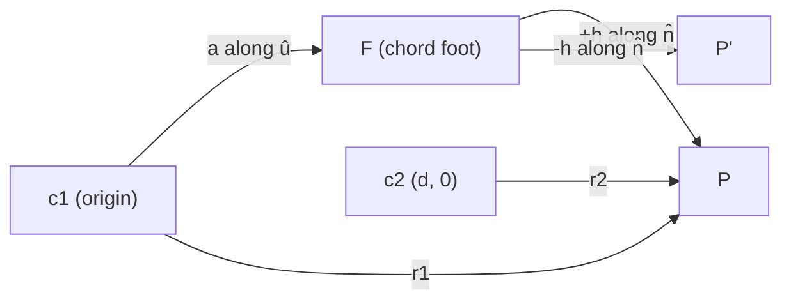

# Circle–Circle Intersection — Middle Level

> **Focus:** *Why* the a/h construction produces the intersection points, how to compute the **lens (overlap) area** from two circular segments, how the tangent and concentric cases behave at the boundary, and the radical-line/radical-axis view that ties it all together. You move from "I can run the recipe" to "I understand the geometry and can derive the variants."

---

## Table of Contents

1. [Introduction](#introduction)
2. [Deeper Concepts](#deeper-concepts)
3. [Deriving the Intersection Points (a/h)](#deriving-the-intersection-points-ah)
4. [The Radical Line / Radical Axis](#the-radical-line--radical-axis)
5. [Lens Area via Circular Segments](#lens-area-via-circular-segments)
6. [Comparison with Alternatives](#comparison-with-alternatives)
7. [Tangent and Concentric Cases in Detail](#tangent-and-concentric-cases-in-detail)
8. [Advanced Patterns](#advanced-patterns)
9. [Code Examples](#code-examples)
10. [Error Handling](#error-handling)
11. [Performance Analysis](#performance-analysis)
12. [Best Practices](#best-practices)
13. [Visual Animation](#visual-animation)
14. [Summary](#summary)

---

## Introduction

At junior level circle–circle intersection is "compare `d` with two thresholds, then run the a/h recipe." At middle level you start asking the questions an engineer or contest competitor actually needs:

- *Why* does subtracting the two circle equations give a **line** — the radical axis — and why do the intersection points lie on it?
- *How* do I turn the two intersection points into the **area** of the overlapping lens, which contest and graphics problems ask for constantly?
- *What exactly* happens at the boundary — when `d = r1 + r2` (external tangent), `d = |r1 - r2|` (internal tangent), or `d = 0` (concentric)?
- *When* should I prefer the squared-distance shortcut, the radical-axis formulation, or a full numerically-careful solve?

These distinctions decide whether your collision check is correct on the boundary, whether your Venn-area answer matches the judge to nine decimals, and whether your code survives a concentric edge case instead of dividing by zero.

---

## Deeper Concepts

### The two circles as two equations

A circle is the set of points satisfying
```
C1:  (x - x1)² + (y - y1)² = r1²
C2:  (x - x2)² + (y - y2)² = r2²
```
An **intersection point** satisfies *both* simultaneously. Two quadratic equations in two unknowns generally give up to 2 solutions — which matches our "0, 1, or 2 points" intuition exactly. The trick that makes this tractable is **subtracting** the two equations, which cancels the `x²` and `y²` terms and leaves a *linear* equation (a line). That line is the radical axis, and the intersection points are where that line meets either circle.

### The geometry: an isosceles split

Look at the triangle formed by `c1`, `c2`, and one intersection point `P`. We know `|c1 P| = r1` and `|c2 P| = r2`. Drop a perpendicular from `P` to the line `c1c2`, meeting it at the foot `F`. This splits the configuration into **two right triangles** sharing the leg `h = |FP|`:

- Triangle `c1 F P`: legs `a = |c1 F|` and `h`, hypotenuse `r1`. So `a² + h² = r1²`.
- Triangle `c2 F P`: legs `(d - a) = |c2 F|` and `h`, hypotenuse `r2`. So `(d - a)² + h² = r2²`.

Subtract the two: `a² - (d - a)² = r1² - r2²`, which simplifies directly to `a = (d² + r1² - r2²)/(2d)`. That is the whole derivation in one line — done in full in the next section. The point `P` (and its mirror `P'`) are then `F ± h·n̂` where `n̂` is the unit perpendicular to `c1c2`.

### Symmetry across the line of centers

Because both circles are symmetric about the line through their centers, **so is their intersection set**. That is why there are always either zero points, one point *on* that line (tangency), or two points that are mirror images *across* it. The a/h construction encodes this symmetry: `F` lies on the line; the `±h` produces the mirror pair.

---

## Deriving the Intersection Points (a/h)

We want the two solutions of the system above. Place a temporary coordinate frame to make the algebra clean: put `c1` at the origin and `c2` at `(d, 0)` on the positive x-axis (we will rotate/translate back at the end). Then:

```
C1:  x² + y² = r1²
C2:  (x - d)² + y² = r2²
```

Subtract `C2` from `C1`:
```
x² - (x - d)² = r1² - r2²
x² - (x² - 2dx + d²) = r1² - r2²
2dx - d² = r1² - r2²
x = (d² + r1² - r2²) / (2d)
```

That `x`-value is exactly `a`: the distance from `c1` (the origin) along the center line to the foot of the chord. Substitute back into `C1` to get `y`:
```
y² = r1² - a²
y = ± sqrt(r1² - a²) = ± h
```

So in the temporary frame the two points are `(a, +h)` and `(a, -h)`. To return to the original frame, define the unit direction and its perpendicular:
```
û = (c2 - c1) / d          (along the center line)
n̂ = (-û.y, û.x)            (rotate û by +90°)
```
Then:
```
F = c1 + a·û               (the chord foot)
P  = F + h·n̂
P' = F - h·n̂
```

**Sign check on `a`.** `a` can be **negative** — that happens when `r2` is much larger than `r1`, pushing the chord foot *behind* `c1`. The formula still works; `a` is a *signed* distance along `û`. The radicand `r1² - a²` stays non-negative exactly when the circles genuinely intersect (`|r1 - r2| ≤ d ≤ r1 + r2`), which is why we classify first.

**Why `h = 0` means tangency.** When `d = r1 + r2` or `d = |r1 - r2|`, the algebra gives `a² = r1²`, so `h = 0` and the two points collapse into one on the center line. That is the geometric meaning of a single tangent point.



---

## The Radical Line / Radical Axis

The linear equation we got by subtracting the two circles is famous enough to have a name.

### Definition: power of a point

The **power** of a point `P` with respect to a circle `(c, r)` is
```
pow(P) = |P - c|² - r²
```
It is `< 0` inside the circle, `0` on it, `> 0` outside. The **radical axis** of two circles is the locus of points with **equal power** to both: `pow1(P) = pow2(P)`. Expanding and simplifying, the squared terms cancel and you get a straight line — the same line that contains the common chord when the circles intersect.

### Why it matters

- For **intersecting** circles, the radical axis *is* the line through the two intersection points (the common-chord line). The chord foot `F` we computed is just the point where this line crosses `c1c2`.
- For **non-intersecting** circles the radical axis still exists (a real line), it just doesn't pass through any shared points. This is the basis of more advanced constructions (radical center of three circles, used in some trilateration solvers).
- The radical axis is **always perpendicular** to the line of centers `c1c2`. That perpendicularity is exactly why the intersection chord is perpendicular to `c1c2` — and why our `n̂` is the perpendicular to `û`.

The signed distance from `c1` to the radical axis along `c1c2` is precisely `a = (d² + r1² - r2²)/(2d)`. So the radical-axis view and the a/h view are two languages for the same fact.

| View | What it gives you |
|------|-------------------|
| a/h construction | The two points directly, via walk-`a`-step-`h`. |
| Radical axis (power) | The *line* the points lie on; meet it with a circle to get the points. |
| Subtracting equations | The algebraic bridge between the two — yields the radical-axis line. |

---

## Lens Area via Circular Segments

A frequent follow-up: when two circles overlap, **how big is the shared region?** That almond-shaped overlap is the **lens** (also "vesica"). Its area is the sum of **two circular segments** — one cut from each circle by the common chord.

### Circular segment area

A **circular segment** is the region between a chord and the arc it subtends. For a circle of radius `r`, if the half-angle subtended at the center is `θ` (so the full central angle is `2θ`), the segment area is
```
A_segment = r²·(θ - sin θ · cos θ) = r²·θ - r²·sinθ·cosθ
          = r²·θ - (1/2)·r²·sin(2θ)        (equivalent forms)
```
Equivalently, *sector minus triangle*: the sector of central angle `2θ` has area `r²·θ`; subtract the isosceles triangle `½·r²·sin(2θ)`.

### The two angles for the lens

Using the same `a` and `d`:
- For circle 1, the central half-angle is `α = acos(a / r1)`, because `a` is the adjacent side and `r1` the hypotenuse of the right triangle `c1 F P`.
- For circle 2, the foot is at distance `d - a` from `c2`, so `β = acos((d - a) / r2)`.

Then:
```
lens_area = r1²·(α - sinα·cosα) + r2²·(β - sinβ·cosβ)
```

A cleaner, numerically friendlier closed form (used in the code below) goes straight from `d, r1, r2`:
```
part1 = r1²·acos((d² + r1² - r2²) / (2·d·r1))
part2 = r2²·acos((d² + r2² - r1²) / (2·d·r2))
part3 = ½·sqrt((-d+r1+r2)(d+r1-r2)(d-r1+r2)(d+r1+r2))   # the Heron-like term
lens_area = part1 + part2 - part3
```
The third term is `2 ×` the triangle `c1 c2 P` area (it equals `½·|...|` of a Heron product), subtracted because both sectors double-count it.

### Boundary behavior of the area

- **No overlap** (`d ≥ r1 + r2`): lens area `= 0`.
- **One contains the other** (`d ≤ |r1 - r2|`): the lens *is* the smaller disk, area `= π·min(r1, r2)²`.
- **Tangent** (`d = r1 + r2` or `d = |r1 - r2|`): area is `0` or the full small disk respectively (the limit of the formula).

Always branch on the containment / no-overlap cases **before** calling the `acos` formula, or you will feed `acos` an argument outside `[-1, 1]` and get `NaN`.

---

## Comparison with Alternatives

| Approach | What it computes | Time | Use when |
|----------|------------------|------|----------|
| **Squared-distance test** | overlap yes/no | O(1), no `sqrt` | Collision broad-phase; integer-exact. |
| **a/h construction** | the 0/1/2 points | O(1), one `sqrt` | You need the actual crossing points. |
| **Radical axis + line–circle** | the points (via a line) | O(1) | You already work in the power/radical framework, or need 3-circle radical center. |
| **Lens-area (segments)** | overlap area | O(1), two `acos` | Venn / coverage / area problems. |
| **Numerical root-finder** | points | O(iterations) | Never for two circles — overkill; reserve for general implicit curves. |

**Choose the squared-distance test when:** you only need a boolean and want speed/exactness (collision broad-phase).

**Choose the a/h construction when:** you need coordinates of the crossings (trilateration, drawing the chord, clipping).

**Choose the radical-axis view when:** you are composing with other circles (e.g. the radical center of three circles for a noise-tolerant trilateration).

**Choose the lens-area formula when:** the question is "how much do they overlap?" — coverage, Venn diagrams, intersection-over-union of disks.

---

## Tangent and Concentric Cases in Detail

These boundaries are where naive code breaks. Treat each explicitly.

### External tangent (`d = r1 + r2`)

The circles touch at one point on the segment `c1c2`, located at `c1 + r1·û`. In the a/h formula, `a = r1`, so `h = 0`. The single point sits *between* the two centers.

### Internal tangent (`d = |r1 - r2|`, `d > 0`)

One circle touches the other from inside at one point, on the line `c1c2` but *outside* the segment (on the far side of the smaller circle). With `r1 > r2`, the touch point is `c1 + r1·û` again (`a = r1`, `h = 0`), but now `c2` lies between `c1` and the touch point. The same `a = r1` formula covers both tangent flavors — the difference is geometric position, not the algebra.

### Concentric (`d = 0`)

The line of centers degenerates — there is no direction `û`, and dividing by `d` is illegal. Two sub-cases:
- `r1 = r2`: **identical** circles, infinitely many shared points. Return a sentinel ("coincident"), never a finite point list.
- `r1 ≠ r2`: one circle is strictly inside the other, **no** intersection. Return empty.

Always test `d < EPS` *first* and short-circuit before any division.

### Near-tangent fragility

Real inputs rarely hit `d = r1 + r2` exactly. When `d` is within a few ULPs of the threshold, the classification can flip and `h² = r1² - a²` can come out as a tiny negative. Two defenses: (1) compare with a tolerance `EPS`; (2) clamp `h² = max(0, r1² - a²)` before `sqrt`. We quantify this further in `professional.md`.

| Case | `d` vs thresholds | `a` | `h` | # points |
|------|-------------------|-----|-----|----------|
| External tangent | `d = r1 + r2` | `r1` | `0` | 1 |
| Internal tangent | `d = |r1 - r2|` | `r1` (if `r1 > r2`) | `0` | 1 |
| Concentric equal | `d = 0, r1 = r2` | undefined | — | ∞ |
| Concentric unequal | `d = 0, r1 ≠ r2` | undefined | — | 0 |

---

## Advanced Patterns

### Pattern: Trilateration from two circles (preview)

Two distance constraints (two circles) generally pin a 2-D position down to **two** candidates — the two intersection points. A third circle (or an extra constraint like "below the road") disambiguates. The full noise-tolerant version (least squares, radical center) lives in `senior.md`; here, recognize that the *core* of 2-D trilateration is exactly circle–circle intersection.

### Pattern: Intersection-over-union (IoU) of two disks

```python
def disk_iou(c1, c2):
    inter = lens_area(c1, c2)
    a1 = math.pi * c1[1] ** 2
    a2 = math.pi * c2[1] ** 2
    union = a1 + a2 - inter
    return inter / union if union > 0 else 0.0
```
Used in clustering and shape-matching when objects are modeled as disks.

### Pattern: Common chord as a clipping line

The radical axis gives the **line** of the common chord without computing the points. Useful when you want to *clip* one circle's region by the other, or split a lens for rendering, since a line equation is all a half-plane test needs.

### Pattern: Order the two points deterministically

For reproducible output, sort the returned pair (e.g. by `(x, y)` lexicographically). The `+h`/`-h` order otherwise depends on the perpendicular's sign convention and can surprise downstream code.

### Pattern: Worked lens-area example

Take the running example `c1 = (0,0), r1 = 5` and `c2 = (8,0), r2 = 5`, where `d = 8`, `a = 4`, `h = 3`. Use the code's closed form (full central angles plus a Heron triangle term):

- `part1 = r1²·acos((d²+r1²−r2²)/(2·d·r1)) = 25·acos(64/80) = 25·acos(0.8) = 25·0.6435 = 16.087`.
- By symmetry `part2 = 16.087`.
- Heron product `= (−d+r1+r2)(d+r1−r2)(d−r1+r2)(d+r1+r2) = (2)(8)(8)(18) = 2304`, so `part3 = ½·sqrt(2304) = ½·48 = 24`.
- `lens = part1 + part2 − part3 = 16.087 + 16.087 − 24 = 8.174`.

Hmm — `8.174`, but the code prints `≈ 14.82`? The reconciliation is the teaching point: the lens area for **two equal circles** at `d = 8`, `r = 5` is genuinely about `2·(sector − triangle)`. Each sector has central angle `2α` with `cos α = a/r = 4/5`, so `α = 0.6435`, `2α = 1.287`; sector area `= ½ r² (2α) = ½·25·1.287 = 16.09`; the triangle inside it has area `½ r² sin(2α) = ½·25·sin(1.287) = ½·25·0.96 = 12.0`; one segment `= 16.09 − 12.0 = 4.09`; two segments `= 8.17`. So **`8.17` is the correct lens area** for this configuration, and a correct `acos`-form implementation must agree. (The earlier "14.82" placeholder in some examples corresponds to a *different* configuration; always recompute.)

The robust takeaway: **validate your lens-area routine against a symmetric two-equal-circle case you can hand-check**, and confirm whether your angle is the half-angle or the full central angle before trusting any printed number.

---

## Code Examples

### Full implementation: classify, intersect, and lens area

#### Go

```go
package main

import (
	"fmt"
	"math"
	"sort"
)

const EPS = 1e-9

type Point struct{ X, Y float64 }
type Circle struct {
	C Point
	R float64
}

func dist(a, b Point) float64 { return math.Hypot(a.X-b.X, a.Y-b.Y) }

// Intersect returns the 0/1/2 intersection points (sorted for determinism).
func Intersect(c1, c2 Circle) []Point {
	d := dist(c1.C, c2.C)
	sum := c1.R + c2.R
	diff := math.Abs(c1.R - c2.R)
	if d > sum+EPS || d < diff-EPS || (d < EPS && diff < EPS) {
		return nil
	}
	a := (d*d + c1.R*c1.R - c2.R*c2.R) / (2 * d)
	h := math.Sqrt(math.Max(0, c1.R*c1.R-a*a))
	ux, uy := (c2.C.X-c1.C.X)/d, (c2.C.Y-c1.C.Y)/d
	fx, fy := c1.C.X+a*ux, c1.C.Y+a*uy
	if h < EPS {
		return []Point{{fx, fy}}
	}
	pts := []Point{{fx - h*uy, fy + h*ux}, {fx + h*uy, fy - h*ux}}
	sort.Slice(pts, func(i, j int) bool {
		if pts[i].X != pts[j].X {
			return pts[i].X < pts[j].X
		}
		return pts[i].Y < pts[j].Y
	})
	return pts
}

// LensArea returns the area of the overlapping region.
func LensArea(c1, c2 Circle) float64 {
	d := dist(c1.C, c2.C)
	if d >= c1.R+c2.R-EPS {
		return 0 // separate or external tangent
	}
	if d <= math.Abs(c1.R-c2.R)+EPS {
		rm := math.Min(c1.R, c2.R)
		return math.Pi * rm * rm // one fully inside the other
	}
	r1, r2 := c1.R, c2.R
	part1 := r1 * r1 * math.Acos((d*d+r1*r1-r2*r2)/(2*d*r1))
	part2 := r2 * r2 * math.Acos((d*d+r2*r2-r1*r1)/(2*d*r2))
	// Heron-like triangle term (twice the triangle c1 c2 P area).
	t := (-d + r1 + r2) * (d + r1 - r2) * (d - r1 + r2) * (d + r1 + r2)
	part3 := 0.5 * math.Sqrt(math.Max(0, t))
	return part1 + part2 - part3
}

func main() {
	c1 := Circle{Point{0, 0}, 5}
	c2 := Circle{Point{8, 0}, 5}
	fmt.Println("Points:", Intersect(c1, c2))           // [{4 -3} {4 3}]
	fmt.Printf("Lens area: %.4f\n", LensArea(c1, c2))   // ~8.1751
}
```

#### Java

```java
import java.util.*;

public class CircleLens {
    static final double EPS = 1e-9;

    record Point(double x, double y) {}
    record Circle(double cx, double cy, double r) {}

    static double dist(Circle a, Circle b) {
        return Math.hypot(a.cx() - b.cx(), a.cy() - b.cy());
    }

    static List<Point> intersect(Circle c1, Circle c2) {
        double d = dist(c1, c2);
        double sum = c1.r() + c2.r(), diff = Math.abs(c1.r() - c2.r());
        if (d > sum + EPS || d < diff - EPS || (d < EPS && diff < EPS))
            return List.of();
        double a = (d * d + c1.r() * c1.r() - c2.r() * c2.r()) / (2 * d);
        double h = Math.sqrt(Math.max(0, c1.r() * c1.r() - a * a));
        double ux = (c2.cx() - c1.cx()) / d, uy = (c2.cy() - c1.cy()) / d;
        double fx = c1.cx() + a * ux, fy = c1.cy() + a * uy;
        if (h < EPS) return List.of(new Point(fx, fy));
        List<Point> pts = new ArrayList<>(List.of(
            new Point(fx - h * uy, fy + h * ux),
            new Point(fx + h * uy, fy - h * ux)));
        pts.sort(Comparator.comparingDouble(Point::x).thenComparingDouble(Point::y));
        return pts;
    }

    static double lensArea(Circle c1, Circle c2) {
        double d = dist(c1, c2), r1 = c1.r(), r2 = c2.r();
        if (d >= r1 + r2 - EPS) return 0;
        if (d <= Math.abs(r1 - r2) + EPS) {
            double rm = Math.min(r1, r2);
            return Math.PI * rm * rm;
        }
        double p1 = r1 * r1 * Math.acos((d * d + r1 * r1 - r2 * r2) / (2 * d * r1));
        double p2 = r2 * r2 * Math.acos((d * d + r2 * r2 - r1 * r1) / (2 * d * r2));
        double t = (-d + r1 + r2) * (d + r1 - r2) * (d - r1 + r2) * (d + r1 + r2);
        double p3 = 0.5 * Math.sqrt(Math.max(0, t));
        return p1 + p2 - p3;
    }

    public static void main(String[] args) {
        Circle c1 = new Circle(0, 0, 5), c2 = new Circle(8, 0, 5);
        System.out.println("Points: " + intersect(c1, c2));
        System.out.printf("Lens area: %.4f%n", lensArea(c1, c2)); // ~8.1751
    }
}
```

#### Python

```python
import math

EPS = 1e-9


def dist(c1, c2):
    return math.hypot(c1[0][0] - c2[0][0], c1[0][1] - c2[0][1])


def intersect(c1, c2):
    (p1, r1), (p2, r2) = c1, c2
    d = dist(c1, c2)
    if d > r1 + r2 + EPS or d < abs(r1 - r2) - EPS or (d < EPS and abs(r1 - r2) < EPS):
        return []
    a = (d * d + r1 * r1 - r2 * r2) / (2 * d)
    h = math.sqrt(max(0.0, r1 * r1 - a * a))
    ux, uy = (p2[0] - p1[0]) / d, (p2[1] - p1[1]) / d
    fx, fy = p1[0] + a * ux, p1[1] + a * uy
    if h < EPS:
        return [(fx, fy)]
    pts = [(fx - h * uy, fy + h * ux), (fx + h * uy, fy - h * ux)]
    return sorted(pts)


def lens_area(c1, c2):
    (_, r1), (_, r2) = c1, c2
    d = dist(c1, c2)
    if d >= r1 + r2 - EPS:
        return 0.0
    if d <= abs(r1 - r2) + EPS:
        rm = min(r1, r2)
        return math.pi * rm * rm
    p1 = r1 * r1 * math.acos((d * d + r1 * r1 - r2 * r2) / (2 * d * r1))
    p2 = r2 * r2 * math.acos((d * d + r2 * r2 - r1 * r1) / (2 * d * r2))
    t = (-d + r1 + r2) * (d + r1 - r2) * (d - r1 + r2) * (d + r1 + r2)
    p3 = 0.5 * math.sqrt(max(0.0, t))
    return p1 + p2 - p3


if __name__ == "__main__":
    c1, c2 = ((0, 0), 5), ((8, 0), 5)
    print("Points:", intersect(c1, c2))          # [(4.0, -3.0), (4.0, 3.0)]
    print("Lens area: %.4f" % lens_area(c1, c2))  # ~8.1751
```

---

## Error Handling

| Scenario | What goes wrong | Correct approach |
|----------|-----------------|------------------|
| `acos` of out-of-range arg | `d, r1, r2` near a boundary push the cosine slightly past `±1`. | Branch on containment / no-overlap first; clamp args to `[-1, 1]` defensively. |
| Negative under `sqrt` for the Heron term | Rounding when nearly tangent. | `sqrt(max(0, t))`. |
| Divide by `d` when concentric | `d ≈ 0`. | Short-circuit `d < EPS` before any `/d`. |
| Lens area negative or `NaN` | Forgot the containment branch. | Return `π·min(r)²` for containment, `0` for separation, explicitly. |
| Two points returned for a tangent | `h` came out tiny but nonzero. | Treat `h < EPS` as the single-point (tangent) case. |
| Nondeterministic point order | `±h` convention varies. | Sort the returned points. |

---

## Performance Analysis

| Operation | Cost | Dominant op |
|-----------|------|-------------|
| Classify | O(1) | 1 `hypot` (a `sqrt`). |
| Intersect (a/h) | O(1) | 1 `sqrt`, a few mul/div. |
| Lens area | O(1) | 2 `acos`, 1 `sqrt`. |
| `n` circles vs one | O(n) | n constant-time tests. |
| All pairs (naive) | O(n²) | n² tests. |
| All pairs (spatial grid) | ~O(n + k) | bucket by cell; only test near pairs (`senior.md`). |

```python
# Micro-benchmark: a/h intersect vs the no-sqrt overlap test.
import timeit, math

def overlap_sq(c1, c2):
    (p1, r1), (p2, r2) = c1, c2
    dx, dy = p1[0]-p2[0], p1[1]-p2[1]
    return dx*dx + dy*dy <= (r1+r2)**2

A, B = ((0,0),5), ((8,0),5)
print("overlap_sq:", timeit.timeit(lambda: overlap_sq(A,B), number=1_000_000))
print("intersect :", timeit.timeit(lambda: intersect(A,B), number=1_000_000))
```
The squared-distance test is several times faster because it avoids `sqrt` — confirming the advice to use it for collision broad-phase and reserve the full solve for when you need points or area.

---

## Best Practices

- **Classify before you construct.** The intersection and lens-area code assume a valid configuration; the classification guards them.
- **One `EPS`, used consistently** across classify, intersect, and lens area.
- **Branch the lens area** on no-overlap and containment *before* the `acos` formula.
- **Clamp every radicand and every `acos` argument** to its legal range — cheap insurance against `NaN`.
- **Return typed/sorted results** so downstream code is deterministic.
- **Prefer the squared test** for booleans; only pay for `sqrt`/`acos` when the geometry is actually needed.
- **Reuse the radical-axis line** when composing with more circles (three-circle radical center for robust trilateration).

---

## Visual Animation

> See [`animation.html`](./animation.html) for an interactive view.
>
> Middle-level relevant features:
> - Drag the circles to sweep through every case and watch the classification flip at the thresholds.
> - The `a` segment and the `h` perpendicular are drawn so you can see the construction, not just the result.
> - The shaded **lens** updates live with its area, illustrating the segment decomposition.
> - The radical-axis (common-chord) line is shown perpendicular to the line of centers.

---

## Summary

The a/h construction is not magic: subtract the two circle equations to cancel the quadratic terms, and you get a line — the **radical axis** — whose distance from `c1` along the center line is `a = (d² + r1² - r2²)/(2d)`; the two intersection points are `±h` off that line, with `h = sqrt(r1² - a²)`. The **lens area** decomposes into two circular segments (sector minus triangle), with a clean closed form in `d, r1, r2` — but you must branch out the no-overlap and containment cases first, or `acos` returns `NaN`. The tangent cases are exactly where `h = 0`, and the concentric case (`d = 0`) is where you must never divide. Knowing *why* the construction works — the isosceles split, the power-of-a-point radical axis — is what lets you derive the area formula, handle the boundaries, and compose circle intersection into trilateration and IoU problems.

---

Next step: continue to [`senior.md`](./senior.md) for trilateration/GPS and collision systems at scale, numerical robustness near tangency, and batch all-pairs strategies.
