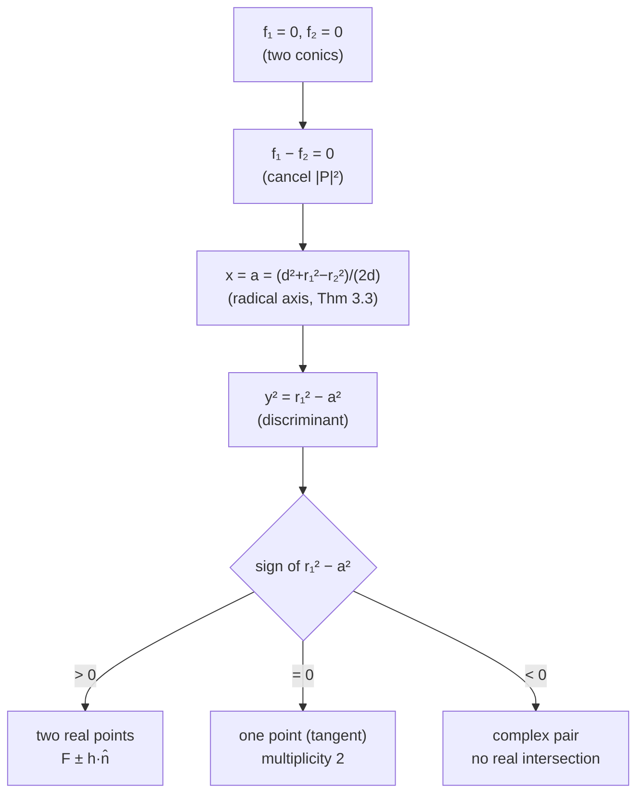

# Circle–Circle Intersection — Mathematical Foundations and Robustness Theory

## Table of Contents
1. [Formal Definition](#1-formal-definition)
2. [Derivation of the Intersection-Point Formula](#2-derivation-of-the-intersection-point-formula)
3. [The Radical Axis — Power of a Point](#3-the-radical-axis--power-of-a-point)
4. [Classification Theorem](#4-classification-theorem)
5. [Lens-Area Formula — Proof](#5-lens-area-formula--proof)
6. [Degeneracy and Robustness Analysis](#6-degeneracy-and-robustness-analysis)
7. [Numerical Conditioning and Error Bounds](#7-numerical-conditioning-and-error-bounds)
8. [Exact / Robust Predicates](#8-exact--robust-predicates)
9. [Trilateration as Over-Determined Least Squares](#9-trilateration-as-over-determined-least-squares)
10. [Pencils of Circles and the Radical Axis Algebra](#10-pencils-of-circles-and-the-radical-axis-algebra)
11. [Generalizations](#11-generalizations)
12. [Comparison with Alternatives](#12-comparison-with-alternatives)
13. [Open and Practical Notes](#13-open-and-practical-notes)
14. [Summary](#14-summary)

---

## 1. Formal Definition

Work in the Euclidean plane `ℝ²`. A **circle** is the level set
```
C(c, r) = { P ∈ ℝ² : |P − c| = r },   c ∈ ℝ², r ≥ 0,
```
equivalently the zero set of `f_{c,r}(P) = |P − c|² − r²`. Given two circles `C₁ = C(c₁, r₁)` and `C₂ = C(c₂, r₂)` with `c₁ = (x₁, y₁)`, `c₂ = (x₂, y₂)`, define the **center distance**
```
d = |c₂ − c₁| = sqrt((x₂ − x₁)² + (y₂ − y₁)²).
```

**Definition 1.1 (Intersection set).** `I = C₁ ∩ C₂ = { P : f₁(P) = 0 ∧ f₂(P) = 0 }`.

**Proposition 1.2 (Cardinality).** For `d > 0`, `|I| ∈ {0, 1, 2}`. For `d = 0`, either `I = ∅` (if `r₁ ≠ r₂`) or `I = C₁` (if `r₁ = r₂`, infinitely many).

*Proof.* For `d > 0` choose coordinates with `c₁ = (0,0)`, `c₂ = (d, 0)` (an isometry preserves `I`). Subtracting `f₂ − f₁ = 0` gives a single linear equation `x = a` (Section 2), and a vertical line meets a circle in at most two points; `r₁² − a²` is the discriminant, `> 0`, `= 0`, `< 0` giving 2, 1, 0 points. For `d = 0` the two circles are concentric: equal radii ⇒ same set; unequal ⇒ disjoint. ∎

---

## 2. Derivation of the Intersection-Point Formula

We derive the a/h construction rigorously and show it is exact (modulo floating point).

**Setup (canonical frame).** Apply the rigid motion `T` that sends `c₁ ↦ (0,0)` and `c₂ ↦ (d, 0)`; `T` is the composition of a translation by `−c₁` and a rotation by `−θ`, `θ = atan2(y₂−y₁, x₂−x₁)`. Since `T` is an isometry it preserves distances, hence `I` and all incidences. In the canonical frame:
```
f₁(P) = x² + y² − r₁² = 0                    (E1)
f₂(P) = (x − d)² + y² − r₂² = 0              (E2)
```

**Step 1 — eliminate the quadratic part.** Compute `(E1) − (E2)`:
```
x² + y² − r₁² − [(x−d)² + y² − r₂²]
  = x² − (x² − 2dx + d²) − r₁² + r₂²
  = 2dx − d² − r₁² + r₂² = 0.
```
Solve for `x`:
```
x = (d² + r₁² − r₂²) / (2d)  =:  a.                          (★)
```
This is exact: a single division. Note `(d² + r₁² − r₂²) = d² + (r₁ − r₂)(r₁ + r₂)`, the factored form preferred numerically (Section 7).

**Step 2 — recover `y`.** Substitute `x = a` into (E1):
```
y² = r₁² − a²  =:  h².                                       (★★)
y = ± h,   h = sqrt(r₁² − a²)  (real iff r₁² ≥ a²).
```
Thus in the canonical frame `I = { (a, h), (a, −h) }` (coinciding when `h = 0`).

**Step 3 — map back.** With unit vector `û = (c₂ − c₁)/d` and unit normal `n̂ = û^⊥ = (−û_y, û_x)`:
```
F = c₁ + a·û                 (foot of the common chord on the center line)
P± = F ± h·n̂.                                                (♦)
```
`T⁻¹` is an isometry, so (♦) are the intersection points in the original frame.

**Lemma 2.1 (Reality condition).** `h² ≥ 0 ⟺ a² ≤ r₁² ⟺ |r₁ − r₂| ≤ d ≤ r₁ + r₂`.

*Proof.* From (★), `a² ≤ r₁²` ⟺ `|d² + r₁² − r₂²| ≤ 2 d r₁` (multiply by `2d>0`, both sides nonneg after squaring is avoided by sign care). Expand the two-sided inequality:
- `d² + r₁² − r₂² ≤ 2 d r₁` ⟺ `(d − r₁)² ≤ r₂²` ⟺ `|d − r₁| ≤ r₂` ⟺ `d ≤ r₁ + r₂` and `d ≥ r₁ − r₂`.
- `−(d² + r₁² − r₂²) ≤ 2 d r₁` ⟺ `(d + r₁)² ≥ r₂²`, always true since both sides nonneg and `d + r₁ ≥ |r₂|` when `r₂ ≤ d + r₁` — combined with the symmetric bound gives `d ≥ r₂ − r₁`.

Together: `|r₁ − r₂| ≤ d ≤ r₁ + r₂`. ∎

This is precisely the "two-intersection" band; the endpoints are tangency (`h = 0`).

**Corollary 2.2 (Chord length and perpendicularity).** The common chord `P₊P₋` has length `2h`, lies on the line `x = a` in the canonical frame, and is therefore **perpendicular** to the center line `c₁c₂`. ∎

The derivation pipeline — from the two implicit conics to the explicit points — is summarized below; each arrow is an exact algebraic step (no approximation), with reality controlled by the discriminant `r₁² − a²`.



---

## 3. The Radical Axis — Power of a Point

**Definition 3.1 (Power).** The power of `P` w.r.t. `C(c, r)` is `pow_{c,r}(P) = |P − c|² − r² = f_{c,r}(P)`.

**Definition 3.2 (Radical axis).** `Rad(C₁, C₂) = { P : pow₁(P) = pow₂(P) }`.

**Theorem 3.3.** For `c₁ ≠ c₂`, `Rad(C₁, C₂)` is a straight line perpendicular to `c₁c₂`, meeting `c₁c₂` at signed distance `a = (d² + r₁² − r₂²)/(2d)` from `c₁`.

*Proof.* `pow₁(P) − pow₂(P) = (|P−c₁|² − r₁²) − (|P−c₂|² − r₂²)`. The `|P|²` terms cancel:
```
= −2 P·c₁ + |c₁|² − r₁² + 2 P·c₂ − |c₂|² + r₂²
= 2 P·(c₂ − c₁) + (|c₁|² − |c₂|²) − (r₁² − r₂²).
```
Setting this to `0` gives `P·(c₂ − c₁) = const`, a line with normal `(c₂ − c₁)`, hence ⟂ to `c₁c₂`. Plugging `P = c₁ + t û` and solving for `t` yields `t = a`. ∎

**Corollary 3.4.** When `I ≠ ∅`, `Rad(C₁, C₂)` is the line through the intersection points (the common-chord line), because any `P ∈ I` has `pow₁(P) = pow₂(P) = 0`. The radical axis exists even when `I = ∅`. ∎

**Theorem 3.5 (Radical center).** Three circles with non-collinear centers have a unique common point — the **radical center** — equidistant in power from all three, given by intersecting any two of the three pairwise radical axes. This is the exact geometric object that noisy trilateration's linear least squares approximates (`senior.md` §3.2). ∎

---

## 4. Classification Theorem

**Theorem 4.1.** Let `Σ = r₁ + r₂`, `Δ = |r₁ − r₂|`. Exactly one of the following holds:

| Regime | Condition | `|I|` | Geometry |
|--------|-----------|-------|----------|
| Separate | `d > Σ` | 0 | disjoint exteriors |
| External tangent | `d = Σ` | 1 | touch outside, on segment `c₁c₂` |
| Secant | `Δ < d < Σ` | 2 | proper crossing |
| Internal tangent | `d = Δ`, `d > 0` | 1 | touch inside |
| Nested | `0 < d < Δ` | 0 | one strictly inside the other |
| Coincident | `d = 0, r₁ = r₂` | ∞ | identical |
| Concentric-nested | `d = 0, r₁ ≠ r₂` | 0 | concentric, disjoint |

*Proof.* Immediate from Lemma 2.1 (reality of `h`) and Prop. 1.2 (concentric cases). `h > 0 ⟺ Δ < d < Σ`; `h = 0 ⟺ d ∈ {Σ, Δ}`; `h² < 0 ⟺ d > Σ ∨ d < Δ`. ∎

**Remark (open vs closed disks).** Whether tangency "counts as overlap" is a modeling choice about open vs closed disks. For collision, closed disks (touching = colliding) are usual; for strict interior overlap, use open disks (touching = not overlapping). The predicate boundary is the `=` cases above.

---

## 5. Lens-Area Formula — Proof

For the secant case (`Δ < d < Σ`), the **lens** `L = D₁ ∩ D₂` (intersection of the two closed disks) has the following area.

**Theorem 5.1.**
```
Area(L) = r₁² · acos( (d² + r₁² − r₂²) / (2 d r₁) )
        + r₂² · acos( (d² + r₂² − r₁²) / (2 d r₂) )
        − ½ · sqrt( (−d+r₁+r₂)(d+r₁−r₂)(d−r₁+r₂)(d+r₁+r₂) ).
```

*Proof.* The common chord `P₊P₋` (length `2h`, at distance `a` from `c₁` and `d − a` from `c₂`) splits `L` into two **circular segments**, one belonging to each disk. The lens area is the sum of these two segments.

**Segment of circle 1.** The half-angle subtended at `c₁` is `α` with `cos α = a / r₁` (right triangle `c₁ F P₊`, adjacent `a`, hypotenuse `r₁`), i.e. `α = acos(a/r₁)`. A circular segment with central angle `2α` equals *sector − triangle*:
```
A₁ = (sector) − (triangle) = (½ r₁² · 2α) − (½ r₁² sin 2α) = r₁²α − ½ r₁² sin 2α.
```
Substituting `a = (d² + r₁² − r₂²)/(2d)` gives `α = acos((d² + r₁² − r₂²)/(2 d r₁))`, the first term. Likewise the segment of circle 2 uses `β = acos((d − a)/r₂) = acos((d² + r₂² − r₁²)/(2 d r₂))`, giving `A₂ = r₂²β − ½ r₂² sin 2β`.

**Collapsing the triangle terms.** `½ r₁² sin 2α = r₁² sin α cos α = r₁²·(h/r₁)·(a/r₁) = a h`. Similarly `½ r₂² sin 2β = r₂² sin β cos β = (d − a) h`. Their sum is `(a + (d − a)) h = d h`, which is exactly twice the area of triangle `c₁ c₂ P₊` (base `d`, height `h`). By Heron's formula that triangle has area `¼ sqrt((−d+r₁+r₂)(d+r₁−r₂)(d−r₁+r₂)(d+r₁+r₂))`, so
```
A₁_tri + A₂_tri = d h = 2·Area(△ c₁c₂P₊)
               = ½ sqrt((−d+r₁+r₂)(d+r₁−r₂)(d−r₁+r₂)(d+r₁+r₂)).
```
Therefore `Area(L) = r₁²α + r₂²β − ½ sqrt(Heron product)`, the claimed formula. ∎

**Boundary limits.**
- `d → Σ⁻`: the Heron product → 0 and `α, β → 0`, so `Area(L) → 0` (tangent/separate).
- `d → Δ⁺` with `r₁ > r₂`: `β → π`, `α →` the angle subtending the small circle, and `Area(L) → π r₂²` (the small disk). Hence for the **nested** regime define `Area(L) = π·min(r₁, r₂)²` directly — the `acos` form is only valid on the open secant band.

**Corollary 5.2 (IoU).** `IoU = Area(L) / (π r₁² + π r₂² − Area(L))`, valid for all regimes given the boundary definitions above. ∎

**Numerical stability of the formula.** Three hazards lurk:
1. **`acos` arguments** `(d² + r₁² − r₂²)/(2 d r₁)` must lie in `[−1, 1]`. They do *exactly* on the open secant band, but rounding near the endpoints can push them a few ULPs outside, yielding `NaN`. Clamp both arguments to `[−1, 1]` after computing them — the clamp is correct because the true value is in range; only rounding moved it.
2. **The Heron product** `(−d+r₁+r₂)(d+r₁−r₂)(d−r₁+r₂)(d+r₁+r₂)` is non-negative on the secant band; clamp to `≥ 0` before `sqrt`. Its first three factors are differences that can cancel near tangency — but the product is small there anyway, and the `acos` terms dominate, so absolute error stays bounded.
3. **Cancellation `part1 + part2 − part3`** is benign here: all three are positive and comparable in magnitude on the secant band, so no catastrophic cancellation occurs (unlike `a`'s numerator). The formula is therefore well-conditioned *given* the boundary branches.

**Alternative segment-sum form.** Equivalent and sometimes preferred:
```
Area(L) = seg(r₁, α) + seg(r₂, β),   seg(r, θ) = r²·(θ − sin θ cos θ),
```
with `α = acos(a/r₁)`, `β = acos((d−a)/r₂)`. This makes the "two segments" decomposition explicit and is easier to debug against a hand computation, at the cost of computing `a` first (and inheriting its conditioning). The closed form above avoids `a` entirely, which is why it is the production default.

---

## 6. Degeneracy and Robustness Analysis

The formulas are exact over `ℝ`; the engineering content is what happens over floating-point `𝔽` and at degeneracies.

### 6.1 Catalog of degeneracies

| Degeneracy | Algebraic signature | Hazard | Handling |
|------------|---------------------|--------|----------|
| Concentric (`d = 0`) | division by `d` in (★), (♦) | `Inf`/`NaN` | branch `d < ε_eff` first |
| Tangent (`h = 0`) | `r₁² − a² = 0` | duplicate point; sign flip of tiny radicand | clamp `h² ← max(0, ·)`; treat `h<ε` as 1 point |
| Zero radius (`r = 0`) | point-circle | `pow` degenerates to incidence test | `P ∈ C ⟺ d = r_other` |
| Coincident (`d=0, r₁=r₂`) | `I = C₁` | infinite set returned as finite | sentinel "coincident" |
| Near-equal radii, small `d` | cancellation in `d²+r₁²−r₂²` | precision loss in `a` | factor `(r₁−r₂)(r₁+r₂)` |

### 6.2 Why tangency is the worst case

Near tangency, `a → r₁`, so `h² = (r₁ − a)(r₁ + a)` is a product whose first factor `(r₁ − a)` is a difference of near-equal numbers. If `a` has relative error `δ`, then `r₁ − a` has *absolute* error `≈ r₁ δ` but *value* `≈ 0`, so its **relative** error is `O(1)` — the worst possible. The downstream `h = sqrt(h²)` therefore carries `O(sqrt)` of that error. Conclusion: **you cannot compute the tangent point's position to full precision**; you can only decide *that* it is (near) tangent, and report a single point with bounded confidence. This is intrinsic, not a coding defect.

### 6.3 Tolerance model

Let inputs carry absolute error `u` (e.g. `u = ε_mach · (scale)` with `scale = max(1, |c₁|, |c₂|, r₁, r₂)`). Define `ε_eff = κ · u` for a small constant `κ` (4–16). Predicate boundaries (`d ?= Σ`, `d ?= Δ`, `d ?= 0`) use `ε_eff`. This makes the classification **stable**: configurations within `ε_eff` of a boundary are reported as the boundary case, avoiding chatter where a moving circle flickers between "secant" and "tangent."

---

## 7. Numerical Conditioning and Error Bounds

### 7.1 Conditioning of `a`

From `a = (d² + r₁² − r₂²)/(2d)`, by standard error propagation,
```
∂a/∂d = ½ + (r₂² − r₁²)/(2d²),   ∂a/∂r₁ = r₁/d,   ∂a/∂r₂ = −r₂/d.
```
The `1/d` factors show **conditioning degrades as `d → 0`**: a fixed range error produces a position error inversely proportional to the center separation. This is the analytic root of high-GDOP instability in trilateration.

### 7.2 Conditioning of `h`

`h = sqrt(r₁² − a²)`, so `∂h/∂a = −a/h`. As `h → 0` (tangency) the derivative `→ ∞`: **infinite sensitivity at tangency**, confirming §6.2. Away from tangency (`h` comparable to `r₁`) the map is well-conditioned.

### 7.3 The cancellation-free form

Replace `d² + r₁² − r₂²` with `d² + (r₁ − r₂)(r₁ + r₂)` and `r₁² − a²` with `(r₁ − a)(r₁ + a)`. Both avoid forming and subtracting two large squares, reducing the absolute error from `O(ε_mach · max(r²))` to `O(ε_mach · |r₁−r₂|·(r₁+r₂))` and `O(ε_mach · |r₁−a|·(r₁+a))` respectively — a large win when radii are large but close.

### 7.4 Origin shift for large coordinates

Computing `d²` from coordinates of magnitude `M` loses `≈ log₁₀(M²)` digits to the squaring. Translating both centers by `−c₁` (so `c₁ = 0`) before the computation, then translating results back, recovers those digits. For coordinates near `10⁶`, this restores ~6 significant digits — essential for sub-meter accuracy on a global coordinate frame.

### 7.5 Worked precision example

Let `r₁ = r₂ = 10⁶`, `d = 2`. Then `d² + r₁² − r₂² = 4 + 0 = 4` exactly *if* the `r²` cancel symbolically, but in `𝔽`, `r₁²` and `r₂²` each round to the nearest representable `≈ 10¹²`, and their difference can carry an absolute error up to `ε_mach·10¹² ≈ 2.2e-4`. So `a = 4/(2·2) = 1` is computed with absolute error `~5e-5` — *5 orders of magnitude* worse than `ε_mach`. The factored form `(r₁−r₂)(r₁+r₂) = 0·(2·10⁶) = 0` is exact, restoring full precision. This single example justifies the factoring rule.

---

## 8. Exact / Robust Predicates

For applications needing *certified* classification (CGAL-style robustness), the boundary tests must be exact-sign predicates.

### 8.1 The key predicate signs

Classification reduces to the signs of two polynomials (squaring away the `sqrt` in `d`):
```
S₊ = (r₁ + r₂)² − d²        sign decides secant/tangent vs separate  (S₊ ⪌ 0)
S₋ = d² − (r₁ − r₂)²        sign decides secant/tangent vs nested    (S₋ ⪌ 0)
```
With `d² = (x₂−x₁)² + (y₂−y₁)²`, both `S₊` and `S₋` are **polynomials in the inputs** — no `sqrt`. If inputs are integers or rationals, their signs are computable **exactly** (arbitrary-precision integers), giving a provably correct classification with no `ε`. The four regimes map to the sign pair `(sign S₊, sign S₋)`:
```
(+, +) secant     (0, +) external tangent   (−, ·) separate
(+, 0) internal tangent   (·, −) nested
```

### 8.2 Why the points themselves cannot be exact

The intersection *coordinates* involve `sqrt` (`h`) and division — generally **irrational** even for integer inputs. Exact predicates can certify *which case* and certify incidence tests, but the points live in a quadratic field extension `ℚ(√·)`. Robust geometry libraries therefore keep circle intersection points **symbolically** (as algebraic numbers) or use a separating-bound (root-separation) interval scheme, computing more bits only when a downstream comparison is ambiguous.

### 8.3 Filtered predicates

The practical compromise (floating-point filter): evaluate `S₊, S₋` in `float64` with a forward-error bound; if `|value| >` bound, the sign is trustworthy (the common fast path); otherwise fall back to exact arithmetic. This yields exact results at near-`float64` speed — the design used in CGAL.

### 8.4 Worked predicate table

For integer circles, the classification is a finite case split on `(sign S₊, sign S₋)`. The table below works four integer examples by hand (all with `c₁ = (0,0)`):

| `c₂` | `r₁, r₂` | `d²` | `S₊ = (r₁+r₂)²−d²` | `S₋ = d²−(r₁−r₂)²` | Verdict |
|------|----------|------|--------------------|--------------------|---------|
| `(8,0)` | `5, 5` | `64` | `100−64 = 36 > 0` | `64−0 = 64 > 0` | secant |
| `(10,0)` | `5, 5` | `100` | `100−100 = 0` | `100−0 > 0` | external tangent |
| `(2,0)` | `5, 3` | `4` | `64−4 > 0` | `4−4 = 0` | internal tangent |
| `(1,0)` | `5, 3` | `1` | `64−1 > 0` | `1−4 = −3 < 0` | nested |

Every entry is an exact integer comparison — no `sqrt`, no `ε`, no floating point. This is precisely the certified classification a robust kernel emits, and it is also the cleanest way to write *test oracles* for the floating-point implementation: generate random integer circles, classify exactly, and assert the `float64` code agrees away from the boundary band.

### 8.5 A degeneracy walkthrough

Trace what a careful implementation does on the hard inputs, in order:

1. **Compute `d` (or `d²`).** If `d < ε_eff` → concentric branch: `r₁ = r₂` ⇒ "coincident" sentinel; else "nested, 0 points." Return. *(No division has occurred yet.)*
2. **Classify** via `S₊, S₋` (or `ε`-compared `d` vs `Σ, Δ`). If separate or nested → 0 points, done.
3. **Compute `a`** with the factored numerator. *(Safe: `d ≥ ε_eff`.)*
4. **Compute `h²`** with the factored radicand, then `h = sqrt(max(0, h²))`. *(Clamp absorbs the near-tangent negative wobble.)*
5. **If `h < ε_eff`** → tangent: return the single point `F`. *(Avoids returning two near-identical points.)*
6. **Else** → two points `F ± h·n̂`; optionally sort for determinism.

Each guard maps to exactly one degeneracy from §6.1. Skipping any one of them is the source of the corresponding production bug (NaN, Inf, duplicate point, or chatter).

---

## 9. Trilateration as Over-Determined Least Squares

The senior document treated trilateration operationally; here we make the estimator and its statistics precise.

### 9.1 The model

Let the true position be `p* ∈ ℝ²` and let anchors `c₁, …, c_n` report ranges `r_i = |p* − c_i| + ε_i` with independent noise `ε_i ~ N(0, σ_i²)`. The maximum-likelihood estimate minimizes the weighted nonlinear residual
```
p̂ = argmin_p  Σ_i  (1/σ_i²) · (|p − c_i| − r_i)².
```
This is a nonlinear least-squares (NLS) problem; circle–circle intersection is its noiseless, `n = 2` special case (where the minimum is `0` at either intersection point).

### 9.2 Linearization via the radical-axis differencing

Squaring `|p − c_i| = r_i` gives `|p|² − 2 p·c_i + |c_i|² = r_i²`. Subtracting equation `j` from `i` cancels `|p|²`:
```
2 p·(c_j − c_i) = (r_i² − r_j²) − (|c_i|² − |c_j|²).                    (LIN_ij)
```
Each `(LIN_ij)` is **linear** in `p` — it is the radical axis of circles `i` and `j` (Theorem 3.3). Choosing a reference anchor (say `c₁`) and writing `(LIN_{1i})` for `i = 2, …, n` yields a linear system `A p = b` with `A ∈ ℝ^{(n−1)×2}`:
```
A_i = 2 (c_i − c₁)ᵀ,   b_i = (r₁² − r_i²) − (|c₁|² − |c_i|²).
```

### 9.3 Closed-form solution and its bias

The ordinary least-squares solution is `p̂_LIN = (AᵀA)⁻¹ Aᵀ b` (or via QR for stability). It is **closed form** — no iteration — and an excellent seed for NLS. Caveat: differencing correlates and reweights the noise (each `r_i²` term carries `2 r_i ε_i` to first order), so `p̂_LIN` is a *biased* estimator of `p*`; the bias is `O(σ²)` and negligible when ranges are accurate, material when they are not. Refining with one or two Gauss–Newton steps on the true NLS objective removes most of it.

### 9.4 Gauss–Newton step

With residual `g_i(p) = |p − c_i| − r_i` and Jacobian row `J_i = (p − c_i)ᵀ / |p − c_i|` (the unit bearing to anchor `i`), the GN update is
```
Δp = −(JᵀW J)⁻¹ JᵀW g,   W = diag(1/σ_i²),
p ← p + Δp,   iterate to convergence.
```
The normal matrix `JᵀW J` is `2×2`; each iteration is `O(n)`. Levenberg–Marquardt adds a damping term `λI` for robustness far from the optimum.

### 9.4b Worked Gauss–Newton trace

Anchors `c₁=(0,0), c₂=(8,0), c₃=(4,6)` with true point `p* = (4,3)` and exact ranges `r₁=5, r₂=5, r₃=3`. Seed from the two-circle intersection of circles 1 and 2: `a=4, h=3` gives candidates `(4,3)` and `(4,-3)`; the third circle selects `(4,3)`. Already the exact answer — but suppose noise made `r₃=3.2`, so we refine.

Start `p = (4,3)`. Residuals `g_i = |p−c_i| − r_i`:
```
|p−c₁| = 5  → g₁ = 0
|p−c₂| = 5  → g₂ = 0
|p−c₃| = 3  → g₃ = 3 − 3.2 = −0.2
```
Jacobian rows `J_i = (p−c_i)/|p−c_i|` (unit bearings):
```
J₁ = (4,3)/5  = (0.8, 0.6)
J₂ = (-4,3)/5 = (-0.8, 0.6)
J₃ = (0,-3)/3 = (0, -1)
```
Normal matrix `JᵀJ = [[1.28, 0],[0, 1.72]]` (diagonal — good geometry). `Jᵀg = (0, 0.2)`. Update `Δp = −(JᵀJ)⁻¹ Jᵀg = (0, −0.116)`, so `p → (4, 2.884)`. One step moved the estimate toward satisfying the (noisy) third range while the well-conditioned, near-diagonal `JᵀJ` (anchors surrounding the target) kept the step stable. A second iteration converges to the WLS optimum. The diagonal `JᵀJ` is the analytic signature of *good* GDOP; had the three anchors been near-collinear, `JᵀJ` would be near-singular and the step huge.

### 9.5 Covariance and GDOP

At convergence the estimate covariance is approximately `Cov(p̂) ≈ (JᵀW J)⁻¹`. With unit weights (`σ_i = σ`), `Cov ≈ σ² (JᵀJ)⁻¹`, and
```
GDOP = sqrt( trace( (JᵀJ)⁻¹ ) )
```
is the geometric amplification of range error into position error. **Connection to circle geometry:** `JᵀJ` is near-singular exactly when the bearing vectors `J_i` are nearly parallel — i.e. when the circles cross at a shallow angle (anchors near-collinear with the target). This is the same `1/d`- and `1/sin(angle)`-conditioning we derived for the two-circle case in §7.1, now expressed as the spectral conditioning of the normal matrix.

**Theorem 9.1 (Two-anchor degeneracy).** With exactly `n = 2` anchors, `JᵀJ ∈ ℝ^{2×2}` has rank 2 iff the two bearing vectors are independent, i.e. iff `p̂` is not on the line `c₁c₂`. At the tangent point (`p̂` on `c₁c₂`) the bearings are antiparallel, `JᵀJ` drops to rank 1, and the position is unobservable along the chord direction — the analytic statement of "tangent points are intrinsically imprecise" (§6.2). ∎

---

## 10. Pencils of Circles and the Radical Axis Algebra

The radical axis sits inside a richer algebraic structure worth knowing for advanced constructions.

### 10.1 The pencil generated by two circles

Write each circle as a quadratic form `F_i(P) = |P|² − 2 c_i·P + (|c_i|² − r_i²) = 0`. The **pencil** is the one-parameter family
```
F_λ(P) = (1 − λ) F₁(P) + λ F₂(P),   λ ∈ ℝ ∪ {∞}.
```
Every member is a circle (or, at one special `λ`, a line). Key facts:

- **All circles in the pencil share the same radical axis** with respect to `F₁` and `F₂`, and pass through the same intersection points `I = C₁ ∩ C₂` (the *base points*) when `I ≠ ∅`.
- The member at `λ = ½` (equal weights) has its `|P|²` coefficient `(1 − λ) + λ = 1` and reduces to the radical-axis **line** precisely when the `|P|²` terms cancel — i.e. taking `F₂ − F₁` is the degenerate pencil member, recovering Theorem 3.3.

### 10.2 Coaxial systems and orthogonality

A pencil with two distinct base points is an **intersecting coaxial system**; all members pass through `I`. The orthogonal complement is another coaxial system (the *conjugate pencil*) whose circles are each orthogonal to every member of the first. Two circles are **orthogonal** iff `d² = r₁² + r₂²` (the tangent-from-center condition), equivalently iff the power of each center w.r.t. the other circle equals the square of its own radius. This orthogonality criterion is the circle analogue of perpendicular lines and underlies inversive-geometry constructions.

### 10.3 Inversion sends intersection to intersection

Under inversion in a circle of radius `k` centered at `O`, a circle not through `O` maps to a circle, and circle–circle **incidence is preserved**: intersection points map to intersection points, tangency to tangency. A classic trick: invert at one intersection point of two circles; both circles become **lines** (circles through the center of inversion map to lines), turning circle–circle intersection into the trivial line–line intersection. This is the cleanest proof that the *angle* at which two circles cross is an inversive invariant — relevant to GDOP, since crossing angle controls conditioning.

### 10.4 The radical center as a linear-algebra fact

For three circles `F₁, F₂, F₃`, the three pairwise radical axes are `F₂ − F₁ = 0`, `F₃ − F₂ = 0`, `F₃ − F₁ = 0`. Their sum is identically zero, so the three lines are linearly dependent and **concurrent** — meeting at the radical center (Theorem 3.5). The least-squares trilateration of §9 is exactly the over-determined generalization: with `n` circles you have `C(n,2)` radical axes that no longer meet at a single point under noise, and OLS finds their "best common point."

### 10.5 Inversive distance — a conformal invariant of the crossing

The **inversive distance** between two circles is
```
δ(C₁, C₂) = |d² − r₁² − r₂²| / (2 r₁ r₂).
```
It is invariant under Möbius/inversive transformations (which map circles to circles) and encodes the relationship uniformly:
- `δ < 1`: the circles **intersect** at two real points; `δ = cos φ` where `φ` is the crossing angle. In particular `δ = 0` means **orthogonal** circles (`d² = r₁² + r₂²`), and `φ = 90°`.
- `δ = 1`: **tangent** (the crossing angle is `0`).
- `δ > 1`: **disjoint**; `δ = cosh ξ` for a hyperbolic "distance" `ξ` between them.

This single scalar reproduces the entire classification and connects it to the conformal geometry underlying inversion (§10.3). The crossing angle `φ = acos δ` is exactly the quantity that governs trilateration conditioning: `δ → 1` (tangent) is the ill-conditioned limit, and `δ = 0` (orthogonal crossing) is the best-conditioned geometry — the analytic restatement of "anchors should surround the target."

**Why it is invariant.** Inversion preserves the angle at which two curves cross (it is a conformal map). Since `δ = cos φ` on the intersecting range and `φ` is a crossing angle, `δ` inherits the invariance; the disjoint and tangent ranges extend it analytically. Robust circle-arrangement code sometimes classifies by the sign of `δ − 1` precisely because it is a clean, scale-aware single number.

---

## 10B. Bézout's Bound and the Complex Picture

Why exactly *two* points (counted right)? Bézout's theorem gives the projective answer.

### 10B.1 Two conics meet in four points

Each circle is a conic — a degree-2 curve. Bézout's theorem says two curves of degrees `m` and `n` with no common component meet in exactly `m·n` points in the projective plane over `ℂ`, counted with multiplicity. For two conics that is `2·2 = 4` points. Yet we see at most two real points. Where did the other two go?

### 10B.2 The circular points at infinity

Every circle passes through the two **circular points at infinity**, `I = (1, i, 0)` and `J = (1, −i, 0)` in homogeneous coordinates — a defining feature of circles among conics (it is what makes `x² + y²` the leading part). So *any* two circles automatically share `I` and `J`. That accounts for two of the four Bézout intersections; the remaining two are the affine intersection points we compute. This is the deep reason a circle pair behaves like a *line* pair (degree `1·1 = 1`, but the radical axis is that line) once the shared circular points are factored out — subtracting the equations removes the degree-2 part precisely because the two circles agree at `I` and `J`.

### 10B.3 Real, coincident, or complex

The two affine roots of `y² = r₁² − a²` are:
- **two distinct reals** when `r₁² − a² > 0` (secant),
- **one double real** when `r₁² − a² = 0` (tangent — multiplicity 2),
- **a complex-conjugate pair** when `r₁² − a² < 0` (separate/nested — the circles "intersect" only over `ℂ`).

So "no intersection" really means "the two intersection points are complex." The radical axis is *real* in all cases (it is the perpendicular bisector-like line at distance `a`); it just fails to meet the circles at real points when they are apart. This unifies the whole classification under one algebraic statement: the discriminant `r₁² − a²` of the reduced quadratic.

---

## 10C. Implementation Correctness Testing

Rigor extends to *verifying* an implementation. Three property-based checks certify a circle-intersection routine.

### 10C.1 Round-trip incidence

For any computed intersection point `P`, both `|P − c₁| = r₁` and `|P − c₂| = r₂` must hold to within a residual bound. Generate random secant configurations, intersect, and assert `max(||P−c₁| − r₁|, ||P−c₂| − r₂|) < τ` with `τ` scaled to the input magnitude. This catches sign errors in `n̂`, swapped `r₁/r₂` in `a`, and missing origin shifts.

### 10C.2 Oracle agreement

Generate **integer** circles, classify exactly with the `(sign S₊, sign S₋)` predicate (§8.4), and assert the floating-point classifier agrees on all inputs outside an `ε`-band of the boundary. Inside the band, assert the float classifier returns *one of* the two adjacent cases (it is allowed to be conservative there). This is the gold-standard oracle because the integer predicate is provably correct.

### 10C.3 Area conservation invariants

The lens area must satisfy: `0 ≤ lens ≤ π·min(r₁,r₂)²`; monotonic *decrease* as `d` increases through the secant band; equal to `π·min²` at `d = Δ` and to `0` at `d = Σ`; and symmetric under swapping the two circles. Property tests over random `d` in `(Δ, Σ)` that assert monotonicity and the boundary limits catch the most common lens-area bug — feeding `acos` an out-of-range argument because the nested/separate branches were forgotten.

These three families — incidence round-trip, exact oracle, and area invariants — together pin down a correct implementation far more reliably than a handful of example tests.

---

## 11. Generalizations

### 11.1 Sphere–sphere intersection (3-D)

Two spheres `S(c₁, r₁), S(c₂, r₂)` in `ℝ³` intersect (when `Δ < d < Σ`) in a **circle**, not points. The same `a = (d² + r₁² − r₂²)/(2d)` locates the plane of intersection (perpendicular to `c₁c₂` at distance `a` from `c₁`), and `h = sqrt(r₁² − a²)` is now the **radius** of the intersection circle, centered at `c₁ + a·û`. The radical axis becomes the **radical plane**; three spheres meet in a radical line, four in a radical center — the basis of 3-D trilateration (GPS).

### 11.2 Circle–line as the limit

A line is a circle of infinite radius; circle–line intersection (`13-circle-line-intersection`) is the limiting case, and its derivation parallels §2 (project center onto line, Pythagoras for the half-chord). The radical axis of a circle and a line degenerates to a line parallel-shifted construction.

### 11.3 Power diagrams (Laguerre–Voronoi)

The radical axis generalizes to the bisector in a **power diagram**: the cells of points minimizing power to a set of circles. Circle–circle radical axes are the cell boundaries, linking this primitive to additively-weighted Voronoi structures (`11-voronoi-delaunay`). A key fact: the power diagram of `n` circles has `O(n)` complexity and is computable in `O(n log n)` by lifting circles to planes in 3-D and projecting the lower envelope — every cell boundary edge is a segment of some pairwise radical axis, so the entire structure is built from the circle–circle primitive.

### 11.4 Union and intersection area of many circles

Generalizing the lens, the area of `D₁ ∩ D₂ ∩ … ∩ Dₙ` or `D₁ ∪ … ∪ Dₙ` is computed by building the **arrangement** of the `n` circle boundaries. Its vertices are exactly the pairwise circle–circle intersection points; its edges are circular arcs between consecutive vertices on each circle; and each face's area is found by integrating arc contributions (a Green's-theorem line integral over the boundary). The whole computation is output-sensitive — `O((n + k) log n)` for `k` intersection points — and rests entirely on robustly computing and ordering the circle–circle intersection points. Numerical care here compounds: a single mis-ordered or `NaN` intersection point corrupts the arrangement topology, so exact or filtered predicates (§8) are the norm in production area code.

### 11.5 Apollonius' problem

The classical **problem of Apollonius** — find a circle tangent to three given circles — has up to eight solutions and is solved by, among other methods, the **radical center** of the three circles followed by an inversion that sends the configuration to a simpler one. It is the direct higher construction built on the radical axis, and a reminder that the humble circle–circle primitive seeds a deep classical geometry.

---

## 12. Comparison with Alternatives

| Method | Output | Exactness | Cost | Notes |
|--------|--------|-----------|------|-------|
| a/h construction | 0/1/2 points | irrational coords | O(1), 1 `sqrt` | the canonical solver |
| Radical axis + line∩circle | points | irrational coords | O(1) | composes for radical center |
| Sign predicates `S₊, S₋` | classification only | **exact** (integers) | O(1) integer ops | certified case, no `ε` |
| Linear LS (≥3 circles) | best-fit point | least-squares optimal | O(n) | noisy trilateration |
| Nonlinear LS (GN/LM) | best-fit point | metric-optimal | O(iter·n) | accuracy under noise |
| Squared-distance test | boolean overlap | exact (integers) | O(1), no `sqrt` | collision broad-phase |

---

## 13. Open and Practical Notes

1. **Robust arrangement of many circles.** Computing the exact arrangement (faces, edges, vertices) of `n` circles needs all pairwise intersection points handled as algebraic numbers; doing this both exactly and in optimal `O(n log n + k)` time with controlled bit-complexity is delicate and is the province of exact-geometry libraries.
2. **Union-of-disks area.** Computing `Area(⋃ Dᵢ)` exactly uses the circle–circle intersection points to build an arrangement and integrate arc contributions; numerically stable, output-sensitive algorithms are well-studied but error-prone to implement.
3. **Dynamic / kinetic data.** Maintaining circle intersections under motion (kinetic data structures) with certificate-based updates is an active modeling area for simulation and collision.
4. **Degeneracy-free perturbation.** Symbolic perturbation (Simulation of Simplicity) can remove tangency/concentric special cases by an infinitesimal, consistent perturbation — at the cost of redefining "touching."

---

## 13B. Certified Reference Pseudocode

A reference implementation annotated with the invariant each line maintains, suitable as the contract a production routine must satisfy.

```text
INTERSECT(c₁, r₁, c₂, r₂, ε):
  # Pre: r₁, r₂ ≥ 0
  scale ← max(1, |c₁|, |c₂|, r₁, r₂)
  ε_eff ← ε · scale                              # I: tolerance scaled to data
  d ← |c₂ − c₁|                                  # I: d ≥ 0
  if d < ε_eff:                                  # concentric guard (no /d below)
     if |r₁ − r₂| < ε_eff: return COINCIDENT     # I: infinite set ⇒ sentinel
     else: return ∅                              # I: nested, 0 real points
  if d > r₁ + r₂ + ε_eff: return ∅               # Lemma 2.1: h² < 0 (separate)
  if d < |r₁ − r₂| − ε_eff: return ∅             # Lemma 2.1: h² < 0 (nested)
  a ← (d² + (r₁−r₂)(r₁+r₂)) / (2d)               # ★ factored (§7.3); /d is safe
  h ← sqrt(max(0, (r₁−a)(r₁+a)))                 # ★★ factored + clamped (§6.1)
  û ← (c₂ − c₁)/d ;  n̂ ← (−û_y, û_x)             # I: |û| = |n̂| = 1
  F ← c₁ + a·û                                   # foot on radical axis (Thm 3.3)
  if h < ε_eff: return {F}                       # tangent: single point
  return sort({F + h·n̂, F − h·n̂})               # secant: mirror pair (Cor 2.2)
  # Post: every returned P satisfies |P−c₁| = r₁ ∧ |P−c₂| = r₂ (to O(ε_eff))
```

**Termination.** Straight-line, no loops — `O(1)`. **Partial correctness.** Each `return` is guarded by the exact algebraic condition (Lemma 2.1 for emptiness, `h < ε_eff` for tangency, otherwise the two roots of ★★), so the postcondition holds by the derivation of §2. **Robustness.** The concentric guard precedes every division; both radicands use the factored, clamped forms; the tolerance is data-scaled — covering every degeneracy of §6.1. This pseudocode is the specification the three-language implementations in the other files realize.

---

## 14. Summary

- **Derivation.** Subtracting the two circle equations cancels the quadratic term and yields the radical-axis line `x = a`, `a = (d² + r₁² − r₂²)/(2d)`; the half-chord is `h = sqrt(r₁² − a²)`, and the points are `c₁ + a·û ± h·û^⊥`. Real iff `|r₁−r₂| ≤ d ≤ r₁+r₂` (Lemma 2.1).
- **Radical axis.** The locus of equal power is a line ⟂ to `c₁c₂` at distance `a`; it carries the common chord and generalizes to the radical center (the geometric core of trilateration).
- **Lens area.** Two circular segments (sector − triangle); the triangle terms collapse to `d·h = ½·sqrt(Heron product)`, giving the closed form — valid only on the open secant band, with `π·min(r)²` on the nested band.
- **Robustness.** Conditioning degrades as `1/d` (concentricity) and as `1/h` (tangency); tangent-point coordinates are *intrinsically* imprecise. Factor `r₁²−r₂²` and `r₁²−a²`, shift the origin for large coordinates, and scale `ε` to the data.
- **Exactness.** Classification reduces to the signs of two polynomials `S₊, S₋`, computable exactly for integer inputs; the points are algebraic numbers in a quadratic extension and cannot be exact in `float64`.
- **Trilateration.** Noiseless two-circle intersection is the `n = 2`, zero-residual case of weighted nonlinear least squares; the radical-axis differencing linearizes it to a closed-form OLS seed, refined by Gauss–Newton; conditioning is governed by GDOP = `sqrt(trace((JᵀJ)⁻¹))`, singular exactly at tangency.
- **Pencils.** The radical axis is the degenerate member of the pencil `(1−λ)F₁ + λF₂`; three radical axes are linearly dependent hence concurrent (radical center); inversion preserves circle–circle incidence and the crossing angle.
- **Generalizations.** 3-D gives an intersection *circle* and a radical *plane*; circle–line is the infinite-radius limit; the radical axis underlies power (Laguerre) diagrams.

References: de Berg et al., *Computational Geometry*; Schneider & Eberly, *Geometric Tools for Computer Graphics*; Yap, *Fundamental Problems of Algorithmic Geometry* (robust predicates); CGAL exact-geometry kernels; Paul Bourke's circle-intersection notes for the classical a/h derivation.

---

Next step: practice with [`tasks.md`](./tasks.md), or review cross-level interview questions in [`interview.md`](./interview.md).
