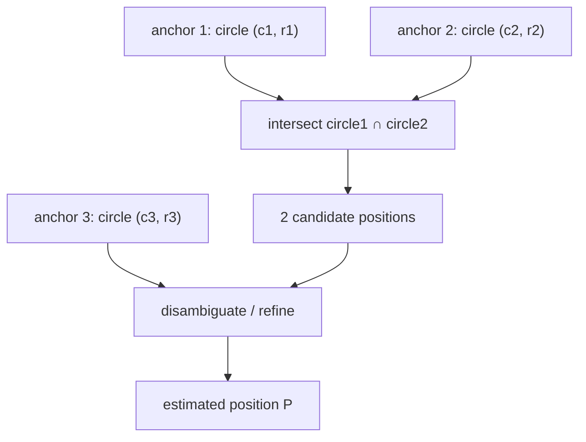

# Circle–Circle Intersection — Senior Level

> A textbook circle–circle intersection is twelve lines of code. A production system that *locates a phone from noisy tower distances*, *detects collisions among a million moving agents at 60 Hz*, or *computes coverage overlap across a sensor field* turns those twelve lines into the inner kernel of a much larger machine. At that point the algorithm is not the product — the noise model, the numerical robustness near tangency, the spatial pruning that avoids `O(n²)`, and the failure handling when "no intersection exists" are.

## Table of Contents

1. [Introduction](#1-introduction)
2. [Trilateration and GPS — From Two Circles to a Position](#2-trilateration-and-gps--from-two-circles-to-a-position)
3. [Noisy Trilateration — Least Squares and the Radical Center](#3-noisy-trilateration--least-squares-and-the-radical-center)
4. [Collision Detection Systems](#4-collision-detection-systems)
5. [Numerical Robustness Near Tangency and Concentricity](#5-numerical-robustness-near-tangency-and-concentricity)
6. [Batch and All-Pairs at Scale](#6-batch-and-all-pairs-at-scale)
7. [Architecture Patterns](#7-architecture-patterns)
8. [Code Examples — Robust Trilateration and Broad-Phase](#8-code-examples--robust-trilateration-and-broad-phase)
9. [Comparison at Scale](#9-comparison-at-scale)
10. [Observability](#10-observability)
11. [Failure Modes](#11-failure-modes)
12. [Capacity Planning](#12-capacity-planning)
13. [Summary](#13-summary)

---

## 1. Introduction

At senior level the question shifts from "where do two circles cross?" to "where does circle–circle intersection sit in my system, and what breaks when it does?" Three properties of the primitive drive every architectural decision:

- **It is a constraint solver in disguise.** Each circle is a distance constraint `|P - c| = r`. Two circles → two candidate positions. This is the heart of **trilateration**: GPS, indoor positioning, robot localization, seismology (locating earthquakes from arrival times).
- **It is the narrow-phase of collision.** "Do these two disks overlap?" is asked billions of times in physics engines, robotics, and simulation. The intersection test itself is O(1); the *number* of tests is the problem.
- **It is numerically delicate exactly where it matters most.** Tangency and concentricity — the boundaries — are where real, noisy data lives, and where naive code returns `NaN` or a wrong verdict.

This document covers the five questions a senior owns:

1. How do I turn distance measurements into a position, and what happens when the circles *don't* cleanly intersect because of noise?
2. How do I make a collision system test the *right* pairs instead of all `O(n²)` of them?
3. How do I keep the intersection numerically correct near tangency and at concentric configurations?
4. How do I batch and parallelize circle intersection across millions of circles?
5. How do I observe, alarm on, and plan capacity for a positioning or collision service?

---

## 2. Trilateration and GPS — From Two Circles to a Position

### 2.1 The core idea

You know your distance to several **anchors** (cell towers, Wi-Fi APs, GPS satellites projected to a plane, beacons). Each distance `r_i` from anchor `c_i` says "I am somewhere on the circle `(c_i, r_i)`." Intersecting two such circles gives **two** candidate positions; a third circle (or a domain constraint) selects the right one.



### 2.2 Why two anchors is not enough, and three usually is

Two perfect circles meet at two points — an ambiguity. The third circle, in the noiseless ideal, passes through exactly one of those two. In practice the third circle passes *near* one of them, which both **disambiguates** and lets you **refine**. This is why GPS needs at least 3 satellites for a 2-D fix (and 4 for 3-D plus clock bias).

### 2.3 The clean two-circle solve is the kernel

The a/h construction from `junior.md`/`middle.md` is the exact, noiseless two-circle solver. In a positioning pipeline it serves as:
- the **initializer** for an iterative least-squares refine (a good starting guess from two anchors), and
- the fast path when measurements are trustworthy (line-of-sight, low noise).

The senior insight: **the exact intersection is the special case; real systems live in the noisy, over-determined regime** of Section 3.

---

## 3. Noisy Trilateration — Least Squares and the Radical Center

### 3.1 The problem with real measurements

With noise, `n ≥ 3` circles almost never share a common point — they form a small "error triangle." There is no exact intersection to compute. Instead you **estimate** the position that best fits all constraints. Two standard formulations:

### 3.2 Linear least squares via the radical-axis trick

Subtracting pairs of circle equations (the radical-axis move from `middle.md`) cancels the quadratic `x² + y²` term and yields **linear** equations in `(x, y)`:
```
For anchors i and j:
  2(x_j - x_i)·x + 2(y_j - y_i)·y = (r_i² - r_j²) - (x_i² - x_j²) - (y_i² - y_j²)
```
Stack one such equation per pair (or each anchor against a reference anchor) into `A·p = b`, then solve the over-determined system by **normal equations** `p = (AᵀA)⁻¹ Aᵀ b` or, better, by QR/SVD for stability. This is a *closed-form, non-iterative* estimate — fast and robust enough for many systems. Geometrically, each linear equation is a radical axis; their common solution is the **radical center**, the natural noise-tolerant generalization of "where the circles cross."

### 3.3 Nonlinear least squares (Gauss–Newton / Levenberg–Marquardt)

Minimize the residual `Σ (|P - c_i| - r_i)²` directly. This respects the true distance metric (the linearized version slightly distorts it) and is the gold standard when accuracy matters. Seed it with the two-circle a/h estimate or the linear-LS solution; iterate to convergence. Robust loss (Huber) downweights outlier anchors (e.g. a multipath-corrupted tower).

| Method | Form | Cost | When |
|--------|------|------|------|
| Two-circle a/h | closed form | O(1) | 2 trustworthy anchors; initializer. |
| Linear LS (radical center) | closed form | O(n) build + small solve | ≥3 anchors, fast fix, mild noise. |
| Nonlinear LS (GN/LM) | iterative | O(iter · n) | Best accuracy, heavy noise, outliers. |

### 3.4 Geometry of dilution of precision (GDOP)

Even with good ranges, *where* the anchors sit relative to you controls accuracy. Anchors nearly collinear with the target (circles crossing at a shallow angle) make the intersection **ill-conditioned** — a small range error moves the estimate a lot. This is **GDOP**. Operationally: prefer anchors that surround the target; flag fixes computed from poor geometry.

---

## 4. Collision Detection Systems

### 4.1 Broad-phase vs narrow-phase

Circle–circle intersection is the **narrow-phase**: the exact O(1) test `d² ≤ (r1 + r2)²` between two specific disks. Running it for all `C(n, 2)` pairs is `O(n²)` — fatal beyond a few thousand objects. The **broad-phase** prunes to only the pairs that *could* collide, using spatial structure:

| Broad-phase | Idea | Best for |
|-------------|------|----------|
| Uniform grid / spatial hash | bucket by cell; test same/adjacent cells | uniform sizes, dense uniform fields |
| Sweep-and-prune | sort AABB intervals on one axis; test overlapping spans | mostly-1D motion, coherent frames |
| Quadtree / loose quadtree | recursive subdivision | non-uniform density |
| BVH (bounding-volume hierarchy) | tree of AABBs/bounding circles | static or slowly-moving scenes |

The pattern is always: **broad-phase narrows candidates to `O(n + k)`; narrow-phase runs the cheap squared-distance circle test on each candidate pair.**

### 4.2 Continuous vs discrete

Discrete collision tests the *current* frame's positions — fast objects can **tunnel** through each other between frames. Continuous collision detection (CCD) for two moving disks reduces to a **quadratic in time**: solve `|(c1(t) - c2(t))|² = (r1 + r2)²` for the earliest `t ∈ [0, 1]`. That is circle–circle intersection lifted to the time axis — still O(1) per pair, but it never misses a crossing.

### 4.3 The squared-distance test is the whole narrow-phase

For collision you almost never need the intersection *points* — only the boolean (and maybe the penetration depth `(r1 + r2) - d` and contact normal `û`). So the production narrow-phase is the no-`sqrt` test from `junior.md`, with `sqrt` computed only on a confirmed hit to get the contact data.

---

## 5. Numerical Robustness Near Tangency and Concentricity

### 5.1 Where the precision goes

The a/h construction has three numerically sensitive spots:

1. **`a = (d² + r1² - r2²) / (2d)`** — catastrophic cancellation when `r1 ≈ r2` and `d` is small (the numerator subtracts near-equal large squares). Mitigate by computing `r1² - r2² = (r1 - r2)(r1 + r2)`, which avoids forming two large squares and subtracting.
2. **`h = sqrt(r1² - a²)`** — near tangency `a → r1`, so `r1² - a² = (r1 - a)(r1 + a)` is a difference of near-equal quantities → relative error blows up, and rounding can make it slightly negative. Factor it and clamp to `≥ 0`.
3. **Division by `d`** — near-concentric (`d → 0`) magnifies all errors. Detect and branch.

### 5.2 Tolerances scaled to magnitude

A fixed `EPS = 1e-9` is wrong if coordinates are in millions or in micrometers. Use a **relative** tolerance: `EPS_eff = EPS * max(1, |c1|, |c2|, r1, r2)`. Tangency within `EPS_eff` is "touching." Document the data scale so the tolerance is meaningful.

### 5.3 The "almost tangent" decision

Real range data makes circles that *almost* touch. You must decide policy:
- **Collision:** treat near-tangent as touching (err toward detecting contact).
- **Trilateration:** if two range circles don't quite meet, project to the **midpoint of closest approach** on the line of centers rather than returning "no solution." This is the graceful degradation that keeps a positioning system producing answers under noise.

```python
def robust_two_circle(c1, r1, c2, r2, eps=1e-9):
    import math
    d = math.hypot(c2[0]-c1[0], c2[1]-c1[1])
    scale = max(1.0, abs(c1[0]), abs(c1[1]), abs(c2[0]), abs(c2[1]), r1, r2)
    e = eps * scale
    if d < e:                         # concentric: no usable direction
        return []                     # caller falls back to other anchors
    # Stable a: factor r1²-r2² to avoid cancellation.
    a = (d*d + (r1 - r2)*(r1 + r2)) / (2*d)
    h2 = (r1 - a) * (r1 + a)          # = r1² - a², factored
    ux, uy = (c2[0]-c1[0])/d, (c2[1]-c1[1])/d
    fx, fy = c1[0] + a*ux, c1[1] + a*uy
    if h2 < -e:                       # circles miss: project to closest approach
        return [(fx, fy)]             # graceful: best single estimate
    h = math.sqrt(max(0.0, h2))
    if h < e:
        return [(fx, fy)]             # tangent: one point
    return [(fx - h*uy, fy + h*ux), (fx + h*uy, fy - h*ux)]
```

---

## 6. Batch and All-Pairs at Scale

### 6.1 The O(n²) wall

"Which of `n` circles overlap which?" naively is `O(n²)` intersection tests. For sensor-coverage analysis, particle simulation, or map-overlap queries with `n` in the millions, that is hopeless. Spatial partitioning brings it to roughly `O(n + k)` where `k` is the number of *actually-overlapping* pairs.

### 6.2 Uniform grid for similar-radius circles

If radii are within a bounded ratio, choose a cell size `≈ 2·max_radius`. Each circle touches a small constant number of cells; two circles can only overlap if they share or neighbor a cell. Bucket all circles, then test only within-cell and adjacent-cell pairs.

### 6.3 Widely varying radii

A single grid size fails when radii span orders of magnitude (a tiny circle and a continent-sized one). Options: a **hierarchical grid** (multiple resolutions, insert each circle at the level matching its size), a **loose quadtree**, or **sort-by-radius + sweep**. The principle is unchanged: never test a pair the spatial structure proves cannot overlap.

### 6.4 Parallelism

Circle tests are embarrassingly parallel and have no shared mutable state for the *test* itself (the output set is append-only). Partition the grid cells across threads/cores; each cell's candidate pairs are independent. On GPUs, the squared-distance test is a perfect SIMT kernel; the broad-phase grid build is the harder part (parallel radix sort by cell id is the standard approach).

---

## 7. Architecture Patterns

### 7.1 Two-phase positioning pipeline

```
ranges ──► outlier filter ──► linear-LS seed (radical center) ──► nonlinear-LS refine ──► fix + covariance
            (drop NLOS)        (closed form, O(n))                (GN/LM, robust loss)     (report GDOP)
```
The closed-form two-circle / radical-center stage gives a cheap, robust seed; the iterative stage delivers accuracy. Always emit a **covariance / GDOP** so consumers know how much to trust the fix.

### 7.2 Broad-phase + narrow-phase collision loop

```
each frame:
  update positions
  rebuild / refit spatial structure (grid or BVH)
  for each candidate pair from broad-phase:
      if d² ≤ (r1+r2)²:  narrow-phase hit → resolve (impulse, separation)
```
Rebuild the grid every frame for fast-moving agents; *refit* (not rebuild) a BVH for slowly-moving scenes.

### 7.3 Snapshot-and-query for coverage analytics

For "what's the total area covered by `n` overlapping sensor disks?", build the spatial index once, then answer overlap and lens-area queries against an immutable snapshot. Union-of-disks area uses an arrangement / inclusion–exclusion-on-arcs algorithm whose primitive is — again — circle–circle intersection points.

---

## 8. Code Examples — Robust Trilateration and Broad-Phase

### 8.1 Linear-least-squares trilateration (radical-center solve)

#### Go

```go
package main

import (
	"errors"
	"fmt"
	"math"
)

type Anchor struct {
	X, Y, R float64 // center and measured range
}

// Trilaterate solves for position by linear least squares (radical-axis form).
// Needs >= 3 anchors; returns the best-fit (x, y).
func Trilaterate(anchors []Anchor) (float64, float64, error) {
	n := len(anchors)
	if n < 3 {
		return 0, 0, errors.New("need at least 3 anchors")
	}
	// Subtract anchor[0]'s equation from each other to linearize.
	a0 := anchors[0]
	// Normal-equation accumulators for [ [Sxx Sxy] [Sxy Syy] ] p = [bx by].
	var sxx, sxy, syy, bx, by float64
	for i := 1; i < n; i++ {
		ai := anchors[i]
		ax := 2 * (ai.X - a0.X)
		ay := 2 * (ai.Y - a0.Y)
		c := (a0.R*a0.R - ai.R*ai.R) -
			(a0.X*a0.X - ai.X*ai.X) - (a0.Y*a0.Y - ai.Y*ai.Y)
		sxx += ax * ax
		sxy += ax * ay
		syy += ay * ay
		bx += ax * c
		by += ay * c
	}
	det := sxx*syy - sxy*sxy
	if math.Abs(det) < 1e-12 {
		return 0, 0, errors.New("degenerate anchor geometry (high GDOP)")
	}
	x := (syy*bx - sxy*by) / det
	y := (sxx*by - sxy*bx) / det
	return x, y, nil
}

func main() {
	anchors := []Anchor{
		{0, 0, 5},
		{8, 0, 5},
		{4, 6, math.Hypot(4-4, 3-6)}, // true point (4,3): range 3
	}
	x, y, err := Trilaterate(anchors)
	fmt.Println(x, y, err) // ~4, ~3, <nil>
}
```

#### Java

```java
public class Trilateration {
    record Anchor(double x, double y, double r) {}

    static double[] trilaterate(Anchor[] a) {
        int n = a.length;
        if (n < 3) throw new IllegalArgumentException("need >= 3 anchors");
        Anchor a0 = a[0];
        double sxx = 0, sxy = 0, syy = 0, bx = 0, by = 0;
        for (int i = 1; i < n; i++) {
            double ax = 2 * (a[i].x() - a0.x());
            double ay = 2 * (a[i].y() - a0.y());
            double c = (a0.r() * a0.r() - a[i].r() * a[i].r())
                     - (a0.x() * a0.x() - a[i].x() * a[i].x())
                     - (a0.y() * a0.y() - a[i].y() * a[i].y());
            sxx += ax * ax; sxy += ax * ay; syy += ay * ay;
            bx += ax * c;   by += ay * c;
        }
        double det = sxx * syy - sxy * sxy;
        if (Math.abs(det) < 1e-12)
            throw new ArithmeticException("degenerate geometry (high GDOP)");
        double x = (syy * bx - sxy * by) / det;
        double y = (sxx * by - sxy * bx) / det;
        return new double[]{x, y};
    }

    public static void main(String[] args) {
        Anchor[] a = {
            new Anchor(0, 0, 5),
            new Anchor(8, 0, 5),
            new Anchor(4, 6, 3)
        };
        double[] p = trilaterate(a);
        System.out.printf("%.3f %.3f%n", p[0], p[1]); // ~4.000 3.000
    }
}
```

#### Python

```python
import math


def trilaterate(anchors):
    """anchors: list of (x, y, r). Linear LS (radical-axis) solve. >=3 anchors."""
    if len(anchors) < 3:
        raise ValueError("need at least 3 anchors")
    x0, y0, r0 = anchors[0]
    sxx = sxy = syy = bx = by = 0.0
    for x, y, r in anchors[1:]:
        ax = 2 * (x - x0)
        ay = 2 * (y - y0)
        c = (r0 * r0 - r * r) - (x0 * x0 - x * x) - (y0 * y0 - y * y)
        sxx += ax * ax; sxy += ax * ay; syy += ay * ay
        bx += ax * c;   by += ay * c
    det = sxx * syy - sxy * sxy
    if abs(det) < 1e-12:
        raise ArithmeticError("degenerate geometry (high GDOP)")
    x = (syy * bx - sxy * by) / det
    y = (sxx * by - sxy * bx) / det
    return x, y


if __name__ == "__main__":
    anchors = [(0, 0, 5), (8, 0, 5), (4, 6, 3)]  # true point (4, 3)
    print(trilaterate(anchors))  # ~ (4.0, 3.0)
```

### 8.2 Grid broad-phase for overlapping disks

#### Python

```python
from collections import defaultdict


def overlapping_pairs(circles, cell):
    """circles: list of (x, y, r). Returns index pairs whose disks overlap.
       cell should be >= 2 * max radius for correctness with a uniform grid."""
    grid = defaultdict(list)

    def key(x, y):
        return (int(x // cell), int(y // cell))

    # Bucket each circle into the cells its bounding box touches.
    for i, (x, y, r) in enumerate(circles):
        cells = {key(x + dx * r, y + dy * r)
                 for dx in (-1, 0, 1) for dy in (-1, 0, 1)}
        for c in cells:
            grid[c].append(i)

    seen, pairs = set(), []
    for bucket in grid.values():
        for a in range(len(bucket)):
            for b in range(a + 1, len(bucket)):
                i, j = bucket[a], bucket[b]
                e = (i, j) if i < j else (j, i)
                if e in seen:
                    continue
                seen.add(e)
                xi, yi, ri = circles[i]
                xj, yj, rj = circles[j]
                dx, dy = xi - xj, yi - yj
                if dx * dx + dy * dy <= (ri + rj) ** 2:  # narrow-phase, no sqrt
                    pairs.append(e)
    return pairs


if __name__ == "__main__":
    circles = [(0, 0, 5), (8, 0, 5), (100, 100, 2), (101, 100, 2)]
    print(overlapping_pairs(circles, cell=10))  # [(0, 1), (2, 3)]
```

The same structure parallelizes by handing disjoint cells to worker threads; the squared-distance narrow-phase is exact for integer coordinates.

---

## 9. Comparison at Scale

| Concern | Naive | Senior approach | Win |
|---------|-------|-----------------|-----|
| All-pairs overlap | O(n²) tests | grid/BVH broad-phase + O(1) narrow | O(n + k) |
| Position from ranges | exact 2-circle (fails on noise) | linear-LS seed + nonlinear refine | robust, accurate |
| Fast objects | discrete (tunneling) | CCD: quadratic-in-time test | no missed hits |
| Tangency verdict | float `==` | scaled `EPS`, factored radicand | correct boundary |
| Concentric | divide by `d` → NaN | branch `d < EPS_eff` | no crash |
| Overlap boolean | full a/h + sqrt | squared-distance test | several× faster |

---

## 10. Observability

A positioning or collision service is invisible until it returns a bad answer. Instrument from day one.

| Metric | Type | Why |
|--------|------|-----|
| `fix_residual_meters` | histogram | LS residual; large ⇒ noisy ranges or bad geometry. |
| `gdop` | histogram | Geometry quality; spikes ⇒ ambiguous/ill-conditioned fixes. |
| `anchors_used` | histogram | Too few ⇒ unreliable; trend down ⇒ losing signal. |
| `trilaterate_fallback_total` | counter | How often circles missed and we projected to closest approach. |
| `narrow_phase_tests` | histogram | Broad-phase effectiveness; spikes ⇒ pruning degraded (clustering). |
| `collision_pairs` | histogram | Actual hits per frame; sudden jumps ⇒ instability or clumping. |
| `nan_guard_trips` | counter | How often a radicand/`acos` clamp fired — a precision canary. |

The most useful pair is `narrow_phase_tests` vs `collision_pairs`: if tests balloon while real pairs stay flat, your broad-phase grid is mis-sized for the current radius distribution.

---

## 11. Failure Modes

### 11.1 No intersection under noise
Two range circles fall short of meeting. Naive code returns "no solution" and the position pipeline stalls. Mitigation: project to the midpoint of closest approach on the line of centers (Section 5.3); rely on the over-determined LS solve rather than any single pair.

### 11.2 Concentric / near-concentric anchors
Two anchors at (nearly) the same location give `d ≈ 0` — no usable direction, division blows up. Mitigation: branch on `d < EPS_eff`; de-duplicate anchors; require geometric diversity.

### 11.3 High GDOP (collinear geometry)
Anchors nearly in a line make the intersection angle shallow; tiny range errors → huge position errors, and the LS normal matrix is near-singular (`det ≈ 0`). Mitigation: compute and report GDOP; reject or flag fixes from poor geometry; choose anchors that surround the target.

### 11.4 Tangency misclassification
Float `==` declares a clean tangent that noise never actually produces, or misses a real touch. Mitigation: scaled `EPS`; factored radicand; explicit policy for "near-tangent counts as touching."

### 11.5 Broad-phase mis-sizing
A uniform grid with cells far from `2·max_radius` either over-buckets (every circle in one cell → O(n²) again) or misses overlaps (cells too small). Mitigation: size cells to the radius distribution; switch to a hierarchical grid for wide radius spreads.

### 11.6 Tunneling
Fast disks pass through each other between discrete frames. Mitigation: continuous collision detection (the quadratic-in-time test) for high-velocity objects.

### 11.7 Outlier / NLOS ranges
A multipath (non-line-of-sight) measurement reports a range far too long, dragging the LS fit. Mitigation: robust loss (Huber), RANSAC over anchor subsets, or residual-based outlier rejection.

---

## 12. Capacity Planning

### 12.1 Positioning throughput
A linear-LS fix is a few dozen flops plus a 2×2 solve — millions of fixes/sec/core. Nonlinear refine costs `O(iter · n)`; with `n ≈ 4–8` anchors and `~5` iterations, still hundreds of thousands of fixes/sec/core. Positioning is rarely CPU-bound; the cost is usually I/O and measurement acquisition.

### 12.2 Collision throughput
Narrow-phase squared-distance tests run at ~hundreds of millions/sec/core (no `sqrt`, branch-light). The budget is dominated by broad-phase: grid rebuild is `O(n)` but cache-bound; with `n = 10⁶` agents, expect the grid build and candidate generation, not the circle test, to dominate. Plan for `O(n + k)` work where `k` ≈ overlap count, and parallelize over cells.

### 12.3 Memory
Each circle is 3 floats (24 bytes) plus its grid-bucket membership. A uniform grid adds `O(cells + n·avg_buckets)` integers. For `10⁶` circles at ~4 buckets each, that's a few tens of MB — fits comfortably in RAM; the access pattern (random bucket scatter) is the real cost, so a Morton/Z-order layout for spatial locality pays off.

### 12.4 Precision budget
Double precision (`float64`) gives ~15–16 significant digits. With coordinates up to `10⁶`, you retain ~9–10 digits after the squaring in `d²` — adequate for meter-scale positioning and pixel-scale collision. For sub-millimeter work at large coordinates, **shift the origin** to the local centroid before computing, recovering precision lost to large-magnitude cancellation.

### 12.5 Sizing example
Target: locate `50,000` tags/sec from 4-anchor ranges with sub-meter accuracy. Linear-LS seed + 3 GN iterations ≈ a few µs each ⇒ a single core handles it with headroom. The engineering effort goes to **measurement quality** (NLOS filtering, GDOP-aware anchor selection), not raw compute.

---

## 12B. Weighting, Anchor Selection, and Degradation Policy

Beyond raw throughput, three policy decisions separate a toy trilaterator from a deployable one.

### 12B.1 Weighting unequal-quality ranges
Not all anchors are equal: a near anchor with strong line-of-sight is more trustworthy than a far, multipath-prone one. Weight each constraint by `1/σ_i²` where `σ_i` is the per-anchor range variance (estimated from RSSI, SNR, or a calibration model). The weighted least-squares fit `argmin Σ (1/σ_i²)(|p−c_i|−r_i)²` then leans on the good anchors. A practical heuristic when variances are unknown: weight by `1/r_i` (closer anchors are usually better) or drop anchors whose post-fit residual exceeds `kσ`.

### 12B.2 Anchor selection for good geometry
If you can *choose* which anchors to use (e.g. you hear 8 beacons but want the best 4), pick the subset minimizing GDOP, not the 4 strongest signals. A greedy add — start with the two anchors whose circles cross most perpendicularly, then add anchors that most reduce `trace((JᵀJ)⁻¹)` — gives near-optimal geometry cheaply. Anchors surrounding the target beat anchors clustered on one side, even if the latter have stronger signals.

### 12B.3 Graceful degradation ladder
A robust positioning service never simply fails. Define a fallback ladder:
1. **Full WLS fix** from all good anchors (report covariance/GDOP).
2. If GDOP exceeds a threshold, **report the fix but flag low confidence**.
3. If fewer than 3 usable anchors remain, fall back to **two-circle intersection** (two candidates) plus a motion/map prior to disambiguate.
4. If circles miss under noise, project to the **closest-approach midpoint** (Section 5.3).
5. If a single anchor remains, report **last-known position + dead reckoning** rather than nothing.

Each rung produces an answer with an honest confidence label, which downstream consumers (UI, geofencing, routing) can act on.

### 12B.4 Worked degradation example
A warehouse tag normally hears 5 UWB anchors. A forklift parks, blocking 3 of them (NLOS). The service: drops the 3 high-residual anchors (12B.1), finds only 2 reliable anchors remain, falls back to two-circle intersection producing candidates `A` and `B`, then uses the tag's last position and max speed to reject `B` (8 m away in 0.1 s is impossible) and reports `A` flagged "2-anchor, low confidence." This is circle–circle intersection doing exactly the job the rest of the system needs — and is why the primitive earns its place in the pipeline.

---

## 12C. Decision Guide — Which Tool for Which Problem

A senior is judged on picking the right variant, not on reciting the a/h formula. The guide below maps the symptom to the tool.

| You need… | Reach for | Why not the others |
|-----------|-----------|--------------------|
| "Do these two disks touch?" at high frequency | squared-distance test `d² ≤ (r1+r2)²` | full a/h wastes a `sqrt`; you don't need the points |
| The actual crossing points (two anchors, clean data) | a/h construction | LS is overkill for 2 noiseless circles |
| A position from ≥3 noisy ranges | linear-LS seed → nonlinear refine | exact intersection has no solution under noise |
| "Which of n circles overlap?" | broad-phase index + squared test | O(n²) all-pairs is fatal past a few thousand |
| Fast objects, no missed hits | continuous (quadratic-in-time) test | discrete frames tunnel |
| Overlap *amount* (coverage, IoU) | lens-area (two segments) | the points alone don't give area |
| Certified classification (no `ε`) | sign predicates `S₊, S₋` | float `==` is unreliable at the boundary |
| Compose three circles robustly | radical center / LS | pairwise intersection alone doesn't fuse three |

The recurring senior instinct: **don't compute more than the question asks.** A boolean wants the squared test; a position wants least squares; an area wants the lens formula. Matching the computation to the need is most of the performance and most of the robustness.

---

## 13. Summary

- Circle–circle intersection is a **constraint solver** (trilateration/GPS) and a **collision narrow-phase**; at scale, the surrounding machinery matters more than the twelve-line kernel.
- Noiseless two-circle intersection is the **special case**; real positioning is **over-determined least squares** — linearize via the radical-axis trick for a closed-form seed, refine with Gauss–Newton/LM, and report GDOP/covariance.
- Collision systems pair an **O(1) squared-distance narrow-phase** with a **broad-phase** (grid, sweep-and-prune, BVH) that turns `O(n²)` into `O(n + k)`; fast objects need **continuous** (quadratic-in-time) detection.
- **Robustness** lives at the boundaries: factor `r1² - r2²` and `r1² - a²` to avoid cancellation, scale `EPS` to the data, branch concentric cases before dividing, and clamp every radicand and `acos` argument.
- **Observe** residuals, GDOP, fallback counts, and narrow-phase test counts; each localizes whether a problem is measurement noise, geometry, or a mis-sized index.
- Guard against no-intersection-under-noise, near-concentric anchors, high GDOP, tangency misclassification, broad-phase mis-sizing, tunneling, and outlier ranges — each is a real incident, not a footnote.

References to study further: GPS/GNSS positioning (Misra & Enge), least-squares trilateration and GDOP, real-time collision detection (Ericson, *Real-Time Collision Detection*), spatial hashing and sweep-and-prune for broad-phase, and the union-of-disks area / arrangement literature.

---

Next step: continue to [`professional.md`](./professional.md) for the formal derivation of the intersection-point and lens-area formulas, the radical-axis theory, and a rigorous degeneracy/robustness analysis.
