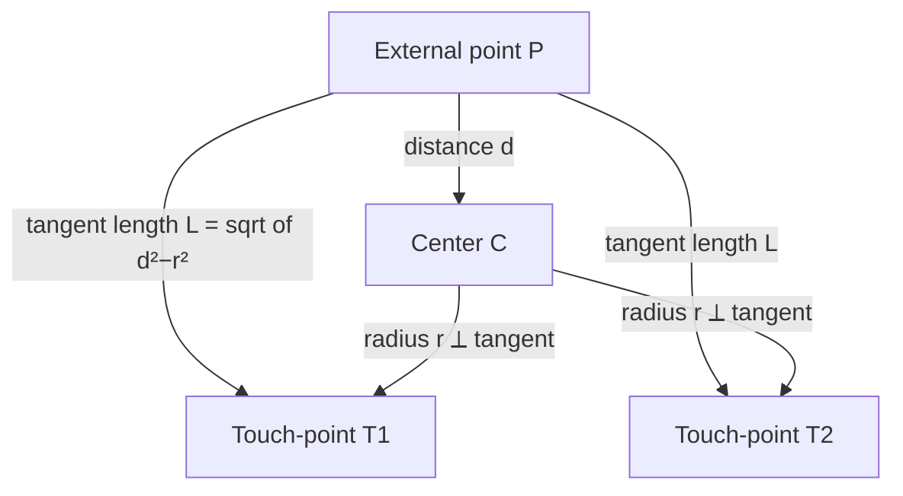
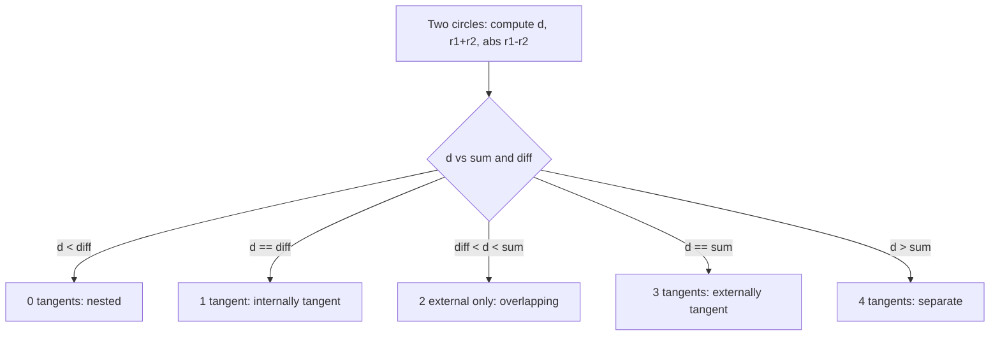

# Circle Tangents — Junior Level

> **One-line summary:** A **tangent line** touches a circle at exactly one point. From a point *outside* a circle you can draw exactly **two** tangents, each of length `sqrt(d² − r²)` where `d` is the distance from the point to the center and `r` the radius. Between two circles there are up to **four** common tangents (two *external*, two *internal*), and the count `0..4` depends on how the circles sit relative to each other.

---

## Table of Contents

1. [Introduction](#introduction)
2. [Prerequisites](#prerequisites)
3. [Glossary](#glossary)
4. [Core Concepts](#core-concepts)
5. [Big-O Summary](#big-o-summary)
6. [Real-World Analogies](#real-world-analogies)
7. [Pros & Cons](#pros--cons)
8. [Step-by-Step Walkthrough](#step-by-step-walkthrough)
9. [Code Examples](#code-examples)
10. [Coding Patterns](#coding-patterns)
11. [Error Handling](#error-handling)
12. [Performance Tips](#performance-tips)
13. [Best Practices](#best-practices)
14. [Edge Cases & Pitfalls](#edge-cases--pitfalls)
15. [Common Mistakes](#common-mistakes)
16. [Cheat Sheet](#cheat-sheet)
17. [Visual Animation](#visual-animation)
18. [Summary](#summary)
19. [Further Reading](#further-reading)

---

## Introduction

A **tangent** to a circle is a line that *grazes* it — it touches the circle at a single point, the **point of tangency**, and does not cross into the interior. Picture a billiard ball resting on a flat table: the tabletop is tangent to the ball, touching it at exactly one point directly underneath.

This topic answers two practical questions you will meet again and again in geometry, games, and robotics:

1. **Tangents from a point.** Given a circle and a point *outside* it, what are the two lines through that point that just touch the circle? Where do they touch? How long is the segment from the point to each touch-point?
2. **Common tangents between two circles.** Given two circles, what are the lines that are tangent to *both* at once? There can be anywhere from **0 to 4** of them, and which case you are in tells you whether the circles are nested, touching, overlapping, or far apart.

The single most important fact, and the one to memorize first, is the **radius–tangent perpendicularity** property:

> At the point where a line touches a circle, the **radius drawn to that point is perpendicular to the tangent line**.

Everything in this topic — the tangent-length formula, the construction of the touch-points, the whole common-tangent classification — falls out of that one right angle. Once you see the right triangle hiding in every tangent picture, the formulas stop being magic.

A second anchor: this topic is the *circle* sibling of *14-circle-circle-intersection*. There, two circles meet at **0, 1, or 2 points**; here, lines touch circles. The two are duals of each other, and they share the exact same "how do the circles sit?" classification (far apart / touching outside / overlapping / touching inside / nested).

---

## Prerequisites

Before reading this file you should be comfortable with:

- **2-D points and vectors** — a point is `(x, y)`; a vector has length (magnitude) and direction.
- **Distance formula** — `dist((x1,y1),(x2,y2)) = sqrt((x2−x1)² + (y2−y1)²)`.
- **The circle equation** — a circle is center `C = (cx, cy)` and radius `r`; a point `P` is *inside* if `dist(P,C) < r`, *on* if `= r`, *outside* if `> r`.
- **The Pythagorean theorem** — `a² + b² = c²` in a right triangle. This is the whole engine of the tangent-length formula.
- **Basic trigonometry** — `sin`, `cos`, and `atan2(y, x)` to turn an angle into a direction and back. (`atan2` is the two-argument arctangent that returns the correct quadrant.)
- **Rotating a vector** — rotating `(x, y)` by angle `θ` gives `(x·cosθ − y·sinθ, x·sinθ + y·cosθ)`.

Optional but helpful:

- Familiarity with *13-circle-line-intersection* (the reverse question: where a *given* line meets a circle).
- A rough memory of the dot product `a·b = |a||b|cosθ`, used to compute angles cleanly.

---

## Glossary

| Term | Meaning |
|------|---------|
| **Tangent line** | A line that touches a circle at exactly one point and never enters its interior. |
| **Point of tangency / touch-point** | The single point where the tangent meets the circle. |
| **External point** | A point lying *outside* the circle (`dist(P, C) > r`); the source of two tangents. |
| **Tangent length** | The distance from an external point `P` to a touch-point: `L = sqrt(d² − r²)`, with `d = dist(P, C)`. |
| **Common tangent** | A line tangent to **two** circles simultaneously. |
| **External (direct) tangent** | A common tangent that does **not** pass between the two circles; both circles sit on the *same* side of it. |
| **Internal (transverse) tangent** | A common tangent that passes **between** the two circles, crossing the segment joining the centers. |
| **Signed distance** | The distance from a point to a line carrying a `+`/`−` sign that tells you which side of the line the point is on. |
| **Homothety / similarity center** | The point from which one circle is a scaled copy of the other; external and internal tangent pairs each meet at one such center. |
| **Degenerate case** | A boundary configuration (point on the circle, equal circles, tangent circles) where the count changes or a formula divides by zero. |
| **`atan2(y, x)`** | Two-argument arctangent giving the angle of vector `(x, y)` in the correct quadrant, range `(−π, π]`. |

---

## Core Concepts

### 1. The radius is perpendicular to the tangent

This is *the* property. If a line touches a circle of center `C` at point `T`, then segment `C→T` (a radius, length `r`) makes a **90° angle** with the tangent line. Why? Among all points on the tangent line, `T` is the closest one to `C` (every other point on the line is *outside* the circle, hence farther than `r`). The closest point on a line to an external point is always the foot of the perpendicular. So `CT ⟂ tangent`.

### 2. Tangents from an external point and the tangent-length formula

Let `P` be a point with `d = dist(P, C) > r`. Draw a tangent from `P` touching the circle at `T`. Triangle `P–T–C` has a **right angle at `T`** (by Concept 1). The hypotenuse is `PC = d`; one leg is the radius `CT = r`; the other leg is the tangent segment `PT = L`. Pythagoras gives:

```
L² + r² = d²   ⇒   L = sqrt(d² − r²)
```

Because the picture is symmetric across the line `PC`, there are exactly **two** such tangents, one on each side, both of the same length `L`. The half-angle `α` at `P` between line `PC` and a tangent satisfies `sin α = r / d`.



### 3. Finding the actual touch-points

Two clean ways to get `T1` and `T2`:

- **Angle method.** Let `β = atan2(C.y − P.y, C.x − P.x)` be the direction from `P` to `C`, and `α = acos(r / d)` the half-angle at `C` … (most easily expressed via the tangency right triangle). A simpler symmetric statement: the touch-points lie at angle `±acos(r/d)` *measured at the center* from the direction `C→P`. So with `φ = atan2(P.y − C.y, P.x − C.x)` and `θ = acos(r / d)`, the touch-points are `C + r·(cos(φ±θ), sin(φ±θ))`.
- **Intersection method.** The touch-points are exactly the intersection of the original circle with the **circle drawn on diameter `PC`** (Thales' circle). That second circle has center `M = midpoint(P, C)` and radius `d/2`. Any point on it sees `PC` at a right angle — precisely the tangency condition. So `{T1, T2} = original_circle ∩ Thales_circle`, which reduces to the *14-circle-circle-intersection* routine.

### 4. Common tangents as "lines at signed distance r from each center"

The unifying idea for two circles is to describe a line by its **unit normal** `(a, b)` (with `a² + b² = 1`) and offset `c`, as `a·x + b·y + c = 0`. The signed distance from a center `C = (cx, cy)` to this line is `a·cx + b·cy + c`. A line is tangent to circle `i` exactly when that signed distance equals `±rᵢ`:

```
a·c1x + b·c1y + c = σ1 · r1
a·c2x + b·c2y + c = σ2 · r2
```

where each `σ` is `+1` or `−1`. The choice `σ1 = σ2` gives the **external** tangents; `σ1 = −σ2` gives the **internal** tangents. Subtracting the two equations eliminates `c` and leaves a single equation in `(a, b)` that, together with `a² + b² = 1`, yields up to two solutions per sign-choice — hence up to four tangents total. (The full algebra is in `professional.md`; here just hold the shape of it.)

### 5. The 0–4 count depends on the circle relationship

Exactly like circle–circle *intersection*, the number of common tangents is governed by `d = dist(C1, C2)` versus `r1 + r2` and `|r1 − r2|`:

| Relationship | Condition (assume `r1 ≥ r2`) | External | Internal | Total |
|--------------|------------------------------|:--------:|:--------:|:-----:|
| One inside the other, no touch | `d < r1 − r2` | 0 | 0 | **0** |
| Internally tangent | `d = r1 − r2` | 1 | 0 | **1** |
| Overlapping (two intersection pts) | `r1 − r2 < d < r1 + r2` | 2 | 0 | **2** |
| Externally tangent | `d = r1 + r2` | 2 | 1 | **3** |
| Separate / far apart | `d > r1 + r2` | 2 | 1 | **4** |

This table is worth memorizing — it is the heart of the topic and reappears in every level. (Equal circles, `r1 = r2`, is a special sub-case: the two external tangents become **parallel**, and they meet at a center "at infinity." More on that under Edge Cases.)

---

## Big-O Summary

All of these are **O(1)** — pure arithmetic on a constant number of points and radii. There is no input to scan that grows with `n`; the "size" is always one or two circles. The numbers below count roughly how much work each does, all constant time.

| Operation | Time | Space | Notes |
|-----------|------|-------|-------|
| Distance `d = dist(P, C)` | O(1) | O(1) | One `sqrt`. |
| Tangent length `L = sqrt(d² − r²)` | O(1) | O(1) | One subtraction, one `sqrt`. |
| Touch-points from external point | O(1) | O(1) | A couple of trig calls (or a circle–circle intersection). |
| Classify two circles (0–4 count) | O(1) | O(1) | Compare `d` with `r1±r2`. |
| One external common tangent | O(1) | O(1) | Solve a 2×2-ish system. |
| All up-to-4 common tangents | O(1) | O(1) | Four sign-choices, each O(1). |

> If you process **n** circles or **n** query points, you simply multiply by `n`: e.g. tangents from one point to `n` circles is `O(n)`. The per-pair work never stops being constant.

---

## Real-World Analogies

| Concept | Analogy |
|---------|---------|
| Tangent line | A ruler laid against the edge of a coin so it just kisses the rim at one spot. |
| Two tangents from a point | Holding a flashlight at a round pillar: the two edges of the light beam that graze the pillar are the two tangents from your eye. |
| Tangent length `sqrt(d²−r²)` | The straight reach of a rope from your hand to the point where it leaves a circular post you are lassoing. |
| External (direct) common tangent | The **outer** edge of a flat conveyor belt wrapping two pulleys — the belt stays on one side of both wheels. |
| Internal (transverse) common tangent | A **crossed** belt (figure-eight) running between two pulleys spinning opposite ways — it passes *between* the wheels. |
| The 0–4 count | How many straight taut strings you can stretch touching both of two coins on a table, depending on whether they overlap, touch, or sit apart. |
| Radius ⟂ tangent | A bicycle spoke at the bottom of the wheel points straight down to the road it touches. |

Where the analogy breaks: a real belt has thickness and friction; the geometric tangent is an idealized zero-width line, and "internal" tangents only physically exist for a *crossed* belt, which is unusual in practice.

---

## Pros & Cons

| Pros | Cons |
|------|------|
| Closed-form, `O(1)` formulas — no iteration, no convergence worries. | Floating-point near-degenerate cases (point *on* the circle, tangent circles) need careful epsilon handling. |
| The whole topic reduces to one right-angle fact — easy to re-derive from scratch. | Equal-radius circles make external tangents *parallel*, breaking the "tangents meet at a point" shortcut. |
| Reuses *circle–circle intersection* (Thales' circle trick) — little new code. | The signed-distance formulation has sign-choice bookkeeping (`σ1, σ2`) that is easy to get backwards. |
| Same 0–4 classification as circle intersection — one mental model covers both. | A point *inside* the circle yields **no** real tangent; you must check `d > r` first. |
| Foundation for shortest paths around circular obstacles (tangent graphs, Dubins paths). | Touch-point reconstruction via trig can lose precision when `r/d` is very close to 1. |

**When to use:** computing visibility/grazing lines, belt-and-pulley layouts, motion-planning around circular obstacles (tangent graphs), constructing the boundary of a Minkowski-inflated round robot, any "just-touching" geometry.

**When NOT to use:** when you actually want where a *given* line meets a circle (that is *13-circle-line-intersection*), or where two circles *cross* (that is *14-circle-circle-intersection*). Tangents are the "touch, don't cross" case.

---

## Step-by-Step Walkthrough

**Tangents from an external point.** Circle: center `C = (0, 0)`, radius `r = 3`. Point: `P = (5, 0)`.

```
Step 1. Distance from P to C:
        d = sqrt((5-0)² + (0-0)²) = 5.
        Is P outside?  d = 5 > r = 3  → yes, two tangents exist.

Step 2. Tangent length:
        L = sqrt(d² − r²) = sqrt(25 − 9) = sqrt(16) = 4.
        Each tangent segment from P to its touch-point is 4 long.

Step 3. Half-angle at the center between C→P and C→touchpoint:
        θ = acos(r / d) = acos(3 / 5) = acos(0.6) ≈ 53.13°.

Step 4. Direction from C to P:
        φ = atan2(P.y − C.y, P.x − C.x) = atan2(0, 5) = 0°.

Step 5. Touch-points = C + r·(cos(φ ± θ), sin(φ ± θ)):
        T1 = (3·cos(+53.13°), 3·sin(+53.13°)) = (1.8,  2.4)
        T2 = (3·cos(−53.13°), 3·sin(−53.13°)) = (1.8, −2.4)

Step 6. Sanity check:  PT1 length = sqrt((5−1.8)² + (0−2.4)²)
                              = sqrt(3.2² + 2.4²) = sqrt(10.24+5.76) = sqrt(16) = 4. ✓
        And CT1·PT1 should be 0 (perpendicular):
        CT1 = (1.8, 2.4), PT1 = (1.8−5, 2.4−0) = (−3.2, 2.4)
        dot = 1.8·(−3.2) + 2.4·2.4 = −5.76 + 5.76 = 0. ✓
```

**Counting common tangents.** Circle 1: `C1 = (0,0)`, `r1 = 3`. Circle 2: `C2 = (10, 0)`, `r2 = 2`.

```
d = dist(C1, C2) = 10.
r1 + r2 = 5,   r1 − r2 = 1.
Is d > r1 + r2 ?  10 > 5  → yes.
→ Circles are separate / far apart → 4 common tangents (2 external, 2 internal).
```

Move `C2` to `(4, 0)`: now `d = 4`, and `r1 − r2 = 1 < 4 < 5 = r1 + r2`, so the circles **overlap** → only the **2 external** tangents exist, no internal ones. The internal tangents vanish exactly when the circles start to overlap.

---

## Code Examples

### Example: Tangent length, touch-points, and common-tangent count

#### Go

```go
package main

import (
	"fmt"
	"math"
)

type Pt struct{ X, Y float64 }

const EPS = 1e-9

func dist(a, b Pt) float64 {
	return math.Hypot(a.X-b.X, a.Y-b.Y)
}

// TangentLength returns sqrt(d²−r²) and ok=false if P is inside the circle.
func TangentLength(p, c Pt, r float64) (float64, bool) {
	d := dist(p, c)
	if d < r-EPS {
		return 0, false // P is inside: no real tangent
	}
	return math.Sqrt(math.Max(0, d*d-r*r)), true
}

// TangentTouchPoints returns the two points where tangents from P touch the circle.
func TangentTouchPoints(p, c Pt, r float64) ([]Pt, bool) {
	d := dist(p, c)
	if d < r-EPS {
		return nil, false
	}
	phi := math.Atan2(p.Y-c.Y, p.X-c.X)   // direction C → P
	theta := math.Acos(clamp(r/d, -1, 1)) // half-angle at the center
	t1 := Pt{c.X + r*math.Cos(phi+theta), c.Y + r*math.Sin(phi+theta)}
	t2 := Pt{c.X + r*math.Cos(phi-theta), c.Y + r*math.Sin(phi-theta)}
	return []Pt{t1, t2}, true
}

// CountCommonTangents classifies two circles and returns 0..4.
func CountCommonTangents(c1 Pt, r1 float64, c2 Pt, r2 float64) int {
	d := dist(c1, c2)
	sum, diff := r1+r2, math.Abs(r1-r2)
	switch {
	case d < diff-EPS:
		return 0 // one strictly inside the other
	case math.Abs(d-diff) <= EPS:
		return 1 // internally tangent
	case d < sum-EPS:
		return 2 // overlapping
	case math.Abs(d-sum) <= EPS:
		return 3 // externally tangent
	default:
		return 4 // separate
	}
}

func clamp(x, lo, hi float64) float64 {
	if x < lo {
		return lo
	}
	if x > hi {
		return hi
	}
	return x
}

func main() {
	C := Pt{0, 0}
	P := Pt{5, 0}
	L, _ := TangentLength(P, C, 3)
	fmt.Printf("tangent length = %.4f\n", L) // 4.0000
	ts, _ := TangentTouchPoints(P, C, 3)
	fmt.Printf("touch points = %.4v\n", ts) // (1.8, 2.4) and (1.8, -2.4)
	fmt.Println("count(separate) =", CountCommonTangents(Pt{0, 0}, 3, Pt{10, 0}, 2)) // 4
	fmt.Println("count(overlap)  =", CountCommonTangents(Pt{0, 0}, 3, Pt{4, 0}, 2))  // 2
}
```

#### Java

```java
public class CircleTangents {
    static final double EPS = 1e-9;

    record Pt(double x, double y) {}

    static double dist(Pt a, Pt b) {
        return Math.hypot(a.x() - b.x(), a.y() - b.y());
    }

    // Tangent length sqrt(d²−r²); returns NaN if P is inside the circle.
    static double tangentLength(Pt p, Pt c, double r) {
        double d = dist(p, c);
        if (d < r - EPS) return Double.NaN;       // inside: no tangent
        return Math.sqrt(Math.max(0, d * d - r * r));
    }

    // The two touch-points of tangents from P.
    static Pt[] tangentTouchPoints(Pt p, Pt c, double r) {
        double d = dist(p, c);
        if (d < r - EPS) return new Pt[0];
        double phi = Math.atan2(p.y() - c.y(), p.x() - c.x());
        double theta = Math.acos(clamp(r / d, -1, 1));
        return new Pt[]{
            new Pt(c.x() + r * Math.cos(phi + theta), c.y() + r * Math.sin(phi + theta)),
            new Pt(c.x() + r * Math.cos(phi - theta), c.y() + r * Math.sin(phi - theta))
        };
    }

    // Number of common tangents (0..4).
    static int countCommonTangents(Pt c1, double r1, Pt c2, double r2) {
        double d = dist(c1, c2), sum = r1 + r2, diff = Math.abs(r1 - r2);
        if (d < diff - EPS)              return 0; // nested
        if (Math.abs(d - diff) <= EPS)   return 1; // internally tangent
        if (d < sum - EPS)               return 2; // overlapping
        if (Math.abs(d - sum) <= EPS)    return 3; // externally tangent
        return 4;                                  // separate
    }

    static double clamp(double x, double lo, double hi) {
        return Math.max(lo, Math.min(hi, x));
    }

    public static void main(String[] args) {
        Pt c = new Pt(0, 0), p = new Pt(5, 0);
        System.out.printf("tangent length = %.4f%n", tangentLength(p, c, 3)); // 4.0000
        Pt[] ts = tangentTouchPoints(p, c, 3);
        for (Pt t : ts) System.out.printf("touch = (%.2f, %.2f)%n", t.x(), t.y());
        System.out.println("count(separate) = " + countCommonTangents(new Pt(0,0),3,new Pt(10,0),2));
        System.out.println("count(overlap)  = " + countCommonTangents(new Pt(0,0),3,new Pt(4,0),2));
    }
}
```

#### Python

```python
import math

EPS = 1e-9


def dist(a, b):
    return math.hypot(a[0] - b[0], a[1] - b[1])


def tangent_length(p, c, r):
    """sqrt(d² − r²); returns None if P is inside the circle."""
    d = dist(p, c)
    if d < r - EPS:
        return None
    return math.sqrt(max(0.0, d * d - r * r))


def tangent_touch_points(p, c, r):
    """The two touch-points of tangents from external point P."""
    d = dist(p, c)
    if d < r - EPS:
        return []
    phi = math.atan2(p[1] - c[1], p[0] - c[0])       # direction C → P
    theta = math.acos(max(-1.0, min(1.0, r / d)))    # half-angle at center
    return [
        (c[0] + r * math.cos(phi + theta), c[1] + r * math.sin(phi + theta)),
        (c[0] + r * math.cos(phi - theta), c[1] + r * math.sin(phi - theta)),
    ]


def count_common_tangents(c1, r1, c2, r2):
    d = dist(c1, c2)
    s, df = r1 + r2, abs(r1 - r2)
    if d < df - EPS:
        return 0  # nested
    if abs(d - df) <= EPS:
        return 1  # internally tangent
    if d < s - EPS:
        return 2  # overlapping
    if abs(d - s) <= EPS:
        return 3  # externally tangent
    return 4      # separate


if __name__ == "__main__":
    C, P = (0, 0), (5, 0)
    print("tangent length =", tangent_length(P, C, 3))          # 4.0
    print("touch points   =", tangent_touch_points(P, C, 3))    # (1.8, 2.4), (1.8, -2.4)
    print("count(separate) =", count_common_tangents((0, 0), 3, (10, 0), 2))  # 4
    print("count(overlap)  =", count_common_tangents((0, 0), 3, (4, 0), 2))   # 2
```

**What it does:** computes the tangent length and touch-points from an external point, and classifies how many common tangents two circles share.
**Run:** `go run main.go` | `javac CircleTangents.java && java CircleTangents` | `python tangents.py`

---

## Coding Patterns

### Pattern 1: Always check "inside" before computing tangents

**Intent:** a point strictly inside a circle has **no** real tangent; `d² − r²` goes negative and `sqrt` blows up.

```python
d = dist(p, c)
if d < r - EPS:
    return None          # inside → no tangent; handle explicitly
L = math.sqrt(max(0.0, d * d - r * r))   # max(0,...) guards the on-circle case
```

The `max(0, ...)` rescues the exactly-on-circle case where rounding could make `d²−r²` a tiny negative number.

### Pattern 2: Touch-points via the Thales (diameter) circle

**Intent:** reuse the circle–circle intersection routine instead of trig, for better robustness.

```python
def touch_points_via_thales(p, c, r, circle_circle_intersect):
    m = ((p[0] + c[0]) / 2, (p[1] + c[1]) / 2)  # midpoint of PC
    big_r = dist(p, c) / 2                        # Thales circle radius
    return circle_circle_intersect(c, r, m, big_r)
```

Any point seeing `PC` at a right angle lies on this circle; intersecting it with the original circle gives the touch-points (Concept 3).

### Pattern 3: Classify first, then compute only what exists

**Intent:** never try to build internal tangents for overlapping circles — they do not exist.



Compute the external pair only when `d ≥ |r1−r2|`, and the internal pair only when `d ≥ r1+r2`.

---

## Error Handling

| Error | Cause | Fix |
|-------|-------|-----|
| `NaN` from `sqrt(d²−r²)` | Point is inside the circle (`d < r`). | Check `d > r` (with epsilon) before taking the root; return "no tangent." |
| `acos` domain error / `NaN` | `r/d` slightly exceeds 1 due to rounding. | Clamp the argument to `[-1, 1]` before `acos`. |
| Wrong internal/external tangents | Sign-choice `σ1, σ2` swapped. | `σ1 = σ2` → external; `σ1 = −σ2` → internal. Verify on a known example. |
| Division by zero in tangent slope | Tangent is vertical (`Δx = 0`). | Use the normal-form `a·x + b·y + c = 0`, never a bare slope `m`. |
| Garbage when circles are equal-radius | External tangents are parallel; their "meeting point" is at infinity. | Special-case `r1 == r2`: build parallel external tangents directly (offset the center line by `r`). |
| Off-by-one in the 0–4 count | Strict vs non-strict comparison at the boundary. | Treat `d == r1±r2` as the *tangent* (`1` or `3`) case using an epsilon band. |

---

## Performance Tips

- Everything here is `O(1)`; the only "performance" worry is **numerical**, not asymptotic.
- Prefer `math.Hypot` / `Math.hypot` over `sqrt(dx*dx+dy*dy)` — it avoids intermediate overflow and is more accurate.
- Compute `d²` once and reuse it; avoid recomputing `sqrt` when you only need to compare squared quantities (e.g. classification can compare `d²` to `(r1±r2)²`).
- For the touch-points, the **Thales-circle intersection** method (Pattern 2) is usually more numerically stable than the trig method when `r/d` is near 1.
- When processing many circles against one point, sort or bucket by distance only if you need nearest-first; the per-circle work is already trivial.

---

## Best Practices

- Memorize the right-angle property first; re-derive every formula from it rather than memorizing the formulas blindly.
- Always handle the **inside-the-circle** case explicitly — it is the most common bug.
- Use the **signed-distance / normal-form** line representation (`a·x+b·y+c=0`, `a²+b²=1`) for common tangents; it sidesteps vertical-line and slope-infinity issues.
- Keep external and internal tangents in clearly named buckets; do not return an undifferentiated list of four lines.
- Validate with the perpendicularity check: `(T − C) · (T − P) == 0` for every touch-point you produce.
- Use an epsilon band around the boundary conditions (`d == r1±r2`) so the count is stable under floating-point noise.

---

## Edge Cases & Pitfalls

- **Point on the circle** (`d == r`): the tangent length is `0`; there is exactly **one** tangent (the line perpendicular to the radius at that point). The two touch-points collapse to `P` itself.
- **Point inside the circle** (`d < r`): **no** real tangent exists. Detect and report it; do not call `sqrt` on a negative.
- **Equal circles** (`r1 == r2`): the two external tangents are **parallel** to the line of centers, offset by `r` on each side; they have no finite intersection point. Internal tangents still cross between the circles (when the circles are far enough apart).
- **Concentric circles** (`d == 0`, different radii): **no** common tangent at all — a line tangent to the inner one always cuts the outer one.
- **Tangent circles** (`d == r1+r2` external, or `d == |r1−r2|` internal): the count drops to `3` or `1` respectively because one tangent pair merges into a single line at the touch-point.
- **One circle is a point** (`r = 0`): tangents from a point *to a circle* degenerate into the line through both points; tangents *to* a zero-radius circle are just lines through that point.
- **Very close radii but not equal**: the external-tangent intersection point flies far away; expect large coordinates and loss of precision — prefer the signed-distance formulation.

---

## Common Mistakes

1. **Forgetting the inside check** — calling `sqrt(d²−r²)` when `P` is inside produces `NaN` and corrupts everything downstream.
2. **Confusing external and internal tangents** — external ones keep both circles on the same side; internal ones pass *between* the circles. Mixing up the `σ` signs swaps them.
3. **Using a slope `m` for the tangent line** — vertical tangents have infinite slope. Always use the normal form `a·x+b·y+c=0`.
4. **Not clamping `acos` input** — `r/d` can round to `1.0000000002`, and `acos` returns `NaN`. Clamp to `[-1, 1]`.
5. **Treating equal-radius circles like the general case** — their external tangents are parallel; the "tangents meet at the external homothety center" trick divides by zero.
6. **Assuming there are always 2 (or always 4) tangents** — the count is `0..4` and depends entirely on the circle relationship. Classify first.
7. **Mismatching the count formula with circle intersection** — remember `internal tangents` need `d ≥ r1+r2`, not `d ≥ |r1−r2|`.

---

## Cheat Sheet

| Quantity | Formula |
|----------|---------|
| Distance to center | `d = dist(P, C)` |
| Tangent exists from `P`? | `d ≥ r` (else none) |
| Tangent length | `L = sqrt(d² − r²)` |
| Half-angle at center | `θ = acos(r / d)` |
| Touch-points | `C + r·(cos(φ±θ), sin(φ±θ))`, `φ = atan2(P.y−C.y, P.x−C.x)` |
| Touch-points (alt.) | original circle ∩ Thales circle (center `mid(P,C)`, radius `d/2`) |

Common-tangent count (assume `r1 ≥ r2`, `d = dist(C1,C2)`):

```
d < r1 − r2   → 0   (nested)
d = r1 − r2   → 1   (internally tangent)
r1−r2 < d < r1+r2 → 2   (overlapping; external only)
d = r1 + r2   → 3   (externally tangent)
d > r1 + r2   → 4   (separate; 2 external + 2 internal)
```

Hard rules: **radius ⟂ tangent at the touch-point**; **point inside ⇒ no tangent**; **σ1=σ2 external, σ1=−σ2 internal**.

---

## Visual Animation

> See [`animation.html`](./animation.html) for an interactive visual animation of circle tangents.
>
> The animation demonstrates:
> - A draggable **external point** with its two tangents and touch-points drawn live
> - The tangent length `L = sqrt(d²−r²)` and the right-angle radius shown as you drag
> - Two draggable **circles** with their up-to-4 common tangents (external in one color, internal in another)
> - The live 0–4 classification ("separate / tangent / overlapping / nested")
> - A Big-O table and an operation log

---

## Summary

Circle tangents are governed by a single fact: **the radius to a touch-point is perpendicular to the tangent there.** From that, an external point `P` at distance `d` from the center has two tangents of length `sqrt(d²−r²)`, and the touch-points come either from a quick trig construction or from intersecting the original circle with the Thales circle on diameter `PC`. Between two circles there are up to four common tangents — two external (same side) and two internal (crossing between) — and the exact count, `0..4`, follows the *same* `d` vs `r1±r2` classification as circle–circle intersection. Master the inside-check, the sign convention for external/internal, and the normal-form line representation, and the whole topic is `O(1)` arithmetic.

---

## Further Reading

- *Computational Geometry: Algorithms and Applications* (de Berg et al.) — circle and tangent primitives.
- cp-algorithms.com — "Common tangents to two circles" and "Tangents from a point to a circle."
- *Geometry Revisited* (Coxeter & Greitzer) — the homothety / similarity-center view of common tangents.
- Sibling topics: *13-circle-line-intersection* (a given line meets a circle), *14-circle-circle-intersection* (two circles cross), *08-minimum-enclosing-circle*.
- LaValle, *Planning Algorithms*, Ch. 13 — Dubins curves and tangent-based shortest paths (previewed in `senior.md`).

---

**Next step:** [middle.md](./middle.md) — *why* the construction works, the external/internal common-tangent derivation via the signed-distance-`r` formulation, the full 0–4 count, and when to choose the homothety view over brute trigonometry.
