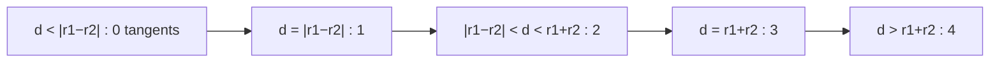
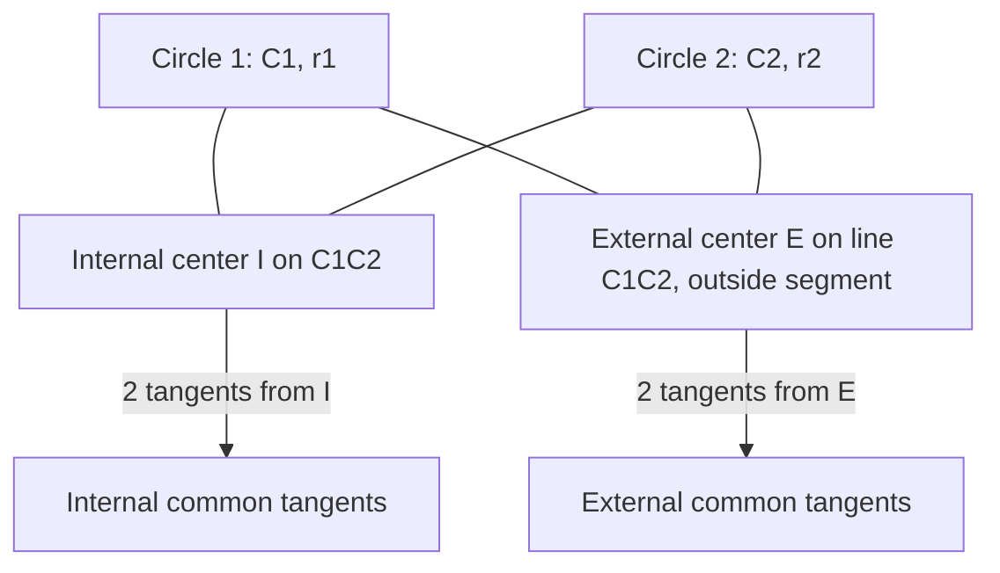

# Circle Tangents — Middle Level

> **One-line summary:** The clean way to compute **common tangents** between two circles is the **signed-distance-`r` formulation**: a tangent is a line `a·x + b·y + c = 0` (with `a²+b²=1`) whose signed distance from center `Cᵢ` equals `σᵢ·rᵢ`. Choosing `σ1=σ2` gives the two **external** tangents, `σ1=−σ2` the two **internal** ones, and the number of real solutions — `0..4` — is governed by the same `d` vs `r1±r2` classification as circle–circle intersection.

---

## Table of Contents

1. [Introduction](#introduction)
2. [Deeper Concepts](#deeper-concepts)
3. [The Signed-Distance-r Formulation](#the-signed-distance-r-formulation)
4. [Deriving the External & Internal Tangents](#deriving-the-external--internal-tangents)
5. [The 0–4 Count, Carefully](#the-04-count-carefully)
6. [Comparison with Alternatives](#comparison-with-alternatives)
7. [The Homothety (Similarity-Center) View](#the-homothety-similarity-center-view)
8. [Code Examples](#code-examples)
9. [Error Handling](#error-handling)
10. [Performance Analysis](#performance-analysis)
11. [Best Practices](#best-practices)
12. [Visual Animation](#visual-animation)
13. [Summary](#summary)

---

## Introduction

> Focus: "Why does the construction work?" and "When do I choose which method?"

At junior level we drew tangents from a point and *counted* common tangents between two circles. Now we derive the common tangents *explicitly* — their actual line equations and touch-points — and we understand *why* the count is exactly `0..4`.

There are three ways to get common tangents, and a middle engineer should know all three and when each shines:

1. **Reduce to tangents-from-a-point.** External tangents of two circles are tangent lines from one circle's *external homothety center* (a single point) to either circle. This is elegant but degenerates when `r1 = r2` (the center flies to infinity).
2. **Shrink-one-circle trick.** Subtract `r2` from both radii: external tangents to `(C1, r1)` and `(C2, r2)` correspond to tangents from `C2` (now a point) to a circle of radius `r1 − r2` around `C1`. Internal tangents use `r1 + r2`. Clean, but still has the equal-radius caveat for externals.
3. **Signed-distance-`r` (the general one).** Solve directly for the line `a·x+b·y+c=0` at signed distance `σᵢrᵢ` from each center. This is the **most robust and most uniform** method: no special case for equal radii, no homothety center, all four tangents from one algebraic template. This file makes it the centerpiece.

The deep reason all three agree: a common tangent is fully determined by the constraint that it sits at distance `rᵢ` (signed) from each of the two centers. Everything else is bookkeeping over the four `(σ1, σ2)` sign combinations.

---

## Deeper Concepts

### Invariant: a tangent is a line at distance r from the center

The defining invariant of *every* tangent line `ℓ` to a circle `(C, r)` is:

```
signed_distance(C, ℓ) = ± r
```

Write `ℓ` in **normal form** `a·x + b·y + c = 0` with the normalization `a² + b² = 1`. Then for any point `Q = (qx, qy)`:

```
signed_distance(Q, ℓ) = a·qx + b·qy + c
```

The sign tells you which side of `ℓ` the point is on; `(a, b)` is the **unit normal** to the line. Tangency to circle `i` is the single scalar equation:

```
a·Cix + b·Ciy + c = σᵢ · rᵢ ,    σᵢ ∈ {+1, −1}.
```

This invariant is what makes the whole topic uniform. A "tangent from an external point `P`" is just the special case where one circle has radius `0` and is centered at `P`.

### Why exactly two tangents per sign-choice

Fix `(σ1, σ2)`. We have two linear equations in three unknowns `(a, b, c)` plus the quadratic normalization `a²+b²=1`. Two linear equations cut the 3-D `(a,b,c)` space down to a line; intersecting that line with the unit cylinder `a²+b²=1` gives a **quadratic**, hence **0, 1, or 2** real solutions. So each of the two sign-classes (external, internal) contributes up to two tangents → up to four total. The discriminant of that quadratic is what flips the count, and it is exactly the `d` vs `r1±r2` condition.

### External vs internal, precisely

- **External (direct):** both centers are on the **same** side of the tangent → same sign of signed distance → `σ1 = σ2`. The line does **not** separate the circles. (Think: outer belt around two pulleys.)
- **Internal (transverse):** the centers are on **opposite** sides → `σ1 = −σ2`. The line passes **between** the circles, crossing segment `C1C2`. (Think: crossed belt.)

### Recurrence-free, but a comparison to circle intersection

There is no recurrence here (it is `O(1)`), but the *parallel* with circle–circle intersection is the structural insight:

```text
Circle ∩ Circle:  number of intersection POINTS is 0/1/2,
                  governed by  d  vs  r1+r2  and  |r1−r2|.

Common TANGENTS: number of tangent LINES is 0..4,
                  governed by  THE SAME  d  vs  r1+r2  and  |r1−r2|.

Duality: as two circles go from nested → tangent → overlapping →
         tangent → separate, intersection points go 0→1→2→1→0,
         while tangent lines go 0→1→2→3→4.
```

---

## The Signed-Distance-r Formulation

Place the two equations side by side:

```
a·C1x + b·C1y + c = σ1 · r1      ... (1)
a·C2x + b·C2y + c = σ2 · r2      ... (2)
a² + b² = 1                       ... (3)  normalization
```

**Eliminate `c`** by subtracting (1) from (2):

```
a·(C2x − C1x) + b·(C2y − C1y) = σ2·r2 − σ1·r1
```

Let `Δ = C2 − C1 = (dx, dy)` and `g = σ2·r2 − σ1·r1`. This is one linear equation:

```
a·dx + b·dy = g ,   with a² + b² = 1.
```

Geometrically: `(a, b)` is a **unit vector** whose dot product with `Δ` equals `g`. That means `(a, b)` makes a fixed angle with `Δ`, and there are (generically) **two** such unit vectors — symmetric about `Δ`. Solve it:

```
Let d = |Δ| = sqrt(dx² + dy²).
The component of (a,b) along Δ is  g / d.
The perpendicular component has magnitude  h = sqrt(1 − (g/d)²)   (real iff |g| ≤ d).

(a, b) =  (g/d²)·(dx, dy)  ±  (h/d)·(−dy, dx)
```

Then recover `c` from equation (1): `c = σ1·r1 − a·C1x − b·C1y`. The line `a·x+b·y+c=0` is your tangent.

**The existence test** `|g| ≤ d` is the entire story:

- External (`σ1=σ2`): `g = ±(r2 − r1)`, so `|g| = |r1 − r2|`. Real iff `|r1−r2| ≤ d` → **externals exist iff the circles are not nested** (one strictly inside the other).
- Internal (`σ1=−σ2`): `g = ±(r1 + r2)`, so `|g| = r1 + r2`. Real iff `r1+r2 ≤ d` → **internals exist iff the circles are separate or externally tangent**.

That is precisely the 0–4 table. No homothety center, no equal-radius blow-up — when `r1=r2`, the external `g = 0`, giving `(a,b) ⟂ Δ` and two parallel tangents, handled by the very same formula.

---

## Deriving the External & Internal Tangents

Putting it together, here is the master routine in pseudocode. For each of the four sign pairs we run the same solve; `h = sqrt(1 − (g/d)²)` becomes `0` at tangency (the two solutions merge) and imaginary when the pair does not exist.

```text
function common_tangents(C1, r1, C2, r2):
    Δ = C2 − C1;  d2 = Δ·Δ;  d = sqrt(d2)
    tangents = []
    for σ1 in {+1, −1}:
        for σ2 in {+1, −1}:
            g = σ1·r1 − σ2·r2            # note sign convention below
            if d2 < g·g − EPS: continue  # no real tangent for this pair
            xn = g / d2                  # along-Δ component (scaled)
            h = sqrt(max(0, d2 − g·g)) / d2
            for sign in {+1, −1}:
                a =  Δ.x·xn + sign·Δ.y·h
                b =  Δ.y·xn − sign·Δ.x·h
                c = σ1·r1 − (a·C1x + b·C1y)   # offset via circle 1
                add line (a, b, c)
                if h < EPS: break        # tangent case: only one line
    dedup and return tangents
```

> Sign-convention note: depending on how you place `σ` on the right-hand side, the labels "external/internal" attach to specific `(σ1, σ2)` pairs. A reliable rule after solving: a tangent is **external** iff both signed distances `a·Cix+b·Ciy+c` have the **same** sign; **internal** iff opposite. Compute the line, then classify by checking the signs — that is immune to convention slips.

**Touch-points** are trivial once you have the line: the touch-point on circle `i` is the foot of the perpendicular from `Cᵢ`, i.e.

```
Tᵢ = Cᵢ − (a·Cix + b·Ciy + c)·(a, b)      # subtract the signed-distance times the unit normal
```

Because `(a, b)` is the unit normal, moving from the center by `−(signed distance)` along it lands exactly on the line, at distance `rᵢ` from `Cᵢ` — the touch-point.

---

## The 0–4 Count, Carefully

Assume WLOG `r1 ≥ r2` and let `d = dist(C1, C2)`.

| Case | Condition | Externals | Internals | Total | Intersection points (dual) |
|------|-----------|:---------:|:---------:|:-----:|:--------------------------:|
| Nested, no touch | `d < r1 − r2` | 0 | 0 | **0** | 0 |
| Internally tangent | `d = r1 − r2` | 1 | 0 | **1** | 1 |
| Overlapping | `r1−r2 < d < r1+r2` | 2 | 0 | **2** | 2 |
| Externally tangent | `d = r1 + r2` | 2 | 1 | **3** | 1 |
| Separate | `d > r1 + r2` | 2 | 1 | **4** | 0 |

Reading the table:

- **Externals** appear as soon as the circles stop being nested (`d ≥ |r1−r2|`). At internal tangency the two externals merge into **one** line through the single contact point.
- **Internals** appear only once the circles separate enough that one is fully outside the other (`d ≥ r1+r2`). At external tangency the two internals merge into **one** line through the contact point.
- The special sub-case `r1 = r2`: externals are always **parallel** (never merge, never meet at a finite point), so the "internally tangent → 1 external" row cannot happen (it requires `d = 0`, i.e. identical circles). Equal-radius circles thus jump from 4 (separate) to 3 (ext. tangent) to 2 (overlap) and bottom out at 2 — they are *never* nested unless identical.



---

## Comparison with Alternatives

Three methods for the **common tangents** of two circles:

| Attribute | Signed-distance-`r` (general) | Homothety center | Shrink-a-circle |
|-----------|:-----------------------------:|:----------------:|:---------------:|
| External tangents | Direct, one template | Tangents from external homothety center | Tangents from `C2` to circle `(C1, r1−r2)` |
| Internal tangents | Same template, flip `σ` | Tangents from internal homothety center | Tangents from `C2` to circle `(C1, r1+r2)` |
| Equal radii (`r1=r2`) | **Works** (gives parallel externals) | **Breaks** (center at ∞) | External part also degenerates |
| Vertical-line safe | Yes (normal form) | Depends on sub-method | Depends on sub-method |
| Lines of code | Moderate (one solver, 4 sign pairs) | Low but with special cases | Low |
| Touch-points | Foot of perpendicular, trivial | Needs back-mapping | Needs back-mapping |
| Numerical robustness | Best (no exploding center) | Worst near `r1≈r2` | Good |

**Choose signed-distance-`r` when:** you want one uniform, robust routine covering all four tangents and all configurations including equal radii. This is the default for production geometry code.

**Choose homothety center when:** you are doing a hand derivation or a problem that *already* hands you the similarity centers, and you know `r1 ≠ r2`.

**Choose shrink-a-circle when:** you already have a well-tested "tangents from a point to a circle" routine and want to reuse it with minimal new code.

And the comparison with the *sibling* operations:

| Operation | Question answered | Output count | Topic |
|-----------|-------------------|:------------:|-------|
| Circle–line intersection | Where does a *given* line meet a circle? | 0/1/2 points | *13-circle-line-intersection* |
| Circle–circle intersection | Where do two circles *cross*? | 0/1/2 points | *14-circle-circle-intersection* |
| **Circle tangents** | Which lines *touch* the circle(s)? | 2 (from a point) or 0..4 (common) | *this topic* |

---

## The Homothety (Similarity-Center) View

A **homothety** is a uniform scaling about a center point. Two circles of different radii are *homothetic*: there exist two special points from which one circle maps onto the other by scaling.

- The **external homothety center** `E` lies on line `C1C2` and divides it **externally** in ratio `r1 : r2`:
  `E = (r2·C1 − r1·C2) / (r2 − r1)` (undefined when `r1 = r2`).
  Every **external** common tangent passes through `E`.
- The **internal homothety center** `I` divides `C1C2` **internally** in ratio `r1 : r2`:
  `I = (r2·C1 + r1·C2) / (r1 + r2)`.
  Every **internal** common tangent passes through `I`.

So an alternative recipe is: compute `E`, draw the two tangents from `E` to either circle (a tangents-from-a-point problem!) — those are the externals. Compute `I`, draw its two tangents — those are the internals.



Why it works: a tangent through a homothety center is mapped to itself by the scaling (it passes through the fixed center), and the scaling maps circle 1 to circle 2, so the line is tangent to both. The catch is `r1 = r2`: external scaling has factor `1` and no finite center, which is exactly why the external tangents become parallel. The signed-distance method has no such catch — yet another reason it is the production default.

---

## Code Examples

### Example: All common tangents via the signed-distance-r method (with touch-points)

#### Go

```go
package main

import (
	"fmt"
	"math"
)

type Pt struct{ X, Y float64 }

// Line a*x + b*y + c = 0 with a²+b²=1, plus the two touch-points and a label.
type Tangent struct {
	A, B, C  float64
	T1, T2   Pt
	External bool
}

const EPS = 1e-9

// CommonTangents returns all 0..4 common tangents of two circles.
func CommonTangents(c1 Pt, r1 float64, c2 Pt, r2 float64) []Tangent {
	dx, dy := c2.X-c1.X, c2.Y-c1.Y
	d2 := dx*dx + dy*dy
	var out []Tangent
	if d2 < EPS { // concentric: no common tangent unless identical (ignored)
		return out
	}
	// Four sign combinations: (σ1,σ2) ∈ {+,-}².
	for _, s1 := range []float64{1, -1} {
		for _, s2 := range []float64{1, -1} {
			g := s1*r1 - s2*r2
			if d2 < g*g-EPS {
				continue // this sign-pair has no real tangent
			}
			xn := g / d2
			h := math.Sqrt(math.Max(0, d2-g*g)) / d2
			for _, sign := range []float64{1, -1} {
				a := dx*xn + sign*dy*h
				b := dy*xn - sign*dx*h
				c := s1*r1 - (a*c1.X + b*c1.Y)
				t1 := foot(c1, a, b, c)
				t2 := foot(c2, a, b, c)
				ext := sameSign(a*c1.X+b*c1.Y+c, a*c2.X+b*c2.Y+c)
				out = append(out, Tangent{a, b, c, t1, t2, ext})
				if h < EPS {
					break // tangent case: single line, not two
				}
			}
		}
	}
	return dedup(out)
}

func foot(p Pt, a, b, c float64) Pt {
	sd := a*p.X + b*p.Y + c // signed distance (a²+b²=1)
	return Pt{p.X - sd*a, p.Y - sd*b}
}

func sameSign(x, y float64) bool { return x*y >= -EPS }

// canon flips the sign so that (a,b,c) and (−a,−b,−c) — the same geometric
// line — compare equal. Without this the four sign-pairs double-count lines.
func canon(t Tangent) Tangent {
	if t.A < -1e-12 || (math.Abs(t.A) < 1e-12 && t.B < 0) {
		t.A, t.B, t.C = -t.A, -t.B, -t.C
	}
	return t
}

func dedup(ts []Tangent) []Tangent {
	var out []Tangent
	for _, t := range ts {
		t = canon(t)
		dup := false
		for _, u := range out {
			if math.Abs(t.A-u.A) < 1e-7 && math.Abs(t.B-u.B) < 1e-7 && math.Abs(t.C-u.C) < 1e-7 {
				dup = true
				break
			}
		}
		if !dup {
			out = append(out, t)
		}
	}
	return out
}

func main() {
	ts := CommonTangents(Pt{0, 0}, 3, Pt{10, 0}, 2)
	fmt.Printf("found %d common tangents (expect 4)\n", len(ts))
	for _, t := range ts {
		kind := "internal"
		if t.External {
			kind = "external"
		}
		fmt.Printf("  %-8s  %.3f x + %.3f y + %.3f = 0\n", kind, t.A, t.B, t.C)
	}
}
```

#### Java

```java
import java.util.*;

public class CommonTangents {
    static final double EPS = 1e-9;
    record Pt(double x, double y) {}
    record Tangent(double a, double b, double c, Pt t1, Pt t2, boolean external) {}

    static List<Tangent> commonTangents(Pt c1, double r1, Pt c2, double r2) {
        double dx = c2.x() - c1.x(), dy = c2.y() - c1.y();
        double d2 = dx * dx + dy * dy;
        List<Tangent> out = new ArrayList<>();
        if (d2 < EPS) return out; // concentric
        for (double s1 : new double[]{1, -1}) {
            for (double s2 : new double[]{1, -1}) {
                double g = s1 * r1 - s2 * r2;
                if (d2 < g * g - EPS) continue;
                double xn = g / d2;
                double h = Math.sqrt(Math.max(0, d2 - g * g)) / d2;
                for (double sign : new double[]{1, -1}) {
                    double a = dx * xn + sign * dy * h;
                    double b = dy * xn - sign * dx * h;
                    double c = s1 * r1 - (a * c1.x() + b * c1.y());
                    Pt t1 = foot(c1, a, b, c), t2 = foot(c2, a, b, c);
                    boolean ext = (a*c1.x()+b*c1.y()+c) * (a*c2.x()+b*c2.y()+c) >= -EPS;
                    out.add(new Tangent(a, b, c, t1, t2, ext));
                    if (h < EPS) break;
                }
            }
        }
        return dedup(out);
    }

    static Pt foot(Pt p, double a, double b, double c) {
        double sd = a * p.x() + b * p.y() + c;
        return new Pt(p.x() - sd * a, p.y() - sd * b);
    }

    // Flip sign so (a,b,c) and (−a,−b,−c) — the same line — compare equal.
    static Tangent canon(Tangent t) {
        if (t.a() < -1e-12 || (Math.abs(t.a()) < 1e-12 && t.b() < 0))
            return new Tangent(-t.a(), -t.b(), -t.c(), t.t1(), t.t2(), t.external());
        return t;
    }

    static List<Tangent> dedup(List<Tangent> ts) {
        List<Tangent> out = new ArrayList<>();
        for (Tangent raw : ts) {
            Tangent t = canon(raw);
            boolean dup = false;
            for (Tangent u : out)
                if (Math.abs(t.a()-u.a())<1e-7 && Math.abs(t.b()-u.b())<1e-7 && Math.abs(t.c()-u.c())<1e-7)
                    { dup = true; break; }
            if (!dup) out.add(t);
        }
        return out;
    }

    public static void main(String[] args) {
        List<Tangent> ts = commonTangents(new Pt(0,0), 3, new Pt(10,0), 2);
        System.out.println("found " + ts.size() + " common tangents (expect 4)");
        for (Tangent t : ts)
            System.out.printf("  %-8s %.3f x + %.3f y + %.3f = 0%n",
                t.external() ? "external" : "internal", t.a(), t.b(), t.c());
    }
}
```

#### Python

```python
import math

EPS = 1e-9


def common_tangents(c1, r1, c2, r2):
    """All 0..4 common tangents as (a, b, c, t1, t2, external)."""
    dx, dy = c2[0] - c1[0], c2[1] - c1[1]
    d2 = dx * dx + dy * dy
    if d2 < EPS:
        return []  # concentric
    out = []
    for s1 in (1, -1):
        for s2 in (1, -1):
            g = s1 * r1 - s2 * r2
            if d2 < g * g - EPS:
                continue
            xn = g / d2
            h = math.sqrt(max(0.0, d2 - g * g)) / d2
            for sign in (1, -1):
                a = dx * xn + sign * dy * h
                b = dy * xn - sign * dx * h
                c = s1 * r1 - (a * c1[0] + b * c1[1])
                t1 = _foot(c1, a, b, c)
                t2 = _foot(c2, a, b, c)
                sd1 = a * c1[0] + b * c1[1] + c
                sd2 = a * c2[0] + b * c2[1] + c
                out.append((a, b, c, t1, t2, sd1 * sd2 >= -EPS))
                if h < EPS:
                    break
    return _dedup(out)


def _foot(p, a, b, c):
    sd = a * p[0] + b * p[1] + c
    return (p[0] - sd * a, p[1] - sd * b)


def _canon(t):
    # Flip sign so (a,b,c) and (−a,−b,−c) — the same line — compare equal.
    a, b, c, t1, t2, ext = t
    if a < -1e-12 or (abs(a) < 1e-12 and b < 0):
        return (-a, -b, -c, t1, t2, ext)
    return t


def _dedup(ts):
    out = []
    for raw in ts:
        t = _canon(raw)
        if not any(abs(t[0]-u[0]) < 1e-7 and abs(t[1]-u[1]) < 1e-7 and abs(t[2]-u[2]) < 1e-7
                   for u in out):
            out.append(t)
    return out


if __name__ == "__main__":
    ts = common_tangents((0, 0), 3, (10, 0), 2)
    print(f"found {len(ts)} common tangents (expect 4)")
    for a, b, c, t1, t2, ext in ts:
        kind = "external" if ext else "internal"
        print(f"  {kind:8s} {a:.3f} x + {b:.3f} y + {c:.3f} = 0")
```

**What it does:** returns every common tangent of two circles, each as a normalized line plus its two touch-points, labeled external or internal.
**Run:** `go run main.go` | `javac CommonTangents.java && java CommonTangents` | `python tangents.py`

---

## Error Handling

| Scenario | What goes wrong | Correct approach |
|----------|-----------------|------------------|
| Concentric circles (`d ≈ 0`) | Division by `d²` blows up | Detect `d² < EPS` early; return no common tangents. |
| Tangent case (`d = r1±r2`) | `h` should be 0 but rounds negative under the `sqrt` | `sqrt(max(0, d²−g²))`; `break` after the single line so you do not emit a phantom duplicate. |
| Equal radii external | Homothety center is at infinity | Use signed-distance method (no center needed); externals come out parallel automatically. |
| Mislabeled external/internal | Sign convention put on the wrong side | Classify *after* solving by `sign(sd1)·sign(sd2)` — same sign ⇒ external. |
| Duplicate lines | At tangency two sign-pairs yield the same line | Deduplicate on `(a, b, c)` with a tolerance. |
| Non-normalized line | Forgot `a²+b²=1` | The solver enforces it by construction; if you build lines elsewhere, normalize before using signed distance. |

---

## Performance Analysis

Everything is `O(1)`: a fixed number of arithmetic operations, a handful of `sqrt`, four sign-pairs each doing constant work. There is nothing to benchmark asymptotically — but you can benchmark the **constant factor** and the **numerical stability** versus method, which is what matters in a tight motion-planning loop that calls this millions of times.

#### Go

```go
package main

import (
	"fmt"
	"math/rand"
	"time"
)

func benchmark() {
	const N = 1_000_000
	pts := make([][4]float64, N) // C2x, C2y, r1, r2 (C1 at origin)
	for i := range pts {
		pts[i] = [4]float64{rand.Float64()*20 - 10, rand.Float64()*20 - 10,
			rand.Float64()*3 + 0.5, rand.Float64()*3 + 0.5}
	}
	start := time.Now()
	total := 0
	for _, p := range pts {
		total += len(CommonTangents(Pt{0, 0}, p[2], Pt{p[0], p[1]}, p[3]))
	}
	el := time.Since(start)
	fmt.Printf("%d pairs in %v  (%.1f ns/pair, %d tangents)\n",
		N, el, float64(el.Nanoseconds())/N, total)
}
```

#### Java

```java
import java.util.concurrent.ThreadLocalRandom;

public class Bench {
    public static void main(String[] args) {
        final int N = 1_000_000;
        var rnd = ThreadLocalRandom.current();
        long start = System.nanoTime();
        long total = 0;
        for (int i = 0; i < N; i++) {
            double x = rnd.nextDouble(-10, 10), y = rnd.nextDouble(-10, 10);
            double r1 = rnd.nextDouble(0.5, 3.5), r2 = rnd.nextDouble(0.5, 3.5);
            total += CommonTangents.commonTangents(
                new CommonTangents.Pt(0,0), r1, new CommonTangents.Pt(x,y), r2).size();
        }
        long el = System.nanoTime() - start;
        System.out.printf("%d pairs in %.3f ms (%.1f ns/pair, %d)%n",
            N, el/1e6, (double)el/N, total);
    }
}
```

#### Python

```python
import random
import time

def benchmark():
    N = 200_000
    cases = [(random.uniform(-10, 10), random.uniform(-10, 10),
              random.uniform(0.5, 3.5), random.uniform(0.5, 3.5)) for _ in range(N)]
    start = time.perf_counter()
    total = sum(len(common_tangents((0, 0), r1, (x, y), r2)) for x, y, r1, r2 in cases)
    el = time.perf_counter() - start
    print(f"{N} pairs in {el*1000:.1f} ms ({el/N*1e9:.0f} ns/pair, {total} tangents)")
```

The takeaway: per-pair time is tens to a few hundred nanoseconds; the only scaling factor is how many circle pairs you process. For a tangent graph over `n` circular obstacles you compute `O(n²)` pairwise tangent sets, so the `O(1)` per pair becomes the inner loop of an `O(n²)` build.

---

## Best Practices

- Default to the **signed-distance-`r`** method; it is the only one with no equal-radius special case.
- **Classify external/internal after solving** using the signs of the two signed distances, not by trusting a sign convention.
- Always emit **touch-points** alongside each line (foot of perpendicular from each center) — downstream code almost always needs them.
- Guard `sqrt` with `max(0, ·)` and `break` on the tangent (`h≈0`) case to avoid duplicate lines.
- Keep external and internal tangents in **separate buckets**; many callers want only one kind (e.g. external tangents for a convex obstacle hull).
- Compare squared distances (`d²` vs `(r1±r2)²`) when you only need the *count*, to skip a `sqrt`.

---

## Visual Animation

> See [`animation.html`](./animation.html) for interactive visualization.
>
> Middle-level animation includes:
> - Two draggable circles with all common tangents recomputed live as you drag
> - External tangents and internal tangents drawn in distinct colors with touch-points
> - The live `d` vs `r1±r2` readout and the resulting 0–4 count
> - A side panel showing the line equations `a·x+b·y+c=0` for each tangent
> - The transition moments (tangency) where the count jumps highlighted

---

## Summary

At middle level, common tangents stop being a count and become a *construction*. The **signed-distance-`r` formulation** — solve `a·Cᵢ + c = σᵢrᵢ` with `a²+b²=1` — is the uniform, robust engine: eliminate `c`, get one linear equation `a·Δ = g` on the unit circle of normals, and read off up to two solutions per sign-pair. `σ1=σ2` yields externals, `σ1=−σ2` internals, and the existence test `|g| ≤ d` reproduces the exact `0..4` classification, dual to circle–circle intersection. The homothety-center and shrink-a-circle methods are good mental models but both stumble on equal radii, which is why the signed-distance method is the production default.

---

**Next step:** [senior.md](./senior.md) — tangent graphs and Dubins paths for shortest motion around circular obstacles, belt/pulley length computations, and engineering tangent code to survive near-degenerate geometry at scale.
